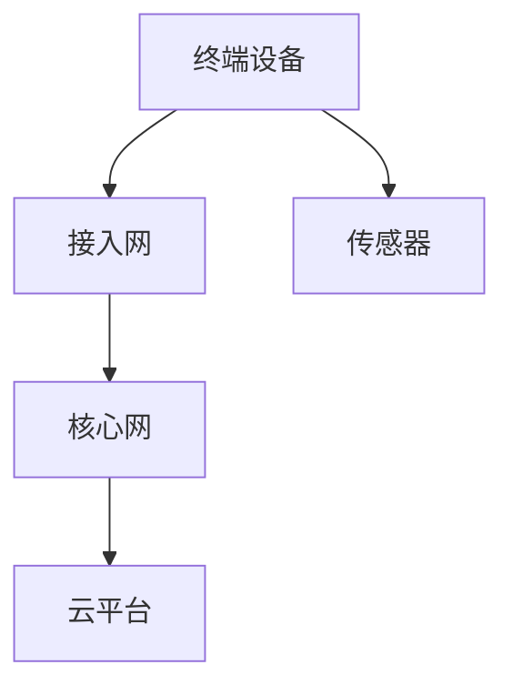

                 

### 5G在工业机器人控制中的应用：柔性制造控制网络

> 关键词：5G，工业机器人控制，柔性制造，网络架构，应用场景，发展趋势

> 摘要：本文详细探讨了5G技术在工业机器人控制中的应用，特别是在实现柔性制造控制网络方面的潜力。文章首先介绍了5G技术的基础，包括其关键特性和网络架构。随后，对工业机器人控制技术进行了概述，并深入分析了柔性制造与控制网络的概念。接着，文章讨论了5G与工业机器人控制的融合应用，并列举了现有案例研究。最后，文章展望了5G在工业机器人控制中的未来发展趋势和面临的挑战。

---

### 引言

#### 5G技术的发展背景

5G（第五代移动通信技术）是继2G、3G、4G之后的新一代移动通信技术。5G技术的研发始于2000年代末期，并逐步进入商业应用阶段。与4G相比，5G在速度、延迟、连接密度和可靠性等方面有显著的提升。5G的关键特性包括高速度、低延迟、高可靠性和大规模连接。

高速度：5G的最大下载速度可达数十Gbps，是4G的百倍以上。这使得数据传输更加迅速，能够支持高清视频流、虚拟现实（VR）和增强现实（AR）等应用。

低延迟：5G的端到端延迟低至1毫秒，远远低于4G的几十毫秒。低延迟对实时控制和交互至关重要，如自动驾驶、工业自动化和远程手术等。

高可靠性：5G通过增强的数据保护和冗余机制，提高了通信的可靠性。这对于工业应用中的数据安全和设备间的稳定通信至关重要。

大规模连接：5G能够同时连接大量设备，支持大规模物联网（IoT）应用。这对于工业机器人控制中的传感器网络和设备互操作极为重要。

#### 工业机器人控制技术的发展

工业机器人控制技术是智能制造的核心组成部分。随着工业4.0和工业互联网的推进，工业机器人控制技术不断演进，从传统的硬编码控制发展到基于人工智能和机器学习的自适应控制。

工业机器人控制技术的基本概念包括：

1. **机器人本体**：由机械结构和驱动系统组成，负责完成各种任务。
2. **传感器**：用于获取环境信息，如视觉、力觉、温度等。
3. **控制器**：负责处理传感器数据，生成控制指令，驱动机器人执行任务。
4. **执行机构**：接收控制器指令，执行机械动作。

工业机器人的控制架构通常包括：

- **开环控制**：控制器根据预设程序生成控制指令，但不反馈实际执行结果。
- **闭环控制**：控制器通过传感器实时获取执行结果，与预设目标进行对比，调整控制指令。

#### 柔性制造与控制网络的概念

柔性制造是指能够快速适应产品变更和生产规模调整的制造系统。与传统的刚性制造系统相比，柔性制造系统具有更高的灵活性和适应性。

控制网络是柔性制造系统的重要组成部分，负责实现设备间的通信和数据交换。控制网络通常采用分布式架构，包括：

- **传感器网络**：用于实时监测生产线状态。
- **执行器网络**：用于驱动机器人执行任务。
- **数据网络**：用于传输传感器数据和执行指令。

控制网络的关键技术包括：

- **物联网（IoT）技术**：实现设备间的互联互通。
- **云计算和大数据技术**：用于数据处理和分析。
- **边缘计算**：在本地进行数据处理，减少网络延迟。

### 用户需求概述

随着工业自动化和智能制造的快速发展，用户对工业机器人控制系统的需求日益增加。以下是用户的主要需求：

1. **实时性**：工业机器人需要在极短的时间内做出反应，以满足高精度和高效率的生产需求。
2. **可靠性**：机器人控制系统必须具有高度的可靠性，以确保生产线的不间断运行。
3. **灵活性**：随着产品种类的多样化和生产规模的调整，机器人控制系统需要能够快速适应变化。
4. **安全性**：机器人控制系统必须能够确保操作人员和设备的安全。
5. **可扩展性**：随着生产线规模的扩大，机器人控制系统需要能够方便地扩展和升级。

### 5G技术基础

#### 5G的关键特性

5G技术的关键特性包括高速度、低延迟、高可靠性和大规模连接。

- **高速度**：5G的最大下载速度可达数十Gbps，比4G快百倍以上。这使得大规模数据传输变得容易，如高清视频流、虚拟现实和增强现实等。
- **低延迟**：5G的端到端延迟低至1毫秒，比4G低得多。低延迟对实时控制和交互至关重要，如自动驾驶、工业自动化和远程手术等。
- **高可靠性**：5G通过增强的数据保护和冗余机制，提高了通信的可靠性。这对于工业应用中的数据安全和设备间的稳定通信至关重要。
- **大规模连接**：5G能够同时连接大量设备，支持大规模物联网（IoT）应用。这对于工业机器人控制中的传感器网络和设备互操作极为重要。

#### 5G的网络架构

5G的网络架构包括接入网、核心网、云平台和终端设备。

- **接入网**：负责连接终端设备和核心网，包括基站、无线接入网络和光纤网络等。
- **核心网**：负责处理用户数据和服务请求，包括无线核心网、移动性管理实体和会话控制实体等。
- **云平台**：提供计算和存储资源，支持大数据分析和机器学习等应用。
- **终端设备**：包括智能手机、平板电脑、工业机器人等，负责数据传输和用户交互。

5G的网络架构图如下所示：



### 工业机器人控制技术

#### 工业机器人的基本概念

工业机器人是一种可以模拟人类动作、执行重复性任务和复杂操作的自动化设备。工业机器人通常由以下几部分组成：

1. **机械结构**：包括手臂、关节、底座等，用于执行物理任务。
2. **驱动系统**：包括电动机、减速器、液压系统等，用于驱动机械结构。
3. **传感器**：包括视觉传感器、力觉传感器、温度传感器等，用于感知环境。
4. **控制器**：负责处理传感器数据，生成控制指令，驱动机械结构。
5. **执行机构**：接收控制器指令，执行物理动作。

工业机器人的主要类型包括：

1. **关节机器人**：具有多个可旋转关节，可以实现多自由度运动。
2. **直角坐标机器人**：具有三个直线运动轴，可以实现三维空间中的定位和运动。
3. **SCARA机器人**：具有两个旋转轴和一个垂直轴，常用于拾取和装配小型零件。

#### 工业机器人的控制架构

工业机器人的控制架构通常包括以下几部分：

1. **传感器模块**：用于实时感知环境和任务状态。
2. **控制器模块**：负责处理传感器数据，生成控制指令。
3. **执行机构模块**：接收控制器指令，执行物理动作。
4. **人机交互模块**：用于操作员与机器人之间的交互。

工业机器人的控制架构可以采用开环控制和闭环控制两种方式：

- **开环控制**：控制器根据预设程序生成控制指令，但不反馈实际执行结果。优点是控制简单、成本低，但缺乏实时性。
- **闭环控制**：控制器通过传感器实时获取执行结果，与预设目标进行对比，调整控制指令。优点是实时性强、精度高，但系统复杂、成本高。

#### 工业机器人控制算法原理

工业机器人控制算法的核心任务是确保机器人按照预期轨迹进行运动，并完成特定任务。常见的控制算法包括：

1. **PID控制算法**：PID（比例-积分-微分）控制算法是一种经典的控制算法，通过调节比例、积分和微分三个参数来控制机器人的运动。

    **PID控制算法伪代码**：
    ```python
    def PID_control(setpoint, process_variable, Kp, Ki, Kd):
        error = setpoint - process_variable
        proportional = Kp * error
        integral = Ki * sum(error) over time
        derivative = Kd * (error - previous_error)
        output = proportional + integral + derivative
        previous_error = error
        return output
    ```

2. **轨迹规划算法**：轨迹规划算法用于生成机器人的运动轨迹，确保其按照预期路径运动。

    **B样条曲线轨迹规划**：
    ```python
    import numpy as np

    def B_spline_trajectory(points, time_points):
        n = len(points) - 1
        t = np.linspace(0, 1, len(time_points))
        B = np.array([[np.linalg.det([[1, t_i], [x_j, t_j]]) for x_j in range(n)] for t_i in range(1, n)])
        P = np.dot(B, points)
        return P
    ```

3. **基于机器学习的控制算法**：基于机器学习的控制算法通过学习机器人运动数据，生成自适应的控制策略。

    **基于神经网络的控制器**：
    ```python
    import tensorflow as tf

    model = tf.keras.Sequential([
        tf.keras.layers.Dense(64, activation='relu', input_shape=(input_shape,)),
        tf.keras.layers.Dense(64, activation='relu'),
        tf.keras.layers.Dense(1)
    ])

    model.compile(optimizer='adam', loss='mean_squared_error')
    model.fit(x_train, y_train, epochs=10)
    ```

### 柔性制造与控制网络

#### 柔性制造的定义与特点

柔性制造是一种能够快速适应产品变更和生产规模调整的制造系统。与传统的刚性制造系统相比，柔性制造系统具有以下特点：

1. **高度灵活**：柔性制造系统能够快速适应不同产品种类的生产，如多品种、小批量生产。
2. **高效率**：柔性制造系统能够提高生产效率，减少生产周期，降低生产成本。
3. **低库存**：柔性制造系统能够减少原材料和成品的库存，降低库存成本。
4. **高度自动化**：柔性制造系统采用先进的自动化技术，如工业机器人、传感器网络和云计算等。

#### 控制网络的架构与功能

控制网络是柔性制造系统的核心，负责实现设备间的通信和数据交换。控制网络的架构通常包括以下部分：

1. **传感器网络**：用于实时监测生产线状态，包括机器状态、物料位置和环境参数等。
2. **执行器网络**：用于驱动工业机器人执行任务，包括机械手臂、夹具和输送装置等。
3. **数据网络**：用于传输传感器数据和执行指令，包括有线网络和无线网络等。
4. **云计算平台**：用于处理和分析大量数据，支持智能决策和优化控制。

控制网络的功能包括：

1. **数据采集**：通过传感器网络实时采集生产线状态数据。
2. **数据处理**：通过云计算平台对采集到的数据进行处理和分析。
3. **决策生成**：根据处理结果生成控制指令，指导工业机器人执行任务。
4. **执行控制**：通过执行器网络将控制指令传递给工业机器人，实现任务执行。

#### 柔性制造中的控制挑战

柔性制造系统中的控制挑战主要包括：

1. **多任务调度**：柔性制造系统需要同时处理多个任务，如何高效调度任务是一个重要挑战。
2. **实时性要求**：柔性制造系统需要实时响应生产线的变化，确保生产连续性和高效性。
3. **数据融合**：传感器网络产生大量数据，如何有效地融合和处理这些数据是一个挑战。
4. **自适应控制**：柔性制造系统需要能够根据生产线的变化自适应调整控制策略。

### 5G与工业机器人控制的融合应用

#### 5G在工业机器人控制中的应用场景

5G技术在工业机器人控制中的应用场景广泛，主要包括：

1. **远程控制**：5G的低延迟和高速度使得工业机器人能够实现远程控制，操作员可以通过远程终端实时监控和控制机器人操作。
2. **实时监控**：5G的高带宽和低延迟使得工业机器人能够实时传输视频、传感器数据等，实现对生产线的实时监控。
3. **大数据分析**：5G的大规模连接能力使得工业机器人能够采集大量数据，通过云计算平台进行大数据分析，实现生产过程的优化。
4. **协同作业**：5G技术支持多台工业机器人协同作业，实现复杂任务的自动化。

#### 5G对工业机器人控制的影响

5G技术对工业机器人控制的影响主要体现在以下几个方面：

1. **实时性提升**：5G的低延迟特性使得工业机器人能够实现实时控制，提高生产效率和产品质量。
2. **数据传输速度提升**：5G的高速度特性使得工业机器人能够快速传输大量数据，支持高清视频流和实时数据分析。
3. **设备互联性增强**：5G的大规模连接能力使得工业机器人能够与其他设备（如传感器、执行器等）实现无缝互联，构建智能工厂。
4. **控制策略优化**：基于5G技术的实时监控和大数据分析，可以优化工业机器人的控制策略，实现更高效的生产过程。

#### 5G与机器人控制融合的技术挑战

5G与机器人控制融合的技术挑战主要包括：

1. **网络延迟优化**：5G虽然具备低延迟特性，但在复杂环境下，仍可能面临网络延迟问题，如何优化网络延迟是一个挑战。
2. **数据安全与隐私保护**：5G技术使得大量数据在网络上传输，如何保障数据安全和隐私保护是一个重要挑战。
3. **网络稳定性**：5G网络在复杂环境下可能面临信号干扰和覆盖不足等问题，如何保障网络稳定性是一个挑战。
4. **系统集成**：如何将5G技术与现有的工业机器人控制系统集成，实现无缝融合，是一个技术挑战。

### 现有案例研究

#### 案例一：5G在汽车制造业中的应用

某汽车制造企业采用了5G技术对生产线进行升级，实现了远程控制、实时监控和大数据分析。

1. **远程控制**：操作员可以通过远程终端实时监控和控制生产线上的工业机器人，提高了生产效率和产品质量。
2. **实时监控**：5G技术使得工业机器人能够实时传输视频和传感器数据，操作员可以实时了解生产线状态，及时处理异常情况。
3. **大数据分析**：5G技术支持大量数据的快速传输和分析，企业可以通过大数据分析优化生产过程，降低生产成本。

#### 案例二：5G在电子制造业中的应用

某电子制造企业采用了5G技术对生产线进行升级，实现了协同作业和实时监控。

1. **协同作业**：5G技术支持多台工业机器人协同作业，提高了生产效率和产品质量。
2. **实时监控**：5G技术使得工业机器人能够实时传输视频和传感器数据，操作员可以实时了解生产线状态，及时处理异常情况。
3. **大数据分析**：5G技术支持大量数据的快速传输和分析，企业可以通过大数据分析优化生产过程，降低生产成本。

#### 案例三：5G在食品加工行业中的应用

某食品加工企业采用了5G技术对生产线进行升级，实现了远程控制和实时监控。

1. **远程控制**：操作员可以通过远程终端实时监控和控制生产线上的工业机器人，提高了生产效率和产品质量。
2. **实时监控**：5G技术使得工业机器人能够实时传输视频和传感器数据，操作员可以实时了解生产线状态，及时处理异常情况。
3. **大数据分析**：5G技术支持大量数据的快速传输和分析，企业可以通过大数据分析优化生产过程，降低生产成本。

### 5G在工业机器人控制中的未来发展趋势

#### 5G技术的未来发展趋势

5G技术在未来将继续发展，预计将达到以下几个目标：

1. **更高速度**：随着新技术的引入，5G的速度将进一步提升，达到数百Gbps甚至Tbps级别。
2. **更低延迟**：通过优化网络架构和算法，5G的延迟将进一步降低，达到亚毫秒级别。
3. **更高可靠性**：5G将通过引入新的数据保护和冗余机制，提高通信的可靠性。
4. **更大规模连接**：5G将支持更大规模的设备连接，实现真正的物联网（IoT）应用。

#### 工业机器人控制技术的未来

工业机器人控制技术在未来将继续发展，预计将达到以下几个趋势：

1. **更智能的控制系统**：基于人工智能和机器学习技术的控制系统将逐渐取代传统的PID控制，实现更高效的机器人控制。
2. **更灵活的机器人架构**：模块化、可扩展的机器人架构将逐渐取代传统的固定架构，实现更灵活的机器人应用。
3. **更先进的协作机器人**：协作机器人将逐渐取代传统的工业机器人，实现与人类更紧密的协作。

#### 柔性制造与控制网络的前景

柔性制造与控制网络在未来将继续发展，预计将达到以下几个趋势：

1. **更广泛的工业应用**：柔性制造与控制网络将在更多行业中得到应用，如医疗、物流和农业等。
2. **更高效的制造过程**：基于5G技术的柔性制造与控制网络将实现更高效的生产过程，降低生产成本。
3. **更智能的制造生态系统**：基于人工智能和大数据技术的制造生态系统将逐渐形成，实现智能制造的全面升级。

### 挑战与展望

#### 5G在工业机器人控制中的应用挑战

5G技术在工业机器人控制中的应用面临以下挑战：

1. **网络延迟优化**：虽然5G具备低延迟特性，但在复杂环境下，网络延迟可能仍然较高，如何优化网络延迟是一个挑战。
2. **数据安全与隐私保护**：5G技术使得大量数据在网络上传输，如何保障数据安全和隐私保护是一个重要挑战。
3. **网络稳定性**：5G网络在复杂环境下可能面临信号干扰和覆盖不足等问题，如何保障网络稳定性是一个挑战。
4. **系统集成**：如何将5G技术与现有的工业机器人控制系统集成，实现无缝融合，是一个技术挑战。

#### 技术标准与法规的挑战

5G技术在工业机器人控制中的应用还需要克服以下技术标准与法规的挑战：

1. **统一的技术标准**：目前，5G技术尚未形成统一的技术标准，不同厂商的产品可能存在兼容性问题。
2. **法规和规范**：5G技术在工业机器人控制中的应用需要遵守相关法规和规范，如网络安全、数据保护等。

#### 未来发展的展望与建议

针对5G在工业机器人控制中的应用，以下是一些建议：

1. **加强技术研发**：企业和研究机构应加大5G技术在工业机器人控制领域的研发投入，推动技术创新。
2. **推进标准制定**：政府和行业协会应积极推进5G技术在工业机器人控制领域的标准制定，确保技术的统一和兼容。
3. **加强人才培养**：加强5G技术在工业机器人控制领域的专业人才培养，为技术发展提供人才保障。

### 结束语

5G技术在工业机器人控制中的应用前景广阔，但同时也面临诸多挑战。通过加强技术研发、制定标准和人才培养，我们有望推动5G技术在工业机器人控制领域的广泛应用，实现智能制造的全面升级。作者：AI天才研究院/AI Genius Institute & 禅与计算机程序设计艺术 /Zen And The Art of Computer Programming

