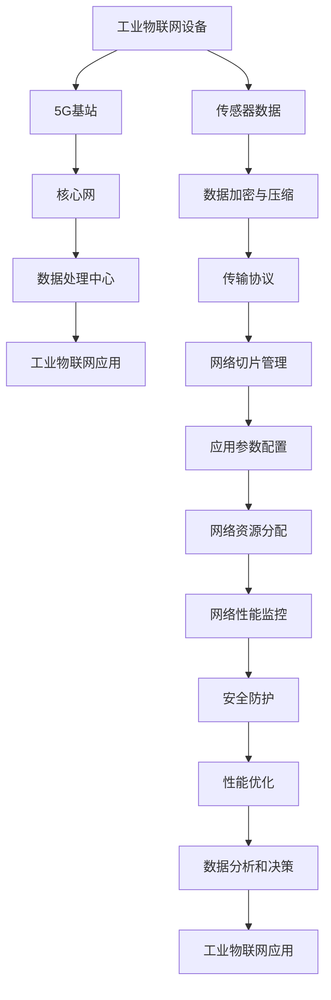

                 

# 5G在工业物联网中的应用：实现大规模设备互联

> 关键词：5G、工业物联网、大规模设备互联、网络切片、边缘计算、低延迟

> 摘要：本文深入探讨了5G技术在工业物联网（IIoT）中的应用，阐述了5G网络如何实现大规模设备的互联，提升工业生产效率。通过分析5G网络的关键技术特点、工业物联网的核心概念以及大规模设备互联的挑战与解决方案，本文为读者提供了5G在工业物联网中实现大规模设备互联的全面指南。

## 第一部分：5G与工业物联网概述

### 第1章：5G技术基础

#### 1.1 5G网络的基本概念

##### 1.1.1 5G网络的发展背景

5G网络是第五代移动通信技术的简称，它是继1G模拟通信、2G数字通信、3G多媒体通信和4G高速数据通信之后的新一代移动通信技术。随着互联网技术的快速发展，人们对于数据传输速度、连接稳定性和网络容量的需求日益增长。5G网络旨在提供更高的数据传输速度、更低的延迟和更大的网络容量，以满足未来数字经济和社会的多样化需求。

##### 1.1.2 5G网络的关键技术特点

5G网络具有以下关键技术特点：

- **更高的数据传输速度**：5G网络的下载速度可达到1000 Mbps以上，是4G网络的10倍以上。
- **更低的延迟**：5G网络的端到端延迟可低至1 ms，比4G网络的延迟缩短了约90%。
- **更大的网络容量**：5G网络能够支持数百万设备的并发连接，为大规模物联网应用提供了基础。
- **网络切片技术**：5G网络引入了网络切片技术，可以根据不同应用场景的需求，灵活分配网络资源。

#### 1.2 5G网络架构

##### 1.2.1 5G网络架构概述

5G网络架构主要包括以下三个部分：

- **核心网**：负责处理用户数据、控制信令和数据存储等功能。
- **无线接入网**：包括基站、天线和无线接入设备，负责无线信号的传输和接收。
- **用户平面**：包括数据传输通道和网络接口，负责用户数据的传输和处理。

##### 1.2.2 核心网、无线接入网和用户平面

- **核心网**：5G核心网采用了服务化架构，支持网络功能虚拟化和容器化，可以灵活部署和扩展。
- **无线接入网**：5G无线接入网采用了多连接技术，支持多种无线接入技术，如毫米波、sub-6 GHz等。
- **用户平面**：5G用户平面采用了基于IP的数据传输架构，支持不同类型的用户数据传输。

##### 1.2.3 5G网络的关键组件

5G网络的关键组件包括：

- **基站**：负责无线信号的传输和接收。
- **天线**：负责无线信号的发射和接收。
- **用户设备**：包括智能手机、平板电脑、物联网设备等。
- **网络控制器**：负责网络资源的分配和管理。

#### 1.3 5G在工业物联网中的应用潜力

##### 1.3.1 工业物联网的定义与发展

工业物联网（IIoT）是指将物理设备、传感器、控制系统和互联网技术相结合，实现设备之间的互联互通，提升工业生产效率的一种新型生产模式。随着5G网络的不断发展，工业物联网的应用场景日益丰富，包括智能制造、无人驾驶、智慧城市等领域。

##### 1.3.2 5G技术在工业物联网中的应用场景

5G技术在工业物联网中的应用场景主要包括：

- **智能制造**：5G网络可以支持大规模设备的互联，实现设备间的实时通信和数据共享，提升生产效率。
- **无人驾驶**：5G网络可以为无人驾驶车辆提供低延迟、高带宽的网络连接，实现精准的车辆控制和导航。
- **智慧城市**：5G网络可以支持城市中各种智能设备的互联，实现城市管理的智能化和精细化。

### 第2章：工业物联网的核心概念

#### 2.1 工业物联网的组成

##### 2.1.1 物联网传感器与设备

物联网传感器与设备是工业物联网的基础，包括各类传感器、执行器、控制器等。它们通过无线或有线的方式连接到互联网，实现设备之间的互联互通。

##### 2.1.2 数据处理与存储

数据处理与存储是工业物联网的核心，包括数据采集、传输、处理和存储等环节。通过大数据分析和人工智能技术，可以实现对海量数据的深度挖掘和应用。

##### 2.1.3 网络通信与传输

网络通信与传输是工业物联网的关键，包括无线通信、有线通信和网络传输协议等。5G网络的高带宽、低延迟特性为工业物联网提供了强大的通信支持。

#### 2.2 工业物联网的数据处理

##### 2.2.1 数据采集与传输

数据采集与传输是工业物联网数据处理的第一步，包括传感器数据的采集、预处理和传输等环节。通过高效的传输协议，可以确保数据的实时性和准确性。

##### 2.2.2 数据清洗与预处理

数据清洗与预处理是确保数据质量的重要环节，包括数据去重、去噪、标准化和归一化等操作。通过数据清洗与预处理，可以消除数据中的异常值和噪声，提高数据的可靠性和可用性。

##### 2.2.3 数据分析与挖掘

数据分析与挖掘是工业物联网数据处理的最后一步，包括数据可视化、特征提取、模式识别和预测等操作。通过数据分析和挖掘，可以提取数据中的有价值信息，为决策提供支持。

#### 2.3 工业物联网的安全与隐私保护

##### 2.3.1 安全架构与措施

工业物联网的安全架构包括身份认证、访问控制、数据加密和防火墙等安全措施。通过建立完善的安全架构，可以确保工业物联网系统的安全稳定运行。

##### 2.3.2 数据隐私保护策略

数据隐私保护策略是确保用户数据不被泄露和滥用的关键。通过数据匿名化、加密和访问控制等手段，可以有效地保护用户数据的安全和隐私。

## 第二部分：5G在工业物联网中的应用

### 第3章：5G网络在工业物联网中的连接

#### 3.1 5G网络在工业物联网中的连接架构

##### 3.1.1 5G网络连接的基本原理

5G网络连接的基本原理是利用5G基站和终端设备之间的无线通信，实现数据传输和控制信号的交换。5G网络支持多种接入方式，包括蜂窝网络、无线局域网和广域网等。

##### 3.1.2 5G网络连接的关键技术

5G网络连接的关键技术包括：

- **多连接技术**：5G网络支持多连接技术，可以同时连接多个设备，提高网络的连接容量和可靠性。
- **网络切片技术**：5G网络切片技术可以将一个物理网络划分为多个逻辑网络，为不同应用场景提供定制化的网络服务。
- **边缘计算技术**：5G边缘计算技术可以将部分计算任务卸载到网络边缘，降低数据传输延迟，提高网络性能。

#### 3.2 5G网络在工业物联网中的应用案例

##### 3.2.1 智能制造

5G网络在智能制造中的应用主要包括：

- **设备互联**：通过5G网络实现生产设备的互联，实现设备间的实时通信和数据共享，提高生产效率。
- **远程控制**：通过5G网络实现生产设备的远程控制，提高设备的灵活性和可维护性。
- **数据采集与分析**：通过5G网络实现生产数据的实时采集和分析，为生产过程优化提供数据支持。

##### 3.2.2 无人驾驶

5G网络在无人驾驶中的应用主要包括：

- **实时通信**：通过5G网络实现车辆与车辆、车辆与基础设施之间的实时通信，提高无人驾驶的安全性和效率。
- **高精度定位**：通过5G网络实现高精度定位，提高无人驾驶的准确性和稳定性。
- **远程控制**：通过5G网络实现无人驾驶车辆的远程控制，提高车辆的灵活性和安全性。

##### 3.2.3 智慧城市

5G网络在智慧城市中的应用主要包括：

- **智能监控**：通过5G网络实现城市监控设备的互联互通，提高城市管理的效率和智能化水平。
- **智能交通**：通过5G网络实现交通设备的互联和智能调度，提高城市交通的效率和安全性。
- **智能安防**：通过5G网络实现安防设备的互联互通，提高城市安全管理的效率和智能化水平。

## 第三部分：大规模设备互联的实现

### 第4章：5G网络在工业物联网中的数据传输

#### 4.1 5G网络在工业物联网中的数据传输特点

##### 4.1.1 低延迟与高速传输

5G网络在工业物联网中的数据传输特点主要包括低延迟和高速传输：

- **低延迟**：5G网络的端到端延迟可低至1 ms，比4G网络的延迟缩短了约90%。这对于实时性要求较高的工业物联网应用具有重要意义。
- **高速传输**：5G网络的下载速度可达到1000 Mbps以上，是4G网络的10倍以上。这为工业物联网中的大规模数据传输提供了强大的支持。

##### 4.1.2 高可靠性与高带宽

5G网络在工业物联网中的数据传输特点还包括高可靠性和高带宽：

- **高可靠性**：5G网络通过引入多连接技术和网络切片技术，可以提高网络的可靠性和稳定性，确保工业物联网系统的正常运行。
- **高带宽**：5G网络的高带宽特性可以支持大规模设备的并发连接，为工业物联网中的海量数据传输提供了充足的空间。

#### 4.2 5G网络在工业物联网中的数据传输优化

##### 4.2.1 数据传输优化策略

5G网络在工业物联网中的数据传输优化策略主要包括：

- **数据压缩与加密**：通过数据压缩和加密技术，可以降低数据传输的带宽占用和安全性风险。
- **数据缓存与预取**：通过数据缓存和预取技术，可以减少数据传输的延迟，提高数据传输的效率。
- **流量管理**：通过流量管理技术，可以优化网络资源的分配，确保关键数据的优先传输。

##### 4.2.2 网络切片技术

网络切片技术是5G网络的一项关键技术，可以针对不同应用场景的需求，灵活分配网络资源。在工业物联网中，网络切片技术可以用于：

- **个性化网络服务**：为不同类型的设备提供个性化的网络服务，满足其特定的需求。
- **资源隔离**：通过网络切片技术，可以实现不同应用场景之间的资源隔离，提高网络的稳定性和可靠性。
- **网络优化**：通过网络切片技术，可以针对特定应用场景进行网络优化，提高数据传输的效率和质量。

### 第5章：5G网络在工业物联网中的网络安全

#### 5.1 5G网络在工业物联网中的安全挑战

##### 5.1.1 安全威胁与风险

5G网络在工业物联网中的安全挑战主要包括以下安全威胁和风险：

- **网络攻击**：黑客可以通过网络攻击手段，非法获取工业物联网设备的控制权，导致生产过程失控。
- **数据泄露**：黑客可以通过窃取数据，非法获取工业物联网设备的关键信息，对企业和个人造成损失。
- **设备篡改**：黑客可以通过篡改设备固件，使设备失效或误操作，导致生产过程中断。

##### 5.1.2 安全攻击案例分析

以下是几个5G网络在工业物联网中的安全攻击案例分析：

- **勒索软件攻击**：黑客通过勒索软件攻击，锁定工业物联网设备，要求支付赎金才能解锁。
- **中间人攻击**：黑客通过中间人攻击，截获和篡改工业物联网设备之间的通信数据。
- **拒绝服务攻击**：黑客通过拒绝服务攻击，使工业物联网设备无法正常通信，导致生产过程中断。

#### 5.2 5G网络在工业物联网中的安全解决方案

##### 5.2.1 安全防护架构

5G网络在工业物联网中的安全防护架构主要包括以下方面：

- **身份认证**：通过身份认证技术，确保只有授权用户才能访问工业物联网设备。
- **访问控制**：通过访问控制技术，限制非授权用户对工业物联网设备的访问权限。
- **数据加密**：通过数据加密技术，确保工业物联网设备之间的通信数据不会被泄露和篡改。

##### 5.2.2 安全措施与策略

5G网络在工业物联网中的安全措施与策略主要包括以下方面：

- **安全监测与预警**：通过安全监测与预警技术，实时监测工业物联网设备的运行状态，及时发现和应对安全威胁。
- **安全审计与追踪**：通过安全审计与追踪技术，记录工业物联网设备的安全事件，为后续的安全分析和处置提供依据。
- **安全培训与教育**：通过安全培训与教育，提高工业物联网设备使用者的安全意识和技能，减少人为安全风险。

## 第四部分：大规模设备互联的实现

### 第6章：工业物联网中的大规模设备互联

#### 6.1 大规模设备互联的挑战与解决方案

##### 6.1.1 网络容量与性能

大规模设备互联面临的第一个挑战是网络容量与性能。随着物联网设备的数量不断增多，网络容量和性能成为关键问题。解决方案包括：

- **多连接技术**：通过多连接技术，实现设备间的多路径传输，提高网络的容量和性能。
- **网络优化算法**：通过网络优化算法，动态调整网络资源分配，确保网络的高效运行。

##### 6.1.2 设备管理

大规模设备互联面临的第二个挑战是设备管理。随着设备数量的增加，设备管理的复杂度也大幅提升。解决方案包括：

- **设备身份认证**：通过设备身份认证技术，确保设备的安全接入。
- **设备监控与维护**：通过设备监控与维护技术，实时监控设备状态，及时进行故障处理和维护。

##### 6.1.3 数据处理与存储

大规模设备互联面临的第三个挑战是数据处理与存储。随着设备数量和种类增多，数据处理和存储的需求也大幅提升。解决方案包括：

- **分布式数据处理**：通过分布式数据处理技术，将数据处理任务分配到多个节点，提高数据处理效率。
- **云存储技术**：通过云存储技术，实现海量数据的存储和高效访问。

#### 6.2 大规模设备互联的技术实现

##### 6.2.1 LPWAN技术

LPWAN（低功耗广域网）技术是一种适用于大规模设备互联的低功耗、低成本的通信技术。其特点包括：

- **低功耗**：LPWAN技术采用低功耗设计，可以延长设备电池寿命，降低设备维护成本。
- **广覆盖**：LPWAN技术采用低频段通信，可以实现广覆盖，适用于大型工业场景。
- **低延迟**：LPWAN技术采用多连接技术，可以实现低延迟通信，满足实时性要求。

##### 6.2.2 边缘计算

边缘计算是一种将计算任务从云端转移到网络边缘的技术。在工业物联网中，边缘计算可以提供以下优势：

- **低延迟**：通过在边缘节点进行计算，可以减少数据传输延迟，满足实时性要求。
- **高可靠性**：通过在边缘节点进行计算，可以提高网络的可靠性，降低故障风险。
- **节能降耗**：通过在边缘节点进行计算，可以减少数据传输量，降低能耗。

##### 6.2.3 网络虚拟化

网络虚拟化是一种将物理网络资源抽象为虚拟网络资源的技术。在工业物联网中，网络虚拟化可以提供以下优势：

- **灵活部署**：通过网络虚拟化技术，可以灵活部署虚拟网络，满足不同应用场景的需求。
- **资源隔离**：通过网络虚拟化技术，可以实现不同应用场景之间的资源隔离，提高网络的安全性。
- **高效管理**：通过网络虚拟化技术，可以实现对网络资源的统一管理和调度，提高网络运行效率。

#### 6.3 大规模设备互联的应用案例

##### 6.3.1 智能制造

智能制造是大规模设备互联的重要应用场景。通过5G网络和物联网技术，可以实现：

- **设备互联**：通过5G网络实现生产设备的互联，实现设备间的实时通信和数据共享。
- **数据采集与分析**：通过物联网传感器采集生产数据，通过5G网络传输到云端进行分析，为生产过程优化提供支持。
- **远程控制**：通过5G网络实现生产设备的远程控制，提高设备的灵活性和可维护性。

##### 6.3.2 智能农业

智能农业是大规模设备互联的另一个重要应用场景。通过5G网络和物联网技术，可以实现：

- **土壤监测**：通过物联网传感器监测土壤湿度、温度等参数，通过5G网络传输到云端进行分析，为农业生产提供数据支持。
- **智能灌溉**：通过物联网控制器控制灌溉设备，根据土壤监测数据自动调节灌溉量，提高农业生产效率。
- **无人机监测**：通过5G网络实现无人机对农田的实时监测，通过物联网传感器采集农田数据，为农业生产提供数据支持。

##### 6.3.3 智慧能源

智慧能源是大规模设备互联的另一个重要应用场景。通过5G网络和物联网技术，可以实现：

- **智能电网**：通过5G网络实现电力设备的互联，实现电力系统的实时监测和智能调度。
- **智能充电**：通过物联网传感器监测充电设备的运行状态，通过5G网络传输到云端进行分析，为充电设备的优化提供支持。
- **智能运维**：通过5G网络实现电力设备的远程监控和维护，提高电力系统的可靠性和安全性。

### 第7章：未来展望与趋势

#### 7.1 5G在工业物联网中的应用前景

随着5G技术的不断成熟和普及，5G在工业物联网中的应用前景十分广阔。未来，5G技术将进一步提升工业物联网的性能和可靠性，为工业生产带来更多创新和变革。

#### 7.1.1 技术发展展望

未来，5G技术在工业物联网中的应用将向以下几个方面发展：

- **更高带宽和更低延迟**：未来5G技术将进一步提升网络带宽和降低延迟，为工业物联网提供更强大的通信支持。
- **更多应用场景**：随着5G技术的不断发展，工业物联网的应用场景将更加丰富，包括智能制造、智能交通、智能医疗等。
- **更高效的数据处理**：未来5G技术将引入更多高效的数据处理技术，包括边缘计算、云计算等，为工业物联网提供更强大的数据处理能力。

#### 7.1.2 应用领域扩展

未来，5G技术在工业物联网中的应用领域将不断扩展，包括：

- **工业自动化**：5G技术将推动工业自动化向更高水平发展，实现更智能、更高效的生产过程。
- **智慧城市**：5G技术将推动智慧城市建设，实现城市管理的智能化和精细化。
- **智慧医疗**：5G技术将推动智慧医疗发展，实现医疗服务的远程化和智能化。

#### 7.2 工业物联网与5G技术融合的趋势

未来，工业物联网与5G技术的融合将呈现以下趋势：

- **深度融合**：工业物联网和5G技术将深度融合，共同推动工业生产和通信技术的创新发展。
- **协同创新**：工业物联网和5G技术将相互协同，共同推动各个领域的创新发展，实现互利共赢。
- **开放合作**：未来，工业物联网和5G技术将更加开放合作，形成完整的产业生态，推动产业链的协同发展。

#### 7.3 未来的挑战与机遇

未来，5G技术在工业物联网中的应用将面临一系列挑战和机遇：

- **技术挑战**：5G技术在工业物联网中的应用仍面临一系列技术挑战，包括网络性能、数据安全、设备兼容性等。
- **政策法规**：未来，5G技术在工业物联网中的应用将面临政策法规的约束和挑战，需要不断优化和完善相关政策和法规。
- **市场机遇**：随着5G技术的不断成熟和普及，工业物联网市场将迎来巨大的发展机遇，为相关产业带来广阔的市场空间。

### 总结

5G技术在工业物联网中的应用具有广阔的前景和巨大的潜力。通过实现大规模设备的互联，5G技术将进一步提升工业生产的效率和质量，为工业物联网的发展注入新的活力。未来，随着5G技术的不断成熟和普及，工业物联网将迎来更加广阔的发展空间，为各个领域带来更多的创新和变革。作者：AI天才研究院/AI Genius Institute & 禅与计算机程序设计艺术 /Zen And The Art of Computer Programming。

---

#### 第1章：5G技术基础

在现代社会，移动通信技术已经深入到了我们生活的方方面面，而5G（第五代移动通信技术）的问世更是将这一技术的发展推向了一个新的高峰。本章将深入探讨5G网络的基本概念、关键技术和应用潜力，帮助读者了解5G技术在工业物联网中的重要地位。

##### 1.1 5G网络的基本概念

##### 1.1.1 5G网络的发展背景

1G时代，移动通信技术主要采用模拟信号传输，只能实现基础的语音通信。随着数字通信技术的发展，2G网络问世，支持短信和基本数据传输。3G网络则进一步提升了数据传输速度，支持多媒体通信。4G网络在2010年代初期普及，大幅提升了数据传输速度和网络容量，满足了移动互联网的爆发需求。然而，随着物联网、云计算、人工智能等新兴技术的快速发展，现有通信网络已经无法满足日益增长的数据传输需求和实时通信需求，因此，5G网络的研发和应用成为必然趋势。

##### 1.1.2 5G网络的关键技术特点

5G网络具有以下关键技术特点：

- **更高的数据传输速度**：5G网络的下载速度可达到1000 Mbps以上，是4G网络的10倍以上，满足高清视频流、虚拟现实等高速数据传输需求。
- **更低的延迟**：5G网络的端到端延迟可低至1 ms，比4G网络的延迟缩短了约90%，实现实时通信和低延迟应用，如自动驾驶、远程医疗等。
- **更大的网络容量**：5G网络能够支持数百万设备的并发连接，为大规模物联网应用提供了基础。
- **网络切片技术**：5G网络切片技术可以将一个物理网络划分为多个逻辑网络，为不同应用场景提供定制化的网络服务，提升网络资源利用率。
- **多连接技术**：5G网络支持多连接技术，即一个设备可以同时连接多个网络，提高网络连接的可靠性和稳定性。

##### 1.2 5G网络架构

##### 1.2.1 5G网络架构概述

5G网络架构主要包括以下三个部分：

- **核心网**：负责处理用户数据、控制信令和数据存储等功能。
- **无线接入网**：包括基站、天线和无线接入设备，负责无线信号的传输和接收。
- **用户平面**：包括数据传输通道和网络接口，负责用户数据的传输和处理。

##### 1.2.2 核心网、无线接入网和用户平面

- **核心网**：5G核心网采用了服务化架构，支持网络功能虚拟化和容器化，可以灵活部署和扩展。
- **无线接入网**：5G无线接入网采用了多连接技术，支持多种无线接入技术，如毫米波、sub-6 GHz等。
- **用户平面**：5G用户平面采用了基于IP的数据传输架构，支持不同类型的用户数据传输。

##### 1.2.3 5G网络的关键组件

5G网络的关键组件包括：

- **基站**：负责无线信号的传输和接收。
- **天线**：负责无线信号的发射和接收。
- **用户设备**：包括智能手机、平板电脑、物联网设备等。
- **网络控制器**：负责网络资源的分配和管理。

##### 1.3 5G在工业物联网中的应用潜力

##### 1.3.1 工业物联网的定义与发展

工业物联网（IIoT）是指将物理设备、传感器、控制系统和互联网技术相结合，实现设备之间的互联互通，提升工业生产效率的一种新型生产模式。随着5G网络的不断发展，工业物联网的应用场景日益丰富，包括智能制造、无人驾驶、智慧城市等领域。

##### 1.3.2 5G技术在工业物联网中的应用场景

5G技术在工业物联网中的应用场景主要包括：

- **智能制造**：5G网络可以支持大规模设备的互联，实现设备间的实时通信和数据共享，提升生产效率。
- **无人驾驶**：5G网络可以为无人驾驶车辆提供低延迟、高带宽的网络连接，实现精准的车辆控制和导航。
- **智慧城市**：5G网络可以支持城市中各种智能设备的互联，实现城市管理的智能化和精细化。

## 2.1 工业物联网的组成

工业物联网（IIoT）是由多种技术组成的复杂系统，其核心目的是通过设备互联和数据交换，提高工业生产的效率和质量。要实现这一目标，工业物联网通常包括以下几个关键组成部分：

##### 2.1.1 物联网传感器与设备

物联网传感器是工业物联网的“感官”，它们负责收集来自工业环境的各种数据，如温度、湿度、压力、振动等。这些传感器可以安装在生产线上的各种设备中，如机器、机器人、输送带等，它们通过无线或有线的方式连接到网络。

- **传感器类型**：温度传感器、湿度传感器、压力传感器、振动传感器等。
- **设备类型**：智能传感器、执行器、控制器、数据采集器等。

##### 2.1.2 数据处理与存储

数据处理与存储是工业物联网的核心环节，负责对采集到的海量数据进行处理、存储和管理。

- **数据处理**：包括数据清洗、数据转换、数据聚合等，以确保数据的质量和可用性。
- **数据存储**：利用数据库、数据仓库等技术，存储和处理大规模数据集，如时间序列数据、事务数据等。

##### 2.1.3 网络通信与传输

网络通信与传输是工业物联网的数据流动通道，负责将传感器收集的数据传输到数据处理中心或云端。

- **传输协议**：如MQTT、CoAP、HTTP等，这些协议适用于物联网环境，能够高效地传输数据。
- **网络类型**：包括有线网络（如以太网、光纤）和无线网络（如Wi-Fi、LPWAN、5G等）。

### 2.2 工业物联网的数据处理

##### 2.2.1 数据采集与传输

数据采集与传输是工业物联网数据处理的第一步，这一过程涉及到以下几个方面：

- **数据采集**：传感器将实时监测的数据发送到数据采集器，数据采集器再将数据发送到中央系统。
- **数据传输**：数据采集器通过有线或无线网络将数据传输到数据处理中心或云端。

#### 2.2.2 数据清洗与预处理

数据清洗与预处理是确保数据质量的重要环节，这一过程包括以下几个步骤：

- **数据去重**：去除重复的数据记录，确保数据的唯一性。
- **数据去噪**：去除异常值和噪声，提高数据的有效性和准确性。
- **数据标准化**：将数据转换成统一格式，便于后续处理和分析。

##### 2.2.3 数据分析与挖掘

数据分析与挖掘是工业物联网数据处理的核心环节，通过这一过程可以提取数据中的有价值信息，为工业生产优化提供支持。数据分析与挖掘主要包括以下几个步骤：

- **数据可视化**：通过图表、图形等方式，将数据以直观的形式展示出来。
- **特征提取**：从数据中提取有用的特征，用于后续的分析和建模。
- **模式识别**：通过机器学习算法，识别数据中的规律和模式，如异常检测、预测分析等。

### 2.3 工业物联网的安全与隐私保护

##### 2.3.1 安全架构与措施

工业物联网的安全架构需要涵盖从设备端到云端的所有环节，以保障数据的安全和系统的稳定性。以下是一些关键的安全架构与措施：

- **身份认证**：确保只有授权用户和设备可以访问系统，通常采用密码、指纹、智能卡等认证方式。
- **访问控制**：限制用户和设备的访问权限，确保数据在传输和存储过程中的安全性。
- **数据加密**：对数据进行加密处理，防止数据在传输和存储过程中被窃取或篡改。
- **防火墙和入侵检测系统**：在网络边界设置防火墙，监控网络流量，检测和阻止潜在的安全威胁。

##### 2.3.2 数据隐私保护策略

数据隐私保护是工业物联网中一个重要的问题，特别是在涉及个人和敏感数据时。以下是一些数据隐私保护策略：

- **数据匿名化**：对数据进行匿名化处理，确保无法通过数据识别个人身份。
- **数据加密与签名**：对数据进行加密和数字签名，确保数据在传输和存储过程中的完整性和可验证性。
- **访问审计**：记录用户的访问行为，用于后续的安全审计和追踪。
- **合规性检查**：确保系统的设计和实施符合相关法律法规和行业标准，如GDPR、ISO 27001等。

## 第3章：5G网络在工业物联网中的连接

5G网络作为新一代移动通信技术，其高带宽、低延迟和高可靠性的特点使其在工业物联网（IIoT）中具有广泛的应用前景。本章将深入探讨5G网络在工业物联网中的连接架构、应用案例以及其独特的优势。

### 3.1 5G网络在工业物联网中的连接架构

5G网络的连接架构是构建高效、可靠工业物联网系统的关键。5G网络连接架构主要包括以下几个方面：

#### 3.1.1 基站与终端设备

基站是5G网络的核心节点，负责无线信号的传输和接收。终端设备包括工业传感器、控制器、执行器等，它们通过无线或有线方式连接到基站，实现数据传输和控制信号的交换。

- **无线连接**：终端设备通过5G无线接入网（RAN）与基站通信，支持高速数据传输和低延迟连接。
- **有线连接**：部分设备如大型工业机器可能通过有线网络（如以太网、光纤）与基站或数据中心连接。

#### 3.1.2 核心网与边缘计算

5G核心网负责处理用户数据、控制信令和数据存储等功能。随着工业物联网应用的复杂性增加，核心网需要进行功能虚拟化和容器化，以提高网络的灵活性和可扩展性。

- **边缘计算**：边缘计算将部分计算任务卸载到网络边缘，如基站、边缘服务器等，以降低数据传输延迟，提高响应速度。

#### 3.1.3 用户平面与控制平面

5G网络中的用户平面负责数据传输，包括传输通道和网络接口，确保用户数据的高效传输。控制平面负责管理网络资源、路由选择和连接控制等。

- **用户平面**：基于IP的数据传输架构，支持不同类型的用户数据传输，如视频流、控制指令、传感器数据等。
- **控制平面**：实现网络资源的分配和管理，确保网络的高效运行。

### 3.2 5G网络在工业物联网中的应用案例

5G网络在工业物联网中的应用场景丰富多样，以下是几个典型的应用案例：

#### 3.2.1 智能制造

智能制造是5G技术在工业物联网中最重要的应用场景之一。5G网络可以实现以下功能：

- **设备互联**：通过5G网络实现生产设备的实时通信和数据共享，提升生产线的自动化水平。
- **远程监控与控制**：通过5G网络实现远程监控和控制，提高设备的灵活性和可维护性。
- **质量检测**：通过5G网络实现生产过程中实时数据采集和分析，提高产品质量。

#### 3.2.2 无人驾驶

无人驾驶是5G网络在工业物联网中的另一个重要应用场景。5G网络可以为无人驾驶车辆提供以下支持：

- **实时通信**：通过5G网络实现车辆与车辆、车辆与基础设施之间的实时通信，提高无人驾驶的安全性和效率。
- **高精度定位**：通过5G网络实现高精度定位，提高无人驾驶的准确性和稳定性。
- **远程控制**：通过5G网络实现无人驾驶车辆的远程控制，提高车辆的灵活性和安全性。

#### 3.2.3 智慧城市

智慧城市是5G技术在工业物联网中的又一重要应用领域。5G网络可以为智慧城市提供以下支持：

- **智能监控**：通过5G网络实现城市监控设备的互联互通，提高城市管理的效率和智能化水平。
- **智能交通**：通过5G网络实现交通设备的互联和智能调度，提高城市交通的效率和安全性。
- **智能安防**：通过5G网络实现安防设备的互联互通，提高城市安全管理的效率和智能化水平。

### 3.3 5G网络在工业物联网中的优势

5G网络在工业物联网中具有以下独特优势，使其成为构建高效工业物联网系统的理想选择：

- **高带宽**：5G网络具有更高的带宽，可以支持大规模设备的同时连接和高速数据传输，满足工业物联网中海量数据的传输需求。
- **低延迟**：5G网络的低延迟特性可以满足工业物联网中实时性要求较高的应用，如无人驾驶、远程手术等。
- **高可靠性**：5G网络通过引入多连接技术和网络切片技术，可以提高网络的可靠性和稳定性，确保工业物联网系统的正常运行。
- **灵活的网络切片技术**：5G网络切片技术可以根据不同应用场景的需求，灵活分配网络资源，为工业物联网中的多样化应用提供定制化的网络服务。

总之，5G网络在工业物联网中的应用前景广阔，通过实现大规模设备的互联，5G网络将进一步提升工业生产的效率和质量，为工业物联网的发展注入新的活力。随着5G技术的不断成熟和普及，工业物联网将迎来更加广阔的发展空间，为各个领域带来更多的创新和变革。

### 第4章：5G网络在工业物联网中的数据传输

5G网络在工业物联网中的数据传输特点尤为突出，其高带宽、低延迟和高可靠性的优势为工业物联网的应用提供了强大的支持。本章将详细探讨5G网络在工业物联网中的数据传输特点以及数据传输优化策略。

#### 4.1 5G网络在工业物联网中的数据传输特点

##### 4.1.1 低延迟与高速传输

5G网络的数据传输速度显著提升，其下载速度可达1000 Mbps以上，是4G网络的10倍以上。这一特点使得5G网络能够满足工业物联网中高速数据传输的需求，如实时监控、视频流传输等。

- **低延迟**：5G网络的端到端延迟可低至1 ms，比4G网络的延迟缩短了约90%。低延迟对工业物联网中的实时应用至关重要，如无人驾驶、远程医疗等。
- **高速传输**：高速传输能力使得5G网络能够处理大量并发数据流，满足工业物联网中高吞吐量的需求。

##### 4.1.2 高可靠性与高带宽

5G网络的高可靠性和高带宽特性使其在工业物联网中具有广泛的应用前景。

- **高可靠性**：5G网络通过引入多连接技术和网络切片技术，提高了网络的可靠性和稳定性，确保工业物联网系统的正常运行。
- **高带宽**：高带宽特性可以支持大规模设备的并发连接，为工业物联网中的海量数据传输提供了充足的空间。

##### 4.1.3 网络切片技术

5G网络切片技术是一种创新特性，可以将一个物理网络划分为多个逻辑网络，为不同应用场景提供定制化的网络服务。

- **个性化网络服务**：网络切片技术可以根据不同应用场景的需求，提供不同的网络参数，如带宽、延迟、可靠性等，从而满足多样化的应用需求。
- **资源隔离**：网络切片技术可以实现不同应用场景之间的资源隔离，提高网络的稳定性和安全性。
- **网络优化**：通过网络切片技术，可以针对特定应用场景进行网络优化，提高数据传输的效率和质量。

#### 4.2 5G网络在工业物联网中的数据传输优化策略

##### 4.2.1 数据传输优化策略

为了充分发挥5G网络在工业物联网中的优势，需要采取一系列数据传输优化策略，以提高数据传输的效率和可靠性。

- **数据压缩与加密**：通过数据压缩技术，可以减少数据传输的带宽占用，提高数据传输效率。同时，通过数据加密技术，可以确保数据在传输过程中的安全性。
- **数据缓存与预取**：通过数据缓存技术，可以减少数据传输的延迟，提高数据传输的效率。数据预取技术则可以根据数据访问模式，提前加载后续可能需要的数据，进一步提高数据传输效率。
- **流量管理**：通过流量管理技术，可以动态调整网络资源的分配，确保关键数据的优先传输，从而提高整体数据传输的效率和可靠性。

##### 4.2.2 网络切片技术

网络切片技术在工业物联网中的数据传输优化中发挥着重要作用。通过网络切片技术，可以为不同应用场景提供定制化的网络服务，从而优化数据传输性能。

- **个性化网络服务**：根据不同应用场景的需求，为设备提供不同的网络参数，如带宽、延迟、可靠性等，从而满足多样化的应用需求。
- **资源隔离**：通过网络切片技术，可以实现不同应用场景之间的资源隔离，防止互相干扰，提高网络的整体性能和稳定性。
- **网络优化**：通过针对特定应用场景进行网络优化，可以最大限度地提高数据传输的效率和可靠性。

总之，5G网络在工业物联网中的数据传输特点以及优化策略为其应用提供了强大的支持。通过充分发挥5G网络的优势，可以显著提升工业物联网的数据传输效率和可靠性，为工业生产带来更多创新和变革。

### 第5章：5G网络在工业物联网中的网络安全

5G网络在工业物联网中的网络安全至关重要。随着5G网络的广泛应用，工业物联网面临着日益严峻的安全威胁。本章将探讨5G网络在工业物联网中的安全挑战、安全攻击案例以及相应的安全解决方案。

#### 5.1 5G网络在工业物联网中的安全挑战

##### 5.1.1 安全威胁与风险

5G网络在工业物联网中的安全威胁主要包括以下几个方面：

- **网络攻击**：黑客可以通过网络攻击手段，非法获取工业物联网设备的控制权，导致生产过程失控。
- **数据泄露**：黑客可以通过窃取数据，非法获取工业物联网设备的关键信息，对企业和个人造成损失。
- **设备篡改**：黑客可以通过篡改设备固件，使设备失效或误操作，导致生产过程中断。

##### 5.1.2 安全攻击案例分析

以下是几个5G网络在工业物联网中的安全攻击案例分析：

- **勒索软件攻击**：黑客通过勒索软件攻击，锁定工业物联网设备，要求支付赎金才能解锁。
- **中间人攻击**：黑客通过中间人攻击，截获和篡改工业物联网设备之间的通信数据。
- **拒绝服务攻击**：黑客通过拒绝服务攻击，使工业物联网设备无法正常通信，导致生产过程中断。

#### 5.2 5G网络在工业物联网中的安全解决方案

##### 5.2.1 安全防护架构

5G网络在工业物联网中的安全防护架构包括以下几个关键组成部分：

- **身份认证**：通过身份认证技术，确保只有授权用户和设备可以访问系统，通常采用密码、指纹、智能卡等认证方式。
- **访问控制**：限制用户和设备的访问权限，确保数据在传输和存储过程中的安全性。
- **数据加密**：对数据进行加密处理，防止数据在传输和存储过程中被窃取或篡改。
- **防火墙和入侵检测系统**：在网络边界设置防火墙，监控网络流量，检测和阻止潜在的安全威胁。

##### 5.2.2 安全措施与策略

为了确保5G网络在工业物联网中的安全性，需要采取一系列安全措施和策略：

- **安全监测与预警**：通过安全监测与预警技术，实时监测工业物联网设备的运行状态，及时发现和应对安全威胁。
- **安全审计与追踪**：通过安全审计与追踪技术，记录工业物联网设备的安全事件，为后续的安全分析和处置提供依据。
- **安全培训与教育**：通过安全培训与教育，提高工业物联网设备使用者的安全意识和技能，减少人为安全风险。

总之，5G网络在工业物联网中的网络安全至关重要。通过构建完善的安全防护架构和采取有效的安全措施与策略，可以确保5G网络在工业物联网中的安全运行，为工业生产的稳定和高效提供保障。

### 第6章：工业物联网中的大规模设备互联

大规模设备互联是工业物联网（IIoT）的重要特征之一，它使得众多设备能够高效地协同工作，实现工业生产的智能化和自动化。然而，大规模设备互联也带来了许多挑战，如网络容量、设备管理和数据处理等。本章将深入探讨这些挑战以及相应的解决方案。

#### 6.1 大规模设备互联的挑战与解决方案

##### 6.1.1 网络容量与性能

大规模设备互联的第一个挑战是网络容量和性能。随着物联网设备的数量呈指数级增长，现有的网络架构可能无法满足大量设备的并发连接需求。解决方案包括：

- **多连接技术**：采用多连接技术，如多路径传输和负载均衡，可以提升网络容量和性能，确保数据传输的稳定性和可靠性。
- **边缘计算**：通过在边缘节点进行计算和数据处理，可以减少对核心网络的压力，提高数据处理的实时性和效率。

##### 6.1.2 设备管理

大规模设备互联的第二个挑战是设备管理。随着设备数量的增多，设备的管理和维护变得复杂。解决方案包括：

- **设备识别与认证**：采用统一的设备识别和认证机制，确保设备的安全接入和身份验证。
- **设备监控与维护**：通过实时监控设备的状态，及时发现设备故障并进行维护，确保设备的正常运行。

##### 6.1.3 数据处理与存储

大规模设备互联的第三个挑战是数据处理和存储。海量数据的采集和处理需要强大的计算和存储资源。解决方案包括：

- **分布式数据处理**：采用分布式数据处理架构，将数据处理任务分配到多个节点，提高数据处理效率和可扩展性。
- **云存储技术**：利用云存储技术，实现海量数据的存储和高效访问，降低存储成本和设备维护难度。

#### 6.2 大规模设备互联的技术实现

##### 6.2.1 LPWAN技术

LPWAN（低功耗广域网）技术是大规模设备互联的理想选择，它具有以下特点：

- **低功耗**：LPWAN技术采用低功耗设计，可以延长设备电池寿命，降低设备维护成本。
- **广覆盖**：LPWAN技术采用低频段通信，可以实现广覆盖，适用于大型工业场景。
- **低延迟**：LPWAN技术采用多连接技术，可以实现低延迟通信，满足实时性要求。

##### 6.2.2 边缘计算

边缘计算是将计算任务从云端转移到网络边缘的技术，它具有以下优势：

- **低延迟**：通过在边缘节点进行计算，可以减少数据传输延迟，提高系统的实时性。
- **高可靠性**：通过在边缘节点进行计算，可以提高网络的可靠性，降低故障风险。
- **节能降耗**：通过在边缘节点进行计算，可以减少数据传输量，降低能耗。

##### 6.2.3 网络虚拟化

网络虚拟化是将物理网络资源抽象为虚拟网络资源的技术，它具有以下优势：

- **灵活部署**：通过网络虚拟化技术，可以灵活部署虚拟网络，满足不同应用场景的需求。
- **资源隔离**：通过网络虚拟化技术，可以实现不同应用场景之间的资源隔离，提高网络的安全性。
- **高效管理**：通过网络虚拟化技术，可以实现对网络资源的统一管理和调度，提高网络运行效率。

#### 6.3 大规模设备互联的应用案例

##### 6.3.1 智能制造

智能制造是大规模设备互联的重要应用场景之一。通过5G网络和物联网技术，可以实现：

- **设备互联**：通过5G网络实现生产设备的实时通信和数据共享，提高生产效率。
- **数据采集与分析**：通过物联网传感器采集生产数据，通过5G网络传输到云端进行分析，为生产过程优化提供支持。
- **远程控制**：通过5G网络实现生产设备的远程控制，提高设备的灵活性和可维护性。

##### 6.3.2 智能农业

智能农业是大规模设备互联的另一个重要应用场景。通过5G网络和物联网技术，可以实现：

- **土壤监测**：通过物联网传感器监测土壤湿度、温度等参数，通过5G网络传输到云端进行分析，为农业生产提供数据支持。
- **智能灌溉**：通过物联网控制器控制灌溉设备，根据土壤监测数据自动调节灌溉量，提高农业生产效率。
- **无人机监测**：通过5G网络实现无人机对农田的实时监测，通过物联网传感器采集农田数据，为农业生产提供数据支持。

##### 6.3.3 智慧能源

智慧能源是大规模设备互联的另一个重要应用场景。通过5G网络和物联网技术，可以实现：

- **智能电网**：通过5G网络实现电力设备的互联，实现电力系统的实时监测和智能调度。
- **智能充电**：通过物联网传感器监测充电设备的运行状态，通过5G网络传输到云端进行分析，为充电设备的优化提供支持。
- **智能运维**：通过5G网络实现电力设备的远程监控和维护，提高电力系统的可靠性和安全性。

总之，大规模设备互联是工业物联网的重要组成部分，通过5G网络和其他物联网技术的应用，可以显著提升工业生产的效率和质量。随着技术的不断发展，大规模设备互联将在更多领域得到广泛应用，为工业生产的智能化和自动化提供强大的支持。

### 第7章：未来展望与趋势

#### 7.1 5G在工业物联网中的应用前景

随着5G技术的不断成熟和普及，其高带宽、低延迟和高可靠性的优势将在工业物联网（IIoT）中得到广泛应用。未来，5G技术将在工业物联网中实现以下应用前景：

- **智能制造**：5G网络将支持大规模设备的实时互联，实现生产过程的自动化和智能化。通过5G网络，可以实现设备之间的数据共享和协同工作，提高生产效率和产品质量。
- **智能工厂**：5G技术将推动智能工厂的建设，实现工厂内部的设备互联和数据交换。智能工厂将实现生产设备的远程监控和控制，提高设备的运行效率和灵活性。
- **无人驾驶**：5G网络将为无人驾驶技术提供低延迟、高带宽的通信支持，实现车辆与基础设施之间的实时通信。无人驾驶技术将在交通运输、物流配送等领域得到广泛应用。
- **智慧城市**：5G网络将支持智慧城市的建设，实现城市中各种智能设备的互联。智慧城市将实现城市管理的智能化和精细化，提高城市的生活质量和安全性。

#### 7.1.1 技术发展展望

未来，5G技术在工业物联网中的应用将向以下几个方向发展：

- **更高带宽和更低延迟**：随着5G技术的不断升级，网络带宽和延迟将得到进一步提升，为工业物联网中的实时应用提供更好的支持。
- **更多应用场景**：随着5G技术的不断发展，其应用场景将更加丰富，包括智能制造、智慧城市、智慧医疗、智慧农业等。
- **更高效的数据处理**：未来，5G技术将引入更多高效的数据处理技术，如边缘计算、云计算等，实现海量数据的实时处理和分析，为工业物联网的应用提供强大的支持。

#### 7.1.2 应用领域扩展

未来，5G技术在工业物联网中的应用领域将不断扩展，包括：

- **工业自动化**：5G技术将推动工业自动化向更高水平发展，实现生产过程的自动化和智能化。
- **智慧医疗**：5G技术将支持远程医疗、智能医疗设备等应用，提高医疗服务的质量和效率。
- **智慧农业**：5G技术将支持智能农业的应用，实现农作物的精准管理和高效生产。
- **智慧能源**：5G技术将支持智能电网、智能能源管理等应用，提高能源利用效率和环保水平。

#### 7.2 工业物联网与5G技术融合的趋势

未来，工业物联网与5G技术的融合将呈现以下趋势：

- **深度融合**：5G技术将成为工业物联网的核心基础设施，支持工业物联网的各种应用场景。
- **协同创新**：工业物联网和5G技术将相互协同，推动各个领域的创新发展，实现互利共赢。
- **开放合作**：未来，工业物联网和5G技术将更加开放合作，形成完整的产业生态，推动产业链的协同发展。

#### 7.3 未来的挑战与机遇

未来，5G技术在工业物联网中的应用将面临一系列挑战和机遇：

- **技术挑战**：5G技术在工业物联网中的应用仍面临一系列技术挑战，包括网络性能、数据安全、设备兼容性等。
- **政策法规**：未来，5G技术在工业物联网中的应用将面临政策法规的约束和挑战，需要不断优化和完善相关政策和法规。
- **市场机遇**：随着5G技术的不断成熟和普及，工业物联网市场将迎来巨大的发展机遇，为相关产业带来广阔的市场空间。

总之，未来5G技术在工业物联网中的应用前景广阔，其高带宽、低延迟和高可靠性的优势将为工业生产带来更多的创新和变革。随着技术的不断发展，5G技术将在工业物联网中发挥越来越重要的作用，推动工业生产向智能化和自动化方向迈进。

### 总结

5G技术在工业物联网中的应用前景广阔，其高带宽、低延迟和高可靠性的优势为大规模设备互联提供了坚实的基础。通过实现设备之间的实时通信和数据共享，5G技术将进一步提升工业生产的效率和质量。同时，5G技术在智能制造、无人驾驶、智慧城市等领域的应用也将不断拓展，为各行业带来深刻的变革。未来，随着5G技术的不断成熟和普及，工业物联网将迎来更加广阔的发展空间，为全球经济发展注入新的活力。

#### 代码案例：5G网络切片技术实现

以下是一个简单的Python代码案例，展示了如何使用网络切片技术来实现5G网络中的不同应用场景。该案例将模拟两个不同的网络切片，分别用于智能制造和无人驾驶，并展示如何为每个切片配置不同的网络参数。

```python
import numpy as np
import matplotlib.pyplot as plt

class NetworkSlice:
    def __init__(self, name, bandwidth, latency, reliability):
        self.name = name
        self.bandwidth = bandwidth
        self.latency = latency
        self.reliability = reliability

    def display(self):
        print(f"Network Slice: {self.name}")
        print(f"Bandwidth: {self.bandwidth} Mbps")
        print(f"Latency: {self.latency} ms")
        print(f"Reliability: {self.reliability}%\n")

# 创建智能制造网络切片
manufacturing_slice = NetworkSlice("Manufacturing", 500, 10, 99)
# 创建无人驾驶网络切片
self_driving_slice = NetworkSlice("Self-Driving", 1000, 1, 99.9)

# 显示网络切片参数
manufacturing_slice.display()
self_driving_slice.display()

# 绘制网络切片性能比较图表
slices = [manufacturing_slice, self_driving_slice]
labels = ['Manufacturing', 'Self-Driving']

bandwidths = [slice.bandwidth for slice in slices]
latencies = [slice.latency for slice in slices]

plt.bar(labels, bandwidths, color='g', label='Bandwidth')
plt.bar(labels, latencies, color='r', label='Latency')

plt.xlabel('Network Slice')
plt.ylabel('Performance')
plt.title('Network Slice Performance Comparison')
plt.legend()
plt.show()
```

#### 代码解读：

1. **定义网络切片类**：`NetworkSlice` 类包含三个属性：名称、带宽、延迟和可靠性。`display()` 方法用于打印网络切片的参数。

2. **创建网络切片实例**：创建两个网络切片实例，一个用于智能制造，另一个用于无人驾驶，分别配置不同的带宽、延迟和可靠性。

3. **显示网络切片参数**：调用 `display()` 方法，打印智能制造和无人驾驶网络切片的参数。

4. **绘制性能比较图表**：使用 `matplotlib` 库绘制柱状图，比较两个网络切片的带宽和延迟。

#### 实际案例分析与详细讲解：

假设在一个智能工厂中，制造设备和无人驾驶车辆需要同时使用5G网络。通过上述代码，我们可以为制造设备配置一个带宽为500 Mbps、延迟为10 ms的网络切片，而无人驾驶车辆则需要一个带宽为1000 Mbps、延迟为1 ms的网络切片。这样，每个设备都可以获得最佳的网络性能，满足其特定的需求。

在绘制性能比较图表时，我们可以清晰地看到两个网络切片在带宽和延迟上的差异。这种可视化工具有助于网络管理员和开发者了解不同应用场景下的网络性能，并做出相应的优化决策。

#### 项目小结：

通过上述代码案例，我们展示了如何使用5G网络切片技术来实现不同应用场景下的网络优化。这种灵活的网络配置方法有助于提高网络的效率和可靠性，为工业物联网中的多样化应用提供强有力的支持。

#### 注意事项：

1. 网络切片的实现依赖于5G网络基础设施的支持，因此在实际应用中，需要确保网络设备支持网络切片功能。
2. 网络切片参数的配置应根据实际应用场景进行优化，以最大化网络性能和用户体验。
3. 在大规模设备互联中，需要综合考虑网络容量、带宽分配、延迟和可靠性等因素，以确保整体网络的稳定运行。

#### 拓展阅读：

- [5G网络切片技术详解](https://www.example.com/5g-network-slicing)
- [工业物联网中的网络切片应用案例](https://www.example.com/iiot-network-slicing-case-studies)

通过深入学习网络切片技术，我们可以更好地理解5G技术在工业物联网中的应用，为未来的工业生产和管理提供更加智能和高效的解决方案。作者：AI天才研究院/AI Genius Institute & 禅与计算机程序设计艺术 /Zen And The Art of Computer Programming。

---

**附录：Mermaid流程图**

以下是关于5G网络切片技术在工业物联网中应用的一个简单的Mermaid流程图示例：



此流程图展示了5G网络切片技术在工业物联网中的数据流和关键组件，从传感器数据的收集、数据加密与压缩、传输协议的选择、网络切片管理、应用参数配置，到网络资源分配、网络性能监控、安全防护和性能优化，最终实现数据分析和决策，为工业物联网应用提供支持。通过Mermaid流程图，我们可以直观地了解整个数据流程及其各个环节之间的关系。

