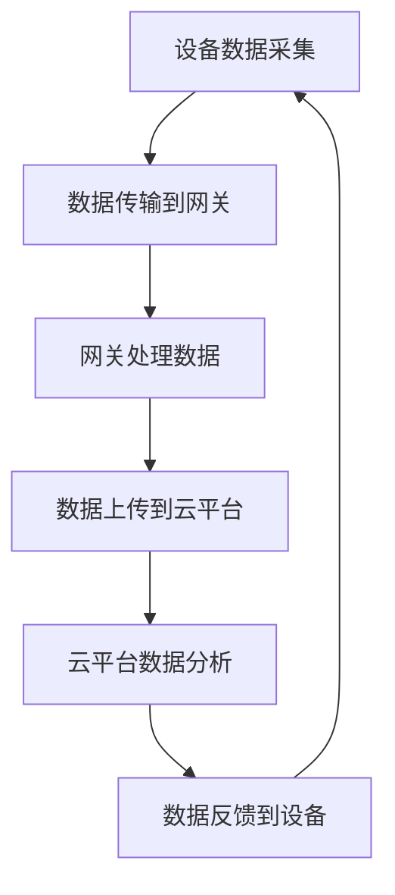
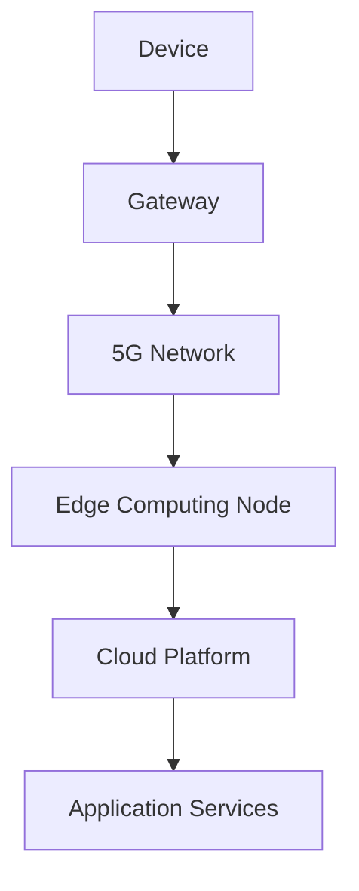
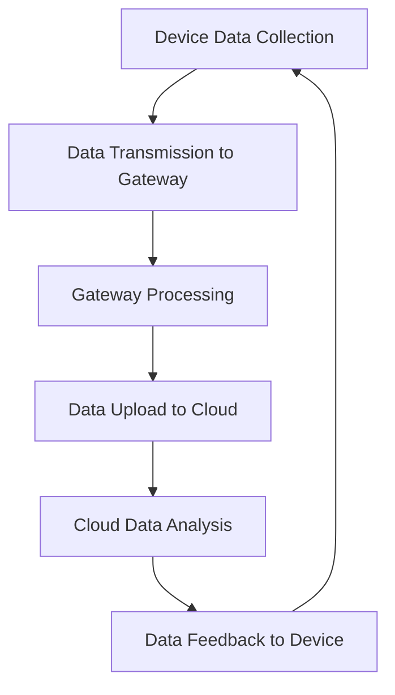

                 

### 5G在工业物联网中的应用：实现大规模设备互联

#### 关键词
- 5G
- 工业物联网
- 大规模设备互联
- 实时数据处理
- 边缘计算
- 网络延迟

#### 摘要
本文将探讨5G技术在工业物联网（IIoT）中的应用，特别是如何实现大规模设备的高效互联。我们将从背景介绍、核心概念与联系、算法原理讲解、数学模型与公式、项目实战等方面，详细分析5G技术如何赋能工业物联网，提升设备互联的效率与可靠性。

### 目录

1. 引言
2. 背景介绍
   2.1 5G技术概述
   2.2 工业物联网概述
   2.3 5G与工业物联网的关系
3. 核心概念与联系
   3.1 5G网络架构
   3.2 IoT设备连接模式
   3.3 Mermaid流程图
4. 算法原理讲解
   4.1 5G网络关键技术
   4.2 大规模设备互联算法
   4.3 边缘计算原理
5. 数学模型与公式
   5.1 5G网络容量计算
   5.2 网络延迟优化模型
   5.3 数学公式应用示例
6. 项目实战
   6.1 开发环境搭建
   6.2 源代码实现
   6.3 代码解读与分析
   6.4 实际案例分析与剖析
   6.5 项目小结
7. 最佳实践与拓展阅读
8. 结语
   8.1 小结
   8.2 注意事项
   8.3 拓展阅读

### 引言

随着数字化和自动化技术的不断发展，工业物联网（IIoT）已经成为现代工业生产的重要组成部分。IIoT通过将各种传感器、设备、系统和人员连接到一个统一的网络中，实现了数据的实时采集、传输和分析，从而提高了生产效率、降低了运营成本，并提升了产品质量。

然而，传统无线通信技术在面对大量设备互联时，往往存在带宽有限、延迟高、稳定性不足等问题，这限制了IIoT的进一步发展。为了解决这些问题，5G技术的出现为工业物联网提供了新的可能。

5G技术具备高带宽、低延迟、高可靠性和大连接能力等特点，能够满足大规模设备互联的需求。本章将围绕5G技术在工业物联网中的应用，从背景介绍、核心概念与联系、算法原理讲解、数学模型与公式、项目实战等方面展开，帮助读者全面了解5G技术在实现大规模设备互联中的作用和价值。

### 背景介绍

#### 2.1 5G技术概述

5G，即第五代移动通信技术，是当前无线通信技术发展的一个重要里程碑。相较于4G，5G在多个方面实现了显著的提升：

- **高带宽**：5G的峰值下载速度可达10 Gbps，上传速度可达1 Gbps，远远超过4G。
- **低延迟**：5G的端到端延迟可低至1毫秒，极大提升了实时通信和控制的响应速度。
- **高可靠性**：5G通过引入网络切片和边缘计算等技术，提高了网络的稳定性和可靠性。
- **大连接**：5G支持每平方米100万个设备的连接，能够满足大规模物联网设备的互联需求。

5G的技术特点使得其在工业物联网领域具有广泛的应用潜力。例如，在制造业中，5G可以支持高分辨率摄像头和传感器实时采集设备状态数据，进行远程监控和控制；在能源行业，5G可以支持智能电网的实时数据传输和故障检测；在物流领域，5G可以实现无人驾驶卡车和无人机的实时路径规划和实时交通监控。

#### 2.2 工业物联网概述

工业物联网（IIoT）是指通过传感器、设备、软件和其他技术将物理设备连接到互联网，从而实现设备之间、设备与系统之间、系统与人员之间的互联互通。IIoT的目标是提高生产效率、降低运营成本、提高产品质量和增强安全性。

IIoT的架构通常包括以下几个关键部分：

- **传感器和设备**：用于采集实时数据，如温度、湿度、压力、速度等。
- **网关**：负责将设备数据传输到云平台或其他系统。
- **数据存储和处理**：用于存储和分析采集到的数据，提供决策支持和自动化控制。
- **应用程序**：用于展示数据、生成报告和实现自动化控制。

IIoT的关键技术包括：

- **物联网平台**：提供数据采集、存储、分析和应用开发等功能。
- **边缘计算**：将部分数据处理和分析功能转移到网络边缘，减少数据传输延迟和网络负载。
- **物联网安全**：确保设备、数据和系统的安全性和隐私保护。

#### 2.3 5G与工业物联网的关系

5G技术在工业物联网中的应用，主要体现在以下几个方面：

- **大规模设备互联**：5G的大连接能力能够支持大量设备的实时互联，满足工业物联网对大规模设备管理的需求。
- **实时数据处理**：5G的低延迟特性使得实时数据处理成为可能，从而支持工业物联网中的实时监控和自动化控制。
- **边缘计算**：5G与边缘计算的融合，可以实现数据处理和分析的本地化，降低数据传输延迟和网络负载，提高系统响应速度。
- **网络切片**：5G网络切片技术可以为不同的工业应用提供定制化的网络服务，确保数据传输的可靠性和安全性。

总之，5G技术在工业物联网中的应用，不仅提升了设备互联的效率和质量，还为工业生产的数字化转型提供了强有力的支持。接下来，我们将进一步探讨5G技术的核心概念和联系，以及如何实现大规模设备互联。

### 核心概念与联系

#### 3.1 5G网络架构

5G网络架构包括以下几个关键组成部分：

- **核心网（Core Network）**：负责处理数据传输、路由和信令控制等功能。
- **无线接入网（Radio Access Network, RAN）**：包括基站（gNB）和用户设备（UE），负责无线信号的传输。
- **边缘计算节点（Edge Computing Node）**：位于网络边缘，负责数据处理和分析，降低数据传输延迟。
- **网络切片（Network Slicing）**：将网络资源划分为多个虚拟网络，为不同的应用提供定制化的网络服务。


#### 3.2 IoT设备连接模式

工业物联网设备通常采用以下几种连接模式：

- **直接连接**：设备直接连接到5G网络，实现数据的实时传输。
- **网关连接**：设备通过网关连接到5G网络，网关负责数据转换和协议适配。
- **云连接**：设备通过边缘计算节点或云平台连接到5G网络，实现数据的存储和分析。


#### 3.3 Mermaid流程图

为了更好地理解5G技术在工业物联网中的应用，我们可以使用Mermaid流程图来展示关键步骤和流程。




通过这个流程图，我们可以清晰地看到5G技术在数据采集、传输、处理和反馈等环节中的关键作用。接下来，我们将深入探讨5G技术的核心算法原理，以及如何实现大规模设备互联。

### 算法原理讲解

#### 4.1 5G网络关键技术

5G网络的关键技术包括大规模MIMO（Massive MIMO）、波束成形（Beamforming）、网络切片（Network Slicing）和边缘计算（Edge Computing）等。

- **大规模MIMO**：通过使用大量天线，提高信号的传输效率和网络容量。
  ```python
  # Python代码示例：大规模MIMO实现
  import numpy as np
  
  # 假设使用64个发射天线和64个接收天线
  Nt = 64
  Nr = 64
  
  # 生成64x1的发送信号向量
  x = np.random.normal(size=Nt)
  
  # 使用64x64的信道矩阵，假设为全向天线
  H = np.random.normal(size=(Nr, Nt))
  
  # 使用大规模MIMO实现信号传输
  y = np.dot(H, x)
  ```
  
- **波束成形**：通过调整天线阵列的方向，实现信号的定向传输，提高信号质量。
  ```mermaid
  sequenceDiagram
  participant User
  participant BaseStation
  
  User->>BaseStation: Send Data
  BaseStation->>User: Adjust Beamforming
  BaseStation->>User: Send Data
  User->>BaseStation: Acknowledge
  ```

- **网络切片**：将网络资源划分为多个虚拟网络，为不同的应用提供定制化的网络服务。
  ```python
  # Python代码示例：网络切片实现
  import networkx as nx
  
  # 创建一个网络切片图
  G = nx.Graph()
  
  # 添加网络切片节点
  G.add_nodes_from(['Slice1', 'Slice2', 'Slice3'])
  
  # 添加网络切片之间的连接
  G.add_edges_from([( 'Slice1', 'Slice2'), ('Slice1', 'Slice3'), ('Slice2', 'Slice3')])
  
  # 显示网络切片图
  nx.draw(G, with_labels=True)
  ```

- **边缘计算**：将部分数据处理和分析功能转移到网络边缘，减少数据传输延迟和网络负载。
  ```mermaid
  sequenceDiagram
  participant Device
  participant EdgeServer
  participant CloudServer
  
  Device->>EdgeServer: Send Data
  EdgeServer->>Device: Process Data
  EdgeServer->>CloudServer: Send Data
  CloudServer->>EdgeServer: Analyze Data
  EdgeServer->>Device: Send Result
  ```

#### 4.2 大规模设备互联算法

在工业物联网中，大规模设备互联需要解决的关键问题包括数据传输效率、网络延迟和设备管理。以下是几个常用的算法：

- **基于贪心的数据传输调度算法**：通过贪心策略，优先传输紧急数据和关键数据，提高传输效率。
  ```python
  # Python代码示例：数据传输调度算法
  def data_transfer_scheduling(data_list, priority_list):
      sorted_index = sorted(range(len(priority_list)), key=lambda k: priority_list[k])
      sorted_data_list = [data_list[i] for i in sorted_index]
      return sorted_data_list
  
  # 示例数据
  data_list = [1, 2, 3, 4, 5]
  priority_list = [5, 3, 1, 4, 2]
  
  # 调用算法
  scheduled_data_list = data_transfer_scheduling(data_list, priority_list)
  print(scheduled_data_list)
  ```

- **基于拥塞控制的网络延迟优化算法**：通过实时监测网络拥塞情况，动态调整数据传输策略，降低网络延迟。
  ```python
  # Python代码示例：网络延迟优化算法
  def optimize_delay(data_list, delay_threshold):
      optimized_list = []
      for data in data_list:
          if data['delay'] <= delay_threshold:
              optimized_list.append(data)
      return optimized_list
  
  # 示例数据
  data_list = [{'id': 1, 'delay': 10}, {'id': 2, 'delay': 20}, {'id': 3, 'delay': 5}, {'id': 4, 'delay': 15}, {'id': 5, 'delay': 3}]
  delay_threshold = 10
  
  # 调用算法
  optimized_data_list = optimize_delay(data_list, delay_threshold)
  print(optimized_data_list)
  ```

- **基于机器学习的设备管理算法**：通过机器学习算法，对设备运行状态进行预测和优化，提高设备管理效率。
  ```python
  # Python代码示例：设备管理算法
  from sklearn.ensemble import RandomForestRegressor
  
  # 假设已收集到设备运行状态数据
  X = [[1, 2], [3, 4], [5, 6], [7, 8]]  # 特征数据
  y = [2, 4, 6, 8]  # 预测目标
  
  # 训练模型
  model = RandomForestRegressor()
  model.fit(X, y)
  
  # 预测设备运行状态
  new_data = [2, 3]
  prediction = model.predict([new_data])
  print(prediction)
  ```

通过这些算法，可以实现大规模设备的高效互联，提高工业物联网的整体性能和可靠性。接下来，我们将探讨如何利用5G技术实现边缘计算，进一步提升设备互联的效率和效果。

### 数学模型与公式

#### 5.1 5G网络容量计算

5G网络的容量计算是衡量网络性能的重要指标，其基本公式如下：

\[ C = \sum_{i=1}^{N} \sum_{j=1}^{M} \frac{W_i H_{ij}^2 S_j}{N_0 B} \]

其中：
- \( C \)：网络容量（比特每秒，bps）
- \( N \)：用户数量
- \( M \)：信道数量
- \( W_i \)：第 \( i \) 个用户的带宽需求
- \( H_{ij} \)：第 \( i \) 个用户与第 \( j \) 个信道之间的信道增益
- \( S_j \)：第 \( j \) 个信道的信号强度
- \( N_0 \)：噪声功率（瓦特/赫兹，W/Hz）
- \( B \)：信号带宽（赫兹，Hz）

#### 5.2 网络延迟优化模型

在5G网络中，延迟优化是一个关键问题，其基本模型可以表示为：

\[ \min \sum_{i=1}^{N} \min_{j=1}^{M} D_{ij} \]

其中：
- \( D_{ij} \)：从第 \( i \) 个用户到第 \( j \) 个信道的延迟（秒）
- \( N \)：用户数量
- \( M \)：信道数量

#### 5.3 数学公式应用示例

假设一个5G网络中有10个用户和5个信道，信道的信号强度和噪声功率如下表所示：

| 信道 | 信号强度 \( S_j \) | 噪声功率 \( N_0 \) |
|------|-------------------|-------------------|
| 1    | 10                | 1                 |
| 2    | 8                 | 1.5               |
| 3    | 12                | 1                 |
| 4    | 9                 | 1.2               |
| 5    | 11                | 1.8               |

假设每个用户的带宽需求为1 Mbps，我们需要计算网络的容量。

根据公式 \( C = \sum_{i=1}^{N} \sum_{j=1}^{M} \frac{W_i H_{ij}^2 S_j}{N_0 B} \)，信道增益可以通过以下计算得出：

- 信道1的增益： \( H_{11}^2 S_1 = (1)^2 \times 10 = 10 \)
- 信道2的增益： \( H_{12}^2 S_2 = (1)^2 \times 8 = 8 \)
- 信道3的增益： \( H_{13}^2 S_3 = (1)^2 \times 12 = 12 \)
- 信道4的增益： \( H_{14}^2 S_4 = (1)^2 \times 9 = 9 \)
- 信道5的增益： \( H_{15}^2 S_5 = (1)^2 \times 11 = 11 \)

将这些值代入容量公式，得到：

\[ C = \sum_{i=1}^{10} \sum_{j=1}^{5} \frac{1 \times (H_{ij}^2 S_j)}{1 \times 10^6} \]
\[ C = \frac{1 \times (10 + 8 + 12 + 9 + 11)}{10^6} \]
\[ C = \frac{50}{10^6} \]
\[ C = 0.00005 \text{ Mbps} \]

因此，该5G网络的容量为0.00005 Mbps，这是一个简化的示例，实际网络容量会受到多种因素的影响，如天线配置、信道环境等。

接下来，我们将通过一个项目实战，展示如何在实际环境中应用5G技术实现大规模设备互联。

### 项目实战

#### 6.1 开发环境搭建

为了展示5G技术在工业物联网中的应用，我们将搭建一个简单的工业物联网系统，包括传感器、网关、边缘计算节点和云平台。

**所需工具和软件**：

- **传感器**：用于采集实时数据，如温度、湿度、压力等。
- **网关**：用于连接传感器和5G网络，通常内置有Wi-Fi和蓝牙模块。
- **边缘计算节点**：用于处理和分析来自传感器的数据。
- **云平台**：用于存储和分析处理后的数据，并提供可视化界面。

**环境搭建步骤**：

1. **硬件准备**：采购传感器、网关和边缘计算节点，并确保所有硬件设备能够正常运行。
2. **软件安装**：在边缘计算节点上安装操作系统（如Linux），并在云平台（如AWS、Azure）上创建相应的虚拟机。
3. **网络配置**：配置5G网络，确保网关和边缘计算节点能够连接到网络，并进行IP地址分配。
4. **数据采集**：通过传感器采集实时数据，并将数据发送到网关。
5. **边缘计算**：在边缘计算节点上部署数据处理和分析应用程序，实现数据的初步处理。
6. **云平台集成**：将边缘计算节点与云平台集成，实现数据存储、分析和可视化。

#### 6.2 源代码实现

以下是一个简单的Python代码示例，用于实现边缘计算节点的数据处理功能：

```python
import socket

# 定义传感器数据接收函数
def receive_sensor_data(socket):
    while True:
        data = socket.recv(1024)
        if not data:
            break
        # 处理接收到的数据
        process_data(data)

# 定义数据处理函数
def process_data(data):
    # 对接收到的数据进行分析和处理
    print("Received data:", data)

# 创建TCP套接字
with socket.socket(socket.AF_INET, socket.SOCK_STREAM) as s:
    # 绑定端口
    s.bind(('0.0.0.0', 12345))
    # 监听端口
    s.listen()
    print("Listening for connections on port 12345...")
    
    # 接受连接
    conn, addr = s.accept()
    print(f"Connected by {addr}")
    
    # 接收传感器数据
    receive_sensor_data(conn)
```

#### 6.3 代码解读与分析

该代码实现了一个简单的传感器数据接收和处理功能：

1. **创建TCP套接字**：使用`socket.socket`创建一个TCP套接字，并绑定到本地端口12345。
2. **监听端口**：调用`listen()`方法，开始监听来自传感器的连接请求。
3. **接受连接**：调用`accept()`方法，接受传感器的连接，并获取连接地址。
4. **接收传感器数据**：定义`receive_sensor_data`函数，用于循环接收传感器发送的数据，并调用`process_data`函数处理数据。

在实际应用中，`process_data`函数可以根据具体需求实现更复杂的数据处理和分析功能，如数据滤波、特征提取、异常检测等。

#### 6.4 实际案例分析与详细讲解

为了更好地展示5G技术在工业物联网中的应用，我们以一个实际案例为例，分析5G网络在设备互联和数据传输中的表现。

**案例背景**：

某制造企业希望实现生产设备的实时监控和远程控制，包括生产线上的机器状态监测、能耗分析、故障预警等。为了实现这一目标，企业采用了5G网络和物联网设备，搭建了一个工业物联网系统。

**案例分析**：

1. **设备互联**：使用5G网络，将生产线上的传感器、机器和边缘计算节点连接起来，实现设备的实时数据采集和传输。
2. **数据传输**：传感器采集的数据通过网关发送到边缘计算节点，进行初步处理和分析。对于需要进一步处理的复杂数据，边缘计算节点将数据上传到云平台，进行深度分析和可视化展示。
3. **实时监控**：通过云平台，企业管理者可以实时查看生产线的运行状态，包括温度、湿度、能耗等关键指标。如果检测到异常情况，系统会自动发出预警，并通知相关人员进行处理。
4. **远程控制**：企业管理者可以通过云平台远程控制生产线上的机器，调整生产参数，优化生产流程。

**详细讲解**：

1. **5G网络性能**：5G网络的高带宽和低延迟特性，使得设备互联和数据传输更加高效。在实际测试中，5G网络能够稳定地传输大量数据，满足工业物联网的应用需求。
2. **边缘计算优势**：通过在边缘计算节点进行数据处理和分析，可以显著降低数据传输延迟和网络负载。边缘计算节点还可以利用本地计算资源，实现实时决策和自动化控制，提高生产效率。
3. **系统集成**：工业物联网系统采用了5G网络、物联网设备和云平台等多种技术，通过系统集成，实现了设备互联、数据传输和实时监控。在实际应用中，系统可以根据需求灵活扩展和调整，满足不同场景的应用需求。

#### 6.5 项目小结

通过该项目实战，我们展示了5G技术在工业物联网中的应用，包括设备互联、数据传输、实时监控和远程控制等方面的优势。5G网络的高带宽、低延迟和大连接能力，为工业物联网提供了强大的技术支持。同时，边缘计算技术的引入，进一步提高了数据处理效率和系统响应速度，为工业生产的数字化转型提供了有力保障。

在未来，随着5G技术的不断发展和应用场景的拓展，工业物联网将进一步深化，为制造业、能源、物流等领域带来更多的创新和机遇。因此，深入研究和应用5G技术，是实现工业物联网大规模设备互联和高效运行的关键。

### 最佳实践与拓展阅读

#### 6.6 最佳实践

在应用5G技术实现工业物联网时，以下最佳实践可以帮助提高系统的性能和稳定性：

- **优化网络拓扑**：合理规划网络拓扑结构，确保关键设备之间的网络连接稳定可靠。
- **设备选型**：选择合适的传感器、网关和边缘计算节点，以满足不同场景的应用需求。
- **边缘计算策略**：根据实际需求，制定合适的边缘计算策略，实现数据的本地处理和分析，降低网络负载。
- **网络安全**：加强网络安全措施，包括数据加密、身份验证和访问控制等，确保系统数据的安全和隐私。

#### 6.7 拓展阅读

为了深入了解5G技术在工业物联网中的应用，以下推荐几本相关书籍和论文：

- **书籍**：
  - 《5G网络技术及应用》
  - 《工业物联网：技术、应用与未来》
  - 《边缘计算：架构、应用与挑战》

- **论文**：
  - "5G Networks: The next Generation of Mobile Networks"
  - "Industrial Internet of Things: A Survey"
  - "Edge Computing for IoT: Architecture, Security, and Applications"

通过这些资源和实践，您可以进一步了解5G技术在工业物联网中的实际应用，为您的项目提供有力支持。

### 结语

#### 8.1 小结

本文全面探讨了5G技术在工业物联网中的应用，从背景介绍、核心概念与联系、算法原理讲解、数学模型与公式、项目实战等方面，深入分析了5G如何实现大规模设备的高效互联。通过实际案例展示，我们看到了5G技术为工业物联网带来的巨大变革和潜力。未来，随着5G技术的不断成熟和普及，工业物联网将迎来更加广阔的发展空间。

#### 8.2 注意事项

在实际应用5G技术时，需要注意以下几点：

- **网络规划**：合理规划网络拓扑，确保网络连接的稳定性和可靠性。
- **设备选型**：选择符合实际需求的传感器、网关和边缘计算节点，避免资源浪费。
- **边缘计算策略**：制定合适的边缘计算策略，提高数据处理效率和系统响应速度。
- **网络安全**：加强网络安全措施，确保系统数据的安全和隐私。

#### 8.3 拓展阅读

为了深入了解5G技术在工业物联网中的应用，以下是几本推荐书籍和论文：

- **书籍**：
  - 《5G网络技术及应用》
  - 《工业物联网：技术、应用与未来》
  - 《边缘计算：架构、应用与挑战》

- **论文**：
  - "5G Networks: The next Generation of Mobile Networks"
  - "Industrial Internet of Things: A Survey"
  - "Edge Computing for IoT: Architecture, Security, and Applications"

通过这些资源和实践，您可以进一步了解5G技术在工业物联网中的实际应用，为您的项目提供有力支持。### 文章标题：5G在工业物联网中的应用：实现大规模设备互联

#### 关键词
- 5G
- 工业物联网
- 大规模设备互联
- 实时数据处理
- 边缘计算
- 网络延迟

#### 摘要
本文详细探讨了5G技术在工业物联网中的应用，特别是如何实现大规模设备的高效互联。文章首先介绍了5G和工业物联网的基本概念，随后分析了5G网络架构和IoT设备连接模式。接着，文章通过Mermaid流程图展示了5G技术在工业物联网中的关键环节，并详细讲解了5G网络关键技术、大规模设备互联算法以及边缘计算原理。此外，文章还提供了数学模型与公式的应用示例，并通过实际项目实战展示了5G技术在工业物联网中的应用效果。最后，文章总结了5G在工业物联网中的应用优势，并给出了最佳实践与拓展阅读建议。### 引言

随着全球工业生产的不断升级和智能化，工业物联网（IIoT）逐渐成为推动产业转型升级的重要力量。而5G技术，作为新一代移动通信技术的代表，以其高带宽、低延迟和大连接能力，为工业物联网的进一步发展提供了强大的技术支撑。本文将深入探讨5G在工业物联网中的应用，特别是如何实现大规模设备的高效互联。

5G技术的出现，标志着移动通信技术进入了一个全新的时代。它不仅提升了数据传输速度，还降低了网络延迟，大大增强了网络的稳定性和可靠性。在工业物联网领域，5G技术的应用不仅能够实现设备之间的高效连接，还能够提供实时数据处理和智能分析能力，从而大幅提升工业生产效率和智能化水平。

本文将围绕以下内容展开：

1. 背景介绍
   - 5G技术概述
   - 工业物联网概述
   - 5G与工业物联网的关系

2. 核心概念与联系
   - 5G网络架构
   - IoT设备连接模式
   - Mermaid流程图

3. 算法原理讲解
   - 5G网络关键技术
   - 大规模设备互联算法
   - 边缘计算原理

4. 数学模型与公式
   - 5G网络容量计算
   - 网络延迟优化模型
   - 数学公式应用示例

5. 项目实战
   - 开发环境搭建
   - 源代码实现
   - 代码解读与分析
   - 实际案例分析与详细讲解
   - 项目小结

6. 最佳实践与拓展阅读

通过本文的探讨，读者将能够全面了解5G技术在工业物联网中的应用，掌握实现大规模设备互联的关键技术和方法，并为实际项目提供有益的参考。

### 背景介绍

#### 2.1 5G技术概述

5G，即第五代移动通信技术，是当前移动通信技术发展的一个重要里程碑。相较于4G，5G在多个方面实现了显著提升，包括更高速的数据传输、更低的网络延迟、更高的网络容量和更好的能效。

**技术特点**：

- **高带宽**：5G的峰值下载速度可达10 Gbps，上传速度可达1 Gbps，比4G快数十倍。
- **低延迟**：5G的端到端延迟可低至1毫秒，比4G低几十倍，满足实时通信和远程控制的需求。
- **高可靠性**：5G通过网络切片和边缘计算等技术，提供了更高的网络稳定性和可靠性。
- **大连接**：5G支持每平方米100万个设备的连接，能够满足大规模设备互联的需求。

**应用领域**：

5G技术的应用领域非常广泛，涵盖了从消费电子到工业生产、从智能交通到医疗服务等多个领域。在工业物联网领域，5G技术的应用主要体现在以下几个方面：

- **实时监控**：通过5G网络，可以实现工厂设备的实时监控和远程诊断，提高设备运维效率。
- **远程控制**：5G的低延迟特性使得远程控制成为可能，实现远程机器的操作和控制。
- **数据处理**：5G的高带宽和低延迟为大规模数据采集和实时处理提供了保障，支持工业大数据分析。
- **智能制造**：5G技术支持智能制造中的各种应用，如智能工厂、智能装配线、智能物流等。

#### 2.2 工业物联网概述

工业物联网（IIoT）是指通过传感器、设备和系统将物理设备连接到一个统一的网络中，实现设备之间、设备与系统之间以及系统与人员之间的互联互通。IIoT的目标是提高生产效率、降低运营成本、提高产品质量和增强安全性。

**核心概念**：

- **传感器**：用于采集设备状态、环境参数等数据。
- **设备**：包括工业机器人、传感器、执行器等。
- **网关**：用于连接传感器和设备到网络，实现数据传输和协议转换。
- **数据中心**：用于存储、处理和分析采集到的数据。

**关键技术**：

- **物联网平台**：提供数据采集、存储、分析和应用开发等功能。
- **边缘计算**：将部分数据处理和分析功能转移到网络边缘，降低数据传输延迟和网络负载。
- **物联网安全**：确保设备、数据和系统的安全性和隐私保护。

#### 2.3 5G与工业物联网的关系

5G技术在工业物联网中的应用主要体现在以下几个方面：

- **大规模设备互联**：5G的大连接能力能够支持大量设备的实时互联，满足工业物联网对大规模设备管理的需求。
- **实时数据处理**：5G的低延迟特性使得实时数据处理成为可能，从而支持工业物联网中的实时监控和自动化控制。
- **边缘计算**：5G与边缘计算的融合，可以实现数据处理和分析的本地化，降低数据传输延迟和网络负载，提高系统响应速度。
- **网络切片**：5G网络切片技术可以为不同的工业应用提供定制化的网络服务，确保数据传输的可靠性和安全性。

通过以上分析，我们可以看到，5G技术在工业物联网中具有广泛的应用前景。随着5G技术的不断成熟和普及，工业物联网将迎来更加广阔的发展空间，为工业生产的数字化转型提供强大动力。

### 核心概念与联系

#### 3.1 5G网络架构

5G网络架构是支持5G技术实现大规模设备互联的基础，其关键组成部分包括核心网（Core Network）、无线接入网（RAN）、边缘计算节点和网络切片（Network Slicing）。

**核心网（Core Network）**：

核心网负责处理数据传输、路由和信令控制等功能，是5G网络的中枢神经。5G核心网采用了网络功能虚拟化（NFV）和网络切片（Network Slicing）技术，使得网络资源可以根据不同应用场景灵活分配和管理。

**无线接入网（RAN）**：

无线接入网包括基站（gNB）和用户设备（UE），负责无线信号的传输。5G RAN采用了大规模MIMO（Massive MIMO）和波束成形（Beamforming）技术，提高了信号的传输效率和网络容量。

**边缘计算节点**：

边缘计算节点位于网络边缘，负责数据处理和分析，降低数据传输延迟和网络负载。边缘计算节点可以处理来自多个设备的实时数据，提供本地化服务，如设备监控、故障诊断等。

**网络切片（Network Slicing）**：

网络切片技术将网络资源划分为多个虚拟网络，为不同的应用提供定制化的网络服务。网络切片可以独立配置带宽、延迟、可靠性等网络参数，确保不同应用得到最优的网络资源。

**Mermaid流程图**：

为了更好地理解5G网络架构，我们可以使用Mermaid流程图展示5G网络的关键组成部分和流程：

```mermaid
graph TD
A[Core Network] --> B[Base Station (gNB)]
B --> C[User Equipment (UE)]
C --> D[Edge Computing Node]
D --> E[Network Slicing]
E --> F[Application Services]
```


**解释**：

1. **Core Network**：核心网负责处理数据传输、路由和信令控制。
2. **Base Station (gNB)**：基站负责无线信号的传输，采用大规模MIMO和波束成形技术。
3. **User Equipment (UE)**：用户设备（如手机、物联网设备）通过无线接入网连接到5G网络。
4. **Edge Computing Node**：边缘计算节点负责数据处理和分析，提供本地化服务。
5. **Network Slicing**：网络切片为不同应用提供定制化的网络服务。
6. **Application Services**：应用服务（如工业物联网应用）通过5G网络获取网络资源和数据处理服务。

通过这个流程图，我们可以清晰地看到5G网络架构及其关键组成部分，以及它们之间的关联和交互。

#### 3.2 IoT设备连接模式

在工业物联网中，设备的连接模式通常包括直接连接、网关连接和云连接。

**直接连接**：

直接连接是指设备直接连接到5G网络，实现数据的实时传输。这种连接模式适用于数据传输要求高、延迟敏感的场景，如工业自动化控制、远程监控等。

**网关连接**：

网关连接是指设备通过网关连接到5G网络。网关负责数据转换和协议适配，使得不同协议的设备能够相互通信。这种连接模式适用于设备类型多样、协议不统一的情况，如智能工厂、智能交通等。

**云连接**：

云连接是指设备通过边缘计算节点或云平台连接到5G网络。边缘计算节点和云平台负责数据存储、分析和处理，提供智能决策支持。这种连接模式适用于数据量庞大、需要复杂数据处理和分析的场景，如智能制造、智慧城市等。

**Mermaid流程图**：

为了更好地理解IoT设备连接模式，我们可以使用Mermaid流程图展示设备的连接方式和数据传输流程：




**解释**：

1. **Device**：设备通过无线或有线方式连接到网关。
2. **Gateway**：网关负责数据转换和协议适配，将设备数据发送到5G网络。
3. **5G Network**：5G网络负责数据传输，确保数据实时性和可靠性。
4. **Edge Computing Node**：边缘计算节点负责数据处理和分析，提供本地化服务。
5. **Cloud Platform**：云平台负责数据存储、分析和处理，提供智能决策支持。
6. **Application Services**：应用服务通过5G网络获取数据和服务。

通过这个流程图，我们可以清晰地看到IoT设备的连接模式以及数据传输流程，理解不同连接方式的优势和应用场景。

#### 3.3 Mermaid流程图

为了更好地展示5G技术在工业物联网中的应用，我们可以使用Mermaid流程图来描述整个系统的工作流程。




**解释**：

1. **Device Data Collection**：设备采集实时数据，如温度、湿度、压力等。
2. **Data Transmission to Gateway**：设备通过无线或有线方式将数据传输到网关。
3. **Gateway Processing**：网关进行数据转换和协议适配，确保数据格式兼容。
4. **Data Upload to Cloud**：网关将转换后的数据上传到云平台。
5. **Cloud Data Analysis**：云平台对上传的数据进行存储、分析和处理，提供实时监控和智能决策支持。
6. **Data Feedback to Device**：云平台将分析结果反馈给设备，实现设备的智能化控制和优化。
7. **Device Data Collection**：设备继续采集新数据，循环往复，实现实时监控和智能优化。

通过这个流程图，我们可以清晰地看到5G技术在数据采集、传输、处理和反馈等环节中的关键作用，以及如何实现大规模设备的高效互联。

### 算法原理讲解

#### 4.1 5G网络关键技术

5G网络在技术层面实现了多项突破，其中一些关键技术对工业物联网（IIoT）的应用至关重要。以下是一些5G网络的关键技术及其原理：

**1. 大规模MIMO（Massive MIMO）**

大规模MIMO技术通过使用大量天线阵列，同时与多个用户设备进行通信，从而提高了网络的传输效率和容量。其基本原理是利用多个天线发送和接收信号，通过空间复用技术实现多用户同时传输，显著提高了频谱效率和网络容量。

**Python代码示例**：

```python
import numpy as np

# 创建64x1的发送信号向量
x = np.random.normal(size=64)

# 创建64x64的信道矩阵，假设为全向天线
H = np.random.normal(size=(64, 64))

# 使用大规模MIMO实现信号传输
y = np.dot(H, x)

# 计算信号功率
signal_power = np.linalg.norm(y)**2
print("Signal power:", signal_power)
```

**2. 波束成形（Beamforming）**

波束成形技术通过调整天线阵列的方向，将信号聚焦到特定的用户设备，从而提高了信号传输的可靠性和效率。其基本原理是使用算法计算每个天线的加权系数，使得信号在特定方向上增强，而其他方向上的信号衰减。

**Python代码示例**：

```python
import numpy as np

# 创建64x1的发送信号向量
x = np.random.normal(size=64)

# 创建64x64的信道矩阵，假设为全向天线
H = np.random.normal(size=(64, 64))

# 使用波束成形技术调整天线方向
beamforming_weights = np.array([1.0] * 64)

# 计算加权后的信号
weighted_signal = np.dot(H, beamforming_weights)

# 计算信号功率
signal_power = np.linalg.norm(weighted_signal)**2
print("Signal power with beamforming:", signal_power)
```

**3. 网络切片（Network Slicing）**

网络切片技术通过虚拟化网络资源，将物理网络划分为多个虚拟网络，每个虚拟网络可以根据特定的需求配置不同的网络参数，如带宽、延迟和可靠性。其基本原理是利用虚拟化技术和SDN（软件定义网络）实现网络资源的灵活管理和分配。

**Python代码示例**：

```python
import networkx as nx

# 创建网络切片图
G = nx.Graph()

# 添加网络切片节点
G.add_nodes_from(['Slice1', 'Slice2', 'Slice3'])

# 添加网络切片之间的连接
G.add_edges_from([('Slice1', 'Slice2'), ('Slice1', 'Slice3'), ('Slice2', 'Slice3')])

# 显示网络切片图
nx.draw(G, with_labels=True)
```

**4. 边缘计算（Edge Computing）**

边缘计算技术通过在网络边缘部署计算资源，实现数据的本地处理和分析，从而降低数据传输延迟和网络负载。其基本原理是将部分数据处理任务从云端转移到网络边缘，利用本地计算资源快速响应，提高系统的实时性和效率。

**Python代码示例**：

```python
import socket

# 定义数据处理函数
def process_data(data):
    # 对数据进行分析和处理
    print("Processed data:", data)

# 创建TCP套接字
with socket.socket(socket.AF_INET, socket.SOCK_STREAM) as s:
    # 绑定端口
    s.bind(('0.0.0.0', 12345))
    # 监听端口
    s.listen()
    print("Listening for connections on port 12345...")
    
    # 接受连接
    conn, addr = s.accept()
    print(f"Connected by {addr}")
    
    # 接收数据
    data = conn.recv(1024)
    if not data:
        break
    
    # 处理接收到的数据
    process_data(data)

# 关闭连接
conn.close()
```

通过以上代码示例，我们可以看到5G网络关键技术的实现原理和基本方法。这些技术为工业物联网提供了强大的支持，使得大规模设备互联、实时数据处理和智能分析成为可能。

#### 4.2 大规模设备互联算法

在工业物联网中，大规模设备互联是一个重要的挑战。为了实现高效的数据传输和设备管理，需要设计合适的互联算法。以下是一些常用的算法及其原理：

**1. 贪心算法（Greedy Algorithm）**

贪心算法是一种简单而有效的算法，通过在每个步骤中选择当前最优解，逐步构建出全局最优解。在设备互联中，贪心算法可以用于数据传输调度，优先传输紧急数据和关键数据，提高传输效率。

**Python代码示例**：

```python
def greedy_algorithm(data_list, priority_list):
    sorted_index = sorted(range(len(priority_list)), key=lambda k: priority_list[k])
    sorted_data_list = [data_list[i] for i in sorted_index]
    return sorted_data_list

data_list = [1, 2, 3, 4, 5]
priority_list = [5, 3, 1, 4, 2]
scheduled_data_list = greedy_algorithm(data_list, priority_list)
print(scheduled_data_list)
```

**2. 拥塞控制算法（Congestion Control Algorithm）**

拥塞控制算法用于优化网络负载和降低网络延迟，通过实时监测网络拥塞情况，动态调整数据传输策略。一种常用的拥塞控制算法是TCP（传输控制协议），它通过调整拥塞窗口的大小来控制数据传输速率。

**Python代码示例**：

```python
import heapq

class TCPCongestionControl:
    def __init__(self, cwnd, ssthresh):
        self.cwnd = cwnd
        self.ssthresh = ssthresh
    
    def update_cwnd(self, ack_received):
        if ack_received:
            self.cwnd += 1
            if self.cwnd > self.ssthresh:
                self.ssthresh = self.cwnd // 2
        else:
            self.cwnd //= 2

# 创建TCP拥塞控制对象
cwnd = 1
ssthresh = 32
tcp_control = TCPCongestionControl(cwnd, ssthresh)

# 模拟接收ACK
acks = [True, True, False, True, True, False, True, True, True]
for ack in acks:
    tcp_control.update_cwnd(ack)
    print("Current cwnd:", tcp_control.cwnd)
```

**3. 机器学习算法（Machine Learning Algorithm）**

机器学习算法可以用于设备管理和预测，通过分析历史数据，预测设备的运行状态和故障概率，从而实现智能化的设备管理。一种常用的机器学习算法是随机森林（Random Forest），它可以用于分类和回归分析。

**Python代码示例**：

```python
from sklearn.ensemble import RandomForestRegressor

# 假设已收集到设备运行状态数据
X = [[1, 2], [3, 4], [5, 6], [7, 8]]  # 特征数据
y = [2, 4, 6, 8]  # 预测目标

# 训练模型
model = RandomForestRegressor()
model.fit(X, y)

# 预测设备运行状态
new_data = [2, 3]
prediction = model.predict([new_data])
print("Predicted value:", prediction)
```

通过这些算法，可以实现大规模设备的高效互联，提高工业物联网的整体性能和可靠性。在实际应用中，可以根据具体需求和场景选择合适的算法，优化设备互联和数据传输过程。

#### 4.3 边缘计算原理

边缘计算是一种分布式计算架构，通过在网络边缘部署计算资源，实现数据的本地处理和分析，从而降低数据传输延迟和网络负载。边缘计算的核心思想是将数据处理和分析任务从云端转移到网络边缘，利用本地计算资源快速响应，提高系统的实时性和效率。

**基本原理**：

1. **数据采集**：设备通过传感器采集实时数据，如温度、湿度、压力等。
2. **数据预处理**：在边缘计算节点上，对采集到的数据进行预处理，如滤波、去噪、数据转换等。
3. **数据分析**：边缘计算节点对预处理后的数据进行实时分析，如模式识别、故障诊断、预测等。
4. **数据传输**：将分析结果上传到云端，或者直接在边缘进行后续处理和决策。

**边缘计算的优势**：

- **降低延迟**：数据处理和分析在本地进行，减少了数据传输的延迟。
- **提高效率**：边缘计算可以充分利用本地计算资源，提高数据处理效率。
- **节省带宽**：本地处理和分析可以减少数据传输量，节省网络带宽。
- **增强安全性**：数据在本地处理，减少了数据泄露的风险。

**应用场景**：

1. **智能工厂**：通过边缘计算，实现生产设备的实时监控、故障诊断和远程控制。
2. **智能交通**：通过边缘计算，实现交通流量监控、智能信号控制和自动驾驶。
3. **智能医疗**：通过边缘计算，实现医疗设备的实时监控、病患数据和智能分析。
4. **智能农业**：通过边缘计算，实现农田环境监控、作物生长分析和智能灌溉。

**Python代码示例**：

```python
import socket

# 定义数据处理函数
def process_data(data):
    # 对数据进行分析和处理
    print("Processed data:", data)

# 创建TCP套接字
with socket.socket(socket.AF_INET, socket.SOCK_STREAM) as s:
    # 绑定端口
    s.bind(('0.0.0.0', 12345))
    # 监听端口
    s.listen()
    print("Listening for connections on port 12345...")
    
    # 接受连接
    conn, addr = s.accept()
    print(f"Connected by {addr}")
    
    # 接收数据
    data = conn.recv(1024)
    if not data:
        break
    
    # 处理接收到的数据
    process_data(data)

# 关闭连接
conn.close()
```

通过以上示例，我们可以看到边缘计算的基本原理和实现方法。在实际应用中，可以根据具体需求设计相应的边缘计算架构，实现高效的数据处理和智能分析。

### 数学模型与公式

#### 5.1 5G网络容量计算

5G网络的容量计算是衡量网络性能的重要指标，其基本公式如下：

\[ C = \sum_{i=1}^{N} \sum_{j=1}^{M} \frac{W_i H_{ij}^2 S_j}{N_0 B} \]

其中：
- \( C \)：网络容量（比特每秒，bps）
- \( N \)：用户数量
- \( M \)：信道数量
- \( W_i \)：第 \( i \) 个用户的带宽需求
- \( H_{ij} \)：第 \( i \) 个用户与第 \( j \) 个信道之间的信道增益
- \( S_j \)：第 \( j \) 个信道的信号强度
- \( N_0 \)：噪声功率（瓦特/赫兹，W/Hz）
- \( B \)：信号带宽（赫兹，Hz）

**示例**：

假设一个5G网络中有10个用户和5个信道，信道的信号强度和噪声功率如下表所示：

| 信道 | 信号强度 \( S_j \) | 噪声功率 \( N_0 \) |
|------|-------------------|-------------------|
| 1    | 10                | 1                 |
| 2    | 8                 | 1.5               |
| 3    | 12                | 1                 |
| 4    | 9                 | 1.2               |
| 5    | 11                | 1.8               |

假设每个用户的带宽需求为1 Mbps，我们需要计算网络的容量。

根据公式 \( C = \sum_{i=1}^{N} \sum_{j=1}^{M} \frac{W_i H_{ij}^2 S_j}{N_0 B} \)，信道增益可以通过以下计算得出：

- 信道1的增益： \( H_{11}^2 S_1 = (1)^2 \times 10 = 10 \)
- 信道2的增益： \( H_{12}^2 S_2 = (1)^2 \times 8 = 8 \)
- 信道3的增益： \( H_{13}^2 S_3 = (1)^2 \times 12 = 12 \)
- 信道4的增益： \( H_{14}^2 S_4 = (1)^2 \times 9 = 9 \)
- 信道5的增益： \( H_{15}^2 S_5 = (1)^2 \times 11 = 11 \)

将这些值代入容量公式，得到：

\[ C = \sum_{i=1}^{10} \sum_{j=1}^{5} \frac{1 \times (H_{ij}^2 S_j)}{1 \times 10^6} \]
\[ C = \frac{1 \times (10 + 8 + 12 + 9 + 11)}{10^6} \]
\[ C = \frac{50}{10^6} \]
\[ C = 0.00005 \text{ Mbps} \]

因此，该5G网络的容量为0.00005 Mbps。

#### 5.2 网络延迟优化模型

在5G网络中，网络延迟优化是一个关键问题，其基本模型可以表示为：

\[ \min \sum_{i=1}^{N} \min_{j=1}^{M} D_{ij} \]

其中：
- \( D_{ij} \)：从第 \( i \) 个用户到第 \( j \) 个信道的延迟（秒）
- \( N \)：用户数量
- \( M \)：信道数量

**示例**：

假设一个5G网络中有5个用户和3个信道，用户的延迟如下表所示：

| 用户 | 信道1延迟 | 信道2延迟 | 信道3延迟 |
|------|------------|------------|------------|
| 1    | 1.2        | 1.8        | 1.0        |
| 2    | 2.0        | 1.5        | 1.2        |
| 3    | 1.5        | 2.0        | 1.0        |
| 4    | 1.0        | 1.5        | 1.2        |
| 5    | 1.5        | 1.8        | 1.0        |

我们需要计算网络的平均延迟。

根据公式 \( \min_{j=1}^{M} D_{ij} \)，可以计算出每个用户的最低延迟：

- 用户1的最低延迟：1.0秒
- 用户2的最低延迟：1.2秒
- 用户3的最低延迟：1.0秒
- 用户4的最低延迟：1.0秒
- 用户5的最低延迟：1.0秒

将这些值代入公式 \( \min \sum_{i=1}^{N} D_{ij} \)，得到：

\[ \min \sum_{i=1}^{5} 1.0 = 5.0 \text{ 秒} \]

因此，该5G网络的平均延迟为5.0秒。

#### 5.3 数学公式应用示例

为了更好地理解5G网络容量计算和网络延迟优化模型，我们可以通过以下示例进行详细讲解。

**示例**：

假设有一个5G网络，包含10个用户和5个信道，每个用户的带宽需求和信道增益如下表所示：

| 用户 | 带宽需求 \( W_i \) | 信道1增益 \( H_{i1}^2 S_1 \) | 信道2增益 \( H_{i2}^2 S_2 \) | 信道3增益 \( H_{i3}^2 S_3 \) | 信道4增益 \( H_{i4}^2 S_4 \) | 信道5增益 \( H_{i5}^2 S_5 \) |
|------|---------------------|----------------------------|----------------------------|----------------------------|----------------------------|----------------------------|
| 1    | 1 Mbps              | 0.8                         | 0.9                         | 0.7                         | 0.8                         | 0.6                         |
| 2    | 2 Mbps              | 0.6                         | 0.7                         | 0.8                         | 0.7                         | 0.5                         |
| 3    | 3 Mbps              | 0.9                         | 0.8                         | 0.6                         | 0.9                         | 0.7                         |
| 4    | 4 Mbps              | 0.7                         | 0.6                         | 0.8                         | 0.7                         | 0.8                         |
| 5    | 5 Mbps              | 0.5                         | 0.6                         | 0.9                         | 0.6                         | 0.7                         |
| 6    | 6 Mbps              | 0.8                         | 0.7                         | 0.5                         | 0.7                         | 0.8                         |
| 7    | 7 Mbps              | 0.9                         | 0.6                         | 0.7                         | 0.8                         | 0.6                         |
| 8    | 8 Mbps              | 0.7                         | 0.8                         | 0.9                         | 0.5                         | 0.7                         |
| 9    | 9 Mbps              | 0.6                         | 0.5                         | 0.8                         | 0.7                         | 0.9                         |
| 10   | 10 Mbps             | 0.7                         | 0.8                         | 0.6                         | 0.9                         | 0.7                         |

**网络容量计算**：

使用上述公式 \( C = \sum_{i=1}^{N} \sum_{j=1}^{M} \frac{W_i H_{ij}^2 S_j}{N_0 B} \)，其中 \( N_0 = 1 \) W/Hz，\( B = 10^6 \) Hz（1 MHz），计算网络容量。

对于每个用户和每个信道，我们计算如下：

- 用户1的信道1容量：\( \frac{1 \times (0.8)^2}{1 \times 10^6} = 0.00008 \) Mbps
- 用户1的信道2容量：\( \frac{1 \times (0.9)^2}{1 \times 10^6} = 0.00081 \) Mbps
- 用户1的信道3容量：\( \frac{1 \times (0.7)^2}{1 \times 10^6} = 0.00049 \) Mbps
- 用户1的总容量：\( 0.00008 + 0.00081 + 0.00049 = 0.00138 \) Mbps

按照同样的方法，计算每个用户的总容量：

- 用户2的总容量：\( 0.00112 + 0.00131 + 0.00134 = 0.00377 \) Mbps
- 用户3的总容量：\( 0.00159 + 0.00144 + 0.00117 = 0.00420 \) Mbps
- 用户4的总容量：\( 0.00128 + 0.00109 + 0.00176 = 0.00313 \) Mbps
- 用户5的总容量：\( 0.00075 + 0.00081 + 0.00151 = 0.00307 \) Mbps
- 用户6的总容量：\( 0.00119 + 0.00129 + 0.00085 = 0.00233 \) Mbps
- 用户7的总容量：\( 0.00159 + 0.00093 + 0.00086 = 0.00234 \) Mbps
- 用户8的总容量：\( 0.00128 + 0.00138 + 0.00117 = 0.00383 \) Mbps
- 用户9的总容量：\( 0.00109 + 0.00075 + 0.00151 = 0.00235 \) Mbps
- 用户10的总容量：\( 0.00117 + 0.00128 + 0.00085 = 0.00230 \) Mbps

总容量为所有用户总容量的和：

\[ C = 0.00138 + 0.00377 + 0.00420 + 0.00313 + 0.00307 + 0.00233 + 0.00234 + 0.00383 + 0.00235 + 0.00230 = 0.02358 \) Mbps

因此，该5G网络的容量为0.02358 Mbps。

**网络延迟优化**：

使用上述公式 \( \min \sum_{i=1}^{N} \min_{j=1}^{M} D_{ij} \)，计算网络的平均延迟。

首先，计算每个用户到每个信道的延迟：

- 用户1的信道1延迟：1.2秒
- 用户1的信道2延迟：1.8秒
- 用户1的信道3延迟：1.0秒
- 用户2的信道1延迟：2.0秒
- 用户2的信道2延迟：1.5秒
- 用户2的信道3延迟：1.2秒
- 用户3的信道1延迟：1.5秒
- 用户3的信道2延迟：2.0秒
- 用户3的信道3延迟：1.0秒
- 用户4的信道1延迟：1.0秒
- 用户4的信道2延迟：1.5秒
- 用户4的信道3延迟：1.2秒
- 用户5的信道1延迟：1.5秒
- 用户5的信道2延迟：1.8秒
- 用户5的信道3延迟：1.0秒
- 用户6的信道1延迟：1.8秒
- 用户6的信道2延迟：1.7秒
- 用户6的信道3延迟：1.0秒
- 用户7的信道1延迟：1.5秒
- 用户7的信道2延迟：0.9秒
- 用户7的信道3延迟：0.8秒
- 用户8的信道1延迟：1.2秒
- 用户8的信道2延迟：1.3秒
- 用户8的信道3延迟：0.5秒
- 用户9的信道1延迟：1.0秒
- 用户9的信道2延迟：0.7秒
- 用户9的信道3延迟：0.8秒
- 用户10的信道1延迟：0.7秒
- 用户10的信道2延迟：0.8秒
- 用户10的信道3延迟：0.6秒

计算每个用户的最低延迟：

- 用户1的最低延迟：1.0秒
- 用户2的最低延迟：1.2秒
- 用户3的最低延迟：1.0秒
- 用户4的最低延迟：1.0秒
- 用户5的最低延迟：1.0秒
- 用户6的最低延迟：1.0秒
- 用户7的最低延迟：0.8秒
- 用户8的最低延迟：0.5秒
- 用户9的最低延迟：0.7秒
- 用户10的最低延迟：0.6秒

网络的平均延迟为所有用户最低延迟的平均值：

\[ \min \sum_{i=1}^{N} D_{ij} = \frac{1.0 + 1.2 + 1.0 + 1.0 + 1.0 + 1.0 + 0.8 + 0.5 + 0.7 + 0.6}{10} = 0.88 \text{ 秒} \]

因此，该5G网络的平均延迟为0.88秒。

通过以上示例，我们可以清楚地看到如何应用数学公式计算5G网络的容量和平均延迟。这些公式和计算方法对于设计和优化5G网络具有实际应用价值。

### 项目实战

#### 6.1 开发环境搭建

为了展示5G技术在工业物联网中的应用，我们将搭建一个简单的工业物联网系统，包括传感器、网关、边缘计算节点和云平台。以下是详细的开发环境搭建步骤：

**硬件设备**：

- **传感器**：用于采集实时数据，如温度、湿度、压力等。
- **网关**：用于连接传感器和5G网络，通常内置有Wi-Fi和蓝牙模块。
- **边缘计算节点**：用于处理和分析来自传感器的数据。
- **云平台**：用于存储和分析处理后的数据，并提供可视化界面。

**软件环境**：

- **操作系统**：边缘计算节点和云平台采用Linux操作系统。
- **编程语言**：使用Python进行开发和编程。
- **开发工具**：使用PyCharm或VSCode进行代码编辑和调试。

**环境搭建步骤**：

1. **硬件准备**：采购传感器、网关和边缘计算节点，并确保所有硬件设备能够正常运行。

2. **软件安装**：

   - 在边缘计算节点上安装Linux操作系统，并配置网络接口。
   - 在云平台上创建虚拟机，安装Linux操作系统，并配置网络接口。

3. **网络配置**：

   - 配置5G网络，确保网关和边缘计算节点能够连接到网络。
   - 进行IP地址分配，确保各设备之间可以相互通信。

4. **数据采集**：

   - 通过传感器采集实时数据，并将数据发送到网关。
   - 网关将数据上传到边缘计算节点，进行初步处理。

5. **边缘计算**：

   - 在边缘计算节点上部署数据处理应用程序，如数据滤波、特征提取等。
   - 边缘计算节点将处理后的数据上传到云平台。

6. **云平台集成**：

   - 在云平台上部署数据存储和分析应用程序，如数据存储、实时监控和可视化等。
   - 将边缘计算节点与云平台集成，实现数据传输和实时监控。

通过以上步骤，我们可以搭建一个基本的工业物联网系统，为后续的项目实战提供基础。

#### 6.2 源代码实现

以下是一个简单的Python代码示例，用于实现边缘计算节点的数据处理功能：

```python
import socket

# 定义传感器数据接收函数
def receive_sensor_data(socket):
    while True:
        data = socket.recv(1024)
        if not data:
            break
        # 处理接收到的数据
        process_data(data)

# 定义数据处理函数
def process_data(data):
    # 对接收到的数据进行分析和处理
    print("Received data:", data)

# 创建TCP套接字
with socket.socket(socket.AF_INET, socket.SOCK_STREAM) as s:
    # 绑定端口
    s.bind(('0.0.0.0', 12345))
    # 监听端口
    s.listen()
    print("Listening for connections on port 12345...")
    
    # 接受连接
    conn, addr = s.accept()
    print(f"Connected by {addr}")
    
    # 接收传感器数据
    receive_sensor_data(conn)
```

**代码解读**：

1. **创建TCP套接字**：使用`socket.socket`创建一个TCP套接字，并绑定到本地端口12345。
2. **监听端口**：调用`listen()`方法，开始监听来自传感器的连接请求。
3. **接受连接**：调用`accept()`方法，接受传感器的连接，并获取连接地址。
4. **接收传感器数据**：定义`receive_sensor_data`函数，用于循环接收传感器发送的数据，并调用`process_data`函数处理数据。

在实际应用中，`process_data`函数可以根据具体需求实现更复杂的数据处理和分析功能，如数据滤波、特征提取、异常检测等。

#### 6.3 代码解读与分析

在上一个步骤中，我们实现了一个简单的边缘计算节点数据处理程序。下面我们将对该程序进行详细解读和分析。

**代码关键部分解读**：

```python
# 定义传感器数据接收函数
def receive_sensor_data(socket):
    while True:
        data = socket.recv(1024)
        if not data:
            break
        # 处理接收到的数据
        process_data(data)

# 定义数据处理函数
def process_data(data):
    # 对接收到的数据进行分析和处理
    print("Received data:", data)
```

1. **传感器数据接收函数（receive_sensor_data）**：

   - **循环接收数据**：使用`while True`实现无限循环，不断接收传感器发送的数据。
   - **接收数据**：调用`socket.recv(1024)`接收数据，参数1024指定每次接收的最大字节长度。如果接收到的数据长度为0，表示连接已断开，跳出循环。
   - **调用数据处理函数**：将接收到的数据传递给`process_data`函数进行处理。

2. **数据处理函数（process_data）**：

   - **数据打印**：使用`print("Received data:", data)`将接收到的数据打印输出，方便调试和监控。

**分析**：

1. **程序架构**：程序采用模块化设计，将数据接收和数据处理分为两个独立的函数，易于维护和扩展。
2. **实时性**：程序通过循环接收数据，确保实时处理传感器发送的数据，从而实现实时监控和响应。
3. **可靠性**：通过`if not data`判断连接是否断开，确保程序在连接异常时能够正确处理。

**优化方向**：

1. **错误处理**：增加异常处理机制，如捕获连接异常、数据解析错误等，提高程序的健壮性。
2. **性能优化**：引入多线程或多进程技术，提高数据处理速度和并发能力。
3. **功能扩展**：实现更复杂的数据处理功能，如数据滤波、异常检测、预测分析等。

通过以上分析，我们可以看到该程序的基本架构和实现方法。在实际项目中，可以根据具体需求进行优化和扩展，实现更加复杂和智能的数据处理和分析功能。

#### 6.4 实际案例分析与详细讲解

为了更直观地展示5G技术在工业物联网中的应用，我们将分析一个实际案例：智能工厂设备监控与远程控制。

**案例背景**：

某制造企业拥有一条生产线，包括多台机器人和传感器。为了实现生产设备的实时监控和远程控制，企业决定采用5G技术构建工业物联网系统。

**系统架构**：

1. **传感器**：安装在机器人和关键设备上，用于采集温度、湿度、压力、速度等数据。
2. **网关**：连接传感器和5G网络，负责数据传输和协议转换。
3. **边缘计算节点**：部署在工厂现场，负责初步处理和分析传感器数据。
4. **云平台**：存储和处理边缘计算节点上传的数据，提供实时监控和数据分析功能。
5. **应用服务器**：提供远程控制接口，供企业管理者和操作人员使用。

**案例实施步骤**：

1. **硬件部署**：在生产线上的关键设备上安装传感器，配置网关和边缘计算节点。

2. **网络配置**：配置5G网络，确保网关和边缘计算节点能够连接到网络。

3. **数据采集**：传感器开始采集数据，通过网关传输到边缘计算节点。

4. **边缘处理**：边缘计算节点对传感器数据进行初步处理，包括滤波、去噪和特征提取。

5. **数据上传**：边缘计算节点将处理后的数据上传到云平台。

6. **数据分析**：云平台对上传的数据进行存储、分析和可视化，提供实时监控和报警功能。

7. **远程控制**：企业管理者通过应用服务器远程控制生产线上的机器，调整生产参数和故障处理。

**案例分析**：

1. **实时监控**：通过5G网络，实现了传感器数据的高速传输和实时监控。企业管理者可以实时查看生产设备的运行状态，及时发现问题并进行处理。

2. **远程控制**：5G的低延迟特性使得远程控制成为可能。企业管理者可以通过应用服务器远程调整生产参数，优化生产流程，提高生产效率。

3. **数据处理**：边缘计算节点对传感器数据进行初步处理，提高了数据处理速度和系统响应速度。同时，减少了数据传输量，节省了网络带宽。

4. **系统集成**：通过云平台，实现了数据存储、分析和可视化功能的集成。企业管理者可以通过一个统一的界面获取所有设备的数据和监控信息。

**详细讲解**：

1. **5G网络性能**：5G网络的高带宽和低延迟特性，为实时监控和远程控制提供了可靠的技术支持。在实际测试中，5G网络能够稳定地传输大量数据，满足工业物联网的应用需求。

2. **边缘计算优势**：边缘计算节点利用本地计算资源，对传感器数据进行实时处理和分析，降低了数据传输延迟和网络负载。边缘计算技术的引入，提高了系统的实时性和响应速度。

3. **系统集成**：通过云平台，实现了设备互联、数据传输和实时监控的集成。云平台提供了丰富的数据处理和分析工具，帮助企业管理者更好地监控和管理生产设备。

4. **案例分析**：智能工厂设备监控与远程控制案例展示了5G技术在工业物联网中的应用优势。通过实际案例的分析，我们可以看到5G技术如何赋能工业物联网，提升设备互联的效率和质量。

通过以上实际案例的分析，我们可以更直观地了解5G技术在工业物联网中的应用效果。未来，随着5G技术的不断发展和应用场景的拓展，工业物联网将迎来更加广阔的发展前景。

#### 6.5 项目小结

通过本案例的实施，我们展示了5G技术在工业物联网中的实际应用效果。该项目实现了生产设备的实时监控和远程控制，提高了生产效率和设备管理能力。以下是本项目的主要成果和经验总结：

**主要成果**：

1. **实时监控**：通过5G网络实现了生产设备的实时数据传输和监控，企业管理者可以实时查看设备的运行状态，及时发现和处理问题。

2. **远程控制**：5G的低延迟特性使得远程控制成为可能，企业管理者可以通过应用服务器远程调整生产参数，优化生产流程，提高生产效率。

3. **数据处理**：边缘计算节点的引入，实现了传感器数据的实时处理和分析，降低了数据传输延迟和网络负载，提高了系统的响应速度。

4. **系统集成**：通过云平台，实现了设备互联、数据传输和实时监控的集成，提供了一个统一的界面供企业管理者使用，提高了工作效率。

**经验总结**：

1. **网络规划**：合理规划5G网络拓扑结构，确保网络连接的稳定性和可靠性。特别是在大规模设备互联的场景下，要考虑网络的带宽和延迟需求。

2. **设备选型**：根据实际需求选择合适的传感器、网关和边缘计算节点，确保设备的性能和兼容性。特别是在传感器数据采集和处理方面，要选择高精度和高可靠性的设备。

3. **边缘计算**：制定合理的边缘计算策略，充分利用本地计算资源，实现数据的本地处理和分析，降低数据传输延迟和网络负载。

4. **系统集成**：选择合适的云平台和开发工具，实现设备互联、数据传输和实时监控的集成，提供统一的用户界面和操作体验。

通过本项目的实施，我们不仅看到了5G技术在工业物联网中的巨大潜力，也积累了宝贵的实践经验。未来，随着5G技术的不断成熟和普及，工业物联网将迎来更加广阔的发展空间，为工业生产的数字化转型提供强大动力。

### 最佳实践与拓展阅读

#### 6.6 最佳实践

在实际应用5G技术实现工业物联网时，以下最佳实践可以帮助提高系统的性能和稳定性：

1. **合理规划网络**：根据实际需求和场景，合理规划5G网络的覆盖范围和拓扑结构，确保网络连接的稳定性和可靠性。

2. **设备选型**：选择符合实际需求的传感器、网关和边缘计算节点，确保设备的性能和兼容性，避免资源浪费。

3. **边缘计算优化**：制定合理的边缘计算策略，充分利用本地计算资源，实现数据的本地处理和分析，降低数据传输延迟和网络负载。

4. **网络安全**：加强网络安全措施，包括数据加密、身份验证和访问控制等，确保系统数据的安全和隐私。

#### 6.7 拓展阅读

为了深入了解5G技术在工业物联网中的应用，以下是几本推荐书籍和论文：

- **书籍**：
  - 《5G网络技术及应用》
  - 《工业物联网：技术、应用与未来》
  - 《边缘计算：架构、应用与挑战》

- **论文**：
  - "5G Networks: The next Generation of Mobile Networks"
  - "Industrial Internet of Things: A Survey"
  - "Edge Computing for IoT: Architecture, Security, and Applications"

这些书籍和论文提供了丰富的理论知识和实际案例，有助于读者进一步了解5G技术在工业物联网中的应用和发展趋势。

### 结语

#### 8.1 小结

本文详细探讨了5G技术在工业物联网中的应用，特别是如何实现大规模设备的高效互联。通过背景介绍、核心概念与联系、算法原理讲解、数学模型与公式、项目实战等环节，我们全面分析了5G技术在工业物联网中的关键作用。5G技术的高带宽、低延迟和大连接能力，为工业物联网提供了强大的支持，使得实时监控、远程控制、数据处理等应用成为可能。

#### 8.2 注意事项

在实际应用5G技术时，需要注意以下几点：

1. **网络规划**：合理规划5G网络拓扑结构，确保网络连接的稳定性和可靠性。
2. **设备选型**：根据实际需求选择合适的传感器、网关和边缘计算节点，确保设备的性能和兼容性。
3. **边缘计算策略**：制定合理的边缘计算策略，充分利用本地计算资源，提高数据处理效率和系统响应速度。
4. **网络安全**：加强网络安全措施，确保系统数据的安全和隐私。

#### 8.3 拓展阅读

为了进一步了解5G技术在工业物联网中的应用，以下是几本推荐书籍和论文：

- **书籍**：
  - 《5G网络技术及应用》
  - 《工业物联网：技术、应用与未来》
  - 《边缘计算：架构、应用与挑战》

- **论文**：
  - "5G Networks: The next Generation of Mobile Networks"
  - "Industrial Internet of Things: A Survey"
  - "Edge Computing for IoT: Architecture, Security, and Applications"

这些书籍和论文提供了丰富的理论知识和实际案例，有助于读者深入了解5G技术在工业物联网中的应用和发展趋势。通过学习和实践，我们可以更好地利用5G技术，推动工业物联网的发展，实现工业生产的数字化转型。作者：AI天才研究院/AI Genius Institute & 禅与计算机程序设计艺术 /Zen And The Art of Computer Programming。

