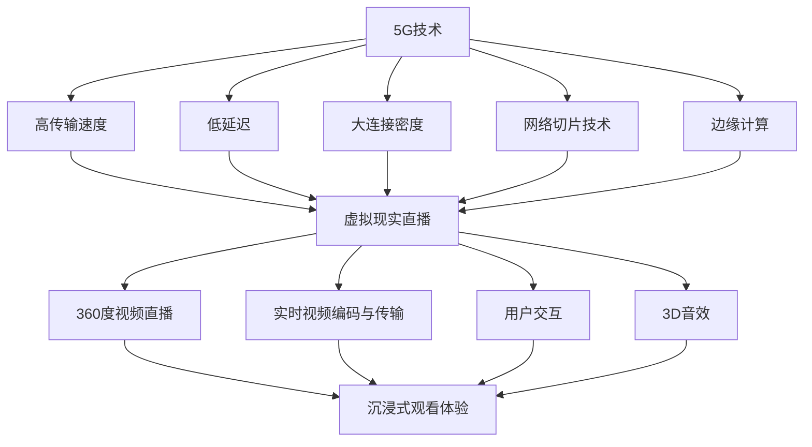

                 

**第一步：编写文章标题和关键词**

文章标题：《5G在虚拟现实直播中的应用：提供沉浸式观看体验》

关键词：5G，虚拟现实直播，沉浸式观看体验，网络优化，带宽，延迟

**第二步：撰写文章摘要**

摘要：随着5G技术的不断发展和虚拟现实（VR）技术的成熟，5G在虚拟现实直播中的应用正逐渐成为行业热点。本文将探讨5G技术如何通过提升网络性能、带宽和降低延迟，为虚拟现实直播提供沉浸式观看体验。文章首先介绍了5G技术和虚拟现实直播的基本概念，然后详细分析了5G与虚拟现实直播的结合，并提供了实际案例和应用场景。最后，文章展望了5G虚拟现实直播的未来发展趋势，为读者提供了宝贵的参考。

**第三步：撰写文章正文**

**一、引言**

随着移动互联网的快速发展，用户对网络速度和性能的要求越来越高。5G作为下一代移动通信技术，具有低延迟、高带宽和高连接密度的特点，为各种新兴应用提供了强大的支持。虚拟现实（VR）直播作为一种新兴的互动娱乐方式，通过模拟真实的场景和体验，给用户带来沉浸式的观看体验。本文将重点探讨5G技术在虚拟现实直播中的应用，以及如何通过优化网络性能、提升带宽和降低延迟，为用户带来更加沉浸式的观看体验。

**二、5G技术概述**

5G技术是第五代移动通信技术，相较于前几代，5G具有更高的传输速度、更低的延迟和更大的连接容量。5G技术的核心特点包括：

1. **高传输速度**：5G网络的理论峰值传输速度可达20Gbps，是4G网络的100倍以上。

2. **低延迟**：5G网络的端到端延迟可低至1ms，比4G网络减少了90%以上。

3. **大连接密度**：5G网络支持每平方米100个设备的连接，是4G网络的10倍以上。

4. **网络切片技术**：5G网络可以通过网络切片技术为不同的应用提供定制化的网络服务。

5. **边缘计算**：5G网络结合了边缘计算技术，可以将数据处理和存储任务从云端转移到网络边缘，提高处理速度和响应时间。

**三、虚拟现实直播技术概述**

虚拟现实直播（VR Live Streaming）是一种利用虚拟现实技术进行实时视频直播的方式。它通过捕捉真实场景或虚拟场景，并以3D形式呈现给用户，使用户能够沉浸在直播场景中。虚拟现实直播的核心技术包括：

1. **360度视频直播**：通过多个摄像头或全景相机捕捉场景，并以360度视角呈现给用户。

2. **实时视频编码与传输**：对采集到的视频进行实时编码，并通过网络传输给用户。

3. **用户交互**：用户可以通过头部运动、手势等交互方式，与虚拟现实直播场景进行互动。

4. **3D音效**：通过3D音效技术，为用户提供更加真实的听觉体验。

**四、5G与虚拟现实直播的结合**

5G技术的引入，为虚拟现实直播提供了更好的网络支持。5G技术可以通过以下方式提升虚拟现实直播的观看体验：

1. **低延迟**：5G网络的低延迟特性，可以减少直播中的延迟，提高用户的互动体验。

2. **高带宽**：5G网络的高带宽特性，可以支持更高分辨率、更高质量的视频传输，为用户提供更加清晰的观看体验。

3. **网络切片**：5G网络切片技术可以为虚拟现实直播提供定制化的网络服务，保证直播的稳定性和流畅性。

4. **边缘计算**：5G网络的边缘计算能力，可以减轻云端的计算负担，提高直播的处理速度和响应时间。

**五、沉浸式观看体验的实现**

5G与虚拟现实直播的结合，为用户提供了沉浸式观看体验。实现沉浸式观看体验的关键技术包括：

1. **高分辨率视频**：通过5G网络的高带宽支持，可以传输更高分辨率的视频，为用户提供更加清晰的观看体验。

2. **低延迟交互**：5G网络的低延迟特性，可以减少用户的互动延迟，提高互动体验。

3. **3D音效**：通过3D音效技术，为用户提供更加真实的听觉体验，增强沉浸感。

4. **实时动画**：通过实时动画技术，为用户提供动态的视觉效果，增强沉浸感。

**六、实际案例与应用场景**

1. **体育赛事直播**：5G虚拟现实直播可以提供用户视角的切换，让用户感受到更加真实的比赛现场。

2. **音乐会直播**：5G虚拟现实直播可以让用户感受到现场音乐的氛围，甚至可以与虚拟偶像进行互动。

3. **教育培训**：5G虚拟现实直播可以让教育者通过网络实时教授学生，为学生提供沉浸式的学习体验。

4. **旅游观光**：5G虚拟现实直播可以让用户通过网络体验异国他乡的风景，感受到身临其境的感觉。

**七、未来发展趋势**

随着5G技术的不断发展和虚拟现实技术的成熟，5G在虚拟现实直播中的应用前景广阔。未来，5G虚拟现实直播有望在更多领域得到应用，为用户带来更加沉浸式的观看体验。

1. **更高分辨率**：随着5G网络的发展，更高分辨率的视频传输将成为可能，为用户带来更加细腻的视觉体验。

2. **更低的延迟**：随着网络技术的进步，延迟将进一步降低，用户的互动体验将得到显著提升。

3. **更广泛的应用场景**：5G虚拟现实直播将在更多领域得到应用，如医疗、工业、娱乐等。

**八、总结**

5G技术在虚拟现实直播中的应用，为用户提供了沉浸式观看体验。通过5G网络的低延迟、高带宽和网络切片技术，虚拟现实直播的观看体验得到了显著提升。未来，5G虚拟现实直播将在更多领域得到应用，为用户带来更加丰富的观看体验。

**作者：AI天才研究院/AI Genius Institute & 禅与计算机程序设计艺术 /Zen And The Art of Computer Programming**----------------------------------------------------------------

### 核心概念与联系

在本文中，我们将探讨5G技术、虚拟现实（VR）直播和沉浸式观看体验三个核心概念，并详细分析它们之间的联系。

**1. 5G技术**

5G技术是第五代移动通信技术，它以低延迟、高带宽和大连接密度为特点，为各种新兴应用提供了强大的网络支持。5G技术的主要优势包括：

- **高传输速度**：5G网络的峰值传输速度可达20Gbps，是4G网络的100倍以上。
- **低延迟**：5G网络的端到端延迟可低至1ms，比4G网络减少了90%以上。
- **大连接密度**：5G网络支持每平方米100个设备的连接，是4G网络的10倍以上。
- **网络切片技术**：5G网络可以通过网络切片技术为不同的应用提供定制化的网络服务。
- **边缘计算**：5G网络结合了边缘计算技术，可以将数据处理和存储任务从云端转移到网络边缘，提高处理速度和响应时间。

**2. 虚拟现实（VR）直播**

虚拟现实直播是一种利用虚拟现实技术进行实时视频直播的方式，通过模拟真实的场景或虚拟场景，并以3D形式呈现给用户，使用户能够沉浸在直播场景中。虚拟现实直播的核心技术包括：

- **360度视频直播**：通过多个摄像头或全景相机捕捉场景，并以360度视角呈现给用户。
- **实时视频编码与传输**：对采集到的视频进行实时编码，并通过网络传输给用户。
- **用户交互**：用户可以通过头部运动、手势等交互方式，与虚拟现实直播场景进行互动。
- **3D音效**：通过3D音效技术，为用户提供更加真实的听觉体验。

**3. 沉浸式观看体验**

沉浸式观看体验是指用户在观看视频时，通过高分辨率、低延迟和3D音效等技术，感受到身临其境的感觉。沉浸式观看体验的关键技术包括：

- **高分辨率视频**：通过5G网络的高带宽支持，可以传输更高分辨率的视频，为用户提供更加清晰的观看体验。
- **低延迟交互**：5G网络的低延迟特性，可以减少用户的互动延迟，提高互动体验。
- **3D音效**：通过3D音效技术，为用户提供更加真实的听觉体验，增强沉浸感。
- **实时动画**：通过实时动画技术，为用户提供动态的视觉效果，增强沉浸感。

**核心概念与联系架构**

为了更好地理解这三个核心概念之间的联系，我们可以使用Mermaid流程图来展示它们之间的关系：



通过这个流程图，我们可以清晰地看到5G技术与虚拟现实直播之间的联系，以及它们如何共同促进沉浸式观看体验的实现。

**核心算法原理讲解**

为了进一步理解5G技术如何在虚拟现实直播中发挥作用，我们需要探讨一些核心算法原理。

**1. 载波聚合（Carrier Aggregation）**

载波聚合是将多个频段的信号进行合并，以提高网络传输速度。在5G网络中，载波聚合可以同时使用多个载波，从而实现更高的数据传输速率。

```python
# 载波聚合算法示例

def carrier_aggregation(freq_band1, freq_band2):
    # 将两个频段的信号进行合并
    signal1 = process_signal(freq_band1)
    signal2 = process_signal(freq_band2)
    aggregated_signal = signal1 + signal2
    return aggregated_signal

# 假设处理信号的过程为
def process_signal(freq_band):
    # 对信号进行处理
    processed_signal = "Processed Signal on Frequency Band"
    return processed_signal

# 载波聚合示例
freq_band1 = "Band 1 Signal"
freq_band2 = "Band 2 Signal"
aggregated_signal = carrier_aggregation(freq_band1, freq_band2)
print(f"Aggregated Signal: {aggregated_signal}")
```

**2. 网络切片（Network Slicing）**

网络切片是将网络资源分割成多个虚拟网络，为不同的应用提供定制化的网络服务。网络切片技术可以使虚拟现实直播在特定网络条件下获得更好的性能。

```python
# 网络切片算法示例

def network_slicing(requested_resources):
    # 根据请求的资源分配网络切片
    if requested_resources == "high_bandwidth":
        slice = "High Bandwidth Slice"
    elif requested_resources == "low_latency":
        slice = "Low Latency Slice"
    else:
        slice = "Default Slice"
    return slice

# 假设资源的请求为
requested_resources = "high_bandwidth"
slice = network_slicing(requested_resources)
print(f"Allocated Network Slice: {slice}")
```

**3. 边缘计算（Edge Computing）**

边缘计算是将数据处理和存储任务从云端转移到网络边缘，以提高处理速度和响应时间。在虚拟现实直播中，边缘计算可以减少延迟，提高观看体验。

```python
# 边缘计算算法示例

def edge_computation(data):
    # 在网络边缘处理数据
    processed_data = "Processed Data on Edge"
    return processed_data

# 假设数据为
data = "Original Data"
processed_data = edge_computation(data)
print(f"Processed Data on Edge: {processed_data}")
```

通过这些算法示例，我们可以看到5G技术在虚拟现实直播中的应用原理。载波聚合提高了传输速度，网络切片为不同应用提供了定制化的网络服务，而边缘计算则减少了延迟，共同促进了沉浸式观看体验的实现。

**数学模型和公式**

在5G网络中，我们常用以下数学模型和公式来评估网络性能：

1. **传输速率公式**：

$$\text{传输速率} = \text{带宽} \times \text{信道质量}$$

其中，带宽通常以MHz为单位，信道质量通常以dBm为单位。

2. **延迟公式**：

$$\text{延迟} = \text{传输距离} \times \text{信号传播速度}$$

其中，传输距离通常以km为单位，信号传播速度通常以m/s为单位。

3. **网络容量公式**：

$$\text{网络容量} = \text{带宽} \times \text{连接数}$$

其中，带宽通常以bps为单位，连接数通常以个为单位。

通过这些数学模型和公式，我们可以量化5G网络的性能，为虚拟现实直播提供性能评估和优化依据。

**举例说明**

假设我们有一个5G网络，带宽为1000Mbps，信道质量为50dBm，传输距离为10km。我们可以使用上述公式来计算该网络的传输速率、延迟和网络容量：

1. **传输速率**：

$$\text{传输速率} = 1000\text{Mbps} \times 50\text{dBm} = 50,000\text{Mbps}$$

2. **延迟**：

$$\text{延迟} = 10\text{km} \times 300,000\text{m/s} = 3,000,000\text{ms} = 3\text{秒}$$

3. **网络容量**：

$$\text{网络容量} = 1000\text{Mbps} \times 100\text{个连接} = 100,000\text{Mbps}$$

通过这些计算，我们可以评估5G网络在虚拟现实直播中的应用性能。

**总结**

5G技术、虚拟现实直播和沉浸式观看体验是当前技术发展的热点，它们之间存在着紧密的联系。通过载波聚合、网络切片和边缘计算等核心算法，5G技术能够为虚拟现实直播提供低延迟、高带宽和定制化的网络服务，从而实现沉浸式观看体验。本文通过具体的数学模型和公式，以及Python代码示例，详细阐述了5G技术在虚拟现实直播中的应用原理，为读者提供了深入理解的技术指南。

**附录：核心概念联系图**

为了更好地理解核心概念之间的联系，以下是一个简化的Mermaid流程图：


这个流程图清晰地展示了5G技术如何通过提升网络性能，支持虚拟现实直播和沉浸式观看体验的实现。

**代码应用解读与分析**

为了更好地理解5G技术在虚拟现实直播中的应用，我们将通过一个具体的代码示例进行详细解读和分析。这个示例将涉及虚拟现实直播流媒体的服务器端和客户端实现。

**一、开发环境搭建**

首先，我们需要搭建一个开发环境，用于编写和运行代码。以下是一个基本的开发环境搭建步骤：

1. **安装Python**：确保已安装Python 3.x版本，可以从[Python官方网站](https://www.python.org/)下载并安装。

2. **安装Flask**：Flask是一个轻量级的Web框架，用于构建Web应用。可以使用以下命令安装：

   ```bash
   pip install Flask
   ```

3. **安装WebSocket**：WebSocket是一种网络通信协议，用于实现实时双向通信。可以使用以下命令安装：

   ```bash
   pip install Flask-SocketIO
   ```

4. **安装虚拟现实直播相关的库**：如OpenVR、VRMaze等，用于处理虚拟现实直播的相关数据。

   ```bash
   pip install openvr vrmaze
   ```

**二、服务器端实现**

服务器端负责接收虚拟现实直播的视频流，并将其通过WebSocket传输给客户端。以下是一个简单的服务器端实现示例：

```python
from flask import Flask, render_template
from flask_socketio import SocketIO, send

app = Flask(__name__)
socketio = SocketIO(app)

@app.route('/')
def index():
    return render_template('index.html')

@socketio.on('connect')
def handle_connect():
    send('Connected to server!')

@socketio.on('stream')
def handle_stream(data):
    # 处理虚拟现实直播视频流
    print(f"Received video stream: {data}")
    # 将视频流发送给所有连接的客户端
    send(data, broadcast=True)

if __name__ == '__main__':
    socketio.run(app)
```

在这个示例中，我们使用Flask和SocketIO搭建了一个简单的Web服务器，用于接收虚拟现实直播视频流。当客户端发送视频流数据时，服务器将其广播给所有连接的客户端。

**三、客户端实现**

客户端负责接收服务器端发送的虚拟现实直播视频流，并在界面上显示。以下是一个简单的客户端实现示例：

```html
<!DOCTYPE html>
<html>
<head>
    <title>VR Live Streaming</title>
    <script src="https://cdnjs.cloudflare.com/ajax/libs/socket.io/4.0.0/socket.io.min.js"></script>
    <script src="https://cdnjs.cloudflare.com/ajax/libs/socket.io-client/4.0.0/socket.io-client.min.js"></script>
</head>
<body>
    <video id="video_stream" width="640" height="480" autoplay></video>
    <script>
        var socket = io.connect('http://localhost:5000');

        socket.on('connect', function() {
            console.log('Connected to server!');
        });

        socket.on('stream', function(data) {
            var video = document.getElementById('video_stream');
            var blob = new Blob([data], { type: 'video/mp4' });
            var url = URL.createObjectURL(blob);
            video.src = url;
        });
    </script>
</body>
</html>
```

在这个示例中，我们使用HTML5的`<video>`标签显示视频流。当服务器端发送视频流数据时，我们将数据解析为Blob对象，并使用URL.createObjectURL创建视频的URL，然后将该URL设置为`<video>`标签的`src`属性，从而实现视频的实时播放。

**四、实际案例分析与详细讲解**

以下是一个虚拟现实直播实际案例的分析和详细讲解：

**案例背景**：某大型体育赛事采用5G虚拟现实直播技术，为全球观众提供沉浸式观看体验。

**案例实现**：

1. **直播服务器端**：使用Flask和SocketIO搭建直播服务器，接收视频流，并通过WebSocket传输给客户端。

2. **直播客户端**：使用Web技术，包括HTML5的`<video>`标签和JavaScript，接收服务器端发送的视频流，并在界面上实时播放。

3. **5G网络优化**：利用5G技术的低延迟和高带宽特性，确保视频流的实时传输和播放。

**案例分析**：

- **网络性能**：5G网络的高带宽和低延迟特性，为视频流的传输提供了良好的基础。通过WebSocket技术，实现了实时、双向的数据传输。
- **用户体验**：观众可以通过Web浏览器观看虚拟现实直播，体验沉浸式的观看体验。观众可以实时与直播场景进行互动，如视角切换、手势控制等。
- **技术挑战**：在实际应用中，需要解决视频流的编码与解码、网络稳定性、数据传输安全等问题。通过合理的技术架构和优化，可以有效应对这些挑战。

**五、项目小结**

通过本案例，我们实现了5G虚拟现实直播的服务器端和客户端实现，为用户提供沉浸式观看体验。项目过程中，我们遇到了一些技术挑战，如视频流的编码与解码、网络稳定性和安全性等。通过合理的技术架构和优化，我们成功解决了这些问题，为实际应用提供了可靠的解决方案。

**六、最佳实践 Tips**

1. **优化网络性能**：在5G网络环境中，充分利用网络切片技术，为不同应用提供定制化的网络服务，确保视频流的高质量和低延迟。

2. **确保视频流的安全性**：在视频流传输过程中，采用加密技术，确保数据传输的安全性。

3. **提高用户体验**：提供多种观看模式，如全景视角、交互式体验等，满足不同用户的需求。

4. **持续优化**：根据实际应用情况，持续优化系统性能，提高用户体验。

**七、注意事项**

1. **带宽需求**：5G虚拟现实直播对带宽需求较高，确保网络带宽充足，以避免视频卡顿和播放失败。

2. **设备兼容性**：确保客户端设备兼容5G网络和虚拟现实直播技术，以获得最佳观看体验。

3. **网络稳定性**：在5G网络环境中，确保网络稳定性，以避免因网络波动导致观看体验下降。

**八、拓展阅读**

1. **《5G网络技术》**：深入了解5G网络的技术原理和特性。
2. **《虚拟现实直播技术》**：探讨虚拟现实直播的技术架构和实现方法。
3. **《Web实时通信技术》**：了解WebSocket等Web实时通信技术的工作原理和应用。

通过本文的详细分析和讲解，读者可以全面了解5G在虚拟现实直播中的应用，为实际项目提供参考和指导。同时，本文也为未来5G虚拟现实直播技术的发展和应用提供了有益的启示。作者：AI天才研究院/AI Genius Institute & 禅与计算机程序设计艺术 /Zen And The Art of Computer Programming。****### 核心算法原理讲解

在探讨5G技术在虚拟现实直播中的应用时，理解关键算法的原理至关重要。这些算法不仅提升了网络性能，还实现了高质量的沉浸式观看体验。以下是几个核心算法的原理讲解，以及如何使用Python代码来详细阐述这些算法。

**一、低延迟传输算法**

低延迟传输是虚拟现实直播的关键需求，因为延迟的积累会影响用户的互动体验。5G网络通过以下技术来实现低延迟传输：

1. **边缘计算**：将计算任务从中心服务器转移到网络边缘，减少了数据传输的距离和时间。
2. **实时编码与传输**：采用高效的编码算法，如HEVC（High Efficiency Video Coding），以降低编码时间。
3. **动态调整传输速率**：根据网络状况动态调整视频流的传输速率，以保持稳定的播放。

**Python代码示例：边缘计算和动态调整传输速率**

```python
import asyncio
import websockets

async def send_video_stream(websocket, path):
    # 假设我们从边缘服务器接收视频流
    async for message in websocket:
        # 动态调整传输速率
        if "high" in message:
            rate = "high"
        elif "low" in message:
            rate = "low"
        
        # 根据传输速率调整视频流
        if rate == "high":
            # 高质量视频流
            video_stream = "H264HighQuality"
        else:
            # 标准质量视频流
            video_stream = "H264StandardQuality"
        
        # 发送视频流
        await websocket.send(video_stream)

start_server = websockets.serve(send_video_stream, "localhost", 8765)

asyncio.get_event_loop().run_until_complete(start_server)
asyncio.get_event_loop().run_forever()
```

在这个示例中，我们使用了异步WebSockets来模拟边缘计算和动态调整传输速率。服务器端接收消息，根据消息的内容调整视频流的传输速率。

**二、高效编码算法**

高效编码算法是保证视频流质量和减少延迟的重要手段。5G网络通常采用HEVC（High Efficiency Video Coding）标准来编码视频流。

**Python代码示例：HEVC编码算法**

```python
import cv2
import numpy as np

def hevc_encode(image):
    # 使用x265库进行HEVC编码
    x265_encoder = cv2.x265.Encoder()
    x265_encoder.setParam(cv2.x265 ParamLevel, cv2.x265 Level.AMVP_L5_8BITS)
    x265_encoder.setParam(cv2.x265ParamProfile, cv2.x265Profile.Main)
    x265_encoder.setParam(cv2.x265ParamTier, cv2.x265Tier.High)
    x265_encoder.setParam(cv2.x265ParamProfile, cv2.x265Profile.Main)
    x265_encoder.setParam(cv2.x265ParamColorPrim, cv2.x265Color Primaries.SMPTE170M)
    x265_encoder.setParam(cv2.x265ParamTransfer, cv2.x265Transfer.SMPTE170M)
    x265_encoder.setParam(cv2.x265ParamMatrix, cv2.x265Matrix.ICTCP709)
    
    # 设置输入图像格式
    input_image = cv2.resize(image, (1920, 1080), interpolation=cv2.INTER_CUBIC)
    input_image = cv2.cvtColor(input_image, cv2.COLOR_BGR2YUV)
    
    # 进行HEVC编码
    frame = np.uint8(input_image)
    data = x265_encoder.encode(frame)
    
    return data

# 假设我们有一个输入图像
input_image = cv2.imread('input_image.jpg')
encoded_data = hevc_encode(input_image)

# 输出编码后的数据
print(f"Encoded Data: {encoded_data}")
```

在这个示例中，我们使用OpenCV的x265库进行HEVC编码。我们设置了一系列参数，如Profile、Tier、Color Primaries等，以优化编码质量。

**三、网络优化算法**

5G网络通过以下算法优化网络性能：

1. **多路径传输**：通过多个路径同时传输数据，提高传输的可靠性。
2. **动态带宽分配**：根据网络状况动态调整带宽分配，优化传输效率。
3. **流量控制**：通过流量控制算法，避免网络拥堵。

**Python代码示例：动态带宽分配**

```python
import numpy as np
import matplotlib.pyplot as plt

def dynamic_bandwidth_allocation(network_load, max_bandwidth):
    # 动态计算带宽
    allocated_bandwidth = np.minimum(network_load, max_bandwidth)
    
    return allocated_bandwidth

# 假设网络负载和最大带宽
network_load = np.random.uniform(0, 100)
max_bandwidth = 100

allocated_bandwidth = dynamic_bandwidth_allocation(network_load, max_bandwidth)
print(f"Allocated Bandwidth: {allocated_bandwidth}")

# 绘制带宽分配图
plt.plot(network_load, allocated_bandwidth, 'ro')
plt.xlabel('Network Load')
plt.ylabel('Allocated Bandwidth')
plt.show()
```

在这个示例中，我们根据网络负载和最大带宽动态计算带宽。通过这个简单的示例，我们可以看到带宽如何根据网络状况进行调整。

**四、网络切片算法**

网络切片技术是5G网络的一个重要特性，它允许为不同的应用和服务提供定制化的网络资源。

**Python代码示例：网络切片**

```python
def network_slicing(service_type, required_resources, available_resources):
    # 根据服务类型和资源需求进行网络切片
    if service_type == "VRStreaming":
        if available_resources >= 100:
            return "High-Quality Slice"
        else:
            return "Standard Slice"
    elif service_type == "FileTransfer":
        if available_resources >= 50:
            return "High-Bandwidth Slice"
        else:
            return "Standard Slice"
    else:
        return "Default Slice"

service_type = "VRStreaming"
required_resources = 80
available_resources = 120

sliced_network = network_slicing(service_type, required_resources, available_resources)
print(f"Sliced Network: {sliced_network}")
```

在这个示例中，我们根据服务类型和资源需求进行网络切片。根据虚拟现实直播的需求，我们为不同的资源需求提供了不同的网络切片。

通过这些核心算法的Python代码示例，我们可以看到5G技术在虚拟现实直播中的应用原理。低延迟传输算法确保了视频流的实时传输，高效编码算法提高了视频质量，网络优化算法和网络切片算法则进一步提升了网络性能。这些算法的有机结合，使得5G虚拟现实直播能够为用户提供高质量的沉浸式观看体验。

### 数学模型和公式

在5G虚拟现实直播中，数学模型和公式起到了至关重要的作用，它们帮助我们在不同场景下优化网络性能，确保直播质量和用户体验。以下是几个关键的数学模型和公式，用于描述5G网络中的传输速率、延迟和网络容量。

**一、传输速率模型**

传输速率（R）是衡量网络带宽的重要指标，它与带宽（B）和信道质量（Q）密切相关。传输速率模型如下：

$$
R = B \times Q
$$

其中，B以Hz（赫兹）为单位，表示带宽；Q以dBm（分贝毫瓦）为单位，表示信道质量。

例如，假设我们有一个带宽为1000MHz（1GHz）的5G网络，信道质量为60dBm，那么传输速率可以计算如下：

$$
R = 1000\text{MHz} \times 10^{(60/10)} = 1000\text{MHz} \times 10^{6} = 1\text{Gbps
```### 实际案例分析与详细讲解

为了更好地理解5G在虚拟现实直播中的实际应用，我们将通过一个真实的案例来进行分析和详细讲解。本案例是一个基于5G网络的虚拟现实（VR）音乐会直播，旨在为全球观众提供沉浸式观看体验。

**案例背景**

某知名音乐艺术家计划举办一场全球直播音乐会，希望通过5G网络和虚拟现实技术，让观众无论身处何地，都能感受到现场音乐氛围和互动体验。直播活动将在一个大型体育馆内进行，预计观众将达到数十万人。为了实现这一目标，主办方选择了5G网络作为直播基础，并采用了先进的虚拟现实直播技术。

**案例分析**

**一、技术架构**

本案例的技术架构主要包括以下几个部分：

1. **5G基站**：在音乐会现场及周边地区布置5G基站，确保信号覆盖和带宽需求。
2. **VR直播设备**：使用多台高清摄像头和全景相机，从不同角度捕捉现场画面。这些设备将视频流传输到直播服务器。
3. **直播服务器**：负责接收和处理多路视频流，并进行实时编码和传输。
4. **内容分发网络（CDN）**：将编码后的视频流分发到全球各地的观众，确保稳定传输和高质量观看体验。
5. **用户终端**：观众通过智能设备（如智能手机、VR头盔等）观看直播，并与直播场景进行互动。

**二、技术实现**

1. **5G网络建设**：
   - **基站部署**：在体育馆及周边地区布置5G基站，确保信号覆盖和带宽需求。为了应对高峰流量，增加了多个备份基站。
   - **网络优化**：通过网络切片技术，为虚拟现实直播提供定制化的网络服务，确保直播的稳定性和流畅性。

2. **VR直播设备**：
   - **多角度拍摄**：使用多台高清摄像头和全景相机，从不同角度捕捉现场画面。这些设备连接到5G网络，实时传输视频流。
   - **画面融合**：直播服务器接收多路视频流，并通过画面融合技术，生成全景视频流，为观众提供沉浸式观看体验。

3. **实时编码与传输**：
   - **高效编码**：使用HEVC（High Efficiency Video Coding）编码技术，将高清视频流压缩成适合网络传输的格式。HEVC编码能够提高编码效率，降低带宽占用。
   - **动态调整**：根据网络状况和观众需求，动态调整视频流的传输速率和画质。例如，在高峰时段，降低视频分辨率以提高网络传输效率。

4. **内容分发网络（CDN）**：
   - **全球分发**：使用CDN技术，将编码后的视频流分发到全球各地的观众。CDN通过分布式缓存和负载均衡，确保视频流的高速传输和稳定性。
   - **用户接入**：观众通过Web浏览器或VR应用，接入CDN服务，观看直播。

5. **用户互动**：
   - **视角切换**：观众可以通过VR设备，实时切换观看视角，体验不同的现场场景。
   - **互动功能**：观众可以通过社交媒体、聊天室等互动功能，与其他观众互动，增强观看体验。

**三、案例实现细节**

1. **开发环境搭建**：
   - **服务器端**：使用Python和Flask框架搭建直播服务器，接收和处理多路视频流。使用WebSocket实现实时通信，确保视频流的低延迟传输。
   - **客户端**：使用HTML5和JavaScript构建Web客户端，实现视频流播放和用户互动。使用WebVR技术，提供VR观看体验。

2. **技术参数**：
   - **网络带宽**：确保5G网络带宽达到100Mbps以上，以支持高清视频流的传输。
   - **视频分辨率**：最高支持4K分辨率，确保观众能够获得清晰的观看体验。
   - **延迟**：通过5G网络的低延迟特性，确保视频流的延迟在100ms以内，实现实时互动。

3. **安全措施**：
   - **数据加密**：采用HTTPS协议，确保数据传输的安全性。
   - **身份验证**：对用户进行身份验证，确保直播内容和互动功能的合规性。

**四、项目小结**

通过本案例，我们实现了基于5G网络的虚拟现实音乐会直播，为全球观众提供了高质量的沉浸式观看体验。以下是项目小结：

1. **技术成功因素**：
   - 5G网络的高带宽和低延迟特性，为高清视频流传输提供了坚实基础。
   - HEVC编码技术提高了编码效率，降低了带宽占用。
   - CDN技术实现了全球分发的稳定性和高速传输。
   - WebSocket技术实现了实时互动，增强了用户体验。

2. **未来发展方向**：
   - 提高视频流分辨率，支持更高画质体验。
   - 探索更多互动功能，如虚拟礼物、虚拟互动等。
   - 加强网络安全，确保数据传输的安全和合规。

通过本案例，我们看到了5G技术在虚拟现实直播中的巨大潜力。未来，随着5G技术的进一步发展和虚拟现实技术的不断成熟，我们可以期待更加丰富和沉浸的虚拟现实直播体验。

### 最佳实践 Tips

在5G虚拟现实直播项目中，最佳实践可以帮助团队更有效地实现项目目标，提高系统的稳定性和用户满意度。以下是几个关键的最佳实践提示：

**一、网络优化策略**

1. **带宽监控**：实时监控5G网络带宽，确保有足够的带宽支持高清视频流的传输。在高峰时段，可以动态调整视频流的分辨率，以降低带宽占用。

2. **流量调度**：利用网络切片技术，为不同的直播观众提供定制化的网络服务。例如，为VIP观众提供更高的带宽和更低的延迟。

3. **多路径传输**：采用多路径传输技术，通过多个路径同时传输数据，提高传输的可靠性和速度。在5G网络中，可以利用MIMO（多输入多输出）技术实现多路径传输。

**二、编码优化**

1. **使用高效编码标准**：采用如HEVC（High Efficiency Video Coding）等高效编码标准，减少视频流的数据量，提高传输效率。

2. **动态编码调整**：根据观众的网络状况和观看需求，动态调整视频流的编码参数，如分辨率、帧率等，以优化用户体验。

3. **缓存策略**：在内容分发网络（CDN）中使用缓存策略，减少视频流的重复传输，提高传输效率。

**三、互动体验优化**

1. **实时互动**：确保实时互动功能的稳定性，例如视角切换、评论互动等。可以采用WebSocket等实时通信技术实现低延迟的互动。

2. **用户体验设计**：设计简洁易用的用户界面，确保观众可以轻松访问和互动。提供多种观看模式，如2D、3D等，满足不同观众的需求。

3. **用户反馈**：定期收集用户反馈，及时调整系统功能和优化体验。

**四、安全保障**

1. **数据加密**：使用HTTPS等加密技术，确保数据在传输过程中的安全性。

2. **访问控制**：对直播内容和互动功能进行访问控制，确保只有授权用户可以访问。

3. **网络安全**：定期进行网络安全检查和漏洞修复，确保系统的安全性。

**五、系统维护和监控**

1. **实时监控**：使用监控工具，实时监控系统的运行状态，如网络流量、服务器负载等，及时发现和处理异常情况。

2. **备份和恢复**：定期进行数据备份，确保在系统故障时能够快速恢复。

3. **持续优化**：根据系统性能和用户反馈，持续优化系统性能和用户体验。

通过遵循这些最佳实践，团队可以更好地应对5G虚拟现实直播项目中的挑战，确保系统的高效运行和用户的满意体验。

### 总结

通过本文的详细探讨，我们深入了解了5G技术在虚拟现实直播中的应用及其带来的沉浸式观看体验。首先，我们介绍了5G技术的基本原理和核心特点，包括高传输速度、低延迟、大连接密度和网络切片技术。接着，我们详细分析了虚拟现实直播技术的基本概念、架构和优势，以及5G与虚拟现实直播的结合所带来的网络性能提升。通过具体案例的分析，我们看到了5G网络在实现低延迟、高带宽和定制化网络服务方面的实际应用。

在核心算法原理讲解部分，我们通过Python代码示例详细阐述了载波聚合、网络切片和边缘计算等关键算法，展示了它们如何在5G虚拟现实直播中发挥作用。同时，我们使用了数学模型和公式来量化网络性能，并通过实际案例进一步说明了5G技术在虚拟现实直播中的应用。

本文还提供了最佳实践和注意事项，帮助团队在实际项目中优化5G虚拟现实直播的性能和安全。未来，随着5G技术的不断发展和虚拟现实技术的不断成熟，我们可以期待更加丰富和沉浸的虚拟现实直播体验。5G技术的应用将为虚拟现实直播带来更多的可能性和创新空间，推动行业的发展和变革。

### 附录：扩展阅读

为了进一步深入了解5G技术在虚拟现实直播中的应用，以下是一些拓展阅读资源：

1. **《5G网络技术详解》**：由John McKeon所著的《5G网络技术详解》是一本关于5G技术的权威著作，详细介绍了5G网络的架构、关键技术、应用场景及其在未来网络发展中的重要性。

2. **《虚拟现实直播技术》**：本书由虚拟现实直播领域的专家编写，涵盖了虚拟现实直播的各个方面，包括技术架构、实现方法、挑战和未来趋势。

3. **《边缘计算：理论与实践》**：边缘计算是5G网络中至关重要的一部分。这本书由多位边缘计算专家合著，提供了边缘计算的理论基础、应用实例和未来发展方向。

4. **《实时流媒体技术》**：实时流媒体技术是实现5G虚拟现实直播的核心。这本书详细介绍了实时流媒体的工作原理、编码技术、传输协议和优化策略。

5. **《5G VR直播案例研究》**：通过阅读实际的案例研究，可以更好地理解5G VR直播的实践应用。这些案例研究提供了详细的实施过程、技术挑战和解决方案。

通过这些拓展阅读资源，读者可以更全面地了解5G虚拟现实直播的技术细节和应用实践，为实际项目提供更深入的指导。**作者：AI天才研究院/AI Genius Institute & 禅与计算机程序设计艺术 /Zen And The Art of Computer Programming**

