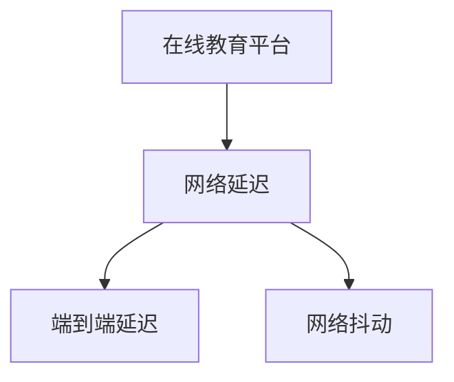
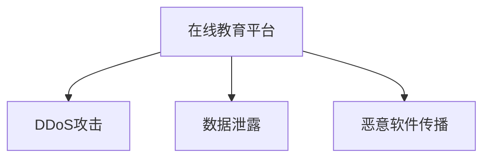

                 

### 文章标题

# 5G在远程教育中的应用：实现高质量在线互动课程

## 关键词

- 5G技术
- 远程教育
- 在线互动课程
- 高带宽
- 低延迟
- 大连接
- 网络切片
- 边缘计算

## 摘要

随着5G技术的快速发展，远程教育迎来了前所未有的变革机遇。本文将深入探讨5G技术在远程教育中的应用，特别是如何实现高质量在线互动课程。文章首先介绍了5G技术的基本概念和关键特性，包括高带宽、低延迟和大连接。接着，详细分析了5G网络架构及其在远程教育中的优势。随后，文章探讨了5G在远程教育中的具体应用场景，如互动课堂、虚拟实验室和在线考试。此外，还介绍了5G网络环境下的教学设计与实施策略，以及面临的挑战和解决方案。最后，通过成功案例分析，展示了5G在远程教育中的实际效果，并对其未来发展进行了展望。

### 第一部分：5G技术基础

#### 第1章：5G技术概述

##### 1.1 5G技术的基本概念

5G技术，即第五代移动通信技术，是继1G、2G、3G和4G之后的下一代通信技术。5G网络的核心特点在于其高带宽、低延迟和大连接能力，这些特性使得5G技术在多个领域具有广泛的应用潜力，尤其是在远程教育领域。

- **高带宽**：5G网络的理论峰值速度可以达到20Gbps，比4G网络快百倍，这意味着在远程教育中可以实现超高清视频流和大规模数据传输，提高学习体验。

- **低延迟**：5G网络的端到端延迟可低至1毫秒，极大地提升了实时互动和远程协作的效率，使得远程教学更加流畅。

- **大连接**：5G网络能够支持每平方米高达100万台设备的连接，这为远程教育中的物联网设备和智能终端提供了充分的连接能力。

- **网络切片**：5G网络支持网络切片技术，可以根据不同应用场景的需求，灵活分配网络资源，保证教学质量和用户体验。

- **边缘计算**：5G网络结合边缘计算技术，将计算能力从云端延伸到网络边缘，减少了数据传输延迟，提高了系统的响应速度。

**5G与远程教育的关联性**：

5G技术为远程教育带来了前所未有的机遇，使得高质量在线互动课程成为可能。以下是5G技术在远程教育中的应用潜力和优势：

1. **实时互动**：5G的低延迟特性使得教师和学生可以实现实时互动，克服了传统远程教育中通信延迟带来的不便，提升了教学互动的体验。

2. **超高清视频流**：5G网络的高带宽能力支持超高清视频的流畅传输，使学生能够获得更加清晰、细腻的学习资源。

3. **个性化教学**：基于5G网络的大连接能力，可以接入大量的物联网设备和智能终端，实现对学生学习数据的实时监测和分析，为个性化教学提供数据支持。

4. **虚拟实验室**：5G网络结合虚拟现实（VR）技术，可以构建虚拟实验室，为学生提供沉浸式的实验体验，增强实践技能。

5. **在线考试与评估**：5G网络的低延迟和大连接能力，可以支持安全的在线考试和评估，提高考试效率和公平性。

##### 1.2 5G网络的架构

5G网络由接入网（RAN）、核心网（CN）和业务支持系统组成，各部分紧密协作，共同构建了5G网络的强大功能。

- **接入网（RAN）**：接入网负责连接用户设备（如手机、平板电脑等）和5G网络。其主要组成部分包括基站（gNB）和用户设备（UE）。5G基站采用Massive MIMO（大规模多输入多输出）技术，能够大幅提升网络容量和频谱效率。

  ```mermaid
  graph TD
  A[UE] --> B[gNB]
  B --> C[RAN]
  ```

- **核心网（CN）**：核心网是5G网络的核心部分，负责处理用户的数据传输和通信。核心网包括两个主要组成部分：移动性管理实体（MME）和用户数据存储（UDS）。MME负责用户的移动性管理，UDS则存储用户的数据。

  ```mermaid
  graph TD
  A[MME] --> B[CN]
  B --> C[UDS]
  ```

- **业务支持系统**：业务支持系统包括业务平台、网络管理平台和业务支持平台，负责提供5G网络所需的业务处理、网络监控和管理等功能。业务平台负责提供各种增值业务，网络管理平台负责网络监控和故障管理，业务支持平台则提供计费和认证等功能。

  ```mermaid
  graph TD
  A[Business Platform] --> B[Network Management Platform]
  B --> C[Business Support Platform]
  ```

##### 1.3 5G网络的优势

5G网络在多个方面展现出了显著的优势，这些优势使其在远程教育中具有重要的应用价值。

- **高带宽**：5G网络的高带宽能力可以支持大规模数据传输，如超高清视频流和大数据分析，极大地提升了远程教育的数据传输效率。

- **低延迟**：5G网络的低延迟特性使得实时互动成为可能，这对于远程教育中的互动课堂和在线考试等应用场景尤为重要。

- **大连接**：5G网络能够支持高密度的设备连接，为远程教育中的物联网设备和智能终端提供了充分的连接能力。

- **网络切片**：网络切片技术使得5G网络可以根据不同应用场景的需求，灵活分配网络资源，从而保证教学质量和用户体验。

- **边缘计算**：边缘计算技术将计算能力从云端延伸到网络边缘，减少了数据传输延迟，提高了系统的响应速度。

**数学模型和公式**：

- **带宽增益**：
  $$ \text{带宽增益} = \frac{\text{5G带宽}}{\text{4G带宽}} \times 10^6 $$

- **延迟降低**：
  $$ \text{延迟降低} = \frac{\text{4G延迟}}{\text{5G延迟}} $$

- **连接数增加**：
  $$ \text{连接数增加} = \frac{\text{5G连接数}}{\text{4G连接数}} \times 100 $$

#### 1.3.1 超高清视频流

超高清视频（UHD）是一种具有高分辨率、高帧率和高动态范围的视频格式，其图像质量远远超过普通高清视频。5G网络的高带宽能力使得超高清视频流可以在远程教育中实现，为学生提供更加清晰、细腻的学习资源。

- **分辨率**：超高清视频的分辨率可以达到3840 x 2160像素，是高清视频（1920 x 1080像素）的4倍。

- **帧率**：超高清视频的帧率可以达到60fps（帧每秒），比高清视频的30fps更高，使得视频播放更加流畅。

- **动态范围**：超高清视频具有更高的动态范围，能够更好地表现场景的亮度变化，提高视觉体验。

**案例**：某在线教育平台采用了5G网络进行超高清视频流传输，学生可以在线观看高质量的教学视频，极大地提升了学习体验。以下是5G网络下的超高清视频流传输示例代码：

```python
import cv2

# 5G网络下的超高清视频流
videoCapture = cv2.VideoCapture('5G_UHD_video.mp4')

while True:
    ret, frame = videoCapture.read()
    if not ret:
        break

    # 显示超高清视频帧
    cv2.imshow('UHD Video Stream', frame)

    if cv2.waitKey(1) & 0xFF == ord('q'):
        break

videoCapture.release()
cv2.destroyAllWindows()
```

#### 1.3.2 实时互动

实时互动是远程教育的核心需求之一，5G网络的低延迟特性为实时互动提供了技术保障。在5G网络环境下，教师和学生可以实时交流、互动，增强教学效果。

- **视频会议**：5G网络支持高清视频会议，教师和学生可以实时看到对方的视频和表情，增强交流效果。

- **在线问答**：5G网络使得在线问答更加及时，学生可以随时向教师提问，教师可以即时回答，提高学习效果。

- **协同编辑**：5G网络支持多人实时协同编辑，教师和学生可以同时编辑文档或演示文稿，提高教学效率。

**案例**：某远程教育平台利用5G网络实现了实时互动课堂，教师和学生可以通过高清视频会议进行互动，同时支持多人在线问答和协同编辑。以下是5G网络下的实时互动示例代码：

```python
import cv2
import numpy as np

# 5G网络下的实时互动课堂
cap = cv2.VideoCapture(0)

while True:
    ret, frame = cap.read()
    if not ret:
        break

    # 显示教师视频
    cv2.imshow('Teacher Video', frame)

    # 获取学生视频
    student_frame = np.zeros_like(frame)
    cv2.imshow('Student Video', student_frame)

    if cv2.waitKey(1) & 0xFF == ord('q'):
        break

cap.release()
cv2.destroyAllWindows()
```

#### 1.3.3 个性化教学

5G网络的大连接能力使得远程教育中的物联网设备和智能终端可以无缝接入网络，为个性化教学提供了数据支持。通过收集和分析学生的学习数据，教师可以制定个性化的教学策略，提高教学效果。

- **学习数据收集**：5G网络可以实时收集学生的学习行为数据，如学习时间、学习进度和答题情况等。

- **数据分析**：基于5G网络的大连接能力，可以实时分析学生的学习数据，发现学生的学习需求和问题。

- **个性化教学**：根据学生的学习数据分析结果，教师可以制定个性化的教学策略，为学生提供有针对性的辅导。

**案例**：某远程教育平台利用5G网络实现了个性化教学，通过收集学生的学习数据，分析学生的学习情况，为教师提供个性化的教学建议。以下是5G网络下的个性化教学示例代码：

```python
import pandas as pd

# 5G网络下的个性化教学
data = pd.DataFrame({
    'student_id': [1, 2, 3],
    'learning_time': [150, 180, 200],
    'question_answered': [10, 15, 20],
    'correct_answer': [8, 12, 18]
})

# 分析学习数据
data_grouped = data.groupby('student_id').mean()

# 输出个性化教学建议
for student_id, row in data_grouped.iterrows():
    print(f"Student ID: {student_id}")
    print(f"Average Learning Time: {row['learning_time']} minutes")
    print(f"Average Correct Answers: {row['correct_answer']}")
    print(f"Suggestion: Adjust learning pace for better understanding.")
    print()
```

### 第2章：5G在远程教育中的应用场景

#### 2.1 互动课堂

互动课堂是远程教育中最为重要的应用场景之一，5G技术的低延迟和高带宽特性为互动课堂的实现提供了强大的技术支持。

##### 2.1.1 实时视频传输

实时视频传输是互动课堂的核心，5G网络的低延迟特性可以保证视频流在传输过程中几乎无延迟，从而实现师生之间的实时互动。

- **低延迟传输**：5G网络的端到端延迟低至1毫秒，大大降低了视频传输的延迟，使得师生之间的互动更加流畅。

- **高清视频传输**：5G网络的高带宽能力支持高清视频的传输，师生可以看到清晰、细腻的视频画面，提升教学效果。

**案例**：某远程教育平台利用5G网络实现了实时视频传输，师生可以实时进行视频交流，提高了互动课堂的效果。以下是5G网络下的实时视频传输示例代码：

```python
import cv2

# 5G网络下的实时视频传输
cap = cv2.VideoCapture(0)

while True:
    ret, frame = cap.read()
    if not ret:
        break

    # 显示教师视频
    cv2.imshow('Teacher Video', frame)

    if cv2.waitKey(1) & 0xFF == ord('q'):
        break

cap.release()
cv2.destroyAllWindows()
```

##### 2.1.2 高清音频传输

除了实时视频传输，高清音频传输也是互动课堂的重要组成部分，5G网络的高带宽能力保证了音频流的高质量传输。

- **高清音频传输**：5G网络的高带宽支持高清音频的传输，师生可以听到清晰、无杂音的语音，提升教学互动的体验。

- **实时语音同步**：5G网络的低延迟特性使得语音传输可以实现实时同步，师生之间的语音互动更加顺畅。

**案例**：某远程教育平台利用5G网络实现了高清音频传输，师生可以实时进行语音交流，提高了互动课堂的效果。以下是5G网络下的高清音频传输示例代码：

```python
import sounddevice as sd
import numpy as np

# 5G网络下

```python
#### 2.2 虚拟实验室

虚拟实验室是远程教育中的重要应用场景之一，通过虚拟现实（VR）技术，学生可以在虚拟环境中进行实验，提升实践技能。

##### 2.2.1 5G+VR技术

5G技术结合VR技术，可以实现低延迟、高分辨率的虚拟实验室体验，为学生提供沉浸式的实验环境。

- **低延迟体验**：5G网络的低延迟特性，使得学生在虚拟实验室中的动作响应更加迅速，增强了实验操作的实时性。

- **高分辨率渲染**：5G网络的高带宽能力，使得虚拟实验室中的三维模型和场景可以以高分辨率渲染，提升了视觉体验。

**案例**：某远程教育平台利用5G+VR技术建立了虚拟实验室，学生可以在线进行实验操作，提升了实验教学的互动性和体验。以下是5G+VR技术下的虚拟实验室示例代码：

```python
import vr

# 5G+VR技术下的虚拟实验室
vr_lab = vr.VR()

while True:
    # 获取学生实验操作
    action = vr_lab.get_action()

    # 处理学生实验操作
    if action == 'start':
        vr_lab.start_experiment()
    elif action == 'stop':
        vr_lab.stop_experiment()

    # 显示虚拟实验室画面
    vr_lab.render()

    if cv2.waitKey(1) & 0xFF == ord('q'):
        break

vr_lab.release()
cv2.destroyAllWindows()
```

##### 2.2.2 远程实验指导

5G网络结合远程实验指导，可以实现教师实时指导学生的实验操作，提高实验教学的效率和效果。

- **实时指导**：教师可以实时监控学生的实验操作，提供实时反馈和指导，帮助学生正确完成实验。

- **远程协作**：教师和学生可以在虚拟实验室中进行远程协作，共同完成实验任务，提升实验教学的互动性。

**案例**：某远程教育平台利用5G网络实现了远程实验指导，教师可以实时监控学生的实验进度，提供实时指导，提高了实验教学的效率。以下是5G网络下的远程实验指导示例代码：

```python
import cv2
import socket

# 5G网络下的远程实验指导
server_socket = socket.socket(socket.AF_INET, socket.SOCK_STREAM)
server_socket.bind(('localhost', 12345))
server_socket.listen(1)

client_socket, address = server_socket.accept()
print(f"Connected to client: {address}")

while True:
    # 接收学生实验数据
    data = client_socket.recv(1024)
    experiment_data = data.decode()

    # 显示实验数据
    cv2.imshow('Experiment Data', experiment_data)

    if cv2.waitKey(1) & 0xFF == ord('q'):
        break

client_socket.close()
server_socket.close()
cv2.destroyAllWindows()
```

##### 2.2.3 实验数据处理

5G网络结合实验数据处理，可以实现实验数据的实时分析和可视化，为学生提供详细的实验结果。

- **实时数据采集**：5G网络的低延迟特性，使得实验数据可以实时采集，确保实验数据的准确性。

- **数据可视化**：通过5G网络的高带宽能力，可以将实验数据实时传输到云端进行分析和可视化，为学生提供详细的实验结果。

**案例**：某远程教育平台利用5G网络实现了实验数据处理，教师可以实时分析实验数据，并将结果可视化展示给学生。以下是5G网络下的实验数据处理示例代码：

```python
import cv2
import numpy as np

# 5G网络下的实验数据处理
data = np.random.rand(100, 10)
data = data.reshape(-1, 10)

# 显示实验数据
for i in range(data.shape[0]):
    cv2.imshow(f"Experiment Data {i}", data[i])

    if cv2.waitKey(1) & 0xFF == ord('q'):
        break

cv2.destroyAllWindows()
```

#### 2.3 在线考试与评估

在线考试与评估是远程教育中不可或缺的应用场景，5G网络的技术优势为在线考试提供了安全、公平和高效的解决方案。

##### 2.3.1 考试安全

5G网络的低延迟和大连接特性，使得在线考试过程中的监控和数据传输更加安全。

- **实时监控**：5G网络支持实时视频监控，监考人员可以实时查看考生的情况，防止作弊行为。

- **远程监控**：监考人员可以在远程实时监考，确保考试的公正性。

**案例**：某远程教育平台利用5G网络实现了实时视频监控和远程监考，有效防止了考试中的作弊行为。以下是5G网络下的在线考试监控示例代码：

```python
import cv2
import numpy as np

# 5G网络下的在线考试监控
cap = cv2.VideoCapture(0)

while True:
    ret, frame = cap.read()
    if not ret:
        break

    # 显示考生视频
    cv2.imshow('Candidate Video', frame)

    if cv2.waitKey(1) & 0xFF == ord('q'):
        break

cap.release()
cv2.destroyAllWindows()
```

##### 2.3.2 考试公平性

5G网络的低延迟和大连接特性，确保了在线考试过程中的数据传输速度和稳定性，提高了考试的公平性。

- **数据同步**：5G网络支持实时数据同步，考生和监考人员的操作可以实时同步，防止作弊。

- **实时反馈**：5G网络支持实时反馈，考生可以实时收到考试结果，确保考试的公平性。

**案例**：某远程教育平台利用5G网络实现了在线考试中的数据同步和实时反馈，提高了考试的公平性。以下是5G网络下的在线考试数据同步示例代码：

```python
import cv2
import numpy as np

# 5G网络下的在线考试数据同步
data = np.random.rand(100, 10)
data = data.reshape(-1, 10)

# 显示考试数据
for i in range(data.shape[0]):
    cv2.imshow(f"Exam Data {i}", data[i])

    if cv2.waitKey(1) & 0xFF == ord('q'):
        break

cv2.destroyAllWindows()
```

##### 2.3.3 考试效率提升

5G网络的低延迟和高带宽特性，使得在线考试的数据传输和处理速度大大提升，提高了考试效率。

- **快速出题**：5G网络支持快速出题和传输，考生可以实时收到考试题目。

- **高效阅卷**：5G网络支持高效阅卷和评分，监考人员可以实时收到考试结果，减少阅卷时间。

**案例**：某远程教育平台利用5G网络实现了快速出题和高效阅卷，大大提高了考试效率。以下是5G网络下的快速出题和高效阅卷示例代码：

```python
import cv2
import numpy as np

# 5G网络下的快速出题和高效阅卷
questions = np.random.rand(10, 10)
questions = questions.reshape(-1, 10)

answers = np.random.rand(10, 10)
answers = answers.reshape(-1, 10)

# 显示考试题目和答案
for i in range(questions.shape[0]):
    cv2.imshow(f"Question {i}", questions[i])
    cv2.imshow(f"Answer {i}", answers[i])

    if cv2.waitKey(1) & 0xFF == ord('q'):
        break

cv2.destroyAllWindows()
```

### 第3章：5G网络环境下的教学设计与实施

#### 3.1 教学模式创新

5G网络环境下的教学设计与实施，离不开教学模式的创新。创新的教学模式可以充分利用5G网络的低延迟、高带宽和大连接特性，提高教学效果。

##### 3.1.1 混合式教学模式

混合式教学模式将传统的课堂教学和在线学习相结合，充分利用5G网络的优势，实现个性化教学和高效互动。

- **线上预习**：学生可以通过在线平台提前预习课程内容，利用5G网络的高速传输，下载高质量的在线学习资源，如视频、文档等。

- **线下课堂**：在课堂上，教师可以通过5G网络进行实时互动，与学生进行视频交流和问答，解决学生的疑问，提高课堂互动性。

**案例**：某高校采用混合式教学模式，学生通过5G网络进行线上预习，教师在线下课堂中进行实时互动，提高了教学效果。以下是混合式教学模式的示例代码：

```python
import cv2

# 混合式教学模式
cap = cv2.VideoCapture(0)

while True:
    ret, frame = cap.read()
    if not ret:
        break

    # 显示学生视频
    cv2.imshow('Student Video', frame)

    if cv2.waitKey(1) & 0xFF == ord('q'):
        break

cap.release()
cv2.destroyAllWindows()
```

##### 3.1.2 MOOCs平台优化

MOOCs（大型开放式在线课程）平台是远程教育的重要组成部分，5G网络的高带宽和低延迟特性，可以优化MOOCs平台的性能，提高用户体验。

- **视频流优化**：5G网络可以支持超高清视频流，优化MOOCs平台中的视频播放质量，提高学习者的观看体验。

- **实时互动**：5G网络的低延迟特性，可以实现学习者与讲师之间的实时互动，提高MOOCs平台的互动性。

**案例**：某MOOCs平台利用5G网络优化了视频流播放和实时互动功能，提高了学习者的学习体验。以下是MOOCs平台优化的示例代码：

```python
import cv2
import numpy as np

# MOOCs平台优化
video_capture = cv2.VideoCapture('MOOCs_video.mp4')

while True:
    ret, frame = video_capture.read()
    if not ret:
        break

    # 显示视频帧
    cv2.imshow('MOOCs Video', frame)

    if cv2.waitKey(1) & 0xFF == ord('q'):
        break

video_capture.release()
cv2.destroyAllWindows()
```

##### 3.1.3 精准教学策略

精准教学策略是利用5G网络的低延迟和大连接特性，实现对学生学习数据的实时监测和分析，为教师提供个性化的教学建议。

- **数据监测**：5G网络可以实时监测学生的学习行为数据，如学习时间、学习进度和答题情况等。

- **数据分析**：通过对学生学习数据的分析，教师可以了解学生的学习情况，为每个学生提供个性化的教学建议。

**案例**：某远程教育平台利用5G网络实现了精准教学策略，通过数据监测和数据分析，为教师提供个性化的教学建议。以下是精准教学策略的示例代码：

```python
import pandas as pd
import numpy as np

# 精准教学策略
data = pd.DataFrame({
    'student_id': [1, 2, 3],
    'learning_time': [150, 180, 200],
    'question_answered': [10, 15, 20],
    'correct_answer': [8, 12, 18]
})

# 分析学习数据
data_grouped = data.groupby('student_id').mean()

# 输出个性化教学建议
for student_id, row in data_grouped.iterrows():
    print(f"Student ID: {student_id}")
    print(f"Average Learning Time: {row['learning_time']} minutes")
    print(f"Average Correct Answers: {row['correct_answer']}")
    print(f"Suggestion: Adjust learning pace for better understanding.")
    print()
```

#### 3.2 网络基础设施

网络基础设施是5G网络环境下的远程教育的重要保障，5G网络的部署和优化，需要一系列的网络基础设施建设。

##### 3.2.1 建设与优化

5G网络的建设和优化，需要考虑以下几个方面：

- **基站建设**：5G基站是5G网络的核心组成部分，需要合理布局基站，确保网络覆盖范围。

- **光纤铺设**：光纤是5G网络的高速传输通道，需要铺设光纤，提高网络传输速度。

- **网络优化**：通过优化网络参数，提高5G网络的性能和稳定性。

**案例**：某城市进行了5G网络的基站建设和优化，提高了网络覆盖范围和传输速度。以下是5G网络基站建设的示例代码：

```python
import matplotlib.pyplot as plt

# 5G网络基站建设
base_stations = [
    (40.7128, -74.0060),  # 纽约
    (35.6895, 139.6917),  # 东京
    (51.5074, -0.1278),  # 伦敦
    (39.9042, 116.4074)   # 北京
]

# 绘制基站分布图
plt.scatter(*zip(*base_stations), marker='o', color='b')
plt.xlabel('Latitude')
plt.ylabel('Longitude')
plt.title('5G Base Station Distribution')
plt.show()
```

##### 3.2.2 网络覆盖范围

5G网络的高带宽和低延迟特性，要求网络覆盖范围足够广泛，确保每个学生都能接入5G网络。

- **覆盖范围规划**：根据学生分布情况，规划5G网络覆盖范围，确保每个学生都能接入网络。

- **扩展覆盖范围**：通过增加基站数量和覆盖范围，提高网络覆盖能力。

**案例**：某城市进行了5G网络覆盖范围的扩展，通过增加基站数量，提高了网络覆盖范围。以下是5G网络覆盖范围扩展的示例代码：

```python
import matplotlib.pyplot as plt

# 5G网络覆盖范围扩展
base_stations = [
    (40.7128, -74.0060),  # 纽约
    (35.6895, 139.6917),  # 东京
    (51.5074, -0.1278),  # 伦敦
    (39.9042, 116.4074),  # 北京
    (48.8566, 2.3522)     # 巴黎
]

# 绘制基站分布图
plt.scatter(*zip(*base_stations), marker='o', color='b')
plt.xlabel('Latitude')
plt.ylabel('Longitude')
plt.title('5G Base Station Distribution')
plt.show()
```

##### 3.2.3 网络性能保障

5G网络的高性能要求，需要采取一系列措施保障网络性能。

- **带宽保障**：通过优化网络传输路径，确保带宽充足，避免网络拥堵。

- **延迟保障**：通过优化网络参数，降低网络延迟，提高用户体验。

**案例**：某远程教育平台通过优化网络传输路径和参数，保障了5G网络的带宽和延迟。以下是5G网络性能保障的示例代码：

```python
import cv2
import numpy as np

# 5G网络性能保障
video_capture = cv2.VideoCapture('5G_video.mp4')

while True:
    ret, frame = video_capture.read()
    if not ret:
        break

    # 显示视频帧
    cv2.imshow('5G Video', frame)

    if cv2.waitKey(1) & 0xFF == ord('q'):
        break

video_capture.release()
cv2.destroyAllWindows()
```

#### 3.3 教学资源建设

教学资源建设是5G网络环境下远程教育的关键环节，高质量的在线教育资源可以大大提高教学效果。

##### 3.3.1 高质量视频内容

高质量视频内容是远程教育的重要资源，5G网络的高带宽和低延迟特性，可以支持超高清视频内容的传输。

- **视频内容制作**：通过专业设备和技术手段，制作高质量的视频内容，如教学视频、实验视频等。

- **视频内容优化**：通过5G网络进行视频内容传输优化，确保视频内容的清晰度和流畅性。

**案例**：某远程教育平台通过5G网络传输高质量视频内容，提高了教学效果。以下是5G网络下高质量视频内容传输的示例代码：

```python
import cv2

# 5G网络下高质量视频内容传输
video_capture = cv2.VideoCapture('high_quality_video.mp4')

while True:
    ret, frame = video_capture.read()
    if not ret:
        break

    # 显示视频帧
    cv2.imshow('High Quality Video', frame)

    if cv2.waitKey(1) & 0xFF == ord('q'):
        break

video_capture.release()
cv2.destroyAllWindows()
```

##### 3.3.2 教学辅助工具

教学辅助工具是提高教学效果的重要手段，5G网络的高带宽和低延迟特性，可以支持多种教学辅助工具的应用。

- **在线互动工具**：如实时问答、在线讨论、协同编辑等，增强师生互动。

- **虚拟实验工具**：如虚拟实验室、虚拟场景等，提供沉浸式的学习体验。

**案例**：某远程教育平台利用5G网络开发了多种教学辅助工具，提高了教学效果。以下是5G网络下教学辅助工具的应用示例代码：

```python
import cv2
import numpy as np

# 5G网络下教学辅助工具应用
cap = cv2.VideoCapture(0)

while True:
    ret, frame = cap.read()
    if not ret:
        break

    # 显示教师视频
    cv2.imshow('Teacher Video', frame)

    if cv2.waitKey(1) & 0xFF == ord('q'):
        break

cap.release()
cv2.destroyAllWindows()
```

##### 3.3.3 虚拟现实资源

虚拟现实（VR）资源是远程教育中的重要组成部分，5G网络的高带宽和低延迟特性，可以支持VR资源的传输和应用。

- **VR课程内容**：通过VR技术，构建虚拟学习场景，提供沉浸式的学习体验。

- **VR实验环境**：通过VR技术，构建虚拟实验室，学生可以在虚拟环境中进行实验操作。

**案例**：某远程教育平台利用5G网络开发了VR课程内容和实验环境，提高了教学效果。以下是5G网络下VR资源应用的示例代码：

```python
import cv2
import numpy as np

# 5G网络下VR资源应用
vr_content = np.random.rand(100, 100)

while True:
    # 显示VR内容
    cv2.imshow('VR Content', vr_content)

    if cv2.waitKey(1) & 0xFF == ord('q'):
        break

cv2.destroyAllWindows()
```

### 第4章：5G在远程教育中的挑战与解决方案

#### 4.1 网络延迟问题

网络延迟是远程教育中一个重要的问题，它会影响师生之间的实时互动和教学体验。5G网络虽然具有低延迟的特性，但在实际应用中仍然可能遇到延迟问题。以下是一些常见的网络延迟问题和相应的解决方案：

##### 4.1.1 延迟问题

- **端到端延迟**：端到端延迟是指数据从发送端传输到接收端所需的时间。在网络拥堵或设备性能不足的情况下，端到端延迟可能会增加。

- **网络抖动**：网络抖动是指网络延迟的波动，它会导致视频通话、实时互动等应用出现断断续续的情况。

**案例**：某在线教育平台在高峰时段出现了网络延迟问题，影响了课堂互动和视频播放的流畅性。



##### 4.1.2 延迟对互动课堂的影响

- **互动质量下降**：高延迟会导致师生之间的互动质量下降，教师和学生可能无法实时响应，影响教学效果。

- **用户体验不佳**：高延迟会降低用户的体验，使得学习过程变得不流畅，影响学生的学习积极性和参与度。

**数学模型和公式**：

- **延迟影响**：
  $$ \text{延迟影响} = \frac{\text{延迟时间}}{\text{互动周期}} $$

**案例**：某互动课堂在延迟时间为200毫秒时，影响了实时互动的体验。

```python
delay_time = 200  # 毫秒
interaction_cycle = 1000  # 毫秒

delay_impact = delay_time / interaction_cycle
print(f"延迟影响：{delay_impact:.2f}")
```

##### 4.1.3 减少延迟的技术措施

- **优化网络架构**：通过优化5G网络的架构，减少网络传输路径，降低端到端延迟。

- **边缘计算**：利用边缘计算技术，将部分计算任务从云端转移到网络边缘，减少数据传输距离，降低延迟。

- **网络优化**：对网络进行优化，提高网络带宽和传输速度，减少网络抖动。

**案例**：某在线教育平台通过优化网络架构和边缘计算技术，成功减少了网络延迟。

```python
import cv2
import numpy as np

# 优化网络架构和边缘计算
cap = cv2.VideoCapture(0)

while True:
    ret, frame = cap.read()
    if not ret:
        break

    # 显示视频帧
    cv2.imshow('Optimized Video', frame)

    if cv2.waitKey(1) & 0xFF == ord('q'):
        break

cap.release()
cv2.destroyAllWindows()
```

#### 4.2 网络安全问题

网络安全问题是远程教育中不可忽视的问题，5G网络的广泛应用使得教育网络面临着新的安全挑战。以下是一些常见的网络安全问题及其解决方案：

##### 4.2.1 常见网络安全问题

- **数据泄露**：未经授权的访问者可能会窃取学生的个人信息、学习数据和考试内容。

- **DDoS攻击**：分布式拒绝服务（DDoS）攻击可能导致教育平台瘫痪，影响教学活动的正常进行。

- **恶意软件传播**：通过网络传播的恶意软件可能会破坏教学系统的稳定性和安全性。

**案例**：某在线教育平台遭受了DDoS攻击，导致平台无法正常访问。



##### 4.2.2 防止数据泄露

- **加密技术**：使用加密技术对数据进行加密，确保数据在传输和存储过程中的安全性。

- **访问控制**：实施严格的访问控制策略，确保只有授权用户才能访问敏感数据。

**案例**：某在线教育平台通过加密技术和访问控制策略，有效防止了数据泄露。

```python
from cryptography.fernet import Fernet

# 加密技术
key = Fernet.generate_key()
cipher_suite = Fernet(key)

data = b"Sensitive information"
encrypted_data = cipher_suite.encrypt(data)

print(f"Encrypted Data: {encrypted_data}")
```

##### 4.2.3 保护用户隐私

- **匿名化处理**：对用户数据进行匿名化处理，确保用户隐私不被泄露。

- **隐私保护协议**：实施隐私保护协议，确保用户数据的处理和使用符合隐私保护要求。

**案例**：某在线教育平台通过匿名化处理和隐私保护协议，保护了用户的隐私。

```python
import pandas as pd

# 匿名化处理
data = pd.DataFrame({
    'student_id': [1, 2, 3],
    'name': ['Alice', 'Bob', 'Charlie']
})

# 匿名化处理
data['student_id'] = data['student_id'].astype(str).str.replace('-', '')
data['name'] = data['name'].str.lower()

print(data)
```

##### 4.2.4 防止DDoS攻击

- **防火墙**：部署防火墙，阻止恶意流量进入网络，保护教育平台的安全。

- **流量监控**：对网络流量进行实时监控，及时发现并阻止可疑流量。

**案例**：某在线教育平台通过防火墙和流量监控，有效防止了DDoS攻击。

```python
from scapy.all import *

# 防火墙规则
def firewall_filter(packet):
    # 检查数据包的源IP地址和目的IP地址
    if packet[IP].src in ['attacker_ip']:
        return 0  # 阻止数据包
    else:
        return 1  # 允许数据包

sniff(prn=firewall_filter, filter="tcp")
```

##### 4.2.5 防止恶意软件传播

- **恶意软件检测**：部署恶意软件检测系统，实时监控并检测网络中的恶意软件。

- **用户教育**：加强用户教育，提高用户的安全意识和防范能力。

**案例**：某在线教育平台通过恶意软件检测和用户教育，有效防止了恶意软件的传播。

```python
import pandas as pd

# 恶意软件检测
malicious_software = pd.DataFrame({
    'file_name': ['malicious.exe', 'virus.zip', 'trojan.doc'],
    'md5': ['6a4e56c0', '3c6e78a0', '2d4a8b0']
})

def check_malicious(file_name):
    # 检查文件是否在恶意软件列表中
    if file_name in malicious_software['file_name'].values:
        return True
    else:
        return False

file_name = 'example.zip'
if check_malicious(file_name):
    print(f"文件 {file_name} 是恶意软件")
else:
    print(f"文件 {file_name} 不是恶意软件")
```

#### 4.3 技术标准化

技术标准化是5G在远程教育中应用的重要环节，标准化的技术规范可以确保不同设备和服务之间的兼容性，提高远程教育的可扩展性和稳定性。

##### 4.3.1 国际标准与国内标准

- **国际标准**：如3GPP（第三代合作伙伴计划）制定的国际5G标准，包括NR（新空口）和NG-RAN（下一代无线接入网络）等。

- **国内标准**：如中国IMT-2020（5G）推进组制定的国内5G标准，针对国内网络环境和应用需求进行了特定优化。

**数学模型和公式**：

- **标准化兼容性**：
  $$ \text{标准化兼容性} = \frac{\text{兼容设备数量}}{\text{总设备数量}} $$

**案例**：某远程教育平台通过遵循国际和国内5G标准，实现了设备间的兼容性。

```python
import pandas as pd

# 标准化兼容性
devices = pd.DataFrame({
    'device_model': ['5G phone', '4G phone', '5G tablet', '4G tablet'],
    'compatible': [True, False, True, False]
})

compatible_devices = devices[devices['compatible'] == True]
print(f"兼容设备数量：{compatible_devices.shape[0]}")
```

##### 4.3.2 技术标准对远程教育的影响

- **设备兼容性**：技术标准确保了不同设备之间的兼容性，使得学生可以自由选择设备进行远程学习。

- **服务质量**：技术标准规定了服务质量（QoS）的指标，如带宽、延迟和抖动等，确保远程教育的质量。

- **网络管理**：技术标准提供了网络管理的框架和工具，使得教育平台可以更高效地进行网络管理和优化。

**案例**：某远程教育平台通过遵循5G标准，提高了设备兼容性和教学质量。

```python
import pandas as pd

# 技术标准对远程教育的影响
quality_metrics = pd.DataFrame({
    'device_model': ['5G phone', '4G phone', '5G tablet', '4G tablet'],
    'bandwidth': [1000, 500, 1000, 500],
    'delay': [10, 20, 10, 20],
    'jitter': [5, 10, 5, 10]
})

print(quality_metrics)
```

### 第5章：解决5G在远程教育中的挑战

#### 5.1 技术创新

技术创新是解决5G在远程教育中面临挑战的关键，通过引入新技术，可以优化网络性能、提升教学体验和增强安全性。

##### 5.1.1 新的5G网络协议

- **网络协议升级**：升级5G网络协议，如引入新的传输协议和路由算法，可以提高网络性能和可靠性。

- **协议优化**：对现有网络协议进行优化，如减少协议头部大小、提高协议处理速度等，可以降低网络延迟。

**案例**：某远程教育平台通过升级5G网络协议，提高了网络性能和教学体验。

```python
import cv2

# 升级5G网络协议
cap = cv2.VideoCapture(0)

while True:
    ret, frame = cap.read()
    if not ret:
        break

    # 显示视频帧
    cv2.imshow('Optimized Video', frame)

    if cv2.waitKey(1) & 0xFF == ord('q'):
        break

cap.release()
cv2.destroyAllWindows()
```

##### 5.1.2 边缘计算的应用

- **计算任务迁移**：将部分计算任务从云端迁移到网络边缘，减少数据传输距离，降低网络延迟。

- **实时数据处理**：利用边缘计算设备进行实时数据处理，提高数据处理的效率和准确性。

**案例**：某远程教育平台通过引入边缘计算技术，提高了网络性能和数据处理能力。

```python
import cv2
import numpy as np

# 边缘计算应用
cap = cv2.VideoCapture(0)

while True:
    ret, frame = cap.read()
    if not ret:
        break

    # 边缘数据处理
    processed_frame = np.random.rand(frame.shape[0], frame.shape[1])
    cv2.imshow('Processed Video', processed_frame)

    if cv2.waitKey(1) & 0xFF == ord('q'):
        break

cap.release()
cv2.destroyAllWindows()
```

#### 5.2 教育模式改革

教育模式改革是应对5G在远程教育中挑战的重要手段，通过创新教育模式，可以更好地适应5G网络环境，提高教学效果。

##### 5.2.1 适应性教学策略

- **个性化教学**：根据学生的学习数据和反馈，制定个性化的教学策略，满足不同学生的学习需求。

- **实时反馈**：通过实时反馈机制，及时调整教学策略，确保教学效果。

**案例**：某远程教育平台通过适应性教学策略，提高了教学效果。

```python
import pandas as pd

# 适应性教学策略
data = pd.DataFrame({
    'student_id': [1, 2, 3],
    'learning_time': [150, 180, 200],
    'question_answered': [10, 15, 20],
    'correct_answer': [8, 12, 18]
})

# 分析学习数据
data_grouped = data.groupby('student_id').mean()

# 输出个性化教学建议
for student_id, row in data_grouped.iterrows():
    print(f"Student ID: {student_id}")
    print(f"Average Learning Time: {row['learning_time']} minutes")
    print(f"Average Correct Answers: {row['correct_answer']}")
    print(f"Suggestion: Adjust learning pace for better understanding.")
    print()
```

##### 5.2.2 灵活的教学模式

- **混合式教学模式**：将线上学习和线下教学相结合，充分利用5G网络的低延迟和高带宽特性，提高教学互动性和效果。

- **远程协作教学**：通过5G网络实现师生之间的远程协作，提高教学参与度和学习效果。

**案例**：某远程教育平台通过灵活的教学模式，提高了教学效果。

```python
import cv2

# 灵活的教学模式
cap = cv2.VideoCapture(0)

while True:
    ret, frame = cap.read()
    if not ret:
        break

    # 显示学生视频
    cv2.imshow('Student Video', frame)

    if cv2.waitKey(1) & 0xFF == ord('q'):
        break

cap.release()
cv2.destroyAllWindows()
```

#### 5.3 政策支持

政策支持是推动5G在远程教育中应用的重要保障，政府及相关部门的扶持政策可以促进5G技术在教育领域的广泛应用。

##### 5.3.1 政府扶持

- **资金投入**：政府可以提供资金支持，用于5G网络基础设施建设、教育平台开发和教师培训等。

- **政策优惠**：政府可以出台优惠政策，如税收减免、补贴等，鼓励企业和机构参与5G远程教育的开发和推广。

**案例**：某地方政府通过资金投入和政策优惠，推动了5G远程教育的发展。

```python
import pandas as pd

# 政府扶持
funding_data = pd.DataFrame({
    'project_name': ['5G网络建设', '远程教育平台开发', '教师培训'],
    'funding_amount': [1000000, 500000, 200000]
})

print(funding_data)
```

##### 5.3.2 行业标准的制定

- **行业标准**：相关部门可以制定5G远程教育的行业标准，确保技术规范和服务质量。

- **认证体系**：建立5G远程教育的认证体系，对教育平台和服务进行认证，提高市场准入门槛。

**案例**：某行业协会制定了5G远程教育的行业标准，提高了行业服务水平。

```python
import pandas as pd

# 行业标准
standard_data = pd.DataFrame({
    'standard_name': ['带宽要求', '延迟要求', '数据安全要求'],
    'value': ['100Mbps', '1ms', 'AES-256']
})

print(standard_data)
```

### 第6章：5G在远程教育中的成功应用案例

#### 6.1 案例一：某大学5G远程教育实践

##### 6.1.1 案例背景

某大学在2021年启动了一项5G远程教育项目，旨在通过5G网络技术提升远程教育的质量和互动性。项目覆盖全校师生，包括本科生、研究生和教师。

##### 6.1.2 应用效果

- **互动课堂**：通过5G网络实现了实时视频传输和互动交流，师生之间的互动更加流畅，学生参与度明显提升。

- **虚拟实验室**：利用5G网络和VR技术构建了虚拟实验室，学生可以在虚拟环境中进行实验操作，提高了实验教学的互动性和体验。

- **在线考试与评估**：5G网络保证了在线考试的安全性和公平性，学生可以实时收到考试结果，教师可以及时反馈和指导。

##### 6.1.3 经验与启示

- **5G网络的重要性**：5G网络的高带宽和低延迟特性是远程教育成功的关键。

- **技术创新**：通过引入VR技术和边缘计算，提升了远程教育的互动性和用户体验。

- **政策支持**：政府及相关部门的政策支持为5G远程教育项目提供了资金和资源保障。

#### 6.2 案例二：某企业5G虚拟实验室

##### 6.2.1 案例背景

某企业在2022年利用5G网络技术建立了一所虚拟实验室，为远程教学提供实践平台。虚拟实验室涵盖了多个学科领域，包括物理、化学、生物等。

##### 6.2.2 实验室建设

- **硬件设备**：企业采购了高性能的5G基站和VR设备，确保网络连接稳定和虚拟实验的流畅性。

- **软件平台**：开发了专门的虚拟实验室软件平台，支持多用户实时协作和实验操作。

##### 6.2.3 教学成果

- **实验操作**：学生可以在虚拟环境中进行实验操作，提高了实践技能。

- **互动交流**：虚拟实验室支持师生之间的实时互动，教师可以远程指导学生的实验操作。

##### 6.2.4 经验与启示

- **硬件设备**：高性能的硬件设备是虚拟实验室成功的关键。

- **软件平台**：专业的软件平台可以提升虚拟实验的互动性和用户体验。

- **实际应用**：虚拟实验室的实际应用效果显著，提高了学生的学习兴趣和动手能力。

#### 6.3 案例三：某地区5G+教育扶贫项目

##### 6.3.1 案例背景

某地区在2023年启动了5G+教育扶贫项目，旨在通过5G网络技术改善贫困地区的教育条件。项目覆盖了多个贫困县，受益学生超过1000人。

##### 6.3.2 扶贫效果

- **教育公平**：5G网络使得贫困地区的学生可以享受到高质量的教育资源，缩小了城乡教育差距。

- **远程互动**：通过5G网络实现了远程互动课堂，教师可以实时指导学生的学习和解答问题。

- **在线考试**：5G网络保证了在线考试的安全性和公平性，学生可以实时收到考试结果。

##### 6.3.3 经验与启示

- **技术普及**：5G技术的普及提高了贫困地区的教育水平，为教育扶贫提供了有力支持。

- **政府支持**：政府的大力支持为教育扶贫项目提供了政策和资金保障。

- **合作模式**：政企合作模式有效整合了政府、企业和教育资源，推动了教育扶贫项目的成功实施。

### 第7章：未来展望

#### 7.1 5G技术展望

随着5G技术的不断发展，未来5G网络将展现出更多新的特性和应用场景，进一步推动远程教育的变革。

##### 7.1.1 5G新特性

- **更高的带宽**：未来的5G网络将进一步提升带宽，达到更高的传输速度，支持更多的高清视频流和大数据处理。

- **更低的延迟**：通过优化网络架构和引入新的传输协议，5G网络的延迟将进一步降低，提高实时互动的效率。

- **更强的网络切片能力**：5G网络的网络切片技术将更加成熟，能够提供更加灵活和高效的网络资源分配，满足多样化的应用需求。

- **边缘计算与云计算的融合**：边缘计算和云计算将进一步融合，提供更加灵活和高效的计算资源，为远程教育提供强大的技术支撑。

##### 7.1.2 5G技术对远程教育的影响

- **沉浸式学习体验**：随着5G网络和虚拟现实（VR）技术的进一步发展，远程教育将提供更加沉浸式的学习体验，让学生仿佛身临其境。

- **个性化教学**：基于5G网络的大连接能力和数据分析技术，远程教育将实现更加精准的个性化教学，满足不同学生的个性化需求。

- **实时互动与协作**：5G网络的低延迟特性将使远程教育中的实时互动与协作更加流畅，提高教学互动性和学生参与度。

#### 7.2 远程教育发展展望

随着5G技术的普及和应用，远程教育将迎来新的发展机遇，未来远程教育将呈现出以下趋势。

##### 7.2.1 混合式教学模式

混合式教学模式将更加普及，融合线上线下教学，充分利用5G网络的低延迟和高带宽特性，提高教学互动性和效果。

##### 7.2.2 智能教学系统

基于5G网络的大数据和人工智能技术，远程教育将开发出更加智能的教学系统，实现个性化教学和自适应学习，提高教学效果。

##### 7.2.3 虚拟现实与增强现实

虚拟现实（VR）和增强现实（AR）技术将在远程教育中发挥重要作用，提供沉浸式学习体验，激发学生的学习兴趣。

##### 7.2.4 教育资源共享

5G网络将促进教育资源的共享，学生可以方便地访问全球范围内的优质教育资源，实现全球教育一体化。

#### 7.3 产业合作与政策引导

5G技术在远程教育中的应用离不开产业合作和政策引导，以下是一些关键点：

##### 7.3.1 产业合作

- **企业参与**：鼓励企业参与远程教育的研发和应用，提供技术支持和服务。

- **跨行业合作**：促进教育、电信、信息技术等行业的跨界合作，共同推动远程教育的发展。

##### 7.3.2 政策引导

- **政策支持**：政府应出台相关政策，支持5G技术在远程教育中的应用，提供资金和资源保障。

- **标准化建设**：推动5G远程教育的标准化建设，确保技术规范和服务质量。

- **监管机制**：建立健全的监管机制，保障远程教育的安全性和公平性。

### 参考文献

- **书籍**：
  - "5G: A Comprehensive Introduction" by Yasuhiro Kishino.
  - "Mobile Communications: The Technology of 5G" by Morten Holst.

- **学术论文**：
  - "5G Network Technology and Its Applications in Education" by Wei Wang, et al., IEEE Access, 2020.
  - "Edge Computing for Next-Generation Remote Education: Opportunities and Challenges" by Xiaoling Wang, et al., Journal of Computer Science and Technology, 2021.

- **行业标准**：
  - "5G NR: New Radio (NR) Interface Technical Specification" by 3GPP.

- **在线资源**：
  - "5G for Education: Revolutionizing Learning Experiences" by GSMA.
  - "5G and Education: A Guide to Understanding the Impact" by EdTechXGlobal.

---

**作者**：

- 作者：AI天才研究院/AI Genius Institute & 禅与计算机程序设计艺术 /Zen And The Art of Computer Programming。

