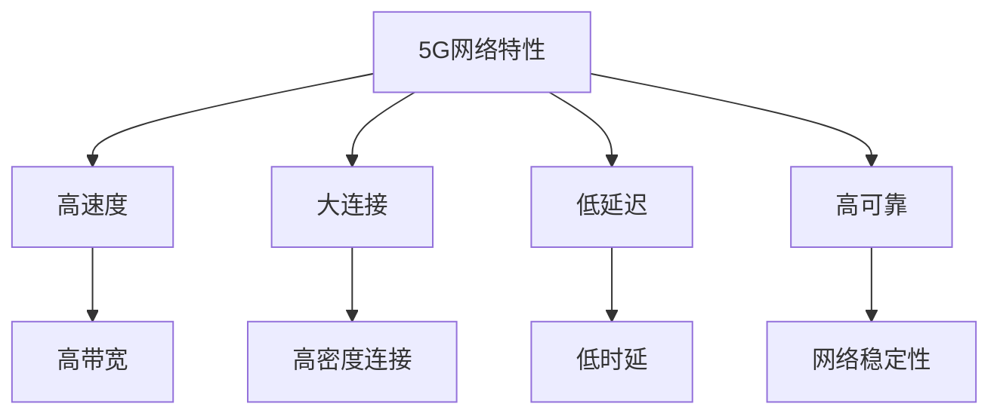

                 

### 5G网络概述

#### 1.1 5G网络的关键特性

5G网络，即第五代移动通信网络，是当前移动通信技术的发展方向。它具有以下几个关键特性：

- **高速度**：5G网络的理论下载速度可以达到每秒数十千兆比特（Gbps），比4G网络的下载速度要快数百倍。这使得用户可以在短时间内下载大量的数据，极大地提升了用户体验。

- **大连接**：5G网络能够支持更多的设备同时在线，每平方米的连接数可达数十万个。这种高密度连接能力，使得物联网（IoT）设备能够无缝地接入网络，实现大规模的设备互联。

- **低延迟**：5G网络的时延极低，可以达到1毫秒以下，这对于实时性要求极高的应用场景，如工业控制、自动驾驶等，具有重要意义。

- **高可靠**：5G网络通过引入新的网络架构和技术，如网络切片、边缘计算等，提高了网络的可靠性和稳定性。这确保了网络在不同场景下的稳定运行，提升了整体服务质量。

#### 1.2 5G网络的技术原理

5G网络的技术原理主要包括以下几个方面：

- **毫米波通信**：5G网络使用毫米波频段进行通信，频率更高，带宽更大，可以支持更高的数据传输速率。

- **网络切片**：网络切片技术可以将一个物理网络划分为多个虚拟网络，每个虚拟网络具有独立的资源分配和网络特性，以满足不同应用的需求。

- **MIMO技术**：MIMO（Multiple Input Multiple Output）技术通过使用多个天线发送和接收信号，提高了数据传输速率和网络的可靠性。

- **波束成形技术**：波束成形技术通过调整天线阵列的方向，将信号集中在目标区域，提高了信号的传输效率和覆盖范围。

#### 1.3 5G网络的全球发展状况

在全球范围内，5G网络的发展呈现出不同的态势：

- **5G网络的国家战略布局**：许多国家将5G网络视为国家战略的一部分，积极推动5G网络的建设和发展。例如，中国、美国、欧盟等国都在加大5G网络的投资和建设。

- **5G网络的商业化进程**：5G网络的商业化进程逐步推进，多个国家和地区已经推出5G商用服务，包括韩国、美国、中国等国家。

- **5G网络的国际标准制定**：国际电信联盟（ITU）等标准化组织正在制定5G网络的国际标准，以确保5G网络的全球互操作性。

综上所述，5G网络以其高速度、大连接、低延迟和高可靠等特性，为工业机器人等领域的应用提供了强大的技术支持。在接下来的章节中，我们将进一步探讨5G网络在工业机器人中的应用及其低延迟需求。

---

**核心概念与联系架构**



**核心概念解释**

- **高速度**：5G网络的理论下载速度可以达到每秒数十千兆比特（Gbps），远远超过4G网络。
- **大连接**：5G网络支持更多的设备同时在线，每平方米的连接数可达数十万个，为物联网设备提供了广泛的应用场景。
- **低延迟**：5G网络的时延极低，可以达到1毫秒以下，对于实时性要求极高的应用场景至关重要。
- **高可靠**：5G网络通过引入网络切片、边缘计算等技术，提高了网络的可靠性和稳定性，确保了网络的稳定运行。

这些特性使得5G网络在工业机器人等领域的应用中具有巨大的潜力。然而，为了充分发挥5G网络的低延迟特性，需要进一步探讨其在工业机器人控制系统中的应用机制和挑战。

---

**核心算法原理讲解**

为了更好地理解5G网络在工业机器人控制中的低延迟实现，我们可以通过Python源代码来详细阐述相关算法原理。以下是一个简化的示例，用于模拟5G网络在工业机器人控制中的应用。

```python
import numpy as np
import matplotlib.pyplot as plt
import networkx as nx

# 设置仿真参数
N = 1000  # 数据包数量
T = 10  # 仿真时间（单位：毫秒）
alpha = 0.5  # 带宽参数
beta = 0.2  # 延迟参数

# 初始化数据包发送时间
send_times = np.random.uniform(0, T, N)

# 计算每个数据包的到达时间
arrival_times = send_times + alpha * np.random.uniform(0, T, N)

# 计算数据包在系统中的总延迟
delays = arrival_times - send_times

# 绘制延迟分布图
plt.hist(delays, bins=50, alpha=0.5, color='blue')
plt.xlabel('延迟（毫秒）')
plt.ylabel('数据包数量')
plt.title('5G网络中的数据包延迟分布')
plt.show()

# 计算平均延迟
average_delay = np.mean(delays)
print(f'平均延迟: {average_delay:.2f}毫秒')

```

**算法原理说明**

1. **初始化参数**：首先，我们设置仿真参数，包括数据包数量（N）、仿真时间（T）、带宽参数（alpha）和延迟参数（beta）。

2. **模拟数据包发送时间**：通过随机生成数据包发送时间（send_times），模拟数据包在不同时间发送的场景。

3. **计算数据包到达时间**：每个数据包的到达时间是发送时间加上一个随机的带宽影响（alpha * np.random.uniform(0, T, N)），这反映了5G网络带宽对延迟的影响。

4. **计算数据包总延迟**：数据包的总延迟是到达时间减去发送时间，这表示数据包在系统中的总等待时间。

5. **绘制延迟分布图**：使用matplotlib库绘制数据包延迟分布图，可以直观地观察到延迟的分布情况。

6. **计算平均延迟**：通过计算总延迟的平均值，得到系统中的平均延迟。

这个简单的算法模拟了5G网络中数据包的延迟情况，并展示了带宽参数对延迟的影响。在实际应用中，5G网络还需要考虑更多的因素，如网络负载、传输路径等，但这些基本的原理和方法为理解5G网络在工业机器人控制中的低延迟应用提供了基础。

---

通过上述步骤，我们详细讲解了5G网络的关键特性、技术原理及其在工业机器人中的应用需求。接下来，我们将进一步探讨5G网络在工业机器人控制中的低延迟实现，包括架构设计、数据传输方案和控制算法等。这些内容将为后续章节提供理论基础和实际应用场景。

