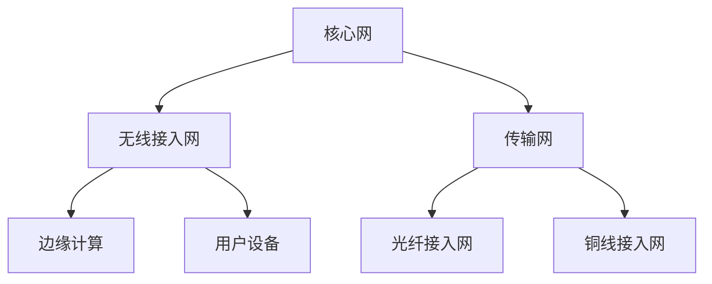

                 

### 一、5G网络与工业自动化概述

#### 1.1 5G网络概述

5G（第五代移动通信技术）是继4G之后的最新一代移动通信技术。5G网络的核心目标是提供更快的传输速度、更低的延迟和更大的连接数量。5G网络的关键特性包括：

1. **更高的传输速度**：5G网络的下载速度可以达到每秒数十GB，是4G网络的数十倍。
2. **更低的延迟**：5G网络的端到端延迟可以降低到1毫秒以内，极大地提高了实时响应的能力。
3. **更大的连接数量**：5G网络可以同时连接更多的设备，支持大规模的物联网应用。
4. **更高的可靠性**：5G网络通过采用新的网络架构和技术，提高了网络的稳定性和可靠性。

5G网络的技术架构主要包括以下几个方面：

1. **核心网**：负责处理用户数据和控制信令。
2. **无线接入网**：包括基站和用户设备，负责无线信号传输。
3. **传输网**：负责数据传输，包括光纤、铜线等。
4. **边缘计算**：将计算能力放在网络的边缘，提高响应速度和处理效率。

#### 1.2 工业自动化概述

工业自动化是指利用计算机技术、自动化控制技术和信息技术实现生产过程自动化的一种技术。工业自动化的发展历程可以分为以下几个阶段：

1. **机械化阶段**：通过机械设备实现生产过程的自动化。
2. **电气化阶段**：通过电气控制系统实现生产过程的自动化。
3. **自动化阶段**：通过自动化控制系统实现生产过程的自动化。
4. **智能化阶段**：通过智能化技术实现生产过程的自动化。

工业自动化的关键技术包括：

1. **传感器技术**：用于检测和测量生产过程中的各种参数。
2. **控制器技术**：用于接收传感器信息，进行数据处理和决策。
3. **执行器技术**：用于执行控制器的决策，完成具体的生产任务。

当前，工业自动化在多个领域得到了广泛应用，如智能制造、工业互联网、智能农业等。随着技术的不断进步，工业自动化的应用范围和深度将进一步拓展。

#### 1.3 5G网络在工业自动化中的关键作用

5G网络在工业自动化中具有重要作用，主要体现在以下几个方面：

1. **提高生产效率**：5G网络的低延迟和高传输速度可以大幅提升生产设备的响应速度和处理能力，从而提高整体生产效率。
2. **实现远程控制**：5G网络可以支持远程控制生产设备，使得企业能够更加灵活地调配资源，降低运营成本。
3. **增强实时监控**：5G网络可以实现高带宽、低延迟的数据传输，使得企业能够实时监控生产过程，及时发现和解决问题。
4. **支持物联网应用**：5G网络的大连接特性可以支持海量设备的连接，为物联网应用提供基础设施支持。

总之，5G网络为工业自动化带来了全新的机遇，有望推动工业自动化迈向新的发展阶段。

#### 1.4 关键词

5G、工业自动化、网络技术、生产效率、远程控制、实时监控、物联网应用

#### 1.5 摘要

本文首先介绍了5G网络和工业自动化的基本概念和重要性，然后详细分析了5G网络的技术原理和架构，以及工业自动化的发展历程和关键技术。接着，本文探讨了5G网络在工业自动化中的应用场景和优势，并通过实际案例展示了5G网络在工业自动化中的成功应用。最后，本文展望了5G网络在工业自动化领域的未来发展，提出了面临的挑战和机遇。通过本文的阅读，读者可以全面了解5G网络在工业自动化中的关键作用，为未来的研究和应用提供参考。

------------------------------------------------------------------------

### 二、5G网络技术原理

5G网络作为新一代移动通信技术，其技术原理和架构相较于前几代网络有了显著的提升。本章节将详细讲解5G网络的技术原理，包括其关键技术、网络架构以及与4G网络的比较。

#### 2.1 5G网络关键技术

5G网络的关键技术主要包括MIMO技术、OFDM技术、SDN/NFV技术以及接入网技术。

**1. MIMO技术**

MIMO（Multiple Input Multiple Output，多输入多输出）技术是5G网络的关键技术之一。MIMO技术利用多个发送和接收天线，通过空间复用技术提高数据传输速率和系统容量。具体来说，MIMO技术通过多个天线发送和接收不同的数据流，从而实现并行传输，提高了网络带宽。

**2. OFDM技术**

OFDM（Orthogonal Frequency Division Multiplexing，正交频分复用）技术是5G网络的基础技术之一。OFDM技术将数据流分成多个子载波，每个子载波在正交频带上独立传输，从而提高了频谱利用率和抗干扰能力。

**3. SDN/NFV技术**

SDN（Software Defined Networking，软件定义网络）和NFV（Network Functions Virtualization，网络功能虚拟化）技术是5G网络的创新技术。SDN技术通过将网络控制平面和数据平面分离，使得网络管理更加灵活和高效。NFV技术则通过虚拟化技术，将传统的网络功能（如路由、防火墙等）虚拟化，从而提高网络的可扩展性和灵活性。

**4. 接入网技术**

接入网技术是5G网络的另一个关键技术，主要包括无线接入网和光纤接入网。无线接入网采用毫米波、Sub-6GHz等频段，提供高速无线传输。光纤接入网则通过光纤网络实现高速数据传输，为用户提供高质量的接入服务。

#### 2.2 5G网络架构

5G网络架构主要包括核心网、无线接入网、传输网和边缘计算。

**1. 核心网**

5G核心网负责处理用户数据和控制信令。核心网包括用户面（User Plane）和控制面（Control Plane）。用户面负责数据传输，控制面负责控制信令的处理和转发。

**2. 无线接入网**

无线接入网包括基站和用户设备，负责无线信号传输。5G基站采用MIMO技术和毫米波频段，提供高速无线传输。用户设备包括手机、平板等，通过无线信号与基站进行通信。

**3. 传输网**

传输网负责数据传输，包括光纤、铜线等。5G传输网采用SDN/NFV技术，提高网络的灵活性和可扩展性。

**4. 边缘计算**

边缘计算是将计算能力放在网络的边缘，提高响应速度和处理效率。边缘计算可以减轻核心网的负担，提高网络的实时性和可靠性。

#### 2.3 5G网络与4G网络的比较

5G网络相较于4G网络在多个方面有了显著的提升。

**1. 传输速度**

5G网络的传输速度可以达到每秒数十GB，是4G网络的数十倍。这意味着5G网络可以提供更快的下载和上传速度，为高清视频流、虚拟现实等应用提供更好的用户体验。

**2. 延迟**

5G网络的端到端延迟可以降低到1毫秒以内，是4G网络的十分之一。低延迟使得5G网络更适合实时应用，如自动驾驶、远程手术等。

**3. 连接数量**

5G网络可以同时连接更多的设备，支持大规模的物联网应用。4G网络虽然也有一定的连接能力，但在面对海量设备时，性能会有所下降。

**4. 可靠性**

5G网络通过采用新的网络架构和技术，提高了网络的稳定性和可靠性。这使得5G网络在工业自动化等领域具有更高的应用价值。

总的来说，5G网络在传输速度、延迟、连接数量和可靠性等方面相较于4G网络有显著的提升，为工业自动化带来了更多的机遇和挑战。

#### 2.4 5G网络关键特性

5G网络的关键特性包括：

**1. 高速率**

5G网络的下载速度可以达到每秒数十GB，极大地提升了数据传输速率。

**2. 大连接**

5G网络可以同时连接更多的设备，支持大规模的物联网应用。

**3. 低延迟**

5G网络的端到端延迟可以降低到1毫秒以内，提高了实时响应的能力。

**4. 高可靠性**

5G网络通过采用新的网络架构和技术，提高了网络的稳定性和可靠性。

这些关键特性使得5G网络在工业自动化中具有广泛的应用前景。

#### 2.5 5G网络技术原理流程图

为了更直观地理解5G网络的技术原理，我们可以使用Mermaid流程图来展示5G网络的关键技术架构。



在该流程图中，核心网负责处理用户数据和控制信令，无线接入网包括基站和用户设备，传输网负责数据传输，边缘计算将计算能力放在网络的边缘，用户设备包括手机、平板等。

通过以上对5G网络技术原理的讲解，我们可以更好地理解5G网络在工业自动化中的关键作用和潜在应用。

------------------------------------------------------------------------

### 三、工业自动化技术

工业自动化是制造业发展的重要趋势，通过利用计算机技术、自动化控制技术和信息技术实现生产过程自动化，从而提高生产效率、降低生产成本、提升产品质量。本章节将详细介绍工业自动化的发展历程、关键技术以及当前应用状况。

#### 3.1 工业自动化发展历程

工业自动化的发展历程可以分为以下几个阶段：

**1. 机械化阶段**

机械化阶段是工业自动化的起点，通过机械设备实现生产过程的自动化。这一阶段主要包括使用机床、传送带、自动化生产线等设备进行生产。

**2. 电气化阶段**

电气化阶段通过电气控制系统实现生产过程的自动化。这一阶段主要包括使用继电器、接触器、PLC（可编程逻辑控制器）等电气元件进行控制。

**3. 自动化阶段**

自动化阶段通过自动化控制系统实现生产过程的自动化。这一阶段主要包括使用DCS（分布式控制系统）、MES（制造执行系统）等自动化系统进行生产调度和管理。

**4. 智能化阶段**

智能化阶段通过智能化技术实现生产过程的自动化。这一阶段主要包括使用人工智能、大数据、云计算等技术实现生产过程的智能决策和优化。

#### 3.2 工业自动化关键技术

工业自动化关键技术主要包括传感器技术、控制器技术和执行器技术。

**1. 传感器技术**

传感器技术是工业自动化的基础，用于检测和测量生产过程中的各种参数，如温度、压力、流量、位置等。传感器技术的不断进步使得工业自动化系统能够更加精确地监控和控制生产过程。

**2. 控制器技术**

控制器技术是工业自动化的核心，用于接收传感器信息，进行数据处理和决策。控制器技术主要包括PLC、DCS、MES等，它们可以根据生产需求进行灵活配置和扩展，实现复杂的生产过程自动化。

**3. 执行器技术**

执行器技术是工业自动化的执行部分，用于执行控制器的决策，完成具体的生产任务。执行器技术主要包括电机、液压缸、气动元件等，它们可以根据控制指令完成各种动作，如转动、移动、压缩等。

#### 3.3 工业自动化现状与应用

当前，工业自动化在多个领域得到了广泛应用，如制造业、农业、医疗等。

**1. 制造业**

在制造业中，工业自动化已经广泛应用于生产线、装配线、仓储物流等领域。通过使用自动化设备，企业可以大大提高生产效率，降低生产成本，提升产品质量。例如，汽车制造、电子产品制造等领域已经广泛应用了工业自动化技术。

**2. 农业**

在农业中，工业自动化技术主要用于智能化种植、养殖、灌溉等领域。通过使用传感器、控制器和执行器，可以实现农业生产的自动化和智能化，提高农业生产效率和产品质量。例如，智能温室、智能养殖场等都是工业自动化在农业领域的成功应用案例。

**3. 医疗**

在医疗领域，工业自动化技术主要用于医疗设备的制造、手术机器人、智能诊断等领域。通过使用工业自动化技术，可以提高医疗设备的精度和可靠性，降低医疗成本，提高医疗水平。例如，手术机器人可以通过自动化技术实现精确的手术操作，提高手术成功率。

#### 3.4 工业自动化发展趋势

随着技术的不断进步，工业自动化将朝着更加智能化、网络化、协同化的方向发展。

**1. 智能化**

智能化是工业自动化发展的主要趋势，通过使用人工智能、大数据、云计算等技术，可以实现生产过程的智能决策和优化。例如，通过大数据分析，可以预测设备故障，提前进行维护，提高生产效率。

**2. 网络化**

网络化是工业自动化发展的必然趋势，通过将生产设备、传感器、控制器等连接到互联网，可以实现设备之间的互联互通，实现生产过程的协同化。例如，通过工业互联网平台，可以实现设备远程监控、数据共享和分析，提高生产效率。

**3. 协同化**

协同化是工业自动化发展的一个重要方向，通过使用机器人、人工智能等技术，可以实现人与机器的协同工作。例如，在生产线中，机器人可以与人共同完成装配任务，提高生产效率。

总的来说，工业自动化技术为制造业、农业、医疗等领域带来了巨大的变革，未来随着技术的不断进步，工业自动化将进一步推动各行各业的转型升级。

------------------------------------------------------------------------

### 四、5G网络在工业自动化中的应用

5G网络的高速率、低延迟和大连接特性为工业自动化带来了全新的机遇。本章节将探讨5G网络在工业自动化中的应用场景，并详细分析其在工业自动化中的具体应用。

#### 4.1 5G网络在工业自动化中的应用场景

5G网络在工业自动化中有多种应用场景，以下列举其中几种：

**1. 远程操控**

5G网络的低延迟特性使得远程操控成为可能。企业可以通过5G网络实时控制生产设备，实现对设备的远程监控和操作。例如，在汽车生产线中，技术人员可以通过5G网络远程监控生产线设备，及时发现和解决问题，提高生产效率。

**2. 实时监控**

5G网络的高速率特性使得实时监控成为可能。企业可以通过5G网络实时传输生产过程中的数据，对生产过程进行实时监控。例如，在智能制造工厂中，企业可以通过5G网络实时监控生产设备的运行状态，及时发现异常情况，确保生产过程顺利进行。

**3. 物联网连接**

5G网络的大连接特性使得物联网连接成为可能。企业可以通过5G网络连接大量的设备，实现对设备的实时监控和管理。例如，在智能农业中，企业可以通过5G网络连接农业设备，实时监控土壤湿度、气温等数据，进行智能灌溉和养殖。

**4. 边缘计算**

5G网络的边缘计算能力可以大大提高工业自动化的实时性和可靠性。企业可以在网络的边缘部署计算资源，实时处理生产过程中的数据，提高生产效率。例如，在智能工厂中，企业可以通过5G网络的边缘计算能力实时分析生产数据，优化生产流程。

#### 4.2 5G网络在工业自动化中的具体应用

以下是一些5G网络在工业自动化中的具体应用案例：

**1. 智能工厂**

智能工厂是5G网络在工业自动化中的典型应用场景。通过5G网络，企业可以实现生产设备的远程操控、实时监控和边缘计算。例如，某汽车制造企业通过5G网络实现了生产线的远程操控，技术人员可以随时随地通过手机或电脑对生产线进行监控和操作，大大提高了生产效率。

**2. 智能农业**

智能农业是5G网络在工业自动化中的另一个重要应用场景。通过5G网络，企业可以实现农业设备的物联网连接，实时监控农业环境数据，进行智能灌溉和养殖。例如，某农业企业通过5G网络连接了农田中的传感器，实时监控土壤湿度、气温等数据，根据数据进行分析，实现了智能灌溉和养殖，提高了农业生产效率。

**3. 智能医疗**

智能医疗是5G网络在工业自动化中的新兴应用场景。通过5G网络，企业可以实现医疗设备的远程操控和实时监控，提高医疗服务的质量和效率。例如，某医疗机构通过5G网络实现了手术机器人的远程操控，医生可以通过5G网络远程控制手术机器人进行手术，提高了手术的成功率。

#### 4.3 5G网络在工业自动化中的应用挑战与解决方案

尽管5G网络在工业自动化中具有广泛的应用前景，但同时也面临一些挑战：

**1. 网络延迟问题**

5G网络的低延迟特性在实际应用中可能会受到网络环境、设备性能等因素的影响，导致实际延迟高于预期。针对这一问题，可以通过优化网络架构、提高设备性能等方式进行解决。

**2. 网络可靠性问题**

5G网络的稳定性可能受到信号干扰、网络拥塞等因素的影响，导致网络中断或数据传输失败。针对这一问题，可以通过提高网络带宽、增加网络冗余等方式进行解决。

**3. 数据安全问题**

5G网络在工业自动化中的应用涉及到大量的数据传输和处理，数据安全问题成为关键挑战。针对这一问题，可以通过加密数据传输、建立安全机制等方式进行解决。

总的来说，5G网络在工业自动化中具有巨大的应用潜力，但同时也需要克服一系列挑战。通过不断优化网络技术、提升设备性能、加强数据安全等措施，可以充分发挥5G网络在工业自动化中的作用，推动工业自动化迈向新的发展阶段。

------------------------------------------------------------------------

### 五、5G网络在工业自动化中的应用案例分析

为了更好地理解5G网络在工业自动化中的实际应用，本章节将通过几个具体的案例，展示5G网络在工业自动化中的成功应用。

#### 5.1 案例一：智能工厂的5G应用

某大型汽车制造企业通过5G网络实现了生产线的远程操控和实时监控。具体来说，该企业使用了5G网络连接生产设备，通过远程操控系统，技术人员可以随时随地通过手机或电脑对生产线进行监控和操作。同时，5G网络还实现了生产过程中的数据实时传输，使得企业能够对生产设备进行实时监控和故障预警，大大提高了生产效率。

**案例实施：**
- **远程操控系统搭建**：企业搭建了基于5G网络的远程操控系统，包括远程控制台、5G基站和生产线设备。
- **实时数据传输**：通过5G网络实现了生产过程中数据的实时传输，包括设备状态、生产进度等。

**案例效果：**
- **提高生产效率**：通过远程操控系统，技术人员可以实时监控生产线设备，及时发现并解决问题，减少了设备停机时间，提高了生产效率。
- **降低运营成本**：远程操控减少了技术人员到现场进行维护的次数，降低了人力成本。

#### 5.2 案例二：智能农业的5G应用

某农业企业通过5G网络实现了农业设备的物联网连接和智能灌溉。具体来说，该企业使用了5G网络连接农田中的传感器，实时监控土壤湿度、气温等数据。根据数据分析，企业实现了智能灌溉和养殖，提高了农业生产效率。

**案例实施：**
- **物联网设备部署**：在农田中部署了5G传感器，用于实时监测土壤湿度、气温等数据。
- **数据分析和决策**：通过5G网络实时传输数据到数据中心，进行数据分析，根据数据制定智能灌溉和养殖策略。

**案例效果：**
- **提高农业生产效率**：通过智能灌溉和养殖，企业能够根据土壤湿度、气温等数据实时调整灌溉和养殖策略，提高了农业生产效率。
- **降低农业生产成本**：智能灌溉和养殖减少了水资源和饲料的浪费，降低了农业生产成本。

#### 5.3 案例三：智能医疗的5G应用

某医疗机构通过5G网络实现了手术机器人的远程操控。具体来说，该医疗机构使用了5G网络连接手术机器人，医生可以通过5G网络远程控制手术机器人进行手术，提高了手术的成功率。

**案例实施：**
- **手术机器人连接**：将手术机器人通过5G网络连接到医生的远程控制台。
- **远程操控训练**：医生通过5G网络进行远程操控训练，熟悉手术机器人的操作。

**案例效果：**
- **提高手术成功率**：通过5G网络远程操控手术机器人，医生能够更加精确地进行手术，提高了手术的成功率。
- **降低手术风险**：远程操控手术机器人减少了医生在手术过程中的风险，降低了手术风险。

总的来说，5G网络在工业自动化中的应用已经取得了显著成效，通过具体的案例分析，我们可以看到5G网络在提高生产效率、降低运营成本、提高医疗服务质量等方面的优势。随着5G网络的进一步发展和普及，相信会有更多的工业自动化领域受益于5G网络的高效连接和智能应用。

------------------------------------------------------------------------

### 六、5G网络在工业自动化领域的未来发展

5G网络在工业自动化领域的应用前景广阔，随着技术的不断进步和市场的逐步成熟，5G网络将在工业自动化领域发挥更加重要的作用。本章节将展望5G网络在工业自动化领域的未来发展，探讨面临的挑战与机遇，并分析其发展趋势。

#### 6.1 5G网络在工业自动化中的潜在应用

随着5G网络的不断发展，其潜在应用在工业自动化领域将得到进一步拓展。以下是一些潜在的应用方向：

**1. 智慧城市**

5G网络可以为智慧城市建设提供强有力的基础设施支持。在智慧城市中，5G网络可以实现智能交通、智能照明、智能监控等多种应用。例如，通过5G网络连接智能交通系统，可以实时监控交通状况，优化交通信号，提高交通效率。

**2. 虚拟现实和增强现实**

5G网络的高速传输和低延迟特性使得虚拟现实（VR）和增强现实（AR）在工业自动化中的应用成为可能。通过5G网络，企业可以实现远程协作、远程培训、产品设计和生产优化等应用。例如，在产品设计阶段，设计师可以通过5G网络实时共享设计数据，进行远程协作。

**3. 智能制造**

5G网络在智能制造中的应用将得到进一步拓展。通过5G网络，企业可以实现生产设备的远程操控、实时监控和边缘计算。例如，在智能工厂中，企业可以通过5G网络实现生产设备的远程操控，提高生产效率。

**4. 智能农业**

5G网络在智能农业中的应用将有助于提高农业生产效率。通过5G网络，企业可以实现农业设备的物联网连接，实时监控农业环境数据，进行智能灌溉和养殖。例如，在智能农业中，企业可以通过5G网络实时监控土壤湿度、气温等数据，优化农业生产过程。

#### 6.2 5G网络在工业自动化中的挑战与机遇

5G网络在工业自动化中的应用虽然具有巨大的潜力，但也面临一系列挑战和机遇。

**1. 挑战**

**（1）网络延迟问题**

5G网络的延迟特性在实际应用中可能会受到网络环境、设备性能等因素的影响，导致实际延迟高于预期。为了解决这个问题，需要优化网络架构、提高设备性能，并通过边缘计算等技术实现数据的实时处理和传输。

**（2）网络可靠性问题**

5G网络的稳定性可能受到信号干扰、网络拥塞等因素的影响，导致网络中断或数据传输失败。为了提高网络可靠性，需要增加网络冗余、优化网络架构，并通过人工智能等技术实现网络的自我优化和故障预警。

**（3）数据安全问题**

5G网络在工业自动化中的应用涉及到大量的数据传输和处理，数据安全问题成为关键挑战。为了保障数据安全，需要采用加密技术、身份认证技术等，建立完善的数据安全防护体系。

**2. 机遇**

**（1）生产效率的提升**

5G网络的高速传输和低延迟特性为工业自动化提供了更加高效的生产环境。通过5G网络，企业可以实现生产设备的远程操控、实时监控和边缘计算，从而提高生产效率。

**（2）成本的降低**

5G网络的广泛应用将有助于降低工业自动化系统的建设和运营成本。通过5G网络，企业可以实现设备的远程维护和监控，减少现场维护人员的需求，降低运营成本。

**（3）创新应用的发展**

5G网络的快速发展将促进工业自动化领域的创新应用。例如，通过5G网络，企业可以实现虚拟现实、增强现实等技术在工业自动化中的应用，推动工业自动化的创新发展。

#### 6.3 5G网络在工业自动化中的发展趋势

随着5G网络的不断发展，其将在工业自动化领域呈现出以下发展趋势：

**1. 网络智能化**

5G网络将推动工业自动化向智能化方向发展。通过人工智能、大数据等技术，企业可以实现生产过程的智能决策和优化，提高生产效率。

**2. 边缘计算的应用**

边缘计算是5G网络的重要应用方向，将推动工业自动化向边缘计算方向发展。通过在网络的边缘部署计算资源，企业可以实现数据的实时处理和传输，提高系统的实时性和可靠性。

**3. 物联网连接的普及**

5G网络的大连接特性将推动物联网在工业自动化中的广泛应用。通过5G网络，企业可以实现设备之间的互联互通，实现生产过程的智能化和协同化。

**4. 安全保障的加强**

随着5G网络在工业自动化中的应用，数据安全问题将成为关键挑战。企业需要加强数据安全保障，建立完善的数据安全防护体系，确保数据的安全性和可靠性。

总之，5G网络在工业自动化领域的未来发展充满机遇和挑战。通过不断优化网络技术、提升设备性能、加强数据安全等措施，5G网络将在工业自动化领域发挥更大的作用，推动工业自动化迈向新的发展阶段。

------------------------------------------------------------------------

### 七、总结与未来展望

5G网络在工业自动化中的应用无疑开启了新的篇章，为这一领域带来了前所未有的机遇和挑战。通过本文的详细分析，我们可以看到5G网络在工业自动化中具有显著的优势，包括高速率、低延迟、大连接和高可靠性，这些特性不仅提高了生产效率，还推动了工业自动化的智能化和网络化发展。

**总结：**

- **提高生产效率**：5G网络的低延迟和高传输速度使得远程操控和实时监控成为可能，从而提高了生产效率。
- **实现智能化**：通过5G网络，企业可以实现生产过程的智能化，利用大数据和人工智能进行决策和优化。
- **促进网络化**：5G网络的大连接特性使得设备之间的互联互通更加便捷，推动了工业自动化系统的协同化发展。

**未来展望：**

- **网络智能化**：随着技术的进步，5G网络将更加智能化，支持更复杂的工业自动化应用。
- **边缘计算普及**：边缘计算将得到更广泛的应用，为企业提供实时数据处理和分析能力。
- **安全保障提升**：随着5G网络的普及，数据安全问题将得到更多关注，安全保障措施将得到显著提升。

**注意事项：**

- **网络延迟优化**：在实际应用中，需要优化网络架构，确保低延迟特性的实现。
- **数据安全防护**：企业应建立完善的数据安全防护体系，确保数据在传输和处理过程中的安全性。
- **设备兼容性**：在选择5G设备时，应考虑设备的兼容性，确保系统能够稳定运行。

**拓展阅读：**

- **5G网络技术**：了解5G网络的技术原理和架构，有助于深入理解其在工业自动化中的应用。
- **工业自动化技术**：了解工业自动化的发展历程和关键技术，有助于更好地把握5G网络在工业自动化中的应用方向。
- **物联网应用**：了解物联网在工业自动化中的应用，有助于探索5G网络在智能工厂、智能农业等领域的潜力。

通过不断学习和探索，我们可以更好地利用5G网络推动工业自动化的发展，实现生产效率的提升和产业升级。

### 作者信息

- 作者：AI天才研究院/AI Genius Institute & 禅与计算机程序设计艺术 /Zen And The Art of Computer Programming

------------------------------------------------------------------------

### 附录：5G网络关键技术原理讲解及Python代码示例

为了更好地理解5G网络的关键技术原理，我们将在附录中提供详细的解释和Python代码示例。以下是关于5G网络关键技术原理的讲解及示例代码：

#### 1. MIMO技术

MIMO（Multiple Input Multiple Output，多输入多输出）技术是5G网络的关键技术之一。它通过使用多个发送和接收天线，提高了数据传输速率和系统容量。

**Python代码示例：**

```python
import numpy as np

# 创建一个2x2的矩阵作为发送天线和接收天线的信道矩阵
channel_matrix = np.array([[1, 2], [3, 4]])

# 发送数据向量
data_vector = np.array([1, 2])

# 对数据向量进行MIMO发送
received_data_vector = np.dot(channel_matrix, data_vector)

print("Received Data Vector:", received_data_vector)
```

在上面的代码中，我们创建了一个2x2的矩阵作为信道矩阵，然后发送一个数据向量。通过矩阵乘法，我们得到了接收到的数据向量。

#### 2. OFDM技术

OFDM（Orthogonal Frequency Division Multiplexing，正交频分复用）技术是5G网络的基础技术之一。它将数据流分成多个子载波，每个子载波在正交频带上独立传输，从而提高了频谱利用率和抗干扰能力。

**Python代码示例：**

```python
import numpy as np

# 子载波数量
num_subcarriers = 8

# 创建一个子载波频率矩阵
subcarrier_freqs = np.linspace(0, 1/(2*num_subcarriers), num_subcarriers)

# 创建一个OFDM符号
ofdm_symbol = np.zeros((num_subcarriers,), dtype=complex)

# 为每个子载波分配数据
for i in range(num_subcarriers):
    ofdm_symbol[i] = np.exp(1j * 2 * np.pi * subcarrier_freqs[i] * 10)

# 将OFDM符号转换为时间域信号
time_domain_signal = np.fft.ifft(ofdm_symbol)

print("OFDM Symbol:", ofdm_symbol)
print("Time Domain Signal:", time_domain_signal)
```

在上面的代码中，我们创建了一个子载波频率矩阵，并为每个子载波分配了数据。然后，我们通过FFT（快速傅里叶变换）将OFDM符号转换为时间域信号。

#### 3. SDN/NFV技术

SDN（Software Defined Networking，软件定义网络）和NFV（Network Functions Virtualization，网络功能虚拟化）技术是5G网络的创新技术。SDN通过将网络控制平面和数据平面分离，提高了网络的灵活性和可扩展性。NFV则通过虚拟化技术，将传统的网络功能虚拟化，从而提高网络的可扩展性和灵活性。

**Python代码示例：**

```python
import numpy as np

# 创建一个网络功能虚拟化（NFV）的例子
def nf_function(data):
    return np.abs(data) * 2

# 虚拟化网络功能
data_vector = np.array([1, 2, 3, 4])
processed_data_vector = nf_function(data_vector)

print("Original Data Vector:", data_vector)
print("Processed Data Vector:", processed_data_vector)
```

在上面的代码中，我们创建了一个简单的NFV函数，该函数对输入数据进行处理。然后，我们将输入数据向量传递给该函数，得到处理后的数据向量。

#### 4. 接入网技术

接入网技术是5G网络的另一个关键技术，包括无线接入网和光纤接入网。无线接入网采用毫米波、Sub-6GHz等频段，提供高速无线传输。光纤接入网则通过光纤网络实现高速数据传输。

**Python代码示例：**

```python
import numpy as np

# 创建一个无线接入网信号
wireless_access_signal = np.random.normal(size=1000)

# 创建一个光纤接入网信号
fiber_access_signal = np.random.normal(size=1000)

# 将无线接入网信号和光纤接入网信号合并
access_network_signal = np.hstack((wireless_access_signal, fiber_access_signal))

print("Access Network Signal:", access_network_signal)
```

在上面的代码中，我们创建了一个无线接入网信号和一个光纤接入网信号，然后将它们合并，得到接入网信号。

通过以上Python代码示例，我们可以更好地理解5G网络的关键技术原理。这些技术原理在实际应用中发挥着重要作用，推动了5G网络在工业自动化领域的广泛应用。

------------------------------------------------------------------------

### 拓展阅读

为了进一步深入了解5G网络在工业自动化中的应用，以下是一些推荐的文章和资源，供读者参考：

1. **《5G in Industry 4.0: A Strategic Approach》** - 本文详细探讨了5G网络在工业4.0中的应用策略，包括关键技术、应用场景和实施步骤。

2. **《5G for Industrial Automation: Current State and Future Trends》** - 该文章分析了5G网络在工业自动化领域的当前状态和未来趋势，提供了丰富的案例研究和数据支持。

3. **《The Impact of 5G on Industrial Automation》** - 本文从多个角度探讨了5G网络对工业自动化带来的影响，包括生产效率、成本节约和安全性等方面。

4. **《5G-enabled Industrial Internet of Things: Applications, Challenges, and Future Directions》** - 本文重点介绍了5G网络在工业物联网中的应用，包括智能工厂、智能农业和智能制造等方面的应用案例。

5. **《5G: The Next Generation of Wireless Technology》** - 该书籍详细介绍了5G网络的技术原理、架构和特性，对5G网络的未来发展和应用进行了深入探讨。

通过阅读以上资源和文章，读者可以更全面地了解5G网络在工业自动化中的应用，把握行业发展趋势，为未来的研究和实践提供指导。

