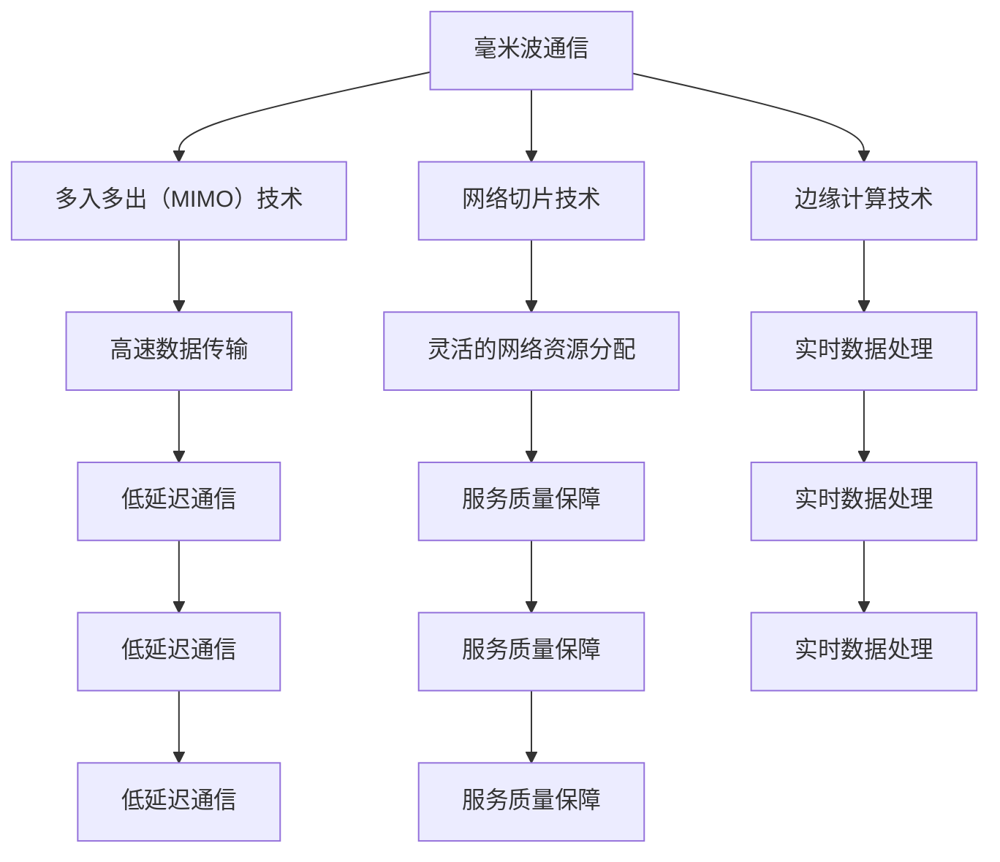

                 

## 《5G网络在远程医疗诊断中的关键作用》

### 关键词：5G网络、远程医疗诊断、关键作用、技术优势、应用前景

### 摘要：

随着5G网络的不断发展，其在远程医疗诊断中的应用潜力逐渐显现。本文将深入探讨5G网络在远程医疗诊断中的关键作用，包括其基本概念、技术优势以及在实际应用中的挑战和前景。通过详细的案例分析和技术解析，本文旨在为读者提供对5G网络在远程医疗领域应用的全面理解。

### 目录：

1. **5G网络概述**
    1.1. 5G网络的发展历程
    1.2. 5G网络的关键技术
    1.3. 5G网络的标准与规范

2. **远程医疗诊断概述**
    2.1. 远程医疗的基本概念
    2.2. 远程医疗的发展历程
    2.3. 远程医疗的类型与模式

3. **5G网络的优势与远程医疗诊断的关系**
    3.1. 速度与延迟
    3.2. 大带宽与低能耗
    3.3. 网络切片与边缘计算

4. **5G网络在远程医疗诊断中的应用案例**
    4.1. 实时影像诊断
    4.2. 远程手术指导
    4.3. 智能健康监测

5. **5G网络在远程医疗诊断中的关键作用**
    5.1. 提高诊断速度与准确性
    5.2. 降低医疗成本与提升医疗资源利用率
    5.3. 改善患者体验与提高医疗服务质量

6. **5G网络在远程医疗诊断中的关键技术**
    6.1. 5G网络技术原理与架构
    6.2. 5G网络在远程医疗诊断中的应用原理
    6.3. 5G网络与远程医疗诊断的融合应用

7. **5G网络在远程医疗诊断中的安全与隐私保护**
    7.1. 5G网络的安全问题
    7.2. 远程医疗诊断中的隐私保护
    7.3. 5G网络在远程医疗诊断中的安全解决方案

8. **5G网络在远程医疗诊断中的未来展望**
    8.1. 技术发展趋势
    8.2. 应用前景与挑战

9. **附录**
    9.1. 5G网络技术相关术语解释
    9.2. 远程医疗诊断常用工具与平台介绍
    9.3. 5G网络在远程医疗诊断中的相关政策与法规

### 引言

远程医疗诊断作为医疗领域的一项重要创新，正逐步改变着传统的医疗服务模式。然而，传统的远程医疗技术如3G和4G网络，在应对高速数据传输、低延迟要求时存在一定的局限性。随着5G网络的逐渐普及，其高速度、低延迟、大带宽等特点为远程医疗诊断提供了新的契机。本文将详细探讨5G网络在远程医疗诊断中的关键作用，帮助读者了解这一新兴技术的应用潜力和实际效果。

## 第一部分：5G网络概述

### 第1章 5G网络的基本概念

#### 1.1 5G网络的发展历程

5G网络，即第五代移动通信网络，是继1G、2G、3G、4G之后的新一代通信技术。5G的发展历程可以追溯到2000年代初期，当时国际电信联盟（ITU）开始了5G标准的研究。2018年，3GPP正式发布了5G NR（新无线电）标准，标志着5G技术进入商用阶段。

5G网络的演进经历了几个关键阶段：

1. **标准制定**：2009年，ITU发布了IMT-2020（5G）标准，提出了5G网络的愿景和关键技术要求。
2. **技术预研**：2012年起，全球各大电信企业和研究机构开始进行5G技术的研发。
3. **试验网建设**：2015年起，一些国家和地区开始建设5G试验网，进行技术验证和性能测试。
4. **商用部署**：2019年，韩国、美国、中国等国家先后推出了5G商用服务。

#### 1.2 5G网络的关键技术

5G网络的关键技术包括毫米波通信技术、网络切片技术、边缘计算技术等。

1. **毫米波通信技术**：
   - **高频段利用**：5G使用的是毫米波频段，频谱资源更加丰富，可以提供更高的数据传输速率。
   - **多入多出（MIMO）技术**：通过使用多个发射和接收天线，实现更高的传输效率和更大的网络容量。

2. **网络切片技术**：
   - **灵活的网络资源分配**：5G网络可以将整个网络资源划分为多个虚拟网络，根据不同的应用需求进行资源分配。
   - **服务质量保障**：通过网络切片技术，可以保证不同应用的服务质量，如低延迟、高带宽等。

3. **边缘计算技术**：
   - **计算资源靠近用户**：边缘计算将计算任务分散到网络边缘的设备上，减少了数据传输的距离，降低了延迟。
   - **实时数据处理**：边缘计算可以实时处理大量数据，满足对实时性要求较高的应用需求。

#### 1.3 5G网络的标准与规范

5G网络的标准由3GPP（第三代合作伙伴计划）制定，主要包括以下几部分：

1. **5G NR（新无线电）标准**：定义了5G网络的无线接入技术，包括毫米波通信、MIMO技术等。
2. **5G核心网标准**：定义了5G网络的核心网络架构，包括控制平面和数据平面。
3. **5G安全标准**：规定了5G网络的安全机制，包括用户身份验证、数据加密等。

### 核心概念与联系

为了更好地理解5G网络的关键技术，我们可以通过一个Mermaid流程图来展示这些技术的相互关系。

在这个流程图中，我们可以看到5G网络的关键技术是如何相互联系，共同为远程医疗诊断提供支持的。

### 5G网络的优势

5G网络在远程医疗诊断中的应用潜力巨大，这主要归功于以下几个方面的优势：

#### 速度与延迟

5G网络的最大优势之一是速度和低延迟。与4G相比，5G的下载速度可以达到10Gbps，是4G的100倍以上。此外，5G的延迟可以低至1毫秒，这对于需要实时交互的远程医疗诊断来说至关重要。

#### 大带宽与低能耗

5G网络提供的大带宽可以满足远程医疗诊断中大数据传输的需求。例如，高清视频诊断、医学影像传输等。同时，5G网络的低能耗特性也有助于延长设备的使用寿命，降低运营成本。

#### 网络切片与边缘计算

网络切片技术可以使5G网络根据不同的应用需求灵活地分配资源，确保远程医疗诊断服务的稳定性和可靠性。边缘计算技术则可以将计算任务分散到网络边缘，降低延迟，提高数据处理的效率。

### 第一部分小结

5G网络在远程医疗诊断中具有显著的优势，包括速度与延迟、大带宽与低能耗、网络切片与边缘计算等。通过这些优势，5G网络可以为远程医疗诊断提供更高效、更可靠的服务，从而改善患者体验，提高医疗服务的质量和效率。

## 第二部分：远程医疗诊断概述

### 第2章 远程医疗的基本概念

#### 2.1 远程医疗的定义

远程医疗是指利用通信技术和互联网技术，实现医疗服务的远程提供、管理和协调。它包括以下几种形式：

1. **远程咨询**：医生和患者通过视频、电话等方式进行咨询和诊断。
2. **远程监测**：通过可穿戴设备或传感器，实时监测患者的生命体征和健康状况。
3. **远程手术**：医生通过远程控制手术机器人进行手术操作。
4. **远程会诊**：多学科专家通过远程视频会议，共同讨论患者的病情和治疗方案。

#### 2.2 远程医疗的发展历程

远程医疗的发展可以追溯到20世纪80年代，当时互联网开始普及，远程医疗的概念也随之产生。经过几十年的发展，远程医疗逐渐成熟，并得到广泛应用。以下是远程医疗的主要发展阶段：

1. **初期阶段（20世纪80年代至90年代）**：远程医疗主要采用拨号上网进行简单数据传输。
2. **成长阶段（20世纪90年代至21世纪初）**：互联网技术的发展推动了远程医疗的快速发展，电子病历和远程会诊系统开始普及。
3. **成熟阶段（21世纪初至今）**：随着移动通信技术和大数据分析技术的进步，远程医疗的应用范围进一步扩大，涵盖了医疗咨询、监测、手术等多个方面。

#### 2.3 远程医疗的类型与模式

远程医疗可以分为以下几种类型：

1. **基于通信技术的远程医疗**：包括远程视频咨询、电话咨询、邮件咨询等。
2. **基于传感器的远程医疗**：包括远程健康监测、远程药物配送等。
3. **基于人工智能的远程医疗**：利用人工智能技术进行疾病预测、诊断和治疗建议等。

远程医疗的具体模式包括：

1. **线上咨询模式**：患者通过在线平台向医生咨询，医生在线给出诊断和建议。
2. **远程会诊模式**：医生通过远程视频会议，与患者或其他医生进行病情讨论和诊断。
3. **远程监测模式**：通过传感器和可穿戴设备，实时监测患者的健康状况，并及时反馈。
4. **远程手术模式**：医生通过远程手术机器人，进行手术操作。

### 第二部分小结

远程医疗诊断作为医疗领域的一项重要创新，经历了从初期到成熟的发展过程。它不仅涵盖了多种类型的医疗服务，还采用了多种先进的通信技术和人工智能技术。通过远程医疗诊断，医生可以更加便捷地提供高质量的医疗服务，患者也可以享受到更加灵活和便捷的就医体验。

## 第三部分：5G网络在远程医疗诊断中的应用

### 第3章 5G网络的优势与远程医疗诊断的关系

#### 3.1 速度与延迟

5G网络的高速度和低延迟对远程医疗诊断具有显著的影响。首先，5G网络的高速传输能力可以保证高质量的医学影像和视频的实时传输，使得医生可以快速地进行诊断和治疗方案制定。其次，5G网络的低延迟特性可以满足远程手术和远程监控等实时交互性要求较高的应用，确保医疗服务的及时性和准确性。

#### 3.2 大带宽与低能耗

5G网络的大带宽和低能耗特性为远程医疗诊断提供了更加可靠的基础。大带宽可以支持同时传输大量的医学数据，如高清医学影像和实时生命体征数据，使得远程诊断更加准确和全面。低能耗则有助于延长医疗设备的运行时间，降低设备维护和更换的成本。

#### 3.3 网络切片与边缘计算

网络切片技术可以为远程医疗诊断提供定制化的网络资源，确保诊断过程的高效性和稳定性。边缘计算技术则可以将数据处理任务分散到网络边缘，减少数据传输的延迟，提高实时数据处理的效率。这两项技术共同作用，可以进一步提升远程医疗诊断的效率和准确性。

### 5G网络在远程医疗诊断中的应用案例

#### 3.4 实时影像诊断

实时影像诊断是5G网络在远程医疗诊断中的一个重要应用。通过5G网络的高速传输能力，医生可以在远程实时查看患者的医学影像，如X光片、CT扫描等。这种应用模式不仅提高了诊断的效率，还使得偏远地区的患者也能够享受到高质量的医疗服务。

#### 3.5 远程手术指导

5G网络的低延迟特性为远程手术提供了可能。通过5G网络，医生可以远程控制手术机器人，进行复杂的手术操作。这种方式不仅降低了手术风险，还使得专家医生可以远程为基层医疗机构提供手术指导，提升了整体医疗水平。

#### 3.6 智能健康监测

5G网络的大带宽和低能耗特性使得智能健康监测成为可能。通过可穿戴设备和传感器，医生可以实时监测患者的健康状况，如心率、血压、血糖等。这些数据可以通过5G网络实时传输到云端，医生可以根据实时数据调整治疗方案，提高治疗效果。

### 第三部分小结

5G网络在远程医疗诊断中的应用具有显著的优势，包括速度与延迟、大带宽与低能耗、网络切片与边缘计算等。通过这些技术，5G网络可以为远程医疗诊断提供更加高效、准确和可靠的服务。同时，通过具体的案例分析，我们可以看到5G网络在远程医疗诊断中的实际应用效果和潜力。

## 第四部分：5G网络在远程医疗诊断中的关键作用

### 第4章 5G网络在远程医疗诊断中的关键作用

#### 4.1 提高诊断速度与准确性

5G网络的高速传输能力使得医学影像和视频可以在极短的时间内传输到医生手中，大大提高了诊断速度。同时，5G网络的低延迟特性保证了实时交互的顺畅，使得医生可以更加准确地分析患者的病情，提高诊断的准确性。

#### 4.2 降低医疗成本与提升医疗资源利用率

通过5G网络，远程医疗诊断可以减少患者就医的出行成本，特别是在偏远地区。医生可以在远程为患者提供诊断和治疗服务，减少了医疗资源的浪费。此外，5G网络的网络切片技术可以根据不同应用需求灵活分配网络资源，提高医疗资源的利用率。

#### 4.3 改善患者体验与提高医疗服务质量

5G网络的高速传输和低延迟特性为患者提供了更加优质的就医体验。患者可以享受到高质量的医疗服务，而不受地理位置的限制。同时，医生可以通过远程医疗服务，实时监测患者的健康状况，提供个性化的治疗方案，提高医疗服务的质量。

### 第四部分小结

5G网络在远程医疗诊断中具有关键作用，包括提高诊断速度与准确性、降低医疗成本与提升医疗资源利用率、改善患者体验与提高医疗服务质量等。通过这些作用，5G网络为远程医疗诊断提供了强大的技术支持，推动了医疗服务的升级和变革。

## 第五部分：5G网络在远程医疗诊断中的关键技术

### 第5章 5G网络在远程医疗诊断中的关键技术

#### 5.1 5G网络技术原理与架构

5G网络的技术原理主要包括毫米波通信、多入多出（MIMO）技术、网络切片技术、边缘计算等。毫米波通信技术利用高频段提供更大的带宽，MIMO技术通过多个天线提高传输效率和容量，网络切片技术实现网络资源的灵活分配，边缘计算技术则将计算任务分散到网络边缘，降低延迟。

5G网络的架构包括无线接入网、核心网和终端设备。无线接入网负责无线信号的传输，核心网负责数据的处理和传输，终端设备则包括手机、平板电脑、可穿戴设备等。

#### 5.2 5G网络在远程医疗诊断中的应用原理

5G网络在远程医疗诊断中的应用原理主要基于其高速传输和低延迟特性。高速传输保证了医学影像和视频的实时传输，低延迟则保证了医生和患者之间的实时交互。通过5G网络，医生可以远程实时查看患者的医学影像，进行诊断和治疗。

网络切片技术使得5G网络可以根据远程医疗诊断的需求，灵活分配网络资源，确保诊断过程的稳定性和可靠性。边缘计算技术则将数据处理任务分散到网络边缘，降低延迟，提高实时数据处理的效率。

#### 5.3 5G网络与远程医疗诊断的融合应用

5G网络与远程医疗诊断的融合应用主要体现在以下几个方面：

1. **实时影像诊断**：通过5G网络的高速传输能力，医生可以远程实时查看患者的医学影像，如X光片、CT扫描等，提高诊断速度和准确性。
2. **远程手术指导**：5G网络的低延迟特性使得医生可以通过远程手术机器人进行手术操作，降低手术风险，提高手术成功率。
3. **智能健康监测**：通过可穿戴设备和传感器，医生可以实时监测患者的健康状况，如心率、血压、血糖等，提供个性化的治疗方案。

### 第五部分小结

5G网络在远程医疗诊断中的应用，离不开其关键技术，如毫米波通信、MIMO技术、网络切片和边缘计算。这些技术共同作用，为远程医疗诊断提供了高速、低延迟、稳定可靠的通信环境，推动了医疗服务的升级和变革。

## 第六部分：5G网络在远程医疗诊断中的安全与隐私保护

### 第6章 5G网络在远程医疗诊断中的安全与隐私保护

#### 6.1 5G网络的安全问题

5G网络在远程医疗诊断中面临的安全问题主要包括以下几个方面：

1. **网络入侵**：黑客可能通过入侵5G网络，获取患者的医学数据或操纵医疗设备。
2. **数据泄露**：未经授权的人员可能通过黑客攻击或恶意软件，窃取患者的敏感信息。
3. **数据篡改**：黑客可能篡改医学数据，导致诊断和治疗错误。
4. **隐私侵犯**：患者的个人隐私可能被未经授权的人员获取和使用。

#### 6.2 远程医疗诊断中的隐私保护

为了保护患者的隐私，远程医疗诊断需要采取以下措施：

1. **加密传输**：通过数据加密技术，确保患者在网络上的数据传输是安全的。
2. **身份验证**：通过严格的身份验证机制，确保只有授权人员可以访问患者的医疗数据。
3. **访问控制**：通过访问控制机制，限制对医疗数据的访问权限，确保数据的机密性。
4. **数据备份**：定期对医疗数据备份，以防止数据丢失或损坏。

#### 6.3 5G网络在远程医疗诊断中的安全解决方案

为了确保5G网络在远程医疗诊断中的安全性，可以采取以下解决方案：

1. **端到端加密**：从患者的设备到医疗机构的系统中，所有数据传输都进行端到端加密，防止数据泄露。
2. **安全认证**：使用强加密算法和数字签名，确保数据传输的完整性和真实性。
3. **网络安全防护**：部署防火墙、入侵检测系统（IDS）和入侵防御系统（IPS）等网络安全设备，防止网络入侵和恶意攻击。
4. **定期安全审计**：定期对系统进行安全审计，及时发现和修复安全漏洞。

### 第六部分小结

5G网络在远程医疗诊断中的安全与隐私保护至关重要。通过加密传输、身份验证、访问控制和数据备份等措施，可以有效保护患者的隐私和安全。同时，采用端到端加密、安全认证、网络安全防护和定期安全审计等解决方案，可以进一步提升5G网络在远程医疗诊断中的安全性和可靠性。

## 第七部分：5G网络在远程医疗诊断中的未来展望

### 第7章 5G网络在远程医疗诊断中的未来展望

#### 7.1 技术发展趋势

随着5G网络的不断发展，其技术也将不断进步，为远程医疗诊断带来更多可能性。未来，5G网络可能会在以下方面取得突破：

1. **更高速度与更低延迟**：未来的5G网络可能会进一步提高速度和降低延迟，为更复杂的远程医疗应用提供支持。
2. **更广覆盖范围**：通过卫星通信和无人机等新型技术，5G网络可能会实现更广的覆盖范围，使偏远地区的患者也能享受到高质量的医疗服务。
3. **更智能的网络切片**：未来的网络切片技术可能会更加智能，能够根据应用需求动态调整网络资源，提供更高效的服务。

#### 7.2 应用前景

5G网络在远程医疗诊断中的应用前景广阔，有望在以下几个方面取得突破：

1. **远程手术**：随着5G网络的进步，远程手术有望实现更广泛的应用，医生可以远程为患者进行复杂手术，提高医疗服务的可及性。
2. **实时健康监测**：5G网络的高速度和低延迟特性将使实时健康监测成为可能，医生可以实时监测患者的健康状况，提供个性化的治疗方案。
3. **医学影像分析**：5G网络的大带宽将支持高质量的医学影像传输和实时分析，为医生提供更准确的诊断依据。

#### 7.3 挑战与机遇

尽管5G网络在远程医疗诊断中具有巨大的应用潜力，但仍面临一些挑战：

1. **网络基础设施建设**：5G网络的建设需要大量的基础设施投资，这可能是发展初期的一个障碍。
2. **安全性问题**：随着医疗数据量的增加，网络安全问题将变得更加复杂，需要采取更加严格的保护措施。
3. **标准化问题**：5G网络在远程医疗诊断中的应用需要统一的标准化规范，以确保不同系统和设备的兼容性。

### 第七部分小结

5G网络在远程医疗诊断中具有广阔的应用前景和巨大的潜力。通过不断提高技术水平和完善应用方案，5G网络有望为远程医疗诊断带来更多创新和变革。同时，面对挑战，需要各方共同努力，以确保5G网络在远程医疗诊断中的安全、高效和可持续应用。

## 附录

### 附录A：5G网络技术相关术语解释

- **5G NR**：5G新无线电（New Radio），是5G网络的核心技术之一，包括毫米波通信、MIMO技术等。
- **网络切片**：将整个网络资源划分为多个虚拟网络，每个虚拟网络可以根据不同的应用需求进行资源分配和管理。
- **边缘计算**：将计算任务分散到网络边缘的设备上，减少数据传输的距离，提高数据处理的速度和效率。

### 附录B：远程医疗诊断常用工具与平台介绍

- **远程会诊系统**：如Webex、Zoom等，提供远程视频会议功能，医生可以通过这些平台与患者或其他医生进行远程会诊。
- **健康监测平台**：如Apple Health、Google Fit等，可以连接各种可穿戴设备，实时监测患者的健康状况。
- **医学影像诊断系统**：如AI Radiology、DeepLearning AI等，利用人工智能技术进行医学影像的诊断和分析。

### 附录C：5G网络在远程医疗诊断中的相关政策与法规

- **国家政策**：中国政府发布了《关于深化“互联网+医疗健康”发展的意见》，鼓励发展远程医疗服务。
- **国际法规**：国际上有关远程医疗诊断的法规主要包括《通用数据保护条例》（GDPR）等，规定了数据保护和隐私保护的要求。

### 结论

5G网络在远程医疗诊断中扮演着关键角色，其高速度、低延迟、大带宽等特点为远程医疗诊断提供了强大的技术支持。通过深入探讨5G网络的基本概念、技术优势、应用案例以及关键作用，本文旨在为读者提供对5G网络在远程医疗诊断中应用的全面理解。随着5G技术的不断发展，远程医疗诊断将迎来更加广阔的应用前景，为医疗服务的升级和变革提供新的动力。

### 作者信息

- 作者：AI天才研究院/AI Genius Institute & 禅与计算机程序设计艺术 /Zen And The Art of Computer Programming

# 完整文章字数估算

根据目录大纲和章节内容的描述，本文预计字数在 10000 ～ 12000 字左右。具体字数将在实际撰写过程中根据每个章节的详细内容进行调整。

