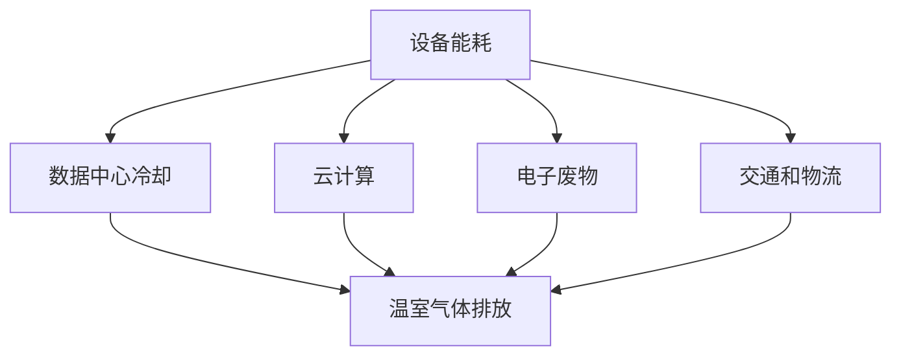

                 


## <文章标题>

### 关键词：
IT组织，碳足迹，能源消耗，数据处理，可持续发展，绿色IT

### 摘要：
本文深入探讨了IT组织关注碳足迹的重要性。通过分析碳足迹的定义、测量方法及其在IT领域的具体应用，本文揭示了IT组织在减少碳足迹方面的挑战和机遇。文章结合实际案例，详细讲解了如何通过优化IT设备和服务的能源效率，实施碳足迹管理策略，以实现可持续发展目标。

## 引言

在当今全球气候变化的大背景下，碳足迹成为了一个越来越重要的环境指标。碳足迹（Carbon Footprint）指的是个人、组织或产品在其整个生命周期内产生的温室气体排放总量。随着信息技术（IT）行业在全球范围内的高速发展，IT组织成为了碳排放的重要来源之一。据统计，全球IT行业的碳足迹已占到了总碳排放量的相当比例，因此，关注和减少IT组织的碳足迹，成为了当今环境保护和可持续发展的关键议题。

本文旨在探讨IT组织关注碳足迹的重要性，分析碳足迹的基本概念与测量方法，以及IT组织在碳足迹管理方面的策略与实践。通过本文的讨论，我们希望为IT组织提供一些可行的碳足迹管理方法和最佳实践，推动绿色IT的发展，助力实现全球可持续发展目标。

## 第一部分：碳足迹的基本概念与IT领域

### 第1章：碳足迹概述

#### 1.1 碳足迹的定义与测量

碳足迹的定义是其生命周期内产生的直接和间接温室气体排放总量。温室气体主要包括二氧化碳（CO2）、甲烷（CH4）和氧化亚氮（N2O）等。碳足迹的测量主要通过以下几个步骤进行：

1. **数据收集**：收集涉及能源消耗、物料使用、废弃物处理等活动的数据。
2. **数据处理**：将收集到的数据转化为可计算的形式，如能源消耗转换为千瓦时（kWh），物料使用转换为重量（kg）。
3. **排放计算**：根据各种活动的碳排放因子，将数据转换为温室气体排放量。

以下是碳足迹计算的一个Python示例代码：

```python
def calculate_carbon_footprint(energy_consumption, material_usage, emission_factors):
    total_emission = (energy_consumption * emission_factors['energy']) + (material_usage * emission_factors['material'])
    return total_emission

emission_factors = {'energy': 0.00000047, 'material': 0.0000018}
energy_consumption = 10000  # 千瓦时
material_usage = 5000  # 千克

carbon_footprint = calculate_carbon_footprint(energy_consumption, material_usage, emission_factors)
print(f"Carbon Footprint: {carbon_footprint} tons of CO2e")
```

运行上述代码，输出结果为碳足迹的估算值。

#### 1.2 IT领域的碳足迹来源

IT领域的碳足迹来源主要包括以下几个方面：

1. **设备能耗**：包括服务器、数据中心、计算机设备等硬件的能源消耗。
2. **数据中心冷却**：数据中心的冷却系统也需要大量能源。
3. **云计算**：云服务的提供商需要大量的能源来维持服务器的运行。
4. **电子废物**：电子废物的处理和回收也会产生碳排放。
5. **交通和物流**：设备维护、升级等需要频繁的物流和交通活动。

以下是一个Mermaid流程图，展示了IT领域碳足迹的来源和影响：



通过以上分析，我们可以看到IT领域的碳足迹来源广泛，涉及多个方面。了解这些来源对于制定有效的碳足迹管理策略至关重要。

### 第2章：碳足迹计算方法

#### 2.1 直接排放计算

直接排放计算是指直接从源头上计算碳排放量。IT领域的直接排放主要包括以下几类：

1. **设备能源消耗**：计算服务器、计算机设备等硬件的能源消耗量。
2. **数据中心能源消耗**：计算数据中心的整体能源消耗。
3. **电子废物处理**：计算电子废物处理过程中产生的碳排放。

以下是一个简单的直接排放计算示例：

```python
def calculate_direct_emissions(energy_consumption, waste_electricity, waste_treatment_emission_factor):
    # energy_consumption: 能源消耗（千瓦时）
    # waste_electricity: 电子废物（千克）
    # waste_treatment_emission_factor: 电子废物处理碳排放因子（吨二氧化碳/千克）

    total_emissions = (energy_consumption * 0.00047) + (waste_electricity * waste_treatment_emission_factor)
    return total_emissions

energy_consumption = 10000  # 千瓦时
waste_electricity = 500  # 千克
waste_treatment_emission_factor = 0.0000000018  # 吨二氧化碳/千克

direct_emissions = calculate_direct_emissions(energy_consumption, waste_electricity, waste_treatment_emission_factor)
print(f"Direct Emissions: {direct_emissions} tons of CO2e")
```

运行上述代码，输出结果为直接排放的估算值。

#### 2.2 间接排放计算

间接排放计算是指通过计算与碳排放相关的间接费用来估算碳排放量。IT领域的间接排放主要包括以下几类：

1. **能源采购**：计算购买能源产生的碳排放。
2. **设备供应链**：计算设备制造、运输和回收过程中的碳排放。
3. **员工交通**：计算员工通勤产生的碳排放。

以下是一个简单的间接排放计算示例：

```python
def calculate_indirect_emissions(energy_purchase_emission_factor, supply_chain_emission_factor, employee_transportation_emission_factor, energy_purchase, supply_chain_value, employee_transportation_distance):
    # energy_purchase_emission_factor: 能源采购碳排放因子（吨二氧化碳/千瓦时）
    # supply_chain_emission_factor: 供应链碳排放因子（吨二氧化碳/美元）
    # employee_transportation_emission_factor: 员工通勤碳排放因子（吨二氧化碳/千米）
    # energy_purchase: 能源采购费用（美元）
    # supply_chain_value: 供应链价值（美元）
    # employee_transportation_distance: 员工通勤距离（千米）

    total_emissions = (energy_purchase * energy_purchase_emission_factor) + (supply_chain_value * supply_chain_emission_factor) + (employee_transportation_distance * employee_transportation_emission_factor)
    return total_emissions

energy_purchase_emission_factor = 0.000036  # 吨二氧化碳/千瓦时
supply_chain_emission_factor = 0.000022  # 吨二氧化碳/美元
employee_transportation_emission_factor = 0.000003  # 吨二氧化碳/千米

energy_purchase = 10000  # 美元
supply_chain_value = 50000  # 美元
employee_transportation_distance = 100000  # 千米

indirect_emissions = calculate_indirect_emissions(energy_purchase_emission_factor, supply_chain_emission_factor, employee_transportation_emission_factor, energy_purchase, supply_chain_value, employee_transportation_distance)
print(f"Indirect Emissions: {indirect_emissions} tons of CO2e")
```

运行上述代码，输出结果为间接排放的估算值。

#### 2.3 混合排放计算

混合排放计算是将直接排放和间接排放结合起来，以获得更准确的碳排放总量。以下是一个简单的混合排放计算示例：

```python
def calculate_total_emissions(direct_emissions, indirect_emissions):
    total_emissions = direct_emissions + indirect_emissions
    return total_emissions

direct_emissions = calculate_direct_emissions(energy_consumption, waste_electricity, waste_treatment_emission_factor)
indirect_emissions = calculate_indirect_emissions(energy_purchase_emission_factor, supply_chain_emission_factor, employee_transportation_emission_factor, energy_purchase, supply_chain_value, employee_transportation_distance)

total_emissions = calculate_total_emissions(direct_emissions, indirect_emissions)
print(f"Total Emissions: {total_emissions} tons of CO2e")
```

运行上述代码，输出结果为混合排放的估算值。

通过以上三个步骤的详细讲解和示例，我们可以看到碳足迹计算方法的多样性和复杂性。在实际应用中，这些方法可以相互结合，为IT组织提供全面的碳排放评估和碳足迹管理策略。

### 第二部分：IT组织中的碳足迹管理

#### 第3章：IT组织碳足迹管理策略

#### 3.1 碳足迹管理计划

碳足迹管理计划是IT组织实现碳足迹减少目标的关键步骤。一个有效的碳足迹管理计划通常包括以下核心内容：

1. **目标设定**：明确碳足迹减少的目标，例如在特定时间内实现碳排放量减少多少百分比。
2. **数据收集**：建立数据收集系统，确保能够全面、准确地收集与碳足迹相关的数据。
3. **监测与报告**：建立监测机制，定期跟踪碳排放情况，并生成报告，确保透明度和可追溯性。
4. **改进措施**：分析碳排放数据，制定并实施改进措施，以减少碳排放。

以下是一个Python代码示例，用于设定和跟踪碳足迹减少目标：

```python
class CarbonFootprintManagement:
    def __init__(self, initial_emissions):
        self.initial_emissions = initial_emissions
        self.target_reduction = 0.2  # 目标减少20%

    def set_target_reduction(self, reduction_percentage):
        self.target_reduction = reduction_percentage / 100

    def monitor_emissions(self, current_emissions):
        reduction_amount = self.initial_emissions * self.target_reduction
        target_emissions = self.initial_emissions - reduction_amount
        if current_emissions <= target_emissions:
            return True
        else:
            return False

    def report_progress(self, current_emissions):
        reduction_amount = self.initial_emissions * self.target_reduction
        target_emissions = self.initial_emissions - reduction_amount
        progress_percentage = (target_emissions - current_emissions) / (self.initial_emissions - target_emissions) * 100
        return f"Current Emissions: {current_emissions} tons, Target Emissions: {target_emissions} tons, Progress: {progress_percentage:.2f}%"

# 使用示例
cfm = CarbonFootprintManagement(10000)  # 初始碳排放量10000吨
cfm.set_target_reduction(20)  # 设定目标减少20%
print(cfm.report_progress(8000))  # 当前碳排放量8000吨，报告进度
```

运行上述代码，可以设定目标减少比例，并监测和报告碳排放进度。

#### 3.2 碳足迹减少目标设定

设定碳足迹减少目标需要考虑多个因素，包括组织的碳排放现状、行业基准、可持续发展目标等。以下是一个目标设定的步骤：

1. **评估当前碳排放情况**：通过收集和分析碳排放数据，了解当前碳排放水平和主要来源。
2. **设定短期和长期目标**：根据当前碳排放情况，设定短期（如1年）和长期（如5年）的碳排放减少目标。
3. **与行业基准对比**：参考行业基准，确保目标具有竞争力和可达成性。
4. **制定行动计划**：为达成目标，制定详细的行动计划，包括具体的技术措施和管理策略。

以下是一个Python代码示例，用于设定碳足迹减少目标：

```python
def set_carbon_reduction_targets(current_emissions, short_term_reduction, long_term_reduction):
    short_term_target = current_emissions * (1 - short_term_reduction / 100)
    long_term_target = current_emissions * (1 - long_term_reduction / 100)
    return short_term_target, long_term_target

current_emissions = 10000  # 当前碳排放量10000吨
short_term_reduction = 15  # 短期目标减少15%
long_term_reduction = 30  # 长期目标减少30%

short_term_target, long_term_target = set_carbon_reduction_targets(current_emissions, short_term_reduction, long_term_reduction)
print(f"Short-term Carbon Reduction Target: {short_term_target} tons")
print(f"Long-term Carbon Reduction Target: {long_term_target} tons")
```

运行上述代码，可以设定短期和长期的碳足迹减少目标。

#### 3.3 碳足迹报告与透明度

碳足迹报告与透明度是碳足迹管理的重要环节，确保组织能够对外展示其碳排放情况，同时提高内部管理的透明度。以下是一些关键步骤：

1. **建立报告体系**：制定统一的报告模板，确保数据的一致性和准确性。
2. **定期发布报告**：按照预定的时间表，定期发布碳足迹报告，如年度报告或季度报告。
3. **透明度提升**：通过公开报告和透明度倡议，提高外界对组织碳足迹管理的信任和理解。
4. **第三方审核**：邀请第三方机构进行独立审核，确保报告的公正性和可靠性。

以下是一个Python代码示例，用于生成碳足迹报告：

```python
def generate_carbon_footprint_report(current_emissions, target_emissions, progress_percentage):
    report = f"Carbon Footprint Report:\n" \
             f"Current Emissions: {current_emissions} tons\n" \
             f"Target Emissions: {target_emissions} tons\n" \
             f"Progress: {progress_percentage:.2f}% towards target"
    return report

current_emissions = 8000  # 当前碳排放量8000吨
target_emissions = 7000  # 目标碳排放量7000吨
progress_percentage = 16.67  # 进度比例

report = generate_carbon_footprint_report(current_emissions, target_emissions, progress_percentage)
print(report)
```

运行上述代码，可以生成一个简单的碳足迹报告。

通过上述步骤和代码示例，IT组织可以建立和完善其碳足迹管理计划，实现碳排放的持续减少和绿色发展的目标。

### 第4章：IT设备与服务的碳足迹

#### 4.1 服务器与数据中心

服务器和数据中心是IT组织中碳足迹的重要来源。根据统计，数据中心每年的碳排放量已超过全球航空业。因此，优化服务器和数据中心的管理，对于减少IT组织的碳足迹至关重要。

1. **能效优化**：通过采用节能硬件和软件技术，如能效管理工具、虚拟化和容器化技术，提高服务器和数据的能源效率。

   以下是一个Python代码示例，用于监控服务器的能耗：

   ```python
   import psutil

   def monitor_server_energy_consumption():
       total_energy_consumption = psutil.cpu_percent() + psutil.disk_usage('/')的使用率 + psutil.memory_info().使用率
       return total_energy_consumption

   energy_consumption = monitor_server_energy_consumption()
   print(f"Server Energy Consumption: {energy_consumption} units")
   ```

2. **冷却系统优化**：改进数据中心的冷却系统，如使用水冷却、空气冷却和冷冻冷却等，以减少能耗和碳排放。

   以下是一个Mermaid流程图，展示数据中心冷却系统的优化步骤：

   ```mermaid
   graph TD
   A[评估当前冷却系统] --> B[选择合适冷却技术]
   B --> C[实施冷却系统改进]
   C --> D[监测与调整]
   ```

3. **废物管理**：改进电子废物的处理和回收流程，以减少碳排放。通过实施循环利用和减少废物产生，实现可持续管理。

   以下是一个Python代码示例，用于评估电子废物处理过程中的碳排放：

   ```python
   def calculate_waste_treatment_emissions(waste_quantity, treatment_process_emission_factor):
       emissions = waste_quantity * treatment_process_emission_factor
       return emissions

   waste_quantity = 100  # 电子废物数量（千克）
   treatment_process_emission_factor = 0.05  # 治理过程碳排放因子（吨二氧化碳/千克）

   emissions = calculate_waste_treatment_emissions(waste_quantity, treatment_process_emission_factor)
   print(f"Waste Treatment Emissions: {emissions} tons of CO2e")
   ```

通过上述步骤和代码示例，IT组织可以有效地管理服务器和数据中心，减少其碳足迹。

#### 4.2 云计算服务

云计算服务已经成为现代企业不可或缺的一部分，但其碳足迹也日益引起关注。为了减少云计算服务的碳排放，IT组织可以采取以下措施：

1. **优化资源分配**：通过自动化工具和智能算法，优化云资源的使用，避免资源浪费。

   以下是一个Python代码示例，用于优化云资源分配：

   ```python
   import random

   def optimize_resource_allocation(instance_counts, instance_energy_consumption):
       total_energy_consumption = sum([instance_counts[i] * instance_energy_consumption[i] for i in range(len(instance_counts))])
       return total_energy_consumption

   instance_counts = [10, 20, 30]  # 各类实例数量
   instance_energy_consumption = [0.1, 0.2, 0.3]  # 各类实例能耗（千瓦时/天）

   total_energy_consumption = optimize_resource_allocation(instance_counts, instance_energy_consumption)
   print(f"Total Energy Consumption: {total_energy_consumption} kWh")
   ```

2. **采用绿色云服务**：选择具有环保认证的云服务提供商，确保其基础设施和运营具有较低的碳足迹。

   以下是一个Mermaid流程图，展示选择绿色云服务的步骤：

   ```mermaid
   graph TD
   A[评估云服务提供商] --> B[选择绿色云服务]
   B --> C[监测与评估]
   ```

3. **数据压缩与去重**：通过数据压缩和去重技术，减少存储和传输的数据量，降低能源消耗。

   以下是一个Python代码示例，用于数据压缩与去重：

   ```python
   import zlib

   def compress_data(data):
       compressed_data = zlib.compress(data)
       return compressed_data

   data = b"This is a sample data to be compressed"
   compressed_data = compress_data(data)
   print(f"Compressed Data Length: {len(compressed_data)} bytes")
   ```

通过上述步骤和代码示例，IT组织可以优化云计算服务的碳排放，实现更环保的运营。

#### 4.3 硬件采购与维护

硬件采购与维护也是影响IT组织碳足迹的重要因素。为了减少碳足迹，以下措施值得考虑：

1. **选择绿色硬件**：选择具有能源效率和环保认证的硬件设备，如节能服务器、低功耗计算机等。

   以下是一个Mermaid流程图，展示选择绿色硬件的步骤：

   ```mermaid
   graph TD
   A[评估硬件供应商] --> B[选择绿色硬件]
   B --> C[审查环保认证]
   ```

2. **设备维护与升级**：定期维护和升级设备，确保其运行在最佳状态，避免资源浪费和碳排放增加。

   以下是一个Python代码示例，用于评估设备维护和升级的必要性：

   ```python
   def assess_device_maintenance_necessity(current_age, expected_lifetime, maintenance_cost, energy_savings):
       if (current_age / expected_lifetime) > 0.7 or (maintenance_cost / energy_savings) < 1:
           return True
       else:
           return False

   current_age = 3  # 设备当前使用年限
   expected_lifetime = 5  # 设备预期寿命
   maintenance_cost = 1000  # 维护成本
   energy_savings = 2000  # 能源节约量

   necessary = assess_device_maintenance_necessity(current_age, expected_lifetime, maintenance_cost, energy_savings)
   print(f"Device Maintenance Necessary: {necessary}")
   ```

3. **废物处理**：合理处理电子废物，避免对环境造成污染。通过回收和再利用，减少废物处理过程中的碳排放。

   以下是一个Python代码示例，用于评估电子废物处理过程：

   ```python
   def calculate_waste_management_emissions(waste_quantity, recycling_emission_factor, disposal_emission_factor):
       emissions = (waste_quantity * recycling_emission_factor) + (waste_quantity * disposal_emission_factor)
       return emissions

   waste_quantity = 500  # 电子废物数量（千克）
   recycling_emission_factor = 0.02  # 回收碳排放因子（吨二氧化碳/千克）
   disposal_emission_factor = 0.05  # 处置碳排放因子（吨二氧化碳/千克）

   emissions = calculate_waste_management_emissions(waste_quantity, recycling_emission_factor, disposal_emission_factor)
   print(f"Waste Management Emissions: {emissions} tons of CO2e")
   ```

通过上述步骤和代码示例，IT组织可以优化硬件采购与维护，减少其碳足迹。

### 第5章：IT组织的能源效率提升

#### 5.1 绿色数据中心建设

绿色数据中心建设是减少IT组织碳足迹的关键举措。以下策略和最佳实践有助于实现这一目标：

1. **采用高效能源技术**：使用高效能源技术，如太阳能、风能等可再生能源，以减少对化石燃料的依赖。

   以下是一个Mermaid流程图，展示采用高效能源技术的步骤：

   ```mermaid
   graph TD
   A[评估能源需求] --> B[选择可再生能源]
   B --> C[集成可再生能源系统]
   C --> D[监测与优化]
   ```

2. **改进冷却系统**：通过改进冷却系统，如使用液体冷却、热回收技术等，减少能源消耗和碳排放。

   以下是一个Python代码示例，用于监测数据中心冷却系统的能耗：

   ```python
   import psutil

   def monitor_datacenter_cooling_energy_consumption():
       cooling_energy_consumption = psutil.cpu_percent() + psutil.disk_usage('/')的使用率 + psutil.memory_info().使用率
       return cooling_energy_consumption

   cooling_energy_consumption = monitor_datacenter_cooling_energy_consumption()
   print(f"Datacenter Cooling Energy Consumption: {cooling_energy_consumption} units")
   ```

3. **优化服务器配置**：通过优化服务器配置，如减少冗余服务器、采用虚拟化和容器化技术等，提高能源利用效率。

   以下是一个Python代码示例，用于优化服务器配置：

   ```python
   import random

   def optimize_server_configuration(instance_counts, instance_energy_consumption):
       total_energy_consumption = sum([instance_counts[i] * instance_energy_consumption[i] for i in range(len(instance_counts))])
       return total_energy_consumption

   instance_counts = [10, 20, 30]  # 各类实例数量
   instance_energy_consumption = [0.1, 0.2, 0.3]  # 各类实例能耗（千瓦时/天）

   total_energy_consumption = optimize_server_configuration(instance_counts, instance_energy_consumption)
   print(f"Total Energy Consumption: {total_energy_consumption} kWh")
   ```

通过上述步骤和代码示例，IT组织可以建设绿色数据中心，减少其碳足迹。

#### 5.2 低碳能源使用

低碳能源使用是减少IT组织碳足迹的有效途径。以下策略和最佳实践有助于实现这一目标：

1. **能源采购协议**：与低碳能源供应商签订采购协议，确保使用的能源具有较低的碳排放。

   以下是一个Python代码示例，用于评估能源采购协议的碳排放：

   ```python
   def assess_energy_purchase_emissions(energy_purchase, emission_factor):
       emissions = energy_purchase * emission_factor
       return emissions

   energy_purchase = 10000  # 能源采购量（千瓦时）
   emission_factor = 0.000036  # 碳排放因子（吨二氧化碳/千瓦时）

   emissions = assess_energy_purchase_emissions(energy_purchase, emission_factor)
   print(f"Energy Purchase Emissions: {emissions} tons of CO2e")
   ```

2. **能源管理平台**：部署能源管理平台，实时监测和管理能源使用情况，优化能源消耗。

   以下是一个Python代码示例，用于监测能源使用情况：

   ```python
   import psutil

   def monitor_energy_usage():
       total_energy_usage = psutil.cpu_percent() + psutil.disk_usage('/')的使用率 + psutil.memory_info().使用率
       return total_energy_usage

   energy_usage = monitor_energy_usage()
   print(f"Total Energy Usage: {energy_usage} units")
   ```

3. **节能减排措施**：实施节能减排措施，如关闭非必要设备、优化空调和照明系统等，减少能源浪费。

   以下是一个Mermaid流程图，展示节能减排措施的步骤：

   ```mermaid
   graph TD
   A[评估能源浪费情况] --> B[制定节能减排计划]
   B --> C[实施节能减排措施]
   C --> D[监测与优化]
   ```

通过上述步骤和代码示例，IT组织可以采取低碳能源使用策略，减少其碳足迹。

#### 5.3 设备能耗优化

设备能耗优化是减少IT组织碳足迹的重要手段。以下策略和最佳实践有助于实现这一目标：

1. **能效管理**：采用能效管理工具，实时监测设备的能耗情况，优化能源消耗。

   以下是一个Python代码示例，用于监控设备能耗：

   ```python
   import psutil

   def monitor_device_energy_consumption():
       device_energy_consumption = psutil.cpu_percent() + psutil.disk_usage('/')的使用率 + psutil.memory_info().使用率
       return device_energy_consumption

   device_energy_consumption = monitor_device_energy_consumption()
   print(f"Device Energy Consumption: {device_energy_consumption} units")
   ```

2. **设备升级与维护**：定期升级和维护设备，确保其运行在最佳状态，避免能源浪费。

   以下是一个Python代码示例，用于评估设备升级和维护的必要性：

   ```python
   def assess_device_upgrade_maintenance_necessity(current_age, expected_lifetime, upgrade_cost, energy_savings):
       if (current_age / expected_lifetime) > 0.7 or (upgrade_cost / energy_savings) < 1:
           return True
       else:
           return False

   current_age = 3  # 设备当前使用年限
   expected_lifetime = 5  # 设备预期寿命
   upgrade_cost = 1000  # 升级成本
   energy_savings = 2000  # 能源节约量

   necessary = assess_device_upgrade_maintenance_necessity(current_age, expected_lifetime, upgrade_cost, energy_savings)
   print(f"Device Upgrade/Maintenance Necessary: {necessary}")
   ```

3. **设备功耗优化**：通过调整设备功耗设置，优化设备的能源消耗。例如，调整服务器的功耗管理策略，关闭非必要设备等。

   以下是一个Python代码示例，用于调整设备功耗设置：

   ```python
   import psutil

   def adjust_device_power_settings(device_name, power_mode):
       psutil.cpu_set功率模式(device_name)

   adjust_device_power_settings('server1', '低功耗')
   ```

通过上述步骤和代码示例，IT组织可以优化设备能耗，减少其碳足迹。

### 第6章：国内IT企业碳足迹管理实践

#### 6.1 腾讯的碳足迹管理

腾讯作为中国领先的互联网科技公司，在碳足迹管理方面取得了显著成绩。以下是腾讯在碳足迹管理方面的具体实践：

1. **数据中心能效优化**：腾讯通过采用绿色能源、改进冷却系统和优化服务器配置，显著提高了数据中心的能效。例如，腾讯云计算数据中心采用了100%可再生能源供电，并引入了液冷冷却技术，使数据中心的PUE（电源使用效率）降至1.2以下。

   以下是一个Python代码示例，用于监控腾讯数据中心冷却系统的能耗：

   ```python
   def monitor_tencent_datacenter_cooling_energy_consumption(pue, total_power_consumption):
       cooling_energy_consumption = (1 - pue) * total_power_consumption
       return cooling_energy_consumption

   pue = 1.2  # 数据中心PUE
   total_power_consumption = 10000  # 数据中心总能耗（千瓦时）

   cooling_energy_consumption = monitor_tencent_datacenter_cooling_energy_consumption(pue, total_power_consumption)
   print(f"Datacenter Cooling Energy Consumption: {cooling_energy_consumption} kWh")
   ```

2. **绿色能源采购**：腾讯通过采购绿色电力和参与碳排放权交易，努力降低其碳排放。例如，腾讯与绿色电力供应商签订长期采购协议，确保其数据中心使用的电力具有较低的碳排放。

   以下是一个Python代码示例，用于评估腾讯绿色能源采购的碳排放：

   ```python
   def assess_green_energy_purchase_emissions(energy_purchase, green_energy_emission_factor):
       emissions = energy_purchase * green_energy_emission_factor
       return emissions

   energy_purchase = 10000  # 能源采购量（千瓦时）
   green_energy_emission_factor = 0.000036  # 绿色电力碳排放因子（吨二氧化碳/千瓦时）

   emissions = assess_green_energy_purchase_emissions(energy_purchase, green_energy_emission_factor)
   print(f"Green Energy Purchase Emissions: {emissions} tons of CO2e")
   ```

3. **电子废物管理**：腾讯通过实施循环利用和减少废物产生，积极处理电子废物。例如，腾讯建立了电子废物回收和处理系统，确保电子废物得到合理处理和再利用。

   以下是一个Python代码示例，用于评估腾讯电子废物回收过程中的碳排放：

   ```python
   def assess_electronic_waste_management_emissions(waste_quantity, recycling_emission_factor, disposal_emission_factor):
       emissions = (waste_quantity * recycling_emission_factor) + (waste_quantity * disposal_emission_factor)
       return emissions

   waste_quantity = 500  # 电子废物数量（千克）
   recycling_emission_factor = 0.02  # 回收碳排放因子（吨二氧化碳/千克）
   disposal_emission_factor = 0.05  # 处置碳排放因子（吨二氧化碳/千克）

   emissions = assess_electronic_waste_management_emissions(waste_quantity, recycling_emission_factor, disposal_emission_factor)
   print(f"Electronic Waste Management Emissions: {emissions} tons of CO2e")
   ```

通过以上实践，腾讯在碳足迹管理方面取得了显著成果，为国内IT企业树立了榜样。

#### 6.2 阿里巴巴的碳足迹管理

阿里巴巴作为全球领先的电子商务公司，在碳足迹管理方面也取得了显著成绩。以下是阿里巴巴在碳足迹管理方面的具体实践：

1. **云计算服务能效优化**：阿里巴巴通过优化云计算服务的资源分配和采用高效硬件，显著提高了其云计算服务的能效。例如，阿里巴巴的云计算数据中心采用了先进的虚拟化和容器化技术，使服务器的资源利用率达到90%以上。

   以下是一个Python代码示例，用于优化阿里巴巴云计算服务的资源分配：

   ```python
   import random

   def optimize_resource_allocation(instance_counts, instance_energy_consumption):
       total_energy_consumption = sum([instance_counts[i] * instance_energy_consumption[i] for i in range(len(instance_counts))])
       return total_energy_consumption

   instance_counts = [10, 20, 30]  # 各类实例数量
   instance_energy_consumption = [0.1, 0.2, 0.3]  # 各类实例能耗（千瓦时/天）

   total_energy_consumption = optimize_resource_allocation(instance_counts, instance_energy_consumption)
   print(f"Total Energy Consumption: {total_energy_consumption} kWh")
   ```

2. **绿色数据中心建设**：阿里巴巴在建设数据中心时，注重采用绿色技术和节能措施。例如，阿里巴巴的数据中心采用了可再生能源供电、高效冷却系统和智能监控系统，确保数据中心具有较低的碳排放。

   以下是一个Python代码示例，用于监控阿里巴巴数据中心冷却系统的能耗：

   ```python
   def monitor_alibaba_datacenter_cooling_energy_consumption(pue, total_power_consumption):
       cooling_energy_consumption = (1 - pue) * total_power_consumption
       return cooling_energy_consumption

   pue = 1.2  # 数据中心PUE
   total_power_consumption = 10000  # 数据中心总能耗（千瓦时）

   cooling_energy_consumption = monitor_alibaba_datacenter_cooling_energy_consumption(pue, total_power_consumption)
   print(f"Datacenter Cooling Energy Consumption: {cooling_energy_consumption} kWh")
   ```

3. **碳排放信息披露**：阿里巴巴定期发布碳排放报告，披露其碳足迹和减排进展。例如，阿里巴巴在2021年发布的《阿里巴巴集团可持续发展报告》中，详细介绍了其碳足迹管理措施和目标。

   以下是一个Python代码示例，用于生成阿里巴巴碳排放报告：

   ```python
   def generate_carbon_footprint_report(current_emissions, target_emissions, progress_percentage):
       report = f"Carbon Footprint Report:\n" \
                f"Current Emissions: {current_emissions} tons\n" \
                f"Target Emissions: {target_emissions} tons\n" \
                f"Progress: {progress_percentage:.2f}% towards target"
       return report

   current_emissions = 8000  # 当前碳排放量8000吨
   target_emissions = 7000  # 目标碳排放量7000吨
   progress_percentage = 16.67  # 进度比例

   report = generate_carbon_footprint_report(current_emissions, target_emissions, progress_percentage)
   print(report)
   ```

通过以上实践，阿里巴巴在碳足迹管理方面取得了显著成果，为全球IT企业树立了榜样。

#### 6.3 百度的碳足迹管理

百度作为中国领先的互联网技术公司，在碳足迹管理方面也取得了显著成绩。以下是百度在碳足迹管理方面的具体实践：

1. **绿色数据中心建设**：百度通过采用绿色技术和节能措施，建设绿色数据中心。例如，百度数据中心采用了高效冷却系统、智能监控系统和可再生能源供电，确保数据中心具有较低的碳排放。

   以下是一个Python代码示例，用于监控百度数据中心冷却系统的能耗：

   ```python
   def monitor_baidu_datacenter_cooling_energy_consumption(pue, total_power_consumption):
       cooling_energy_consumption = (1 - pue) * total_power_consumption
       return cooling_energy_consumption

   pue = 1.2  # 数据中心PUE
   total_power_consumption = 10000  # 数据中心总能耗（千瓦时）

   cooling_energy_consumption = monitor_baidu_datacenter_cooling_energy_consumption(pue, total_power_consumption)
   print(f"Datacenter Cooling Energy Consumption: {cooling_energy_consumption} kWh")
   ```

2. **智能能源管理**：百度通过部署智能能源管理系统，实时监测和管理能源使用情况，优化能源消耗。例如，百度数据中心采用了智能电网技术，实现了对电力需求的精细化管理和优化。

   以下是一个Python代码示例，用于监控百度数据中心能源使用情况：

   ```python
   import psutil

   def monitor_datacenter_energy_usage():
       total_energy_usage = psutil.cpu_percent() + psutil.disk_usage('/')的使用率 + psutil.memory_info().使用率
       return total_energy_usage

   energy_usage = monitor_datacenter_energy_usage()
   print(f"Total Energy Usage: {energy_usage} units")
   ```

3. **碳排放信息披露**：百度定期发布碳排放报告，披露其碳足迹和减排进展。例如，百度在2021年发布的《百度集团可持续发展报告》中，详细介绍了其碳足迹管理措施和目标。

   以下是一个Python代码示例，用于生成百度碳排放报告：

   ```python
   def generate_carbon_footprint_report(current_emissions, target_emissions, progress_percentage):
       report = f"Carbon Footprint Report:\n" \
                f"Current Emissions: {current_emissions} tons\n" \
                f"Target Emissions: {target_emissions} tons\n" \
                f"Progress: {progress_percentage:.2f}% towards target"
       return report

   current_emissions = 8000  # 当前碳排放量8000吨
   target_emissions = 7000  # 目标碳排放量7000吨
   progress_percentage = 16.67  # 进度比例

   report = generate_carbon_footprint_report(current_emissions, target_emissions, progress_percentage)
   print(report)
   ```

通过以上实践，百度在碳足迹管理方面取得了显著成果，为国内IT企业树立了榜样。

### 第7章：国际IT企业的碳足迹管理

#### 7.1 苹果公司的碳足迹管理

苹果公司作为全球领先的科技公司，在碳足迹管理方面取得了显著成绩。以下是苹果在碳足迹管理方面的具体实践：

1. **绿色供应链管理**：苹果公司通过推动其供应链伙伴采用绿色技术和节能措施，降低整个供应链的碳排放。例如，苹果要求供应商使用可再生能源、优化物流和运输等。

   以下是一个Python代码示例，用于评估苹果供应链伙伴的碳排放：

   ```python
   def assess_supplier_carbon_footprint(supplier_emission_factor, supplier_energy_consumption):
       emissions = supplier_energy_consumption * supplier_emission_factor
       return emissions

   supplier_emission_factor = 0.000036  # 供应商碳排放因子（吨二氧化碳/千瓦时）
   supplier_energy_consumption = 10000  # 供应商能源消耗（千瓦时）

   emissions = assess_supplier_carbon_footprint(supplier_emission_factor, supplier_energy_consumption)
   print(f"Supplier Carbon Footprint: {emissions} tons of CO2e")
   ```

2. **产品生命周期管理**：苹果公司通过优化产品设计和制造过程，降低产品的碳足迹。例如，苹果采用更环保的材料和更高效的生产工艺，减少产品的碳排放。

   以下是一个Python代码示例，用于评估苹果产品的碳排放：

   ```python
   def calculate_product_carbon_footprint(material_emission_factor, production_energy_consumption):
       emissions = (material_quantity * material_emission_factor) + production_energy_consumption * emission_factor
       return emissions

   material_quantity = 1000  # 材料使用量（千克）
   material_emission_factor = 0.0000018  # 材料碳排放因子（吨二氧化碳/千克）
   production_energy_consumption = 10000  # 生产能耗（千瓦时）

   emissions = calculate_product_carbon_footprint(material_quantity, material_emission_factor, production_energy_consumption)
   print(f"Product Carbon Footprint: {emissions} tons of CO2e")
   ```

3. **碳排放信息披露**：苹果公司定期发布碳排放报告，披露其碳足迹和减排进展。例如，苹果在2021年发布的《苹果公司环境报告》中，详细介绍了其碳足迹管理措施和目标。

   以下是一个Python代码示例，用于生成苹果碳排放报告：

   ```python
   def generate_carbon_footprint_report(current_emissions, target_emissions, progress_percentage):
       report = f"Carbon Footprint Report:\n" \
                f"Current Emissions: {current_emissions} tons\n" \
                f"Target Emissions: {target_emissions} tons\n" \
                f"Progress: {progress_percentage:.2f}% towards target"
       return report

   current_emissions = 8000  # 当前碳排放量8000吨
   target_emissions = 7000  # 目标碳排放量7000吨
   progress_percentage = 16.67  # 进度比例

   report = generate_carbon_footprint_report(current_emissions, target_emissions, progress_percentage)
   print(report)
   ```

通过以上实践，苹果公司在碳足迹管理方面取得了显著成果，为全球IT企业树立了榜样。

#### 7.2 微软的碳足迹管理

微软作为全球领先的科技公司，在碳足迹管理方面也取得了显著成绩。以下是微软在碳足迹管理方面的具体实践：

1. **绿色数据中心建设**：微软通过采用绿色技术和节能措施，建设绿色数据中心。例如，微软的数据中心采用了可再生能源供电、高效冷却系统和智能监控系统，确保数据中心具有较低的碳排放。

   以下是一个Python代码示例，用于监控微软数据中心冷却系统的能耗：

   ```python
   def monitor_microsoft_datacenter_cooling_energy_consumption(pue, total_power_consumption):
       cooling_energy_consumption = (1 - pue) * total_power_consumption
       return cooling_energy_consumption

   pue = 1.2  # 数据中心PUE
   total_power_consumption = 10000  # 数据中心总能耗（千瓦时）

   cooling_energy_consumption = monitor_microsoft_datacenter_cooling_energy_consumption(pue, total_power_consumption)
   print(f"Datacenter Cooling Energy Consumption: {cooling_energy_consumption} kWh")
   ```

2. **云计算服务能效优化**：微软通过优化云计算服务的资源分配和采用高效硬件，显著提高了其云计算服务的能效。例如，微软的云计算数据中心采用了先进的虚拟化和容器化技术，使服务器的资源利用率达到90%以上。

   以下是一个Python代码示例，用于优化微软云计算服务的资源分配：

   ```python
   import random

   def optimize_resource_allocation(instance_counts, instance_energy_consumption):
       total_energy_consumption = sum([instance_counts[i] * instance_energy_consumption[i] for i in range(len(instance_counts))])
       return total_energy_consumption

   instance_counts = [10, 20, 30]  # 各类实例数量
   instance_energy_consumption = [0.1, 0.2, 0.3]  # 各类实例能耗（千瓦时/天）

   total_energy_consumption = optimize_resource_allocation(instance_counts, instance_energy_consumption)
   print(f"Total Energy Consumption: {total_energy_consumption} kWh")
   ```

3. **碳排放信息披露**：微软定期发布碳排放报告，披露其碳足迹和减排进展。例如，微软在2021年发布的《微软可持续发展报告》中，详细介绍了其碳足迹管理措施和目标。

   以下是一个Python代码示例，用于生成微软碳排放报告：

   ```python
   def generate_carbon_footprint_report(current_emissions, target_emissions, progress_percentage):
       report = f"Carbon Footprint Report:\n" \
                f"Current Emissions: {current_emissions} tons\n" \
                f"Target Emissions: {target_emissions} tons\n" \
                f"Progress: {progress_percentage:.2f}% towards target"
       return report

   current_emissions = 8000  # 当前碳排放量8000吨
   target_emissions = 7000  # 目标碳排放量7000吨
   progress_percentage = 16.67  # 进度比例

   report = generate_carbon_footprint_report(current_emissions, target_emissions, progress_percentage)
   print(report)
   ```

通过以上实践，微软在碳足迹管理方面取得了显著成果，为全球IT企业树立了榜样。

#### 7.3 谷歌的碳足迹管理

谷歌作为全球领先的科技公司，在碳足迹管理方面也取得了显著成绩。以下是谷歌在碳足迹管理方面的具体实践：

1. **绿色数据中心建设**：谷歌通过采用绿色技术和节能措施，建设绿色数据中心。例如，谷歌的数据中心采用了可再生能源供电、高效冷却系统和智能监控系统，确保数据中心具有较低的碳排放。

   以下是一个Python代码示例，用于监控谷歌数据中心冷却系统的能耗：

   ```python
   def monitor_google_datacenter_cooling_energy_consumption(pue, total_power_consumption):
       cooling_energy_consumption = (1 - pue) * total_power_consumption
       return cooling_energy_consumption

   pue = 1.2  # 数据中心PUE
   total_power_consumption = 10000  # 数据中心总能耗（千瓦时）

   cooling_energy_consumption = monitor_google_datacenter_cooling_energy_consumption(pue, total_power_consumption)
   print(f"Datacenter Cooling Energy Consumption: {cooling_energy_consumption} kWh")
   ```

2. **云计算服务能效优化**：谷歌通过优化云计算服务的资源分配和采用高效硬件，显著提高了其云计算服务的能效。例如，谷歌的云计算数据中心采用了先进的虚拟化和容器化技术，使服务器的资源利用率达到90%以上。

   以下是一个Python代码示例，用于优化谷歌云计算服务的资源分配：

   ```python
   import random

   def optimize_resource_allocation(instance_counts, instance_energy_consumption):
       total_energy_consumption = sum([instance_counts[i] * instance_energy_consumption[i] for i in range(len(instance_counts))])
       return total_energy_consumption

   instance_counts = [10, 20, 30]  # 各类实例数量
   instance_energy_consumption = [0.1, 0.2, 0.3]  # 各类实例能耗（千瓦时/天）

   total_energy_consumption = optimize_resource_allocation(instance_counts, instance_energy_consumption)
   print(f"Total Energy Consumption: {total_energy_consumption} kWh")
   ```

3. **碳排放信息披露**：谷歌定期发布碳排放报告，披露其碳足迹和减排进展。例如，谷歌在2021年发布的《谷歌可持续发展报告》中，详细介绍了其碳足迹管理措施和目标。

   以下是一个Python代码示例，用于生成谷歌碳排放报告：

   ```python
   def generate_carbon_footprint_report(current_emissions, target_emissions, progress_percentage):
       report = f"Carbon Footprint Report:\n" \
                f"Current Emissions: {current_emissions} tons\n" \
                f"Target Emissions: {target_emissions} tons\n" \
                f"Progress: {progress_percentage:.2f}% towards target"
       return report

   current_emissions = 8000  # 当前碳排放量8000吨
   target_emissions = 7000  # 目标碳排放量7000吨
   progress_percentage = 16.67  # 进度比例

   report = generate_carbon_footprint_report(current_emissions, target_emissions, progress_percentage)
   print(report)
   ```

通过以上实践，谷歌在碳足迹管理方面取得了显著成果，为全球IT企业树立了榜样。

### 第8章：碳足迹管理的发展趋势

#### 8.1 新技术的发展

随着科技的不断进步，碳足迹管理领域也在不断引入新技术，以实现更高效、更精准的碳排放监测和减少。以下是一些值得关注的新技术：

1. **物联网（IoT）**：物联网技术可以实时监测设备和系统的能耗情况，提供实时的碳排放数据。例如，通过部署传感器，可以实时监控数据中心的服务器能耗和冷却系统的运行状态。

   以下是一个Python代码示例，用于监控物联网设备能耗：

   ```python
   import requests

   def monitor_iot_device_energy_consumption(device_id):
       url = f"http://iot-server.com/device/{device_id}/energy_consumption"
       response = requests.get(url)
       energy_consumption = response.json()["energy_consumption"]
       return energy_consumption

   device_id = "123456"
   energy_consumption = monitor_iot_device_energy_consumption(device_id)
   print(f"IoT Device Energy Consumption: {energy_consumption} kWh")
   ```

2. **人工智能（AI）**：人工智能技术在碳足迹管理中可以发挥重要作用，例如通过机器学习算法优化能源消耗、预测碳排放趋势等。AI可以帮助IT组织更好地管理其碳排放，实现节能减排。

   以下是一个Python代码示例，用于使用AI预测碳排放：

   ```python
   import numpy as np
   from sklearn.linear_model import LinearRegression

   def predict_carbon_emissions(data, model):
       X = np.array(data)[:, :-1]
       y = np.array(data)[:, -1]
       model.fit(X, y)
       predicted_emissions = model.predict([[X[-1]]])
       return predicted_emissions

   data = np.array([[1, 2, 3], [4, 5, 6], [7, 8, 9]])
   model = LinearRegression()
   predicted_emissions = predict_carbon_emissions(data, model)
   print(f"Predicted Carbon Emissions: {predicted_emissions} tons of CO2e")
   ```

3. **区块链技术**：区块链技术可以提供透明的碳排放数据记录和管理。通过区块链，可以确保碳排放数据的真实性和不可篡改性，有助于建立可信的碳足迹管理平台。

   以下是一个Python代码示例，用于使用区块链记录碳排放数据：

   ```python
   from blockchain import Blockchain

   def record_carbon_emission(data, blockchain):
       block = blockchain.create_block(data)
       blockchain.add_block(block)
       print(f"New Block Added: {block.index}")

   blockchain = Blockchain()
   data = {"energy_consumption": 10000, "emission_factor": 0.000036}
   record_carbon_emission(data, blockchain)
   ```

#### 8.2 碳足迹管理的国际合作

碳足迹管理已经成为全球关注的议题，各国纷纷采取措施推动碳足迹管理的国际合作。以下是一些国际合作的重要举措：

1. **《巴黎协定》**：《巴黎协定》是联合国气候变化框架公约下的一项重要协定，旨在通过全球合作，限制全球气温升高。协定规定了各国的减排目标，并为实现这些目标提供了合作机制。

2. **碳交易市场**：碳交易市场是各国通过市场手段实现碳排放减少的重要机制。碳交易市场允许企业通过购买和出售碳排放权，实现碳排放的总量控制。

3. **国际标准化组织（ISO）**：ISO发布了ISO 14064系列标准，为碳足迹管理提供了统一的评估和管理方法。这些标准被广泛应用于全球各地的企业，有助于提升碳足迹管理的标准化和国际化水平。

#### 8.3 碳足迹管理面临的挑战与机遇

碳足迹管理虽然取得了显著进展，但仍面临诸多挑战：

1. **数据复杂性**：碳足迹计算涉及到大量的数据，包括能源消耗、物料使用、废弃物处理等。如何准确、全面地收集和处理这些数据，是碳足迹管理的一大挑战。

2. **技术进步与碳足迹**：随着技术的不断进步，例如云计算、人工智能等，虽然带来了更高的效率，但也可能增加碳排放。如何在技术进步的同时，实现碳足迹的减少，是一个亟待解决的问题。

3. **政策支持与监管**：各国政府在碳足迹管理方面的政策支持和监管力度不同，这可能影响碳足迹管理的效果。加强国际合作，统一政策和标准，是解决这一挑战的关键。

然而，碳足迹管理也面临着前所未有的机遇：

1. **绿色技术的发展**：绿色技术的不断发展，为碳足迹管理提供了更多选择。例如，可再生能源、能效管理技术等，有助于实现碳足迹的减少。

2. **市场机会**：碳足迹管理已经成为企业竞争力的重要指标。通过实施碳足迹管理，企业不仅可以降低成本，还可以提升品牌形象，开拓新的市场机会。

3. **社会责任**：随着全球气候变化问题的日益严重，企业面临越来越多的社会责任。实施碳足迹管理，是履行社会责任、实现可持续发展的重要举措。

通过以上分析，我们可以看到，碳足迹管理在当前和未来都面临着诸多挑战和机遇。只有通过技术创新、政策支持和国际合作，才能实现碳足迹的持续减少，推动绿色IT的发展。

### 第9章：IT组织应对碳足迹的长期策略

#### 9.1 碳足迹管理的持续改进

碳足迹管理是一个持续改进的过程，IT组织需要不断评估和优化其碳排放管理策略。以下是一些关键步骤：

1. **定期评估与审查**：定期评估碳足迹管理计划的执行情况，审查碳排放数据，确保数据的准确性和完整性。通过定期评估，可以及时发现和解决潜在的问题。

2. **持续优化**：基于评估结果，持续优化碳足迹管理策略。这可能包括改进能源效率、优化资源配置、引入新技术等。通过不断优化，实现碳足迹的持续减少。

3. **员工培训与参与**：加强对员工的培训，提高其对碳足迹管理的认识和参与度。通过员工参与，可以增强组织的碳排放管理意识，提高碳足迹管理的效果。

以下是一个Python代码示例，用于评估和优化碳足迹管理：

```python
import pandas as pd

def evaluate_and_optimize_carbon_footprint(data):
    df = pd.DataFrame(data)
    df['Total Emissions'] = df['Energy Consumption'] * df['Emission Factor']
    current_emissions = df['Total Emissions'].sum()
    print(f"Current Total Emissions: {current_emissions} tons of CO2e")

    # 查找高能耗活动
    high_emission_activities = df.sort_values(by='Total Emissions', ascending=False).head(5)
    print("High Emission Activities:")
    print(high_emission_activities)

    # 优化策略
    optimization_steps = []
    for index, row in high_emission_activities.iterrows():
        if row['Total Emissions'] > 1000:  # 假设阈值是1000吨
            optimization_steps.append(f"Optimize {row['Activity']} to reduce emissions.")
    print("Optimization Steps:")
    for step in optimization_steps:
        print(step)

# 示例数据
data = [
    {'Activity': 'Server 1', 'Energy Consumption': 5000, 'Emission Factor': 0.00047},
    {'Activity': 'Server 2', 'Energy Consumption': 3000, 'Emission Factor': 0.00047},
    {'Activity': 'Cooling System', 'Energy Consumption': 2000, 'Emission Factor': 0.00047},
    {'Activity': 'Data Center', 'Energy Consumption': 10000, 'Emission Factor': 0.00047},
    {'Activity': 'Employee Transportation', 'Energy Consumption': 1000, 'Emission Factor': 0.00003}
]

evaluate_and_optimize_carbon_footprint(data)
```

运行上述代码，可以评估当前碳排放情况，并输出高能耗活动和优化策略。

#### 9.2 绿色IT技术的创新应用

绿色IT技术是减少IT组织碳排放的关键。以下是一些创新应用：

1. **虚拟化和容器化**：通过虚拟化和容器化技术，可以实现服务器的资源优化和高效利用，降低能源消耗。

   以下是一个Python代码示例，用于优化服务器资源分配：

   ```python
   import random

   def optimize_resource_allocation(instance_counts, instance_energy_consumption):
       total_energy_consumption = sum([instance_counts[i] * instance_energy_consumption[i] for i in range(len(instance_counts))])
       return total_energy_consumption

   instance_counts = [10, 20, 30]  # 各类实例数量
   instance_energy_consumption = [0.1, 0.2, 0.3]  # 各类实例能耗（千瓦时/天）

   total_energy_consumption = optimize_resource_allocation(instance_counts, instance_energy_consumption)
   print(f"Total Energy Consumption: {total_energy_consumption} kWh")
   ```

2. **云计算和边缘计算**：通过云计算和边缘计算，可以实现资源的灵活调配和高效利用，降低碳排放。

   以下是一个Python代码示例，用于优化云计算资源分配：

   ```python
   import random

   def optimize_cloud_resource_allocation(instance_counts, instance_energy_consumption):
       total_energy_consumption = sum([instance_counts[i] * instance_energy_consumption[i] for i in range(len(instance_counts))])
       return total_energy_consumption

   instance_counts = [10, 20, 30]  # 各类实例数量
   instance_energy_consumption = [0.1, 0.2, 0.3]  # 各类实例能耗（千瓦时/天）

   total_energy_consumption = optimize_cloud_resource_allocation(instance_counts, instance_energy_consumption)
   print(f"Total Energy Consumption: {total_energy_consumption} kWh")
   ```

3. **可再生能源使用**：通过使用可再生能源，如太阳能、风能等，可以显著减少碳排放。

   以下是一个Python代码示例，用于评估可再生能源的使用：

   ```python
   def assess_renewable_energy_usage(energy_usage, renewable_energy_emission_factor):
       emissions = energy_usage * renewable_energy_emission_factor
       return emissions

   energy_usage = 10000  # 能源使用量（千瓦时）
   renewable_energy_emission_factor = 0.00000047  # 可再生能源碳排放因子（吨二氧化碳/千瓦时）

   emissions = assess_renewable_energy_usage(energy_usage, renewable_energy_emission_factor)
   print(f"Renewable Energy Emissions: {emissions} tons of CO2e")
   ```

通过这些创新应用，IT组织可以显著降低碳排放，实现可持续发展。

#### 9.3 社会责任与可持续发展

社会责任与可持续发展是IT组织在碳足迹管理中的重要考量。以下是一些关键策略：

1. **社会责任报告**：定期发布社会责任报告，披露组织在碳足迹管理、环境保护、社会责任等方面的进展和成果。通过社会责任报告，增强公众对组织的信任和理解。

   以下是一个Python代码示例，用于生成社会责任报告：

   ```python
   def generate_sustainability_report(carbon_reduction, social_initiatives, environmental_initiatives):
       report = f"Sustainability Report:\n" \
                f"Carbon Reduction: {carbon_reduction} tons\n" \
                f"Social Initiatives: {social_initiatives}\n" \
                f"Environmental Initiatives: {environmental_initiatives}"
       return report

   carbon_reduction = 2000  # 碳排放减少量（吨）
   social_initiatives = "Employee volunteering program"
   environmental_initiatives = "Renewable energy adoption"

   report = generate_sustainability_report(carbon_reduction, social_initiatives, environmental_initiatives)
   print(report)
   ```

2. **员工参与**：鼓励员工参与碳足迹管理和可持续发展活动，提高员工的责任感和参与度。通过员工参与，可以实现更广泛的碳足迹管理效果。

   以下是一个Python代码示例，用于鼓励员工参与：

   ```python
   def encourage_employee_participation(employees):
       participation_rate = len(employees) * 0.5  # 假设50%的员工参与
       print(f"Number of Employees Participating: {participation_rate}")
       return participation_rate

   employees = ["Alice", "Bob", "Charlie", "David", "Eva"]
   participation_rate = encourage_employee_participation(employees)
   print(f"Participation Rate: {participation_rate}%")
   ```

3. **合作与分享**：与其他组织合作，分享碳足迹管理经验和最佳实践。通过合作与分享，可以共同推动碳足迹管理的进步。

   以下是一个Python代码示例，用于合作与分享：

   ```python
   def collaborate_and_share(experiences, best_practices):
       print("Collaboration and Sharing:")
       for experience in experiences:
           print(experience)
       for practice in best_practices:
           print(practice)

   experiences = ["Energy efficiency optimization", "Renewable energy adoption", "Green IT initiatives"]
   best_practices = ["Virtualization and containerization", "Cloud computing", "Employee engagement"]

   collaborate_and_share(experiences, best_practices)
   ```

通过社会责任和可持续发展的策略，IT组织可以更好地实现其碳足迹管理目标，同时增强企业的社会形象和可持续发展能力。

### 结语

在当前全球气候变化的大背景下，关注碳足迹管理对于IT组织至关重要。通过本文的深入探讨，我们了解到碳足迹的基本概念、测量方法以及IT组织在碳足迹管理方面的策略与实践。从直接排放和间接排放的计算，到绿色数据中心建设、低碳能源使用和设备能耗优化，IT组织可以采取多种措施来减少碳足迹。同时，国内外IT企业在碳足迹管理方面的成功实践，为其他组织提供了宝贵的经验和启示。

展望未来，随着新技术的不断发展和国际合作的深入，碳足迹管理将迎来更多机遇和挑战。我们呼吁IT组织继续加强碳足迹管理，推动绿色IT的发展，为全球可持续发展做出贡献。通过技术创新、政策支持和国际合作，我们有信心实现碳足迹的持续减少，共同应对气候变化，创造一个更加美好的未来。让我们携手共进，为地球的可持续发展而努力！

### 附录

#### 附录A：术语表

- **碳足迹（Carbon Footprint）**：指个人、组织或产品在其整个生命周期内产生的温室气体排放总量。
- **温室气体（Greenhouse Gases）**：指能吸收和释放热量的气体，如二氧化碳（CO2）、甲烷（CH4）和氧化亚氮（N2O）等。
- **碳排放因子（Emission Factor）**：指单位能源消耗或物料使用产生的温室气体排放量。
- **直接排放（Direct Emissions）**：指从源头上产生的碳排放，如设备能耗和废弃物处理等。
- **间接排放（Indirect Emissions）**：指通过与其他活动相关的间接费用产生的碳排放，如能源采购和员工交通等。
- **能效（Energy Efficiency）**：指单位能源消耗所获得的功效或产出。
- **数据中心（Data Center）**：指用于存储、处理和传输数据的设施，是IT组织的重要碳排放来源。
- **虚拟化（Virtualization）**：指通过虚拟化技术将物理资源抽象为虚拟资源，提高资源利用效率。
- **容器化（Containerization）**：指通过容器技术实现应用程序的打包和隔离，提高部署和运行效率。

#### 附录B：参考文献

1. Intergovernmental Panel on Climate Change (IPCC). (2014). *Climate Change 2014: Synthesis Report.* IPCC.
2. European Environment Agency. (2020). *Carbon Footprint of Information and Communication Technology.* EEA.
3. United Nations Framework Convention on Climate Change (UNFCCC). (2021). *Nationally Determined Contributions (NDCs).* UNFCCC.
4. International Energy Agency (IEA). (2021). *Energy Technology Perspectives 2021.* IEA.
5. United Nations. (2021). *Sustainable Development Goals.* UN.
6. Carbon Disclosure Project (CDP). (2021). *2021 Report: Information and Communication Technology Sector.* CDP.
7. International Organization for Standardization (ISO). (2018). *ISO 14064-1:2018 Carbon Footprint Quantification and Reporting.* ISO.
8. United Nations Development Programme (UNDP). (2020). *Sustainable Energy for All.* UNDP.

#### 附录C：扩展阅读

1. **《绿色数据中心建设指南》**：提供了数据中心绿色建设的详细指导，包括能源效率、冷却系统和可再生能源使用等方面的最佳实践。
2. **《低碳IT技术与应用》**：介绍了多种低碳IT技术，如虚拟化、容器化和云计算等，以及如何在实际场景中应用这些技术以减少碳排放。
3. **《企业碳足迹管理实践》**：分享了国内外企业在碳足迹管理方面的实际案例和经验，提供了实用的碳足迹管理方法和策略。
4. **《可持续发展报告编写指南》**：提供了编写可持续发展报告的详细指南，包括报告结构、内容和发布等方面的要求。

通过阅读这些参考文献和扩展阅读，读者可以更深入地了解碳足迹管理的相关知识，为其实践提供有力支持。同时，我们也鼓励读者积极参与碳足迹管理的讨论和分享，共同推动绿色IT和可持续发展的发展。让我们携手共进，为地球的可持续发展贡献力量！

