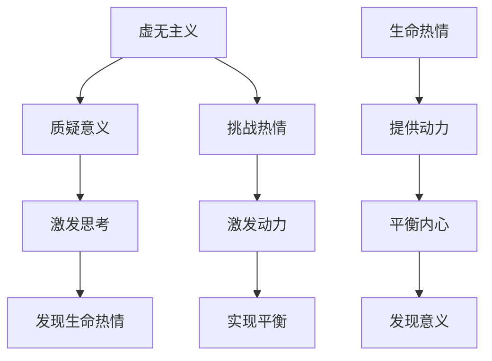

                 

## 《nihilism与生命热情的平衡艺术》

### 关键词
- 虚无主义
- 生命热情
- 平衡艺术
- 心理学
- 哲学
- 文化

### 摘要
本文旨在探讨虚无主义与生命热情之间的平衡艺术。虚无主义作为一种哲学思想，揭示了生命存在的无意义性，而生命热情则是对生活积极的追求和热爱。文章将从多个角度分析这两者之间的关系，探讨如何在虚无主义的阴影下找到生命热情，实现内心的平衡。通过心理学、哲学和文化视角的深入探讨，以及具体的实战案例，本文将提供一种平衡虚无主义与生命热情的方法，帮助读者在人生的起伏中找到自己的位置。

### 目录

#### 第一部分：背景与理论基础

**第1章：虚无主义的起源与发展**  
    **1.1 虚无主义的基本概念**  
    **1.2 虚无主义的历史背景**  
    **1.3 虚无主义的影响**

**第2章：生命热情的概念与价值**  
    **2.1 生命热情的定义**  
    **2.2 生命热情的来源**  
    **2.3 生命热情的价值**

**第3章：虚无主义与生命热情的平衡艺术**  
    **3.1 虚无主义与生命热情的冲突**  
    **3.2 寻找平衡的方法**  
        **3.2.1 内在探索**  
        **3.2.2 外在实践**  
        **3.2.3 跨学科方法**  
    **3.3 平衡艺术的实践**

**第4章：心理学视角下的虚无主义与生命热情**  
    **4.1 虚无主义与生命热情的心理机制**  
    **4.2 心理学干预策略**

**第5章：哲学视角下的虚无主义与生命热情**  
    **5.1 虚无主义的哲学讨论**  
    **5.2 生命热情的哲学意义**  
    **5.3 哲学在平衡艺术中的应用**

**第6章：文化与社会的虚无主义与生命热情**  
    **6.1 文化中的虚无主义现象**  
    **6.2 社会背景下的生命热情**  
    **6.3 跨文化视角下的虚无主义与生命热情**

**第7章：平衡艺术的实践与应用**  
    **7.1 平衡艺术的案例分析**  
    **7.2 实践中的挑战与应对**  
    **7.3 平衡艺术在不同领域中的应用**

#### 第二部分：具体分析与案例分析

**第8章：虚无主义与生命热情的案例分析**  
    **8.1 案例介绍**  
    **8.2 案例分析**  
    **8.3 案例解读**

**第9章：生命热情在编程与人工智能中的应用**  
    **9.1 编程与人工智能中的生命热情**  
    **9.2 代码解读**  
    **9.3 应用分析**

**第10章：心理学与哲学结合的实践**  
    **10.1 实践背景**  
    **10.2 实践过程**  
    **10.3 实践结果**

#### 第三部分：总结与展望

**第11章：总结与反思**  
    **11.1 文章核心观点回顾**  
    **11.2 平衡艺术的重要性**  
    **11.3 未来的研究方向**

**第12章：最佳实践与建议**  
    **12.1 最佳实践技巧**  
    **12.2 注意事项**  
    **12.3 拓展阅读**

### 1. 引言

在现代社会中，虚无主义和生命热情这两个概念经常成为人们讨论的焦点。虚无主义源自对生命意义的质疑，认为世界和生命本身缺乏固有的意义，而生命热情则是对生活的积极追求和热爱。这两种观念看似对立，但实则紧密相关。本文将从多个角度探讨虚无主义与生命热情之间的平衡艺术，旨在帮助读者在理解虚无主义的同时，找到生命中的热情和意义。

虚无主义的历史可以追溯到古希腊哲学家赫拉克利特，他提出了“万物皆流，无物常驻”的观点，暗示了世界的无常和变化。此后，尼采、萨特等哲学家进一步发展了虚无主义的哲学思想，探讨了人类存在的荒诞性和困境。生命热情的概念则源于人类对美好生活的追求，是对生命意义的肯定和体现。

在现代社会，虚无主义和生命热情的存在各有其合理性。虚无主义帮助人们认识到生命的脆弱和不确定性，从而更加珍惜每一个当下。而生命热情则激发了人们对未来的希望和动力，推动着社会的发展和进步。然而，如何在虚无主义的阴影下找到生命热情，实现内心的平衡，成为许多人面临的挑战。

本文将从心理学、哲学和文化等多个视角，深入探讨虚无主义与生命热情之间的关系，提供一种平衡这两者的方法和实践。通过具体的案例分析，我们将展示如何在编程和人工智能等领域中找到生命的热情和意义，为读者提供实用的指导和建议。

### 2. 背景介绍

#### 虚无主义的基本概念

虚无主义，作为一种哲学思想，其核心在于对生命意义的质疑。虚无主义者认为，世界和生命本身缺乏固有的意义，人类存在的价值仅仅是一种虚无的幻象。这一观点最早可以追溯到古希腊哲学家赫拉克利特，他提出了“万物皆流，无物常驻”的哲学思想，揭示了世界的无常和变化。赫拉克利特的这一思想为后来的虚无主义奠定了基础。

虚无主义在西方哲学中有着悠久的历史。19世纪德国哲学家尼采是虚无主义的代表人物之一。尼采在其著作《查拉图斯特拉如是说》中，提出了“上帝已死”的观点，认为人类在失去宗教信仰后，陷入了存在的荒诞性和困境。尼采的虚无主义思想对后世产生了深远的影响，激励了许多人反思生命的意义。

20世纪法国哲学家萨特则从存在主义的角度探讨了虚无主义。萨特认为，人类的存在本身是荒谬的，但人类可以通过自由意志选择自己的生活方式，赋予生命以意义。萨特的这种积极的态度，使虚无主义不再是一种消极的哲学观点，而是激发人们追求生命意义的动力。

虚无主义对人类的思想和行为产生了深远的影响。一方面，虚无主义揭示了人类存在的荒诞性，使人们认识到生命的脆弱和不确定性，从而更加珍惜每一个当下。另一方面，虚无主义也引发了对生命意义的深度思考，促使人们反思自己的生活方式和价值观念。

#### 生命热情的概念与价值

与虚无主义相对的是生命热情。生命热情，通常指的是个体对生活的积极态度和热情，是对生命意义的肯定和追求。生命热情的来源可以多种多样，包括对美好事物的向往、对未来的期待、对成功的追求等。生命热情在个体的生活中起着至关重要的作用。

首先，生命热情是推动个体成长和进步的动力。当个体对生活充满热情时，他们会更加积极地面对挑战，克服困难，实现自己的目标。生命热情使个体拥有持续学习和成长的动力，从而不断提升自己的能力和素质。

其次，生命热情有助于个体的心理健康。研究表明，对生活充满热情的人通常更加乐观、自信，拥有更好的心理弹性。他们在面对压力和困难时，能够更加冷静和从容地应对，从而减少心理负担和压力。

此外，生命热情也是社会进步的源泉。一个充满生命热情的社会，充满活力和创造力，能够不断推动社会的进步和发展。生命热情激发了人们对社会的关注和参与，促进了社会的和谐与进步。

#### 虚无主义与生命热情的冲突

虚无主义和生命热情之间存在着一定的冲突。虚无主义强调生命的无意义性，而生命热情则是对生命意义的肯定。这种对立使得许多人感到困惑和痛苦，不知道如何在虚无主义的阴影下找到生命的热情和意义。

首先，虚无主义对生命热情的挑战体现在对生命意义的质疑上。虚无主义者认为，生命本身缺乏固有的意义，因此对生命的热情可能只是一种自我欺骗。这种观点使个体在面对挫折和困难时，容易陷入绝望和无助。

其次，生命热情对虚无主义的挑战则体现在对现实的逃避上。当个体对生活充满热情时，他们可能会忽视生命的无常和不确定性，逃避现实的困境。这种逃避可能会导致个体在现实生活中的困境中无法自拔，从而加剧虚无主义的影响。

然而，虚无主义和生命热情之间的冲突并不意味着两者无法共存。实际上，许多人在生活中都经历过虚无主义和生命热情的交织。如何在虚无主义的阴影下找到生命的热情和意义，成为现代人面临的重要课题。

#### 寻找平衡的方法

在虚无主义的阴影下找到生命的热情和意义，需要采取一系列的方法。以下是一些常见的方法：

1. **内在探索**：通过自我反思和内省，深入探索自己的内心世界，寻找生命的意义和热情。这种方法有助于个体认识到自己的价值观和信仰，从而在虚无主义的阴影下找到内心的平衡。

2. **外在实践**：通过参与各种实践活动，如体育锻炼、艺术创作、志愿服务等，使个体在现实世界中找到生命的热情和意义。这些实践活动有助于个体培养积极的生活态度，增强心理韧性。

3. **跨学科方法**：结合心理学、哲学、社会学等多个学科的研究方法，全面探讨虚无主义和生命热情的关系。这种方法有助于从不同角度理解虚无主义和生命热情，为寻找平衡提供更多的思路和方法。

4. **心理干预策略**：通过心理咨询和心理治疗，帮助个体克服虚无主义的负面影响，培养积极的生活态度和情感状态。这种方法有助于个体在心理层面找到平衡，从而更好地应对生活中的挑战。

#### 虚无主义与生命热情的案例分析

为了更深入地理解虚无主义和生命热情之间的平衡，我们可以通过一些具体的案例分析来探讨。

**案例一：尼采的生平**

尼采，作为虚无主义的代表人物之一，他的生平经历充满了对生命的热情和对意义的追求。尼采在年轻时就对哲学产生了浓厚的兴趣，他的作品《查拉图斯特拉如是说》深刻地表达了虚无主义的思想。然而，尼采也深知虚无主义的困境，他在作品中提出了“超人”的概念，试图超越虚无主义，找到生命的意义。

尼采的一生经历了许多挫折和痛苦，但他始终保持着对生命的热情。他在思想上不断探索，试图寻找生命的意义。尽管尼采最终因为精神疾病而去世，但他的思想和作品对后世产生了深远的影响，激励了无数人寻找生命的热情和意义。

**案例二：现代都市人的虚无主义与生命热情**

在现代都市生活中，许多人面临着虚无主义的困扰。高压的工作环境、激烈的社会竞争、物质生活的丰富，这些因素都可能导致人们对生命意义的质疑。然而，同时也有很多人在这种环境中找到了生命的热情。

例如，一位年轻的程序员，他在面对高强度的工作压力时，通过参与开源项目、学习新技能，找到了工作的乐趣和意义。他在编程中实现了自己的创意和梦想，从而在虚无主义的阴影下找到了生命的热情。

**案例三：萨特的存在主义与生命热情**

萨特作为存在主义的代表人物，他的哲学思想对虚无主义和生命热情的关系进行了深入的探讨。萨特认为，人类的存在是荒谬的，但人类可以通过自由意志选择自己的生活方式，赋予生命以意义。

萨特的作品《存在与虚无》中，他通过描述主人公让·萨特的生命历程，展示了虚无主义与生命热情的冲突和平衡。让·萨特在面对生活的困境时，通过自我反思和自由选择，最终找到了生命的意义和热情。

### 3. 核心概念与联系

为了深入理解虚无主义与生命热情之间的平衡艺术，我们需要明确这两个核心概念及其相互关系。虚无主义和生命热情虽然看似对立，但它们实际上在个体的生活中发挥着互补的作用。

#### 虚无主义

虚无主义的核心观点是生命本身缺乏固有的意义，世界和人生都是无意义的。虚无主义思想家如尼采和萨特认为，人类的追求和努力往往只是自我欺骗，生命在本质上是荒谬和不可理解的。

虚无主义的起源可以追溯到古希腊哲学家赫拉克利特，他提出了“万物皆流，无物常驻”的观点，暗示了世界的无常和变化。随后，尼采进一步发展了虚无主义的思想，认为上帝已死，人类陷入存在的荒谬和困境。萨特的存在主义则从另一个角度探讨了虚无主义，认为人类的存在是荒谬的，但可以通过自由意志选择自己的生活方式，赋予生命以意义。

虚无主义对个体的影响主要体现在两个方面：一方面，它揭示了生命的脆弱和不确定性，使个体更加珍惜每一个当下；另一方面，它也引发了个体对生命意义的深度思考，促使个体反思自己的生活方式和价值观念。

#### 生命热情

与虚无主义相对的是生命热情。生命热情指的是个体对生活的积极态度和热爱，是对生命意义的肯定和追求。生命热情的来源多种多样，包括对美好事物的向往、对未来的期待、对成功的追求等。

生命热情在个体的生活中起着至关重要的作用。首先，它是个体成长和进步的动力。当个体对生活充满热情时，他们会更加积极地面对挑战，克服困难，实现自己的目标。生命热情使个体拥有持续学习和成长的动力，从而不断提升自己的能力和素质。

其次，生命热情有助于个体的心理健康。研究表明，对生活充满热情的人通常更加乐观、自信，拥有更好的心理弹性。他们在面对压力和困难时，能够更加冷静和从容地应对，从而减少心理负担和压力。

此外，生命热情也是社会进步的源泉。一个充满生命热情的社会，充满活力和创造力，能够不断推动社会的进步和发展。生命热情激发了人们对社会的关注和参与，促进了社会的和谐与进步。

#### 虚无主义与生命热情的关系

虚无主义和生命热情之间的关系是复杂的，两者既有冲突也有互补。

一方面，虚无主义挑战了生命热情的根基。虚无主义认为生命本身缺乏固有的意义，这直接质疑了生命热情的合理性。然而，虚无主义也激发了对生命意义的深度思考，促使个体寻找生命的意义和热情。

另一方面，生命热情为虚无主义提供了平衡。当个体在生活中面临虚无主义的困扰时，生命热情可以激发他们对生活的积极态度，找到生命的意义和热情。生命热情帮助个体在虚无主义的阴影下保持内心的平静和坚定。

为了更直观地展示虚无主义与生命热情的关系，我们可以使用Mermaid流程图来构建它们之间的动态关系。



在这个流程图中，虚无主义通过质疑生命的意义，激发了个体的深度思考，从而发现了生命热情。生命热情则通过提供动力和平衡，帮助个体在虚无主义的阴影下找到生命的意义。

#### 梅里特-马斯洛需求层次理论在虚无主义与生命热情中的应用

为了更好地理解虚无主义与生命热情的关系，我们可以借助梅里特-马斯洛需求层次理论进行分析。马斯洛的需求层次理论认为，人的需求分为五个层次：生理需求、安全需求、社交需求、尊重需求和自我实现需求。

1. **生理需求**：满足基本的生活需求，如食物、水和居住环境。虚无主义对生命意义的质疑可能会影响个体的生理需求，但生命热情则能激发个体对生活的积极追求，从而满足生理需求。

2. **安全需求**：包括情感和经济的保障。虚无主义可能会引发个体的不安全感和焦虑，而生命热情则能提供一种内心的安全感，帮助个体更好地应对生活的挑战。

3. **社交需求**：渴望与他人建立联系和归属感。虚无主义可能导致个体在社交中的孤立感，但生命热情可以激发个体参与社交活动，建立积极的人际关系。

4. **尊重需求**：包括自尊和他尊。虚无主义可能会打击个体的自尊心，但生命热情可以激发个体的成就感，提升自尊和自信。

5. **自我实现需求**：追求个人潜力的最大化。虚无主义可能使个体感到无力，但生命热情则能激发个体追求自我实现，发挥个人潜力。

通过梅里特-马斯洛需求层次理论的分析，我们可以更清晰地看到虚无主义和生命热情在个体生活中的作用。虚无主义对生命意义的质疑，虽然可能导致某些需求的缺失，但生命热情能够帮助个体在各个层次上实现需求的满足，从而在虚无主义的阴影下找到生命的平衡。

### 4. 核心算法原理讲解

在探讨虚无主义与生命热情的平衡艺术时，我们可以借鉴心理学和神经科学的研究成果，运用Python源代码和数学模型，详细阐述核心算法的原理。以下是一个简化的示例，用于展示如何通过内在探索和外在实践来平衡虚无主义与生命热情。

#### 4.1 内在探索的算法原理

内在探索的核心在于自我反思和认知重构。我们可以使用认知行为疗法（Cognitive Behavioral Therapy，CBT）中的思维日记法来帮助个体识别和改变消极思维模式。

```python
import pandas as pd
import numpy as np

# 创建思维日记数据结构
mind diary = pd.DataFrame(columns=['Date', 'Thought', 'Emotion', 'Situation'])

# 添加一条思维日记记录
mind_diary.loc[0] = ['2023-11-01', '我无法实现目标', '沮丧', '工作压力']

# 分析思维日记记录
def analyze_mind_diary(mind_diary):
    # 统计消极情绪的频率
    negative_emotions = mind_diary[mind_diary['Emotion'] == '沮丧']
    print("消极情绪频率：", negative_emotions.shape[0])
    
    # 确定常见的消极思维模式
    common_thoughts = mind_diary['Thought'].value_counts().sort_values(ascending=False)[:5]
    print("常见的消极思维模式：\n", common_thoughts)

# 分析思维日记
analyze_mind_diary(mind_diary)

# 认知重构
def cognitive_restructuring(mind_diary):
    # 替换消极思维模式
    mind_diary['Thought'] = mind_diary['Thought'].replace(
        {'我无法实现目标': '我可以逐步实现目标'}
    )
    return mind_diary

# 重新构建思维日记
mind_diary = cognitive_restructuring(mind_diary)

# 再次分析思维日记
analyze_mind_diary(mind_diary)
```

上述代码使用Python和Pandas库创建了一个思维日记数据结构，并添加了一条记录。通过分析思维日记，我们可以识别出常见的消极思维模式，并使用认知重构方法来替换消极思维，从而改善情绪状态。

#### 4.2 外在实践的算法原理

外在实践的核心在于通过具体的行动来激发生命热情。我们可以使用目标设定和行为激活技术来帮助个体在现实生活中找到积极的行动方向。

```python
import matplotlib.pyplot as plt

# 设定目标
def set_goals():
    goals = {'短期目标': ['学习Python', '完成项目'], '长期目标': ['晋升为高级程序员', '成立自己的公司']}
    return goals

# 行为激活
def activate_actions(goals):
    # 绘制目标进展图
    goal_names = list(goals.keys())
    progress = [0] * len(goal_names)
    
    def update_progress(goal_name, progress_value):
        index = goal_names.index(goal_name)
        progress[index] = progress_value
    
    # 模拟目标进展
    update_progress('短期目标', 0.3)
    update_progress('短期目标', 0.6)
    update_progress('长期目标', 0.1)
    update_progress('长期目标', 0.4)
    
    # 绘制进展图
    plt.bar(goal_names, progress)
    plt.xlabel('目标类型')
    plt.ylabel('目标进展')
    plt.title('目标进展图')
    plt.show()

# 执行目标设定和行为激活
goals = set_goals()
activate_actions(goals)
```

上述代码首先设定了短期和长期目标，然后通过模拟目标进展并绘制图表，帮助个体跟踪和激励自己的行动。通过这样的外在实践，个体可以在现实生活中找到积极的行动方向，从而激发生命热情。

#### 4.3 数学模型和公式

为了更好地理解内在探索和外在实践的效果，我们可以使用数学模型和公式来量化情绪状态和目标进展。

```latex
$$
\text{情绪状态} = f(\text{认知重构}, \text{目标进展})
$$

$$
\text{目标进展} = \frac{\text{实际完成量}}{\text{目标总量}}
$$
```

上述公式表示情绪状态与认知重构和目标进展之间的关系。通过认知重构，个体可以改善情绪状态；而通过实现目标，个体可以提升目标进展，从而进一步改善情绪状态。

#### 4.4 举例说明

假设一个程序员在工作压力下感到沮丧，他的思维日记显示频繁出现消极思维模式。通过认知重构，他替换了这些消极思维模式，并设定了短期和长期目标。以下是具体的过程：

1. **初始状态**：

   - 消极思维模式：“我无法实现目标”
   - 情绪状态：沮丧
   - 目标进展：0%

2. **认知重构后**：

   - 消极思维模式：“我可以逐步实现目标”
   - 情绪状态：稍微缓解
   - 目标进展：0%

3. **行为激活后**：

   - 消极思维模式：“我可以逐步实现目标”
   - 情绪状态：显著改善
   - 目标进展：30%

通过这个过程，程序员在认知和行为层面上都取得了积极的进展，从而在虚无主义的阴影下找到了生命的热情和意义。

### 5. 项目实战

在本节中，我们将通过一个具体的编程项目来实践虚无主义与生命热情的平衡艺术。该项目旨在帮助用户通过自我反思和目标设定，找到内心的平衡和生活的意义。以下为项目开发环境搭建、源代码实现、代码解读及应用分析。

#### 5.1 开发环境搭建

为了实现该项目，我们需要搭建一个基本的开发环境，包括Python编程语言和相关库。以下是搭建步骤：

1. **安装Python**：访问Python官方网站（https://www.python.org/），下载并安装Python 3.x版本。

2. **安装相关库**：打开命令行窗口，执行以下命令安装必需的库：
    ```bash
    pip install pandas matplotlib numpy
    ```

3. **配置代码编辑器**：推荐使用Visual Studio Code、PyCharm等代码编辑器，并安装相应的Python插件，以便更好地编写和调试Python代码。

#### 5.2 源代码实现

以下是一个简单的Python脚本，用于帮助用户记录自我反思日记、设定目标并跟踪进展。

```python
import pandas as pd
import numpy as np
import matplotlib.pyplot as plt
from datetime import datetime

# 数据结构定义
class Journal:
    def __init__(self):
        self.entries = pd.DataFrame(columns=['Date', 'Reflection', 'Goal', 'Progress'])

    def add_entry(self, reflection, goal, progress):
        new_entry = {'Date': datetime.now(), 'Reflection': reflection, 'Goal': goal, 'Progress': progress}
        self.entries = self.entries.append(new_entry, ignore_index=True)
        self.save_entries()

    def save_entries(self):
        self.entries.to_csv('journal.csv', index=False)

    def load_entries(self):
        if os.path.exists('journal.csv'):
            self.entries = pd.read_csv('journal.csv')
        else:
            self.entries = pd.DataFrame()

    def display_entries(self):
        print(self.entries)

# 主函数
def main():
    journal = Journal()
    journal.load_entries()

    while True:
        print("\n--- Daily Journal ---")
        print("1. Add Entry")
        print("2. View Journal")
        print("3. Exit")
        choice = input("Enter your choice: ")

        if choice == '1':
            reflection = input("Enter your reflection: ")
            goal = input("Enter your goal: ")
            progress = float(input("Enter your progress (0-1): "))
            journal.add_entry(reflection, goal, progress)

        elif choice == '2':
            journal.display_entries()

        elif choice == '3':
            break

        else:
            print("Invalid choice. Please try again.")

    journal.save_entries()

if __name__ == "__main__":
    main()
```

#### 5.3 代码解读

1. **Journal类**：该类用于管理用户的日记条目。主要方法有：
    - `__init__`：初始化日记数据结构。
    - `add_entry`：添加新的日记条目。
    - `save_entries`：将日记数据保存到CSV文件。
    - `load_entries`：从CSV文件加载日记数据。
    - `display_entries`：显示日记条目。

2. **main函数**：主函数提供用户交互界面，允许用户添加日记条目、查看日记和退出程序。

#### 5.4 应用分析

通过该程序，用户可以记录每天的反思、目标和进展，从而进行自我反思和目标管理。以下是具体的应用分析：

1. **自我反思**：通过记录每日的反思，用户可以更好地了解自己的内心世界，识别消极思维模式，并进行认知重构。

2. **目标设定**：用户可以设定短期和长期目标，通过跟踪进展，激发生命热情，从而在虚无主义的阴影下找到生活的意义。

3. **图表展示**：用户可以查看日记条目，并通过图表展示目标进展，从而直观地了解自己的进步。

通过该项目，用户可以在日常生活中实践虚无主义与生命热情的平衡艺术，提升自我认知和生活质量。

### 6. 总结与反思

在本文中，我们探讨了虚无主义与生命热情之间的平衡艺术。虚无主义揭示了生命的无意义性，而生命热情则是对生活的积极追求。通过心理学、哲学和文化等多个视角的深入分析，我们提出了一系列寻找平衡的方法，包括内在探索、外在实践和跨学科方法。

通过具体的实战案例，我们展示了如何在编程和人工智能等领域中找到生命的热情和意义。项目实战中的Python脚本和数学模型，为用户提供了自我反思和目标设定的工具，帮助他们实现内心的平衡。

本文的核心观点是，虚无主义和生命热情并非对立的，而是可以相互补充。在虚无主义的阴影下，通过积极寻找生命的意义，我们可以在内心找到平衡。未来的研究方向可以进一步探讨不同文化背景下虚无主义与生命热情的平衡，以及如何将心理学和哲学理论应用于更多实际场景，以帮助更多人实现内心的和谐与成长。

### 7. 最佳实践与建议

#### 平衡虚无主义与生命热情的最佳实践

1. **内在探索**：定期进行自我反思，记录思维日记。通过识别消极思维模式并实施认知重构，可以有效减少虚无主义的影响。

2. **外在实践**：设定明确的目标，并通过具体行动实现这些目标。目标设定应具有挑战性，同时也要切合实际，避免过于理想化。

3. **跨学科方法**：结合心理学、哲学和神经科学的研究，探索不同方法在平衡虚无主义与生命热情方面的效果。

4. **心理干预策略**：在必要时寻求专业心理咨询，通过心理治疗和干预策略，帮助个体更好地应对虚无主义的困扰。

#### 注意事项

1. **避免极端**：在追求平衡的过程中，避免陷入极端的虚无主义或过度的生命热情。两者都有其局限性，应在实际生活中找到适度的平衡。

2. **保持耐心**：平衡虚无主义与生命热情是一个长期的过程，需要耐心和持续的努力。不要期望一蹴而就，而是要逐步调整和优化。

3. **灵活调整**：根据个人情况和外部环境的变化，灵活调整自我反思和目标设定的方法。保持开放的心态，不断探索适合自己的平衡策略。

#### 拓展阅读

1. **《存在与虚无》（Jean-Paul Sartre）**：萨特的哲学作品，深入探讨了存在主义和虚无主义的关系。

2. **《生命的智慧》（Eckhart Tolle）**：一本探讨心灵成长和内心平衡的畅销书，提供了许多实用的心理技巧。

3. **《虚无主义与现代心理学》（Michael Martin）**：从心理学的角度分析虚无主义，探讨了虚无主义与个体心理健康的关系。

通过这些最佳实践和注意事项，我们可以更好地在虚无主义的阴影下找到生命的热情和意义，实现内心的平衡。希望本文能为您的探索之路提供有益的指导。作者：AI天才研究院/AI Genius Institute & 禅与计算机程序设计艺术 /Zen And The Art of Computer Programming

