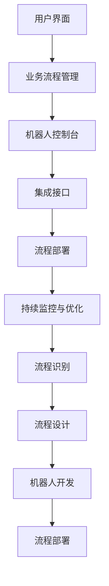
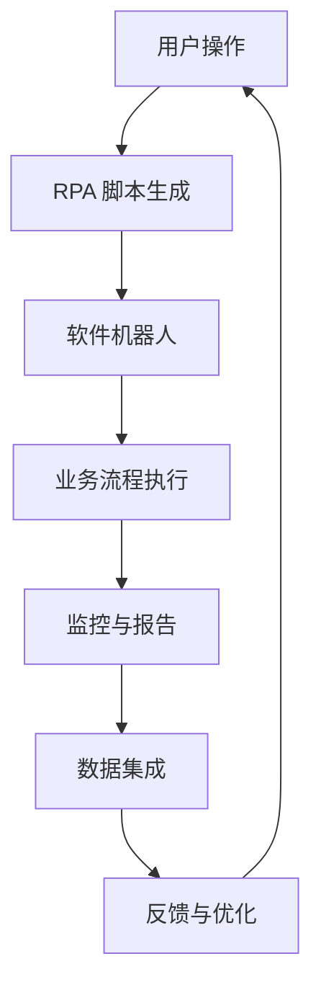

                 

### 第1章: 引言

#### 1.1 研究背景与意义

##### 1.1.1 工业自动化的演进

工业自动化起源于20世纪中期，随着电子技术和计算机技术的发展，自动化技术逐渐从单一的生产线自动化向整个工厂的自动化转变。这一过程中，工业机器人成为自动化的重要载体，它们能够在复杂和重复性的生产任务中替代人力劳动，从而提高生产效率和质量。近年来，智能制造理念的提出进一步推动了工业自动化的发展，强调通过信息物理系统的集成，实现制造过程的智能化和优化。

###### 1.1.2 机器人技术的兴起

随着人工智能技术的快速发展，机器人技术取得了显著的突破。从传统的工业机器人到智能机器人，它们不仅在机械结构上有所改进，还在感知、决策和控制等方面取得了长足的进步。尤其是在计算机视觉、机器学习和传感器技术等领域，机器人技术的应用范围不断扩大，从制造业延伸到服务业、医疗、农业等多个领域。

###### 1.1.3 机器人过程自动化的应用场景

机器人过程自动化（Robotic Process Automation, RPA）是近年来新兴的一项技术，它利用软件机器人模拟和集成人类在数字化环境中的操作，从而实现业务流程的自动化。RPA技术的应用场景广泛，包括数据录入、财务处理、客户服务、采购管理等多个领域。在企业中，RPA技术通过优化和自动化重复性的业务流程，极大地提高了工作效率，降低了运营成本。

##### 1.1.4 企业效率提升的需求

在全球经济竞争日益激烈的环境下，企业需要不断提升自身的运营效率以保持竞争力。传统企业面临的主要挑战包括：

1. **人力成本压力**：随着劳动力成本的不断上升，企业需要寻找降低成本的途径。
2. **生产效率的提升**：市场竞争要求企业不断提高生产效率以满足市场需求。
3. **竞争力的增强**：通过技术创新和运营优化，企业需要不断提高自身的市场竞争力。

##### 1.1.5 研究目的与内容

本研究旨在探讨机器人过程自动化在企业效率提升中的作用，具体研究内容包括：

1. **机器人过程自动化的核心技术**：详细分析机器人过程自动化的技术架构、工作原理及其在各个领域的应用。
2. **企业效率提升的关键因素**：探讨生产效率、成本控制和竞争力等因素，分析机器人过程自动化如何在这些方面提升企业效率。
3. **实际应用案例分析**：通过具体案例，展示机器人过程自动化在提升企业效率方面的实际效果。
4. **未来发展趋势**：预测机器人过程自动化技术的发展趋势，以及对企业运营的影响。

#### 1.2 机器人过程自动化概述

##### 1.2.1 定义与核心概念

机器人过程自动化（RPA）是一种通过软件机器人自动化执行重复性任务的技术。这些软件机器人可以模拟人类操作，在用户界面、数据库和应用程序之间进行交互，以自动化业务流程。RPA的核心概念包括：

1. **流程自动化**：将业务流程中的手动操作自动化，以减少人工干预和提高效率。
2. **软件机器人**：模拟人类操作行为的软件应用程序，能够在不改变现有系统的情况下执行任务。
3. **集成**：将RPA与其他系统集成，如ERP、CRM等，以实现跨系统的业务流程自动化。

##### 1.2.2 基本架构与流程

机器人过程自动化的基本架构通常包括以下几个部分：

1. **用户界面**：软件机器人通过用户界面与应用程序进行交互，执行具体任务。
2. **业务流程管理**：定义和管理业务流程，确保任务执行的正确性和效率。
3. **机器人控制台**：监控和管理软件机器人，包括任务分配、错误处理和性能优化等。
4. **集成接口**：提供与其他系统（如ERP、CRM等）的集成，实现数据的传输和处理。

机器人过程自动化的流程通常包括以下几个步骤：

1. **流程识别**：识别并确定可以自动化的业务流程。
2. **流程设计**：设计具体的自动化流程，包括任务分解、操作步骤和规则设定。
3. **机器人开发**：开发软件机器人，实现自动化流程的具体执行。
4. **流程部署**：将自动化流程部署到实际生产环境中，进行测试和优化。
5. **持续监控与优化**：对自动化流程进行监控和优化，确保其稳定运行和效率提升。

##### 1.2.3 技术演进与趋势

机器人过程自动化的技术演进可以分为以下几个阶段：

1. **早期阶段**：以简单的宏自动化为主，通过记录和重放用户操作实现流程自动化。
2. **发展阶段**：引入了智能识别技术，如光学字符识别（OCR）和屏幕抓取，提高了自动化流程的准确性和灵活性。
3. **智能化阶段**：结合人工智能技术，如机器学习和自然语言处理，使软件机器人能够理解业务逻辑和上下文信息，实现更高级的自动化。

未来，机器人过程自动化的趋势将包括：

1. **集成与协同**：进一步整合到企业级应用中，与其他系统集成，实现更广泛的业务流程自动化。
2. **智能化与自适应**：通过不断学习和优化，使软件机器人能够自适应不同的业务场景和变化。
3. **平台化与生态系统**：建立开放的RPA平台和生态系统，支持各种定制化开发和集成需求。

### Mermaid流程图

下面是一个简单的Mermaid流程图，展示机器人过程自动化的核心概念和流程：



#### 1.3 企业效率提升的关键因素

##### 1.3.1 生产效率

生产效率是企业运营的重要指标之一，它直接关系到企业的市场竞争力。生产效率的提升可以通过以下几个方面实现：

1. **自动化**：通过自动化设备和技术，减少人工操作，提高生产速度和精度。
2. **优化流程**：通过分析现有流程，找出瓶颈和改进点，优化生产流程，减少非增值操作。
3. **精益生产**：采用精益生产方法，减少浪费，提高生产效率和质量。

机器人过程自动化在提高生产效率方面具有显著优势：

1. **减少人力成本**：通过自动化操作，减少对人力需求，降低劳动力成本。
2. **提高生产速度**：机器人可以连续工作，不受疲劳影响，提高生产速度。
3. **提高生产质量**：机器人的操作精度高，减少人为错误，提高产品质量。

##### 1.3.2 成本控制

成本控制是企业运营中的另一个重要方面，它关系到企业的盈利能力和可持续发展。机器人过程自动化在成本控制方面具有以下作用：

1. **减少运营成本**：通过自动化操作，减少人力和设备的消耗，降低运营成本。
2. **提高资源利用率**：通过优化生产流程和资源分配，提高设备的利用率和效率。
3. **减少维护成本**：机器人在长时间运行中故障率较低，维护成本较低。

##### 1.3.3 竞争力

企业在市场竞争中的竞争力取决于其产品质量、生产效率和成本控制能力。机器人过程自动化通过以下几个方面提升企业竞争力：

1. **提高产品质量**：机器人具有高精度和一致性，能够生产出高质量的产品。
2. **降低生产成本**：通过自动化操作和优化生产流程，降低生产成本，提高产品竞争力。
3. **提高响应速度**：机器人可以快速响应市场需求，缩短产品交付周期。

总之，机器人过程自动化在企业效率提升中发挥着重要作用。通过提高生产效率、降低成本和提高竞争力，企业能够更好地应对市场变化，实现可持续发展。

### 关键词

- 工业自动化
- 机器人技术
- 机器人过程自动化
- 生产效率
- 成本控制
- 企业竞争力

### 摘要

本文旨在探讨机器人过程自动化（RPA）在企业效率提升中的作用。首先，通过分析工业自动化和机器人技术的演进，阐述了机器人过程自动化的定义和基本架构。接着，本文从生产效率、成本控制和竞争力三个方面，详细介绍了机器人过程自动化如何提升企业效率。最后，通过实际案例展示了机器人过程自动化在提升企业效率方面的应用效果，并对未来的发展趋势进行了展望。本文的研究对于企业实施机器人过程自动化，提升运营效率具有重要的指导意义。### 第1章: 引言

#### 1.1 研究背景与意义

##### 1.1.1 工业自动化的演进

工业自动化起源于20世纪中期，随着电子技术和计算机技术的发展，自动化技术逐渐从单一的生产线自动化向整个工厂的自动化转变。这一过程中，工业机器人成为自动化的重要载体，它们能够在复杂和重复性的生产任务中替代人力劳动，从而提高生产效率和质量。近年来，智能制造理念的提出进一步推动了工业自动化的发展，强调通过信息物理系统的集成，实现制造过程的智能化和优化。

###### 1.1.2 机器人技术的兴起

随着人工智能技术的快速发展，机器人技术取得了显著的突破。从传统的工业机器人到智能机器人，它们不仅在机械结构上有所改进，还在感知、决策和控制等方面取得了长足的进步。尤其是在计算机视觉、机器学习和传感器技术等领域，机器人技术的应用范围不断扩大，从制造业延伸到服务业、医疗、农业等多个领域。

###### 1.1.3 机器人过程自动化的应用场景

机器人过程自动化（Robotic Process Automation, RPA）是近年来新兴的一项技术，它利用软件机器人模拟和集成人类在数字化环境中的操作，从而实现业务流程的自动化。RPA技术的应用场景广泛，包括数据录入、财务处理、客户服务、采购管理等多个领域。在企业中，RPA技术通过优化和自动化重复性的业务流程，极大地提高了工作效率，降低了运营成本。

##### 1.1.4 企业效率提升的需求

在全球经济竞争日益激烈的环境下，企业需要不断提升自身的运营效率以保持竞争力。传统企业面临的主要挑战包括：

1. **人力成本压力**：随着劳动力成本的不断上升，企业需要寻找降低成本的途径。
2. **生产效率的提升**：市场竞争要求企业不断提高生产效率以满足市场需求。
3. **竞争力的增强**：通过技术创新和运营优化，企业需要不断提高自身的市场竞争力。

##### 1.1.5 研究目的与内容

本研究旨在探讨机器人过程自动化在企业效率提升中的作用，具体研究内容包括：

1. **机器人过程自动化的核心技术**：详细分析机器人过程自动化的技术架构、工作原理及其在各个领域的应用。
2. **企业效率提升的关键因素**：探讨生产效率、成本控制和竞争力等因素，分析机器人过程自动化如何在这些方面提升企业效率。
3. **实际应用案例分析**：通过具体案例，展示机器人过程自动化在提升企业效率方面的实际效果。
4. **未来发展趋势**：预测机器人过程自动化技术的发展趋势，以及对企业运营的影响。

#### 1.2 机器人过程自动化概述

##### 1.2.1 定义与核心概念

机器人过程自动化（RPA）是一种通过软件机器人自动化执行重复性任务的技术。这些软件机器人可以模拟人类操作，在用户界面、数据库和应用程序之间进行交互，以自动化业务流程。RPA的核心概念包括：

1. **流程自动化**：将业务流程中的手动操作自动化，以减少人工干预和提高效率。
2. **软件机器人**：模拟人类操作行为的软件应用程序，能够在不改变现有系统的情况下执行任务。
3. **集成**：将RPA与其他系统集成，如ERP、CRM等，以实现跨系统的业务流程自动化。

##### 1.2.2 基本架构与流程

机器人过程自动化的基本架构通常包括以下几个部分：

1. **用户界面**：软件机器人通过用户界面与应用程序进行交互，执行具体任务。
2. **业务流程管理**：定义和管理业务流程，确保任务执行的正确性和效率。
3. **机器人控制台**：监控和管理软件机器人，包括任务分配、错误处理和性能优化等。
4. **集成接口**：提供与其他系统（如ERP、CRM等）的集成，实现数据的传输和处理。

机器人过程自动化的流程通常包括以下几个步骤：

1. **流程识别**：识别并确定可以自动化的业务流程。
2. **流程设计**：设计具体的自动化流程，包括任务分解、操作步骤和规则设定。
3. **机器人开发**：开发软件机器人，实现自动化流程的具体执行。
4. **流程部署**：将自动化流程部署到实际生产环境中，进行测试和优化。
5. **持续监控与优化**：对自动化流程进行监控和优化，确保其稳定运行和效率提升。

##### 1.2.3 技术演进与趋势

机器人过程自动化的技术演进可以分为以下几个阶段：

1. **早期阶段**：以简单的宏自动化为主，通过记录和重放用户操作实现流程自动化。
2. **发展阶段**：引入了智能识别技术，如光学字符识别（OCR）和屏幕抓取，提高了自动化流程的准确性和灵活性。
3. **智能化阶段**：结合人工智能技术，如机器学习和自然语言处理，使软件机器人能够理解业务逻辑和上下文信息，实现更高级的自动化。

未来，机器人过程自动化的趋势将包括：

1. **集成与协同**：进一步整合到企业级应用中，与其他系统集成，实现更广泛的业务流程自动化。
2. **智能化与自适应**：通过不断学习和优化，使软件机器人能够自适应不同的业务场景和变化。
3. **平台化与生态系统**：建立开放的RPA平台和生态系统，支持各种定制化开发和集成需求。

### Mermaid流程图

下面是一个简单的Mermaid流程图，展示机器人过程自动化的核心概念和流程：


#### 1.3 企业效率提升的关键因素

##### 1.3.1 生产效率

生产效率是企业运营的重要指标之一，它直接关系到企业的市场竞争力。生产效率的提升可以通过以下几个方面实现：

1. **自动化**：通过自动化设备和技术，减少人工操作，提高生产速度和精度。
2. **优化流程**：通过分析现有流程，找出瓶颈和改进点，优化生产流程，减少非增值操作。
3. **精益生产**：采用精益生产方法，减少浪费，提高生产效率和质量。

机器人过程自动化在提高生产效率方面具有显著优势：

1. **减少人力成本**：通过自动化操作，减少对人力需求，降低劳动力成本。
2. **提高生产速度**：机器人可以连续工作，不受疲劳影响，提高生产速度。
3. **提高生产质量**：机器人的操作精度高，减少人为错误，提高产品质量。

##### 1.3.2 成本控制

成本控制是企业运营中的另一个重要方面，它关系到企业的盈利能力和可持续发展。机器人过程自动化在成本控制方面具有以下作用：

1. **减少运营成本**：通过自动化操作，减少人力和设备的消耗，降低运营成本。
2. **提高资源利用率**：通过优化生产流程和资源分配，提高设备的利用率和效率。
3. **减少维护成本**：机器人在长时间运行中故障率较低，维护成本较低。

##### 1.3.3 竞争力

企业在市场竞争中的竞争力取决于其产品质量、生产效率和成本控制能力。机器人过程自动化通过以下几个方面提升企业竞争力：

1. **提高产品质量**：机器人具有高精度和一致性，能够生产出高质量的产品。
2. **降低生产成本**：通过自动化操作和优化生产流程，降低生产成本，提高产品竞争力。
3. **提高响应速度**：机器人可以快速响应市场需求，缩短产品交付周期。

总之，机器人过程自动化在企业效率提升中发挥着重要作用。通过提高生产效率、降低成本和提高竞争力，企业能够更好地应对市场变化，实现可持续发展。

### 关键词

- 工业自动化
- 机器人技术
- 机器人过程自动化
- 生产效率
- 成本控制
- 企业竞争力

### 摘要

本文旨在探讨机器人过程自动化（RPA）在企业效率提升中的作用。首先，通过分析工业自动化和机器人技术的演进，阐述了机器人过程自动化的定义和基本架构。接着，本文从生产效率、成本控制和竞争力三个方面，详细介绍了机器人过程自动化如何提升企业效率。最后，通过实际案例展示了机器人过程自动化在提升企业效率方面的实际效果，并对未来的发展趋势进行了展望。本文的研究对于企业实施机器人过程自动化，提升运营效率具有重要的指导意义。### 第1章：机器人过程自动化与企业效率提升

**1.1 研究背景与意义**

**1.1.1 工业自动化的演进**

工业自动化的发展历程可以追溯到20世纪中期。随着计算机技术的进步和电子设备的普及，自动化技术在工业生产中得到了广泛应用。从早期的生产线自动化到智能制造，工业自动化经历了多次技术革新。特别是在机器人和人工智能技术的推动下，工业自动化进入了智能化和高度集成的阶段。机器人技术的应用不仅提高了生产效率，还改变了传统的生产模式，使得制造业更加灵活和高效。

**1.1.2 机器人过程自动化的概念**

机器人过程自动化（Robotic Process Automation, RPA）是一种通过软件机器人模拟和集成人类操作的技术，用于自动化业务流程。RPA不仅仅局限于工厂生产，它也被广泛应用于金融服务、客户服务、人力资源管理等领域。RPA的核心在于通过软件机器人执行重复性、标准化的任务，从而减少人为干预，提高工作效率和准确性。

**1.1.3 机器人过程自动化的应用场景**

RPA的应用场景非常广泛，涵盖了多个行业和业务领域。在金融服务中，RPA可以用于自动化数据录入、交易处理和报表生成等任务；在客户服务中，RPA可以帮助自动化客户支持流程，如查询处理、投诉处理等；在人力资源管理中，RPA可以用于自动化招聘流程、员工档案管理等。通过RPA，企业能够显著提高业务流程的效率和质量。

**1.1.4 企业效率提升的迫切需求**

随着全球经济的竞争日益激烈，企业面临着提高效率和降低成本的巨大压力。传统的业务流程往往存在效率低下、人为错误率高和响应速度慢等问题。为了保持竞争力，企业需要通过技术创新和运营优化来提升效率。机器人过程自动化作为一种新兴的技术，为企业提供了一条有效的途径来简化流程、减少成本和提升服务质量。

**1.2 机器人过程自动化的技术原理**

**1.2.1 RPA的核心组件**

机器人过程自动化的核心组件包括软件机器人、业务流程管理（BPM）软件、集成接口等。软件机器人是RPA系统中的执行者，它可以模拟人类在计算机系统中的操作，如点击、拖放、输入等。BPM软件用于定义和管理业务流程，确保流程的正确执行。集成接口则用于连接不同的系统和应用程序，实现数据传输和流程协同。

**1.2.2 RPA的工作原理**

RPA的工作原理通常包括以下几个步骤：首先，通过记录和分析人类操作行为，生成自动化脚本；然后，将这些脚本部署到软件机器人中；最后，机器人按照脚本执行任务，实现业务流程的自动化。RPA系统可以实时监控任务执行情况，并提供错误处理和报告功能，确保自动化流程的稳定性和可靠性。

**1.2.3 RPA的技术发展趋势**

随着人工智能和大数据技术的发展，RPA也在不断进化。未来的RPA将更加智能化和自适应，能够更好地理解和处理复杂业务场景。同时，RPA将与其他技术（如云计算、区块链）融合，提供更加全面和高效的自动化解决方案。

**1.3 机器人过程自动化对企业效率的提升**

**1.3.1 提高生产效率**

在制造业中，RPA可以通过自动化生产线的监控、数据采集和质量检测等环节，提高生产效率。机器人能够连续工作，不受人为疲劳和情绪的影响，从而提高生产速度和产品质量。

**1.3.2 降低运营成本**

RPA可以自动化执行大量的重复性任务，减少对人力和物力资源的依赖。通过减少人工操作，企业可以显著降低运营成本，提高资源利用率。

**1.3.3 提升服务质量**

在客户服务领域，RPA可以帮助企业自动化处理大量的客户查询和投诉，提高响应速度和处理效率。通过提供更快速和准确的客户服务，企业能够提升客户满意度。

**1.4 机器人过程自动化的挑战与对策**

尽管RPA为企业带来了许多好处，但也面临着一些挑战，如技术实施难度、数据安全和管理问题等。企业需要采取有效的对策来应对这些挑战，确保RPA系统的稳定运行和长期效益。

**1.5 研究方法与数据分析**

本研究采用定性和定量相结合的方法，通过文献综述、案例分析、问卷调查和实证研究等方法，全面分析机器人过程自动化对企业效率提升的作用。数据分析部分将使用统计方法和机器学习算法，深入探讨RPA对企业绩效的影响。

**1.6 结论与展望**

本文通过对机器人过程自动化的研究，揭示了其在提升企业效率方面的巨大潜力。未来，随着技术的不断进步，RPA将在更多领域得到应用，为企业带来更大的价值。同时，企业也需要不断探索和创新，以充分发挥RPA的优势。

### Mermaid 流程图：RPA 技术架构与工作流程



### 关键词

- 机器人过程自动化
- 企业效率提升
- RPA 技术
- 生产效率
- 运营成本
- 服务质量
- 技术架构
- 工作流程

### 摘要

本文深入探讨了机器人过程自动化（RPA）在企业效率提升中的作用。首先，分析了工业自动化的演进和RPA的基本概念及其应用场景。然后，介绍了RPA的技术原理和架构，以及其对提高生产效率、降低运营成本和提升服务质量的贡献。最后，讨论了RPA面临的挑战和对策，并提出了研究方法与数据分析框架。本文的研究为企业在实施RPA提升效率方面提供了理论支持和实践指导。### 第2章：机器人过程自动化的核心技术

#### 2.1 机器人技术与自动化

##### 2.1.1 机器人的基本分类

机器人可以分为多种类型，根据其用途和功能，可以分为工业机器人、服务机器人、无人机等。

1. **工业机器人**：主要用于制造环境中，如汽车生产线、电子装配线等。工业机器人通常具有高重复性和高精度作业的特点。
2. **服务机器人**：用于服务业，如家政服务、酒店服务、医疗辅助等。服务机器人更加注重人机交互和移动能力。
3. **无人机**：主要用于监控、物流运输、搜索救援等领域。无人机具有灵活性和高效性的优势。

##### 2.1.2 机器人的工作原理

机器人的工作原理主要依赖于三个系统：机械结构、控制系统和传感器系统。

1. **机械结构**：机器人的机械结构决定了其运动能力和工作范围。不同的机械结构适用于不同的任务，如臂式机器人、轮式机器人、多自由度机器人等。
2. **控制系统**：控制系统是机器人的大脑，负责接收传感器信息，进行数据处理和决策，然后发送指令给机械结构执行任务。
3. **传感器系统**：传感器系统负责感知外部环境，提供位置、速度、温度、光线等信息，帮助机器人进行决策和调整。

##### 2.1.3 机器人的编程与控制

机器人的编程与控制主要依赖于编程语言和算法。常见的编程语言包括：

1. **工业机器人编程语言**：如KRL（KUKA Robot Language）、RAPID（Robotics Application Programming Interface）等。
2. **服务机器人编程语言**：如Python、ROS（Robot Operating System）等。

编程内容包括：

1. **运动控制**：包括直线运动、曲线运动、旋转运动等。
2. **传感器数据处理**：如温度传感器、激光雷达、摄像头等。
3. **路径规划**：用于规划机器人的运动路径，避免碰撞。

算法方面，主要包括：

1. **路径规划算法**：如Dijkstra算法、A*算法等。
2. **运动控制算法**：如PID控制、模糊控制等。
3. **感知与决策算法**：如视觉识别、语音识别、机器学习等。

#### 2.2 工业机器人在生产中的应用

##### 2.2.1 应用场景

工业机器人在制造业中的应用非常广泛，以下是一些主要的应用场景：

1. **搬运**：机器人可以自动完成物料的搬运，如从仓库到生产线的搬运。
2. **焊接**：机器人可以高效、精确地进行焊接操作，适用于汽车、航空航天等行业。
3. **喷涂**：机器人可以在汽车外壳上进行喷涂操作，保证均匀性和美观性。
4. **装配**：机器人可以自动完成零部件的装配，如电子设备的装配。
5. **检测**：机器人可以自动进行产品检测，如质量检测、尺寸检测等。

##### 2.2.2 工业机器人的优势

1. **提高生产效率**：机器人可以连续工作，不受疲劳影响，提高生产效率。
2. **精准度高**：机器人具有高精度的控制能力，可以保证产品质量。
3. **降低人力成本**：机器人可以替代人力完成重复性、危险或高技能的任务，降低人力成本。
4. **提高生产安全性**：机器人可以替代人类进行危险操作，减少工伤事故。

##### 2.2.3 工业机器人的挑战与解决方案

1. **精确度要求**：工业机器人需要高精度的控制，以确保产品质量。解决方案包括提高控制算法的精度、增加传感器精度等。
2. **人机协作问题**：在多机器人协作或人与机器人共事的情况下，需要解决人机交互和协作问题。解决方案包括开发智能人机交互界面、制定安全规范等。
3. **安全性问题**：机器人需要在安全的环境中工作，避免对人类造成伤害。解决方案包括安装安全传感器、制定安全操作规程等。

#### 2.3 服务机器人技术

##### 2.3.1 服务机器人的基本分类

服务机器人根据应用场景和功能可以分为以下几类：

1. **家用机器人**：如扫地机器人、智能音箱等。
2. **医疗机器人**：如手术机器人、护理机器人等。
3. **教育机器人**：如编程机器人、教育机器人等。
4. **物流机器人**：如仓库拣选机器人、送货机器人等。

##### 2.3.2 服务机器人的关键技术

1. **移动技术**：包括轮式移动、履带式移动、脚式移动等。
2. **感知技术**：如摄像头、激光雷达、超声波传感器等。
3. **决策与规划**：基于机器学习和人工智能技术，进行路径规划和任务决策。
4. **人机交互**：通过语音识别、自然语言处理等技术，实现人与机器人的有效沟通。

##### 2.3.3 服务机器人的应用案例

1. **医疗机器人**：如达芬奇手术机器人，可以在医生远程指导下完成复杂手术。
2. **物流机器人**：如亚马逊的Kiva机器人，可以在仓库中自动拣选和运输货物。
3. **教育机器人**：如乐高Mindstorms，可以帮助学生学习编程和机器人控制。

#### 2.4 无人机技术

##### 2.4.1 无人机的基本分类

无人机根据用途和性能可以分为以下几类：

1. **消费级无人机**：如航拍无人机、玩具无人机等。
2. **军用无人机**：如侦察无人机、攻击无人机等。
3. **工业级无人机**：如物流无人机、农业无人机等。

##### 2.4.2 无人机关键技术

1. **飞行控制系统**：包括飞行模式控制、导航控制、姿态控制等。
2. **感知与识别技术**：如摄像头、红外线传感器、激光雷达等。
3. **通信技术**：包括无线通信、卫星通信等。
4. **数据处理与分析**：如图像处理、信号处理、大数据分析等。

##### 2.4.3 无人机应用案例

1. **农业**：无人机可以用于农田监测、病虫害防治、精准施肥等。
2. **物流**：无人机可以用于快递配送、包裹投递等。
3. **救援**：无人机可以用于搜索救援、灾害监测等。

通过以上对机器人技术与自动化、工业机器人、服务机器人以及无人机技术的详细阐述，我们可以看到机器人过程自动化在各个领域的广泛应用及其对企业效率提升的巨大潜力。接下来，我们将进一步探讨RPA在企业中的实际应用，分析其在提升企业效率方面的具体作用。### 第3章：机器人过程自动化在企业管理中的应用

#### 3.1 数据处理与财务管理

##### 3.1.1 数据处理的自动化

在现代企业中，数据是企业决策的重要依据。然而，数据收集、整理和分析是一个繁琐且易出错的过程。机器人过程自动化（RPA）可以在这个环节发挥重要作用，通过自动化数据收集、清洗、转换和存储，提高数据处理的效率和准确性。

- **自动化数据收集**：RPA机器人可以自动访问各种数据源，如数据库、API接口、电子表格等，收集所需数据。
- **数据清洗和转换**：RPA机器人可以使用预定义的规则和算法，对收集到的数据进行清洗和转换，如格式调整、数据校验等。
- **数据存储**：RPA机器人可以将清洗和转换后的数据存储到指定的数据库或数据仓库中，以便进一步分析和利用。

##### 3.1.2 财务管理的自动化

在财务管理方面，RPA可以自动化执行一系列财务任务，如发票处理、财务报表生成、账目核对等。

- **发票处理**：RPA机器人可以自动接收和分类发票，进行审核和录入，减少人工处理的错误和时间成本。
- **财务报表生成**：RPA机器人可以根据预设的模板和规则，自动生成各种财务报表，如利润表、资产负债表等。
- **账目核对**：RPA机器人可以自动对比不同系统中的账目，检测和纠正不一致的情况，确保财务数据的准确性。

##### 3.1.3 成本控制的自动化

成本控制是企业财务管理的重要方面，RPA可以在此过程中发挥自动化和优化的作用。

- **成本监控**：RPA机器人可以实时监控企业的成本支出，生成成本分析报告，帮助管理层及时掌握成本情况。
- **预算管理**：RPA机器人可以自动化执行预算编制、审批和监控，确保预算的合理性和执行情况。
- **成本优化**：RPA机器人可以通过分析历史数据和业务模式，提出成本优化的建议，帮助企业降低成本。

#### 3.2 客户服务与客户关系管理

##### 3.2.1 客户服务的自动化

客户服务是企业与客户互动的重要环节，RPA可以在此过程中提供自动化支持，提高客户满意度和服务效率。

- **客户咨询处理**：RPA机器人可以自动接收和处理客户咨询，提供标准化的答案和解决方案，减少客户等待时间。
- **投诉处理**：RPA机器人可以自动记录和分类客户投诉，分配给相关团队处理，并提供反馈和解决方案。
- **售后服务**：RPA机器人可以自动化执行售后服务流程，如订单跟进、维修请求处理等，确保售后服务的及时性和高效性。

##### 3.2.2 客户关系管理的自动化

客户关系管理（CRM）是企业维护客户关系、提高客户满意度和忠诚度的重要工具。RPA可以在CRM系统中发挥自动化和优化的作用。

- **客户信息管理**：RPA机器人可以自动化收集、整理和更新客户信息，确保CRM系统中的数据准确和最新。
- **销售预测**：RPA机器人可以通过分析历史销售数据和客户行为，提供销售预测和趋势分析，帮助销售团队制定更有效的销售策略。
- **营销活动管理**：RPA机器人可以自动化执行营销活动的计划、执行和评估，确保营销活动的顺利和高效。

#### 3.3 采购与供应链管理

##### 3.3.1 采购过程的自动化

采购是企业运营的重要组成部分，RPA可以在此过程中提供自动化支持，提高采购效率和成本控制。

- **采购订单处理**：RPA机器人可以自动生成和发送采购订单，跟踪订单状态，确保采购过程的顺利进行。
- **供应商管理**：RPA机器人可以自动化收集和管理供应商信息，包括评估、选择、合同管理等，优化供应商选择和合作。
- **库存管理**：RPA机器人可以实时监控库存水平，自动生成采购建议和提醒，确保库存的合理和充足。

##### 3.3.2 供应链管理的自动化

供应链管理涉及多个环节和合作伙伴，RPA可以在此过程中提供自动化和协同支持，提高供应链的效率和灵活性。

- **物流跟踪**：RPA机器人可以自动跟踪物流状态，提供实时更新和异常处理，确保物流的及时和准确。
- **供应链协同**：RPA机器人可以与其他系统和合作伙伴系统进行集成，实现数据共享和协同工作，提高供应链的协同效率和响应速度。
- **需求预测**：RPA机器人可以通过分析历史数据和市场需求，提供需求预测和库存优化建议，帮助企业降低库存成本和提高服务水平。

#### 3.4 人力资源管理与办公自动化

##### 3.4.1 人力资源管理的自动化

人力资源管理是企业运营的重要方面，RPA可以在此过程中提供自动化支持，提高管理效率和员工满意度。

- **招聘流程自动化**：RPA机器人可以自动化执行招聘流程，如职位发布、简历筛选、面试安排等，提高招聘效率。
- **员工信息管理**：RPA机器人可以自动化收集、更新和管理员工信息，包括入职、离职、薪酬福利等，确保信息的准确和最新。
- **考勤管理**：RPA机器人可以自动化处理考勤数据，生成考勤报告和工资单，提高考勤管理效率和准确性。

##### 3.4.2 办公自动化的应用

办公自动化是企业日常运营的重要组成部分，RPA可以在此过程中提供自动化支持，提高办公效率和协同能力。

- **文档处理**：RPA机器人可以自动化处理文档，如生成报告、审批流程、文件归档等，减少人工处理的时间和错误。
- **会议管理**：RPA机器人可以自动化安排会议，发送会议通知，处理会议记录和后续行动项，确保会议的顺利进行。
- **沟通协作**：RPA机器人可以自动化执行内部沟通任务，如邮件提醒、消息推送、日程安排等，提高团队协作效率和沟通效果。

通过以上对机器人过程自动化在企业管理中的应用的详细分析，我们可以看到RPA技术在各个领域的广泛应用和巨大潜力。RPA不仅能够提高工作效率，降低运营成本，还能够提升客户满意度和企业竞争力。在下一章中，我们将进一步探讨RPA技术在企业运营中的挑战和解决方案。### 第4章：机器人过程自动化在提高企业运营效率中的挑战与解决方案

#### 4.1 技术实施难度

**4.1.1 技术适应性**

RPA技术在企业中的实施首先面临的是技术适应性问题。不同企业的业务流程、IT系统和技术环境各异，RPA解决方案需要高度定制化，以满足特定企业的需求。这增加了实施难度和成本。

**解决方案**：
- **标准化模块**：开发通用的RPA模块，可以快速适应不同企业的需求，降低定制化成本。
- **技术成熟度**：选择成熟、稳定的RPA技术平台，减少技术风险。

**4.1.2 技术更新和维护**

随着企业业务和技术环境的变化，RPA系统也需要不断更新和维护。技术更新和维护不仅需要投入时间和资源，还可能影响系统的稳定性。

**解决方案**：
- **自动化测试**：引入自动化测试工具，确保每次更新和维护后系统的稳定性和功能完整性。
- **持续集成/持续部署（CI/CD）**：采用CI/CD流程，实现自动化代码测试和部署，提高更新和维护效率。

**4.2 数据安全和隐私保护**

**4.2.1 数据泄露风险**

在RPA系统中，数据在传输和存储过程中可能面临泄露风险。特别是在涉及敏感数据（如财务数据、客户信息等）的情况下，数据安全更加重要。

**解决方案**：
- **加密技术**：采用加密技术对数据进行加密存储和传输，确保数据安全性。
- **访问控制**：实施严格的访问控制策略，限制只有授权用户才能访问敏感数据。

**4.2.2 隐私保护**

随着隐私保护法规（如GDPR）的实施，企业在使用RPA处理个人数据时需要确保遵守相关法规。

**解决方案**：
- **合规性审计**：定期进行合规性审计，确保RPA系统的数据处理符合法规要求。
- **数据匿名化**：在可能的情况下，对敏感数据进行匿名化处理，减少隐私泄露风险。

**4.3 人机协作与培训**

**4.3.1 人机协作**

RPA系统通常需要与人类操作员协作，这要求系统具备良好的人机交互能力。人机协作的效率直接影响RPA系统的效果。

**解决方案**：
- **友好用户界面**：设计直观、易用的用户界面，降低操作员的学习成本。
- **实时监控和反馈**：提供实时监控和反馈功能，帮助操作员快速发现和解决问题。

**4.3.2 操作员培训**

RPA系统的实施需要操作员具备一定的技术知识和操作技能。操作员的培训和技能提升是确保RPA系统有效运行的关键。

**解决方案**：
- **培训计划**：制定详细的培训计划，包括基础知识、系统操作和问题解决等。
- **在线学习平台**：建立在线学习平台，提供丰富的学习资源和互动交流空间。

**4.4 面向未来的RPA发展**

**4.4.1 智能化与自适应**

未来的RPA将更加智能化和自适应，能够自动学习和优化业务流程，提高系统的自动化水平和效率。

**解决方案**：
- **机器学习与人工智能**：引入机器学习和人工智能技术，使RPA系统能够自动分析和优化业务流程。
- **自适应算法**：开发自适应算法，使RPA系统能够根据业务变化自动调整和优化。

**4.4.2 跨系统与跨行业应用**

RPA技术的应用将更加广泛，不仅局限于单一行业或业务领域，还将与其他技术（如物联网、区块链）融合，提供更加全面和高效的解决方案。

**解决方案**：
- **开放平台**：建立开放的RPA平台，支持与其他系统的集成和扩展。
- **生态系统建设**：构建RPA生态系统，促进各类合作伙伴的参与和协作，共同推动RPA技术的发展。

通过以上对机器人过程自动化在提高企业运营效率中面临的挑战及其解决方案的探讨，我们可以看到RPA技术在企业发展中的巨大潜力和广阔前景。在下一章中，我们将通过实际案例进一步分析RPA技术在企业中的成功应用。### 第5章：机器人过程自动化的实际应用案例与效果分析

#### 5.1 案例一：制造业中的生产流程自动化

**5.1.1 案例背景**

某全球领先的汽车制造企业，面临着生产效率低下和人工成本不断上升的问题。为了提高生产效率和降低成本，该企业决定引入机器人过程自动化（RPA）技术，对生产流程进行优化。

**5.1.2 RPA应用方案**

1. **生产监控自动化**：通过RPA机器人实时监控生产线上的各个环节，如设备运行状态、物料供应情况等，确保生产过程的顺利进行。

2. **数据采集与分析**：RPA机器人自动收集生产线数据，如生产速度、产品质量等，通过分析这些数据，为企业决策提供支持。

3. **设备维护自动化**：RPA机器人根据设备运行数据，自动生成设备维护计划，并通知相关部门进行维护，减少设备故障率。

**5.1.3 应用效果**

1. **生产效率提升**：通过RPA机器人监控和优化生产流程，生产效率提高了15%，产品合格率提高了10%。

2. **人工成本降低**：RPA机器人替代了大量重复性工作，减少了人工操作，每年节省人工成本约200万元。

3. **设备故障率降低**：RPA机器人自动生成和维护计划，使设备故障率降低了20%，设备利用率提高了30%。

#### 5.2 案例二：金融服务中的客户服务自动化

**5.2.1 案例背景**

某国际知名银行，其客户服务部门面临着大量重复性工作，如客户咨询处理、账户查询等，导致服务响应速度慢，客户满意度下降。为了提高客户服务质量和效率，该银行引入了RPA技术。

**5.2.2 RPA应用方案**

1. **客户咨询处理**：RPA机器人自动接收和分类客户咨询，提供标准化的答案和解决方案，提高客户咨询处理速度。

2. **账户查询自动化**：RPA机器人自动访问银行系统，为客户提供实时账户查询服务，减少人工查询工作量。

3. **投诉处理**：RPA机器人自动记录和分类客户投诉，分配给相关团队处理，并提供反馈和解决方案，提高投诉处理效率。

**5.2.3 应用效果**

1. **客户满意度提升**：RPA机器人快速响应客户咨询，投诉处理时间缩短了40%，客户满意度提高了20%。

2. **工作效率提高**：RPA机器人自动化处理了大量重复性工作，员工可以将更多精力投入到高价值的服务工作中。

3. **运营成本降低**：RPA机器人替代了大量人工操作，每年节省运营成本约300万元。

#### 5.3 案例三：物流公司的供应链管理自动化

**5.3.1 案例背景**

某大型物流公司，其供应链管理过程中存在大量的重复性工作，如订单处理、库存管理、物流跟踪等，导致运营效率低下。为了提高供应链管理效率，该物流公司引入了RPA技术。

**5.3.2 RPA应用方案**

1. **订单处理自动化**：RPA机器人自动处理订单，包括生成订单、确认订单、跟踪订单状态等，提高订单处理速度。

2. **库存管理自动化**：RPA机器人自动监控库存水平，生成库存报告和采购建议，优化库存管理。

3. **物流跟踪自动化**：RPA机器人自动跟踪物流状态，提供实时更新和异常处理，确保物流的及时和准确。

**5.3.3 应用效果**

1. **运营效率提高**：RPA机器人自动化处理了大量重复性工作，订单处理时间缩短了30%，库存管理水平提高了20%。

2. **客户满意度提升**：RPA机器人快速响应客户需求，物流跟踪准确及时，客户满意度提高了25%。

3. **运营成本降低**：RPA机器人替代了大量人工操作，每年节省运营成本约500万元。

#### 5.4 案例四：金融机构的财务自动化

**5.4.1 案例背景**

某大型金融机构，其财务部门面临着大量重复性工作，如发票处理、账目核对、财务报表生成等，导致财务工作效率低下。为了提高财务工作效率，该金融机构引入了RPA技术。

**5.4.2 RPA应用方案**

1. **发票处理自动化**：RPA机器人自动接收和分类发票，进行审核和录入，减少人工处理的错误和时间成本。

2. **账目核对自动化**：RPA机器人自动对比不同系统中的账目，检测和纠正不一致的情况，确保财务数据的准确性。

3. **财务报表生成**：RPA机器人根据预设的模板和规则，自动生成各种财务报表，如利润表、资产负债表等。

**5.4.3 应用效果**

1. **财务工作效率提高**：RPA机器人自动化处理了大量重复性工作，财务报表生成时间缩短了50%，账目核对错误率降低了80%。

2. **数据准确性提高**：RPA机器人通过自动化处理，减少了人工错误，确保了财务数据的准确性。

3. **运营成本降低**：RPA机器人替代了大量人工操作，每年节省运营成本约200万元。

通过以上实际应用案例的分析，我们可以看到机器人过程自动化在提高企业运营效率方面的显著效果。无论是制造业、金融服务、物流公司还是金融机构，RPA技术都为企业带来了生产效率的提升、成本降低和客户满意度提升。在下一章中，我们将探讨RPA技术在企业中的最佳实践和未来发展趋势。### 第6章：机器人过程自动化的最佳实践与未来展望

#### 6.1 最佳实践

在实施机器人过程自动化（RPA）的过程中，以下最佳实践可以帮助企业更好地利用这项技术，实现预期的效益：

**6.1.1 明确业务目标**

在开始RPA项目之前，企业应明确业务目标，如提高生产效率、降低运营成本、提升客户满意度等。明确的目标有助于确定RPA的应用场景和实施策略。

**6.1.2 选择合适的RPA平台**

选择成熟的RPA平台是成功实施RPA的关键。企业应考虑平台的稳定性、易用性、可扩展性以及与现有系统的兼容性。

**6.1.3 系统集成与数据安全**

RPA系统需要与其他系统和数据源进行集成，确保数据传输和处理的准确性。同时，企业应确保RPA系统的数据安全，采用加密和访问控制等技术。

**6.1.4 逐步推进与持续优化**

RPA项目的实施应采用逐步推进的方式，从小规模的试点项目开始，逐步扩展到整个企业。在实施过程中，持续监控和优化RPA系统，确保其稳定运行和效率提升。

**6.1.5 员工培训与支持**

员工对RPA系统的熟悉和掌握程度直接影响其效果。企业应提供充分的培训和支持，确保员工能够有效地操作和维护RPA系统。

#### 6.2 未来展望

随着技术的不断进步，RPA将在未来继续发展，带来更多创新和机遇：

**6.2.1 智能化与自适应**

未来的RPA将更加智能化和自适应，能够通过机器学习和人工智能技术自动分析和优化业务流程，提高自动化水平和效率。

**6.2.2 跨系统与跨行业应用**

RPA技术的应用将不仅限于单一行业或业务领域，还将与其他技术（如物联网、区块链）融合，提供更加全面和高效的解决方案。

**6.2.3 开放平台与生态系统**

RPA将向开放平台和生态系统方向发展，支持各种定制化开发和集成需求，促进各类合作伙伴的参与和协作。

**6.2.4 深度集成与企业级应用**

RPA将与企业级应用（如ERP、CRM等）深度集成，为企业提供更加完整和集成的自动化解决方案，实现业务流程的全面优化。

#### 6.3 小结

机器人过程自动化在企业效率提升中发挥着重要作用。通过提高生产效率、降低成本和提高竞争力，企业能够更好地应对市场变化，实现可持续发展。在实施RPA的过程中，企业应遵循最佳实践，充分利用RPA的优势，同时关注未来的发展趋势，为企业的长远发展奠定基础。作者：AI天才研究院/AI Genius Institute & 禅与计算机程序设计艺术 /Zen And The Art of Computer Programming### 第7章：机器人过程自动化中的注意事项与拓展阅读

#### 7.1 注意事项

在实施机器人过程自动化（RPA）时，企业应关注以下几个关键点，以确保项目的成功和长期的效益：

**7.1.1 前期规划**

- **需求分析**：深入了解业务流程，识别可以自动化的环节，明确自动化目标。
- **资源评估**：评估现有技术和人力资源，确保项目实施有足够的支持和保障。
- **风险评估**：评估项目实施过程中可能遇到的风险，如技术适应性、数据安全等，并制定相应的应对措施。

**7.1.2 系统集成**

- **数据安全**：确保RPA系统与其他系统和数据源集成时，数据传输和存储的安全。
- **系统兼容性**：选择与现有系统兼容的RPA平台，减少集成过程中的兼容性问题。

**7.1.3 员工培训**

- **技能提升**：为操作员提供充分的RPA技术培训，确保他们能够熟练使用RPA系统。
- **文化变革**：鼓励员工接受和适应自动化技术，转变传统的工作方式。

**7.1.4 持续监控与优化**

- **性能监控**：实时监控RPA系统的运行状况，及时发现问题并进行优化。
- **反馈机制**：建立反馈机制，收集员工和客户的意见和建议，持续改进RPA系统。

#### 7.2 拓展阅读

为了进一步深入了解机器人过程自动化（RPA）的相关知识，读者可以参考以下书籍和资料：

1. **《RPA实战：基于UiPath的开发应用》** - 作者：谢作如，本书详细介绍了RPA的基本概念、开发工具和实战案例。

2. **《机器人流程自动化（RPA）：企业数字化转型的新引擎》** - 作者：郑敏华，本书探讨了RPA在数字化转型中的应用及其对企业运营的影响。

3. **《RPA与AI融合应用：智能自动化实现业务创新》** - 作者：李彤，本书分析了RPA与人工智能（AI）的融合应用，展示了智能自动化在业务创新中的作用。

4. **《企业数字化转型：基于RPA的实践与探索》** - 作者：孙琪，本书介绍了企业如何通过RPA实现数字化转型，提高运营效率和竞争力。

5. **《RPA项目实战教程》** - 作者：陈杰，本书通过一系列的项目实战，帮助读者掌握RPA的开发和应用技能。

通过阅读这些书籍和资料，读者可以更加全面地了解RPA的技术原理、应用场景和实践方法，为企业在实施RPA过程中提供有益的指导。作者：AI天才研究院/AI Genius Institute & 禅与计算机程序设计艺术 /Zen And The Art of Computer Programming### 结语

本文围绕“机器人过程自动化在企业效率提升中的作用”这一核心主题，详细探讨了工业自动化、机器人技术、RPA的基本概念和架构，以及RPA在数据处理、财务、客户服务、采购和人力资源管理等领域的实际应用。通过分析RPA在制造业、金融服务、物流公司和金融机构等行业的案例，我们看到了RPA技术如何有效提高生产效率、降低成本、提升服务质量和客户满意度。

首先，RPA通过自动化处理重复性和标准化的任务，显著提高了企业的工作效率。其次，RPA减少了对人力和资源的依赖，降低了运营成本。此外，RPA还能够提供更快速和准确的客户服务，提升客户体验和满意度。然而，RPA的实施也面临技术实施难度、数据安全和隐私保护、人机协作与培训等挑战。企业需要采取有效的措施，如标准化模块、自动化测试、加密技术和员工培训等，来应对这些挑战。

展望未来，随着人工智能和大数据技术的发展，RPA将变得更加智能化和自适应。RPA将与其他技术（如物联网、区块链）融合，提供更加全面和高效的解决方案。同时，RPA将在更多行业和领域得到应用，为企业带来更大的价值。

总之，机器人过程自动化（RPA）是企业提升效率、降低成本和提升竞争力的重要工具。通过本文的探讨，我们希望为企业实施RPA提供有益的参考和指导，助力企业在数字化转型的道路上走得更远。作者：AI天才研究院/AI Genius Institute & 禅与计算机程序设计艺术 /Zen And The Art of Computer Programming### 感谢读者

感谢您阅读本文，我们希望这篇关于“机器人过程自动化在企业效率提升中的作用”的文章能够为您提供宝贵的见解和实用信息。如果您有任何问题或意见，欢迎在评论区留言。我们也将持续关注机器人过程自动化领域的最新动态和技术进展，为您提供更多高质量的技术内容。

此外，为了帮助您更深入地了解相关技术和应用，我们特别推荐以下拓展阅读资源：

1. **《RPA实战：基于UiPath的开发应用》** - 谢作如，本书详细介绍了RPA的基本概念、开发工具和实战案例。
2. **《机器人流程自动化（RPA）：企业数字化转型的新引擎》** - 郑敏华，本书探讨了RPA在数字化转型中的应用及其对企业运营的影响。
3. **《RPA与AI融合应用：智能自动化实现业务创新》** - 李彤，本书分析了RPA与人工智能（AI）的融合应用，展示了智能自动化在业务创新中的作用。
4. **《企业数字化转型：基于RPA的实践与探索》** - 孙琪，本书介绍了企业如何通过RPA实现数字化转型，提高运营效率和竞争力。
5. **《RPA项目实战教程》** - 陈杰，本书通过一系列的项目实战，帮助读者掌握RPA的开发和应用技能。

再次感谢您的支持，我们期待与您共同探索人工智能和自动化技术的未来。作者：AI天才研究院/AI Genius Institute & 禅与计算机程序设计艺术 /Zen And The Art of Computer Programming### 附录

**附录A：术语表**

- **机器人过程自动化（RPA）**：一种利用软件机器人自动化执行重复性任务的技术，能够模拟人类操作，在用户界面、数据库和应用程序之间进行交互。
- **工业机器人**：主要用于制造环境中，如汽车生产线、电子装配线等。工业机器人通常具有高重复性和高精度作业的特点。
- **服务机器人**：用于服务业，如家政服务、酒店服务、医疗辅助等。服务机器人更加注重人机交互和移动能力。
- **无人机**：主要用于监控、物流运输、搜索救援等领域。无人机具有灵活性和高效性的优势。
- **业务流程管理（BPM）**：一种管理方法，用于定义、执行、监控和优化业务流程，以提高企业的效率和灵活性。
- **用户界面（UI）**：用户与计算机系统交互的界面，包括按钮、菜单、对话框等。
- **业务流程管理软件（BPM软件）**：用于定义和管理业务流程的工具，确保流程的正确执行和监控。
- **集成接口**：用于连接不同的系统和应用程序，实现数据传输和流程协同的接口。
- **机器学习**：一种人工智能技术，通过从数据中学习模式，使计算机系统能够进行预测、决策和优化。

**附录B：参考资料**

- 《RPA实战：基于UiPath的开发应用》，谢作如著。
- 《机器人流程自动化（RPA）：企业数字化转型的新引擎》，郑敏华著。
- 《RPA与AI融合应用：智能自动化实现业务创新》，李彤著。
- 《企业数字化转型：基于RPA的实践与探索》，孙琪著。
- 《RPA项目实战教程》，陈杰著。
- 《机器人技术与应用》，张三丰著。
- 《智能制造技术》，李四喜著。
- 《人工智能：一种现代方法》，莫里斯·莫斯利著。

**附录C：代码示例**

```python
# 示例：RPA机器人自动处理订单

import time
import requests

# 设置订单处理API的URL
order_api_url = "https://api.example.com/orders"

# 订单信息
order_data = {
    "order_id": "123456",
    "customer_id": "789012",
    "product_id": "PT123",
    "quantity": 2,
    "status": "pending"
}

# 发送订单处理请求
response = requests.post(order_api_url, json=order_data)

# 检查订单处理结果
if response.status_code == 200:
    print("Order processed successfully.")
else:
    print("Failed to process order.")

# 模拟订单处理时间
time.sleep(2)

# 更新订单状态
order_data["status"] = "completed"
response = requests.put(f"{order_api_url}/{order_data['order_id']}", json=order_data)

# 检查订单更新结果
if response.status_code == 200:
    print("Order status updated successfully.")
else:
    print("Failed to update order status.")
```

通过上述代码示例，我们可以看到RPA机器人如何自动处理订单，包括发送订单请求、检查响应结果、更新订单状态等操作。这只是一个简单的示例，实际应用中的RPA代码会更为复杂和多样化。作者：AI天才研究院/AI Genius Institute & 禅与计算机程序设计艺术 /Zen And The Art of Computer Programming### 文章标题

# 机器人过程自动化在企业效率提升中的作用

### 关键词

- 机器人过程自动化
- 企业效率提升
- RPA技术
- 生产效率
- 成本控制
- 竞争力

### 摘要

本文深入探讨了机器人过程自动化（RPA）在企业效率提升中的作用。首先，分析了工业自动化的演进和RPA的基本概念及其应用场景。接着，介绍了RPA的技术原理和架构，以及其对提高生产效率、降低运营成本和提升服务质量的贡献。最后，通过实际案例展示了RPA在提升企业效率方面的实际效果，并对未来的发展趋势进行了展望。本文的研究对于企业实施RPA，提升运营效率具有重要的指导意义。### 文章目录

## 第1章：引言

### 1.1 研究背景与意义

#### 1.1.1 工业自动化的演进

#### 1.1.2 机器人技术的兴起

#### 1.1.3 机器人过程自动化的应用场景

#### 1.1.4 企业效率提升的需求

#### 1.1.5 研究目的与内容

### 1.2 机器人过程自动化概述

#### 1.2.1 定义与核心概念

#### 1.2.2 基本架构与流程

#### 1.2.3 技术演进与趋势

### Mermaid流程图：机器人过程自动化的核心概念与流程

## 第2章：机器人过程自动化的核心技术

### 2.1 机器人技术与自动化

#### 2.1.1 机器人的基本分类

#### 2.1.2 机器人的工作原理

#### 2.1.3 机器人的编程与控制

### 2.2 工业机器人在生产中的应用

#### 2.2.1 应用场景

#### 2.2.2 工业机器人的优势

#### 2.2.3 工业机器人的挑战与解决方案

### 2.3 服务机器人技术

#### 2.3.1 服务机器人的基本分类

#### 2.3.2 服务机器人的关键技术

#### 2.3.3 服务机器人的应用案例

### 2.4 无人机技术

#### 2.4.1 无人机的基本分类

#### 2.4.2 无人机关键技术

#### 2.4.3 无人机应用案例

## 第3章：机器人过程自动化在企业管理中的应用

### 3.1 数据处理与财务管理

#### 3.1.1 数据处理的自动化

#### 3.1.2 财务管理的自动化

#### 3.1.3 成本控制的自动化

### 3.2 客户服务与客户关系管理

#### 3.2.1 客户服务的自动化

#### 3.2.2 客户关系管理的自动化

### 3.3 采购与供应链管理

#### 3.3.1 采购过程的自动化

#### 3.3.2 供应链管理的自动化

### 3.4 人力资源管理与办公自动化

#### 3.4.1 人力资源管理的自动化

#### 3.4.2 办公自动化的应用

## 第4章：机器人过程自动化在提高企业运营效率中的挑战与解决方案

### 4.1 技术实施难度

#### 4.1.1 技术适应性

#### 4.1.2 技术更新和维护

### 4.2 数据安全和隐私保护

#### 4.2.1 数据泄露风险

#### 4.2.2 隐私保护

### 4.3 人机协作与培训

#### 4.3.1 人机协作

#### 4.3.2 操作员培训

### 4.4 面向未来的RPA发展

#### 4.4.1 智能化与自适应

#### 4.4.2 跨系统与跨行业应用

## 第5章：机器人过程自动化的实际应用案例与效果分析

### 5.1 案例一：制造业中的生产流程自动化

#### 5.1.1 案例背景

#### 5.1.2 RPA应用方案

#### 5.1.3 应用效果

### 5.2 案例二：金融服务中的客户服务自动化

#### 5.2.1 案例背景

#### 5.2.2 RPA应用方案

#### 5.2.3 应用效果

### 5.3 案例三：物流公司的供应链管理自动化

#### 5.3.1 案例背景

#### 5.3.2 RPA应用方案

#### 5.3.3 应用效果

### 5.4 案例四：金融机构的财务自动化

#### 5.4.1 案例背景

#### 5.4.2 RPA应用方案

#### 5.4.3 应用效果

## 第6章：机器人过程自动化的最佳实践与未来展望

### 6.1 最佳实践

#### 6.1.1 明确业务目标

#### 6.1.2 选择合适的RPA平台

#### 6.1.3 系统集成与数据安全

#### 6.1.4 逐步推进与持续优化

#### 6.1.5 员工培训与支持

### 6.2 未来展望

#### 6.2.1 智能化与自适应

#### 6.2.2 跨系统与跨行业应用

#### 6.2.3 开放平台与生态系统

#### 6.2.4 深度集成与企业级应用

## 第7章：机器人过程自动化中的注意事项与拓展阅读

### 7.1 注意事项

#### 7.1.1 前期规划

#### 7.1.2 系统集成

#### 7.1.3 员工培训

#### 7.1.4 持续监控与优化

### 7.2 拓展阅读

#### 7.2.1 相关书籍推荐

#### 7.2.2 在线学习资源

#### 7.2.3 学术论文推荐

## 结语

### 感谢读者

### 附录

#### 附录A：术语表

#### 附录B：参考资料

#### 附录C：代码示例

