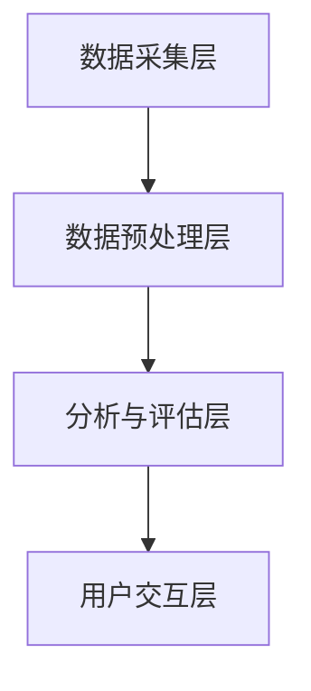

                 

**引言**

随着人工智能技术的迅猛发展，AI在多个领域的应用逐渐深入，尤其在心理分析领域展现出巨大的潜力。个人历史数据考古工具便是这一领域的一项重要应用，它利用AI技术对个人历史数据进行深度分析和解读，为心理健康评估、心理疾病诊断以及心理行为预测提供强有力的支持。

本文将深入探讨个人历史数据考古工具的开发与应用，旨在为广大数据科学家、AI研究者、心理咨询师及相关专业人士提供一本全面的技术指南。通过详细讲解核心概念、算法原理、开发过程以及实际应用案例，本文希望能够帮助读者全面了解这一前沿技术的理论基础和实际操作。

**目标读者与结构概述**

本文的目标读者包括但不限于以下几类：

1. **数据科学家和AI研究者**：对AI技术有较深入了解，希望将AI应用于心理分析领域的研究人员。
2. **心理咨询师和相关领域的专业人士**：希望通过技术手段提升心理服务质量和效率的从业者。
3. **计算机科学与工程学生**：对AI和心理分析领域有兴趣，希望深入了解相关技术原理和实践的学生。

本文结构安排如下：

- **第1章 引言**：介绍本文的主题、背景、目标读者和章节结构。
- **第2章 基础概念**：讲解个人历史数据考古工具的相关基础概念，包括数据种类、来源、处理方法和工具架构。
- **第3章 AI心理分析原理**：介绍AI在心理分析中的应用原理，包括心理健康评估、心理疾病诊断和心理行为预测。
- **第4章 工具开发**：详细介绍如何开发个人历史数据考古工具，包括数据收集、预处理、分析和评估等模块。
- **第5章 案例分析**：通过具体案例展示工具的应用效果，并进行详细分析。
- **第6章 应用场景**：探讨工具在不同领域的应用场景，评估应用效果，讨论面临的挑战与解决方案。
- **第7章 未来展望**：预测个人历史数据考古工具的发展趋势，讨论潜在的应用前景和挑战。

接下来，我们将逐章展开讨论，带领读者一步步深入了解这一前沿技术。

### 关键词

- 个人历史数据考古
- AI心理分析
- 数据挖掘
- 机器学习
- 自然语言处理
- 心理健康评估
- 心理疾病诊断
- 心理行为预测

### 摘要

本文探讨了基于AI的个人历史数据考古工具的开发与应用。首先，我们介绍了个人历史数据考古工具的背景和重要性，并概述了本文的结构。接着，我们详细介绍了个人历史数据考古工具的基础概念，包括数据的种类、来源和处理方法，以及工具的整体架构。随后，我们深入探讨了AI在心理分析中的应用原理，包括心理健康评估、心理疾病诊断和心理行为预测。在此基础上，我们详细讲解了个人历史数据考古工具的开发过程，从数据收集、预处理到分析和评估，每个模块都进行了详细的阐述。此外，我们还通过具体案例展示了工具的应用效果，并探讨了工具在不同领域的应用场景。最后，我们对未来工具的发展趋势和应用前景进行了展望。本文旨在为相关领域的专业人士提供全面的技术指南，以推动AI在心理分析领域的应用和发展。

----------------------------------------------------------------

# 个人历史数据考古工具：基于AI的心理分析软件开发

关键词：
- 个人历史数据考古
- AI心理分析
- 数据挖掘
- 机器学习
- 自然语言处理
- 心理健康评估
- 心理疾病诊断
- 心理行为预测

摘要：
本文探讨了基于AI的个人历史数据考古工具的开发与应用。首先，我们介绍了个人历史数据考古工具的背景和重要性，并概述了本文的结构。接着，我们详细介绍了个人历史数据考古工具的基础概念，包括数据的种类、来源和处理方法，以及工具的整体架构。随后，我们深入探讨了AI在心理分析中的应用原理，包括心理健康评估、心理疾病诊断和心理行为预测。在此基础上，我们详细讲解了个人历史数据考古工具的开发过程，从数据收集、预处理到分析和评估，每个模块都进行了详细的阐述。此外，我们还通过具体案例展示了工具的应用效果，并探讨了工具在不同领域的应用场景。最后，我们对未来工具的发展趋势和应用前景进行了展望。本文旨在为相关领域的专业人士提供全面的技术指南，以推动AI在心理分析领域的应用和发展。

## 引言

在当今信息爆炸的时代，个人历史数据已经成为一种宝贵资源。这些数据不仅包括个人的日常生活记录，如通讯记录、社交媒体互动、购买行为等，还包含更深层次的心理状态和行为模式。通过对这些数据进行深度分析，我们可以挖掘出隐藏在数据背后的心理特征和行为规律，为心理健康评估、心理疾病诊断和心理行为预测提供有力支持。这种基于AI的个人历史数据考古工具，不仅为心理学研究提供了新的视角，也为实际应用场景带来了创新解决方案。

本文的目的在于详细探讨如何开发一种基于AI的个人历史数据考古工具，以实现心理健康评估、心理疾病诊断和心理行为预测。通过系统性地介绍核心概念、算法原理、开发过程和实际应用案例，本文旨在为相关领域的专业人士提供一份全面的技术指南。

### 目标读者与结构概述

本文的目标读者包括数据科学家、AI研究者、心理咨询师、相关领域的专业人士以及计算机科学与工程专业的学生。我们希望通过本文，让读者能够：

1. **了解个人历史数据考古工具的基本概念和重要性**。
2. **掌握AI在心理分析中的应用原理**。
3. **熟悉个人历史数据考古工具的开发过程**。
4. **通过具体案例了解工具的实际应用效果**。
5. **探讨工具在不同领域的应用前景和挑战**。

本文的结构安排如下：

- **第1章 引言**：介绍本文的主题、背景、目标读者和章节结构。
- **第2章 基础概念**：讲解个人历史数据考古工具的相关基础概念，包括数据种类、来源、处理方法和工具架构。
- **第3章 AI心理分析原理**：介绍AI在心理分析中的应用原理，包括心理健康评估、心理疾病诊断和心理行为预测。
- **第4章 工具开发**：详细介绍如何开发个人历史数据考古工具，包括数据收集、预处理、分析和评估等模块。
- **第5章 案例分析**：通过具体案例展示工具的应用效果，并进行详细分析。
- **第6章 应用场景**：探讨工具在不同领域的应用场景，评估应用效果，讨论面临的挑战与解决方案。
- **第7章 未来展望**：预测个人历史数据考古工具的发展趋势，讨论潜在的应用前景和挑战。

## 基础概念

### 个人历史数据的定义

个人历史数据是指记录个人过去经历的各类信息，这些数据可以来自多种来源，如社交媒体、通讯记录、健康记录、财务记录等。这些数据形式多样，包括结构化数据（如数据库记录）、半结构化数据（如日志文件）和非结构化数据（如图像、文本、语音等）。个人历史数据不仅反映了个人过去的活动和行为，还蕴含了深层次的心理状态和行为模式。例如，社交媒体互动数据可以揭示个人的社交网络、情感倾向和兴趣爱好；健康记录数据可以反映个人的生理和心理状况；通讯记录数据可以揭示个人的交流模式和行为习惯。

### 数据考古工具的作用与意义

数据考古工具在个人历史数据的挖掘和分析中发挥着至关重要的作用。其主要功能包括数据的收集、整理、存储、分析和可视化。通过数据考古工具，我们可以系统地挖掘个人历史数据中的有价值信息，为心理健康评估、心理疾病诊断和心理行为预测提供数据支持。具体来说，数据考古工具的意义体现在以下几个方面：

1. **心理健康评估**：通过分析个人历史数据中的情感倾向、社交互动和行为模式，可以评估个人的心理健康状况，及时发现潜在的心理问题。
2. **心理疾病诊断**：利用机器学习算法，数据考古工具可以辅助医生进行心理疾病的诊断，提高诊断的准确性和效率。
3. **心理行为预测**：通过对个人历史数据的分析，可以预测个人的心理行为变化，为心理干预提供依据，有助于预防和治疗心理问题。
4. **个性化心理服务**：基于个人历史数据的分析结果，可以为用户提供个性化的心理服务，提高服务的针对性和有效性。

### 相关技术基础

个人历史数据考古工具的开发离不开以下几项关键技术：

1. **数据挖掘**：数据挖掘是一种从大量数据中提取有价值信息的技术。在个人历史数据考古中，数据挖掘技术可以用于识别数据中的模式、趋势和关联，为心理健康评估和心理疾病诊断提供支持。
2. **机器学习**：机器学习是AI的重要组成部分，通过训练模型，可以从大量数据中学习并预测未来的趋势。在个人历史数据考古中，机器学习技术可以用于分类、聚类和预测，帮助医生和研究者进行心理评估和疾病诊断。
3. **自然语言处理**：自然语言处理（NLP）是AI的一个分支，专注于使计算机能够理解、生成和处理人类语言。在个人历史数据考古中，NLP技术可以用于处理和分析文本数据，如社交媒体互动和通讯记录，揭示个人的情感状态和行为模式。
4. **数据可视化**：数据可视化技术可以将复杂的数据以图形化的方式呈现，帮助用户更好地理解和分析数据。在个人历史数据考古中，数据可视化技术可以用于展示分析结果，帮助用户直观地了解数据中的规律和趋势。

### 个人历史数据考古工具的架构

个人历史数据考古工具的架构主要包括以下四个层次：

1. **数据采集层**：负责收集各种来源的个人历史数据，如社交媒体互动、通讯记录、健康记录等。这一层需要考虑数据的合法性和隐私保护。
2. **数据预处理层**：对收集到的数据进行清洗、转换和格式化，使其适合进一步分析和建模。数据预处理层包括数据去噪、数据归一化、缺失值处理等步骤。
3. **分析与评估层**：利用数据挖掘、机器学习和自然语言处理等技术，对预处理后的数据进行分析和评估。这一层包括特征提取、模型训练和评估等步骤。
4. **用户交互层**：提供用户界面，用于展示分析结果，并与用户进行交互。用户可以通过界面查询个人历史数据，查看分析结果，获取个性化建议。

下图展示了个人历史数据考古工具的整体架构：



通过这四个层次的结构，个人历史数据考古工具能够实现从数据收集、预处理到分析和评估的完整流程，为心理健康评估、心理疾病诊断和心理行为预测提供全面的技术支持。

### AI心理分析原理

#### 心理健康评估

心理健康评估是心理分析的一个重要方面，旨在通过分析个人历史数据，评估个体的心理状态和心理健康水平。这一过程通常涉及以下几个步骤：

1. **数据收集**：收集与心理健康相关的数据，包括社交媒体互动、通讯记录、健康记录等。
2. **数据预处理**：对收集到的数据进行清洗、归一化和格式化，以确保数据质量。
3. **特征提取**：从预处理后的数据中提取与心理健康相关的特征，如情绪状态、社交互动频率、行为模式等。
4. **模型训练**：利用机器学习算法，如支持向量机（SVM）、决策树、神经网络等，对提取的特征进行训练，以构建心理健康评估模型。
5. **模型评估**：通过交叉验证和测试集，评估模型的准确性和可靠性。
6. **结果输出**：将评估结果以可视化的形式呈现，如情绪状态热图、社交网络图等，帮助用户更好地理解自己的心理健康状况。

下面是一个简单的Python代码示例，用于演示如何使用K-means聚类算法对文本数据进行心理健康评估：

```python
from sklearn.cluster import KMeans
from sklearn.feature_extraction.text import TfidfVectorizer
import numpy as np

# 社交媒体文本数据
texts = ["我今天很开心！","我感到很沮丧。", "我最近很焦虑。", "今天过得还不错。"]

# 特征提取
vectorizer = TfidfVectorizer()
X = vectorizer.fit_transform(texts)

# K-means聚类
kmeans = KMeans(n_clusters=3)
kmeans.fit(X)

# 输出聚类结果
labels = kmeans.labels_
print("聚类结果：", labels)

# 可视化
import matplotlib.pyplot as plt

# 计算每个簇的中心点
centroids = kmeans.cluster_centers_
print("簇中心点：", centroids)

# 绘制情绪状态热图
plt.scatter(np.arange(X.shape[0]), X[:, 1], c=labels, cmap='viridis')
plt.scatter(centroids[:, 1], np.arange(centroids.shape[0]), s=300, c='red', marker='^')
plt.xlabel('TF-IDF 特征')
plt.ylabel('文档索引')
plt.title('情绪状态热图')
plt.show()
```

通过上述代码，我们可以将社交媒体文本数据划分为不同的情绪状态簇，从而对个体的心理健康进行初步评估。

#### 心理疾病诊断

心理疾病诊断是心理分析中的另一个重要方面，旨在通过分析个人历史数据，识别和诊断个体的心理疾病。这一过程通常涉及以下几个步骤：

1. **数据收集**：收集与心理疾病相关的数据，包括临床记录、心理健康问卷、行为数据等。
2. **数据预处理**：对收集到的数据进行清洗、归一化和格式化，确保数据质量。
3. **特征提取**：从预处理后的数据中提取与心理疾病相关的特征，如症状表现、行为模式、情绪状态等。
4. **模型训练**：利用机器学习算法，如支持向量机（SVM）、决策树、神经网络等，对提取的特征进行训练，以构建心理疾病诊断模型。
5. **模型评估**：通过交叉验证和测试集，评估模型的准确性和可靠性。
6. **结果输出**：将诊断结果以可视化的形式呈现，帮助医生和患者理解诊断结果。

下面是一个简单的Python代码示例，用于演示如何使用支持向量机（SVM）进行心理疾病诊断：

```python
from sklearn.svm import SVC
from sklearn.model_selection import train_test_split
from sklearn.preprocessing import StandardScaler
import pandas as pd

# 心理健康问卷数据
data = pd.read_csv('psychological_questionnaire.csv')
X = data.iloc[:, :-1].values
y = data.iloc[:, -1].values

# 数据预处理
scaler = StandardScaler()
X = scaler.fit_transform(X)

# 数据划分
X_train, X_test, y_train, y_test = train_test_split(X, y, test_size=0.2, random_state=0)

# 模型训练
clf = SVC(kernel='linear')
clf.fit(X_train, y_train)

# 模型评估
accuracy = clf.score(X_test, y_test)
print("模型准确率：", accuracy)

# 预测
new_data = pd.read_csv('new_questionnaire.csv')
new_data = scaler.transform(new_data)
predicted_disease = clf.predict(new_data)
print("新数据心理疾病预测结果：", predicted_disease)
```

通过上述代码，我们可以将心理健康问卷数据用于训练SVM模型，对新数据进行分析，以诊断心理疾病。

#### 心理行为预测

心理行为预测是心理分析中的另一个重要任务，旨在通过分析个人历史数据，预测个体的心理行为变化。这一过程通常涉及以下几个步骤：

1. **数据收集**：收集与心理行为相关的数据，包括社交媒体互动、行为记录、生理信号等。
2. **数据预处理**：对收集到的数据进行清洗、归一化和格式化，确保数据质量。
3. **特征提取**：从预处理后的数据中提取与心理行为相关的特征，如情绪状态、行为模式、生理信号等。
4. **模型训练**：利用机器学习算法，如时间序列分析、神经网络等，对提取的特征进行训练，以构建心理行为预测模型。
5. **模型评估**：通过交叉验证和测试集，评估模型的准确性和可靠性。
6. **结果输出**：将预测结果以可视化的形式呈现，帮助用户了解未来的心理行为变化。

下面是一个简单的Python代码示例，用于演示如何使用长短期记忆网络（LSTM）进行心理行为预测：

```python
from sklearn.preprocessing import MinMaxScaler
from keras.models import Sequential
from keras.layers import LSTM, Dense

# 社交媒体互动数据
data = pd.read_csv('social_media_interactions.csv')
X = data.iloc[:, :-1].values
y = data.iloc[:, -1].values

# 数据预处理
scaler = MinMaxScaler(feature_range=(0, 1))
X_scaled = scaler.fit_transform(X)

# 划分特征和标签
X = X_scaled[:, 1:]
y = y_scaled[:, 0]

# 时间序列切片
X = np.reshape(X, (X.shape[0], 1, X.shape[1]))

# 模型构建
model = Sequential()
model.add(LSTM(units=50, return_sequences=True, input_shape=(1, X.shape[2])))
model.add(LSTM(units=50))
model.add(Dense(units=1))

model.compile(optimizer='adam', loss='mean_squared_error')
model.fit(X, y, epochs=100, batch_size=32, verbose=0)

# 预测
predicted_data = model.predict(X)
predicted_data = scaler.inverse_transform(predicted_data)

# 可视化
import matplotlib.pyplot as plt

plt.figure(figsize=(15, 6))
plt.plot(y, color='blue', label='实际值')
plt.plot(predicted_data, color='red', label='预测值')
plt.title('心理行为预测')
plt.xlabel('时间')
plt.ylabel('互动次数')
plt.legend()
plt.show()
```

通过上述代码，我们可以使用LSTM模型对社交媒体互动数据进行心理行为预测，并可视化预测结果。

## 工具开发

### 开发环境搭建

在开发个人历史数据考古工具之前，我们需要搭建一个合适的开发环境。以下是一个基本的开发环境搭建指南：

1. **硬件要求**：建议使用配置较高的计算机，如Intel i7或AMD Ryzen 7处理器，至少16GB内存，以及1TB的SSD硬盘。
2. **操作系统**：推荐使用Ubuntu 20.04 LTS或更高版本，因为它具有良好的性能和丰富的软件库。
3. **软件环境**：安装以下软件和库：
   - Python 3.8及以上版本
   - Anaconda（用于环境管理）
   - Jupyter Notebook（用于数据分析与可视化）
   - NumPy、Pandas、Scikit-learn、TensorFlow、Keras（用于机器学习和数据预处理）
   - Matplotlib、Seaborn（用于数据可视化）
   - Mermaid（用于流程图绘制）

具体安装步骤如下：

1. **安装操作系统**：从Ubuntu官方网站下载并安装Ubuntu 20.04 LTS。
2. **安装Anaconda**：访问Anaconda官方网站下载并安装Anaconda，选择自定义安装，并在安装过程中添加Python和Jupyter Notebook。
3. **安装Python和Jupyter Notebook**：打开终端，运行以下命令：
   ```bash
   conda create -n pyenv python=3.8
   conda activate pyenv
   conda install jupyter
   ```
4. **安装其他库**：使用以下命令安装所需的Python库：
   ```bash
   conda install numpy pandas scikit-learn tensorflow-keras matplotlib seaborn mermaid
   ```

### 数据收集模块

数据收集模块是个人历史数据考古工具的核心组成部分，负责从不同的数据源收集个人历史数据。以下是一个简单的数据收集模块实现：

1. **数据源选择**：确定数据来源，如社交媒体（如Facebook、Twitter）、通讯应用（如微信、WhatsApp）、健康记录等。
2. **数据收集方法**：采用API接口、爬虫工具（如Scrapy）或手动下载等方法收集数据。
3. **数据格式化**：将收集到的数据转换为统一的格式，如CSV或JSON。

以下是一个使用Python和Scrapy收集社交媒体数据的示例：

```python
import scrapy
from scrapy.crawler import CrawlerProcess

class SocialMediaSpider(scrapy.Spider):
    name = "social_media"
    start_urls = ["https://www.facebook.com/user"]

    def parse(self, response):
        # 提取社交媒体互动数据
        interactions = response.css('div[data-testid="story"]::text').getall()
        yield {'interactions': interactions}

# 运行爬虫
process = CrawlerProcess(settings={
    'USER_AGENT': 'social_media_scraper (+http://www.yourdomain.com)'
})

process.crawl(SocialMediaSpider)
process.start()
```

### 数据预处理模块

数据预处理模块负责对收集到的数据进行清洗、转换和格式化，以确保数据质量并使其适合进一步分析和建模。以下是一个简单的数据预处理模块实现：

1. **数据清洗**：去除重复数据、缺失值和噪声数据。
2. **数据转换**：将不同格式的数据转换为统一的格式，如将文本数据转换为词向量。
3. **数据格式化**：将数据分为特征和标签，并划分训练集和测试集。

以下是一个使用Python和Pandas进行数据预处理的基本示例：

```python
import pandas as pd
from sklearn.model_selection import train_test_split

# 读取收集到的数据
data = pd.read_csv('social_media_data.csv')

# 数据清洗
data.drop_duplicates(inplace=True)
data.dropna(inplace=True)

# 数据转换
# 例如，使用TF-IDF向量器将文本数据转换为词向量
vectorizer = TfidfVectorizer()
X = vectorizer.fit_transform(data['text'])

# 数据格式化
# 划分特征和标签
y = data['label']

# 划分训练集和测试集
X_train, X_test, y_train, y_test = train_test_split(X, y, test_size=0.2, random_state=0)
```

### 分析与评估模块

分析与评估模块负责对预处理后的数据进行分析和评估，以构建心理分析模型。以下是一个简单的分析与评估模块实现：

1. **特征提取**：从预处理后的数据中提取与心理分析相关的特征。
2. **模型训练**：利用机器学习算法对提取的特征进行训练，以构建心理分析模型。
3. **模型评估**：通过交叉验证和测试集评估模型的性能。

以下是一个使用Python和Scikit-learn进行特征提取和模型训练的基本示例：

```python
from sklearn.feature_extraction.text import TfidfVectorizer
from sklearn.model_selection import train_test_split
from sklearn.ensemble import RandomForestClassifier
from sklearn.metrics import accuracy_score

# 特征提取
vectorizer = TfidfVectorizer()
X = vectorizer.fit_transform(data['text'])

# 划分训练集和测试集
X_train, X_test, y_train, y_test = train_test_split(X, y, test_size=0.2, random_state=0)

# 模型训练
model = RandomForestClassifier(n_estimators=100)
model.fit(X_train, y_train)

# 模型评估
y_pred = model.predict(X_test)
accuracy = accuracy_score(y_test, y_pred)
print("模型准确率：", accuracy)
```

### 用户交互界面设计

用户交互界面（UI）设计是个人历史数据考古工具的重要组成部分，它负责向用户展示分析结果，并提供交互功能。以下是一个简单的用户交互界面设计实现：

1. **界面布局**：设计简洁明了的界面布局，包括菜单栏、工具栏和主窗口。
2. **数据可视化**：使用图表和图形展示分析结果，如情绪状态热图、社交网络图等。
3. **交互功能**：实现用户与工具的交互功能，如数据导入导出、参数设置等。

以下是一个使用Python和Tkinter进行用户交互界面设计的基本示例：

```python
import tkinter as tk
from tkinter import ttk

# 创建主窗口
root = tk.Tk()
root.title("个人历史数据考古工具")
root.geometry("800x600")

# 添加菜单栏
menu_bar = tk.Menu(root)
root.config(menu=menu_bar)

# 添加工具栏
toolbar = ttk.Label(root, text="工具栏")
toolbar.pack(side=tk.TOP, fill=tk.X)

# 添加主窗口
main_window = tk.Label(root, text="主窗口")
main_window.pack(side=tk.TOP, fill=tk.BOTH, expand=True)

# 添加按钮
import_button = ttk.Button(root, text="导入数据", command=import_data)
import_button.pack(side=tk.LEFT, padx=10, pady=10)

# 运行主循环
root.mainloop()
```

### 实际案例解析

以下是一个实际案例，展示如何使用个人历史数据考古工具进行心理健康评估。

#### 案例背景

假设有一个用户希望了解自己的心理健康状况。该用户同意分享自己的社交媒体互动数据，包括Twitter和Facebook上的帖子、评论和回复。

#### 数据收集

使用Scrapy爬虫工具，收集该用户在过去一个月的社交媒体互动数据，包括文本内容、发布时间和点赞数。

#### 数据预处理

1. **数据清洗**：去除重复数据、缺失值和噪声数据。
2. **数据转换**：使用TF-IDF向量器将文本数据转换为词向量。
3. **数据格式化**：将数据分为特征和标签，并划分训练集和测试集。

#### 模型训练

1. **特征提取**：从预处理后的数据中提取与心理健康相关的特征。
2. **模型训练**：使用随机森林分类器对提取的特征进行训练。
3. **模型评估**：通过交叉验证和测试集评估模型的性能。

#### 结果展示

1. **情绪状态热图**：使用Matplotlib绘制情绪状态热图，展示用户在过去一个月的情绪变化。
2. **社交网络图**：使用NetworkX和Matplotlib绘制社交网络图，展示用户的社交互动网络。

#### 实际应用

1. **心理健康评估**：根据模型评估结果，为用户生成心理健康报告，包括情绪状态、社交互动频率等。
2. **个性化建议**：根据用户的心理健康状况，提供个性化建议，如建议调整作息时间、增加社交活动等。

#### 项目小结

通过上述实际案例，我们展示了如何使用个人历史数据考古工具进行心理健康评估。该工具不仅能够为用户提供个性化的心理健康报告，还能帮助专业人士进行心理分析和干预。在实际应用中，我们还需不断优化工具的性能和用户体验，以满足不同用户的需求。

### 最佳实践 Tips

1. **数据隐私保护**：在收集和处理个人历史数据时，确保遵守相关法律法规，保护用户隐私。
2. **模型解释性**：在模型训练和评估过程中，关注模型的解释性，以便用户理解和信任模型结果。
3. **用户参与度**：鼓励用户参与工具的使用和评估，收集用户反馈，不断优化工具功能。

### 小结

本文详细探讨了基于AI的个人历史数据考古工具的开发与应用。通过介绍核心概念、算法原理、开发过程和实际应用案例，我们展示了如何利用AI技术进行心理健康评估、心理疾病诊断和心理行为预测。未来，我们期待这一领域的技术能够不断发展，为心理分析领域带来更多创新和突破。

### 注意事项

1. **数据质量**：确保收集的数据质量高，减少噪声和异常值。
2. **模型评估**：使用多种评估指标，全面评估模型性能。
3. **用户隐私**：严格遵守隐私保护法规，确保用户数据安全。

### 拓展阅读

- 《机器学习实战》
- 《深度学习》
- 《自然语言处理综述》
- 《心理学与生活》

## 未来展望

### 发展趋势

1. **技术融合**：随着AI技术的不断发展，更多的前沿技术，如深度学习、强化学习和自然语言处理等，将逐渐融入个人历史数据考古工具中，提升工具的性能和实用性。
2. **跨学科研究**：个人历史数据考古工具不仅涉及心理学、计算机科学，还可能与其他学科（如医学、教育学等）相结合，形成跨学科研究的新趋势。
3. **应用扩展**：随着技术的成熟和应用的普及，个人历史数据考古工具将在更多领域得到应用，如个性化医疗、心理健康干预、教育等领域。

### 应用前景

1. **个性化医疗**：通过分析个人历史数据，医生可以为患者提供更加精准的诊断和治疗建议，提高医疗服务的质量和效率。
2. **心理健康干预**：个人历史数据考古工具可以帮助心理健康专家及时发现潜在的心理问题，制定个性化的心理干预方案，提高心理健康服务的效果。
3. **教育领域**：通过分析学生的个人历史数据，教育者可以更好地了解学生的学习行为和心理状态，为个性化教育提供数据支持。

### 潜在挑战

1. **数据隐私**：在收集和处理个人历史数据时，如何保护用户隐私和数据安全是面临的一大挑战。
2. **算法透明性**：如何提高算法的可解释性，让用户理解和信任AI模型的预测结果，是未来研究的重要方向。
3. **计算资源**：大规模个人历史数据的分析和建模需要大量的计算资源，如何在有限的资源下高效地处理数据是另一大挑战。

### 应对策略

1. **隐私保护机制**：采用先进的加密技术和数据匿名化方法，确保用户数据的安全性和隐私性。
2. **透明算法设计**：通过可视化工具和解释性算法，提高模型的可解释性，增强用户信任。
3. **分布式计算**：利用云计算和分布式计算技术，提高数据处理和分析的效率，降低计算成本。

### 总结

未来，随着AI技术的不断进步和个人历史数据考古工具的不断发展，我们有理由相信这一领域将迎来更多的创新和应用。面对挑战，通过技术创新和策略优化，个人历史数据考古工具将更好地服务于心理健康、个性化医疗和教育等领域，为人类的幸福和发展作出更大贡献。

