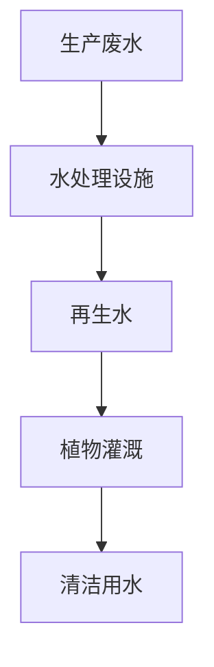
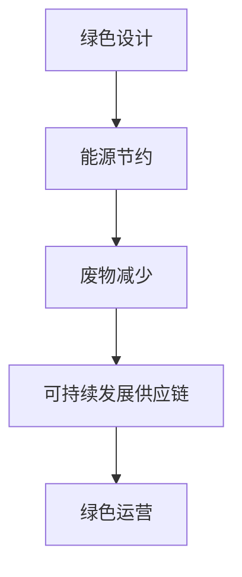
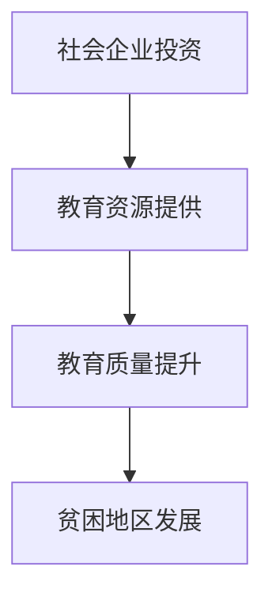
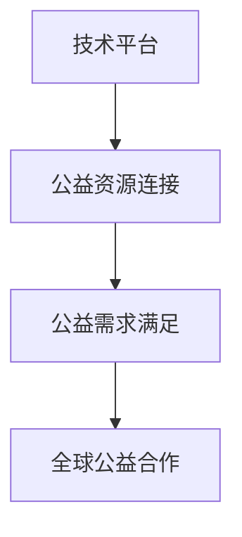

                 

### 引言

在当今社会，个人影响力与社会责任这两个概念日益成为讨论的焦点。个人影响力，即个人在特定领域或群体中的影响能力，不仅关系到个人的职业发展，也深刻影响着社会的进步。而社会责任，则是个人或组织对社会的责任和义务，是社会运行和发展的基础。现代公民在拥有个人影响力的同时，也承担着重要的社会责任。这两者之间的关系错综复杂，需要深入探讨和平衡。

本文旨在系统地分析个人影响力与社会责任的本质及其在现代公民身份中的重要性，探讨个人如何在提升个人影响力的同时，有效地履行社会责任。文章将分为三个主要部分：

首先，我们将详细探讨个人影响力的概念、评估方法和提升策略。这部分内容将帮助读者理解个人影响力的重要性，掌握评估和提升个人影响力的方法和技巧。

接着，文章将介绍社会责任的基本理念、实践路径，并分析社会责任在现代社会中的重要性。这部分内容旨在帮助读者理解社会责任的内涵，了解如何在实际生活中践行社会责任。

最后，我们将探讨现代公民的双重身份，即如何在拥有个人影响力的同时，履行社会责任。这部分内容将结合实际案例，分析现代公民如何平衡个人影响力与社会责任，以及未来社会对个人影响力与社会责任的需求和发展趋势。

通过本文的阅读，读者将能够全面理解个人影响力与社会责任的本质，掌握提升个人影响力、履行社会责任的方法，以及如何在现代公民身份中找到平衡点。这不仅对个人的职业发展有重要意义，也对社会的进步和和谐具有深远的影响。

### 个人影响力

个人影响力，指的是个人在特定领域或群体中，通过言语、行为、观念等途径对他人的态度、信念和行为产生的影响能力。它不仅体现在个人与他人的互动中，也体现在个人在社会中的地位和作用上。个人影响力是一个多维度的概念，包括认知影响力、情感影响力、行为影响力等。认知影响力是指个人在知识和信息传播方面的能力；情感影响力是指个人在情感和情绪引导方面的作用；行为影响力则是指个人在行为规范和决策中的影响力。

个人影响力的构成要素可以从以下几个方面来理解：

1. **知识储备与专业能力**：个人的知识储备和专业能力是构成其影响力的基础。一个在某个领域有深厚知识和丰富经验的人，更容易在讨论中发表有见地的观点，从而获得他人的尊重和信任。

2. **沟通技巧与表达能力**：良好的沟通技巧和表达能力能够帮助个人更有效地传达信息，建立良好的关系网络，从而增强其影响力。

3. **人格特质与道德修养**：一个具有高尚人格特质和良好道德修养的个人，往往能够赢得他人的信任和尊重，这是其影响力的来源之一。

4. **社会关系与网络**：个人的社会关系和网络是其影响力的传播渠道。一个广泛而深厚的社会关系网络能够帮助个人更快地传播信息和观点，扩大其影响力。

5. **情感共鸣与感染力**：能够与听众产生情感共鸣，激发听众的情感和行动，是增强个人影响力的关键。

个人影响力的影响因素有很多，主要包括以下几点：

1. **信息传播渠道**：随着社交媒体和互联网的发展，信息传播的渠道变得更加多样和快速，这为个人影响力的扩展提供了新的平台。

2. **社会环境与文化背景**：不同的社会环境和文化背景会影响个人影响力的表现和效果。例如，在开放和包容的社会环境中，个人更容易通过创新和独特性来获得影响力。

3. **个人动机与目标**：个人动机和目标会直接影响其影响力的方向和强度。一个有明确目标并致力于实现目标的人，往往能够在较短的时间内建立和扩大其影响力。

4. **他人的心理与行为**：个人的影响力受到他人心理和行为的影响。例如，他人的信任、尊重和认同是个人影响力的重要来源。

个人影响力的重要性不可忽视，它不仅对个人的职业发展有重要影响，也对社会的进步和和谐起到关键作用。以下是一些个人影响力在现实生活中的具体表现：

1. **领导力**：在组织或团队中，具有强大个人影响力的人往往能够成为领导者，因为他们能够有效地引导和激励团队成员。

2. **创新与变革**：个人影响力能够推动社会创新和变革。一个有影响力的个人可以通过传播新的思想、理念和技术，促进社会的进步。

3. **社会动员**：个人影响力可以在社会动员和公益活动中发挥作用。通过个人的影响力，可以动员更多人参与到社会公益活动中，共同推动社会的和谐与进步。

4. **公共舆论引导**：在公共舆论中，具有个人影响力的人可以通过发表意见、提出建议，引导公众舆论的方向，对社会事件产生重要影响。

总的来说，个人影响力是一个复杂而多维度的概念，它不仅反映了个人在特定领域或群体中的地位和作用，也体现了个人在社会中的责任和影响力。理解和掌握个人影响力的构成要素和影响因素，对于个人和社会的发展都具有重要的意义。

### 个人影响力的评估方法

评估个人影响力是一个复杂而细致的过程，它不仅需要考虑多个维度，还需要运用多种方法来综合评价。以下是几种常用的评估方法，包括定量和定性评估工具，以及每种方法的应用场景和具体步骤。

#### 1. **定量评估方法**

**1.1 问卷调查**

问卷调查是一种常用的定量评估方法，可以通过设计问卷来收集受调查者对某一特定个人影响力的评价。以下是问卷调查的步骤：

1. **确定评估目标**：明确需要评估的个人影响力方面，如专业知识、沟通能力、领导力等。
2. **设计问卷**：根据评估目标，设计包含多个问题的问卷，确保问题具有针对性和有效性。
3. **收集数据**：通过在线或线下方式，向相关群体发放问卷，收集数据。
4. **数据整理与分析**：将收集到的数据进行整理和统计，运用相关分析工具（如SPSS、Excel等）进行数据分析。
5. **结果输出**：根据分析结果，输出个人影响力的评估报告。

**1.2 关键事件法**

关键事件法是一种通过分析个人在特定事件中的表现来评估其影响力的方法。以下是关键事件法的步骤：

1. **确定关键事件**：选择对个人影响力具有显著影响的关键事件。
2. **收集信息**：收集与关键事件相关的信息，包括事件背景、个人表现、他人反馈等。
3. **评估影响**：根据信息评估个人在关键事件中的影响力，可以从多个维度进行评价，如决策能力、团队协作等。
4. **总结与反馈**：总结评估结果，并给予个人反馈，帮助其了解自身的影响力表现。

#### 2. **定性评估方法**

**2.1 专家评估**

专家评估是通过邀请行业专家或相关领域的专业人士对个人影响力进行评价的方法。以下是专家评估的步骤：

1. **选择评估专家**：根据评估目标和需求，选择具备专业知识和经验丰富的评估专家。
2. **制定评估标准**：明确评估标准，确保评估的客观性和公正性。
3. **进行评估**：专家根据评估标准和收集到的信息，对个人影响力进行评价。
4. **结果反馈**：将评估结果反馈给个人，并提供改进建议。

**2.2 深度访谈**

深度访谈是一种通过与个人进行深入对话来评估其影响力方法。以下是深度访谈的步骤：

1. **确定访谈对象**：根据评估目标，确定需要访谈的个人。
2. **设计访谈提纲**：根据评估目标，设计包含关键问题的访谈提纲。
3. **进行访谈**：与访谈对象进行深入对话，收集其对个人影响力的认知和评价。
4. **分析结果**：对访谈内容进行整理和分析，提取关键信息和观点。
5. **结果反馈**：将分析结果反馈给个人，并提供改进建议。

#### 3. **综合评估方法**

综合评估方法是将定量和定性评估方法相结合，以更全面和准确的方式评估个人影响力。以下是综合评估方法的步骤：

1. **确定评估维度**：明确需要评估的个人影响力方面，如专业知识、沟通能力、领导力等。
2. **选择评估工具**：根据评估维度，选择合适的定量和定性评估工具。
3. **进行评估**：运用评估工具进行个人影响力评估，包括问卷调查、关键事件法、专家评估、深度访谈等。
4. **数据整合**：将定量和定性评估结果进行整合，形成综合评估报告。
5. **结果反馈**：将综合评估结果反馈给个人，并提供改进建议。

通过上述方法，可以全面评估个人影响力，帮助个人了解自身的影响力表现，发现优势和不足，从而有针对性地提升个人影响力。在评估过程中，需要注意方法的科学性、客观性和全面性，确保评估结果的准确性和有效性。

### 个人影响力的提升策略

提升个人影响力是每个现代公民都需要关注的重要课题。通过有效的策略和技巧，个人不仅可以在职业和社交场合中脱颖而出，还能在社会变革中发挥更大的作用。以下是一些关键策略，帮助个人在多个维度上提升其影响力。

#### 1. 自我认知与个人品牌的构建

**自我认知**是提升个人影响力的第一步。只有清楚自己的优势、劣势、价值观和目标，才能有针对性地提升自己。以下是构建个人品牌的几个关键步骤：

- **明确个人定位**：确定自己在特定领域中的专业定位，是专家、顾问还是意见领袖。
- **建立专业形象**：通过专业知识和经验积累，树立自己在行业内的专业形象。
- **塑造个人故事**：通过讲述自己的成长故事和专业经历，建立个人品牌的故事线。
- **持续更新知识**：定期学习新知识、掌握新技能，保持自己在行业内的领先地位。

#### 2. 人际关系与沟通技巧的修炼

**人际关系**和**沟通技巧**是个人影响力的重要组成部分。以下是一些建议，帮助个人在这些方面提升自己：

- **建立广泛的社交网络**：通过参加行业会议、社交活动等方式，结识更多的同行和专家，扩大自己的社交圈子。
- **培养同理心**：理解他人的需求和感受，提高沟通的情商。
- **积极倾听**：倾听他人意见，给予反馈，展现尊重和理解。
- **清晰表达**：提高语言表达的逻辑性和条理性，确保信息传达的准确性。
- **有效沟通**：通过多种沟通方式，如面对面交流、电子邮件、电话等，选择最合适的方式与对方沟通。

#### 3. 知识积累与技能提升

**知识积累**和**技能提升**是个人影响力的核心。以下是一些建议，帮助个人在这些方面持续进步：

- **学习新知识**：通过阅读专业书籍、参加在线课程、听行业讲座等方式，不断更新自己的知识库。
- **实践技能**：将理论知识应用于实际工作中，通过实践提升技能水平。
- **掌握多种技能**：不仅要在专业领域内精通，还要掌握其他相关技能，如项目管理、团队协作等，以提高综合能力。
- **参与项目**：通过参与不同类型的项目，积累实践经验，提升自己的解决实际问题的能力。

#### 4. 情感共鸣与感染力

**情感共鸣**和**感染力**是增强个人影响力的关键。以下是一些建议，帮助个人在这些方面提升：

- **建立情感联系**：与听众建立情感联系，通过分享自己的情感体验和故事，引发听众的情感共鸣。
- **展示真诚**：在沟通和互动中，展示真诚和诚意，赢得他人的信任和尊重。
- **激励他人**：通过积极的态度和鼓舞人心的言辞，激励他人采取行动，实现共同目标。
- **培养演讲技巧**：通过参加演讲培训，提高自己的演讲技巧，增强感染力。

#### 5. 利用社交媒体和数字工具

**社交媒体**和**数字工具**为个人影响力的提升提供了新的平台和工具。以下是一些建议，帮助个人利用这些工具：

- **建立专业社交媒体账号**：在LinkedIn、Twitter、微信公众号等平台上，建立专业账号，发布有价值的见解和内容。
- **定期更新内容**：保持社交媒体账号的活跃度，定期发布高质量的内容，提升自己的影响力。
- **互动与参与**：积极参与行业讨论，回复评论，与其他专业人士互动，扩大自己的影响力。
- **利用数据分析**：通过分析社交媒体的数据，了解自己的受众，优化内容策略，提高影响力。

#### 6. 积极参与社会活动和公益事业

**参与社会活动和公益事业**是提升个人影响力的有效途径。以下是一些建议：

- **参与志愿者活动**：通过参与志愿者活动，贡献自己的时间和精力，提升个人形象和社会地位。
- **捐款捐物**：通过捐款捐物，支持公益事业，展现自己的社会责任感。
- **发起和参与项目**：发起和参与公益活动项目，借助自己的影响力，推动社会变革。

通过以上策略和技巧，个人可以在多个维度上提升其影响力，不仅在职业生涯中取得成功，还能在社会变革中发挥更大的作用。重要的是，个人需要在提升影响力的过程中，始终坚持真诚、诚信和责任感，这样才能赢得他人的信任和尊重，实现长期的影响力积累。

### 个人影响力在职场中的应用

个人影响力在职场中具有至关重要的作用，它不仅关系到个人的职业发展，还影响着整个团队和组织的工作效率和氛围。以下是个人影响力在职场中的应用，以及如何有效运用这些影响力来提升职业发展和团队绩效的具体策略。

#### 1. **职业晋升**

**职业晋升**是个人在职场发展的重要目标之一，而个人影响力在其中起到了关键作用。以下是一些策略：

- **建立专业形象**：通过持续学习和专业知识的积累，树立自己在行业内的专业形象，赢得他人的尊重和信任。
- **展现领导力**：通过在团队中发挥领导作用，展现自己的决策能力、团队协作能力和沟通能力，提升领导力，从而增加晋升的机会。
- **积极表现**：在日常工作中，通过积极参与项目和提出建设性意见，展现自己的专业素养和责任心。

**案例**：一位项目经理通过在项目中多次成功解决问题，赢得了同事和上级的信任，最终得到了晋升的机会。

#### 2. **团队协作**

**团队协作**是现代职场中不可或缺的一部分，而个人影响力在促进团队协作中起到了桥梁作用。以下是一些策略：

- **建立信任**：通过真诚和透明的沟通，建立与团队成员之间的信任关系，促进团队协作。
- **倾听和尊重**：在团队讨论中，积极倾听他人的意见，尊重团队每个成员的观点，增强团队的凝聚力。
- **激发潜力**：发现并发挥团队成员的潜力，鼓励他们参与项目，共同完成任务。

**案例**：一个团队领导通过倾听和尊重团队成员的意见，成功激发了一个新员工的潜力，使她在项目中发挥了重要作用，团队也因此取得了显著成绩。

#### 3. **项目推进**

在**项目推进**中，个人影响力能够显著影响项目的进度和质量。以下是一些策略：

- **明确目标和计划**：在项目启动时，通过有效的沟通，明确项目目标和计划，确保团队成员对项目的方向和目标有清晰的认识。
- **协调资源**：利用个人影响力，协调团队内外部的资源，确保项目所需的资源和支持能够及时到位。
- **应对挑战**：在面对项目挑战时，通过个人影响力，动员团队成员共同应对，寻找解决方案，确保项目顺利进行。

**案例**：在一个复杂项目中，项目负责人通过个人影响力，协调了多个部门和团队的合作，解决了项目中的难题，确保了项目的按时完成。

#### 4. **冲突管理**

**冲突管理**是职场中常见的问题，个人影响力在冲突管理中起到了缓解和解决冲突的关键作用。以下是一些策略：

- **公正处理**：在处理冲突时，保持公正和客观，不偏袒任何一方，以事实和证据为基础进行判断。
- **沟通与调解**：通过有效沟通，了解冲突双方的立场和需求，寻找双方都能接受的解决方案，调解冲突。
- **建立共识**：通过沟通和协商，帮助冲突双方建立共识，确保冲突不会对团队和工作造成负面影响。

**案例**：一位部门经理通过有效的沟通和调解，成功解决了部门内部的一个长期冲突，恢复了团队的和谐与工作效率。

#### 5. **职业发展建议**

为了在职场中有效运用个人影响力，以下是一些建议：

- **持续学习**：不断提升自己的知识和技能，保持对行业动态的敏感度，以增强自己的专业影响力。
- **建立广泛人脉**：通过参加各种职场活动，结识更多的同行和专家，建立广泛的人脉网络。
- **树立榜样**：通过自己的言行树立良好的榜样，赢得他人的尊重和信任。
- **勇于承担责任**：在团队中勇于承担责任，通过实际行动赢得团队的信任和认可。

通过上述策略和建议，个人可以在职场中有效地运用个人影响力，提升职业发展，促进团队协作，实现项目目标，并在冲突管理中发挥关键作用。

### 个人影响力在社交媒体的运用

随着社交媒体的迅猛发展，个人影响力在社交媒体上的运用变得日益重要。在LinkedIn、Twitter、微信公众号等平台上，个人可以通过有效的策略和内容，提升自己的影响力，扩大自己的社交圈子，实现职业和社交目标。以下是一些关键策略和技巧：

#### 1. **建立专业社交媒体账号**

在LinkedIn、Twitter、微信公众号等社交媒体平台上，建立专业账号是第一步。这些账号不仅展示了个人的专业形象，也是传递信息和建立联系的重要渠道。

- **内容规划**：制定一个长期的内容规划，包括发布频率、内容主题和目标受众。确保内容有价值、有深度，并能引起读者的兴趣。
- **个性化设计**：使用个性化的头像和封面图片，展示自己的专业领域和个人风格。
- **完善个人信息**：填写详细的个人资料，包括工作经验、教育背景、专业技能等，让他人更好地了解自己。

#### 2. **定期更新内容**

在社交媒体上保持活跃度是提升个人影响力的关键。以下是一些更新内容的策略：

- **发布高质量内容**：发布有深度、有见解的专业文章、行业分析、技术分享等，展示自己的专业知识和思考能力。
- **定期发布**：制定一个定期发布的时间表，确保内容有规律地更新，形成固定的读者群体。
- **互动与回应**：及时回应读者的评论和私信，建立良好的互动关系，增强读者的参与感和忠诚度。

#### 3. **互动与参与**

在社交媒体上，积极参与行业讨论和互动，能够提升个人影响力，扩大社交网络。以下是一些建议：

- **评论与点赞**：在他人发布的内容下进行有建设性的评论，展示自己的见解和观点，获得更多的关注和点赞。
- **参与话题**：关注并参与行业热点话题的讨论，通过发表自己的观点，吸引更多关注。
- **组织活动**：发起线上或线下的活动，如行业研讨会、技术分享会等，吸引行业人士参与，提升个人影响力。

#### 4. **利用社交媒体工具**

社交媒体平台提供了多种工具和功能，帮助个人提升影响力。以下是一些常用的工具：

- **LinkedIn脉脉功能**：利用LinkedIn的脉脉功能，主动与行业内的专业人士建立联系，扩展人脉网络。
- **Twitter趋势话题**：关注Twitter上的热门话题，参与讨论，提升自己在社交媒体上的曝光度。
- **微信公众号运营**：通过微信公众号的运营，发布高质量的内容，利用推送、图文消息、视频等多种形式，提升内容传播效果。

#### 5. **数据分析与优化**

通过分析社交媒体的数据，了解内容的传播效果、读者反馈和互动情况，能够帮助个人不断优化内容策略，提升影响力。

- **分析阅读量与互动数据**：了解哪些类型的内容最受欢迎，哪些时间段发布内容效果最佳，根据数据调整内容策略。
- **用户画像**：通过分析读者的特征和偏好，更好地定位目标受众，提供更有针对性的内容。
- **反馈与改进**：根据读者的反馈，不断改进内容质量和发布策略，提升读者的满意度和忠诚度。

#### 6. **案例研究**

**案例**：一位技术工程师通过在LinkedIn上定期发布技术文章和分享行业见解，吸引了大量同行业人士的关注。他的文章不仅观点独到，而且深入浅出，获得了读者的广泛赞誉。通过积极参与行业讨论和互动，他逐渐在LinkedIn上建立了强大的影响力，不仅赢得了行业内的尊重，还获得了多家知名企业的关注和邀请。

通过以上策略和技巧，个人可以在社交媒体上有效提升自己的影响力，扩大社交网络，实现职业和社交目标。重要的是，保持真诚和诚信，持续提供高质量的内容，与读者建立信任和互动关系，这样才能在社交媒体上取得长期的成效。

### 社会责任的基本理念

社会责任，是指个人或组织对社会应尽的义务和责任，旨在促进社会的可持续发展、和谐与进步。社会责任不仅是企业的一种商业策略，也是现代公民应具备的基本素养。理解社会责任的基本理念，是个人在生活和工作中履行社会责任的基础。

#### 1. **社会责任的定义与意义**

社会责任通常指的是组织或个人为了促进社会福祉和可持续发展，所承担的超出商业目的的义务和责任。其定义涵盖了以下几个方面：

- **商业利益之外**：社会责任超越了纯粹的商业利益，关注社会整体的福祉，包括环境保护、员工福利、公益事业等。
- **道德义务**：社会责任体现了道德义务和伦理责任，企业和社会成员应当遵守社会规范，尊重道德伦理。
- **可持续性**：社会责任关注长期的社会可持续性，不仅仅是解决当前问题，而是通过持续的努力，预防未来的问题。

社会责任的意义在于，它能够促进社会的和谐与进步，增强企业的社会形象和声誉，提升员工的满意度和忠诚度，从而实现多方共赢。

#### 2. **社会责任的来源与表现形式**

社会责任的来源可以追溯到多个方面：

- **法律和法规**：许多国家和地区都制定了相关法律和法规，要求企业履行社会责任，如环保法、劳动法、消费者保护法等。
- **道德规范**：社会责任体现了道德伦理的要求，企业和社会成员应当基于道德原则，自觉履行社会责任。
- **社会压力**：公众和利益相关者的期望和压力也是推动企业履行社会责任的重要因素。

社会责任的表现形式多种多样，主要包括：

- **企业社会责任（CSR）**：企业通过捐款、公益项目、环保活动等方式，履行对社会的责任。
- **员工福利**：提供良好的工作环境、职业发展机会、培训和晋升机会，关注员工身心健康和权益。
- **环境保护**：减少污染、节约资源、保护生态环境，实现绿色发展。
- **公益事业**：参与和支持公益事业，如教育、医疗、扶贫等，为社会弱势群体提供帮助。

#### 3. **社会责任的伦理思考**

社会责任不仅仅是法律和商业的要求，更涉及到伦理层面的思考。以下是一些主要的伦理思考：

- **公平与正义**：社会责任要求企业和社会成员在行动中秉持公平与正义的原则，确保资源的合理分配和社会的公平性。
- **尊重与关怀**：企业和社会成员应当尊重他人的权益，关心社会弱势群体的福祉，体现人道主义精神。
- **诚信与透明**：社会责任要求企业和社会成员保持诚信，公开透明地履行社会责任，增强社会信任。
- **长期利益**：社会责任强调企业的长期利益，通过负责任的行为，实现企业和社会的可持续发展。

总之，社会责任的基本理念是现代公民和企业不可或缺的重要组成部分。理解社会责任的定义、来源和表现形式，以及进行伦理思考，是个人和企业在履行社会责任过程中应遵循的基本原则。通过积极履行社会责任，个人和企业不仅能够赢得社会的尊重和信任，还能为社会的和谐与进步作出贡献。

### 社会责任的实践路径

履行社会责任不仅是企业的一项基本义务，也是每个现代公民应当积极践行的道德责任。以下将详细探讨社会责任在企业社会责任（CSR）、个人生活、公共政策支持等方面的实践路径，并分析实际案例，以展示社会责任在现代社会中的重要性和有效性。

#### 1. **企业社会责任（CSR）的实践**

企业社会责任（CSR）是指企业在其商业活动之外，对社会和环境所承担的责任。以下是一些常见的CSR实践路径：

**1.1 环境保护**

环境保护是CSR的核心内容之一。企业可以通过以下方式履行环境保护责任：

- **减少污染**：通过技术创新和管理优化，减少生产过程中的废气、废水排放，降低环境污染。
- **资源节约**：推行绿色生产，减少资源消耗，如采用节能设备、循环利用资源等。
- **绿色供应链**：要求供应商采取环保措施，确保整个供应链的环保性。

**案例**：宜家（IKEA）是全球知名的家具零售商，其通过推广可回收材料和环保设计，致力于减少对环境的影响。宜家还建立了“宜家基金会”，用于支持全球环保项目，如植树造林和保护生物多样性。

**1.2 员工福利**

关注员工福利是企业社会责任的重要方面。以下是一些具体做法：

- **平等就业机会**：提供公平的就业机会，消除性别、种族、年龄等歧视。
- **职业发展**：为员工提供职业培训、晋升机会，帮助员工实现职业成长。
- **工作环境**：提供安全、舒适、健康的工作环境，关注员工身心健康。

**案例**：微软（Microsoft）作为全球知名的技术公司，积极履行员工福利责任。微软提供灵活的工作时间、远程办公选择，以及各种健康福利计划，如年度体检、健身房会员等，以提高员工的工作满意度和生活质量。

**1.3 公益事业**

企业可以通过参与公益事业，回馈社会，推动社会进步。以下是一些常见做法：

- **捐款捐物**：为教育、医疗、扶贫等公益事业捐款捐物。
- **公益项目**：与企业或非营利组织合作，开展公益项目，如扶贫项目、环保项目等。
- **员工志愿服务**：鼓励员工参与志愿服务，通过企业平台，组织员工参与社区服务、慈善活动等。

**案例**：阿里巴巴（Alibaba）通过“阿里巴巴公益基金”，积极参与社会公益事业。阿里巴巴不仅捐款捐物，还发起“阿里巴巴公益平台”，通过互联网技术，连接更多的公益资源和需求，推动公益事业的发展。

#### 2. **社会责任在个人生活中的实践**

个人在社会中扮演着多重角色，无论是在家庭、职场还是社区，每个人都可以通过以下方式履行社会责任：

**2.1 家庭责任**

在家庭中，个人可以通过以下方式履行社会责任：

- **家庭教育**：关注孩子的教育，提供良好的成长环境，培养有责任感和道德观念的孩子。
- **关爱家人**：关注家人的身心健康，提供情感支持和关爱，营造和谐的家庭氛围。
- **家庭节能减排**：在日常生活中，注重节能减排，如使用节能灯泡、垃圾分类等，减少对环境的影响。

**2.2 职场责任**

在职场中，个人可以通过以下方式履行社会责任：

- **职业道德**：遵守职业道德规范，诚实守信，不损害他人利益。
- **团队协作**：积极参与团队工作，发挥个人专长，与同事共同完成任务。
- **创新与改进**：在工作中提出建设性意见，推动企业和行业的发展。

**2.3 社区责任**

在社区中，个人可以通过以下方式履行社会责任：

- **志愿服务**：参与社区志愿服务，如环保活动、社区清洁等，为社区发展贡献力量。
- **公益捐赠**：捐赠资金或物资，支持社区公益事业。
- **社区互动**：积极参与社区活动，建立良好的人际关系，促进社区的和谐与进步。

**案例**：一位职场人士通过参与公司的志愿者项目，定期到当地的养老院进行志愿服务。他不仅为老人们带去了关爱和温暖，也用自己的行动激励了更多的同事参与到公益活动中，共同为社会贡献力量。

#### 3. **社会责任的公共政策支持**

公共政策支持是履行社会责任的重要保障。以下是一些关键措施：

- **法律法规**：制定和完善相关法律法规，确保企业和个人履行社会责任。
- **政策激励**：通过税收减免、补贴等政策激励，鼓励企业和个人积极参与公益事业。
- **政府监管**：加强政府对企业和个人履行社会责任的监管，确保社会责任的落实。

**案例**：中国政府通过“社会责任报告制度”，要求企业定期发布社会责任报告，披露企业在环境保护、员工福利、公益事业等方面的表现。这一制度不仅提高了企业的社会责任意识，也增强了社会对企业的监督。

总之，社会责任的实践路径多种多样，从企业社会责任（CSR）到个人生活中的履行，再到公共政策的支持，每个方面都体现了社会责任在现代社会中的重要性和必要性。通过实际行动，个人和企业都可以为社会的发展和进步做出积极贡献，实现多方共赢。

### 社会责任的案例分析

在社会责任领域，有许多成功的案例展示了企业、个人和非营利组织如何通过创新和努力，履行社会责任，产生深远的社会影响。以下是几个具有代表性的社会责任案例，通过详细讲解这些案例，我们可以更好地理解社会责任实践中的挑战、解决方案及其对社会发展的促进作用。

#### 1. **案例一：可口可乐的“水再生”计划**

**背景介绍**：可口可乐是全球知名的饮料公司，其业务涉及广泛，包括生产、分销和营销。然而，可口可乐在运营过程中面临着水资源管理的挑战。为了解决这一问题，可口可乐在多个国家和地区实施了“水再生”计划。

**核心概念与联系**：该计划的核心概念是通过循环利用水资源，减少对自然水源的依赖，同时提升水资源的使用效率。可口可乐与当地政府和环保组织合作，建立了水再生设施，将生产过程中产生的废水进行处理，再利用于植物灌溉和清洁等非饮用水用途。

**Mermaid 流程图**：

**解决方案**：可口可乐在实施“水再生”计划时，面临的主要挑战是技术成本高和公众接受度低。为了克服这些挑战，可口可乐采用了以下策略：

- **技术创新**：引入先进的废水处理技术，提高水资源的再利用效率。
- **公众教育**：通过宣传活动，提高公众对水资源再利用的认识和接受度。
- **政策支持**：积极与当地政府和环保组织合作，争取政策支持和资金援助。

**效果与影响**：通过“水再生”计划，可口可乐显著减少了生产过程中对自然水源的依赖，提高了水资源的使用效率。同时，该计划也提高了公众对水资源管理的认识，促进了社区环保意识的提升。

#### 2. **案例二：麦当劳的“绿色餐厅”项目**

**背景介绍**：麦当劳是全球最大的餐饮连锁企业之一，其门店遍布全球。随着环保意识的提升，麦当劳开始关注其业务对环境的影响，并推出了“绿色餐厅”项目。

**核心概念与联系**：该项目的核心概念是通过减少能源消耗、减少废物产生和推广可持续发展理念，实现餐厅的绿色运营。麦当劳在餐厅的设计、运营和供应链管理等方面，全面推行绿色实践。

**Mermaid 流程图**：

**解决方案**：麦当劳在实施“绿色餐厅”项目时，面临的主要挑战是成本控制和供应链调整。为了克服这些挑战，麦当劳采取了以下策略：

- **设计优化**：采用节能设计，如使用LED照明、节能空调等，降低能源消耗。
- **废物管理**：推行废物分类、回收利用，减少废物产生。
- **供应链管理**：与供应商合作，推广环保材料和使用可持续资源。

**效果与影响**：通过“绿色餐厅”项目，麦当劳显著降低了门店的能源消耗和废物产生，提高了环保形象。同时，该项目也推动了供应链的绿色化，促进了整个行业的可持续发展。

#### 3. **案例三：印度塔塔集团的社会企业项目**

**背景介绍**：塔塔集团是印度最大的企业集团之一，其业务涉及多个领域，包括钢铁、汽车、通讯等。为了履行社会责任，塔塔集团在其社会企业项目中，重点关注教育和扶贫。

**核心概念与联系**：该项目的核心概念是通过投资教育和社会企业，提升贫困地区居民的生活质量和教育水平。塔塔集团在社会企业中引入现代化的教学设施和资源，提供免费或低收费的教育服务。

**Mermaid 流程图**：

**解决方案**：塔塔集团在实施社会企业项目时，面临的主要挑战是资金短缺和地区差异。为了克服这些挑战，塔塔集团采取了以下策略：

- **多元化融资**：通过政府补贴、企业捐赠、贷款等多种途径，筹集资金。
- **本地化运营**：根据当地实际情况，调整教育内容和教学方法，提高项目的适应性。

**效果与影响**：通过社会企业项目，塔塔集团显著提升了贫困地区的教育水平和生活质量。该项目不仅为当地居民提供了高质量的教育服务，还促进了社区的经济发展和社会稳定。

#### 4. **案例四：微软的“公益平台”项目**

**背景介绍**：微软是全球领先的技术公司，其业务涵盖了计算机软件、硬件和服务。为了履行社会责任，微软推出了“公益平台”项目，旨在通过技术手段，促进全球公益事业的发展。

**核心概念与联系**：该项目的核心概念是通过互联网技术，连接全球的公益资源和需求，提供一个便捷的公益平台。微软利用其技术优势，开发了多个公益应用，如在线捐款平台、公益信息发布系统等。

**Mermaid 流程图**：

**解决方案**：微软在实施“公益平台”项目时，面临的主要挑战是技术实现和公众参与。为了克服这些挑战，微软采取了以下策略：

- **技术优化**：通过不断优化技术平台，提升系统的稳定性和用户体验。
- **公众教育**：通过宣传活动，提高公众对公益事业的关注度和参与度。

**效果与影响**：通过“公益平台”项目，微软显著提高了全球公益资源的利用效率，促进了全球公益事业的发展。该项目不仅帮助了更多的贫困人群，也提升了公众对技术的认知和接受度。

### 总结

以上案例展示了社会责任在实践中的多样性和复杂性。通过技术创新、多元化融资和公众教育等手段，企业和社会组织可以在实践中克服各种挑战，实现社会责任的目标。这些案例不仅对社会发展产生了深远影响，也为其他企业和组织提供了有益的借鉴。

总之，社会责任不仅是企业的一项基本义务，也是每个现代公民应具备的道德责任。通过积极履行社会责任，个人和企业不仅能够赢得社会的尊重和信任，还能为社会的和谐与进步作出重要贡献。在未来，随着社会和技术的不断发展，社会责任实践将变得更加重要和多样化，需要我们共同努力，不断创新和实践。

### 现代公民的身份认知

现代公民的身份认知是理解个人影响力与社会责任关系的基础。现代公民不仅是一个国家的合法成员，更是一个积极参与社会事务、履行社会责任的个体。现代公民身份的特征包括以下几个方面：

#### 1. **权利与义务**

现代公民享有一定的权利，如言论自由、选举权、受教育权等。与此同时，公民也承担相应的义务，如遵守法律、纳税、参与公共事务等。权利与义务相辅相成，构成了现代公民身份的核心内容。

#### 2. **参与社会事务**

现代公民积极参与社会事务，通过投票、参与社区服务、加入非营利组织等方式，影响社会政策和社会发展。这种积极参与不仅体现了公民的社会责任感，也是个人影响力在社会层面发挥作用的重要途径。

#### 3. **全球化视野**

在全球化的背景下，现代公民拥有更广阔的视野和更高的国际认知。现代公民不仅关注本国事务，也关心全球性问题，如气候变化、人权保护、贫困消除等。这种全球化视野使得个人影响力能够在更广泛的范围内发挥作用。

#### 4. **持续学习与进步**

现代公民强调持续学习和个人成长，不断提升自身的知识水平和专业技能，以更好地适应社会发展的需求。通过不断学习，现代公民不仅能够提升个人影响力，还能为社会的进步做出更大贡献。

#### 5. **道德责任与伦理观念**

现代公民具备强烈的道德责任感和伦理观念，重视公平、正义、诚信等价值观。这种道德责任不仅体现在个人行为中，也体现在对社会责任的履行上。

总之，现代公民的身份认知不仅涉及个人权利和义务，更涵盖了参与社会事务、全球化视野、持续学习与进步以及道德责任等方面。理解这些特征，有助于我们更好地理解个人影响力与社会责任之间的关系，找到平衡点，实现个人与社会的和谐发展。

### 个人影响力与社会责任的互动关系

个人影响力与社会责任之间的关系是复杂而微妙的，两者相互依存、相互影响。个人影响力不仅可以推动社会责任的实现，同时社会责任的履行也能增强个人影响力。以下将详细探讨个人影响力与社会责任之间的互动关系，分析个人如何在社会责任实践中增强自身影响力，并探讨这种关系在不同社会环境中的表现和作用。

#### 1. **个人影响力促进社会责任的实现**

个人影响力可以在多个层面促进社会责任的实现：

- **传播公益理念**：具有强大个人影响力的个体可以通过演讲、社交媒体、出版物等途径，传播公益理念，提高公众对社会问题的关注度和参与度。例如，某位知名企业家通过社交媒体发布关于环保的见解和行动，激励更多人参与到环保活动中。

- **动员资源**：个人影响力还可以帮助动员社会资源，包括资金、物资和人脉，为公益项目提供支持。例如，一位知名演员参与慈善活动，不仅能够吸引媒体关注，还能为慈善机构筹集到大量捐款。

- **推动社会变革**：个人影响力可以推动社会变革，通过倡导和推动社会政策的制定和实施，解决社会问题。例如，某位知名环保人士通过持续倡导，促使政府出台了更严格的环保法规。

#### 2. **社会责任的履行增强个人影响力**

社会责任的履行不仅能提升个人形象和社会地位，还能增强个人影响力。以下是一些具体的例子：

- **建立专业形象**：通过积极参与公益事业，个人可以在专业领域内树立良好的形象，增强他人的信任和尊重。例如，某位医生通过参与医疗公益项目，展现了自己的专业素养和道德责任感，赢得了更多患者的信任。

- **提升公众认可**：社会责任的履行能够提升个人的公众认可度，增强个人在社会中的影响力。例如，一位企业高管通过积极参与社会公益活动，不仅提高了企业的社会形象，也增强了自身在行业内的地位和影响力。

- **建立社交网络**：社会责任的履行可以帮助个人建立更广泛的社交网络，扩大影响力。例如，通过参与公益活动，个人可以结识更多的同行业人士和社会领袖，建立有价值的合作关系。

#### 3. **不同社会环境下的互动关系表现和作用**

个人影响力与社会责任之间的关系在不同社会环境下有着不同的表现和作用：

- **在开放社会中**：在开放和自由的社会环境中，个人更容易通过社交媒体和其他平台传播自己的观点和行动，从而提升个人影响力。同时，开放的社会环境也鼓励更多人参与社会责任实践，增强个人影响力与社会责任之间的互动。

- **在传统社会中**：在传统和保守的社会环境中，个人影响力可能受到更多的限制，但社会责任的履行仍然具有重要意义。通过积极参与社区服务和公益项目，个人可以在传统社会中建立良好的人际关系和社会地位，从而间接提升个人影响力。

- **在动荡社会中**：在动荡和不确定的社会环境中，个人影响力和社会责任之间的互动关系可能面临更大的挑战。但正是在这种环境下，个人影响力和社会责任的履行显得尤为重要。通过积极参与社会事务，个人可以稳定社会情绪，推动社会变革，增强个人影响力。

总之，个人影响力与社会责任之间的关系是相互促进、相互依赖的。个人影响力可以推动社会责任的实现，而社会责任的履行又能增强个人影响力。在不同社会环境中，这种关系的表现和作用有所不同，但核心在于通过积极参与社会事务和履行社会责任，个人可以提升自身的地位和影响力，同时为社会的发展和进步作出积极贡献。

### 现代公民如何在个人影响力与社会责任之间找到平衡

在现代社会的复杂背景下，现代公民需要在个人影响力与社会责任之间找到平衡，以实现个人成长和社会进步的双重目标。以下是一些实用的建议和策略，帮助现代公民有效地平衡个人影响力与社会责任。

#### 1. **明确个人定位和目标**

首先，现代公民需要明确自身的个人定位和目标。了解自己的专业领域、优势和特长，有助于确定个人在社会责任实践中的角色和贡献。通过明确个人定位，可以更有效地利用个人影响力，专注于对自己和社会最有益的领域。

**建议**：定期进行个人反思和职业规划，确保个人目标与社会责任目标相一致。

#### 2. **制定平衡的策略和计划**

为了在个人影响力与社会责任之间找到平衡，现代公民需要制定具体的策略和计划。以下是一些建议：

- **时间管理**：合理安排时间，确保有足够的时间用于个人影响力提升和社会责任实践。例如，可以制定每周或每月的时间表，设定特定时间用于参与社会责任活动。

- **优先级排序**：根据个人目标和实际情况，确定个人影响力提升和社会责任实践的重要性和优先级。优先处理对社会影响最大的任务，同时确保个人目标的实现。

- **资源整合**：有效整合个人资源，包括时间、知识和人脉，确保在提升个人影响力的同时，也能为社会责任实践提供有力支持。

#### 3. **积极参与社会公益活动**

参与社会公益活动是提升个人影响力、履行社会责任的有效途径。以下是一些具体建议：

- **多渠道参与**：通过线上线下多种途径参与公益活动，如志愿服务、捐赠、公益项目等。

- **发挥专业特长**：利用个人专业知识和技能，为公益活动提供支持。例如，医生可以参与医疗援助，工程师可以参与社区建设项目。

- **建立合作关系**：与社会组织、企业和政府合作，共同推动社会公益项目的实施。

#### 4. **提升个人影响力，促进社会责任的实现**

在提升个人影响力的过程中，现代公民应注重以下几点：

- **内容质量**：在社交媒体和公共平台上发布高质量的内容，展示自己的专业见解和实际行动，增强个人影响力。

- **公众互动**：积极参与公众互动，倾听他人意见，回应评论和反馈，建立良好的互动关系，扩大个人影响力。

- **跨界合作**：与其他领域专业人士合作，通过跨界合作，提升个人影响力的覆盖面和影响力。

#### 5. **持续学习和自我提升**

为了在个人影响力与社会责任之间找到平衡，现代公民需要持续学习和自我提升：

- **终身学习**：通过学习新知识、掌握新技能，不断提升个人专业素养和综合能力。

- **参与培训**：参加专业培训和研讨会，与行业专家和同行交流，拓展视野和知识面。

- **反思与调整**：定期反思个人影响力提升和社会责任实践的成效，根据反馈进行调整和优化。

#### 6. **树立正确的价值观**

在平衡个人影响力与社会责任的过程中，现代公民需要树立正确的价值观：

- **诚信与责任**：始终坚持诚信和责任感，以正直和负责任的态度对待个人影响力和社会责任。

- **公平与公正**：在行动中秉持公平和公正的原则，确保个人影响力和社会责任实践不偏袒任何一方。

- **持续进步**：保持积极进取的心态，不断追求个人和社会的进步。

通过以上策略和行动，现代公民可以有效地在个人影响力与社会责任之间找到平衡，实现个人成长和社会进步的双重目标。这不仅对个人职业发展有重要意义，也对社会的和谐与进步具有深远的影响。

### 个人影响力与社会责任的未来展望

随着社会的不断进步和技术的飞速发展，个人影响力与社会责任之间的关系也在不断演变。未来，随着新兴技术的应用和社会结构的变迁，个人影响力和社会责任的内涵、形式和作用都将发生显著变化，对现代公民提出了新的挑战和机遇。

#### 1. **人工智能与大数据的影响**

人工智能（AI）和大数据技术的广泛应用，将对个人影响力与社会责任产生深远影响。一方面，AI技术可以帮助个人更精准地分析社会问题，提供数据驱动的解决方案，从而增强个人影响力。另一方面，大数据技术可以追踪和分析个人的行为和影响力，促进社会责任的落实。

- **提升影响力**：AI可以帮助个人分析社会趋势、需求，制定更有效的影响力提升策略。例如，通过分析社交媒体数据，个人可以发现潜在的目标受众，制定更精准的内容策略。
- **履行社会责任**：大数据技术可以监控和评估个人影响力的实际效果，帮助个人更好地履行社会责任。例如，通过监测公益活动的影响范围和效果，个人可以及时调整行动策略，提高社会责任的履行效率。

#### 2. **社交媒体的持续发展**

社交媒体的持续发展将继续扩大个人影响力的传播渠道，同时也为个人履行社会责任提供了新的平台。未来，社交媒体将更加智能化、个性化，个人可以通过更加多样化的方式，提升自身影响力。

- **智能化互动**：随着AI技术的发展，社交媒体将提供更加智能的互动功能，如智能聊天机器人、个性化推荐等，帮助个人更有效地与受众互动，增强影响力。
- **多样化内容形式**：未来，视频、直播、虚拟现实等多样化内容形式将更加普及，个人可以通过这些形式，更生动地传达自己的观点和行动，提升影响力。

#### 3. **全球化和数字化背景下的社会责任**

全球化进程和数字化时代，使得个人影响力和社会责任的边界更加模糊。未来，个人需要在更广泛的范围内履行社会责任，关注全球性问题。

- **全球视角**：全球化要求个人具备全球视角，关注气候变化、贫困消除、人权保护等全球性问题，通过跨国合作，共同解决这些挑战。
- **数字化责任**：在数字化时代，个人需要承担新的责任，如数据隐私保护、网络安全等。通过积极参与数字化治理，个人可以促进社会的公平和可持续发展。

#### 4. **可持续发展目标（SDGs）的影响**

联合国制定的可持续发展目标（SDGs）为全球社会提供了共同的行动指南。未来，个人将在实现这些目标中发挥更加重要的作用。

- **目标驱动**：SDGs为个人提供了明确的目标和方向，通过参与实现这些目标，个人可以更具体地履行社会责任，提升个人影响力。
- **创新驱动**：SDGs鼓励创新和创业，个人可以通过创新项目，实现社会责任目标，同时提升个人影响力。

#### 5. **未来社会对个人影响力与社会责任的需求

未来社会对个人影响力和社会责任的需求将更加多元化和高要求：

- **专业知识与技能**：随着社会复杂性的增加，个人需要具备更广泛的专业知识和技能，以应对各种社会挑战。
- **跨领域能力**：个人需要具备跨领域的知识和能力，能够整合不同领域的资源，解决复杂的社会问题。
- **持续学习与进步**：未来社会要求个人具备持续学习和进步的能力，不断提升自身的影响力和社会责任感。

总之，未来个人影响力与社会责任之间的关系将在新兴技术的推动下，变得更加紧密和复杂。现代公民需要在不断变化的社会环境中，积极适应和创新，通过提升个人影响力，更好地履行社会责任，实现个人与社会的共同进步。

### 结论

通过本文的探讨，我们系统地分析了个人影响力与社会责任之间的关系及其在现代公民身份中的重要性。个人影响力不仅影响着个人的职业发展和社会地位，也是推动社会进步和变革的重要力量。而社会责任则是现代公民应尽的基本义务，关系到社会的和谐与可持续发展。

本文首先阐述了个人影响力的概念、构成要素和评估方法，并提出了提升个人影响力的策略。接着，我们探讨了社会责任的基本理念、实践路径及其在现代社会中的重要性。随后，通过实际案例，展示了个人影响力在职场和社会责任实践中的具体应用。此外，我们还分析了现代公民如何在社会责任实践中找到个人影响力与社会责任之间的平衡。

未来，随着新兴技术的应用和社会结构的变迁，个人影响力与社会责任的关系将更加复杂和多样化。现代公民需要在不断变化的社会环境中，积极提升自身的影响力和履行社会责任。具体建议包括：明确个人定位和目标，制定平衡的策略和计划，积极参与社会公益活动，提升个人影响力，并持续学习和自我提升。

通过有效平衡个人影响力与社会责任，现代公民不仅能够实现个人成长，还能为社会的和谐与进步作出重要贡献。让我们共同努力，成为有影响力、有责任感的现代公民，推动社会向着更加美好和可持续的未来发展。

### 作者信息

**作者：AI天才研究院（AI Genius Institute） & 禅与计算机程序设计艺术（Zen And The Art of Computer Programming）**

AI天才研究院致力于推动人工智能领域的研究与应用，为全球人工智能产业的发展贡献力量。研究院汇集了一批国际顶尖的人工智能专家，在机器学习、深度学习、自然语言处理等领域取得了卓越的成果。研究院的主要目标是培养具有创新精神和实战能力的人工智能专业人才，推动人工智能技术的普及和应用。

禅与计算机程序设计艺术是一本深受计算机科学界推崇的经典著作，由著名计算机科学家唐纳德·克努特（Donald E. Knuth）所著。该书以“编程是一门艺术”为核心理念，通过深刻的哲学思考和精妙的编程实例，展示了计算机程序设计的本质和艺术性。该书不仅为程序员提供了丰富的编程技巧和理论知识，也激发了无数人对计算机科学的热爱和追求。通过结合禅宗哲学，克努特倡导程序员在编程过程中注重内心的平静和专注，追求简洁、优雅和高效的编程风格。

本文旨在探讨个人影响力与社会责任的关系，结合AI技术和计算机科学的理论与实践，为现代公民提供有价值的思考和建议。希望通过本文的分享，能够激发更多人对个人影响力和社会责任的关注，共同推动社会的进步与和谐。

