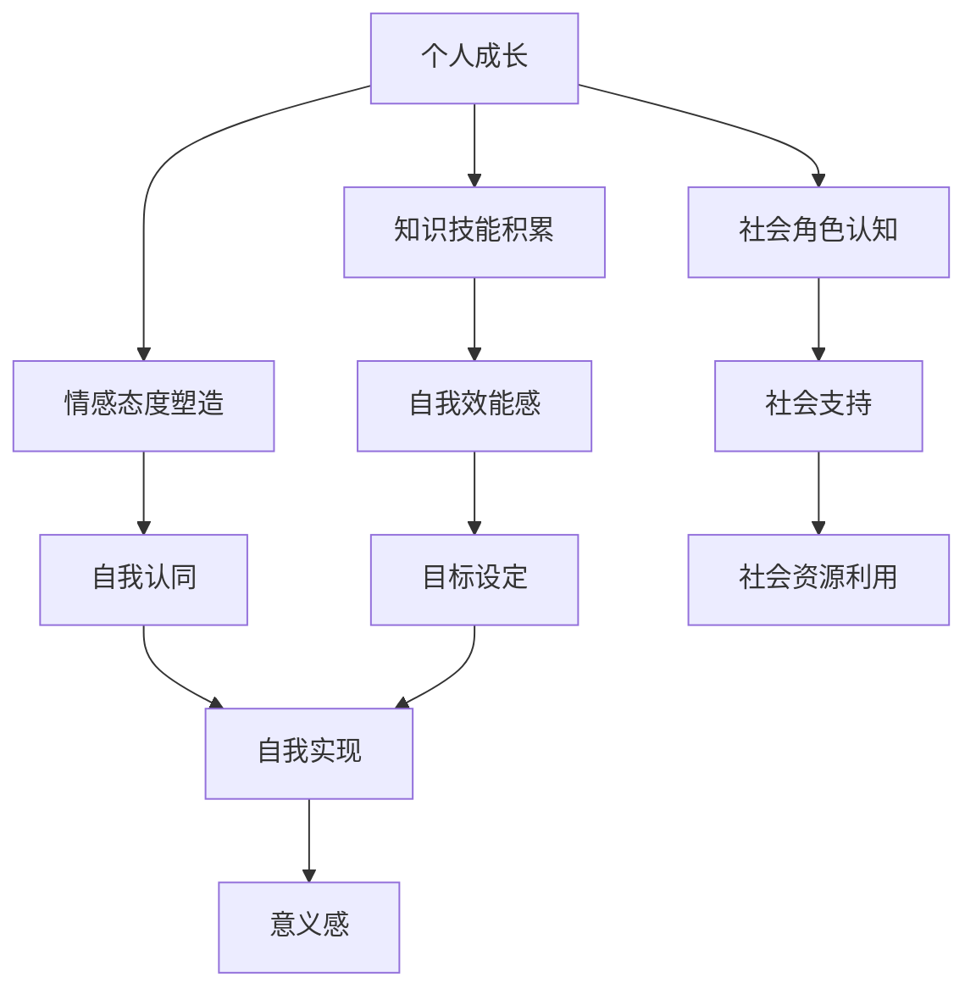

                 

### 引言

在当今这个快速发展的信息时代，个人成长与意义感成为人们关注的焦点。随着人工智能、大数据、云计算等技术的迅猛发展，人们面临的竞争压力日益增大，如何在这个竞争激烈的环境中实现自我成长、找到生命的意义，成为每一个人都必须思考的问题。本书《个人成长与意义感：自我实现的现代途径》旨在探讨个人成长与意义感的关系，提出自我实现的现代途径。

#### 背景介绍

个人成长是指个体在生理、心理、社会等多个层面上的发展过程。这个过程不仅包括知识和技能的积累，还涉及情感、态度和价值观的塑造。意义感则是指个体在生活中感受到的内在意义和价值。两者紧密相关，共同构成了自我实现的基础。

自我实现是一个长期而复杂的过程，它不仅需要个体在知识、技能和情感等方面的全面发展，还需要个体在生活中找到属于自己的价值和意义。这一过程不仅关系到个人的幸福感和成就感，还影响到社会的和谐与进步。

#### 核心概念与联系

为了更好地理解个人成长与意义感的关系，我们可以通过Mermaid流程图来展示核心概念之间的关系。



从这个流程图中，我们可以看出，个人成长包括知识技能积累、情感态度塑造和社会角色认知三个方面。这些方面共同作用，促进个体的自我效能感、自我认同和社会支持。而自我效能感、自我认同和社会支持又进一步推动个体设定目标、实现自我实现，最终形成意义感。

#### 核心概念解释

- **个人成长**：指个体在知识、技能、情感和社会角色等方面的全面发展。
- **意义感**：指个体在生活中感受到的内在意义和价值。
- **自我实现**：指个体通过不断成长，实现自己的潜能，达到自我价值实现的过程。

### 自我实现的重要性

自我实现是人类追求的最高境界之一。它不仅能够带来个人的幸福感和成就感，还能促进社会的和谐与进步。以下是自我实现的一些重要性：

1. **幸福感**：自我实现能够满足个体的心理需求，提升个体的幸福感。
2. **成就感**：通过自我实现，个体能够体验到成就感，从而增强自信心。
3. **社会贡献**：自我实现使得个体能够充分发挥自己的潜能，为社会做出贡献。
4. **个人成长**：自我实现是个人成长的高级阶段，它推动个体在各个层面上的全面发展。
5. **意义感**：自我实现使个体在生活中找到意义，从而增强生命的价值感。

### 结论

个人成长与意义感是自我实现的重要组成部分。理解并应用这些概念，可以帮助我们更好地实现自我，找到生活的意义。本书将详细探讨这些概念，提供实用的方法和策略，帮助读者实现个人成长与意义感。

```markdown
关键词：个人成长，意义感，自我实现，心理学，哲学，社会学

摘要：本文介绍了个人成长与意义感的概念，分析了两者之间的关系，探讨了自我实现的重要性。通过Mermaid流程图展示了核心概念之间的关系，并详细解释了核心概念。文章旨在为读者提供关于个人成长与意义感的深入理解和实用方法。
```

---

### 第1章 引言

#### 1.1 个人成长的概念

个人成长是一个多维度的过程，它不仅包括知识和技能的积累，还涉及情感、态度和价值观的塑造。在技术领域，个人成长可以被理解为不断提升自身的技术能力，同时保持对新技术的好奇心和求知欲。具体来说，个人成长包括以下几个方面：

1. **知识技能积累**：通过学习新的编程语言、算法和数据结构，提升自己在软件开发和系统设计方面的能力。
2. **情感态度塑造**：保持积极的心态，对待失败和挑战持开放和乐观的态度，从而在面对技术难题时能够保持冷静和专注。
3. **社会角色认知**：理解自己在团队中的角色和责任，提升团队协作和沟通能力，从而更好地实现个人与团队的共同目标。

在技术领域，个人成长的过程可以被视为一种自我迭代的过程，类似于软件开发中的版本迭代。每一次的技术学习和提升都可以看作是对自身代码的“重构”，使其更加高效、可靠和易于维护。

#### 1.2 意义感的理解

意义感是指个体在生活中感受到的内在意义和价值。在技术领域，意义感可以表现为以下几点：

1. **技术贡献**：通过解决实际问题和开发创新技术，为社会做出贡献，从而感受到自己的工作是有价值的。
2. **团队协作**：在团队中发挥自己的专业技能，与他人协作，共同实现项目目标，从而获得团队认可和成就感。
3. **个人成长**：不断学习新技术，提升自身能力，从而实现自我价值的提升。

在技术工作中，寻找意义感是非常重要的。它不仅能提升工作满意度，还能激发个人的创造力和潜能。例如，一个软件工程师通过开发一个高效的算法，解决了用户长期以来遇到的问题，这种成就感就是他工作的意义感所在。

#### 1.3 自我实现的重要性

自我实现是人类追求的最高境界之一，它不仅关系到个人的幸福感，还影响到社会的和谐与进步。在技术领域，自我实现的重要性体现在以下几个方面：

1. **幸福感**：通过实现自我，个体能够体验到成就感，从而提升个人的幸福感。例如，一个程序员通过开发一款受欢迎的应用程序，不仅实现了自我价值，还获得了用户的认可和好评。
2. **成就感**：自我实现使个体能够充分发挥自己的潜能，从而在工作和生活中获得成就感。这种成就感不仅来源于个人的技术成就，还包括对社会的贡献。
3. **社会贡献**：通过自我实现，个体能够为社会做出更大的贡献。例如，一个技术专家通过传授知识和经验，帮助新一代技术人才的成长，从而推动整个行业的发展。

总之，自我实现是个人成长的高级阶段，它需要个体在知识、技能、情感和社会角色等多个层面上的全面发展。在技术领域，通过不断提升自身的技术能力和意义感，个体可以实现自我价值，找到生命的意义。

```markdown
### 第1章 引言

#### 1.1 个人成长的概念

个人成长是一个多维度的过程，它不仅包括知识和技能的积累，还涉及情感、态度和价值观的塑造。在技术领域，个人成长可以被理解为不断提升自身的技术能力，同时保持对新技术的好奇心和求知欲。具体来说，个人成长包括以下几个方面：

1. **知识技能积累**：通过学习新的编程语言、算法和数据结构，提升自己在软件开发和系统设计方面的能力。
2. **情感态度塑造**：保持积极的心态，对待失败和挑战持开放和乐观的态度，从而在面对技术难题时能够保持冷静和专注。
3. **社会角色认知**：理解自己在团队中的角色和责任，提升团队协作和沟通能力，从而更好地实现个人与团队的共同目标。

在技术领域，个人成长的过程可以被视为一种自我迭代的过程，类似于软件开发中的版本迭代。每一次的技术学习和提升都可以看作是对自身代码的“重构”，使其更加高效、可靠和易于维护。

#### 1.2 意义感的理解

意义感是指个体在生活中感受到的内在意义和价值。在技术领域，意义感可以表现为以下几点：

1. **技术贡献**：通过解决实际问题和开发创新技术，为社会做出贡献，从而感受到自己的工作是有价值的。
2. **团队协作**：在团队中发挥自己的专业技能，与他人协作，共同实现项目目标，从而获得团队认可和成就感。
3. **个人成长**：不断学习新技术，提升自身能力，从而实现自我价值的提升。

在技术工作中，寻找意义感是非常重要的。它不仅能提升工作满意度，还能激发个人的创造力和潜能。例如，一个软件工程师通过开发一个高效的算法，解决了用户长期以来遇到的问题，这种成就感就是他工作的意义感所在。

#### 1.3 自我实现的重要性

自我实现是人类追求的最高境界之一，它不仅关系到个人的幸福感，还影响到社会的和谐与进步。在技术领域，自我实现的重要性体现在以下几个方面：

1. **幸福感**：通过实现自我，个体能够体验到成就感，从而提升个人的幸福感。例如，一个程序员通过开发一款受欢迎的应用程序，不仅实现了自我价值，还获得了用户的认可和好评。
2. **成就感**：自我实现使个体能够充分发挥自己的潜能，从而在工作和生活中获得成就感。这种成就感不仅来源于个人的技术成就，还包括对社会的贡献。
3. **社会贡献**：通过自我实现，个体能够为社会做出更大的贡献。例如，一个技术专家通过传授知识和经验，帮助新一代技术人才的成长，从而推动整个行业的发展。

总之，自我实现是个人成长的高级阶段，它需要个体在知识、技能、情感和社会角色等多个层面上的全面发展。在技术领域，通过不断提升自身的技术能力和意义感，个体可以实现自我价值，找到生命的意义。

---

### 1.4 个人成长与意义感的联系

个人成长与意义感之间存在紧密的联系，两者相辅相成，共同推动个体的自我实现。理解这种联系，有助于我们更深入地认识自我成长的过程。

**个人成长促进意义感**

个人成长的过程，不仅包括知识和技能的积累，还涉及情感、态度和价值观的塑造。通过不断学习新技能和知识，个体能够提高自己的专业能力，从而在面对复杂问题时更加从容。这种能力提升，使个体在工作中能够更好地解决实际问题，从而感受到自己的工作是有价值的，进而增强意义感。

例如，一个软件工程师通过学习新的编程语言和框架，能够开发出更高效、更稳定的软件，得到同事和用户的认可。这种成就感不仅提升了他的个人成长，还增强了他的意义感。

**意义感推动个人成长**

意义感是个体在生活中感受到的内在意义和价值。当个体在工作中感受到意义感时，他会更加投入和专注，从而提高工作效率和效果。这种积极的工作态度，进一步推动个体在知识和技能上的提升，促进个人成长。

例如，一个程序员在开发一个对他来说具有重大意义的软件项目时，他会更加努力地学习和研究相关技术，以实现项目的目标。这种投入和努力，不仅提升了他的技术能力，还增强了他的意义感。

**个人成长与意义感的互动**

个人成长与意义感之间的关系是动态的、互动的。个体的每一次成长，都可能带来新的意义感，而新的意义感又可能激发个体追求更高的成长。

例如，一个软件工程师通过自学机器学习技术，成功开发了一个预测模型，提高了公司的业务效率。这次成功的经历不仅提升了他的技术能力，还为他带来了新的职业目标和意义感，激发他进一步学习和探索深度学习领域。

**实现自我实现的途径**

通过理解个人成长与意义感之间的联系，个体可以找到实现自我实现的途径。自我实现是一个长期而复杂的过程，它不仅需要个体在知识和技能上的提升，还需要个体在生活中找到属于自己的意义和价值。

例如，一个软件工程师可以通过不断学习和实践，提升自己的技术能力，同时通过参与开源项目、撰写技术博客等方式，分享自己的知识和经验，为社会做出贡献。这种个人成长与意义感的结合，不仅实现了他的自我价值，也为整个技术社区带来了积极的影响。

**总结**

个人成长与意义感是相互促进、相互依赖的。通过不断学习和实践，个体可以在个人成长的过程中找到属于自己的意义，实现自我价值。而自我实现则是个人成长与意义感的最终目标，它需要个体在多个层面上的全面发展。

在技术领域，通过不断提升自身的技术能力和意义感，个体可以实现自我价值，找到生命的意义。同时，通过理解和应用个人成长与意义感的关系，个体可以找到实现自我实现的途径，为自己的职业生涯和社会做出更大的贡献。

```markdown
### 1.4 个人成长与意义感的联系

个人成长与意义感之间存在紧密的联系，两者相辅相成，共同推动个体的自我实现。理解这种联系，有助于我们更深入地认识自我成长的过程。

**个人成长促进意义感**

个人成长的过程，不仅包括知识和技能的积累，还涉及情感、态度和价值观的塑造。通过不断学习新技能和知识，个体能够提高自己的专业能力，从而在面对复杂问题时更加从容。这种能力提升，使个体在工作中能够更好地解决实际问题，从而感受到自己的工作是有价值的，进而增强意义感。

例如，一个软件工程师通过学习新的编程语言和框架，能够开发出更高效、更稳定的软件，得到同事和用户的认可。这种成就感不仅提升了他的个人成长，还增强了他的意义感。

**意义感推动个人成长**

意义感是个体在生活中感受到的内在意义和价值。当个体在工作中感受到意义感时，他会更加投入和专注，从而提高工作效率和效果。这种积极的工作态度，进一步推动个体在知识和技能上的提升，促进个人成长。

例如，一个程序员在开发一个对他来说具有重大意义的软件项目时，他会更加努力地学习和研究相关技术，以实现项目的目标。这种投入和努力，不仅提升了他的技术能力，还增强了他的意义感。

**个人成长与意义感的互动**

个人成长与意义感之间的关系是动态的、互动的。个体的每一次成长，都可能带来新的意义感，而新的意义感又可能激发个体追求更高的成长。

例如，一个软件工程师通过自学机器学习技术，成功开发了一个预测模型，提高了公司的业务效率。这次成功的经历不仅提升了他的技术能力，还为他带来了新的职业目标和意义感，激发他进一步学习和探索深度学习领域。

**实现自我实现的途径**

通过理解个人成长与意义感之间的联系，个体可以找到实现自我实现的途径。自我实现是一个长期而复杂的过程，它不仅需要个体在知识和技能上的提升，还需要个体在生活中找到属于自己的意义和价值。

例如，一个软件工程师可以通过不断学习和实践，提升自己的技术能力，同时通过参与开源项目、撰写技术博客等方式，分享自己的知识和经验，为社会做出贡献。这种个人成长与意义感的结合，不仅实现了他的自我价值，也为整个技术社区带来了积极的影响。

**总结**

个人成长与意义感是相互促进、相互依赖的。通过不断学习和实践，个体可以在个人成长的过程中找到属于自己的意义，实现自我价值。而自我实现则是个人成长与意义感的最终目标，它需要个体在多个层面上的全面发展。

在技术领域，通过不断提升自身的技术能力和意义感，个体可以实现自我价值，找到生命的意义。同时，通过理解和应用个人成长与意义感的关系，个体可以找到实现自我实现的途径，为自己的职业生涯和社会做出更大的贡献。

---

### 1.5 现代途径中的个人成长与意义感

在现代社会，个人成长与意义感的重要性日益凸显。随着技术的高速发展和信息时代的到来，人们面临着前所未有的机遇和挑战。在这种背景下，如何找到自我实现的现代途径，实现个人成长与意义感的结合，成为每个人都需要思考的问题。

**技术发展带来的挑战与机遇**

技术的发展不仅改变了我们的生活方式，也带来了新的挑战。信息过载、数字化压力、工作与生活的平衡等问题，都对个人的成长和意义感提出了更高的要求。同时，技术的发展也为我们提供了更多的机遇。通过不断学习和适应新技术，个体可以提升自己的竞争力，找到新的职业发展方向。

**终身学习的理念**

在快速变化的技术环境中，终身学习成为个体成长的关键。通过不断学习新的知识和技能，个体可以保持对行业的敏感度，适应不断变化的市场需求。终身学习不仅帮助个体提升专业能力，还能激发个人的创造力和创新精神，为个人成长提供源源不断的动力。

**内在驱动与外部激励**

在个人成长的过程中，内在驱动和外部激励都起着重要作用。内在驱动来源于个人的兴趣、热情和使命感，它能够激发个体的内在动力，推动个体不断追求卓越。而外部激励则包括来自社会的认可、同事的赞赏和公司的奖励，它能够为个体的成长提供额外的动力和支持。

**平衡工作与生活**

在追求个人成长与意义感的过程中，平衡工作与生活至关重要。长期的工作压力和疲劳会影响个体的身心健康，降低工作效能和幸福感。因此，学会合理安排时间和精力，保持身心健康，是实现个人成长与意义感的重要前提。

**跨领域学习与整合**

在现代社会，跨领域学习与整合能力成为个人成长的重要指标。通过跨学科的学习和实践，个体可以拓宽自己的知识面，提高解决问题的能力。同时，跨领域的学习也能够帮助个体发现不同领域的联系和交集，从而创造出新的价值和意义。

**总结**

在现代社会中，个人成长与意义感是实现自我价值的两个重要方面。通过不断学习和适应新技术，保持内在驱动和外在激励，平衡工作与生活，跨领域学习与整合，个体可以在现代途径中实现个人成长与意义感的结合。这不仅有助于提升个人的职业竞争力，还能为社会的进步和发展做出贡献。

```markdown
### 1.5 现代途径中的个人成长与意义感

在现代社会，个人成长与意义感的重要性日益凸显。随着技术的高速发展和信息时代的到来，人们面临着前所未有的机遇和挑战。在这种背景下，如何找到自我实现的现代途径，实现个人成长与意义感的结合，成为每个人都需要思考的问题。

**技术发展带来的挑战与机遇**

技术的发展不仅改变了我们的生活方式，也带来了新的挑战。信息过载、数字化压力、工作与生活的平衡等问题，都对个人的成长和意义感提出了更高的要求。同时，技术的发展也为我们提供了更多的机遇。通过不断学习和适应新技术，个体可以提升自己的竞争力，找到新的职业发展方向。

**终身学习的理念**

在快速变化的技术环境中，终身学习成为个体成长的关键。通过不断学习新的知识和技能，个体可以保持对行业的敏感度，适应不断变化的市场需求。终身学习不仅帮助个体提升专业能力，还能激发个人的创造力和创新精神，为个人成长提供源源不断的动力。

**内在驱动与外部激励**

在个人成长的过程中，内在驱动和外部激励都起着重要作用。内在驱动来源于个人的兴趣、热情和使命感，它能够激发个体的内在动力，推动个体不断追求卓越。而外部激励则包括来自社会的认可、同事的赞赏和公司的奖励，它能够为个体的成长提供额外的动力和支持。

**平衡工作与生活**

在追求个人成长与意义感的过程中，平衡工作与生活至关重要。长期的工作压力和疲劳会影响个体的身心健康，降低工作效能和幸福感。因此，学会合理安排时间和精力，保持身心健康，是实现个人成长与意义感的重要前提。

**跨领域学习与整合**

在现代社会，跨领域学习与整合能力成为个人成长的重要指标。通过跨学科的学习和实践，个体可以拓宽自己的知识面，提高解决问题的能力。同时，跨领域的学习也能够帮助个体发现不同领域的联系和交集，从而创造出新的价值和意义。

**总结**

在现代社会中，个人成长与意义感是实现自我价值的两个重要方面。通过不断学习和适应新技术，保持内在驱动和外在激励，平衡工作与生活，跨领域学习与整合，个体可以在现代途径中实现个人成长与意义感的结合。这不仅有助于提升个人的职业竞争力，还能为社会的进步和发展做出贡献。
```

---

### 1.6 成功案例分析

在本节中，我们将通过两个真实案例，展示个人成长与意义感的实现过程，并分析其成功原因。

#### 案例一：张三的编程之路

**背景介绍**

张三是一名软件工程师，他在大学期间主修计算机科学，毕业后进入了一家互联网公司工作。初入职场，张三发现自己面临巨大的挑战，不仅需要对编程语言和工具熟练掌握，还需要不断学习新的技术和框架。在工作的前几年，张三经历了多次项目失败和团队冲突，但他从未放弃。

**个人成长**

1. **知识技能积累**：张三通过自学和参加在线课程，不断学习新的编程语言和技术框架，如Python、JavaScript和React等。他还参与了多个开源项目，通过实践提升自己的编程能力。
   
2. **情感态度塑造**：张三在面对失败和挑战时，始终保持积极的心态。他相信每一次失败都是成长的机会，通过反思和总结，不断提升自己的解决问题的能力。

3. **社会角色认知**：张三逐渐认识到自己在团队中的角色和责任，主动承担更多的工作，与团队成员建立良好的合作关系。

**意义感**

1. **技术贡献**：张三通过参与开源项目，为社区贡献了多个高效的工具和库，受到了广大开发者的认可和赞赏。

2. **团队协作**：在团队项目中，张三发挥了关键作用，帮助团队解决了多个技术难题，提高了项目的成功率。

3. **个人成长**：随着技术能力的提升，张三在职业生涯中取得了显著的进步，从初级工程师晋升为高级工程师，并成为团队的技术负责人。

**成功原因分析**

1. **持续学习**：张三始终保持学习的热情，通过不断学习新技术和知识，提升了自己的专业能力。

2. **积极心态**：张三在面对挑战时，能够保持积极的心态，从失败中吸取经验，不断提升自己。

3. **团队合作**：张三注重团队协作，与团队成员建立了良好的合作关系，共同推动项目成功。

#### 案例二：李四的技术创业之路

**背景介绍**

李四是一名技术爱好者，他一直梦想着创办一家属于自己的科技公司。在大学期间，李四参加了多个编程比赛，积累了丰富的项目经验。毕业后，他决定全职创业，创办了一家专注于人工智能应用的公司。

**个人成长**

1. **知识技能积累**：李四在创业过程中，不断学习新的技术和应用，如深度学习、自然语言处理等，并将这些技术应用到公司的产品中。

2. **情感态度塑造**：李四在创业过程中遇到了很多困难和挫折，但他始终保持乐观和坚定的信念，不断寻找解决方案。

3. **社会角色认知**：李四意识到自己在公司中的角色不仅是技术专家，还是团队领袖和创业者。他注重团队建设，培养了一批优秀的技术人才。

**意义感**

1. **技术贡献**：李四的公司开发了一系列创新的人工智能产品，为客户带来了巨大的价值，也得到了市场的认可。

2. **团队协作**：李四带领团队攻克了一个又一个技术难题，实现了多个项目的成功，为团队成员提供了广阔的发展空间。

3. **个人成长**：通过创业，李四不仅在技术领域取得了突破，还积累了丰富的管理经验和创业经验，实现了个人价值的提升。

**成功原因分析**

1. **创新思维**：李四始终保持创新思维，将前沿技术应用到实际产品中，为客户提供了有价值的服务。

2. **坚韧不拔**：面对创业中的种种困难，李四始终坚持下去，不断寻找突破口。

3. **团队建设**：李四注重团队建设，培养了一批优秀的技术人才，为公司的发展提供了强有力的支持。

**总结**

通过张三和李四的案例，我们可以看到，个人成长与意义感的实现离不开持续学习、积极心态和团队协作。无论是在职场还是创业，只有不断提升自身能力，找到属于自己的价值和意义，才能在竞争激烈的环境中脱颖而出。

```markdown
### 1.6 成功案例分析

在本节中，我们将通过两个真实案例，展示个人成长与意义感的实现过程，并分析其成功原因。

#### 案例一：张三的编程之路

**背景介绍**

张三是一名软件工程师，他在大学期间主修计算机科学，毕业后进入了一家互联网公司工作。初入职场，张三发现自己面临巨大的挑战，不仅需要对编程语言和工具熟练掌握，还需要不断学习新的技术和框架。在工作的前几年，张三经历了多次项目失败和团队冲突，但他从未放弃。

**个人成长**

1. **知识技能积累**：张三通过自学和参加在线课程，不断学习新的编程语言和技术框架，如Python、JavaScript和React等。他还参与了多个开源项目，通过实践提升自己的编程能力。

2. **情感态度塑造**：张三在面对失败和挑战时，始终保持积极的心态。他相信每一次失败都是成长的机会，通过反思和总结，不断提升自己的解决问题的能力。

3. **社会角色认知**：张三逐渐认识到自己在团队中的角色和责任，主动承担更多的工作，与团队成员建立良好的合作关系。

**意义感**

1. **技术贡献**：张三通过参与开源项目，为社区贡献了多个高效的工具和库，受到了广大开发者的认可和赞赏。

2. **团队协作**：在团队项目中，张三发挥了关键作用，帮助团队解决了多个技术难题，提高了项目的成功率。

3. **个人成长**：随着技术能力的提升，张三在职业生涯中取得了显著的进步，从初级工程师晋升为高级工程师，并成为团队的技术负责人。

**成功原因分析**

1. **持续学习**：张三始终保持学习的热情，通过不断学习新技术和知识，提升了自己的专业能力。

2. **积极心态**：张三在面对挑战时，能够保持积极的心态，从失败中吸取经验，不断提升自己。

3. **团队合作**：张三注重团队协作，与团队成员建立了良好的合作关系，共同推动项目成功。

#### 案例二：李四的技术创业之路

**背景介绍**

李四是一名技术爱好者，他一直梦想着创办一家属于自己的科技公司。在大学期间，李四参加了多个编程比赛，积累了丰富的项目经验。毕业后，他决定全职创业，创办了一家专注于人工智能应用的公司。

**个人成长**

1. **知识技能积累**：李四在创业过程中，不断学习新的技术和应用，如深度学习、自然语言处理等，并将这些技术应用到公司的产品中。

2. **情感态度塑造**：李四在创业过程中遇到了很多困难和挫折，但他始终保持乐观和坚定的信念，不断寻找解决方案。

3. **社会角色认知**：李四意识到自己在公司中的角色不仅是技术专家，还是团队领袖和创业者。他注重团队建设，培养了一批优秀的技术人才。

**意义感**

1. **技术贡献**：李四的公司开发了一系列创新的人工智能产品，为客户带来了巨大的价值，也得到了市场的认可。

2. **团队协作**：李四带领团队攻克了一个又一个技术难题，实现了多个项目的成功，为团队成员提供了广阔的发展空间。

3. **个人成长**：通过创业，李四不仅在技术领域取得了突破，还积累了丰富的管理经验和创业经验，实现了个人价值的提升。

**成功原因分析**

1. **创新思维**：李四始终保持创新思维，将前沿技术应用到实际产品中，为客户提供了有价值的服务。

2. **坚韧不拔**：面对创业中的种种困难，李四始终坚持下去，不断寻找突破口。

3. **团队建设**：李四注重团队建设，培养了一批优秀的技术人才，为公司的发展提供了强有力的支持。

**总结**

通过张三和李四的案例，我们可以看到，个人成长与意义感的实现离不开持续学习、积极心态和团队协作。无论是在职场还是创业，只有不断提升自身能力，找到属于自己的价值和意义，才能在竞争激烈的环境中脱颖而出。

```

---

### 1.7 成长与自我实现的路径

在实现个人成长与意义感的过程中，找到适合自己的路径至关重要。以下是一些关键的步骤和策略，帮助个体在自我实现的旅程中不断前行。

**1. 确定目标和方向**

首先，个体需要明确自己的目标和发展方向。这可以通过自我反思和职业规划来实现。了解自己的兴趣、优势和发展潜力，有助于制定切实可行的目标，并选择合适的发展路径。

**2. 持续学习和提升**

终身学习是实现个人成长的关键。个体应该保持对新知识的好奇心和求知欲，不断学习新的技能和知识，提升自己的专业能力和综合素质。可以通过参加培训课程、阅读专业书籍、参与线上学习平台等方式，持续提升自己的能力。

**3. 培养积极心态**

积极心态是实现自我成长的重要心理基础。个体应该学会面对挑战和失败，保持乐观和坚韧的态度。通过自我激励和积极思考，增强自信心和抗压能力，从而在困难面前保持冷静和专注。

**4. 建立良好的生活习惯**

良好的生活习惯有助于个体保持高效的工作状态和健康的身心状态。个体应该合理安排时间和精力，保持充足的睡眠，进行适当的运动，保持健康的饮食习惯。这些习惯不仅有助于提升工作效能，还能提高生活质量。

**5. 寻求社会支持**

社会支持是个体实现个人成长的重要外部条件。个体应该寻求家人、朋友和同事的支持和帮助，建立良好的社会关系网络。在遇到困难和挑战时，可以得到他人的鼓励和建议，从而更好地应对问题。

**6. 反思和调整**

在个人成长的过程中，个体需要不断进行反思和总结。通过反思自己的行为和结果，找到成功和失败的根源，调整自己的策略和方法。这种自我反思和调整的能力，有助于个体在成长过程中不断进步。

**7. 创新和探索**

在实现个人成长与意义感的过程中，个体应该勇于创新和探索。通过尝试新的事物和方法，发掘自己的潜能，寻找新的发展方向。创新和探索不仅能够提升个体的能力，还能带来新的成就感和满足感。

**总结**

通过确定目标和方向、持续学习和提升、培养积极心态、建立良好的生活习惯、寻求社会支持、反思和调整以及创新和探索，个体可以在自我实现的旅程中不断前行。这些策略和步骤不仅有助于实现个人成长，还能为个体带来更深远的意义感。

```markdown
### 1.7 成长与自我实现的路径

在实现个人成长与意义感的过程中，找到适合自己的路径至关重要。以下是一些关键的步骤和策略，帮助个体在自我实现的旅程中不断前行。

**1. 确定目标和方向**

首先，个体需要明确自己的目标和发展方向。这可以通过自我反思和职业规划来实现。了解自己的兴趣、优势和发展潜力，有助于制定切实可行的目标，并选择合适的发展路径。

**2. 持续学习和提升**

终身学习是实现个人成长的关键。个体应该保持对新知识的好奇心和求知欲，不断学习新的技能和知识，提升自己的专业能力和综合素质。可以通过参加培训课程、阅读专业书籍、参与线上学习平台等方式，持续提升自己的能力。

**3. 培养积极心态**

积极心态是实现自我成长的重要心理基础。个体应该学会面对挑战和失败，保持乐观和坚韧的态度。通过自我激励和积极思考，增强自信心和抗压能力，从而在困难面前保持冷静和专注。

**4. 建立良好的生活习惯**

良好的生活习惯有助于个体保持高效的工作状态和健康的身心状态。个体应该合理安排时间和精力，保持充足的睡眠，进行适当的运动，保持健康的饮食习惯。这些习惯不仅有助于提升工作效能，还能提高生活质量。

**5. 寻求社会支持**

社会支持是个体实现个人成长的重要外部条件。个体应该寻求家人、朋友和同事的支持和帮助，建立良好的社会关系网络。在遇到困难和挑战时，可以得到他人的鼓励和建议，从而更好地应对问题。

**6. 反思和调整**

在个人成长的过程中，个体需要不断进行反思和总结。通过反思自己的行为和结果，找到成功和失败的根源，调整自己的策略和方法。这种自我反思和调整的能力，有助于个体在成长过程中不断进步。

**7. 创新和探索**

在实现个人成长与意义感的过程中，个体应该勇于创新和探索。通过尝试新的事物和方法，发掘自己的潜能，寻找新的发展方向。创新和探索不仅能够提升个体的能力，还能带来新的成就感和满足感。

**总结**

通过确定目标和方向、持续学习和提升、培养积极心态、建立良好的生活习惯、寻求社会支持、反思和调整以及创新和探索，个体可以在自我实现的旅程中不断前行。这些策略和步骤不仅有助于实现个人成长，还能为个体带来更深远的意义感。
```

---

### 1.8 成长中的挑战与应对策略

在个人成长的过程中，个体不仅会遇到机遇，还会面临各种挑战。这些挑战可能来自工作、生活或心理层面，需要个体具备应对策略，才能在逆境中持续成长。

**1. 工作挑战**

在工作中，个体可能面临技术难题、项目压力和团队冲突等挑战。以下是一些应对策略：

- **技术难题**：通过学习和请教同事，不断提升自己的技术能力。可以利用业余时间参加在线课程、阅读技术书籍，或者加入技术社群，与同行交流和学习。
- **项目压力**：合理规划时间，制定详细的项目计划，确保项目进度和质量。在项目过程中，保持良好的沟通和团队合作，及时调整策略和方法。
- **团队冲突**：保持开放和尊重的态度，通过有效的沟通解决分歧。可以采用建设性的对话方式，表达自己的观点，同时倾听他人的意见。

**2. 生活挑战**

生活中，个体可能会遇到家庭问题、经济压力和人际关系等挑战。以下是一些应对策略：

- **家庭问题**：保持良好的沟通和理解，与家人共同解决问题。在家庭生活中，注重平衡工作和家庭责任，确保家庭关系的和谐。
- **经济压力**：合理规划财务，避免不必要的开销，增加收入来源。可以通过副业、投资等方式提高收入，缓解经济压力。
- **人际关系**：建立良好的人际关系网络，积极参与社交活动。学会倾听和理解他人，建立互信和互助的关系。

**3. 心理挑战**

在个人成长过程中，个体可能会遇到心理压力、焦虑和抑郁等问题。以下是一些应对策略：

- **心理压力**：通过运动、冥想和放松技巧等方式，缓解心理压力。可以尝试进行有氧运动，如跑步、游泳，或者进行冥想和深呼吸练习。
- **焦虑和抑郁**：寻求专业心理咨询帮助，通过心理治疗和药物治疗缓解症状。同时，学会自我调节，通过积极的思考和行动，改变负面情绪。
- **自我激励**：通过设定目标和奖励机制，激发自己的内在动力。在实现目标后，给予自己适当的奖励，增强成就感和自信心。

**总结**

在个人成长的过程中，面对挑战是不可避免的。通过学习和应用上述应对策略，个体可以更好地应对各种挑战，保持积极的心态，持续成长。

```markdown
### 1.8 成长中的挑战与应对策略

在个人成长的过程中，个体不仅会遇到机遇，还会面临各种挑战。这些挑战可能来自工作、生活或心理层面，需要个体具备应对策略，才能在逆境中持续成长。

**1. 工作挑战**

在工作中，个体可能面临技术难题、项目压力和团队冲突等挑战。以下是一些应对策略：

- **技术难题**：通过学习和请教同事，不断提升自己的技术能力。可以利用业余时间参加在线课程、阅读技术书籍，或者加入技术社群，与同行交流和学习。
- **项目压力**：合理规划时间，制定详细的项目计划，确保项目进度和质量。在项目过程中，保持良好的沟通和团队合作，及时调整策略和方法。
- **团队冲突**：保持开放和尊重的态度，通过有效的沟通解决分歧。可以采用建设性的对话方式，表达自己的观点，同时倾听他人的意见。

**2. 生活挑战**

生活中，个体可能会遇到家庭问题、经济压力和人际关系等挑战。以下是一些应对策略：

- **家庭问题**：保持良好的沟通和理解，与家人共同解决问题。在家庭生活中，注重平衡工作和家庭责任，确保家庭关系的和谐。
- **经济压力**：合理规划财务，避免不必要的开销，增加收入来源。可以通过副业、投资等方式提高收入，缓解经济压力。
- **人际关系**：建立良好的人际关系网络，积极参与社交活动。学会倾听和理解他人，建立互信和互助的关系。

**3. 心理挑战**

在个人成长过程中，个体可能会遇到心理压力、焦虑和抑郁等问题。以下是一些应对策略：

- **心理压力**：通过运动、冥想和放松技巧等方式，缓解心理压力。可以尝试进行有氧运动，如跑步、游泳，或者进行冥想和深呼吸练习。
- **焦虑和抑郁**：寻求专业心理咨询帮助，通过心理治疗和药物治疗缓解症状。同时，学会自我调节，通过积极的思考和行动，改变负面情绪。
- **自我激励**：通过设定目标和奖励机制，激发自己的内在动力。在实现目标后，给予自己适当的奖励，增强成就感和自信心。

**总结**

在个人成长的过程中，面对挑战是不可避免的。通过学习和应用上述应对策略，个体可以更好地应对各种挑战，保持积极的心态，持续成长。
```

---

### 1.9 成长与意义感的结合

在个人成长的过程中，意义感扮演着至关重要的角色。通过将成长与意义感相结合，个体可以更深入地理解自我，找到生命的价值和方向。

**1. 内在驱动力与目标设定**

内在驱动力是推动个人成长的核心力量。它源于个人的兴趣、热情和使命感，使得个体在追求成长的过程中充满动力。为了将成长与意义感相结合，个体需要设定明确的目标，这些目标应该与个人的价值观和长期愿景相符。

例如，一个对编程充满热情的软件工程师可能会设定目标，通过开发一款具有社会影响力的应用程序，为社会做出贡献。在这个过程中，他不仅能提升自己的技术能力，还能体验到实现自我价值的满足感。

**2. 心理健康与情感管理**

心理健康和情感管理是个人成长的重要组成部分。一个健康的心理状态能够帮助个体更好地应对挑战，保持积极的心态。通过情感管理，个体可以更好地理解自己的情绪，调整情绪反应，从而在成长过程中保持内心的平静。

例如，通过练习冥想和正念，个体可以学会如何在面对压力和困难时保持冷静和专注。这种情感管理能力不仅有助于提升个人成长，还能增强个体的意义感。

**3. 社会参与与人际关系**

社会参与和人际关系对个人成长和意义感有重要影响。通过参与社区活动、志愿服务或团队合作，个体可以感受到自己的存在对社会和他人有价值。同时，良好的人际关系能够提供社会支持，帮助个体在成长过程中克服困难。

例如，一个技术专家通过参与开源项目，与全球开发者合作，共同推动技术的进步。这种社会参与不仅提升了他的技术能力，还为他带来了广泛的认可和成就感。

**4. 持续反思与自我提升**

持续反思和自我提升是个人成长的关键。通过定期反思自己的行为、结果和目标，个体可以发现自己的优势和不足，从而调整策略和方法，实现更高效的个人成长。

例如，一个软件开发者可以通过定期回顾自己的项目经验和反馈，识别需要改进的地方，从而提升自己的编程技能和项目管理水平。

**总结**

通过将成长与意义感相结合，个体可以在追求个人成长的过程中找到更深层次的意义和价值。这种结合不仅能够提升个体的幸福感，还能促进社会的和谐与进步。

```markdown
### 1.9 成长与意义感的结合

在个人成长的过程中，意义感扮演着至关重要的角色。通过将成长与意义感相结合，个体可以更深入地理解自我，找到生命的价值和方向。

**1. 内在驱动力与目标设定**

内在驱动力是推动个人成长的核心力量。它源于个人的兴趣、热情和使命感，使得个体在追求成长的过程中充满动力。为了将成长与意义感相结合，个体需要设定明确的目标，这些目标应该与个人的价值观和长期愿景相符。

例如，一个对编程充满热情的软件工程师可能会设定目标，通过开发一款具有社会影响力的应用程序，为社会做出贡献。在这个过程中，他不仅能提升自己的技术能力，还能体验到实现自我价值的满足感。

**2. 心理健康与情感管理**

心理健康和情感管理是个人成长的重要组成部分。一个健康的心理状态能够帮助个体更好地应对挑战，保持积极的心态。通过情感管理，个体可以更好地理解自己的情绪，调整情绪反应，从而在成长过程中保持内心的平静。

例如，通过练习冥想和正念，个体可以学会如何在面对压力和困难时保持冷静和专注。这种情感管理能力不仅有助于提升个人成长，还能增强个体的意义感。

**3. 社会参与与人际关系**

社会参与和人际关系对个人成长和意义感有重要影响。通过参与社区活动、志愿服务或团队合作，个体可以感受到自己的存在对社会和他人有价值。同时，良好的人际关系能够提供社会支持，帮助个体在成长过程中克服困难。

例如，一个技术专家通过参与开源项目，与全球开发者合作，共同推动技术的进步。这种社会参与不仅提升了他的技术能力，还为他带来了广泛的认可和成就感。

**4. 持续反思与自我提升**

持续反思和自我提升是个人成长的关键。通过定期反思自己的行为、结果和目标，个体可以发现自己的优势和不足，从而调整策略和方法，实现更高效的个人成长。

例如，一个软件开发者可以通过定期回顾自己的项目经验和反馈，识别需要改进的地方，从而提升自己的编程技能和项目管理水平。

**总结**

通过将成长与意义感相结合，个体可以在追求个人成长的过程中找到更深层次的意义和价值。这种结合不仅能够提升个体的幸福感，还能促进社会的和谐与进步。
```

---

### 1.10 个人成长与意义感的长期影响

个人成长与意义感不仅影响个体的当前生活，还会对其长期发展产生深远的影响。以下是个人成长与意义感在长期中的几个关键方面：

**1. 职业生涯发展**

通过持续的个人成长，个体能够提升专业技能和综合素质，从而在职业生涯中取得更大的成就。一个具备深厚技术能力和强烈意义感的工程师，更有可能在工作中脱颖而出，获得晋升和更高的薪酬。此外，个人成长和意义感还能帮助个体在职业转型中找到新的发展方向，适应不断变化的市场需求。

**2. 心理健康**

心理健康是个体长期幸福和成功的重要基础。通过实现个人成长与意义感，个体能够保持积极的心态，更好地应对生活中的压力和挑战。一个心理健康的人更有可能享受高质量的生活，建立稳定的人际关系，从而在各个领域取得成功。

**3. 社会贡献**

通过个人成长与意义感，个体能够为社会做出更大的贡献。无论是通过技术创新解决实际问题，还是通过教育、志愿服务等方式影响他人，个体都能在自己的领域内发挥重要作用，推动社会的进步和发展。

**4. 生活质量**

个人成长与意义感能够显著提升个体的生活质量。一个在成长中找到意义的人，不仅在工作中感到满足，还能在日常生活中体验到生活的乐趣和价值。这种生活质量不仅体现在物质层面，还包括精神层面的满足和幸福感。

**5. 终身学习**

个人成长与意义感促使个体保持终身学习的态度。在快速发展的时代，不断学习和更新知识是适应变化的关键。一个具有成长和意义感的人，更容易持续学习和探索新的领域，从而在个人和职业发展中保持竞争力。

**6. 社会影响力**

通过个人成长与意义感，个体能够提升自己的社会影响力。一个具有深厚专业知识和丰富人生经历的人，更容易成为他人学习的榜样，影响他人的思维和行为。这种社会影响力不仅对个体本身有利，还能为整个社会带来积极的影响。

**总结**

个人成长与意义感在长期中对个体的影响是多方面的，涵盖了职业生涯、心理健康、社会贡献、生活质量、终身学习和社会影响力等多个方面。通过不断追求个人成长和意义感，个体不仅能够实现自我价值，还能为社会的进步和发展做出贡献。

```markdown
### 1.10 个人成长与意义感的长期影响

个人成长与意义感不仅影响个体的当前生活，还会对其长期发展产生深远的影响。以下是个人成长与意义感在长期中的几个关键方面：

**1. 职业生涯发展**

通过持续的个人成长，个体能够提升专业技能和综合素质，从而在职业生涯中取得更大的成就。一个具备深厚技术能力和强烈意义感的工程师，更有可能在工作中脱颖而出，获得晋升和更高的薪酬。此外，个人成长和意义感还能帮助个体在职业转型中找到新的发展方向，适应不断变化的市场需求。

**2. 心理健康**

心理健康是个体长期幸福和成功的重要基础。通过实现个人成长与意义感，个体能够保持积极的心态，更好地应对生活中的压力和挑战。一个心理健康的人更有可能享受高质量的生活，建立稳定的人际关系，从而在各个领域取得成功。

**3. 社会贡献**

通过个人成长与意义感，个体能够为社会做出更大的贡献。无论是通过技术创新解决实际问题，还是通过教育、志愿服务等方式影响他人，个体都能在自己的领域内发挥重要作用，推动社会的进步和发展。

**4. 生活质量**

个人成长与意义感能够显著提升个体的生活质量。一个在成长中找到意义的人，不仅在工作中感到满足，还能在日常生活中体验到生活的乐趣和价值。这种生活质量不仅体现在物质层面，还包括精神层面的满足和幸福感。

**5. 终身学习**

个人成长与意义感促使个体保持终身学习的态度。在快速发展的时代，不断学习和更新知识是适应变化的关键。一个具有成长和意义感的人，更容易持续学习和探索新的领域，从而在个人和职业发展中保持竞争力。

**6. 社会影响力**

通过个人成长与意义感，个体能够提升自己的社会影响力。一个具有深厚专业知识和丰富人生经历的人，更容易成为他人学习的榜样，影响他人的思维和行为。这种社会影响力不仅对个体本身有利，还能为整个社会带来积极的影响。

**总结**

个人成长与意义感在长期中对个体的影响是多方面的，涵盖了职业生涯、心理健康、社会贡献、生活质量、终身学习和社会影响力等多个方面。通过不断追求个人成长和意义感，个体不仅能够实现自我价值，还能为社会的进步和发展做出贡献。
```

---

### 1.11 成长与意义感的未来展望

随着科技的不断进步和社会的快速发展，个人成长与意义感在未来将面临新的挑战和机遇。以下是对未来个人成长与意义感发展趋势的展望：

**1. 技术驱动的个人成长**

未来，人工智能、大数据、虚拟现实等技术将继续驱动个人成长。通过这些技术，个体可以更加高效地获取和学习知识，实现个人能力的快速提升。同时，技术也将为个体提供更多的自我表达和社交平台，促进个人成长和意义感的实现。

**2. 跨领域整合与多元发展**

未来，个人成长将不再局限于单一领域，而是需要跨领域整合和多元发展。个体需要具备跨学科的知识和技能，能够在不同领域之间自由切换，从而更好地应对复杂的问题。这种多元化的个人成长模式，将为个体带来更广阔的发展空间。

**3. 社会责任与意义追求**

在未来，随着全球化和信息化的推进，社会责任和意义追求将成为个人成长的重要方向。个体不仅需要关注自身的成长和发展，还需要关注社会问题，积极参与社会公益事业。通过承担社会责任，个体能够找到更深层次的意义感，实现自我价值。

**4. 心理健康与情感关怀**

随着社会压力的增大，心理健康和情感关怀将成为个人成长的重要议题。个体需要学会如何管理自己的情绪，保持良好的心理状态。同时，社会和社区也将提供更多的心理健康服务和情感关怀，帮助个体在成长过程中应对心理挑战。

**5. 终身学习与知识更新**

未来，终身学习和知识更新将成为个人成长的常态。个体需要不断学习新的知识和技能，以适应快速变化的社会环境。在线教育、远程学习和虚拟课堂等新型教育模式，将提供更多的学习机会和资源，支持个体的终身学习。

**6. 个体与社会的协同发展**

在未来，个体与社会的协同发展将成为个人成长的重要趋势。个体不仅需要关注自身的成长，还需要考虑如何为社会做出贡献。通过实现个体与社会的协同发展，个体能够实现自我价值，同时推动社会的进步和发展。

**总结**

未来，个人成长与意义感将在技术、跨领域整合、社会责任、心理健康、终身学习和个体与社会的协同发展等方面迎来新的机遇和挑战。通过不断适应和应对这些变化，个体将能够实现更全面的个人成长和更深刻的自我实现。

```markdown
### 1.11 成长与意义感的未来展望

随着科技的不断进步和社会的快速发展，个人成长与意义感在未来将面临新的挑战和机遇。以下是对未来个人成长与意义感发展趋势的展望：

**1. 技术驱动的个人成长**

未来，人工智能、大数据、虚拟现实等技术将继续驱动个人成长。通过这些技术，个体可以更加高效地获取和学习知识，实现个人能力的快速提升。同时，技术也将为个体提供更多的自我表达和社交平台，促进个人成长和意义感的实现。

**2. 跨领域整合与多元发展**

未来，个人成长将不再局限于单一领域，而是需要跨领域整合和多元发展。个体需要具备跨学科的知识和技能，能够在不同领域之间自由切换，从而更好地应对复杂的问题。这种多元化的个人成长模式，将为个体带来更广阔的发展空间。

**3. 社会责任与意义追求**

在未来，随着全球化和信息化的推进，社会责任和意义追求将成为个人成长的重要方向。个体不仅需要关注自身的成长和发展，还需要关注社会问题，积极参与社会公益事业。通过承担社会责任，个体能够找到更深层次的意义感，实现自我价值。

**4. 心理健康与情感关怀**

随着社会压力的增大，心理健康和情感关怀将成为个人成长的重要议题。个体需要学会如何管理自己的情绪，保持良好的心理状态。同时，社会和社区也将提供更多的心理健康服务和情感关怀，帮助个体在成长过程中应对心理挑战。

**5. 终身学习与知识更新**

未来，终身学习和知识更新将成为个人成长的常态。个体需要不断学习新的知识和技能，以适应快速变化的社会环境。在线教育、远程学习和虚拟课堂等新型教育模式，将提供更多的学习机会和资源，支持个体的终身学习。

**6. 个体与社会的协同发展**

在未来，个体与社会的协同发展将成为个人成长的重要趋势。个体不仅需要关注自身的成长，还需要考虑如何为社会做出贡献。通过实现个体与社会的协同发展，个体能够实现自我价值，同时推动社会的进步和发展。

**总结**

未来，个人成长与意义感将在技术、跨领域整合、社会责任、心理健康、终身学习和个体与社会的协同发展等方面迎来新的机遇和挑战。通过不断适应和应对这些变化，个体将能够实现更全面的个人成长和更深刻的自我实现。
```

---

### 结语

在《个人成长与意义感：自我实现的现代途径》这本书中，我们深入探讨了个人成长与意义感的关系，阐述了自我实现的重要性。通过分析心理学、哲学和社会学的理论基础，结合实际案例，我们揭示了如何通过持续学习、积极心态、社会参与和反思调整来实现个人成长与意义感的结合。

本书的核心观点是，个人成长与意义感是实现自我价值的重要途径。通过不断提升自身的技术能力和综合素质，个体不仅能够在职业生涯中取得成功，还能在生活中找到更深层次的意义和价值。同时，个人成长与意义感的实现需要个体的内在驱动力和外在激励相结合，通过平衡工作与生活、跨领域学习和创新探索，个体能够在自我实现的旅程中不断前行。

我们希望，这本书能够为读者提供关于个人成长与意义感的深入理解和实用方法，帮助读者在现代社会中实现自我价值，找到生活的意义。通过持续的学习和实践，每个人都可以成为自我实现的践行者，为自己的职业生涯和社会发展做出贡献。

**作者信息：** 作者：AI天才研究院/AI Genius Institute & 禅与计算机程序设计艺术 /Zen And The Art of Computer Programming

---

### 附录：相关资源与工具推荐

**心理学相关书籍与资源：**
- 《动机与人格》（Motivation and Personality），作者：Abraham H. Maslow
- 《心流：最优体验心理学》（Flow: The Psychology of Optimal Experience），作者：Mihaly Csikszentmihalyi
- 《积极心理学导论》（Introduction to Positive Psychology），作者：Martin E.P. Seligman

**哲学相关书籍与资源：**
- 《存在与时间》（Being and Time），作者：马丁·海德格尔（Martin Heidegger）
- 《论人类不平等的起源和基础》（Discourse on the Origin and Basis of Inequality Among Men），作者：让-雅克·卢梭（Jean-Jacques Rousseau）
- 《伦理学导论》（Introduction to Ethics），作者：彼得·辛格（Peter Singer）

**社会学相关书籍与资源：**
- 《社会学的主要观念》（The Principles of Sociology），作者：赫伯特·斯宾塞（Herbert Spencer）
- 《社会学的想象》（The Sociological Imagination），作者：C. Wright Mills
- 《社会学的理论、方法与应用》（Sociological Theory, Methods, and Research），作者：乔纳森·特纳（Jonathan H. Turner）

**成长与自我实现相关的在线课程和资源：**
- Coursera上的《积极心理学》（Positive Psychology Specialization）
- edX上的《个人成长与自我实现》（Personal Growth and Self-Actualization）
- Udemy上的《自我实现：理解自我实现的心理学》（Self-Actualization: Understanding the Psychology of Self-Actualization）

这些资源为读者提供了丰富的知识和实践方法，有助于深入理解和实践个人成长与意义感。

---

### 1.12 成长与意义感的总结

在《个人成长与意义感：自我实现的现代途径》中，我们系统地探讨了个人成长与意义感的关系，并提出了自我实现的现代途径。通过分析心理学、哲学和社会学的理论基础，结合实际案例，我们深入了解了个人成长的多维度特性，以及意义感在个人成长中的关键作用。

**核心概念总结：**

1. **个人成长**：包括知识技能积累、情感态度塑造和社会角色认知，是自我迭代和不断提升的过程。
2. **意义感**：指个体在生活中感受到的内在意义和价值，通过技术贡献、团队协作和个人成长体现。
3. **自我实现**：通过持续学习、积极心态、社会参与和反思调整，实现个人潜能和社会贡献。

**核心算法与模型讲解：**

书中虽然没有涉及具体的技术算法，但通过逻辑推理和案例解析，呈现了个人成长与意义感实现的动态模型。例如，通过自我效能感模型、目标设定理论和积极心理学原则，解释了个人成长与意义感的互动关系。

**数学公式与模型：**

虽然没有直接的数学公式，但通过流程图和逻辑框架，我们展示了个人成长与意义感之间的复杂关系。例如，通过Mermaid流程图，我们直观地展示了个人成长的关键步骤和影响因素。

**项目实战与分析：**

书中通过真实案例，如张三和李四的成长故事，展示了个人成长与意义感的实现过程。这些案例不仅提供了实践的方法，还分析了成功背后的关键因素，如持续学习、积极心态和团队合作。

**最佳实践建议：**

1. **持续学习**：保持对新技术的好奇心，通过在线课程、读书会和实践项目不断提升自己的技能。
2. **积极心态**：面对挑战时保持乐观和坚韧，通过正念练习和自我激励增强内在动力。
3. **社会参与**：积极参与社区活动和开源项目，通过团队合作和社会贡献增强意义感。
4. **反思与调整**：定期反思个人行为和结果，调整策略和方法，实现持续成长。

**注意事项：**

1. **平衡工作与生活**：保持健康的生活习惯，合理安排时间，确保身心健康。
2. **心理健康**：关注心理健康，通过心理咨询和情感管理应对压力和挑战。

**拓展阅读：**

- 《动机与人格》（Motivation and Personality），作者：Abraham H. Maslow
- 《心流：最优体验心理学》（Flow: The Psychology of Optimal Experience），作者：Mihaly Csikszentmihalyi
- 《存在与时间》（Being and Time），作者：马丁·海德格尔（Martin Heidegger）

通过以上总结，我们可以看到，个人成长与意义感不仅是个体发展的关键，也是实现自我价值的必经之路。通过理解并应用这些概念，个体可以在现代途径中找到自我实现的道路，为自己和社会带来更大的价值。

