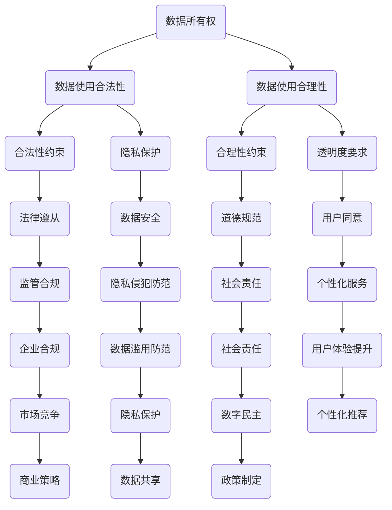
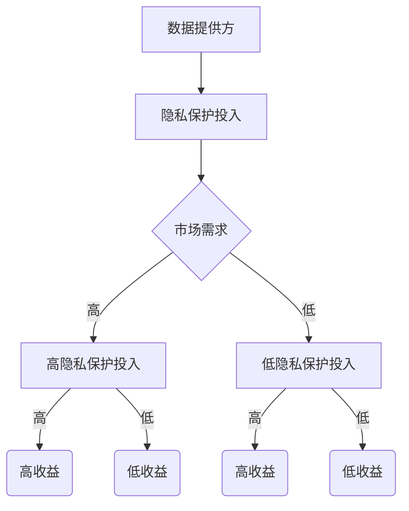

                 

### 引言

在当今的信息时代，个人数据的收集、使用和共享已经成为社会发展的重要驱动力。然而，这一现象也引发了对个人数据主权的新思考。个人数据主权运动应运而生，旨在保护个人对其数据的控制权，确保其数据在收集、处理和使用过程中的合法性和安全性。

#### 个人数据主权运动的背景

随着互联网和大数据技术的飞速发展，个人数据的采集和应用变得愈发普遍。企业和政府机构通过收集和分析个人数据，提供个性化服务、优化运营效率、制定政策决策。然而，这种对个人数据的依赖也带来了隐私泄露、数据滥用等风险。个人数据主权运动的提出，正是为了应对这些挑战。

个人数据主权的概念最早可以追溯到20世纪90年代的隐私权运动。随着全球对隐私保护的重视程度不断提高，个人数据主权逐渐成为信息技术领域的重要议题。特别是近年来，一系列重大数据泄露事件和隐私侵犯事件，如Facebook-Cambridge Analytica丑闻，进一步加剧了公众对个人数据主权的关注。

#### 个人数据主权的核心概念

个人数据主权是指个人对其数据的控制权和决策权。具体包括以下几个方面：

- **数据所有权**：个人对其数据拥有所有权，包括数据的收集、存储、使用和分享。
- **数据使用合法性**：个人数据的使用必须符合法律规定，确保不侵犯个人隐私。
- **数据使用合理性**：个人数据的使用应当合理，不超出个人同意的范围。

个人数据主权的提出，不仅是对个人隐私保护的一种回应，也是对信息伦理和社会责任的思考。它要求在数据收集和处理过程中，尊重和保护个人的基本权利。

#### 个人数据主权的社会影响

个人数据主权运动对社会产生了深远的影响。首先，它对消费者权益的保护具有重要意义。通过赋予消费者对其数据的控制权，可以减少隐私泄露和数据滥用的风险，提高消费者的信任度。

其次，个人数据主权对企业的商业模式也产生了影响。企业在进行数据收集和应用时，必须遵守个人数据主权原则，这要求企业在数据管理方面采取更加透明和负责任的做法。

此外，个人数据主权还对社会治理和公共政策产生了影响。政府机构在制定政策时，需要考虑个人数据主权原则，确保政策既能满足社会需求，又能保护个人权利。

总之，个人数据主权运动是信息时代的一项重要公民权利，它不仅关乎个人隐私保护，也涉及到社会伦理和责任。理解并推动个人数据主权的发展，对于构建一个更加公正、透明和安全的数字社会具有重要意义。

### 第1章：引言

#### 1.1 个人数据主权运动的背景

个人数据主权运动的兴起，源于信息时代对个人数据的需求不断增长。在互联网和大数据技术的推动下，个人数据已经成为企业和政府机构的重要资源。这些数据不仅用于优化运营、提升服务质量，还广泛应用于市场营销、精准推送、政策制定等领域。然而，个人数据的高价值也引发了数据滥用和隐私泄露的风险，促使社会对个人数据主权的需求日益迫切。

首先，社会对个人数据的需求主要体现在以下几个方面：

- **个性化服务**：企业和平台通过收集和分析用户数据，提供个性化的产品推荐、服务定制，从而提升用户体验。
- **商业决策**：企业利用数据洞察市场趋势、消费习惯，制定更加精准的商业策略，提高市场竞争力。
- **政策制定**：政府机构通过分析大量数据，制定更加科学、有效的公共政策，提升社会治理能力。

然而，随着数据需求的增加，个人数据的主权问题也逐渐凸显。个人数据的主权，即个人对其数据的控制权和决策权，成为保护个人隐私和权益的关键。个人数据主权运动的背景，可以追溯到以下几个方面的演变：

1. **隐私权运动**：在20世纪90年代，隐私权运动兴起，旨在保护个人隐私免受侵犯。随着互联网的普及，个人数据的收集和使用变得愈发普遍，隐私权成为社会关注的焦点。
2. **数据泄露事件**：近年来，一系列重大数据泄露事件频发，如Facebook-Cambridge Analytica丑闻，使得公众对个人数据安全的担忧达到顶峰。这些事件揭示了数据滥用和隐私泄露的严重性，推动了个人数据主权运动的发展。
3. **技术进步**：大数据、人工智能等技术的快速发展，使得数据收集、处理和分析变得更加便捷和高效。然而，这也带来了数据滥用的新风险，促使社会对个人数据主权的需求更加迫切。

综上所述，个人数据主权运动的背景是社会对个人数据需求的不断增长，以及数据泄露和隐私侵犯事件的频发。这一运动不仅是对个人隐私保护的回应，更是对信息伦理和社会责任的深刻反思。理解个人数据主权运动的背景，有助于我们更好地认识其在现代社会中的重要性。

#### 1.2 个人数据主权的核心概念

个人数据主权运动的核心概念是个人对其数据的控制权和决策权。这一概念不仅涉及到数据所有权，还涉及数据使用的合法性和合理性。具体来说，个人数据主权包括以下几个方面：

1. **数据所有权**：
   数据所有权是指个人对其数据的控制权，即个人有权决定其数据的收集、存储、使用和分享。这意味着个人可以自主决定是否提供数据，以及如何使用这些数据。数据所有权是个人数据主权的基础，确保了个人对其数据的控制权。

2. **数据使用合法性**：
   数据使用合法性是指个人数据在收集、处理和使用过程中，必须符合相关法律法规和道德规范。这包括两个方面：一是数据收集和使用必须获得个人的明确同意；二是数据在使用过程中必须确保个人隐私不受侵犯。数据使用合法性确保了个人数据在法律和道德框架下的合理使用。

3. **数据使用合理性**：
   数据使用合理性是指个人数据的使用应当合理，不超出个人同意的范围。这意味着，即使个人同意提供数据，数据的使用也应限于个人同意的特定目的，且不得滥用或滥用。数据使用合理性确保了数据在合法范围内的合理使用，避免了数据滥用的风险。

个人数据主权的核心概念构成了一个完整的框架，确保了个人数据在收集、处理和使用过程中的合法性和安全性。以下是一个简化的Mermaid流程图，展示了这些核心概念之间的关系：



通过这个流程图，我们可以清晰地看到个人数据主权的核心概念如何相互作用，共同构成了一个完整的框架，确保了个人数据在各个使用环节中的合法性和安全性。

#### 1.3 个人数据主权的社会影响

个人数据主权运动在社会各个方面产生了深远的影响，其重要性不可忽视。首先，它对消费者权益的保护具有重大意义。个人数据主权赋予了消费者对其数据的控制权，使消费者能够自主决定是否分享数据，以及如何使用这些数据。这一权利的赋予，有助于减少隐私泄露和数据滥用的风险，提升消费者的信任度。消费者在享受个性化服务和便利的同时，无需担心其个人信息被不当使用，从而提高了对数字平台的依赖和忠诚度。

其次，个人数据主权对企业的商业模式也产生了显著影响。企业过去通过大规模收集和分析消费者数据，实现精准营销和个性化服务。然而，随着个人数据主权运动的推进，企业需要更加透明和负责任地管理数据。这意味着，企业必须在数据收集、存储和使用过程中，严格遵守个人数据主权原则，确保数据使用的合法性和合理性。这不仅要求企业建立完善的数据保护机制，还需要在商业模式上进行创新，以适应数据主权的新要求。

此外，个人数据主权对社会治理和政策制定也产生了重要影响。政府作为公共数据的管理者和政策制定者，需要平衡社会需求和个人权益。个人数据主权原则要求政府在使用公共数据时，必须尊重和保护个人隐私，确保数据使用的合法性和合理性。政府机构在制定政策时，需要充分考虑个人数据主权原则，确保政策既能满足社会需求，又能保护个人权利。

具体来说，个人数据主权对社会的影响体现在以下几个方面：

1. **消费者权益保护**：
   - **隐私保护**：个人数据主权确保消费者对其数据的控制权，减少隐私泄露和数据滥用的风险。
   - **知情权**：消费者有权了解其数据被如何使用，增强对数字平台的信任。
   - **选择权**：消费者可以自主决定是否分享数据，以及如何使用这些数据。

2. **企业商业模式**：
   - **合规要求**：企业需要遵守个人数据主权原则，确保数据使用的合法性和合理性。
   - **创新驱动**：企业需要在数据管理方面进行创新，以适应数据主权的新要求，提升用户体验。
   - **信任构建**：透明和负责任的数据管理有助于构建消费者对企业的信任。

3. **社会治理和政策制定**：
   - **数据保护**：政府需要平衡社会需求和个人权益，确保公共数据的使用合法合规。
   - **政策制定**：政策制定者需要充分考虑个人数据主权原则，确保政策既能满足社会需求，又能保护个人权利。
   - **责任承担**：政府和企业需要共同承担保护个人数据主权的责任，构建一个更加透明和公正的数字社会。

综上所述，个人数据主权运动不仅关乎个人隐私保护，也涉及到社会伦理和责任。它在消费者权益保护、企业商业模式创新和社会治理政策制定等方面产生了深远影响，为构建一个更加公正、透明和安全的数字社会提供了重要支持。

### 个人数据主权运动的本质

#### 2.1 个人数据主权运动的定义

个人数据主权运动，是一种旨在保护个人对其数据的控制权和决策权的公民权利运动。其核心目标是通过法律、技术和社会手段，确保个人数据在收集、处理和使用过程中的合法性和安全性。个人数据主权运动不仅关注个人隐私的保护，更强调个人对其数据的所有权和使用权。

首先，个人数据主权运动的定义涉及多个关键要素：

- **数据所有权**：个人对其数据的所有权，包括数据的收集、存储、使用和分享的权利。这意味着个人有权决定其数据的用途和共享方式。
- **数据使用合法性**：个人数据的使用必须遵守相关法律法规，确保不侵犯个人隐私。这包括数据收集的合法性、数据处理过程中的透明度，以及数据使用的合理性。
- **数据使用合理性**：数据的使用应当合理，不超出个人同意的范围。这意味着即使个人同意提供数据，这些数据的使用也应限于个人同意的特定目的，且不得滥用或滥用。

个人数据主权运动的目标不仅仅是保护个人隐私，还包括以下几个方面：

1. **隐私保护**：确保个人数据不被滥用或泄露，保护个人隐私权。
2. **数据透明度**：提升数据收集、处理和使用的透明度，使个人能够了解其数据如何被使用。
3. **数据安全**：通过技术手段确保个人数据在传输、存储和处理过程中的安全性，防止数据泄露和损坏。
4. **用户控制权**：赋予个人对其数据的控制权，使其能够自主决定数据的使用方式和共享范围。

其次，个人数据主权运动的社会意义在于其对社会公平和责任的推动。随着数据成为现代社会的重要资源，个人数据主权运动旨在确保每个人都能在数据时代中获得公平的待遇。这不仅有助于保护个人隐私，还能促进数据伦理和社会责任的落实。

具体来说，个人数据主权运动的社会意义体现在以下几个方面：

1. **消费者权益保护**：通过赋予消费者对其数据的控制权，减少隐私泄露和数据滥用的风险，提高消费者的信任度和满意度。
2. **企业责任**：推动企业建立透明和负责任的数据管理机制，确保数据使用的合法性和合理性，增强企业的社会责任感。
3. **政策制定**：为政府制定数据隐私保护政策提供理论基础，确保政策既能满足社会需求，又能保护个人权利。
4. **社会公平**：确保每个人在数据时代中都能获得公平的机会和待遇，减少数据资源的不平等分配。

总之，个人数据主权运动是一种旨在保护个人隐私、促进数据伦理和社会责任的公民权利运动。它不仅关乎个人数据的安全和合法使用，更涉及到社会公平和责任的实现。理解个人数据主权运动的定义和社会意义，有助于我们更好地认识其在现代社会中的重要性。

#### 2.2 个人数据主权运动的内涵

个人数据主权运动的内涵不仅包括对个人隐私的保护，还涉及到更广泛的数字民主和信息伦理。这一运动不仅关注个人数据的合法性和安全性，更强调数据透明度、用户控制权以及社会责任的落实。

首先，个人数据主权运动与数字民主的紧密联系体现在其对数据透明度和用户控制权的强调。在数字时代，数据已经成为一种新的民主资源。个人数据主权运动旨在确保每个人都能在数据使用过程中获得平等的参与和控制权。通过赋予用户对其数据的控制权，数字平台和应用程序能够更好地反映用户的需求和偏好，从而实现更加民主的数据管理。

其次，个人数据主权运动也是信息伦理的一部分。信息伦理关注的是信息技术在伦理和道德方面的应用，特别是在个人数据的收集、处理和使用过程中。个人数据主权运动强调数据使用的合法性和合理性，防止数据滥用和隐私侵犯。这一运动要求企业在数据管理过程中遵守道德规范，确保数据使用的透明度和公正性。

此外，个人数据主权运动还涉及到社会责任的落实。随着数据在经济、政治和社会各个领域的广泛应用，企业和政府机构在数据管理方面承担着重要的社会责任。个人数据主权运动要求这些机构在数据收集、处理和使用过程中，不仅要遵守法律法规，还要考虑其对社会和个人的影响。这包括保护个人隐私、防止数据滥用以及促进数据公平共享。

个人数据主权运动的内涵可以概括为以下几个方面：

1. **数据透明度**：确保个人数据在收集、处理和使用过程中的透明度，使个人能够了解其数据如何被使用。
2. **用户控制权**：赋予个人对其数据的控制权，使其能够自主决定数据的使用方式和共享范围。
3. **信息伦理**：在数据收集、处理和使用过程中，遵守伦理规范，防止数据滥用和隐私侵犯。
4. **社会责任**：企业和政府机构在数据管理过程中，要承担保护个人隐私和社会利益的责任，促进数据公平共享。

通过这些内涵，个人数据主权运动不仅保护了个人隐私，还促进了数字民主和信息伦理的实现。它要求社会在数据管理方面采取更加透明、负责任和公正的做法，为构建一个更加公正、透明和安全的数字社会提供了重要支持。

#### 2.3 个人数据主权运动的发展阶段

个人数据主权运动经历了从萌芽到发展的多个阶段，其演变历程体现了社会对数据隐私保护的不断关注和需求。以下是个人数据主权运动的主要发展阶段：

1. **萌芽阶段**（20世纪90年代）：个人数据主权运动的萌芽可以追溯到20世纪90年代的隐私权运动。当时，随着互联网的兴起，个人数据的收集和使用变得日益普遍，隐私泄露和数据滥用的风险逐渐显现。这一阶段的代表性事件包括《计算机隐私法》的提出和个人隐私权意识的觉醒。

2. **发展阶段**（21世纪初至今）：进入21世纪，个人数据主权运动进入发展阶段。随着大数据、人工智能等技术的发展，个人数据的价值日益凸显，同时也带来了新的隐私保护和主权挑战。这一阶段的关键事件包括《通用数据保护条例》（GDPR）的出台和全球范围内数据隐私保护立法的推进。GDPR作为全球最严格的数据保护法规，为个人数据主权提供了重要的法律框架。

3. **深化阶段**（2020年至今）：近年来，个人数据主权运动进一步深化，主要体现在以下几个方面：

   - **技术手段**：随着区块链、同态加密、差分隐私等新技术的发展，个人数据的主权实现手段更加多样化。这些技术为个人数据的主权提供了技术支持，使得个人可以在保护隐私的同时，依然能够享受数据带来的便利。
   - **企业合规**：越来越多的企业开始意识到个人数据主权的重要性，积极采取合规措施，确保其数据管理符合法律法规和伦理标准。
   - **政策法规**：各国政府纷纷加强数据隐私保护政策，推动个人数据主权的实现。例如，美国推出了《加州消费者隐私法案》（CCPA），中国发布了《个人信息保护法》（PIPL）。

现阶段，个人数据主权运动的主要诉求包括：

1. **数据透明度**：提升数据收集、处理和使用的透明度，使个人能够了解其数据如何被使用。
2. **用户控制权**：赋予个人对其数据的更多控制权，包括数据的访问、删除和共享。
3. **数据安全**：通过技术手段确保个人数据在传输、存储和处理过程中的安全性。
4. **隐私保护**：防止数据滥用和隐私侵犯，保障个人隐私权。

未来，个人数据主权运动可能的发展方向包括：

1. **国际协作**：随着全球数字化进程的加快，个人数据主权运动需要更多的国际合作，共同制定全球统一的数据隐私保护标准和法规。
2. **技术进步**：随着新技术的不断涌现，个人数据主权的技术手段将进一步丰富，如量子加密、人工智能伦理等。
3. **法律法规完善**：各国政府将进一步完善数据隐私保护法律法规，确保个人数据主权的实现。

总之，个人数据主权运动是一个不断演进的过程，其发展阶段反映了社会对数据隐私保护的不断关注和需求。理解这一运动的发展历程和主要诉求，有助于我们更好地应对未来数据主权带来的挑战。

### 个人数据主权的法律与政策基础

个人数据主权的实现离不开法律和政策的基础支持。在全球范围内，各国纷纷出台了一系列法律法规和政策，以保护个人数据的合法性和安全性。以下是几个主要国家和地区的相关法律和政策介绍。

#### 3.1 国际数据隐私法律框架

1. **通用数据保护条例（GDPR）**：
   GDPR是欧盟于2018年5月25日实施的全面数据保护法规，被认为是全球最严格的数据保护法规。GDPR的核心原则包括数据最小化、目的明确性、数据透明度、用户控制权和数据安全等。GDPR要求企业必须获得用户的明确同意才能收集和使用其数据，并规定了数据泄露后的通知义务和数据主体的权利，如数据访问、纠正、删除等。

2. **加州消费者隐私法案（CCPA）**：
   CCPA是美国加州于2020年1月1日生效的消费者隐私保护法律。CCPA赋予加州居民对其个人信息的更多控制权，包括数据访问、删除和不同意数据销售的权利。CCPA还规定了企业的数据收集和披露义务，以及对违反规定的处罚措施。

#### 3.2 各国数据主权政策对比分析

1. **欧盟的政策**：
   - **GDPR**：如前所述，GDPR是欧盟的标志性数据隐私保护法律。欧盟成员国必须遵守GDPR的规定，以确保统一的数据保护标准。
   - **数字权利法案**：欧盟还提出了数字权利法案，旨在确保欧盟公民在数字时代的权利，包括数据访问、数据可携带性、隐私保护等。

2. **美国的政策**：
   - **CCPA**：加州消费者隐私法案（CCPA）是美国加州的隐私保护法律，具有广泛的影响力。此外，美国联邦层面的隐私保护立法仍在推进中，如《加州隐私法》和《美国隐私法》。

3. **中国的政策**：
   - **个人信息保护法（PIPL）**：PIPL是中国于2021年11月1日实施的个人信息保护基本法，规定了个人信息处理的基本原则、个人信息主体的权利和个人信息处理者的义务。PIPL强调了个人对其数据的控制权，包括数据的访问、删除和更正等。

各国在数据主权政策上存在一些显著差异：

- **数据主体权利**：欧盟和中国的法律法规普遍赋予数据主体更多的权利，如数据访问、删除和不同意数据销售。而美国在数据主体权利方面存在一定差异，CCPA虽然赋予了数据主体更多控制权，但与美国联邦层面的隐私保护立法相比，权利范围相对有限。
- **数据处理义务**：欧盟和中国的法律法规对数据处理者的义务要求较为严格，包括数据最小化、目的明确性和数据安全等。美国的法律法规虽然也在逐步完善，但在某些方面仍相对宽松。
- **监管执行**：欧盟的GDPR实施严格，对违规企业的处罚力度大。美国在执行方面相对灵活，但联邦层面的隐私保护立法正在逐步加强。中国的PIPL虽然执行力度较大，但与欧盟相比，在某些方面的监管力度仍有待提高。

总之，个人数据主权的法律与政策基础在全球范围内不断发展和完善。通过对比分析各国的法律法规和政策，可以更好地理解个人数据主权在不同国家和地区的实现方式和挑战，为全球数据主权的发展提供参考。

### 个人数据主权的技术实现

个人数据主权的实现离不开技术的支持，区块链、同态加密和差分隐私等技术在这一过程中发挥了关键作用。这些技术不仅保障了个人数据的隐私和安全，还为数据的主权提供了技术保障。

#### 4.1 数据加密与隐私保护技术

数据加密是保护个人数据隐私的基础技术之一。其中，同态加密（Homomorphic Encryption）和差分隐私（Differential Privacy）是两种重要的加密技术。

- **同态加密**：同态加密允许在加密数据上进行计算，而不需要解密数据。这意味着，即使数据在传输和存储过程中是加密的，仍然可以在不解密的情况下进行数据处理和分析。同态加密的应用场景包括云计算和大数据分析，使企业可以在保护数据隐私的同时，利用数据进行商业决策。

- **差分隐私**：差分隐私是一种在数据分析过程中保护个人隐私的技术。它通过添加噪声来模糊化数据的细节，从而保护个人隐私。差分隐私的核心思想是确保隐私泄露的概率不会因为数据集的增加而显著提高。差分隐私的应用场景包括数据分析和机器学习，使模型在训练和预测过程中不会泄露个人敏感信息。

#### 4.2 区块链技术在数据主权中的应用

区块链技术为个人数据主权提供了去中心化和透明化的解决方案。区块链的去中心化特性确保了数据的不可篡改性和透明性，使个人可以自主管理其数据，并确保数据在传输和存储过程中的安全性和合法性。

- **去中心化的数据管理**：区块链技术通过分布式账本，使数据在多个节点上存储，从而避免了单点故障和数据篡改的风险。这意味着，个人可以自主控制其数据，并在需要时进行修改或删除。

- **透明与不可篡改的记录**：区块链上的数据记录是透明和不可篡改的。这意味着，个人可以随时查询其数据的历史记录，确保数据的合法性和透明度。此外，区块链技术还可以通过智能合约，实现数据使用的自动化管理和监督，进一步保障个人数据的主权。

#### 4.3 个人数据主权的算法模型

构建个人数据主权的算法模型是确保数据主权的关键。以下是一个简化的算法模型，用于实现个人数据的主权：

```python
# 个人数据主权算法模型

def personal_data_ownership(data, encryption_key, privacybudget):
    # 加密数据
    encrypted_data = encrypt_data(data, encryption_key)
    
    # 应用差分隐私
    differential_privacy_data = add_noise(encrypted_data, privacybudget)
    
    # 上链存储
    blockchain_data = store_on_blockchain(differential_privacy_data)
    
    return blockchain_data

# 数据加密
def encrypt_data(data, encryption_key):
    # 使用同态加密对数据进行加密
    encrypted_data = homomorphic_encrypt(data, encryption_key)
    return encrypted_data

# 添加噪声
def add_noise(data, privacybudget):
    # 根据隐私预算，对数据进行噪声添加
    noisy_data = differential_privacy(data, privacybudget)
    return noisy_data

# 存储到区块链
def store_on_blockchain(data):
    # 将数据存储到区块链
    blockchain_data = blockchain_store(data)
    return blockchain_data
```

在这个算法模型中，数据首先进行同态加密，确保数据在传输和存储过程中是加密的。然后，通过差分隐私技术对数据进行处理，进一步保护个人隐私。最后，将加密且带噪声的数据存储到区块链上，确保数据的透明和不可篡改性。

#### 个人数据主权算法模型的核心挑战

虽然个人数据主权的算法模型提供了有效的解决方案，但在实际应用中仍面临以下核心挑战：

1. **计算性能**：同态加密和差分隐私等技术对计算资源要求较高，可能导致数据处理速度变慢。这需要优化算法和硬件性能，以提高数据处理效率。

2. **隐私保护与数据可用性**：在保证隐私保护的同时，如何确保数据的可用性和准确性是一个挑战。需要在隐私保护和数据可用性之间找到平衡。

3. **区块链的可扩展性**：随着数据量的增加，区块链的可扩展性成为一个关键问题。需要开发高效的去中心化存储和查询方案，以支持大规模数据的应用。

4. **法律法规合规**：个人数据主权的算法模型需要符合不同国家和地区的法律法规要求，这需要跨区域法律协调和标准统一。

总之，个人数据主权的技术实现是一个复杂的过程，需要结合多种技术手段和策略。通过解决这些核心挑战，可以更好地实现个人数据的主权，保护个人隐私，同时确保数据的有效利用。

### 个人数据主权中的数学模型

在个人数据主权中，数学模型扮演着至关重要的角色。这些模型不仅帮助量化数据安全性，还能评估隐私保护措施的有效性。以下介绍几种常用的数学模型，包括数据安全性的量化模型、数据隐私保护的数学模型以及数据流通中的博弈模型。

#### 5.1 数据安全性的量化模型

数据安全性的量化模型用于评估数据在传输、存储和处理过程中的安全水平。其中，安全性的度量方法包括以下几个方面：

- **访问控制模型**：通过访问控制列表（ACL）和角色基访问控制（RBAC）等方法，确保只有授权用户可以访问特定数据。数学上，可以使用访问权限矩阵来表示访问控制策略，矩阵中的元素表示用户对数据的访问权限。

- **加密强度模型**：评估加密算法的强度，如对称加密和非对称加密的密钥长度。常用的度量方法是计算密钥空间和破解所需的时间。例如，对于对称加密算法，安全性可以通过公式 \( 2^{k} \) 来衡量，其中 \( k \) 是密钥长度。

- **漏洞分析模型**：通过分析系统中的潜在漏洞，评估系统的安全水平。常用的方法包括基于故障注入的漏洞分析和基于模型检查的漏洞分析。

以下是一个简化的安全度量模型示例：

```latex
安全度量模型：S = f(A, C, E)
```

其中，\( S \) 表示安全性，\( A \) 表示访问控制策略，\( C \) 表示加密算法，\( E \) 表示漏洞分析结果。

#### 5.2 数据隐私保护的数学模型

数据隐私保护的数学模型主要用于评估隐私泄露的概率和隐私预算。以下介绍两种常见的模型：

- **隐私预算模型**：隐私预算模型用于量化隐私泄露的风险。常见的隐私预算模型包括拉普拉斯机制和γ-机制。这些模型通过添加噪声来保护隐私，同时确保数据的可用性。

  - **拉普拉斯机制**：在数据发布前，添加拉普拉斯噪声，使得真实数据无法被精确还原。数学上，拉普拉斯噪声可以通过以下公式添加：

    $$ x' = x + \epsilon, \quad \epsilon \sim Laplace(0, \sigma^2) $$

    其中，\( x \) 表示原始数据，\( x' \) 表示添加噪声后的数据，\( \epsilon \) 表示拉普拉斯噪声，\( \sigma \) 表示噪声标准差。

  - **γ-机制**：γ-机制通过调整噪声的分布形状，以适应不同类型的数据分布。数学上，γ-机制可以通过以下公式添加噪声：

    $$ x' = x + \epsilon, \quad \epsilon \sim Gamma(a, b) $$

    其中，\( a \) 和 \( b \) 是γ分布的参数。

- **隐私泄露概率模型**：隐私泄露概率模型用于评估在特定攻击场景下，隐私数据被泄露的概率。常用的隐私泄露概率模型包括差分隐私和统计查询攻击模型。

  - **差分隐私**：差分隐私通过确保在删除或添加一条数据后，隐私泄露的概率不会显著增加。数学上，差分隐私可以通过以下公式衡量：

    $$ \mathbb{P}(\Delta \text{隐私泄露}|S) \leq \epsilon $$

    其中，\( \Delta \) 表示数据差异，\( \epsilon \) 是隐私预算。

  - **统计查询攻击模型**：统计查询攻击模型用于评估在特定查询条件下，隐私数据被泄露的概率。数学上，可以通过以下公式计算隐私泄露概率：

    $$ \mathbb{P}(\text{泄露}|Q(S)) \leq \frac{1}{n} + \epsilon $$

    其中，\( Q(S) \) 表示查询结果，\( n \) 是数据量，\( \epsilon \) 是隐私预算。

#### 5.3 数据流通中的博弈模型

在数据流通过程中，数据提供方和数据需求方之间存在利益冲突。博弈模型用于分析双方在数据交易和市场中的策略选择。以下介绍两种常见的博弈模型：

- **供应链隐私保护策略**：在数据供应链中，数据提供方（如企业）和数据需求方（如消费者）之间存在隐私保护的利益冲突。博弈模型可以通过构建博弈树和分析纳什均衡，找到双方在隐私保护方面的最优策略。

- **数据交易市场均衡分析**：在数据交易市场中，数据提供方和数据需求方通过交易实现共赢。博弈模型可以通过构建博弈矩阵和计算贝叶斯纳什均衡，分析市场中各方的策略选择。

以下是一个简化的供应链隐私保护博弈模型示例：



在这个博弈模型中，数据提供方可以选择高隐私保护投入或低隐私保护投入，市场需求分为高需求和低需求。通过分析纳什均衡，可以找到双方在隐私保护方面的最优策略。

总之，个人数据主权中的数学模型不仅帮助量化数据安全性和隐私保护，还为数据流通中的博弈分析提供了理论基础。这些模型在确保数据主权和隐私保护方面发挥着重要作用，有助于构建一个安全、透明和公正的数字社会。

### 个人数据主权运动的案例分析

为了更好地理解个人数据主权运动在实际中的应用，我们将通过几个具体的案例来探讨隐私保护技术应用、区块链在数据主权中的应用以及政策法规对个人数据主权的作用。

#### 6.1 案例研究：隐私保护技术应用

**案例背景**：某大型互联网公司为了提高用户服务质量，决定在用户数据收集和处理过程中引入隐私保护技术。

**实施过程**：
1. **数据加密**：公司首先对所有收集的用户数据进行加密，使用同态加密技术，确保在数据处理过程中数据保持加密状态，防止数据泄露。
2. **差分隐私**：公司对用户数据进行差分隐私处理，通过添加噪声使数据发布后的隐私泄露概率保持在较低水平。
3. **区块链记录**：公司将加密后的数据记录在区块链上，利用区块链的透明和不可篡改特性，确保数据在传输和存储过程中的安全性和可追溯性。
4. **用户控制权**：公司为用户提供数据访问和删除权限，用户可以自主决定是否分享数据以及如何使用这些数据。

**效果评估**：
- **数据安全性**：通过加密和差分隐私技术，公司的用户数据在传输和存储过程中实现了高度安全性，有效降低了数据泄露的风险。
- **用户信任度**：用户对公司的数据保护措施表示认可，用户隐私泄露事件显著减少，用户信任度提升。
- **数据透明度**：区块链技术的应用使数据流转过程更加透明，用户可以随时查询其数据的历史记录，增加了数据的透明度和可信度。

#### 6.2 案例研究：区块链在数据主权中的应用

**案例背景**：某金融科技公司为了提升数据主权管理，决定将区块链技术应用于客户数据管理。

**实施过程**：
1. **去中心化数据存储**：公司将客户数据存储在分布式区块链上，通过多个节点备份，确保数据的安全性和完整性。
2. **智能合约管理**：公司使用智能合约来管理数据的使用权限和访问控制，确保数据使用符合用户授权。
3. **透明审计**：通过区块链技术，公司的数据操作记录在链上永久保存，可进行透明审计，增强数据使用的透明度和合规性。

**效果评估**：
- **数据安全性**：区块链技术的去中心化和不可篡改特性，确保了客户数据在传输和存储过程中的安全性，降低了数据泄露和篡改的风险。
- **数据主权**：区块链技术赋予了客户对其数据的主权，客户可以自主决定数据的使用方式和访问权限，增强了数据主权。
- **合规性**：智能合约的应用使得数据使用和管理过程更加透明和规范，提高了公司的合规性。

#### 6.3 案例研究：政策法规在个人数据主权中的作用

**案例背景**：某国政府为了保护公民的隐私权利，出台了一项全面的个人数据主权保护法。

**实施过程**：
1. **立法框架**：政府制定了个人数据主权保护法，明确了个人数据的主权、数据处理者的义务以及用户的数据权利。
2. **合规检查**：政府设立专门的合规检查机构，定期对企业的数据管理进行审计，确保企业遵守数据主权保护法的规定。
3. **公众教育**：政府开展公众教育活动，提高公民的数据主权意识，使公民了解自己的数据权利和如何保护自己的隐私。

**效果评估**：
- **隐私保护**：政策法规的出台和实施，有效保护了公民的隐私权利，减少了数据滥用和泄露事件。
- **企业合规**：企业为了遵守政策法规，采取了更加严格的数据管理措施，提高了数据保护水平。
- **社会信任**：公众对政府和个人数据主权的信任度提高，促进了数字经济的健康发展。

总之，通过这些具体案例，我们可以看到个人数据主权运动在实际应用中的多样性和效果。隐私保护技术、区块链技术和政策法规的有机结合，为个人数据主权提供了全面的支持，有助于构建一个更加安全、透明和公正的数字社会。

### 个人数据主权的未来趋势

随着科技的不断进步和社会对隐私保护需求的日益增长，个人数据主权正迎来新的发展趋势。这些趋势不仅受到技术发展的影响，还受到法规政策和市场需求的推动。以下分析未来个人数据主权的发展趋势，重点关注人工智能与数据主权、物联网与数据主权、以及国际合作与数据主权等方面的动态。

#### 7.1 技术发展对个人数据主权的影响

1. **人工智能与数据主权**：
   人工智能技术的发展正在深刻改变数据主权领域的格局。人工智能能够从海量数据中提取有价值的信息，从而为企业和社会带来巨大的商业价值和治理效能。然而，这也带来了新的隐私挑战。首先，人工智能算法的训练和预测过程往往需要大量个人数据，这可能引发数据滥用的风险。其次，人工智能的自主性和透明性不足，使得个人难以理解其数据是如何被使用的。因此，未来个人数据主权的发展需要在保障数据安全和隐私的前提下，充分利用人工智能的技术优势。

   为了实现这一目标，未来可能的技术发展方向包括：
   - **隐私增强的学习技术**：开发和应用隐私增强的学习技术，如联邦学习、差分隐私等，以在保证隐私的前提下进行数据分析和模型训练。
   - **透明和可解释的人工智能**：提高人工智能系统的透明度和可解释性，使个人能够理解和跟踪其数据的使用情况，增强对人工智能的信任。

2. **物联网与数据主权**：
   物联网（IoT）的快速发展使得大量的个人数据通过传感器和设备被不断收集。这些数据不仅包括传统的个人信息，还涉及日常生活中的行为和位置数据。物联网的普及带来了数据主权的新挑战，如数据所有权和隐私保护。此外，物联网设备的分布式特性也使得数据主权管理更加复杂。

   未来物联网与数据主权的发展趋势可能包括：
   - **去中心化的物联网架构**：通过区块链等去中心化技术，实现物联网设备的自主管理和数据主权保障。
   - **边缘计算与数据主权**：利用边缘计算技术，在数据生成源头进行数据分析和处理，减少数据传输过程中泄露的风险。

#### 7.2 法规政策的发展方向

1. **国际合作与数据主权**：
   随着全球化进程的加快，跨国数据流动日益频繁，国际数据主权问题变得愈发重要。未来的法规政策需要在国际合作的基础上，制定统一的数据主权标准和规范，以应对跨国数据流动带来的隐私保护挑战。

   未来可能的法规政策发展方向包括：
   - **全球数据主权公约**：通过国际合作，制定全球数据主权公约，确立跨国数据流动的基本原则和规则，确保数据主权在全球范围内的统一和协调。
   - **跨国数据保护合作机制**：建立跨国数据保护合作机制，加强各国在数据主权保护方面的交流与合作，共同应对跨国数据隐私保护挑战。

2. **法律法规的完善与实施**：
   各国在数据主权保护方面的法律法规正在不断完善。未来，法律法规的实施和执行将变得更加严格和高效。

   可能的发展方向包括：
   - **加强监管力度**：加大对违反数据主权规定的企业的处罚力度，提高企业遵守数据主权法律的积极性。
   - **公众参与和监督**：鼓励公众参与数据主权保护，通过举报和监督机制，提高数据主权保护的效果。

#### 7.3 个人数据主权运动的社会意义

个人数据主权运动不仅关乎个人隐私保护，还具有深刻的社会意义，主要体现在以下几个方面：

1. **促进数字民主**：
   个人数据主权运动赋予个人对其数据的控制权，使数字社会的权力结构更加民主。通过数据透明度和用户控制权，个人能够更加自主地参与社会生活，实现数字时代的民主权利。

2. **推动数据伦理**：
   个人数据主权运动强调数据使用的合法性和合理性，推动了数据伦理的发展。在未来，数据伦理将成为数字经济的重要组成部分，促进社会公平和可持续发展。

3. **提升社会治理能力**：
   通过加强数据主权保护，个人数据主权运动有助于提高社会治理能力。政府和企业可以更好地利用数据资源，制定科学合理的公共政策，提升社会治理的效能。

总之，个人数据主权运动的未来趋势将受到技术发展、法规政策和市场需求的多重影响。通过技术创新、国际协作和法律法规的完善，个人数据主权将在信息时代发挥更加重要的作用，为构建一个公正、透明和安全的数字社会提供有力支持。

### 附录：参考资料与扩展阅读

#### 附录A：个人数据主权研究参考资料

**学术论文精选**：

1. **“Privacy and Datability: Balancing Data Access and Data Use”**，作者：C. Dwork，发表于《Journal of Computer and System Sciences》，2014年。
2. **“A Framework for Data Privacy”**，作者：C. F. C. mbox et al.，发表于《ACM Transactions on Information and System Security》，2010年。
3. **“The Economics of Privacy: A Mechanism Design Approach”**，作者：A. d'Aspremont，S. Goyal，发表于《Journal of the European Economic Association》，2016年。

**相关政策法规**：

1. **《通用数据保护条例（GDPR）》**，欧盟，2018年。
2. **《加州消费者隐私法案（CCPA）》**，美国加州，2020年。
3. **《个人信息保护法（PIPL）》**，中国，2021年。

**行业报告分析**：

1. **“The Global Data Privacy Regulation Report 2022”**，作者：Global Privacy Enforcement Network，2022年。
2. **“Data Privacy Trends and Predictions for 2023”**，作者：Gartner，2023年。
3. **“The State of Data Privacy in the EU: GDPR Two Years On”**，作者：European Data Protection Board，2020年。

#### 附录B：个人数据主权运动相关组织与机构

**国际组织**：

1. **国际隐私与数据保护协会（International Association of Privacy Professionals，IAPP）**：提供数据隐私保护的专业培训和认证。
2. **欧盟数据保护委员会（European Data Protection Board，EDPB）**：负责监督和协调欧盟成员国的数据保护法规实施。
3. **隐私国际（Privacy International）**：致力于全球隐私权和公民权利的倡导和组织。

**行业协会**：

1. **信息与隐私专业协会（Association of Information and Image Management，AIIM）**：专注于信息管理和数据隐私保护。
2. **美国隐私与技术协会（Association for Privacy Professionals，APP）**：为数据隐私专业人士提供教育和资源。
3. **中国信息安全认证中心（China Information Technology Security Certification Center，CITSEC）**：负责国内信息安全认证和隐私保护。

**学术研究机构**：

1. **斯坦福大学法律、科技与互联网项目（Stanford Law School's Center for Internet and Society，CIS）**：专注于互联网和法律交叉领域的学术研究。
2. **麻省理工学院计算机科学与人工智能实验室（MIT Computer Science and Artificial Intelligence Laboratory，CSAIL）**：在人工智能和隐私保护领域有深入的研究。
3. **卡内基梅隆大学隐私技术研究中心（Carnegie Mellon University Privacy Technology Center，CMU/PTC）**：专注于隐私技术和数据保护的研究。

通过这些参考资料和扩展阅读，读者可以进一步深入了解个人数据主权的相关理论和实践，把握该领域的最新发展动态。这些资源和机构为个人数据主权的研究提供了丰富的理论和实践支持，有助于推动相关研究和政策的进步。

