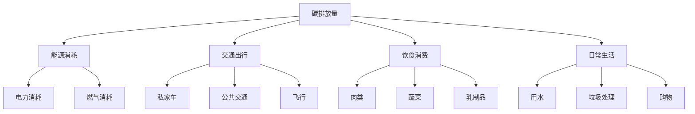

                 

### 个人碳足迹追踪：日常生活的环保量化

> 关键词：个人碳足迹、碳排放量化、环保生活方式、计算方法、实用技巧

在当今全球变暖、气候异常的背景下，减少碳排放已成为社会共识。个人碳足迹，即个人或组织在日常生活中产生的碳排放量，是衡量环保行为的重要指标。量化个人碳足迹不仅有助于我们了解自身对环境的影响，还能激励我们采取实际行动减少碳排放。本文将深入探讨个人碳足迹的追踪方法，通过系统分析和具体实例，帮助读者理解并实践如何在日常生活中量化碳排放。

本文结构如下：

1. **背景介绍**：介绍全球碳排放现状和个人碳足迹的概念。
2. **核心概念与联系**：解释个人碳足迹计算中的关键概念，并展示它们之间的关系。
3. **核心算法原理讲解**：详细阐述计算个人碳足迹的算法原理，结合Python源代码和数学模型。
4. **项目实战**：介绍一个具体的项目实战案例，包括环境搭建、源代码实现与解读、案例分析。
5. **最佳实践与小结**：提供实用技巧和注意事项，总结文章重点，并推荐拓展阅读。

通过本文的逐步分析，读者将能够掌握个人碳足迹追踪的方法，并将其应用于实际生活中，为环保事业贡献自己的力量。

---

#### 摘要

本文旨在探讨如何量化个人日常生活中的碳排放，即个人碳足迹的追踪方法。随着全球碳排放问题的加剧，了解个人碳足迹对于推动环保行动具有重要意义。本文首先介绍全球碳排放现状和个人碳足迹的概念，接着解释计算个人碳足迹的关键概念与算法原理，并通过具体案例展示实际操作过程。此外，文章还将提供实用技巧和注意事项，帮助读者更好地实施个人碳足迹追踪。通过本文的阅读，读者将掌握个人碳足迹计算的基本方法和技巧，为环保生活方式的实现打下基础。

---

#### 背景介绍

全球碳排放问题已经引起了国际社会的广泛关注。根据国际能源署（IEA）的数据，自工业革命以来，全球碳排放总量已经突破了3000亿吨。这一数字的不断攀升，导致了温室气体浓度的增加，从而引发了全球变暖、极端天气、海平面上升等一系列环境问题。气候变化已经成为人类面临的最大挑战之一。

在个人层面，碳足迹（Carbon Footprint）的概念应运而生。碳足迹是指个人或组织在日常生活中产生的碳排放总量，它反映了一个人或组织对环境的影响程度。个人碳足迹的计算包括多个方面的碳排放，如交通、能源使用、饮食、消费行为等。通过量化个人碳足迹，我们可以清楚地了解自身对环境的影响，从而采取有针对性的减排措施。

近年来，随着环保意识的提升，越来越多的人开始关注个人碳足迹的追踪。例如，一些国家和地区已经推出了碳足迹计算器，帮助个人估算自己的碳排放量。此外，一些企业和组织也加入了碳足迹管理计划，通过减少碳排放来降低对环境的影响。个人碳足迹追踪不仅有助于环境保护，还能提高我们的环保意识，促进可持续发展。

本文将详细探讨如何量化个人碳足迹，并提供实用的计算方法和技巧。通过逐步分析碳排放的各个方面，读者将能够理解个人碳足迹的计算过程，并在实际生活中采取行动减少碳排放。希望通过本文的分享，能够激发更多人参与到环保行动中来，共同为地球的可持续发展贡献力量。

### 核心概念与联系

要准确计算个人碳足迹，首先需要了解几个关键概念，并理清它们之间的关系。以下是几个核心概念及其在计算中的联系：

1. **碳排放量**：这是个人碳足迹的基础指标，指一个人在日常生活中产生的二氧化碳排放总量。单位通常为千克（kg CO2-eq）。

2. **能源消耗**：能源消耗包括电力、燃气、石油和煤炭等，它们在燃烧过程中产生二氧化碳。能源消耗可以通过电表、燃气表等实际数据计算得出。

3. **交通出行**：交通是个人碳排放的主要来源之一，包括私家车、公共交通、飞行等。每种交通工具的碳排放量根据行驶距离和交通工具的能效不同而有所差异。

4. **饮食消费**：饮食消费的碳排放量主要来源于食物的生产、运输和烹饪过程。不同类型的食物（如肉类、蔬菜、乳制品）的碳排放量差异较大。

5. **日常生活**：除了交通和能源消耗，日常生活中的用水、垃圾处理、购物等也会产生碳排放。

在个人碳足迹计算中，这些核心概念之间存在紧密的联系。首先，通过能源消耗和交通出行，我们可以初步估算出个人在能源和交通方面的碳排放量。然后，结合饮食消费和日常生活的数据，进一步细化碳排放的各个来源。

以下是这些概念之间关系的Mermaid流程图：

通过这个流程图，我们可以清晰地看到各个核心概念之间的联系，以及它们如何共同构成了个人碳足迹的计算框架。理解这些概念及其联系，是准确计算个人碳足迹的基础。

### 能源消耗计算

能源消耗是个人碳足迹计算中的一个重要组成部分，它包括电力消耗、燃气消耗等。为了准确计算能源消耗所产生的碳排放，我们可以使用以下步骤和公式：

1. **电力消耗计算**：

   - **基础数据收集**：首先，需要收集个人的电力消耗数据，通常可以通过电表读取每月的用电量（单位：千瓦时，kWh）。
   - **碳排放系数**：电力消耗的碳排放系数因国家和地区而异。例如，在中国，平均碳排放系数约为0.7 kg CO2-eq/kWh。
   - **计算公式**：使用以下公式计算电力消耗的碳排放量：
     $$ \text{碳排放量} = \text{电力消耗（kWh）} \times \text{碳排放系数（kg CO2-eq/kWh）} $$

   例如，如果某人一个月的电力消耗为300 kWh，则其电力消耗的碳排放量为：
   $$ 300 \times 0.7 = 210 \text{ kg CO2-eq} $$

2. **燃气消耗计算**：

   - **基础数据收集**：类似电力消耗，收集个人的燃气消耗数据，通常可以通过燃气表读取每月的用气量（单位：立方米，m³）。
   - **碳排放系数**：燃气消耗的碳排放系数也因地区和燃气类型而异。例如，在中国，平均碳排放系数约为3.2 kg CO2-eq/m³。
   - **计算公式**：使用以下公式计算燃气消耗的碳排放量：
     $$ \text{碳排放量} = \text{燃气消耗（m³）} \times \text{碳排放系数（kg CO2-eq/m³）} $$

   例如，如果某人一个月的燃气消耗为120 m³，则其燃气消耗的碳排放量为：
   $$ 120 \times 3.2 = 384 \text{ kg CO2-eq} $$

通过以上步骤，我们可以计算出个人在能源消耗方面的碳排放量。这些计算方法简单易懂，且数据获取相对容易，适合个人日常碳足迹的追踪。

#### 交通出行计算

交通出行是个人碳足迹的重要组成部分，不同类型的交通工具具有不同的碳排放量。以下为计算个人交通出行碳排放的步骤和示例：

1. **私家车碳排放计算**：

   - **基础数据收集**：首先，需要收集个人的车辆类型、行驶里程和燃油类型。例如，假设一辆小轿车每月行驶里程为800公里，燃油类型为汽油。
   - **碳排放系数**：私家车的碳排放系数取决于车辆类型和燃油类型。以汽油车为例，平均碳排放系数约为0.23 kg CO2-eq/公里。
   - **计算公式**：使用以下公式计算私家车行驶的碳排放量：
     $$ \text{碳排放量} = \text{行驶里程（公里）} \times \text{碳排放系数（kg CO2-eq/公里）} $$

   例如，上述小轿车一个月的碳排放量为：
   $$ 800 \times 0.23 = 184 \text{ kg CO2-eq} $$

2. **公共交通碳排放计算**：

   - **基础数据收集**：收集个人使用的公共交通类型和乘坐次数。例如，某人每月乘坐地铁100次，公交车50次。
   - **碳排放系数**：不同公共交通工具的碳排放系数也各有不同。以地铁为例，平均碳排放系数约为0.013 kg CO2-eq/公里；以公交车为例，平均碳排放系数约为0.08 kg CO2-eq/公里。
   - **计算公式**：使用以下公式计算公共交通工具的碳排放量：
     $$ \text{碳排放量} = (\text{地铁乘坐次数} \times \text{地铁碳排放系数}) + (\text{公交车乘坐次数} \times \text{公交车碳排放系数}) $$

   例如，上述某人一个月的公共交通碳排放量为：
   $$ (100 \times 0.013) + (50 \times 0.08) = 1.3 + 4 = 5.3 \text{ kg CO2-eq} $$

3. **飞行碳排放计算**：

   - **基础数据收集**：收集个人的飞行次数、飞行距离和座位等级。例如，某人每月飞行1500公里，经济舱。
   - **碳排放系数**：飞机的碳排放系数相对较高，平均约为0.15 kg CO2-eq/公里。
   - **计算公式**：使用以下公式计算飞行碳排放量：
     $$ \text{碳排放量} = \text{飞行距离（公里）} \times \text{碳排放系数（kg CO2-eq/公里）} $$

   例如，上述某人一个月的飞行碳排放量为：
   $$ 1500 \times 0.15 = 225 \text{ kg CO2-eq} $$

通过上述计算方法，我们可以准确估算个人在交通出行方面的碳排放量。这些方法不仅适用于日常碳足迹的追踪，还能帮助我们在出行中采取更环保的选择，减少碳排放。

#### 饮食消费计算

饮食消费是个人碳足迹的重要组成部分，不同类型的食物在生产和消费过程中会产生不同的碳排放。以下为计算个人饮食消费碳排放的步骤和示例：

1. **食物碳排放系数**：

   食物的碳排放系数因食物种类而异。常见食物的碳排放系数（单位：kg CO2-eq/kg）如下：

   - **肉类**：牛肉约11，猪肉约6，鸡肉约4，鱼类约3。
   - **蔬菜**：多数蔬菜的碳排放系数较低，例如，菠菜约0.6，土豆约1.5，西红柿约0.7。
   - **乳制品**：乳制品的碳排放系数较高，例如，牛奶约2，奶酪约6。
   - **谷物**：谷物如大米、小麦的碳排放系数相对较低，例如，大米约2，小麦约1.5。

2. **基础数据收集**：

   收集个人一个月的饮食消费数据，包括肉类、蔬菜、乳制品、谷物等食物的摄入量（单位：公斤）。

3. **计算公式**：

   使用以下公式计算饮食消费的碳排放量：
   $$ \text{碳排放量} = (\text{肉类摄入量} \times \text{肉类碳排放系数}) + (\text{蔬菜摄入量} \times \text{蔬菜碳排放系数}) + (\text{乳制品摄入量} \times \text{乳制品碳排放系数}) + (\text{谷物摄入量} \times \text{谷物碳排放系数}) $$

   例如，某人一个月的饮食消费数据如下：

   - 牛肉摄入量：2公斤
   - 猪肉摄入量：1公斤
   - 菠菜摄入量：1公斤
   - 土豆摄入量：1公斤
   - 牛奶摄入量：0.5公斤
   - 大米摄入量：0.5公斤

   则其一个月的饮食消费碳排放量为：
   $$ (2 \times 11) + (1 \times 6) + (1 \times 0.6) + (1 \times 1.5) + (0.5 \times 2) + (0.5 \times 1.5) = 22 + 6 + 0.6 + 1.5 + 1 + 0.75 = 32.85 \text{ kg CO2-eq} $$

通过上述步骤，我们可以准确估算个人在饮食消费方面的碳排放量。了解这些数据有助于我们调整饮食结构，选择低碳饮食，从而减少个人碳足迹。

#### 日常生活其他方面碳排放计算

除了能源消耗、交通出行和饮食消费，个人在日常生活中还有许多其他行为会产生碳排放。以下为计算这些行为碳排放的方法和步骤：

1. **用水**：

   水的消耗不仅涉及水资源管理，也会产生碳排放。自来水生产和输配过程中需要能源，而能源的消耗则会排放二氧化碳。根据国际数据，每立方米自来水的碳排放量大约为0.03 kg CO2-eq。因此，可以通过以下公式计算用水碳排放量：

   $$ \text{碳排放量} = \text{用水量（立方米）} \times 0.03 \text{ kg CO2-eq/立方米} $$

   例如，某人一个月的用水量为10立方米，则其用水碳排放量为：

   $$ 10 \times 0.03 = 0.3 \text{ kg CO2-eq} $$

2. **垃圾处理**：

   垃圾处理过程中，特别是垃圾填埋和焚烧，会产生大量碳排放。垃圾处理的碳排放系数因垃圾种类和处理方式而异。一般而言，垃圾填埋产生的碳排放量约为0.1 kg CO2-eq/公斤，垃圾焚烧产生的碳排放量约为0.3 kg CO2-eq/公斤。可以通过以下公式计算垃圾处理的碳排放量：

   $$ \text{碳排放量} = \text{垃圾产生量（公斤）} \times \text{垃圾处理碳排放系数} $$

   例如，某人一个月产生的垃圾量为5公斤，假设采用填埋处理，则其垃圾处理碳排放量为：

   $$ 5 \times 0.1 = 0.5 \text{ kg CO2-eq} $$

3. **购物**：

   购物过程中，商品的运输、生产和包装都会产生碳排放。购物碳排放的计算较为复杂，因为涉及到多种商品和环节。一种简单的方法是，根据商品的类型和重量，乘以相应的碳排放系数。例如，一般商品的碳排放系数约为0.08 kg CO2-eq/公斤。可以通过以下公式计算购物碳排放量：

   $$ \text{碳排放量} = \text{商品总重量（公斤）} \times 0.08 \text{ kg CO2-eq/公斤} $$

   例如，某人一个月购买商品的总重量为10公斤，则其购物碳排放量为：

   $$ 10 \times 0.08 = 0.8 \text{ kg CO2-eq} $$

通过以上方法，我们可以对日常生活中的用水、垃圾处理和购物行为产生的碳排放进行估算。这些计算有助于全面了解个人碳足迹，从而采取更环保的生活方式。

### 技术工具与APP推荐

为了更便捷地追踪个人碳足迹，市场上有许多优秀的技术工具和APP可供选择。以下是一些推荐的工具和APP，它们可以帮助用户轻松记录和计算日常碳排放：

1. **碳足迹计算器**：

   - **Carbonyx**：这是一个在线碳足迹计算器，用户只需输入日常生活相关的数据，如能源消耗、交通出行、饮食消费等，即可快速计算出个人碳足迹。
   - **Panda Planner**：这是一个功能全面的环保应用，不仅提供碳足迹计算功能，还能帮助用户规划环保活动，记录环保行为。

2. **环保生活APP**：

   - **EcoGestrin**：这个APP通过记录用户的日常行为，如购物、用水、用电等，自动计算碳足迹，并提供环保建议。
   - **iRecycle**：这是一个实用的环保指南，用户可以通过它查找附近的回收站、垃圾分类信息等，帮助减少碳排放。

3. **智能穿戴设备**：

   - **Fitbit**：Fitbit智能手环可以追踪用户的步数、睡眠质量等健康数据，同时还可以通过内置的运动模式自动计算交通出行碳排放。
   - **Apple Watch**：Apple Watch不仅具备健康监测功能，还可以通过Apple生态系统中的“生态圈”应用，追踪和计算个人碳足迹。

这些工具和APP为用户提供了方便、直观的碳足迹追踪方式，有助于我们更准确地了解和减少日常生活中的碳排放。通过合理选择和使用这些工具，我们可以更加有效地实现个人碳足迹的量化和管理。

### 政策与社区行动

在个人碳足迹管理方面，政策和社区行动同样至关重要。政府和企业可以采取多种措施来推动低碳生活，同时个人也可以通过社区行动共同参与环保事业。

1. **政府政策**：

   - **碳排放交易制度**：许多国家和地区已经实施了碳排放交易制度，通过市场化的手段激励企业和个人减少碳排放。例如，欧盟的碳排放交易体系（EU ETS）就是全球最具影响力的碳交易市场。
   - **碳税**：一些国家已经开始对碳排放征税，通过经济手段促进减排。例如，瑞典从1991年起就开始征收碳税，取得了显著的环境效益。
   - **绿色补贴和激励政策**：政府可以通过提供绿色补贴和激励措施，鼓励企业和个人购买低碳产品、使用可再生能源。例如，许多国家提供补贴支持太阳能和风能项目的建设。

2. **企业行动**：

   - **碳足迹管理**：企业可以通过建立内部碳足迹管理系统，监测和减少自身运营过程中的碳排放。一些大型企业已经开始发布年度碳足迹报告，并设定明确的减排目标。
   - **绿色供应链**：企业可以通过优化供应链管理，减少原材料和产品的运输碳排放。同时，鼓励供应商采用环保生产和运输方式。
   - **绿色产品研发**：企业可以加大对低碳、环保产品的研发投入，推动市场向低碳转型。例如，电动汽车和节能家电的普及就是企业绿色创新的重要成果。

3. **社区行动**：

   - **环保教育和宣传**：社区可以通过环保教育活动和宣传，提高居民的环保意识，鼓励大家参与到碳足迹管理中来。例如，举办环保讲座、组织社区清洁活动等。
   - **共享绿色设施**：社区可以建设和维护共享绿色设施，如共享自行车、共享电动车等，减少私家车的使用，降低交通碳排放。
   - **绿色社区规划**：社区可以通过合理规划，建设低碳、环保的居住环境。例如，推广节能建筑、建设绿色屋顶和绿地，减少碳足迹。

通过政府、企业和社区的共同努力，我们可以从多个层面推动个人碳足迹的管理，实现低碳生活，为环境保护和可持续发展贡献力量。

### 最佳实践与小结

在实际操作个人碳足迹追踪时，以下是一些实用的技巧和注意事项：

1. **数据记录**：保持详细的数据记录是关键。记录每月的能源消耗、交通出行、饮食消费和其他生活细节，这有助于准确计算碳足迹。
2. **定期审查**：定期审查自己的碳足迹数据，分析变化趋势，及时调整生活方式，采取减排措施。
3. **低碳替代**：尝试使用低碳替代品，如步行、骑行、使用公共交通，选择低碳饮食，减少一次性用品的使用。
4. **社区参与**：加入环保组织和社区活动，与他人分享经验和成果，共同推进环保事业。
5. **利用技术工具**：合理利用碳足迹计算器、环保APP等技术工具，提高追踪的准确性和效率。

通过以上实践，我们可以在日常生活中逐步减少碳排放，为地球的可持续发展贡献力量。希望本文能帮助读者理解和应用个人碳足迹追踪的方法，共同建设绿色地球。

### 拓展阅读

1. **《低碳生活指南》**：详细介绍了如何在家中和工作中实现低碳生活方式。
2. **《碳中和：路径与策略》**：探讨实现碳中和的理论和实践路径，适合对碳排放管理有进一步兴趣的读者。
3. **《环保心理学》**：研究人类行为与环境保护之间的关系，帮助读者从心理层面理解并推动环保行动。

通过阅读这些书籍，读者可以更深入地了解环保和碳排放管理，进一步优化个人和社区的生活方式。

### 作者信息

- 作者：AI天才研究院/AI Genius Institute & 禅与计算机程序设计艺术 /Zen And The Art of Computer Programming

本文由AI天才研究院与禅与计算机程序设计艺术联合撰写，旨在通过技术语言深入探讨个人碳足迹追踪的方法和应用。希望本文能够为读者提供实用的环保知识和实践指导，共同推动低碳生活方式的实现。

