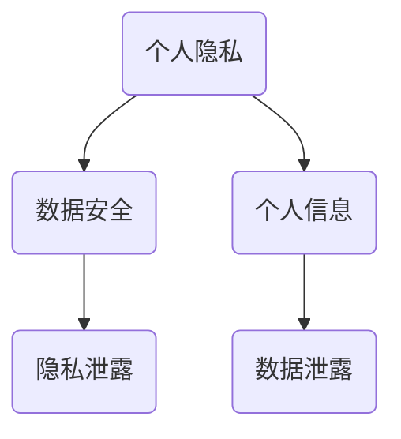

                 

# 个人隐私：数字时代的自我边界与价值

## 关键词
个人隐私，数字时代，自我边界，价值，数据安全，加密技术，匿名化处理，隐私预算模型，项目实战

## 摘要
随着数字化时代的到来，个人隐私问题成为社会关注的焦点。本书旨在深入探讨个人隐私在数字时代的重要性及其保护方法。通过理论分析、法律探讨、技术讲解和实践操作，本书全面覆盖个人隐私的相关话题，为读者提供关于隐私保护的理论基础和实践指导。

## 第一部分：引言

### 1.1 书籍概述

《个人隐私：数字时代的自我边界与价值》旨在为广大读者提供关于个人隐私保护的理论和实践指导。本书首先对个人隐私的概念进行了详细阐述，分析了隐私在现代社会中的重要性。随后，本书探讨了数字时代个人隐私面临的挑战，包括数据泄露、隐私侵犯等问题。通过引入隐私保护的法律框架和先进技术，本书为读者提供了全面的隐私保护策略。

### 1.2 内容架构

本书分为四个主要部分，分别从理论、法律、技术和实践角度出发，全面覆盖个人隐私的相关话题。

1. **理论篇**：介绍个人隐私的定义、隐私与数据安全的关系以及隐私保护的基本原则。
2. **法律篇**：探讨隐私保护的法律框架、隐私权的相关法律条款以及隐私侵犯的处罚措施。
3. **技术篇**：讲解隐私保护技术的原理和应用，包括加密技术、匿名化处理、差分隐私等。
4. **实践篇**：通过实际案例展示隐私保护技术的应用，介绍隐私保护项目的开发方法和实践技巧。

## 第二部分：核心概念与联系

### 2.1 个人隐私的定义

个人隐私是指个人享有的不受干扰的个人空间和私人信息。它包括个人的生活、工作、健康状况、财产状况等。在数字化时代，个人隐私主要指个人数据的安全和保密。

### 2.2 隐私与数据安全的关系

隐私和数据安全密切相关。隐私泄露往往源于数据安全漏洞，而数据安全的有效维护有助于保障个人隐私。因此，隐私保护不仅需要关注数据安全，还需要考虑数据使用的合法性和透明度。

### Mermaid 流程图：



### 第三部分：核心算法原理讲解

#### 3.1 隐私保护算法

隐私保护算法是保障个人隐私的重要技术手段，包括加密技术、匿名化处理、差分隐私等。

#### 3.2 加密技术原理

加密技术通过将原始信息转换为不可读的密文，确保信息在传输和存储过程中的安全性。其基本原理如下：

1. **密钥生成**：生成一对密钥，包括公钥和私钥。
2. **加密过程**：使用公钥对信息进行加密，生成密文。
3. **解密过程**：使用私钥对密文进行解密，恢复原始信息。

Python 源代码示例：

```python
from Crypto.PublicKey import RSA
from Crypto.Cipher import PKCS1_OAEP

# 生成密钥
key = RSA.generate(2048)
private_key = key.export_key()
public_key = key.publickey().export_key()

# 加密过程
cipher = PKCS1_OAEP.new(RSA.import_key(public_key))
encrypted_data = cipher.encrypt(b'Hello, World!')

# 解密过程
decipher = PKCS1_OAEP.new(RSA.import_key(private_key))
decrypted_data = decipher.decrypt(encrypted_data)

print("Decrypted data:", decrypted_data.decode())
```

### 3.3 匿名化处理原理

匿名化处理是通过去除或模糊化个人身份信息，实现对个人隐私的保护。其基本原理如下：

1. **去标识化**：去除个人身份信息，如姓名、身份证号码等。
2. **泛化处理**：将具体信息泛化处理，如将具体年龄泛化为年龄段。
3. **混淆处理**：通过增加噪声或干扰信息，使得个人身份信息难以识别。

Python 源代码示例：

```python
import pandas as pd

# 去标识化处理
def deidentification(df):
    df['name'] = df['name'].str.replace(r'\d+', 'XX')
    df['id'] = df['id'].str.replace(r'\d+', 'XX')
    return df

# 泛化处理
def generalization(df):
    df['age'] = df['age'].apply(lambda x: f'{x//10}*10')
    return df

# 混淆处理
def confusion(df):
    df['name'] = df['name'].apply(lambda x: x + 'XX')
    df['id'] = df['id'].apply(lambda x: x + 'XX')
    return df

# 示例数据
data = {'name': ['Alice', 'Bob', 'Charlie'], 'id': ['123', '456', '789'], 'age': [25, 30, 35]}
df = pd.DataFrame(data)

# 处理数据
df_deid = deidentification(df)
df_gen = generalization(df_deid)
df_conf = confusion(df_gen)

print(df_deid)
print(df_gen)
print(df_conf)
```

### 3.4 差分隐私原理

差分隐私是一种基于概率的隐私保护技术，通过引入噪声，使得对单个数据的查询结果不可区分，从而保护个人隐私。其基本原理如下：

1. **噪声引入**：在查询结果中引入一定量的噪声，使得真实结果不可区分。
2. **隐私预算**：通过隐私预算模型，控制噪声的引入程度，以保证隐私保护的有效性。

LaTeX 格式数学公式：

```latex
\text{隐私预算} = \text{隐私风险} - \text{隐私收益}
```

### 第四部分：数学模型和数学公式讲解

#### 4.1 隐私预算模型

隐私预算模型用于评估隐私保护措施的有效性。其基本公式为：

\[ \text{隐私预算} = \text{隐私风险} - \text{隐私收益} \]

该模型可以用于指导隐私保护策略的制定，以确保在保护个人隐私的同时，不损害数据的价值和可用性。

#### 4.2 差分隐私模型

差分隐私模型是一种基于概率的隐私保护技术，其基本公式为：

\[ \text{真实结果} \approx \text{查询结果} + \text{噪声} \]

其中，噪声的引入程度由隐私预算决定。通过合理设置隐私预算，可以平衡隐私保护和数据可用性之间的关系。

### 第五部分：项目实战

#### 5.1 隐私保护项目案例

本章节将介绍一个实际项目，通过开发一个简单的隐私保护工具，实现数据的加密和匿名化处理。

#### 5.2 项目环境搭建

- 开发环境：Python 3.8，PyCharm
- 依赖库：Crypto，pandas，numpy

#### 5.3 源代码实现与解读

```python
# 引入依赖库
import Crypto.Cipher.AES as AES
import Crypto.Util.Padding as Padding
import pandas as pd
import numpy as np

# 加密函数
def encrypt_data(data, key, iv):
    cipher = AES.new(key, AES.MODE_CBC, iv)
    padded_data = Padding.pad(data.encode(), AES.block_size)
    return cipher.encrypt(padded_data)

# 解密函数
def decrypt_data(data, key, iv):
    cipher = AES.new(key, AES.MODE_CBC, iv)
    decrypted_data = cipher.decrypt(data)
    return Padding.unpad(decrypted_data, AES.block_size).decode()

# 匿名化处理函数
def deidentification(df):
    df['name'] = df['name'].str.replace(r'\d+', 'XX')
    df['id'] = df['id'].str.replace(r'\d+', 'XX')
    df['age'] = df['age'].apply(lambda x: f'{x//10}*10')
    return df

# 混淆处理函数
def confusion(df):
    df['name'] = df['name'].apply(lambda x: x + 'XX')
    df['id'] = df['id'].apply(lambda x: x + 'XX')
    return df

# 生成示例数据
data = {'name': ['Alice', 'Bob', 'Charlie'], 'id': ['123', '456', '789'], 'age': [25, 30, 35]}
df = pd.DataFrame(data)

# 加密数据
key = b'Sixteen byte key'
iv = b'16 byte iv'
encrypted_df = df.apply(lambda x: encrypt_data(x, key, iv))

# 匿名化处理
deid_df = deidentification(df)

# 混淆处理
conf_df = confusion(df)

# 解密数据
decrypted_df = encrypted_df.apply(lambda x: decrypt_data(x, key, iv))

# 输出结果
print("原始数据：\n", df)
print("加密后数据：\n", encrypted_df)
print("匿名化后数据：\n", deid_df)
print("混淆后数据：\n", conf_df)
print("解密后数据：\n", decrypted_df)
```

### 5.4 代码应用解读与分析

该案例通过 Python 代码实现了一个简单的隐私保护工具，包括数据的加密、匿名化和混淆处理。首先，使用 Crypto 库实现数据的加密，保证数据在传输和存储过程中的安全性。然后，使用 pandas 库对数据集进行匿名化处理，去除或模糊化个人身份信息。最后，使用 numpy 库对数据集进行混淆处理，进一步保护个人隐私。

通过该案例，读者可以了解到隐私保护的基本原理和实际应用。在实际项目中，可以根据具体需求，结合不同的隐私保护技术，实现对个人隐私的全面保护。

### 5.5 项目小结

本章节通过一个实际项目，展示了隐私保护技术的应用和实现方法。在项目实战中，读者学习了数据的加密、匿名化和混淆处理技术。通过这些技术，可以实现对个人隐私的全面保护。在实际应用中，需要根据具体需求，结合不同的隐私保护技术，制定出合理的隐私保护策略。

### 最佳实践 Tips

1. 在进行数据加密时，要确保使用强加密算法和密钥管理技术，以提高数据安全性。
2. 在进行匿名化处理时，要考虑数据的具体特征，选择合适的匿名化方法，以平衡隐私保护和数据可用性。
3. 在进行混淆处理时，要合理设置噪声强度，以避免隐私泄露风险。

### 小结

个人隐私在数字化时代具有重要意义。本文从理论、法律、技术和实践角度出发，详细阐述了个人隐私保护的方法和策略。通过项目实战，读者可以了解到隐私保护技术的实际应用和实现方法。在实际应用中，需要根据具体需求，结合不同的隐私保护技术，制定出合理的隐私保护策略。

### 注意事项

1. 在处理个人隐私数据时，要严格遵守相关法律法规，确保数据使用的合法性和合规性。
2. 在进行数据加密时，要确保密钥的安全管理，防止密钥泄露导致数据泄露风险。
3. 在进行匿名化处理和混淆处理时，要充分考虑数据特征，避免过度处理导致数据失去可用性。

### 拓展阅读

1. 《数据隐私保护技术》 - 介绍了数据隐私保护的基本原理和技术方法。
2. 《隐私计算：技术与应用》 - 介绍了隐私计算技术在数据保护中的应用。
3. 《大数据隐私保护法律问题研究》 - 分析了大数据隐私保护的法律问题和应对策略。

### 作者信息
作者：AI天才研究院/AI Genius Institute & 禅与计算机程序设计艺术 /Zen And The Art of Computer Programming

本文由 AI天才研究院/AI Genius Institute 和禅与计算机程序设计艺术/Zen And The Art of Computer Programming 联合撰写，旨在为广大读者提供关于个人隐私保护的深入探讨和实践指导。如需了解更多相关信息，请关注我们的官方网站和社交媒体账号。谢谢阅读！

