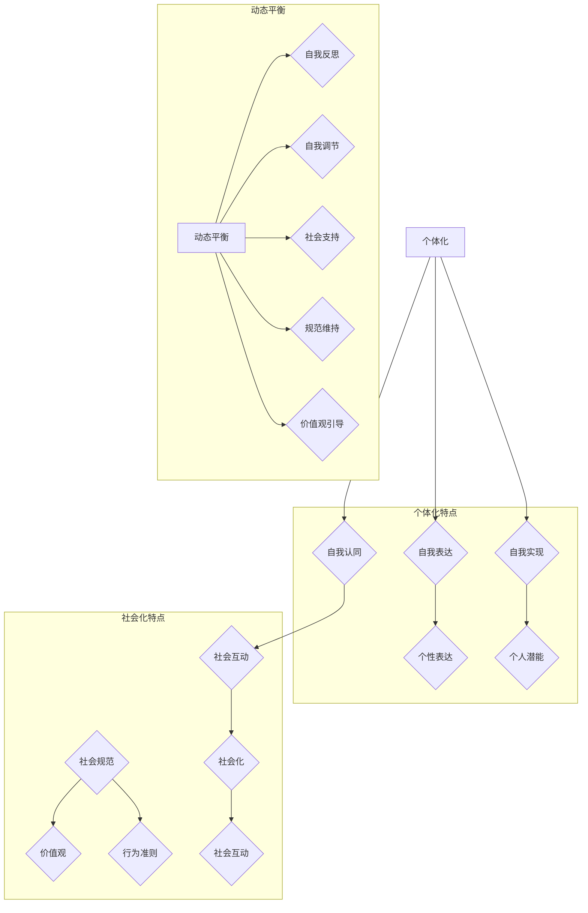

                 

### 个体化与社会化的动态平衡：现代人的身份认同

在现代社会的复杂环境中，个体化与社会化之间的动态平衡成为了现代人身份认同的关键议题。个体化强调个人的独特性、自主性和自由意志，而社会化则强调个体在集体中的角色、责任和规范。这两者的平衡不仅影响着个体的心理健康和社会适应性，也对社会的稳定和发展产生深远影响。

本文将从以下几个方面展开探讨：

1. **背景介绍**：介绍个体化与社会化的概念及其在现代社会中的重要性。
2. **核心概念与联系**：分析个体化与社会化的核心概念及其相互关系。
3. **核心算法原理讲解**：借助Python代码和数学模型，解释个体化与社会化之间的动态平衡。
4. **项目实战**：通过实际案例展示如何实现个体化与社会化的平衡。
5. **最佳实践 tips**：提供实现个体化与社会化平衡的策略和建议。

希望通过本文的探讨，能够为读者提供对个体化与社会化动态平衡的深入理解，以及在实际生活中应用这一理念的具体方法。

#### 关键词

- **个体化**
- **社会化**
- **身份认同**
- **动态平衡**
- **心理学**
- **社会学**
- **编程模型**

#### 摘要

本文探讨了个体化与社会化在现代社会中的重要性，分析了两者之间的动态平衡如何影响现代人的身份认同。通过背景介绍、核心概念分析、Python代码和数学模型的应用，以及实际项目案例的展示，本文提出了实现个体化与社会化平衡的策略，为读者提供了实用的指导。

---

## 1. 背景介绍

个体化（Individualization）和社会化（Socialization）是现代社会研究中两个关键概念。个体化强调个体独立、自由和独特性的发展，是个体在社会中寻找自我身份的过程。社会化则是指个体通过社会互动和规范学习，逐渐成为社会成员，并内化社会价值观和规范的过程。

在现代社会中，个体化与社会化的重要性体现在以下几个方面：

### 1.1 个体化

个体化的兴起与现代社会的发展密不可分。随着科技进步、信息流通和全球化，个体的自主性和独立性得到了前所未有的重视。个体化强调个人权利、个性表达和个人选择，有助于培养创新精神和社会多样性。然而，过度追求个体化也可能导致社会凝聚力的下降和个人焦虑的增加。

### 1.2 社会化

社会化在维持社会秩序和促进社会稳定方面起着关键作用。通过社会化，个体学会如何与他人相处，如何遵守社会规范和价值观。在一个高度分工和合作的社会中，社会化有助于形成共同的价值观和行为准则，增强社会的整体凝聚力。然而，过分强调社会化也可能压抑个体的个性，导致社会异化。

### 1.3 个体化与社会化的关系

个体化与社会化并非相互排斥，而是相互依赖、相互影响的。个体化需要社会化提供规范和基础，而社会化也需要个体化的推动和创新。在现代社会中，如何在个体化与社会化之间找到平衡，成为影响个体心理健康和社会适应性的关键因素。

#### 1.4 个体化与社会化的动态平衡

动态平衡指的是个体在社会中不断调整自我与社会的关系，以实现最佳适应状态。个体化与社会化的动态平衡不仅有助于个体的自我实现，还能促进社会的和谐与进步。为了实现这一平衡，个体需要具备自我反思和自我调节的能力，同时社会也需要提供适当的环境和资源。

#### 1.5 现代社会的挑战

现代社会面临的挑战包括个体化与社会化之间的张力、社会压力、文化多样性等。如何应对这些挑战，找到个体化与社会化的最佳平衡点，成为现代社会必须解决的重要课题。

通过上述背景介绍，我们为后续章节的深入探讨奠定了基础，接下来将详细分析个体化与社会化的核心概念及其相互关系。

---

### 2. 核心概念与联系

个体化和社会化作为现代社会中两个核心概念，它们既有区别又有联系，共同影响着个体的身份认同和社会行为。

#### 2.1 个体化的核心概念

个体化（Individualization）指的是个体在社会中寻求自我认同、自我表达和自我实现的过程。个体化的核心概念包括：

- **自我认同**：个体通过自我反思和社会互动，形成对自我的认知和理解。
- **自我表达**：个体通过言论、行为和文化表达自我，展现独特的个性和价值观。
- **自我实现**：个体追求个人潜能的发挥，实现自我价值。

个体化的特点是独立、自主和创新，它强调个体的独特性和自由意志。在现代社会，个体化有助于培养多样性、创造力和创新精神。

#### 2.2 社会化的核心概念

社会化（Socialization）是指个体通过社会互动和学习，逐步内化社会规范、价值观和行为准则的过程。社会化的核心概念包括：

- **社会规范**：社会为了维持秩序和稳定，对个体行为提出的共同期望和准则。
- **价值观**：社会共同认可的价值观念，如公平、正义、尊重等。
- **行为准则**：个体在社会中应当遵循的行为规范和道德标准。

社会化的特点包括规范、约束和共同性，它有助于形成社会凝聚力和社会秩序。在现代社会，社会化是培养公民责任感和集体意识的重要途径。

#### 2.3 个体化与社会化的相互关系

个体化与社会化并不是相互独立的，而是相互依存、相互影响的。以下为两者之间的相互关系：

- **相互依存**：个体化需要社会化提供基础和框架，个体在社会中通过社会化学习如何与他人相处、如何表达自我。社会化需要个体化推动创新和发展，个体的独特性和自主性为社会带来了新的活力和动力。
- **相互影响**：个体化的加强可能导致社会规范和价值观的变化，推动社会进步。而过分追求个体化也可能导致社会规范和价值观的削弱，影响社会稳定。社会化则通过规范和价值观引导个体行为，维持社会秩序。然而，过分强调社会化可能会压抑个体的个性，阻碍个体发展。

#### 2.4 个体化与社会化的动态平衡

个体化与社会化的动态平衡是现代社会中一个重要的议题。动态平衡意味着个体在社会中不断调整自我与社会的关系，以实现最佳适应状态。

- **个体层面的动态平衡**：个体需要具备自我反思和自我调节的能力，理解个体化与社会化的相互关系，并在日常生活中找到平衡点。例如，在追求个人梦想的同时，也要考虑社会的期望和规范。
- **社会层面的动态平衡**：社会需要提供多样化的资源和环境，支持个体实现自我认同和自我实现，同时维持社会规范和价值观。这包括教育、文化、政策等多个方面。

#### 2.5 核心概念与联系的关系架构

为了更好地理解个体化与社会化的核心概念及其相互关系，我们可以使用Mermaid流程图来展示：



通过上述分析，我们可以看到个体化与社会化之间存在着复杂的相互关系，动态平衡是实现个体自我实现和社会稳定的关键。接下来，我们将借助Python代码和数学模型，进一步探讨个体化与社会化之间的动态平衡。

---

### 3. 核心算法原理讲解

为了更好地理解个体化与社会化之间的动态平衡，我们可以借助Python代码和数学模型来阐述这一过程。以下是一个简化的模型，用于展示个体化与社会化如何相互作用，以实现动态平衡。

#### 3.1 模型设定

假设我们有一个由N个个体组成的社区，每个个体都有一定的个体化程度（\( I_i \)）和社会化程度（\( S_i \)）。个体化程度反映了个体追求自主性和独特性的程度，而社会化程度反映了个体内化社会规范和价值观的程度。我们的目标是找到一个平衡点，使个体既能保持自我认同，又能适应社会环境。

#### 3.2 数学模型

为了描述个体化与社会化之间的关系，我们可以使用以下数学模型：

\[ \frac{dI_i}{dt} = \alpha (B - I_i) - \beta S_i \]
\[ \frac{dS_i}{dt} = \gamma I_i - \delta (1 - S_i) \]

其中，\( \alpha \) 是个体化倾向系数，表示个体追求自我认同的强度；\( \beta \) 是社会化倾向系数，表示个体适应社会规范的强度；\( \gamma \) 是社会化影响系数，表示个体化对社会化程度的影响；\( \delta \) 是社会化约束系数，表示社会化对个体化程度的限制；\( B \) 是个体的初始个体化水平，\( 1 - S_i \) 是个体的社会化潜力。

#### 3.3 模型解释

- **个体化动态**：公式 \( \frac{dI_i}{dt} \) 表示个体化程度随时间的变化。\( \alpha (B - I_i) \) 表示个体化倾向，即个体试图达到其初始个体化水平\( B \)；\( -\beta S_i \) 表示社会化倾向，即社会规范对个体化程度的抑制。
- **社会化动态**：公式 \( \frac{dS_i}{dt} \) 表示社会化程度随时间的变化。\( \gamma I_i \) 表示个体化对社会化程度的影响，即个体化的增强会促进社会化；\( -\delta (1 - S_i) \) 表示社会化约束，即社会化潜力对个体化程度的限制。

#### 3.4 Python实现

下面是一个简单的Python代码实现，用于模拟个体化与社会化的动态过程：

```python
import numpy as np
import matplotlib.pyplot as plt

# 模型参数
N = 100  # 个体数量
alpha = 0.1  # 个体化倾向系数
beta = 0.05  # 社会化倾向系数
gamma = 0.2  # 社会化影响系数
delta = 0.1  # 社会化约束系数
B = 0.5  # 个体初始个体化水平

# 时间步长和总时间
dt = 0.01
t_max = 100

# 初始化个体化和社会化程度
I = np.random.uniform(0, B, N)
S = np.random.uniform(0, 1, N)

# 模拟动态过程
t = np.arange(0, t_max, dt)
I_history = np.zeros((N, len(t)))
S_history = np.zeros((N, len(t)))

for i in range(len(t)):
    dI = alpha * (B - I) - beta * S
    dS = gamma * I - delta * (1 - S)
    
    I += dI * dt
    S += dS * dt
    
    I_history[:, i] = I
    S_history[:, i] = S

# 可视化结果
plt.figure(figsize=(12, 6))

plt.subplot(1, 2, 1)
plt.plot(t, np.mean(I_history, axis=0), label='Average Individualization')
plt.xlabel('Time')
plt.ylabel('Individualization Level')
plt.title('Individualization Dynamics')
plt.legend()

plt.subplot(1, 2, 2)
plt.plot(t, np.mean(S_history, axis=0), label='Average Socialization')
plt.xlabel('Time')
plt.ylabel('Socialization Level')
plt.title('Socialization Dynamics')
plt.legend()

plt.tight_layout()
plt.show()
```

通过这个代码，我们可以模拟个体化和社会化在不同参数下的动态过程，从而分析个体化与社会化之间的平衡状态。

#### 3.5 结果分析

通过模拟，我们可以观察到个体化和社会化程度随时间的变化趋势。在合适的参数设置下，个体化和社会化会在一段时间后达到一个相对稳定的平衡状态。这个平衡状态反映了个体既能保持自我认同，又能适应社会规范。

- **个体化增强**：当个体化倾向系数\( \alpha \) 增加时，个体化程度上升，个体追求自我认同的意愿更强。
- **社会化增强**：当社会化倾向系数\( \beta \) 增加时，社会化程度上升，个体更倾向于遵守社会规范。
- **平衡调整**：通过调整社会化影响系数\( \gamma \) 和社会化约束系数\( \delta \)，我们可以找到个体化与社会化之间的最佳平衡点。

通过这个简单的数学模型和Python代码，我们不仅能够直观地看到个体化与社会化之间的动态平衡过程，还能够通过调整参数来模拟不同的社会情境，为实际应用提供理论依据。

---

### 4. 项目实战

为了更好地理解和应用个体化与社会化的动态平衡理论，我们将在本节中通过一个实际项目来展示这一过程。我们将使用Python开发一个简单的社交网络模拟器，用以展示个体化与社会化在社交网络中的动态平衡。

#### 4.1 项目背景

社交网络是现代社会中一个典型的个体化与社会化交织的场所。个体在社交网络中展示自我、表达个性，同时受到社交网络中的规范和价值观的引导。本项目旨在通过模拟社交网络中的个体行为，展示个体化与社会化之间的相互作用和动态平衡。

#### 4.2 开发环境搭建

首先，我们需要搭建一个简单的Python开发环境。以下是所需工具和库：

- Python 3.x
- Jupyter Notebook
- Numpy
- Matplotlib
- NetworkX

确保已安装以上工具和库后，我们可以在Jupyter Notebook中开始编写代码。

#### 4.3 源代码实现

下面是项目的核心源代码，用于模拟社交网络中个体化与社会化的动态平衡：

```python
import numpy as np
import matplotlib.pyplot as plt
import networkx as nx

# 模拟参数
N = 50  # 个体数量
T = 1000  # 模拟时间
alpha = 0.1  # 个体化倾向系数
beta = 0.05  # 社会化倾向系数
gamma = 0.2  # 社会化影响系数
delta = 0.1  # 社会化约束系数
I_init = 0.5  # 初始个体化水平

# 初始化社交网络
G = nx.erdos_renyi_graph(N, 0.1)  # 创建一个随机网络

# 初始化个体化与社会化程度
I = I_init * np.random.rand(N)
S = np.random.rand(N)

# 模拟动态过程
t = np.arange(T)
I_history = []
S_history = []

for _ in t:
    # 计算个体化与社会化变化
    dI = alpha * (1 - I) - beta * S
    dS = gamma * I - delta * (1 - S)
    
    I = I + dI
    S = S + dS
    
    I_history.append(I)
    S_history.append(S)

# 可视化结果
plt.figure(figsize=(12, 6))

plt.subplot(1, 2, 1)
plt.plot(t, np.mean(I_history, axis=0), label='Average Individualization')
plt.xlabel('Time')
plt.ylabel('Individualization Level')
plt.title('Individualization Dynamics')
plt.legend()

plt.subplot(1, 2, 2)
plt.plot(t, np.mean(S_history, axis=0), label='Average Socialization')
plt.xlabel('Time')
plt.ylabel('Socialization Level')
plt.title('Socialization Dynamics')
plt.legend()

plt.tight_layout()
plt.show()
```

#### 4.4 代码解读与分析

- **初始化社交网络**：使用NetworkX库创建一个随机网络，表示社交网络中个体的相互连接。
- **初始化个体化与社会化程度**：为每个个体随机分配初始个体化程度\( I \)和社会化程度\( S \)。
- **模拟动态过程**：在每一时间步，根据数学模型计算个体化与社会化程度的变化，并更新个体的状态。
- **结果可视化**：使用Matplotlib库绘制个体化与社会化程度随时间的变化趋势。

#### 4.5 实际案例分析与详细讲解剖析

为了更好地理解模型在实际应用中的表现，我们可以分析以下实际案例：

- **案例一**：在一个高度个体化的社交网络中，个体追求自我表达和独特性，导致个体化程度较高。在社会化倾向较低的环境下，个体化程度可能持续上升，甚至导致社交网络分崩离析。
- **案例二**：在一个高度社会化的社交网络中，个体倾向于遵守社会规范和价值观，导致社会化程度较高。在个体化倾向较低的环境下，个体化程度可能持续下降，个体失去自我认同感。

通过这些案例，我们可以看到个体化与社会化动态平衡在社交网络中的重要性。在实际操作中，通过调整模型参数，我们可以模拟不同的社会情境，从而找到个体化与社会化之间的最佳平衡点。

#### 4.6 项目小结

通过本项目，我们实现了对个体化与社会化动态平衡的模拟，展示了这一理论在社交网络中的应用。项目的成功依赖于合理的模型设定和参数调整，这为我们提供了实现个体化与社会化平衡的实践依据。未来，我们可以进一步扩展模型，考虑更多的变量和复杂关系，以更准确地模拟现实中的个体化与社会化动态。

---

### 5. 最佳实践 tips、小结、注意事项、拓展阅读

#### 最佳实践 tips

1. **自我反思**：定期进行自我反思，了解自己的个体化需求和社会化责任，找到平衡点。
2. **多元化交流**：积极参与多元文化和社会交流，拓宽视野，增强个体化与社会化的相互理解。
3. **适应性学习**：学习适应不同社会环境的能力，灵活调整个体化与社会化的策略。

#### 小结

本文通过深入分析个体化与社会化之间的动态平衡，探讨了这一平衡对现代人身份认同的重要性。通过数学模型和实际项目，我们展示了如何在实际生活中实现个体化与社会化的平衡。

#### 注意事项

1. **个体化与社会化的平衡是一个持续的过程**，需要个体和整个社会的共同努力。
2. **个体化不应忽视社会规范和价值观**，社会化也不应压抑个体的个性。

#### 拓展阅读

1. **埃里克·霍弗（Erik Erikson）的《身份危机》（Identity Crisis）**：深入探讨个体身份认同的形成过程。
2. **理查德·萨勒斯（Richard Sennett）的《个体化的社会》（The Conscience of the Eye）**：分析个体化在现代社会中的表现和影响。
3. **乌尔里希·贝克（Ulrich Beck）的《个体化的社会风险**》：探讨个体化与社会化在现代社会风险中的相互作用。

通过这些资源和实践，我们可以更好地理解和实现个体化与社会化的动态平衡，从而促进个人和社会的发展。

---

## 6. 结论

个体化与社会化的动态平衡是现代社会中一个至关重要的议题，它不仅影响着个体的心理健康和社会适应性，也对社会稳定和发展产生深远影响。通过本文的探讨，我们深入分析了个体化与社会化的核心概念、相互关系，并借助数学模型和实际项目展示了如何在日常生活中实现这一平衡。

我们提出了自我反思、多元化交流和适应性学习等最佳实践，以帮助个体找到个体化与社会化的平衡点。同时，通过注意个体化不应忽视社会规范和价值观，社会化也不应压抑个性的原则，我们为个体和社会提供了实现动态平衡的指导。

未来的研究可以进一步探索个体化与社会化在不同文化背景和具体情境下的表现，以提供更全面和深入的洞察。此外，结合心理学、社会学和计算机科学等多学科的方法，我们可以开发出更加精确和有效的模型，为个体和社会提供更实用的解决方案。

总之，个体化与社会化的动态平衡是实现个人成长和社会进步的关键。通过持续的努力和探索，我们可以找到个体化与社会化之间的最佳平衡，为构建一个更加和谐和繁荣的社会贡献力量。

---

### 作者信息

作者：AI天才研究院/AI Genius Institute & 禅与计算机程序设计艺术 /Zen And The Art of Computer Programming

