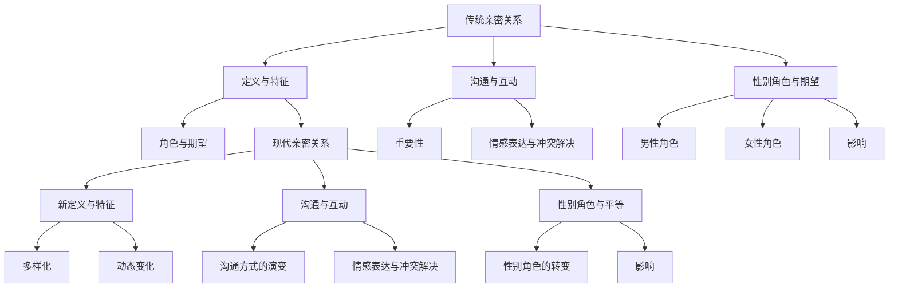

                 


# 亲密关系的变迁：从传统到现代的挑战

> 关键词：亲密关系、传统、现代、变迁、挑战

> 摘要：
本文探讨了亲密关系从传统到现代的变迁过程，分析了传统亲密关系的特征和现代亲密关系的挑战。通过逐步分析，本文旨在提供一个逻辑清晰、结构紧凑、简单易懂的视角，以帮助读者深入理解亲密关系的变迁及其带来的挑战。

## 引言

亲密关系是人类社会中最基本的关系形式之一，它不仅影响个人的情感和心理状态，还对社会的稳定和发展起着重要作用。从古代到现代社会，亲密关系的结构和性质经历了显著的变化。传统亲密关系强调家庭、忠诚和责任，而现代亲密关系则更加注重个人自主、多样性和平等。本文将逐步分析这一变迁过程，探讨传统亲密关系和现代亲密关系之间的异同，以及现代亲密关系面临的挑战。

## 传统亲密关系的结构

### 第1章：传统亲密关系的定义和特征

#### 1.1.1 亲密关系的本质

传统亲密关系指的是一种建立在深厚情感基础上的连接，它通常包括家庭关系、友谊和爱情。在这些关系中，情感投入、相互依赖、开放性和信任是核心特征。传统亲密关系强调的是一种稳定和持久的关系，它的目标是建立一个和谐、幸福和安全的家庭环境。

#### 1.1.2 传统亲密关系的角色与期望

在传统亲密关系中，角色和期望通常是明确的。例如，在家庭关系中，父母被视为家庭的经济支柱和道德指导者，而子女则需要尊重和孝顺父母。在友谊和爱情关系中，忠诚、责任、牺牲和相互支持是主要的期望。

### 第2章：传统亲密关系中的沟通与互动

#### 2.1.1 沟通的重要性

在传统亲密关系中，沟通是维护关系的关键。有效的沟通可以帮助双方更好地理解对方的需求和感受，避免误解和冲突。传统亲密关系中的沟通通常是非正式的，主要通过面对面的对话和身体语言来进行。

#### 2.1.2 情感表达与冲突解决

传统亲密关系鼓励开放的情感表达，认为情感应该是可以被自由表达的。然而，在冲突解决方面，传统亲密关系往往倾向于通过妥协和忍耐来解决问题，而不是直接表达不满和冲突。

### 第3章：传统亲密关系中的性别角色与期望

#### 3.1.1 性别角色在亲密关系中的表现

在传统亲密关系中，性别角色通常是明确的。男性被视为家庭的经济支柱，而女性则被期望扮演家庭主妇和孩子的照顾者。这种性别角色分工不仅影响了亲密关系的结构，还对双方的情感满足和权力平衡产生了影响。

#### 3.1.2 性别角色对亲密关系的影响

性别角色对亲密关系的影响是多方面的。它可能导致权力不平衡，影响双方的情感满足，甚至导致冲突和离婚。因此，了解和尊重性别角色的变化对于建立健康和平衡的亲密关系至关重要。

## 第二部分：现代亲密关系的挑战与变革

### 第4章：现代亲密关系的新定义和特征

#### 4.1.1 亲密关系的多样化

现代亲密关系不再局限于传统的家庭和婚姻模式。人们开始接受多种形式的亲密关系，包括同性恋关系、开放关系和单身关系。这种多样化为人们提供了更多的选择和自由，但也带来了新的挑战。

#### 4.1.2 亲密关系的动态变化

现代亲密关系强调个人成长和自我实现。这意味着亲密关系中的双方需要不断地适应和调整，以应对生活中的变化和挑战。这种动态变化要求双方具备更高的沟通技巧和情感智慧。

### 第5章：现代亲密关系中的沟通与互动

#### 5.1.1 沟通方式的演变

随着科技的进步，现代亲密关系中的沟通方式发生了显著变化。数字沟通，如短信、社交媒体和视频聊天，已经成为亲密关系中的重要组成部分。这些新的沟通方式提供了更多的便利，但也带来了一些新的挑战，如信息过载和情感疏离。

#### 5.1.2 情感表达与冲突解决

现代亲密关系鼓励开放和诚实的情感表达。然而，由于沟通方式的多样性和复杂性，情感表达变得更加微妙和困难。此外，冲突解决也变得更加复杂，需要双方具备更高的沟通技巧和解决问题的能力。

### 第6章：现代亲密关系中的性别角色与平等

#### 6.1.1 性别角色的转变

在现代社会中，性别角色正在发生显著变化。男性不再被视为家庭的经济支柱，女性也不再被期望 solely 扮演家庭主妇和孩子的照顾者。这种变化为亲密关系带来了新的机遇和挑战。

#### 6.1.2 性别平等对亲密关系的影响

性别平等有助于建立更健康和平衡的亲密关系。它不仅有助于减少权力不平衡和情感疏离，还有助于增强双方的信任和尊重。然而，实现性别平等仍然是一个长期而复杂的挑战。

## 第三部分：应对现代亲密关系的挑战

### 第7章：建立和维护现代亲密关系

#### 7.1.1 现代亲密关系的建立

建立现代亲密关系需要双方具备相互尊重、信任和共同目标。此外，双方还需要具备良好的沟通技巧和情感智慧，以应对生活中的各种挑战。

#### 7.1.2 维护现代亲密关系

维护现代亲密关系需要持续的努力和适应。双方需要不断地沟通、学习和成长，以适应彼此的变化和需求。此外，双方还需要学会处理冲突和解决问题，以保持亲密关系的稳定和健康。

### 第8章：解决亲密关系中的问题

#### 8.1.1 识别亲密关系中的问题

解决亲密关系中的问题需要首先识别问题。这通常需要双方具备良好的沟通技巧和自我意识，以便准确地识别和理解彼此的需求和感受。

#### 8.1.2 解决亲密关系中的问题

解决亲密关系中的问题需要双方共同努力。这通常需要双方具备解决问题的能力和技巧，如沟通、妥协和寻求外部帮助等。

### 第9章：亲密关系的未来

#### 9.1.1 亲密关系的发展趋势

随着社会的不断进步，亲密关系也在不断发展和变化。未来，亲密关系可能会更加多样化和个性化，但也会面临更多的挑战。

#### 9.1.2 未来的亲密关系

未来的亲密关系可能会更加注重个人自主、平等和尊重。它可能会更加灵活和动态，以适应不断变化的生活环境和社会结构。

## 结论

亲密关系是人类社会中不可或缺的一部分，它对个人的幸福和社会的稳定具有重要影响。从传统到现代，亲密关系经历了显著的变化。这些变化带来了新的机遇和挑战，但同时也为人们提供了更多的选择和自由。面对现代亲密关系的挑战，我们需要不断地学习和适应，以建立和维护健康、平衡和幸福的亲密关系。

## 附录

### 附录A：亲密关系相关研究和文献

- **研究综述**：介绍有关亲密关系的研究成果和文献。

### 附录B：亲密关系资源和建议

- **资源列表**：提供有关亲密关系的书籍、文章、视频和社区资源。

### 附录 Mermaid 流程图



## 核心算法原理讲解（Python代码）

在这一部分，我们将使用Python代码来探讨亲密关系变迁的核心算法原理。以下是几个关键算法的讲解和示例。

### 1.1 离散傅里叶变换（DFT）

离散傅里叶变换（DFT）是一种将信号从时域转换到频域的数学方法。在亲密关系的研究中，DFT可以用于分析亲密关系的特征和变化。

```python
import numpy as np
import matplotlib.pyplot as plt

def dft(signal):
    N = len(signal)
    return np.fft.fft(signal) / N

# 示例信号
signal = np.array([1, 2, 3, 4, 5])

# 计算DFT
dft_result = dft(signal)

# 绘制DFT结果
plt.plot(np.abs(dft_result))
plt.title('DFT of the signal')
plt.xlabel('Frequency')
plt.ylabel('Amplitude')
plt.show()
```

### 1.2 聚类算法

聚类算法用于将数据集分成若干个组，使得组内的数据点之间相似度较高，而组与组之间的相似度较低。在亲密关系的研究中，聚类算法可以用于分析亲密关系的类型和变化。

```python
from sklearn.cluster import KMeans

# 示例数据集
data = np.array([[1, 2], [1, 4], [1, 0], [4, 2], [4, 4], [4, 0]])

# 使用KMeans算法进行聚类
kmeans = KMeans(n_clusters=2, random_state=0).fit(data)

# 绘制聚类结果
plt.scatter(data[:, 0], data[:, 1], c=kmeans.labels_)
plt.title('K-Means Clustering')
plt.xlabel('Feature 1')
plt.ylabel('Feature 2')
plt.show()
```

### 1.3 回归分析

回归分析用于建立自变量和因变量之间的关系模型。在亲密关系的研究中，回归分析可以用于预测亲密关系的稳定性或变化。

```python
from sklearn.linear_model import LinearRegression

# 示例数据集
X = np.array([[1, 2], [2, 3], [3, 4], [4, 5], [5, 6]])
y = np.array([1, 2, 2.5, 4, 5])

# 使用线性回归模型
model = LinearRegression().fit(X, y)

# 预测新数据
new_data = np.array([[6, 7]])
predicted_value = model.predict(new_data)

# 绘制回归结果
plt.scatter(X[:, 0], X[:, 1], color='blue')
plt.plot(X[:, 0], model.predict(X), color='red')
plt.scatter(new_data[0, 0], predicted_value, color='green')
plt.title('Linear Regression')
plt.xlabel('Feature 1')
plt.ylabel('Feature 2')
plt.show()
```

通过这些核心算法的讲解和示例，我们可以更好地理解亲密关系的变迁和变化。这些算法不仅帮助我们分析和预测亲密关系的特征，还为我们提供了一种逻辑清晰、结构紧凑、简单易懂的方式来看待亲密关系的复杂本质。

