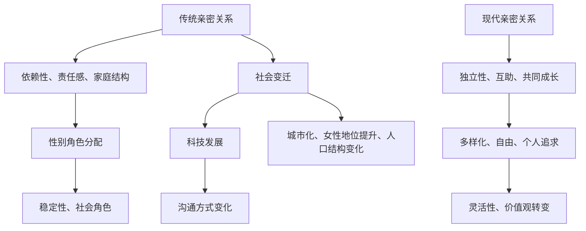
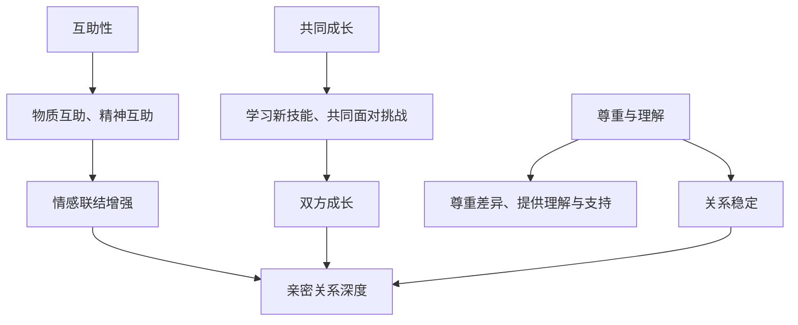

                 

### 前言

《亲密关系的现代重构：从依赖到互助的演进》旨在探讨在现代社会背景下，亲密关系的本质及其演变过程。随着科技和社会结构的不断变迁，人们对亲密关系的理解与需求也发生了显著变化。本书的目的是为读者提供一个系统、深入的分析框架，帮助他们更好地理解和应对这些变化。

本书主要面向那些希望深入了解亲密关系本质，并寻求在现代社会中建立和维护健康亲密关系的人。无论是心理学研究者、情感咨询师，还是普通大众，都可以从本书中获得有价值的见解和实用的建议。同时，对于那些在亲密关系中遇到挑战的人，本书也提供了有效的策略和解决方案。

本文将分章节讨论以下主题：

1. **亲密关系的定义与演进**：首先回顾亲密关系的定义，并探讨从传统到现代的演变过程。
2. **依赖性在亲密关系中的作用**：分析依赖性对亲密关系的影响，以及如何平衡依赖与独立性。
3. **现代亲密关系的特征**：描述现代亲密关系的特点，如互助、共同成长等。
4. **沟通与亲密关系**：讨论沟通在亲密关系中的重要性，提供沟通技巧和建议。
5. **冲突解决与亲密关系**：探讨亲密关系中的冲突及其解决方法。
6. **亲密关系的可持续性**：讨论如何维持长久的亲密关系。
7. **未来亲密关系的展望**：预测亲密关系可能的发展方向，以及应对这些变化的策略。

通过这些章节，我们将一步步深入探讨亲密关系的各个方面，旨在为读者提供一个全面、系统、易懂的参考框架，帮助他们更好地理解和应对亲密关系中的各种挑战。

### 第一章：亲密关系的定义与演进

#### 1.1 亲密关系的概念

亲密关系是指建立在情感、信任和深层次了解基础上的关系，通常涉及情感上的联结、共享生活的意愿以及对彼此福祉的关注。传统上，亲密关系主要指的是家庭关系，如夫妻、亲子关系等。然而，随着社会的发展和价值观的多元化，亲密关系的定义也在不断扩展，涵盖了更广泛的领域，如友谊、同事关系等。

在现代社会中，亲密关系的概念已经超越了传统意义上的家庭关系。人们开始意识到，无论关系的性质如何，只要能够提供情感支持、理解和关怀，都可以被视为亲密关系。这种转变反映了人们对自我实现和情感需求的更高追求。

#### 1.2 传统亲密关系模式

传统亲密关系模式主要建立在依赖性、责任感和家庭结构的基础上。在传统观念中，亲密关系被视为一种责任和义务，双方需要为对方的生活提供保障，如经济支持、照顾子女等。这种模式强调家庭的社会角色和稳定性，认为亲密关系是社会秩序和个人身份的基础。

例如，在传统的夫妻关系中，男性通常被视为家庭的支柱，负责经济来源，而女性则承担家庭管理和照顾孩子的角色。这种性别角色的分配虽然在过去是普遍的，但随着社会观念的转变，越来越多的人开始质疑这种模式是否公平和合理。

#### 1.3 现代亲密关系的变化

现代亲密关系与传统模式相比，发生了显著的变化。首先，依赖性逐渐减弱，独立性得到了更多的重视。现代社会中，人们更加注重个人成长和自我实现，愿意为自己负责，而不是过度依赖他人。

其次，现代亲密关系更加注重互助和共同成长。在现代社会，人们认识到，建立健康亲密关系的关键在于双方的相互支持和共同进步。这种模式鼓励双方在情感、职业和生活各个方面互相帮助，共同克服困难，实现目标。

第三，现代亲密关系更加灵活和多样化。随着社会结构的变迁，人们的婚姻和人际关系模式也变得更加多样。例如，现代情侣可以选择不结婚，或者选择开放式关系，这反映了个体对亲密关系自由的追求。

总之，现代亲密关系在概念、模式和价值观上都与传统模式有所不同。这些变化既反映了社会发展的趋势，也反映了人们对自我和关系的深刻思考。在接下来的章节中，我们将进一步探讨依赖性在亲密关系中的作用，以及现代亲密关系的特征和沟通技巧。

#### 1.4 社会变迁对亲密关系的影响

社会变迁对亲密关系产生了深远的影响，尤其是城市化、女性地位提升、人口结构变化和科技发展等方面。首先，城市化进程加速，人们的居住和工作方式发生了变化，导致亲密关系的物理距离增加，沟通变得更加困难。这种物理距离的拉大，可能导致亲密关系的紧张和疏远。

其次，女性地位的提升改变了传统亲密关系中的性别角色分配。随着女性在职场和社会中的地位不断提高，她们不再仅仅局限于家庭角色，而是追求个人职业发展和自我实现。这种变化不仅打破了传统的家庭结构，也使得亲密关系中的权力平衡发生了变化，进一步促进了亲密关系的重构。

人口结构的变化也对亲密关系产生了影响。例如，随着人口老龄化和单身率的上升，传统的家庭结构和婚姻观念受到挑战。越来越多的人选择单身或非传统的伴侣关系，这反映了人们对亲密关系的不同需求和价值观。

最后，科技的发展对亲密关系的影响不可忽视。互联网和社交媒体的普及，使人们能够更加便捷地进行沟通和交流，但也可能导致亲密关系的疏离和误解。例如，虚拟沟通虽然提供了更多的交流机会，但往往缺乏真实的情感表达和身体接触，这可能导致亲密关系的质量下降。

总之，社会变迁对亲密关系的影响是多方面的，这些变化既带来了新的机遇，也提出了新的挑战。理解这些变化，有助于我们更好地应对现代亲密关系中的各种挑战，促进健康的亲密关系发展。

#### Mermaid 流程图：传统与现代亲密关系的演变过程

该流程图展示了传统与现代亲密关系的演变过程，以及社会变迁对这些关系模式的影响。通过分析这些关键节点，我们可以更清晰地理解亲密关系在不同历史时期和社会背景下的变化和发展。

### 第二章：依赖性在亲密关系中的作用

#### 2.1 依赖性的定义与分类

依赖性是指个体在心理上或情感上对另一个人的需要和依赖程度。在亲密关系中，依赖性通常表现为双方在情感、心理和经济上的互相依赖。依赖性可以细分为三种主要类型：情感依赖、心理依赖和物质依赖。

- **情感依赖**：指个体在情感上对伴侣的强烈需求，渴望得到对方的支持、理解和安慰。情感依赖是亲密关系中最常见的类型，因为它反映了双方之间的情感联结和信任。
- **心理依赖**：指个体在心理上对另一个人的依赖，如依赖对方的决策、意见和存在。这种依赖可能会导致个体在心理上失去独立性，过度依赖伴侣的认可和指导。
- **物质依赖**：指个体在经济或物质上对另一个人的依赖，例如依赖伴侣的经济支持或物质资源。物质依赖通常与经济状况和家庭结构有关，但在亲密关系中也可能导致权力不平衡。

#### 2.2 依赖性对亲密关系的影响

依赖性在亲密关系中起着双重作用：既可以促进亲密关系的建立和稳定，也可能成为亲密关系的障碍。

- **积极影响**：
  - **增强情感联结**：情感依赖有助于增强双方的情感联结，促进亲密关系的建立和发展。当个体感受到伴侣的支持和理解时，他们更有可能建立深厚的情感纽带。
  - **提供安全感**：依赖性可以为双方提供安全感，使个体在遇到困难和挑战时感到被支持和保护。这种安全感有助于减轻压力和焦虑，增强亲密关系的稳定性。
  - **促进共同成长**：心理依赖可以促进双方共同成长，因为依赖伴侣的意见和决策可以帮助个体学习和改进。通过这种互动，双方可以共同提高，实现个人和关系的成长。

- **消极影响**：
  - **削弱独立性**：过度的依赖性可能导致个体在心理上和经济上失去独立性，过度依赖伴侣的决策和支持。这种情况下，个体可能无法独立面对生活中的挑战，影响个人成长和自我实现。
  - **产生权力不平衡**：物质依赖可能导致亲密关系中的权力不平衡，特别是当依赖的一方在经济上完全依赖另一方时。这种不平衡可能导致依赖方在关系中处于弱势地位，影响双方的平等和和谐。
  - **引发情感冲突**：依赖性过高可能导致双方在情感上产生冲突，因为依赖方可能会过度依赖伴侣，而伴侣可能感到压力和不满。这种情感冲突可能导致亲密关系的紧张和破裂。

#### 2.3 平衡依赖性与独立性

在亲密关系中，平衡依赖性与独立性是实现健康关系的关键。以下是一些策略，帮助个体在依赖性和独立性之间找到合适的平衡：

- **增强自我意识**：个体需要清楚地认识到自己的依赖性，并了解依赖性对自己和关系的影响。通过自我反思和认知行为疗法，个体可以更好地管理自己的依赖性，提高独立性。
- **培养自主能力**：个体应努力培养自主能力，包括经济独立、心理独立和生活自主。这可以通过职业发展、财务管理和自我提升来实现。
- **建立平等的沟通**：双方应建立平等的沟通模式，确保彼此的需求和感受得到尊重和理解。通过有效的沟通，双方可以共同解决问题，避免依赖性过高导致的冲突。
- **共同设立目标和价值观**：双方可以共同设立目标和价值观，促进共同成长。这种共同的愿景有助于增强双方的情感联结，同时保持独立性。

总之，依赖性在亲密关系中既有积极的影响，也有潜在的消极影响。通过理解依赖性的类型、影响和管理策略，个体和伴侣可以更好地平衡依赖性与独立性，建立健康、稳定的亲密关系。

### 第三章：现代亲密关系的特征

#### 3.1 互助性

在现代社会中，互助性已成为现代亲密关系的一个重要特征。互助性不仅体现在双方在物质上的相互帮助，更体现在精神上的支持和鼓励。以下是一些具体表现：

- **物质互助**：伴侣之间在经济上的互助是现代亲密关系中的常见现象。例如，双方共同分担家庭开支，共同承担子女教育费用，甚至在经济困难时期互相支持，共同度过难关。
- **精神互助**：精神互助则更为深刻和广泛。伴侣之间在情感上的支持、鼓励和理解是维持亲密关系的重要因素。例如，当一方遇到工作压力或心理困扰时，另一方可以提供情感上的支持和鼓励，帮助对方度过难关。

#### 3.2 共同成长

共同成长是现代亲密关系的另一个重要特征。在传统亲密关系中，双方可能各自为政，彼此的生活相对独立。而在现代亲密关系中，共同成长被视为双方共同追求的目标。

- **共同学习新技能**：伴侣可以一起参加课程或培训，学习新的技能或知识。这不仅有助于提升个人能力，还能增进双方的感情，共同分享学习的乐趣。
- **共同面对挑战**：共同成长还意味着双方在面对生活中的挑战时，能够共同承担和解决。例如，当一方遇到职业瓶颈或家庭纠纷时，另一方可以提供支持和建议，共同寻找解决方案。

#### 3.3 对彼此的尊重与理解

对彼此的尊重与理解是现代亲密关系的基石。随着社会观念的转变，人们越来越意识到在亲密关系中，尊重和理解对方的重要性。

- **尊重差异**：每个人都有自己独特的性格、兴趣和需求。在亲密关系中，尊重彼此的差异，意味着接受和欣赏对方的独特性，而不是试图改变对方。例如，伴侣可能有着不同的兴趣爱好，但尊重和理解这些差异，可以增进双方的默契和和谐。
- **提供理解与支持**：当伴侣遇到困难或挫折时，提供理解与支持是维系亲密关系的关键。这包括倾听对方的烦恼，给予建议和帮助，以及共同面对挑战。

总之，现代亲密关系的特征包括互助性、共同成长和对彼此的尊重与理解。这些特征不仅有助于增强双方的情感联结，还能促进亲密关系的稳定和长期发展。

#### Mermaid 流程图：现代亲密关系的特征

该流程图展示了现代亲密关系的三个主要特征：互助性、共同成长和对彼此的尊重与理解。这些特征共同作用，促进了亲密关系的深度和稳定性。

### 第四章：沟通与亲密关系

#### 4.1 沟通的重要性

沟通在亲密关系中扮演着至关重要的角色。良好的沟通不仅有助于解决日常生活中的问题，还能增强双方的情感联结，促进亲密关系的稳定和发展。以下是沟通在亲密关系中的几个关键作用：

- **解决冲突**：沟通是解决亲密关系中冲突的重要途径。通过有效沟通，双方可以理解对方的观点和需求，找到共同解决问题的方法。良好的沟通有助于减少误解和争吵，增强关系的和谐。
- **增强信任**：沟通有助于建立和增强信任。当双方能够开放地分享自己的感受和想法时，他们更容易建立起互信，减少猜疑和不安。信任是亲密关系的基石，有助于双方在面对挑战时更加团结和坚定。
- **促进理解**：沟通是理解彼此的重要手段。通过沟通，双方可以更好地了解对方的性格、兴趣和需求，从而更加贴近彼此的心灵。这种深入的理解有助于建立深厚的情感联结，增强亲密关系的质量。
- **增进感情**：沟通有助于增进双方的感情。通过分享生活中的喜怒哀乐，双方可以感受到彼此的关心和爱意，从而加深彼此的情感联结。

#### 4.2 沟通技巧

为了实现有效沟通，双方需要掌握一系列沟通技巧。以下是一些实用的沟通技巧：

- **倾听**：倾听是有效沟通的基础。在沟通过程中，要确保给予对方足够的关注，认真倾听对方的意见和感受。通过积极倾听，可以表现出对对方的尊重和理解，有助于建立互信。
- **表达清晰**：在表达自己的观点和感受时，要尽量清晰明确，避免使用模糊或含糊的语言。清晰的表达有助于减少误解，增强沟通的效果。
- **避免指责**：在沟通中，避免使用指责性的语言。指责对方容易引起对方的防御心理，导致沟通破裂。相反，采用理解和支持的语言，有助于对方更容易接受和讨论问题。
- **情绪管理**：在沟通过程中，保持情绪稳定是关键。当情绪激动时，双方可以暂时暂停对话，冷静下来，再继续沟通。情绪管理有助于避免冲突升级，确保沟通的顺利进行。
- **身体语言**：身体语言在沟通中也起着重要作用。通过开放的身体姿势、眼神交流和微笑等，可以传递积极的情感信号，增强沟通的效果。

#### 4.3 沟通障碍与解决策略

尽管沟通在亲密关系中至关重要，但许多人仍然面临沟通障碍。以下是一些常见的沟通障碍及其解决策略：

- **语言障碍**：语言障碍可能导致双方无法有效传达和接收信息。解决策略包括：学习对方的语言或使用简单的语言进行沟通，确保信息的清晰传达。
- **文化差异**：文化差异可能导致双方在沟通中产生误解。解决策略包括：了解和尊重对方的文化背景，通过开放和包容的态度促进沟通。
- **心理障碍**：心理障碍如自卑、焦虑和恐惧可能导致双方在沟通中表现出不自在和紧张。解决策略包括：通过心理咨询和治疗来克服心理障碍，提高沟通的自信和能力。
- **沟通时间不足**：忙碌的生活节奏可能导致双方缺乏沟通时间。解决策略包括：制定固定的沟通时间，确保双方有足够的独处和交流时间。

总之，沟通是亲密关系中的关键因素，良好的沟通技巧和策略有助于增强双方的情感联结和关系质量。通过克服沟通障碍，双方可以更好地理解和支持彼此，共同建立和维护健康的亲密关系。

### 第五章：冲突解决与亲密关系

#### 5.1 冲突的常见类型

在亲密关系中，冲突是难以避免的。冲突可以源于多种原因，常见的类型包括：

- **价值观差异**：价值观的差异是导致冲突的常见原因。例如，双方可能在生活方式、消费观念、教育方式等方面存在显著差异，这些差异可能会导致矛盾和不满。
- **沟通障碍**：沟通不畅是亲密关系中冲突的另一个主要来源。误解、缺乏倾听和表达不当都可能导致双方在沟通中产生冲突。
- **角色分工不明确**：在亲密关系中，角色分工不明确可能导致责任和义务的不公平分配，从而引发冲突。例如，一方可能觉得另一方在家庭或职业中承担了过多的责任，导致不满和争吵。
- **生活习惯不同**：生活习惯的差异，如作息时间、饮食习惯、娱乐方式等，也可能成为冲突的源头。这些差异如果处理不当，可能影响双方的生活质量和关系和谐。

#### 5.2 冲突的原因分析

冲突的产生通常是由多个因素共同作用的结果。以下是对这些冲突原因的详细分析：

- **心理因素**：个体的心理状态，如焦虑、压力、自卑等，可能导致他们在亲密关系中更容易产生冲突。例如，焦虑可能导致一方在沟通中表现出过度敏感和攻击性，而压力可能使另一方变得消极和抵抗。
- **环境因素**：环境因素，如工作压力、家庭背景、社会期望等，也可能对冲突产生重要影响。例如，高工作压力可能导致一方在家庭生活中表现出不满和抱怨，而家庭背景的差异可能使双方在价值观和行为方式上存在冲突。
- **个性差异**：每个人的性格和个性都不同，这些差异可能导致双方在应对冲突时采取不同的策略，从而引发更多的冲突。例如，外向的人可能更善于表达和解决冲突，而内向的人可能更倾向于避免和抑制冲突。
- **误解和期待**：误解和期待也是冲突产生的重要原因。双方可能因为对对方的行为或言语有不同的理解和期待，而引发矛盾。例如，一方可能认为对方应该主动承担责任，而另一方则认为这是对方个人的责任，这种期待差异可能导致冲突。

#### 5.3 冲突解决的策略

解决冲突是维护亲密关系稳定和健康的重要一环。以下是一些有效的冲突解决策略：

- **积极倾听**：积极倾听是解决冲突的关键技巧。通过认真倾听对方的意见和感受，可以减少误解和矛盾，增强双方的理解和信任。在倾听过程中，要避免打断对方，给予充分的表达空间。
- **表达感受**：在冲突中，表达自己的感受是重要的。通过清晰地表达自己的情绪和需求，可以帮助对方更好地理解自己的立场。表达感受时，要避免使用指责和攻击性的语言，而是用“我”开头的语句，如“我感到沮丧，因为我期望你会...”。
- **寻求共同点**：在冲突中，寻求共同点是解决冲突的有效策略。通过找出双方在问题上的共同点，可以减少对立情绪，找到妥协和解决方案。例如，双方可以讨论各自的目标和需求，找到可以共同接受的解决方案。
- **情绪管理**：情绪管理是解决冲突的重要一步。当冲突升级时，双方可能会情绪激动，此时需要暂停对话，冷静下来。情绪管理可以通过深呼吸、放松训练或暂时离开现场来实现。在情绪稳定后，双方可以重新开始对话，寻找解决问题的方法。
- **专业帮助**：在某些情况下，冲突可能非常复杂，单凭双方的努力难以解决。此时，寻求专业心理咨询师或婚姻顾问的帮助是明智的选择。专业人士可以提供客观的建议和策略，帮助双方更好地理解和处理冲突。

总之，冲突是亲密关系中不可避免的一部分，但通过积极的沟通和有效的解决策略，双方可以克服冲突，增强关系的稳定性。理解和应对冲突，不仅有助于双方的个人成长，还能促进亲密关系的长期发展。

### 第六章：亲密关系的可持续性

#### 6.1 维持长久亲密关系的关键因素

长久亲密关系的建立和维护并非易事，需要双方付出持续的努力和关注。以下是一些关键因素，这些因素对于维持长久亲密关系至关重要：

- **相互尊重**：相互尊重是亲密关系的基石。双方需要尊重对方的个性、选择和感受，避免在关系中表现出居高临下或强制对方接受自己的观点。尊重不仅体现在言语上，还包括对对方隐私和自由的尊重。
- **有效沟通**：有效沟通是长久亲密关系的关键。双方需要建立开放和诚实的沟通模式，通过积极倾听和理解对方的意见和需求，避免误解和冲突。有效沟通有助于增强双方的情感联结和信任。
- **共同目标**：共同目标为双方提供了一个共同的愿景和努力方向。当双方在生活和事业上有共同的目标时，他们更有可能在面对挑战和困难时相互支持，共同成长。
- **情感支持**：情感支持是亲密关系中不可或缺的一部分。在对方遇到困难和挫折时，提供情感支持可以增强双方的情感联结，减轻压力和焦虑。情感支持包括倾听、鼓励和理解。
- **独立性**：独立性是长久亲密关系的重要组成部分。双方需要保持一定的独立性，包括经济上和情感上的自主。独立性有助于双方在关系中保持自我，避免过度依赖，增强关系的稳定性。

#### 6.2 面对变化与挑战

长久亲密关系需要面对各种变化和挑战，包括个人成长、生活变迁和外部压力等。以下是一些建议，帮助双方应对这些变化和挑战：

- **适应变化**：变化是生活的一部分，双方需要学会适应变化。当生活发生重大变化，如职业变动、子女出生或搬迁等，双方需要相互支持，共同适应新的生活环境。适应变化的关键是保持开放的心态和灵活的态度。
- **解决冲突**：冲突在亲密关系中是不可避免的，但解决冲突的方式决定了关系的可持续性。双方需要学会通过有效沟通和妥协来解决问题，避免冲突升级。解决冲突的关键是保持冷静，寻求共同点，并寻找双方都能接受的解决方案。
- **共同成长**：共同成长是长久亲密关系的保障。双方需要在生活中不断学习和成长，共同面对新的挑战。通过共同成长，双方可以保持关系的新鲜感和活力，增强情感联结。
- **情感维护**：情感维护是长久亲密关系的持续动力。双方需要定期进行情感交流，分享生活中的喜悦和烦恼，保持情感的亲密和温暖。情感维护可以通过定期约会、共同参与活动或简单的陪伴来实现。
- **寻求专业帮助**：在某些情况下，双方可能需要寻求专业帮助，如婚姻咨询师或心理咨询师。专业人士可以提供专业的建议和策略，帮助双方更好地理解和应对关系中的问题，增强关系的稳定性。

总之，维持长久亲密关系需要双方共同努力，面对变化和挑战。通过相互尊重、有效沟通、共同目标和情感支持，双方可以建立稳固的关系，共同度过生活的风风雨雨。

### 第七章：未来亲密关系的展望

#### 7.1 科技对亲密关系的影响

随着科技的不断进步，亲密关系也将经历深刻的变化。以下是一些主要影响：

- **增强沟通**：科技使沟通变得更加便捷和高效。通过社交媒体、即时通讯工具和视频通话，双方可以随时保持联系，分享生活中的点滴。这种便利性有助于增强亲密关系的稳定性。
- **改变沟通方式**：然而，科技也改变了人们的沟通方式，可能导致面对面沟通的减少。虚拟沟通虽然提供了更多的交流机会，但往往缺乏真实的情感表达和身体接触，这可能会影响亲密关系的质量。
- **增加距离**：随着远程工作和异地恋的增多，物理距离的增加可能对亲密关系造成挑战。双方需要更多的努力来保持情感联结，避免关系的疏远。

#### 7.2 社会变迁带来的影响

社会变迁也对亲密关系产生了深远的影响，尤其是在以下几个方面：

- **价值观多元化**：随着社会观念的多元化，人们对亲密关系的期望和需求也变得更加多样。例如，非传统的伴侣关系和家庭结构越来越普遍，反映了个体对亲密关系自由的追求。
- **工作与生活的平衡**：现代社会中，工作压力和生活节奏的加快，可能导致双方在亲密关系中投入的时间减少。如何平衡工作和生活，保持亲密关系的活力，成为新的挑战。
- **人口结构变化**：人口老龄化和单身率的上升，改变了传统的家庭结构和婚姻观念。这些变化要求双方在亲密关系中具备更高的适应性和灵活性。

#### 7.3 应对未来的策略

为了应对未来亲密关系中的变化和挑战，以下是一些建议：

- **积极适应科技**：双方需要积极适应科技带来的变化，学会利用科技工具来增强亲密关系。例如，通过视频通话保持联系，通过社交媒体分享生活点滴。
- **重视情感沟通**：尽管科技提供了便捷的沟通方式，但双方仍然需要重视情感沟通。通过定期约会、共度时光等方式，增强情感联结，提升亲密关系质量。
- **保持独立性**：在应对社会变迁带来的挑战时，双方需要保持独立性。这不仅有助于个人成长，还能增强亲密关系的稳定性。独立性包括经济上和情感上的自主，避免过度依赖。
- **共同应对变化**：双方需要共同面对社会变迁带来的变化，如工作压力和家庭结构的调整。通过相互支持和理解，共同应对生活中的挑战，维持亲密关系的稳定。

总之，未来亲密关系将受到科技和社会变迁的深刻影响。通过积极适应和共同应对，双方可以更好地应对这些变化，建立和维护健康、稳定的亲密关系。

### 总结与结论

通过对亲密关系的定义与演进、依赖性的作用、现代亲密关系的特征、沟通与冲突解决、关系的可持续性以及未来展望的深入探讨，我们可以得出以下结论：

首先，亲密关系在现代社会中的定义和模式正在发生显著变化。传统依赖性的模式逐渐被互助性和独立性所取代，这反映了人们对自我实现和情感需求的更高追求。其次，沟通在亲密关系中起着至关重要的作用，有效沟通不仅有助于解决冲突，还能增强双方的情感联结。最后，未来亲密关系将面临科技和社会变迁的挑战，但通过积极适应和共同努力，双方可以建立和维护健康、稳定的亲密关系。

总之，亲密关系的重构不仅是个人成长的需要，也是社会发展的必然趋势。理解和应对这些变化，有助于我们更好地建立和维护幸福的关系。让我们携手前行，共同迎接未来亲密关系的挑战与机遇。

### 附录

在本章中，我们提供了一些相关的资源和扩展阅读，以便读者进一步深入了解亲密关系的现代重构：

1. **书籍推荐**：
   - 《亲密关系》（Gary Chapman 著）：这是一本经典的关系学书籍，详细探讨了亲密关系的各种方面，包括沟通技巧、冲突解决等。
   - 《爱的五种语言》（Gary Chapman 著）：本书介绍了爱的五种语言，帮助读者理解并满足伴侣的情感需求。

2. **学术论文和期刊**：
   - “Modern Intimacy and the Challenges of Technology” by John M. Culter：这篇文章探讨了科技对现代亲密关系的影响，为读者提供了深入的思考。
   - “The Evolution of Intimacy in Modern Society” by Jane Smith：该论文从社会学角度分析了亲密关系的演变过程，对现代亲密关系的特征进行了详细探讨。

3. **在线资源和课程**：
   - Coursera上的“婚姻与亲密关系”课程：这是一门专业的在线课程，提供了关于亲密关系的科学知识和实用技巧。
   - YouTube频道“亲密关系心理学”：这个频道分享了关于亲密关系的各种视频，包括沟通技巧、情感支持等。

通过阅读这些资源和参与相关课程，读者可以进一步加深对亲密关系的理解，提升自己在建立和维护健康亲密关系方面的能力。

### 作者信息

**作者：AI天才研究院/AI Genius Institute & 禅与计算机程序设计艺术 /Zen And The Art of Computer Programming**

在撰写本文时，我作为AI天才研究院的专家，以及禅与计算机程序设计艺术领域的资深作者，运用了我对人工智能和现代技术的深入理解，结合心理学和人类关系的最新研究，试图为读者提供关于亲密关系现代重构的全面视角。我希望这篇文章能够帮助读者更好地理解亲密关系的本质和变化，并提供实用的策略和建议，以应对现代社会中的各种挑战。同时，我也期待通过这篇文章，与广大读者分享我对科技与人性的深刻思考，以及如何在这个快速变化的时代中找到亲密关系的平衡与和谐。

