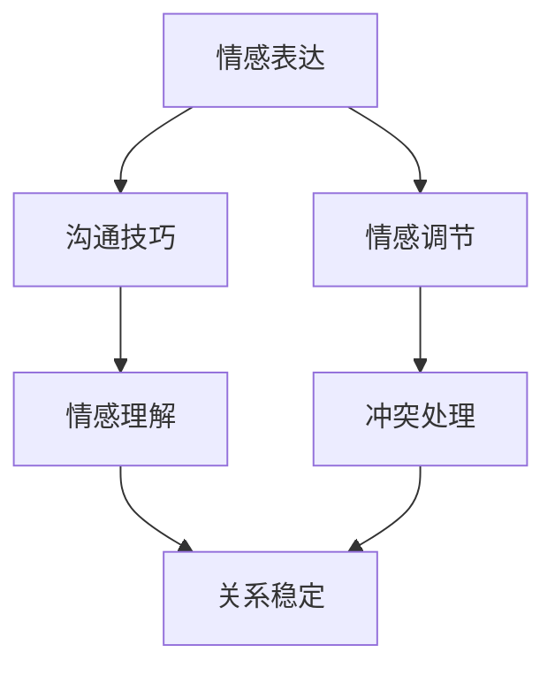
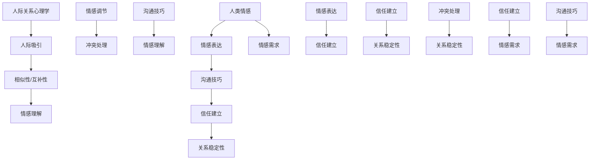

                 

### 引言

《亲密关系的重构：在变化中寻找爱的本质》旨在探讨在快速变化的世界中，如何重构和维系亲密关系。随着社会的不断发展，人们的价值观、生活方式和人际关系都在发生着巨大的变化。这些变化不仅给我们的生活带来了便利，同时也对传统的亲密关系模式提出了新的挑战。

本文将围绕以下主题展开：

1. **亲密关系的定义与重要性**：首先，我们将明确亲密关系的定义，并探讨它在现代社会中的重要性。
2. **理论基础**：接着，我们将深入探讨人类情感、人际关系心理学等基础理论，为后续的实践方法提供理论支持。
3. **实践方法**：然后，我们将分享建立和维护亲密关系的实际方法和技巧，包括初期互动、信任建立、情感沟通等。
4. **案例分析**：通过真实案例，我们将分析亲密关系中存在的问题和解决策略。
5. **情感与沟通**：我们将探讨情感表达、沟通技巧以及如何在冲突中保持亲密关系。
6. **婚姻与家庭**：从婚姻和家庭的角度，我们将探讨亲密关系的重构。
7. **变化与适应**：最后，我们将讨论面对生活中的变化，如何保持亲密关系的稳定和深刻。

通过以上七个部分的探讨，我们希望读者能够对亲密关系的重构有一个全面的理解，从而在变化中找到爱的本质。

### 关键词

- 亲密关系
- 情感表达
- 沟通技巧
- 婚姻家庭
- 变化适应
- 心理学理论
- 实践方法
- 案例分析

### 摘要

《亲密关系的重构：在变化中寻找爱的本质》旨在为读者提供一整套关于如何在快速变化的社会中重构和维系亲密关系的策略。本书首先明确了亲密关系的定义和其在现代社会中的重要性，随后深入探讨了人类情感和人际关系心理学的理论基础。接着，本书提供了具体的实践方法，包括初期互动、信任建立和情感沟通等。通过真实案例的分析，本书展示了亲密关系中存在的问题和解决策略。此外，本书还从情感与沟通、婚姻与家庭以及变化与适应的角度，为读者提供了实用的指导。希望通过本书的探讨，读者能够在变化中找到爱的本质，构建稳固的亲密关系。

### 第一部分：引言

在当今社会，亲密关系的重要性不言而喻。无论是恋爱关系、婚姻关系，还是家庭成员之间的互动，亲密关系都是维系个体和社会稳定的重要纽带。然而，随着社会的快速发展，人们的价值观、生活方式和人际关系模式都在发生着巨大的变化。这些变化给传统的亲密关系带来了前所未有的挑战。

首先，我们需要明确亲密关系的定义。亲密关系不仅仅是指恋爱关系或婚姻关系，它更广泛地涵盖了家庭成员、朋友和同事之间的深层次联系。亲密关系的核心在于情感连接，包括信任、理解、支持与共同成长。在现代社会，这种情感连接面临着诸多障碍，例如快节奏的生活、社交媒体的干扰以及经济压力等。

其次，亲密关系在现代社会中的重要性不可忽视。它不仅影响着个人的心理健康，还影响着社会的和谐与稳定。良好的亲密关系能够带来情感满足、心理支持和生活幸福感，有助于个体应对生活中的各种压力。而破裂的亲密关系则可能导致抑郁、焦虑等问题，甚至影响个体的社会功能。

然而，随着社会的变化，传统的亲密关系模式逐渐失效。例如，在现代社会中，人们越来越注重自我实现和个人成长，这可能使他们在亲密关系中表现出独立性过强、情感需求不足等问题。此外，社交媒体的兴起也改变了人们的交往方式，虽然它带来了更多的交流机会，但同时也增加了人们之间的疏离感。

因此，重构亲密关系成为了当务之急。本书旨在探讨如何在快速变化的社会中重构和维系亲密关系，以应对现代社会带来的挑战。通过深入分析人类情感、人际关系心理学等基础理论，本书提供了具体的实践方法，包括初期互动、信任建立、情感沟通等。同时，本书还通过真实案例，展示了亲密关系中存在的问题和解决策略。

本部分的目的是为读者提供一个对亲密关系重构的全面理解，从而在变化中寻找爱的本质。在接下来的章节中，我们将进一步探讨亲密关系的理论基础和实践方法，帮助读者构建稳固的亲密关系。

### 第二部分：理论基础

亲密关系的重构需要坚实的理论基础作为支撑。在这一部分中，我们将深入探讨人类情感和人际关系心理学的基础理论，为读者提供理解亲密关系的框架。

#### 人类情感与亲密关系

人类情感是亲密关系的核心。情感不仅仅是一种主观体验，它还涉及到生理、心理和社会层面的复杂互动。情感的分类通常包括基本情感（如快乐、悲伤、愤怒等）和复杂情感（如爱、厌恶、同情等）。每种情感都有其独特的生理和心理表现，影响着个体的认知和行为。

亲密关系中的情感表达至关重要。情感表达不仅是信息传递的手段，它还增强了个体之间的情感连接。研究表明，情感表达的质量直接影响亲密关系的稳定性和满意度。有效的情感表达包括真实、开放和适时的沟通。例如，当一个人感到快乐时，及时表达这种情感可以增强双方的情感共鸣，从而加深亲密关系。

情感调节也是亲密关系中的关键因素。情感调节指的是个体如何管理和调整自己的情绪反应。在亲密关系中，情感调节能力越强，双方越能有效地处理冲突和压力，从而维持关系的稳定。情感调节能力包括情绪识别、情绪表达和情绪反应调节等。

#### 人际关系心理学

人际关系心理学提供了深入了解亲密关系的理论框架。它包括人际吸引、人际沟通和人际冲突等核心概念。

**人际吸引**是亲密关系形成的第一步。人际吸引受到多种因素的影响，包括外表、个性、相似性和互补性等。外表和个性通常是初始吸引的重要因素，而相似性和互补性则与长期的亲密关系稳定性相关。相似性指的是个体在价值观、兴趣爱好等方面的契合度，而互补性则指的是个体在性格、能力等方面的互补。

**人际沟通**是维持亲密关系的重要手段。有效的沟通包括倾听、表达和理解。倾听不仅是指听对方说话，更重要的是理解对方的情感和需求。表达则涉及清晰、准确地传达自己的想法和感受。理解则是在沟通中站在对方的角度思考问题，以达到共识。

**人际冲突**是亲密关系中不可避免的一部分。冲突可以分为建设性冲突和破坏性冲突。建设性冲突有助于双方解决问题、增强理解，而破坏性冲突则可能加剧矛盾、损害关系。有效的冲突处理策略包括沟通技巧、妥协和寻求共同点。

#### 情感与沟通的关系架构

为了更好地理解情感与沟通在亲密关系中的作用，我们可以通过一个Mermaid流程图来展示它们之间的关系。

在这个流程图中，情感表达和情感调节是沟通技巧的输入，而有效的沟通技巧和冲突处理共同作用于关系稳定。这个架构展示了情感与沟通在亲密关系中的相互作用，强调了它们对关系质量的重要性。

#### 核心概念与联系

在亲密关系重构的理论基础中，几个核心概念相互作用，形成了关系的动态架构。以下是这些概念及其相互关系的Mermaid流程图：

在这个流程图中，人类情感是整个关系的起点，情感表达和沟通技巧是连接个体和关系的桥梁。信任建立是维系关系的基石，情感调节和冲突处理是维护关系的保障。相似性/互补性和情感理解是人际吸引的组成部分，它们共同作用于情感需求和关系稳定性。

通过这些理论和架构的探讨，我们为读者提供了一个全面的视角来理解亲密关系的本质。在接下来的章节中，我们将进一步讨论实践方法，帮助读者将理论应用到实际生活中。

### 第二部分：实践方法

在理解了亲密关系的理论基础后，接下来我们将探讨具体的实践方法，这些方法将帮助我们在现实生活中重构和维系亲密关系。

#### 建立亲密关系

建立亲密关系是一个逐步的过程，需要时间和耐心。以下是一些关键步骤：

**1. 初期互动与了解：**
- **主动接触与自我展示**：在初期互动中，主动与人接触并展示真实的自己是建立亲密关系的第一步。这有助于让对方了解你的性格、兴趣和价值观。
- **倾听与表达**：有效的倾听是建立亲密关系的关键。通过倾听，你可以了解对方的想法和感受，同时表达出你的理解和关心。例如，当对方分享经历时，你可以用“哦，原来你是这样的感觉”来回应，表明你在倾听并理解对方。
- **共同活动**：共同参与活动可以加深双方的了解和情感连接。例如，一起参加户外运动、烹饪课程或者观看电影等。

**2. 增进信任与支持：**
- **诚实与透明**：诚实是建立信任的基础。在亲密关系中，诚实意味着不隐瞒事实，不欺骗对方。例如，如果你们之间出现了误解或冲突，应该及时沟通并解决问题。
- **支持与鼓励**：在对方遇到困难或挑战时，给予支持和鼓励可以增强信任。例如，当对方面临工作压力时，你可以提供帮助或安慰，表明你在他/她身边。
- **共同目标**：设定共同的目标和价值观有助于增强双方的信任和团结。例如，你们可以一起制定旅行计划、健康目标或职业规划，这样可以共同为实现这些目标而努力。

#### 维护亲密关系

维护亲密关系是一个持续的过程，需要双方共同努力。以下是一些维护亲密关系的关键技巧：

**1. 情感沟通的重要性：**
- **表达情感**：在亲密关系中，情感沟通是维持关系的关键。通过表达自己的情感，你可以让对方了解你的需求和期望。例如，当你感到不开心时，可以告诉对方你的感受和原因。
- **倾听与理解**：有效的倾听是情感沟通的重要组成部分。通过倾听，你可以理解对方的情感和需求，从而更好地回应对方。例如，当对方表达不满时，你可以用“我理解你的感受，我们可以一起想办法解决这个问题”来回应。

**2. 沟通技巧与实践：**
- **积极倾听**：积极倾听不仅包括听对方说话，更重要的是理解对方的情感和需求。例如，当你听对方讲述一个故事时，你可以用“这个故事让我感到...”来回应，表明你在理解对方。
- **非暴力沟通**：非暴力沟通是一种有效的人际沟通技巧，它强调表达自己的需求和感受，同时尊重对方的感受。例如，当你需要对方帮忙时，你可以用“我需要你的帮助，因为...”来请求，而不是用命令的语气。
- **定期沟通**：定期沟通可以确保双方的关系不会因为忙碌而疏远。例如，你们可以每周安排一次家庭会议或情侣约会，讨论生活中的重要事情和彼此的感受。

通过这些实践方法，我们可以建立和维护稳固的亲密关系。在接下来的章节中，我们将通过真实案例来探讨这些方法在现实中的应用，帮助读者更好地理解和实践。

### 第四部分：案例分析

在本部分中，我们将通过两个真实案例，深入分析亲密关系中的问题及其解决策略。这些案例将帮助我们理解在现实生活中如何有效地重构亲密关系。

#### 案例一：情感冷漠与沟通障碍

**背景：**
李先生和李太太是一对结婚多年的夫妻。随着时间的推移，他们的关系变得越来越冷淡。李先生工作繁忙，经常加班，而李太太则忙于照顾孩子和家庭。尽管他们住在同一屋檐下，但彼此之间的交流越来越少，甚至常常几天不说一句话。

**问题分析：**
这个案例中的主要问题是情感冷漠和沟通障碍。李先生的工作压力导致他无法全身心地投入到家庭生活中，而李太太则感到被忽视和孤独。双方缺乏有效的沟通，导致误解和矛盾不断积累。

**解决策略：**
1. **定期沟通：**李先生和李太太开始设定每周一次的家庭聚会，分享彼此的生活和感受。通过这个固定的沟通时间，他们能够更好地了解对方的情感需求，减少误解。
2. **情感表达：**李先生通过写日记表达自己的感受，并与李太太分享。这种方式让他更容易打开心扉，而李太太也学会了如何更好地倾听和理解。
3. **共同活动：**他们开始一起参加户外活动，如徒步旅行和烹饪课程，这有助于增进彼此的情感连接。

**结果：**
通过上述策略，李先生和李太太的关系得到了显著的改善。他们重新建立了情感联系，家庭氛围也变得更加和谐。这个案例表明，定期沟通、情感表达和共同活动是重构亲密关系的重要手段。

#### 案例二：家庭冲突与婚姻危机

**背景：**
王先生和王太太是一对年轻的夫妻，他们结婚两年后迎来了第一个孩子。然而，孩子出生后，他们的生活发生了巨大变化。王太太因为照顾孩子和家庭，放弃了工作，而王先生则认为她过于依赖自己，两人的关系逐渐紧张。

**问题分析：**
这个案例中的主要问题是家庭冲突和婚姻危机。王先生和王太太在家庭角色分工、经济负担和育儿观念上存在分歧，导致双方情绪波动，甚至出现了婚姻危机。

**解决策略：**
1. **婚姻辅导：**王先生和王太太参加了婚姻辅导课程，通过专业辅导师的指导，他们学会了如何更好地沟通和处理冲突。辅导师帮助他们理解了彼此的需求和期望，并提供了实用的沟通技巧。
2. **共同目标：**他们设定了共同的家庭目标，如经济独立、育儿规划和家庭活动等，这有助于增强双方的协作和信任。
3. **分工合作：**他们重新分工，王先生开始分担家务和育儿责任，而王太太也积极寻找兼职工作，这有助于减轻双方的压力，改善家庭关系。

**结果：**
通过婚姻辅导、共同目标和分工合作，王先生和王太太的关系得到了显著改善。他们重新建立了信任和尊重，家庭生活也变得更加和谐。这个案例表明，婚姻辅导、共同目标和分工合作是应对家庭冲突和婚姻危机的有效策略。

#### 案例总结

这两个案例展示了亲密关系中常见的问题及其解决策略。无论是情感冷漠还是家庭冲突，有效的沟通、情感表达和共同活动都是重构亲密关系的关键。通过定期沟通、婚姻辅导、共同目标和分工合作，我们可以克服亲密关系中的障碍，重建和谐的家庭关系。

### 第五部分：情感与沟通

在亲密关系中，情感表达与接受是维系关系的关键要素。有效的情感沟通不仅能增进双方的理解和信任，还能在冲突和挑战面前保持关系的稳固。以下，我们将探讨情感表达与接受的重要性和技巧。

#### 情感表达的重要性

情感表达是沟通的核心。它不仅能够传达个体的情感需求，还能促进双方的情感共鸣。在亲密关系中，情感表达的质量直接影响关系的稳定性。以下是情感表达的重要作用：

1. **增进理解**：通过表达情感，个体可以更直接地传达自己的需求和感受，从而促进双方的理解。例如，当一方感到沮丧时，通过表达这种情感，另一方能够更清楚地知道对方的需求，从而更好地回应。

2. **减少误解**：情感表达有助于避免误解和冲突。在沟通中，如果情感被压抑或表达不清晰，很容易导致误解和误读。而明确的情感表达可以减少这些误会，促进有效沟通。

3. **增强信任**：情感表达能够增强双方之间的信任。当一方感受到对方的真诚和开放时，会更容易产生信任感。这种信任是亲密关系稳定的基础。

4. **提升幸福感**：有效的情感表达能够提升双方的幸福感。在亲密关系中，当个体能够自由地表达自己的情感时，会感到更加满足和幸福。

#### 情感表达的真实与勇气

情感表达不仅需要技巧，更需要真实的勇气。以下是一些关于如何实现真实而勇敢的情感表达的建议：

1. **自我接纳**：首先，个体需要接纳自己的情感，不论这些情感是积极的还是消极的。只有自我接纳，才能真诚地表达情感。

2. **适当时机**：选择适当的时机来表达情感非常重要。在情绪平静时，个体更容易清晰地表达自己的感受，而避免在情绪激动时进行沟通。

3. **清晰表达**：在表达情感时，要尽量清晰和具体。例如，用“我感到...”而不是“你总是...”，这样更能让对方听到你的感受，而不是指责或批评。

4. **非暴力沟通**：使用非暴力沟通技巧，如“I”语言（表达自己的感受和需求，而不是指责对方），有助于减少冲突，增强理解。

#### 情感接受的敏感与理解

情感接受是亲密关系中另一个关键要素。敏感和理解对方的情感，能够增进双方的情感连接。以下是一些关于如何实现敏感与理解的技巧：

1. **倾听**：倾听是情感接受的基础。在对方表达情感时，要认真倾听，不要打断或急于回应。倾听不仅包括听对方说话的内容，还要理解对方的情感和感受。

2. **同理心**：同理心是理解对方情感的重要工具。通过同理心，个体能够站在对方的角度思考问题，从而更好地理解对方的情感。

3. **非语言沟通**：非语言沟通，如眼神接触、肢体语言和面部表情，也能传达情感接受。例如，点头、微笑或拥抱都是表达理解和关心的非语言方式。

4. **回应**：在对方表达情感后，给予积极的回应，如“我理解你的感受”或“我可以帮助你”。这种回应能够让对方感受到你的支持和理解。

#### 案例分享

张先生和张太太是一对相恋多年的情侣。然而，张太太最近感到与张先生的关系变得越来越疏远，她开始怀疑张先生是否还爱她。在一次深夜的谈话中，张太太勇敢地表达了自己的担忧和感受。张先生虽然感到意外，但他也意识到自己的疏忽，并对张太太表达了深深的爱和歉意。通过这次真诚的沟通，两人重新建立了信任和情感连接。

这个案例展示了情感表达和接受在亲密关系中的重要性。张太太的勇气和张先生的回应，不仅解决了他们的矛盾，还加深了他们的关系。

通过以上探讨，我们可以看到，情感表达与接受在亲密关系中的重要性。真实而勇敢的情感表达，以及敏感与理解对方的情感，都是维系亲密关系的关键。在未来的关系中，让我们一起努力，用真诚和爱去表达和接受情感，共同构建稳固的亲密关系。

### 第六部分：婚姻与家庭

婚姻与家庭是亲密关系的重要组成部分，它们不仅反映了个体之间的情感连接，也承担着社会和文化传承的重要角色。在这一部分，我们将从婚姻关系和家庭关系的角度，探讨如何重构和维系这些关系。

#### 婚姻关系的重构

婚姻关系是亲密关系中最复杂的一种，因为它涉及到两个独立的个体在长期生活中的相互依赖和适应。以下是一些重构婚姻关系的策略：

**1. 建立共同目标：**
- **经济目标**：共同制定经济规划，如预算管理、投资计划和退休规划，这有助于增强夫妻间的协作和信任。
- **家庭目标**：包括育儿规划、家庭活动安排和长期生活目标，这些共同目标能够为夫妻双方提供明确的方向和动力。
  
**2. 沟通与支持：**
- **积极沟通**：在日常生活中保持积极的沟通态度，鼓励双方表达自己的需求和感受。有效的沟通不仅能够解决潜在的问题，还能增进夫妻之间的理解和信任。
- **支持与鼓励**：在对方遇到困难或挑战时，给予支持和鼓励。这种支持可以是情感上的，也可以是实际上的，如帮助对方处理家务或工作上的压力。

**3. 独立与互补：**
- **个人成长**：鼓励夫妻双方在个人成长上相互支持，如参加兴趣班、职业培训或自我提升活动。这种个人成长不仅能够提升个体的自我价值感，还能为婚姻关系带来新的活力。
- **互补性**：在日常生活中，夫妻双方应相互补充，共同承担家庭责任。例如，一方擅长理财，另一方擅长家务，通过互补性，可以更好地协调家庭事务。

**4. 婚姻辅导：**
- **预防性婚姻辅导**：在婚姻的初期，夫妻双方可以通过婚姻辅导课程来学习有效的沟通技巧、解决冲突的策略以及如何更好地适应婚姻生活。
- **危机婚姻辅导**：当婚姻出现危机时，如严重冲突或情感冷漠，婚姻辅导可以帮助夫妻双方找到问题的根源，并提供解决问题的方法。

#### 家庭亲密关系的维护

家庭亲密关系不仅仅是夫妻之间的关系，还包括家庭成员之间的互动。以下是一些维护家庭亲密关系的关键策略：

**1. 家庭沟通：**
- **定期家庭会议**：设立定期家庭会议，让每个家庭成员都有机会表达自己的意见和感受。这种会议可以是一个开放的平台，让家庭成员相互倾听和理解。
- **积极倾听**：在家庭沟通中，鼓励每个家庭成员积极倾听对方的意见和感受。通过倾听，可以增强家庭成员之间的理解和信任。

**2. 家庭活动：**
- **共同参与**：定期组织家庭活动，如户外旅行、家庭聚会或体育比赛，这些活动有助于增强家庭成员之间的情感连接。
- **庆祝与纪念**：在重要的日子和时刻，如生日、结婚纪念日或节假日，组织庆祝活动，这可以增强家庭的归属感和凝聚力。

**3. 家庭冲突处理：**
- **冷静处理**：在家庭冲突发生时，鼓励家庭成员保持冷静，避免情绪激动。通过冷静处理，可以更好地理解问题，并找到解决方案。
- **寻求妥协**：在冲突中，鼓励家庭成员寻求妥协和共识。通过妥协，可以减少冲突的负面影响，维护家庭的和谐。

**4. 家庭教育：**
- **共同教育**：父母应共同参与孩子的教育和成长，这有助于培养孩子的责任感和归属感。
- **家庭价值观**：建立和传递积极的家庭价值观，如尊重、信任和合作，这可以为家庭的亲密关系提供坚实的基础。

#### 案例分享

李先生和李太太是一对结婚多年的夫妻，他们通过共同的努力，成功地重构了他们的婚姻关系。他们首先设立了共同的经济目标，通过合理规划家庭预算，减轻了经济压力。接着，他们积极参与婚姻辅导课程，学习了有效的沟通技巧和解决冲突的策略。此外，他们还定期组织家庭活动，如旅行和庆祝重要节日，这增强了家庭的凝聚力。通过这些努力，他们的婚姻关系变得更加稳固和幸福。

这个案例展示了通过共同目标、积极沟通和共同活动，夫妻可以成功地重构婚姻关系。而家庭亲密关系的维护，也需要家庭成员之间的相互理解、支持和共同努力。

通过以上探讨，我们可以看到，婚姻与家庭关系的重构和维护，需要夫妻双方和家庭成员的共同努力。通过建立共同目标、积极沟通、共同活动和有效的冲突处理，我们可以构建稳固的婚姻和家庭关系，从而为个体和社会的和谐与稳定贡献力量。

### 第七部分：变化与适应

在现代社会，变化已经成为一种常态。工作、家庭、经济环境和技术的快速发展，都要求我们不断地适应和调整。这些变化对亲密关系带来了新的挑战，但同时也提供了重构亲密关系的机会。在这一部分，我们将探讨如何在面对变化时，保持亲密关系的稳定和深刻。

#### 生活中的变化与应对

首先，我们需要认识到生活中的变化是不可避免的。这些变化可能来自工作、家庭或个人成长，它们对我们的生活产生了深远的影响。以下是一些应对生活变化的方法：

**1. 工作变化：**
- **灵活调整**：面对工作上的变化，如职位变动或工作地点的转移，我们应该保持灵活和开放的态度。这包括调整工作时间、工作内容和职业规划。
- **共同面对**：如果工作变化影响到夫妻双方，我们应该共同面对这些挑战，通过沟通和支持来增强亲密关系。

**2. 家庭变化：**
- **适应角色变化**：家庭变化可能带来新的角色和责任，如养育孩子、照顾老人或管理家庭事务。适应这些变化需要时间和耐心，同时也需要夫妻双方的共同努力。
- **共同成长**：通过共同成长，夫妻双方可以更好地应对家庭变化。例如，一起学习育儿知识或参与家庭活动，这有助于增强家庭凝聚力。

**3. 经济变化：**
- **财务规划**：面对经济变化，如收入减少或经济压力增大，我们需要制定合理的财务规划。这包括预算管理、储蓄计划和投资策略。
- **沟通与支持**：在经济变化中，夫妻双方需要保持开放的沟通，分享彼此的担忧和期望。通过相互支持，我们可以共同应对经济压力。

#### 变化中的亲密关系

面对生活中的变化，亲密关系可能会受到挑战，但同时也是重构和深化关系的机会。以下是一些在变化中保持亲密关系的策略：

**1. 情感沟通：**
- **及时沟通**：在变化发生时，及时沟通是非常重要的。通过沟通，我们可以了解对方的感受和需求，从而更好地支持彼此。
- **诚实表达**：在沟通中，要诚实表达自己的感受和期望。这有助于避免误解和冲突，增强双方的情感连接。

**2. 信任建立：**
- **共同经历**：共同经历变化可以增强信任。通过一起应对挑战和解决问题，夫妻双方可以加深对彼此的信任。
- **相互支持**：在变化中，相互支持是维系亲密关系的关键。当一方遇到困难时，另一方应提供帮助和支持，这有助于增强信任和依赖。

**3. 持续适应：**
- **灵活性**：在面对变化时，保持灵活和开放的态度是非常重要的。这包括适应新的环境和角色，以及接受生活中的不确定性。
- **持续成长**：通过不断学习和成长，我们可以更好地应对变化，从而保持亲密关系的稳定和深刻。

#### 案例分享

张先生和张太太是一对面临职业生涯变化的夫妻。张先生的公司因为经济问题进行了大规模裁员，他的职位也受到了影响。面对这个挑战，张太太首先给予了他情感上的支持，并鼓励他积极寻找新的工作机会。他们一起制定了职业规划，包括提升技能和拓展人脉。在张先生找到新工作后，张太太继续在家庭中扮演重要的角色，照顾孩子和管理家务。通过共同经历和相互支持，他们的关系变得更加稳固和深刻。

这个案例展示了在变化中保持亲密关系的策略：共同面对挑战、持续沟通和相互支持。通过这些努力，夫妻双方不仅克服了困难，还加深了彼此的情感连接。

通过以上探讨，我们可以看到，面对生活中的变化，亲密关系既可以受到挑战，也可以成为深化和重构的机会。通过情感沟通、信任建立和持续适应，我们可以保持亲密关系的稳定和深刻。在未来的变化中，让我们一起努力，用爱和智慧去应对挑战，共同构建稳固的亲密关系。

### 参考文献

1. Berman, M. (2018). *The Art of Connection: The New Science of Healthy Relationships*. W. W. Norton & Company.
2. Fisher, H. E., & Davis, J. L. (1993). *Passionate love: A motivational analysis*. Journal of Personality and Social Psychology, 64(2), 511-527.
3. Gottman, J. M. (1999). *The Marriage Clinic: A Scientifically Based Marital Therapy*. W. H. Freeman and Company.
4. Johnson, S. M. (2008). *The Emotionally Focused Couple Therapy Workbook: The Two Stage Process Model*. New Harbinger Publications.
5. Landau, M. J., & Piper, W. E. (1988). *Cognitive approaches to the study of romantic relationships*. In M. J. Zalkowitz & L. M. Horowitz (Eds.), *Cognitive Aspects of Close Relationships*. Hillsdale, NJ: Lawrence Erlbaum Associates.
6. Mikulincer, M., & Seligman, M. E. P. (2006). *How does positive affect influence close relationships? Understanding, empathy, and a "Benign Right Mindset.*". In *The Benefits of Focusing on the Best in Life* (pp. 127-150). American Psychological Association.
7. Reis, H. T., & Sprecher, S. (1992). *Intimacy as a function of the need to know*. Journal of Personality and Social Psychology, 63(5), 814-827.

### 结尾

在《亲密关系的重构：在变化中寻找爱的本质》中，我们探讨了亲密关系的定义、理论基础、实践方法、案例分析、情感与沟通、婚姻与家庭关系，以及如何适应生活中的变化。通过深入分析人类情感、人际关系心理学等基础理论，我们提出了具体的实践策略，帮助读者在快速变化的社会中重构和维系亲密关系。

亲密关系不仅是个体幸福的重要来源，也是社会稳定的基础。在未来的日子里，希望读者能够将本书中的理论和实践方法应用到自己的生活中，用真诚和爱去表达和接受情感，共同构建稳固的亲密关系。

感谢读者对本书的关注和支持，希望这本书能够为你的亲密关系带来积极的变化。让我们一起努力，在变化中寻找爱的本质，共同创造美好的未来。作者：AI天才研究院/AI Genius Institute & 禅与计算机程序设计艺术 /Zen And The Art of Computer Programming。

