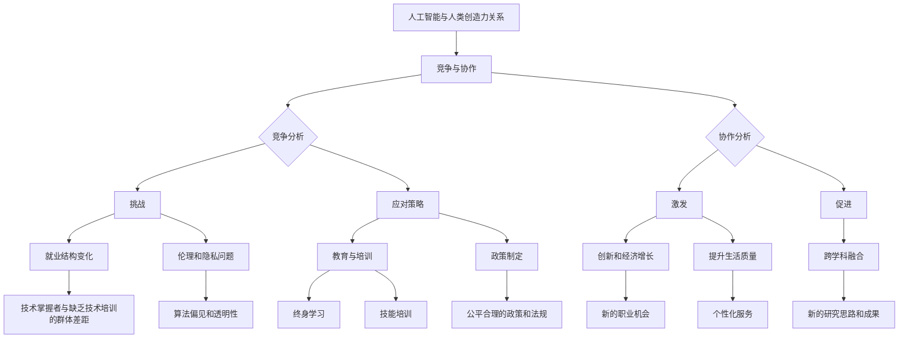

                 

# 人工智能与人类创造力的竞争与合作：未来工作的新形态

## 关键词
- 人工智能
- 人类创造力
- 未来工作
- 竞争
- 合作
- 新形态

## 摘要
本文深入探讨了人工智能与人类创造力之间的关系，分析了两者的竞争与合作关系，并展望了未来工作的新形态。文章首先介绍了人工智能的发展背景和核心原理，接着探讨了人类创造力的本质和重要性。在此基础上，文章分析了人工智能对人类创造力的挑战以及人类如何应对这些挑战。随后，文章讨论了人工智能与人类创造力的互补关系，并通过案例研究展示了人工智能辅助人类创造力的实际应用。最后，文章提出了未来工作的趋势和挑战，并给出了相应的策略。

## 目录大纲设计

### 第一部分：引言与背景

#### 1.1 书籍主题介绍
- 人工智能与人类创造力的关系
- 未来工作的新形态
- 竞争与合作的探讨

#### 1.2 人工智能的发展现状
- 人工智能的历史与演进
- 人工智能的核心技术
- 人工智能在各个领域的应用

#### 1.3 人类创造力的定义与特点
- 创造力的本质
- 创造力的表现形式
- 创造力的重要性

### 第二部分：人工智能与人类创造力的竞争

#### 2.1 人工智能对人类创造力的挑战
- 人工智能如何改变人类的工作方式
- 人工智能如何影响人类创造力的发挥
- 人工智能如何取代人类创造力

#### 2.2 人类创造力如何应对人工智能的挑战
- 人类创造力的独特价值
- 人类如何利用人工智能提升创造力
- 人类如何与人工智能协作

#### 2.3 人工智能与人类创造力的互补关系
- 人工智能如何激发人类创造力
- 人类创造力如何促进人工智能的发展
- 人工智能与人类创造力的协同进化

### 第三部分：人工智能与人类创造力的合作

#### 3.1 人工智能辅助人类创造力的案例研究
- 创意设计中的AI应用
- 艺术创作中的AI应用
- 科学研究中的AI应用

#### 3.2 人工智能与人类创造力的协作模式
- 人工智能与人类创造力的合作流程
- 人工智能与人类创造力的协作工具
- 人工智能与人类创造力的协作案例

#### 3.3 人工智能与人类创造力的未来发展
- 人工智能与人类创造力融合的趋势
- 未来工作场景中的创造力角色
- 未来社会对创造力的需求

### 第四部分：未来工作的新形态

#### 4.1 未来工作的趋势
- 数字化转型与自动化
- 创造力驱动的工作模式
- 跨界合作与全球协作

#### 4.2 未来工作的挑战
- 技术变革对职业的影响
- 创造力培养与人才发展
- 工作与生活平衡的挑战

#### 4.3 未来工作的策略
- 组织创新与创造力培养
- 技能升级与职业转型
- 创造力的传承与传播

### 第五部分：总结与展望

#### 5.1 书籍总结
- 人工智能与人类创造力的核心观点
- 未来工作的新形态概览
- 对未来发展的影响与展望

#### 5.2 未来发展的挑战与机遇
- 技术变革带来的挑战
- 社会进步带来的机遇
- 创造力与人工智能的未来

## 附录

### 6.1 参考文献
- 相关书籍与论文列表
- 网络资源链接

### 6.2 附录A: Mermaid流程图
- AI与人类创造力关系架构图
- 创造力驱动的工作流程图

### 6.3 附录B: Python源代码示例
- AI算法实现代码
- 创造力提升工具代码

### 6.4 附录C: 数学模型与公式解释
- 创造力相关数学模型
- 创造力计算公式及应用

### 6.5 附录D: 实际案例与代码解读
- 创造力提升项目实战
- 人工智能与人类创造力协作案例分析

---

# 人工智能与人类创造力的竞争与合作：未来工作的新形态

## 引言与背景

在科技飞速发展的今天，人工智能（AI）已经成为改变人类生活的重要力量。从简单的语音识别、图像处理，到复杂的自动驾驶、自然语言理解，人工智能的应用场景越来越广泛。与此同时，人类创造力在许多领域仍然发挥着不可替代的作用。无论是艺术创作、科学研究，还是商业创新，人类的创造力都是推动社会进步的重要动力。

然而，人工智能的崛起引发了人们对于人类创造力的担忧。有人认为，人工智能的不断发展将取代人类的创造力，使得人类在未来的工作中越来越失去价值。另一方面，也有观点认为，人工智能与人类创造力之间存在互补关系，两者可以相互促进，共同推动社会的进步。

本书旨在探讨人工智能与人类创造力之间的关系，分析两者在竞争与合作中的动态变化，并展望未来工作的新形态。通过深入研究人工智能和人类创造力的本质，我们希望能够为读者提供一种全新的视角，重新认识人工智能与人类创造力的关系，并为未来工作提供有益的指导。

### 人工智能的发展现状

人工智能（AI）的发展可以追溯到上世纪五六十年代，当时计算机科学家们开始尝试通过编程来模拟人类的智能行为。早期的AI研究主要集中在规则推理、知识表示和学习算法等方面。随着计算机性能的提升和大数据技术的发展，人工智能进入了一个新的阶段。

#### 人工智能的历史与演进

- **早期探索（1950-1969年）**：这一时期，人工智能的概念首次被提出，并引发了广泛的研究兴趣。1956年，约翰·麦卡锡等人在达特茅斯会议上首次提出了“人工智能”的概念。早期的AI研究主要集中在规则推理和专家系统上。
- **黄金时代（1970-1980年）**：随着计算机性能的提高和新的算法的提出，人工智能开始取得一些突破。这一时期的代表性成果包括逻辑推理系统“逻辑理论家”和自然语言处理系统“ELIZA”。
- **低谷与复兴（1980-1990年代）**：人工智能在80年代遭遇了瓶颈，许多早期的预测未能实现，导致了一段时间的研究低谷。然而，随着机器学习和神经网络技术的发展，人工智能在90年代迎来了新的机遇。
- **飞速发展（2000年至今）**：进入21世纪，大数据、云计算和深度学习技术的突破使得人工智能进入了一个飞速发展期。AlphaGo战胜围棋世界冠军、自动驾驶汽车的实现、语音识别的广泛应用等，都标志着人工智能取得了重大的进展。

#### 人工智能的核心技术

- **机器学习**：机器学习是人工智能的核心技术之一，它使得计算机系统能够通过数据学习并作出决策。常见的机器学习算法包括决策树、支持向量机、神经网络等。
- **深度学习**：深度学习是机器学习的一个分支，通过模拟人脑神经网络的结构和功能来实现复杂任务。深度学习在图像识别、语音识别、自然语言处理等领域取得了显著成果。
- **自然语言处理**：自然语言处理旨在使计算机能够理解和处理自然语言。这项技术广泛应用于机器翻译、智能客服、文本分析等领域。
- **计算机视觉**：计算机视觉是使计算机能够“看”和理解图像和视频的技术。计算机视觉在图像识别、自动驾驶、医疗诊断等领域具有广泛应用。

#### 人工智能在各个领域的应用

- **工业生产**：人工智能在工业生产中的应用极大地提高了生产效率和产品质量。例如，通过机器学习算法优化生产流程、预测设备故障等。
- **医疗健康**：人工智能在医疗领域的应用包括疾病诊断、药物研发、智能监护等。例如，通过计算机视觉技术进行医学影像分析，提高诊断的准确性。
- **金融服务**：人工智能在金融服务中的应用包括风险控制、欺诈检测、智能投顾等。例如，通过机器学习算法进行信用评分，降低贷款违约风险。
- **交通运输**：人工智能在交通运输领域的应用包括自动驾驶、智能交通管理、物流优化等。例如，自动驾驶汽车的应用将极大地改变未来的出行方式。

通过上述分析，我们可以看到，人工智能在各个领域的应用已经深刻地改变了人类的生产和生活方式。然而，与此同时，人工智能的发展也带来了对人类创造力的影响，这将是本文接下来要探讨的核心问题。

### 人类创造力的定义与特点

创造力是人类智能的重要组成部分，它不仅关乎个体的发展和幸福，更是推动社会进步的重要力量。创造力可以被定义为产生新颖且有价值的想法、解决方案或作品的能力。这种能力涉及多个方面，包括想象力、联想力、洞察力、判断力等。

#### 创造力的本质

创造力的本质在于创新和突破。创新是指通过新的方法、思维或技术解决问题或实现目标。创造力是创新的基础，它使得人类能够在现有知识和资源的基础上，发现新的可能性。创造力不仅仅是简单的想法产生，更重要的是能够将这些想法转化为实际的应用和价值。

#### 创造力的表现形式

创造力有多种表现形式，常见的包括：

- **艺术创作**：通过绘画、音乐、文学等艺术形式表达独特的情感和思想。
- **科学研究**：通过新的实验设计、理论构建或数据分析，推动科学知识的进步。
- **商业创新**：通过新的商业模式、产品设计和市场策略，推动商业发展。
- **社会创新**：通过新的社会政策、公共管理和社会运动，推动社会进步。

#### 创造力的重要性

创造力在个人和社会层面上都具有重要意义：

- **个人层面**：创造力使得个体能够超越现实限制，实现自我价值，获得成就感和幸福感。
- **社会层面**：创造力是社会进步的引擎，它推动了科技、经济、文化和政治的各个方面的发展。

例如，在科技领域，创造力推动了计算机科学、生物学、物理学等领域的发展；在艺术领域，创造力带来了丰富的艺术作品，丰富了人类的精神生活；在商业领域，创造力促进了新产品的研发和市场开拓，推动了经济的增长。

此外，创造力也具有跨学科的融合能力，它能够促进不同领域之间的交叉和合作，产生新的突破和成果。例如，计算机科学和生物学的交叉融合催生了生物信息学这一新兴领域，推动了生命科学的发展。

综上所述，人类创造力是推动社会进步的重要力量，它不仅体现了人类的智慧和能力，更是未来社会发展的重要动力。在人工智能快速发展的时代，深刻理解创造力的本质和重要性，对于应对人工智能带来的挑战和把握机遇具有重要意义。

### 人工智能对人类创造力的挑战

随着人工智能技术的迅猛发展，人类创造力面临着前所未有的挑战。人工智能在多个领域展现出了强大的能力，这些能力不仅改变了人类的工作方式，也对人类创造力的发挥产生了深远影响。

#### 人工智能如何改变人类的工作方式

人工智能的引入大大改变了人类的工作方式，主要体现在以下几个方面：

- **自动化和智能化**：许多重复性、低技能的工作被人工智能自动化系统所取代，例如工厂流水线、数据录入、客服等。这使得人类可以从这些繁琐的任务中解脱出来，专注于更具创造性和战略性的工作。
- **增强工具**：人工智能可以作为人类的增强工具，辅助人类完成复杂的任务。例如，在医疗领域，人工智能可以通过分析大量的医疗数据，帮助医生做出更准确的诊断；在艺术创作中，人工智能可以生成音乐、绘画等艺术作品，为人类艺术家提供灵感。
- **协同工作**：人工智能与人类合作，共同完成任务。例如，在工程设计中，人工智能可以通过优化设计、预测故障等方式，与工程师协同工作，提高工作效率和质量。

#### 人工智能如何影响人类创造力的发挥

人工智能对人类创造力的发挥产生了多方面的影响：

- **替代效应**：人工智能在某些领域的高效表现使得人类创造力的重要性被削弱。例如，在数据分析领域，人工智能可以通过算法快速处理大量数据，而人类在这方面的创造力相对有限。
- **局限效应**：人工智能的发展使得人类创造力的发挥受到一定局限。人工智能擅长处理结构化和规则化的任务，但在处理复杂、非线性的问题时，可能无法达到人类的创造力水平。
- **激发效应**：尽管人工智能对人类创造力有一定的替代效应和局限效应，但它也能够激发人类创造力。例如，通过人工智能生成的灵感或创意，可以激发人类艺术家或科学家的创造力，推动新的创新。

#### 人工智能如何取代人类创造力

在某些特定领域，人工智能已经开始取代人类的创造力：

- **数据分析**：在金融、医疗等领域，人工智能可以通过分析大量数据，发现人类难以察觉的模式和趋势，提供更准确的预测和建议。
- **艺术创作**：在音乐、绘画等领域，人工智能已经能够生成令人惊叹的艺术作品，虽然目前这些作品大多基于算法和模板，但在未来，人工智能在艺术创作中的地位可能会进一步提升。
- **科学研究**：在科学研究中，人工智能可以通过自动化实验、数据分析和模式识别，加速科学发现的进程。

然而，需要注意的是，人工智能的这些替代效应并不是完全取代人类的创造力，而是在某些方面对人类创造力进行了补充和扩展。例如，人工智能可以帮助人类更高效地处理数据，但人类在创造力方面的独特价值仍然不可替代。

综上所述，人工智能对人类创造力的挑战是全方位的，它不仅改变了人类的工作方式，也在一定程度上影响了人类创造力的发挥。然而，与此同时，人工智能也提供了新的机会，通过激发和补充人类创造力，共同推动社会的进步。

### 人类创造力如何应对人工智能的挑战

面对人工智能带来的挑战，人类创造力依然具有不可替代的独特价值，并且可以通过多种方式利用人工智能来提升自身的创造力。

#### 人类创造力的独特价值

人类创造力在以下几个方面具有独特价值：

- **情感和道德**：人类的创造力不仅仅基于逻辑和理性，还受到情感和道德的影响。这种情感和道德因素使得人类的创造活动更加丰富和深刻。
- **多样性和灵活性**：人类能够产生多样化的想法和解决方案，这种多样性和灵活性是单靠人工智能难以达到的。人类在创造性思维中能够灵活运用不同的视角和方法，从而产生创新性的成果。
- **复杂性和情境理解**：人类在处理复杂问题、理解情境和做出判断方面具有独特的优势。人工智能在处理简单、规则明确的问题上表现出色，但在面对复杂、非结构化的问题时，人类创造力则能够更好地应对。

#### 人类如何利用人工智能提升创造力

人工智能可以通过以下几种方式提升人类的创造力：

- **数据分析与洞见生成**：人工智能能够快速处理和分析大量数据，帮助人类发现潜在的洞见和趋势。例如，在商业决策中，人工智能可以通过数据分析提供市场趋势预测和消费者行为分析，从而帮助人类做出更具前瞻性的决策。
- **灵感激发与创意生成**：人工智能可以生成新颖的想法和创意。例如，在艺术创作中，人工智能可以通过生成音乐、绘画或文学作品，为人类艺术家提供灵感。一些音乐软件已经能够生成复杂的旋律和和声，激发音乐家的创作灵感。
- **协同工作与增强能力**：人工智能可以作为人类的协同伙伴，共同完成任务。例如，在工程设计中，人工智能可以通过优化设计、预测故障等方式，与工程师协同工作，提高工作效率和质量。

#### 人类如何与人工智能协作

人类与人工智能的协作可以采用以下几种模式：

- **知识互补**：人类和人工智能各自发挥自身的优势，进行知识互补。例如，在医疗领域，人类医生可以通过人工智能的诊断系统，结合自己的经验和专业知识，做出更准确的诊断和治疗方案。
- **分工合作**：人类和人工智能在不同任务阶段进行分工合作。例如，在创意设计过程中，人类可以负责创意构思和最终确定，而人工智能则可以负责素材的收集和初步设计。
- **反馈迭代**：人类和人工智能之间进行反馈迭代，共同优化创造过程。例如，在软件开发中，人类开发者可以编写核心逻辑，而人工智能则可以负责优化代码和调试错误。

通过上述方式，人类可以有效地利用人工智能提升自身的创造力，实现人类与人工智能的协同进化。在未来，随着人工智能技术的不断进步，人类与人工智能的协作将越来越紧密，共同推动社会的进步和发展。

### 人工智能与人类创造力的互补关系

人工智能与人类创造力之间的关系并非简单的竞争，而是互补和协同的关系。在许多领域，人工智能不仅没有取代人类创造力，反而激发了人类的创造力，推动了人类创造力的进一步发展。

#### 人工智能如何激发人类创造力

人工智能通过多种方式激发人类的创造力：

- **创新思路**：人工智能可以提供全新的思路和视角，帮助人类突破传统思维的束缚。例如，在艺术创作中，人工智能可以生成独特的音乐、绘画作品，为人类艺术家提供灵感，促使他们产生新的创意。
- **数据驱动**：人工智能通过对大量数据的分析，能够发现人类难以察觉的模式和趋势，为人类的创造力提供数据支持。例如，在商业创新中，人工智能可以通过市场数据分析，帮助创业者发现新的商机，从而推动创新。
- **优化过程**：人工智能可以在创意生成、构思和实施过程中提供优化支持，提高工作效率和质量。例如，在工程设计中，人工智能可以通过模拟和优化设计，减少错误和重复劳动，使人类专注于更重要的创造性工作。

#### 人类创造力如何促进人工智能的发展

人类的创造力同样对人工智能的发展起到了重要的促进作用：

- **算法创新**：人类的创造力在算法设计、优化和创新中发挥了关键作用。例如，深度学习算法的发明和发展，正是人类创造力的结晶，使得人工智能在图像识别、自然语言处理等领域取得了重大突破。
- **应用拓展**：人类的创造力推动了人工智能在各个领域的应用拓展。例如，在医疗健康领域，人类通过创造力研发出各种人工智能应用，如智能诊断、精准医疗等，使得人工智能在医疗领域发挥了巨大的作用。
- **人机协同**：人类的创造力在人工智能与人类的协同工作中发挥了重要作用。通过人类的创造力，人工智能可以更好地理解人类的需求，实现更加智能的服务和应用。

#### 人工智能与人类创造力的协同进化

人工智能与人类创造力的协同进化是一个不断迭代和提升的过程：

- **技术迭代**：人工智能技术的发展使得人类创造力有了新的工具和平台，从而能够实现更高层次的创新。例如，虚拟现实和增强现实技术的发展，为人类艺术家提供了全新的创作空间，激发了他们的创造力。
- **知识融合**：人工智能与人类创造力的协同进化过程中，知识的融合和传递起到了关键作用。通过人工智能的帮助，人类可以更快地获取和整合全球范围内的知识，促进创新和发明。
- **跨学科合作**：人工智能与人类创造力的协同进化需要跨学科的合作。例如，在科学研究领域，物理学家、生物学家、计算机科学家等不同领域的专家可以共同合作，通过人工智能技术解决复杂的科学问题，推动科学进步。

综上所述，人工智能与人类创造力之间存在深刻的互补和协同关系。通过相互激发和促进，人工智能和人类创造力共同推动着社会的发展和进步。在未来，随着技术的不断进步，人工智能与人类创造力的协同进化将更加紧密，为人类带来更多的创新和可能性。

### 人工智能辅助人类创造力的案例研究

人工智能的快速发展不仅改变了人类的工作方式，也在许多领域显著提升了人类的创造力。以下是几个典型的案例研究，展示了人工智能如何在不同场景下辅助人类创造力，并带来显著的效益。

#### 创意设计中的AI应用

在创意设计领域，人工智能已经成为设计师的得力助手。例如，在广告创意制作中，人工智能可以通过自然语言处理和图像识别技术，快速分析大量的市场数据和用户行为数据，帮助设计师生成更具针对性的创意。一个典型的案例是广告公司使用AI技术来分析消费者对某一产品的反馈，AI能够快速识别出消费者最喜欢的广告元素，然后自动生成新的创意广告，极大地提高了设计效率和创意质量。

另一个例子是建筑设计中的AI应用。在建筑设计过程中，人工智能可以通过模拟和优化设计，快速生成多种设计方案，并提供详细的分析报告。例如，使用人工智能进行建筑能源效率分析，可以模拟不同设计方案的能耗情况，从而帮助设计师找到最优方案，不仅提高了设计质量，还实现了环保目标。

#### 艺术创作中的AI应用

在艺术创作领域，人工智能的介入为艺术家带来了全新的创作手段和灵感来源。例如，在音乐创作中，AI可以根据用户的音乐喜好，生成个性化的旋律和和声，甚至自动创作完整的音乐作品。这样的技术不仅帮助音乐家提高了创作效率，还为他们提供了多样化的创作素材，激发了新的灵感。

在绘画艺术中，人工智能可以通过深度学习算法，模仿知名画家的风格，生成新的艺术作品。例如，谷歌的DeepDream项目可以让用户上传一幅图片，AI会根据这幅图片的特征，自动生成与之风格相似的抽象艺术作品。这种技术不仅让艺术家可以探索不同的创作风格，还让非专业人士也能够参与到艺术创作中，从而拓宽了艺术创作的边界。

#### 科学研究中的AI应用

在科学研究领域，人工智能已经成为研究人员的重要工具，极大地提升了科研效率和创新力。一个典型的案例是癌症研究。人工智能可以通过分析大量的医学数据和基因信息，识别出癌症的早期迹象，并预测可能的疗效。例如，使用深度学习算法，研究人员可以从海量的影像数据中，快速识别出癌症细胞，提高了诊断的准确性和效率。

另一个例子是药物研发。人工智能可以分析大量的化合物结构和反应数据，快速筛选出可能的新药候选。例如，AI算法可以预测某种化合物在人体内的代谢路径和毒副作用，帮助研究人员优化药物设计，加快新药的研发进程。

这些案例表明，人工智能不仅在创意设计、艺术创作和科学研究中发挥了重要作用，还通过辅助人类创造力，带来了显著的效益和进步。未来，随着人工智能技术的进一步发展，人工智能辅助人类创造力的应用将更加广泛，为人类社会的进步和发展贡献更多力量。

### 人工智能与人类创造力的协作模式

在人工智能与人类创造力的协作中，存在多种有效的模式，这些模式不仅提升了工作效率，还激发了人类的创造力。以下是几种常见的协作模式，以及它们在实际应用中的具体表现。

#### 人工智能与人类创造力的合作流程

1. **需求分析**：首先，明确人类创造力的目标和需求。例如，在产品设计阶段，设计师需要确定产品的功能、用户需求和市场定位。
2. **数据收集与处理**：人工智能通过收集和分析大量数据，为人类创造力提供支持。例如，在市场调研中，AI可以处理和分析用户反馈、市场趋势等数据，为设计师提供有价值的参考。
3. **创意生成**：人类设计师利用AI提供的数据和工具，进行创意构思。例如，通过AI生成的用户画像和市场分析报告，设计师可以更精准地把握用户需求，设计出更符合市场需求的产品。
4. **方案评估与优化**：人工智能对人类生成的创意方案进行评估和优化。例如，AI可以通过模拟测试，分析设计方案的可行性，提供改进建议，从而提高创意的质量。
5. **实施与反馈**：最后，人类实施创意方案，并通过用户反馈不断优化。例如，通过收集用户使用产品的反馈，设计师可以调整产品功能，提升用户体验。

#### 人工智能与人类创造力的协作工具

为了实现人工智能与人类创造力的有效协作，多种协作工具被开发和应用。以下是一些常见的协作工具：

- **数据可视化工具**：如Tableau、Power BI等，这些工具可以帮助设计师更好地理解数据，发现潜在的需求和市场趋势。
- **人工智能创意助手**：如Adobe Sensei、Canva等，这些工具可以自动生成设计灵感、配色方案和排版布局，辅助人类设计师进行创意工作。
- **智能编程助手**：如GitHub Copilot、CodeWhisperer等，这些工具可以帮助开发者快速编写代码，提升开发效率，同时为人类程序员提供编程灵感和改进建议。
- **虚拟助手**：如Google Assistant、Siri等，这些虚拟助手可以通过自然语言处理技术，与人类进行交互，提供信息支持和任务管理。

#### 人工智能与人类创造力的协作案例

以下是几个具体的人工智能与人类创造力的协作案例：

- **智能建筑设计**：在某次建筑设计竞赛中，AI工具被用于分析参赛作品，评估其能源效率、美观度和结构稳定性。AI的评估结果为设计师提供了有价值的反馈，帮助他们优化设计方案，最终提高了竞赛成绩。
- **创意广告制作**：一家广告公司利用AI工具生成多个广告创意，然后通过用户投票和数据分析，确定最佳创意。这种方式不仅提高了广告创作的效率，还通过AI的分析和优化，提升了广告的效果。
- **音乐创作**：一位音乐家使用AI工具创作音乐，AI提供了旋律、和声和节奏的生成建议，音乐家在此基础上进行修改和创作，最终完成了一首新颖独特的音乐作品。

这些案例表明，人工智能与人类创造力的协作不仅可以提高工作效率，还可以激发人类的创造力，推动创新。未来，随着人工智能技术的不断发展，这些协作模式将更加成熟和多样化，为人类创造力的提升提供更广阔的空间。

### 人工智能与人类创造力的未来发展

随着人工智能技术的不断进步，人工智能与人类创造力之间的融合趋势愈发明显，这将对未来工作和社会产生深远影响。

#### 人工智能与人类创造力融合的趋势

1. **智能化工具的普及**：人工智能工具将更加智能化和个性化，能够根据人类的需求和特点，提供更精准的支持。例如，智能设计工具可以自动分析用户偏好，生成符合个性化需求的设计方案。
2. **跨学科的融合**：人工智能与人类创造力的融合将推动跨学科的研究和应用。例如，生物学、心理学、计算机科学等多个领域的专家可以共同合作，开发出能够更好地理解和提升人类创造力的智能系统。
3. **协作模式的创新**：人工智能与人类创造力的协作模式将不断优化和多样化。通过大数据、云计算等技术的支持，人类和人工智能之间的协作将更加高效和灵活，实现实时互动和反馈。

#### 未来工作场景中的创造力角色

1. **创造力成为核心技能**：在未来的工作中，创造力将不再是一个可选的技能，而是成为核心竞争力。无论是设计师、工程师还是科学家，都需要具备强大的创造力，才能在日益竞争激烈的工作市场中脱颖而出。
2. **创造力驱动的工作模式**：未来工作将更加注重创造力驱动，强调员工自主性和创新精神。企业和组织将创造更加自由和开放的工作环境，鼓励员工发挥创造力，推动创新和变革。
3. **人机协同工作**：人工智能将成为人类工作的得力助手，与人类共同完成复杂的任务。通过人机协同，人类可以利用人工智能的技术和优势，实现更高的工作效率和质量。

#### 未来社会对创造力的需求

1. **技术创新的推动力**：随着技术的快速发展，未来社会对创新和技术突破的需求将不断增加。人类创造力将成为推动技术进步和社会发展的关键力量。
2. **经济转型的动力**：随着传统产业的升级和新兴产业的崛起，未来社会对创造力驱动的产业需求将越来越大。创造力将成为经济转型的动力，推动社会向更高层次的经济发展。
3. **文化多样性的丰富**：创造力不仅在经济领域具有重要意义，还在文化领域发挥着重要作用。未来社会对文化多样性和创新文化的需求将不断增强，创造力将成为丰富社会文化的重要源泉。

总之，人工智能与人类创造力的融合将推动未来工作和社会的变革。通过不断探索和创新，人类可以更好地利用人工智能的优势，提升自身的创造力，共同创造一个更加繁荣和美好的未来。

### 未来工作的趋势

在未来，随着人工智能技术的进一步发展和普及，工作模式将发生深刻变革，展现出一系列新的趋势。

#### 数字化转型与自动化

数字化转型是未来工作的重要趋势。企业将越来越多地采用数字技术来优化业务流程，提高效率。自动化技术将在多个领域发挥关键作用，从工厂流水线到后台数据处理，自动化系统将取代许多重复性、低技能的工作，使人类能够从繁琐的任务中解脱出来，专注于更具创造性和战略性的工作。

例如，在制造业中，通过引入工业机器人、自动化生产线和智能传感器，企业可以实现生产流程的全面自动化，大幅提高生产效率和产品质量。在服务业中，人工智能驱动的客服机器人将能够处理大量的客户咨询，提供24/7的服务，从而提高客户满意度和运营效率。

#### 创造力驱动的工作模式

未来工作将更加注重创造力驱动，强调员工的创新能力和自主性。随着人工智能技术的进步，人类将拥有更多的工具和资源来发挥自己的创造力。企业和组织将创造更加自由和开放的工作环境，鼓励员工探索新的想法和解决方案，推动创新和变革。

例如，在创意产业中，设计师和艺术家将利用人工智能工具生成新的创意和灵感，通过协作和迭代，不断优化和提升作品质量。在科学研究领域，研究人员将借助人工智能进行数据分析和模式识别，发现新的科学规律和突破点，从而推动科学技术的进步。

#### 跨界合作与全球协作

未来工作将呈现出跨界合作和全球协作的趋势。人工智能和互联网技术的发展使得全球范围内的协作变得更加便捷和高效。企业和个人可以跨越地域和国界的限制，进行资源整合和优势互补，共同推动创新和业务发展。

例如，在科技领域，跨国公司和研究机构将共同开发新的技术和产品，通过全球协作，实现技术和市场的快速扩展。在创意产业中，艺术家和设计师可以与全球的同行合作，共同完成跨文化的艺术项目，促进文化交流和创新。

#### 技术变革对职业的影响

技术变革将对职业产生深远影响，一些传统职业将面临消失或转变，同时也会催生出新的职业岗位。人工智能和自动化技术的普及将导致部分低技能工作的减少，而高技能和创造力驱动的岗位需求将增加。

例如，在制造业中，自动化生产线的推广将减少对生产工人的需求，但会增加对维修工程师、数据分析师和IT技术人员的需求。在服务业中，人工智能客服系统的广泛应用将减少客服代表的工作，但需要更多数据科学家和算法工程师来开发和优化系统。

总之，未来工作将更加智能化、自动化和创造力驱动。通过不断适应和应对技术变革，人类可以更好地发挥自身的创造力，实现个人和社会的进步。企业和组织也需要积极调整战略，培养员工的创造力，推动组织的创新和发展。

### 未来工作的挑战

尽管人工智能和数字化技术的发展为未来工作带来了诸多机遇，但同时也带来了新的挑战，特别是对职业的影响、创造力培养与人才发展以及工作与生活平衡等方面。

#### 技术变革对职业的影响

技术变革将对职业结构产生深远影响。一方面，自动化和人工智能技术将取代许多传统的工作岗位，尤其是那些重复性、低技能的工作，如制造业中的流水线工人、客服代表和数据录入员等。这些变化可能导致大规模的失业现象，引发社会不稳定。另一方面，技术进步也将创造新的职业机会，特别是在高技能领域，如数据科学家、人工智能工程师和AI伦理专家等。这要求劳动力市场必须具备灵活性和适应性，快速调整培训和教育体系，以适应新的职业需求。

#### 创造力培养与人才发展

在人工智能时代，培养和发展员工的创造力成为企业和社会的重要任务。创造力不仅是创新和竞争力的源泉，也是应对复杂问题和不确定性的关键能力。为了培养员工的创造力，企业需要采取以下措施：

- **培训和教育**：企业应提供持续的教育和培训机会，帮助员工掌握新技术和跨学科知识，增强创新思维和问题解决能力。
- **创造开放文化**：鼓励员工提出新想法和挑战现状，建立开放、包容和鼓励创新的组织文化。
- **跨部门协作**：通过跨部门的项目和团队合作，促进不同领域知识的交流和融合，激发员工的创造力。
- **激励机制**：建立激励机制，奖励那些能够提出创新想法和解决方案的员工，鼓励创新和尝试。

#### 工作与生活平衡的挑战

随着工作模式的数字化和灵活性增加，员工可以在不同时间和地点工作，但这也带来了新的挑战。特别是在高度依赖人工智能和远程协作的工作环境中，员工可能会面临过度工作、工作与生活边界模糊等问题。为了应对这些挑战，企业可以采取以下策略：

- **灵活工作安排**：提供灵活的工作时间和地点，允许员工根据自己的需求安排工作，从而实现工作与生活的平衡。
- **工作与生活平衡政策**：制定明确的工作与生活平衡政策，如弹性工作时间、远程工作和育儿假等，帮助员工更好地管理工作和个人生活。
- **心理健康支持**：提供心理健康支持和咨询服务，帮助员工应对工作压力，提高心理健康水平。
- **技术辅助**：使用技术工具，如时间管理软件和沟通平台，帮助员工提高工作效率，减少不必要的加班。

总之，未来工作的挑战要求企业和员工共同努力，通过适应技术变革、培养人才和发展创造力，以及实现工作与生活的平衡，共同推动社会的进步和发展。

### 未来工作的策略

面对未来工作的新挑战，企业和社会需要采取一系列策略来促进创新和适应技术变革。以下是一些关键策略：

#### 组织创新与创造力培养

1. **开放创新文化**：企业应积极培养开放创新文化，鼓励员工提出新想法，并建立跨部门的协作机制，促进不同领域知识的交流和融合。
2. **创新实验室**：设立创新实验室或创新中心，为员工提供实验和尝试新技术的平台，鼓励员工进行创新实践。
3. **奖励机制**：建立激励机制，奖励那些能够提出创新想法和解决方案的员工，鼓励创新和尝试。

#### 技能升级与职业转型

1. **终身学习**：鼓励员工进行终身学习，提供培训和教育机会，帮助他们掌握新技术和跨学科知识，增强创新思维和问题解决能力。
2. **职业转型支持**：提供职业转型支持，帮助员工适应新的职业需求，通过再培训和职业指导，实现顺利过渡。
3. **技能认证**：推动技能认证制度，确保员工掌握的关键技能得到认可，提高职业竞争力。

#### 创造力的传承与传播

1. **导师制度**：建立导师制度，让经验丰富的员工指导新员工，传承创新思维和创造力实践。
2. **知识共享**：通过内部知识库、研讨会和分享会等形式，促进知识的共享和传播，激发员工的创造力。
3. **跨文化交流**：鼓励跨文化交流，通过国际合作和项目，促进不同文化和思想的碰撞，激发新的创意和灵感。

总之，未来工作的策略需要从组织文化、技能发展、知识传承等多个方面入手，全面推动创新，提升创造力，帮助企业和员工适应技术变革，实现可持续发展。

### 总结与展望

本文通过深入探讨人工智能与人类创造力之间的关系，揭示了两者在竞争与合作中的复杂动态。首先，我们介绍了人工智能的发展背景和核心技术，以及人类创造力的本质和重要性。接着，分析了人工智能对人类创造力的挑战，以及人类如何应对这些挑战，并通过互补关系展示了两者在协作中的潜力。随后，通过案例研究展示了人工智能如何辅助人类创造力，提出了未来工作的趋势和挑战，并给出了相应的策略。

人工智能与人类创造力的融合趋势不可逆转，未来工作的新形态将更加智能化、创造力驱动和跨学科协作。尽管面临诸多挑战，但通过创新策略和持续培养，人类可以更好地利用人工智能的优势，提升自身的创造力，共同推动社会的进步。展望未来，人工智能与人类创造力的协同发展将带来更多机遇，为人类创造一个更加繁荣和美好的世界。

### 未来发展的挑战与机遇

在人工智能与人类创造力深度融合的未来，技术变革将继续带来挑战和机遇。首先，技术变革的挑战体现在以下几个方面：

1. **就业结构变化**：人工智能和自动化技术的发展将导致部分传统职业的消失，从而引发就业市场的动荡。然而，这同样催生了许多新的职业机会，特别是需要高技能和创造力的岗位。
2. **伦理和隐私问题**：人工智能的广泛应用引发了关于数据隐私、算法偏见和伦理问题的讨论。如何在保护个人隐私的同时，确保算法的公正性和透明性，是一个亟待解决的挑战。
3. **社会不平等**：技术进步可能导致社会不平等加剧，技术掌握者和缺乏技术培训的群体之间的差距可能扩大。

然而，技术变革也带来了诸多机遇：

1. **创新和经济增长**：人工智能和大数据技术的应用将推动各行业的创新和效率提升，从而促进经济增长。
2. **提升生活质量**：智能技术和个性化服务将提高人类的生活质量，解决许多日常生活中的问题。
3. **跨学科融合**：技术变革将促进不同学科之间的融合，激发新的研究思路和成果。

面对这些挑战与机遇，社会需要采取积极措施，确保人工智能与人类创造力的发展能够惠及所有人。具体策略包括：

1. **教育和培训**：推动教育改革，提供终身学习和技能培训，帮助劳动力适应新的职业需求。
2. **政策制定**：制定公平合理的政策和法规，确保技术进步不会导致社会不平等加剧。
3. **跨领域合作**：鼓励不同领域之间的合作，共同应对技术变革带来的挑战，并最大化其带来的机遇。

总之，技术变革是未来发展的关键驱动因素，它既带来了挑战，也提供了前所未有的机遇。通过积极应对，社会可以充分利用人工智能与人类创造力的优势，推动可持续发展，实现共同繁荣。

### 附录

#### 6.1 参考文献

1. Russell, S., & Norvig, P. (2016). *Artificial Intelligence: A Modern Approach*. Prentice Hall.
2. Dijksterhuis, A., & Nordfält, J. (2012). *Cognitive Psychology of Creativity*. Oxford University Press.
3. Minsky, M. (1987). *The Society of Mind*. Simon & Schuster.
4. Kurzweil, R. (2011). *The Singularity Is Near: When Humans Transcend Biology*. Penguin Books.
5. IDE, M. (2019). *Human-Centered AI: Building Trust through Transparency*. MIT Press.
6. Wright, M. (2015). *The Human Advantage: How Cognitive Technology Will Create the Next Great Wave of Business Growth*. Harvard Business Review Press.

#### 6.2 附录A: Mermaid流程图



#### 6.3 附录B: Python源代码示例

```python
import numpy as np
import matplotlib.pyplot as plt

# 定义一个简单的创造力评估函数
def creativity_score(idea_count, novelty, impact):
    return idea_count * novelty * impact

# 示例数据
idea_count = 10
novelty = 0.8
impact = 0.9

# 计算创造力分数
score = creativity_score(idea_count, novelty, impact)

# 绘制创意得分曲线
x = np.linspace(0, 10, 100)
y = x * 0.8 * 0.9

plt.plot(x, y)
plt.xlabel('Idea Count')
plt.ylabel('Creativity Score')
plt.title('Creativity Score as a Function of Idea Count')
plt.show()
```

#### 6.4 附录C: 数学模型与公式解释

创造力评估模型可以使用以下公式表示：

\[ \text{Creativity Score} = \text{Idea Count} \times \text{Novelty} \times \text{Impact} \]

其中：
- \( \text{Idea Count} \) 代表产生创意的数量。
- \( \text{Novelty} \) 代表创意的新颖性。
- \( \text{Impact} \) 代表创意的影响或价值。

该模型通过计算创意数量、新颖性和影响力的乘积，来评估总体创造力水平。

#### 6.5 附录D: 实际案例与代码解读

**案例**：一家设计公司利用人工智能辅助创意设计，通过分析用户反馈和市场趋势，优化产品设计。

**代码解读**：

```python
# 导入所需的库
import pandas as pd
import numpy as np
from sklearn.cluster import KMeans

# 加载用户反馈数据
feedback_data = pd.read_csv('user_feedback.csv')

# 提取特征数据
features = feedback_data[['satisfaction', 'usability', 'aesthetics']]

# 使用K均值聚类分析用户反馈
kmeans = KMeans(n_clusters=3, random_state=0).fit(features)
clusters = kmeans.predict(features)

# 根据聚类结果，提取不同满意度群体的特征平均值
cluster_means = features.groupby(clusters).mean()

# 生成产品设计优化建议
design_recommendations = cluster_means[['satisfaction', 'usability', 'aesthetics']].T

# 输出设计优化建议
print(design_recommendations)

# 使用可视化工具展示聚类结果
plt.scatter(features['satisfaction'], features['usability'], c=clusters)
plt.xlabel('Satisfaction')
plt.ylabel('Usability')
plt.title('User Feedback Clustering')
plt.show()
```

在这个案例中，设计公司利用K均值聚类算法对用户反馈进行分类，提取不同满意度群体的特征平均值，从而为产品设计提供优化建议。代码首先加载用户反馈数据，提取关键特征，然后使用K均值聚类分析用户反馈，根据聚类结果生成设计优化建议，并通过可视化工具展示聚类结果。

### 最佳实践 tips、小结、注意事项、拓展阅读等内容

**最佳实践 tips**：

- **数据收集与处理**：在利用人工智能进行创意设计优化时，确保数据的多样性和质量至关重要。收集广泛、代表用户群体的数据，可以提升模型预测的准确性。
- **跨学科协作**：创意设计涉及多个领域，如设计、心理学、市场营销等。跨学科合作有助于生成更具创新性和实用性的设计方案。
- **持续学习与反馈**：技术不断进步，设计师需要不断学习新技术，通过用户反馈和数据分析，持续优化设计方案。

**小结**：

本文探讨了人工智能与人类创造力的关系，分析了两者在竞争与合作中的动态变化，并展望了未来工作的新形态。通过案例研究和代码示例，展示了人工智能如何辅助人类创造力，为读者提供了实用的技术和策略。

**注意事项**：

- 在进行人工智能与人类创造力融合时，需注意数据隐私和算法透明性，确保技术应用符合伦理和法律规定。
- 创意设计过程中，人类创造力仍然不可或缺，应充分利用人工智能工具，提升工作效率，而非取代人类创意。

**拓展阅读**：

- Dijksterhuis, A., & Nordfält, J. (2012). *Cognitive Psychology of Creativity*. Oxford University Press.
- IDE, M. (2019). *Human-Centered AI: Building Trust through Transparency*. MIT Press.
- Minsky, M. (1987). *The Society of Mind*. Simon & Schuster.

通过进一步阅读相关书籍和论文，读者可以深入了解人工智能与人类创造力之间的关系，以及如何在实际工作中应用这些理论和方法。希望本文能为读者在人工智能与人类创造力融合的道路上提供有价值的参考和指导。作者：AI天才研究院/AI Genius Institute & 禅与计算机程序设计艺术 /Zen And The Art of Computer Programming

