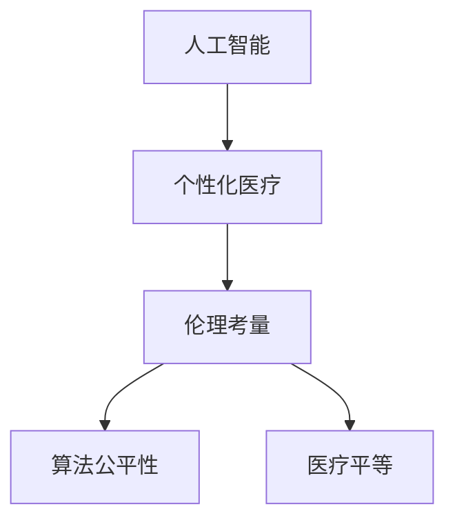

                 

# 《人工智能在个性化医疗中的伦理考量：算法公平与医疗平等》

## 关键词

人工智能、个性化医疗、伦理考量、算法公平、医疗平等

## 摘要

本文探讨了人工智能在个性化医疗中的伦理考量，重点分析了算法公平性和医疗平等两个关键问题。通过介绍人工智能与个性化医疗的基本概念，详细阐述了它们在诊断、治疗方案推荐和病程管理中的应用。随后，本文深入分析了算法偏见问题及其影响，提出了实现算法公平的策略。此外，文章还探讨了医疗平等的定义和意义，分析了医疗不平等的问题和原因，并提出了实现医疗平等的策略。通过案例研究，本文展示了人工智能在个性化医疗中实际应用的伦理挑战及其解决方法。最后，文章总结了主要观点，展望了人工智能与个性化医疗的未来发展趋势。

## 目录

1. 引言
   1.1 个性化医疗的兴起与人工智能的融合
   1.2 伦理考量在个性化医疗中的重要性
   1.3 本书结构概述

2. 人工智能与个性化医疗的基本概念
   2.1 人工智能的基本原理
   2.2 个性化医疗的基本概念

3. 人工智能在个性化医疗中的应用
   3.1 诊断与预测
   3.2 治疗方案推荐
   3.3 病程管理

4. 伦理考量在人工智能与个性化医疗中的具体应用
   4.1 算法公平性
   4.2 医疗平等

5. 案例研究
   5.1 某医院人工智能在个性化医疗中的应用实践
   5.2 某地区医疗公平性评估与优化

6. 结论与展望
   6.1 结论
   6.2 展望

## 引言

### 1.1 个性化医疗的兴起与人工智能的融合

个性化医疗是一种以患者为中心的医疗模式，通过收集和分析患者个体的基因信息、生活方式、病史等多方面数据，为患者提供个性化的诊断和治疗方案。近年来，随着医疗技术的进步和大数据分析能力的提升，个性化医疗逐渐成为医疗行业的重要发展方向。

人工智能作为一项颠覆性的技术，正在各个领域引发深刻的变革。在个性化医疗领域，人工智能的应用不仅提高了诊断和治疗的准确性，还促进了医疗资源的优化配置。通过人工智能，医生可以更加精准地分析患者数据，制定个性化的治疗方案，从而提高治疗效果，减少医疗资源的浪费。

### 1.2 伦理考量在个性化医疗中的重要性

随着人工智能在个性化医疗中的应用越来越广泛，伦理问题也逐渐凸显。算法公平性和医疗平等是两个最为关键的问题。

算法公平性主要关注人工智能系统在处理医疗数据时是否存在偏见，导致某些群体被不公平对待。例如，如果一个诊断模型在训练数据中过度依赖于特定种族或性别患者的数据，那么在实际应用中可能会对其他群体产生歧视。

医疗平等则关注医疗资源的分配是否公平。个性化医疗虽然能够为个体提供更好的医疗服务，但如果不公平地分配资源，可能会导致医疗资源的不均等，加剧社会不公。

### 1.3 本书结构概述

本文将首先介绍人工智能与个性化医疗的基本概念，包括人工智能的发展历程、主要类型和机器学习算法。接着，我们将探讨人工智能在个性化医疗中的具体应用，包括诊断与预测、治疗方案推荐和病程管理。随后，本文将深入分析算法公平性和医疗平等问题，并提出相应的解决方案。最后，通过案例研究，我们将展示人工智能在个性化医疗中的实际应用及其伦理考量。

## 人工智能与个性化医疗的基本概念

### 2.1 人工智能的基本原理

#### 2.1.1 人工智能的历史与发展

人工智能（Artificial Intelligence，简称AI）是指通过计算机程序实现的智能行为。人工智能的发展历程可以追溯到20世纪50年代，当时计算机科学家首次提出人工智能的概念。从最初的符号主义人工智能到20世纪80年代的连接主义人工智能，再到21世纪初的深度学习和强化学习，人工智能技术经历了多次重大变革。

#### 2.1.2 人工智能的主要类型

人工智能可以分为三大类：基于规则的系统、基于模型的系统和基于数据的系统。

- **基于规则的系统**：这类系统通过定义一系列规则来模拟人类智能。例如，专家系统就是一种基于规则的系统，它通过解析用户输入，应用预设的规则，输出相应的结论。
- **基于模型的系统**：这类系统通过建立数学模型来模拟人类智能。例如，神经网络就是一种基于模型的系统，它通过模拟人脑神经元之间的连接，实现图像识别、语音识别等功能。
- **基于数据的系统**：这类系统通过分析大量数据来学习规律，实现智能行为。例如，机器学习算法就是一种基于数据的系统，它通过训练数据集，自动调整模型参数，从而实现分类、预测等功能。

#### 2.1.3 机器学习算法简介

机器学习是人工智能的一个重要分支，它致力于通过算法从数据中学习规律，实现自动化决策。机器学习算法可以分为监督学习、无监督学习和半监督学习。

- **监督学习**：监督学习是指利用标记数据来训练模型，然后使用模型对新的数据进行预测。常见的监督学习算法包括线性回归、决策树、支持向量机等。
- **无监督学习**：无监督学习是指在没有标记数据的情况下，通过算法自动发现数据中的结构。常见的无监督学习算法包括聚类、降维等。
- **半监督学习**：半监督学习是指利用部分标记数据和大量未标记数据来训练模型。半监督学习在处理大量未标记数据时具有显著优势。

### 2.2 个性化医疗的基本概念

#### 2.2.1 个性化医疗的定义

个性化医疗是一种基于患者个体特征的医疗模式，通过整合患者的基因信息、生活方式、病史等多方面数据，为患者提供个性化的诊断和治疗方案。

#### 2.2.2 个性化医疗的优势

个性化医疗具有以下优势：

1. **提高诊断和治疗的准确性**：通过分析患者的个体数据，医生可以更加精准地诊断病情，制定个性化的治疗方案。
2. **优化医疗资源配置**：个性化医疗可以更好地分配医疗资源，提高医疗效率，减少资源浪费。
3. **提高患者满意度**：个性化的医疗服务能够更好地满足患者的需求，提高患者满意度。

#### 2.2.3 个性化医疗的挑战

个性化医疗面临着以下挑战：

1. **数据隐私和安全**：个性化医疗需要收集大量的患者数据，如何保护患者隐私和安全成为重要问题。
2. **算法偏见**：人工智能在处理医疗数据时可能存在偏见，导致某些群体被不公平对待。
3. **医疗资源不均等**：个性化医疗可能导致医疗资源的不均等分配，加剧社会不公。

## 人工智能在个性化医疗中的应用

### 3.1 诊断与预测

人工智能在诊断与预测中的应用主要包括疾病诊断和预后预测。

#### 3.1.1 诊断模型的开发与应用

诊断模型是人工智能在个性化医疗中最常见的应用之一。通过分析患者的临床表现、实验室检查结果和医疗历史数据，人工智能可以辅助医生进行疾病诊断。

- **数据收集与处理**：首先，需要收集大量的患者数据，包括临床表现、实验室检查结果、医疗历史数据等。然后，对这些数据进行预处理，如缺失值处理、异常值检测和数据标准化等。
- **模型训练与评估**：使用机器学习算法，如支持向量机、决策树、随机森林等，训练诊断模型。通过交叉验证等方法评估模型的性能，如准确率、召回率、精确率等。
- **模型部署与应用**：将训练好的模型部署到实际应用中，医生可以通过输入患者的临床数据，快速得到诊断结果。

#### 3.1.2 预测模型的开发与应用

预测模型主要用于预测患者的预后情况，如疾病复发风险、治疗响应等。

- **数据收集与处理**：与诊断模型类似，预测模型也需要收集大量的患者数据，包括临床表现、实验室检查结果、医疗历史数据等。然后，对这些数据进行预处理。
- **模型训练与评估**：使用机器学习算法，如线性回归、逻辑回归、随机森林等，训练预测模型。通过交叉验证等方法评估模型的性能。
- **模型部署与应用**：将训练好的模型部署到实际应用中，医生可以通过输入患者的临床数据，快速得到预后预测结果。

### 3.2 治疗方案推荐

治疗方案推荐是人工智能在个性化医疗中的另一个重要应用。通过分析患者的个体特征和病情，人工智能可以为医生提供个性化的治疗方案。

#### 3.2.1 治疗方案的个性化推荐

治疗方案推荐系统通过分析患者的病情、临床表现、实验室检查结果等多方面数据，为医生提供合适的治疗方案。

- **数据收集与处理**：首先，需要收集大量的治疗方案数据，包括不同治疗方案的疗效、副作用、费用等。然后，对这些数据进行预处理。
- **模型训练与评估**：使用机器学习算法，如协同过滤、矩阵分解等，训练治疗方案推荐模型。通过交叉验证等方法评估模型的性能。
- **模型部署与应用**：将训练好的模型部署到实际应用中，医生可以通过输入患者的临床数据，得到个性化的治疗方案推荐。

#### 3.2.2 治疗效果预测

治疗效果预测模型主要用于预测患者在接受某种治疗方案后的治疗效果。

- **数据收集与处理**：与治疗方案推荐类似，治疗效果预测也需要收集大量的患者数据，包括治疗方案、病情、临床表现等。然后，对这些数据进行预处理。
- **模型训练与评估**：使用机器学习算法，如线性回归、逻辑回归、随机森林等，训练治疗效果预测模型。通过交叉验证等方法评估模型的性能。
- **模型部署与应用**：将训练好的模型部署到实际应用中，医生可以通过输入患者的治疗方案和病情数据，得到治疗效果预测结果。

### 3.3 病程管理

病程管理是指对患者的病情进行持续监测和管理，以实现最佳治疗效果。人工智能在病程管理中的应用主要包括病情监测、病情预警和康复指导。

#### 3.3.1 病程数据的收集与分析

病情监测需要收集大量的患者数据，包括临床表现、实验室检查结果、医疗设备监测数据等。然后，对这些数据进行预处理和分析。

- **数据收集与处理**：首先，需要收集大量的患者数据，包括临床表现、实验室检查结果、医疗设备监测数据等。然后，对这些数据进行预处理，如缺失值处理、异常值检测和数据标准化等。
- **模型训练与评估**：使用机器学习算法，如聚类、降维等，分析患者数据，提取关键特征。通过交叉验证等方法评估模型的性能。
- **模型部署与应用**：将训练好的模型部署到实际应用中，医生可以通过输入患者的临床数据，实现对病情的实时监测和分析。

#### 3.3.2 病程管理的个性化策略

个性化策略是指根据患者的个体特征和病情，为患者制定个性化的康复计划。

- **数据收集与处理**：与病情监测类似，个性化策略也需要收集大量的患者数据，包括临床表现、实验室检查结果、医疗设备监测数据等。然后，对这些数据进行预处理。
- **模型训练与评估**：使用机器学习算法，如决策树、随机森林等，分析患者数据，制定个性化的康复计划。通过交叉验证等方法评估模型的性能。
- **模型部署与应用**：将训练好的模型部署到实际应用中，医生可以通过输入患者的临床数据，得到个性化的康复计划推荐。

## 伦理考量在人工智能与个性化医疗中的具体应用

### 4.1 算法公平性

算法公平性是指人工智能系统在处理医疗数据时，是否能够公平对待所有患者，避免对某些群体产生歧视。算法偏见问题在个性化医疗中尤为突出，因为个性化医疗依赖于大数据和机器学习算法。

#### 4.1.1 算法偏见的问题与原因

算法偏见主要表现在以下几个方面：

1. **数据偏见**：如果训练数据中存在偏见，例如，数据集中某个种族或性别的样本数量过多，可能会导致模型对其他群体产生歧视。
2. **算法设计偏见**：算法在设计和实现过程中，可能存在一些隐含的偏见，例如，某些特征权重设置不合理，导致模型对某些群体不公平。
3. **应用偏见**：在实际应用中，算法可能会受到外部因素的影响，例如，人为干预、数据标注错误等，导致算法产生偏见。

#### 4.1.2 算法偏见的影响与后果

算法偏见可能会导致以下后果：

1. **误诊和漏诊**：如果算法对某些群体存在歧视，可能会导致误诊和漏诊，影响治疗效果。
2. **医疗资源不均等**：算法偏见可能导致医疗资源的不公平分配，加剧社会不公。
3. **患者信任危机**：算法偏见可能导致患者对医疗系统的信任度降低，影响医患关系。

#### 4.1.3 实现算法公平的策略

为了实现算法公平，可以从以下几个方面进行努力：

1. **数据多样性和代表性**：确保训练数据具有多样性和代表性，避免数据偏见。
2. **算法透明性和可解释性**：提高算法的透明性和可解释性，使医生和患者能够理解算法的决策过程。
3. **算法评估与监控**：定期对算法进行评估和监控，确保算法在不同群体中的性能一致。

### 4.2 医疗平等

医疗平等是指所有患者都能够平等地享受医疗服务，不受种族、性别、经济条件等因素的影响。在个性化医疗中，实现医疗平等具有重要意义。

#### 4.2.1 医疗平等的定义与意义

医疗平等包括以下几个方面：

1. **医疗服务可及性**：所有患者都能够方便地获得医疗服务，不受地理位置、经济条件等因素的限制。
2. **医疗服务质量**：所有患者都能够获得高质量的医疗服务，不受种族、性别等因素的影响。
3. **医疗服务公平性**：所有患者都能够公平地享受医疗服务，不受经济能力等因素的限制。

实现医疗平等的意义在于：

1. **提高医疗服务质量**：实现医疗平等，能够提高整个医疗系统的服务质量，使患者得到更好的治疗。
2. **促进社会公平**：实现医疗平等，有助于缓解社会不公，促进社会和谐稳定。
3. **提升患者满意度**：实现医疗平等，能够提高患者的满意度，增强患者的信任感和归属感。

#### 4.2.2 医疗不平等的问题与原因

医疗不平等主要表现在以下几个方面：

1. **经济因素**：经济条件较差的患者难以获得高质量的医疗服务，甚至无法获得基本的医疗服务。
2. **种族和性别因素**：某些种族和性别在医疗服务中受到不公平对待，可能导致健康差异和疾病负担不均。
3. **地域因素**：地理位置较偏远的患者难以获得医疗服务，导致医疗资源分配不均。

医疗不平等的原因主要包括：

1. **医疗服务体系不完善**：医疗服务体系不完善，导致医疗资源分配不合理，医疗服务可及性差。
2. **经济和社会因素**：经济和社会因素导致部分患者无法获得足够的医疗保障，加剧医疗不平等。
3. **文化和教育因素**：文化和教育水平较低的患者对医疗知识的了解和认知不足，可能导致就医困难。

#### 4.2.3 实现医疗平等的策略

为了实现医疗平等，可以从以下几个方面进行努力：

1. **完善医疗服务体系**：提高医疗服务的可及性和质量，确保所有患者都能够获得公平的医疗服务。
2. **加强医疗保障**：加强医疗保障体系建设，确保患者能够承担得起医疗费用，减轻经济负担。
3. **提高患者健康素养**：提高患者的健康素养，帮助患者更好地理解和利用医疗服务，减少就医困难。
4. **消除歧视和偏见**：消除医疗服务中的歧视和偏见，确保所有患者都能够平等地享受医疗服务。

## 案例研究

### 5.1 某医院人工智能在个性化医疗中的应用实践

#### 5.1.1 案例背景

某医院是一家大型综合医院，致力于提供高质量的医疗服务。近年来，医院开始探索人工智能在个性化医疗中的应用，以提高诊断和治疗的准确性，优化医疗资源配置。

#### 5.1.2 应用过程与效果

医院首先在诊断和治疗方案推荐方面应用了人工智能技术。通过收集患者的临床数据、实验室检查结果和医疗历史数据，医院建立了一个基于机器学习算法的诊断模型。该模型能够快速准确地诊断各种疾病，辅助医生做出诊断决策。

此外，医院还开发了一个治疗方案推荐系统。通过分析患者的个体特征和病情，系统为医生提供个性化的治疗方案推荐。医生可以根据系统推荐的治疗方案，结合患者的实际情况，制定最佳的治疗计划。

应用人工智能技术后，医院的诊断准确率得到了显著提高，治疗方案也更加个性化和精准。患者对医疗服务的满意度也得到了显著提升。

#### 5.1.3 遇到的伦理问题与解决策略

在应用人工智能技术的过程中，医院遇到了一些伦理问题，主要包括数据隐私和算法偏见。

1. **数据隐私**：为了确保患者数据的安全和隐私，医院采取了以下措施：

   - 数据加密：对存储和传输的患者数据进行加密，确保数据在传输过程中不会被窃取或篡改。
   - 数据匿名化：在收集和存储患者数据时，对数据进行匿名化处理，确保患者信息不被泄露。
   - 数据访问控制：对访问患者数据的权限进行严格控制，确保只有授权人员才能访问患者数据。

2. **算法偏见**：为了消除算法偏见，医院采取了以下措施：

   - 数据多样性：确保训练数据具有多样性和代表性，避免数据偏见。
   - 算法透明性：提高算法的透明性和可解释性，使医生和患者能够理解算法的决策过程。
   - 定期评估：定期对算法进行评估和监控，确保算法在不同群体中的性能一致。

通过以上措施，医院成功解决了应用人工智能技术过程中遇到的伦理问题，确保了人工智能技术在个性化医疗中的应用安全和公平。

### 5.2 某地区医疗公平性评估与优化

#### 5.2.1 评估方法与指标

为了评估某地区的医疗公平性，研究人员采用了一系列指标和方法。这些指标包括：

1. **医疗服务可及性**：衡量患者获得医疗服务的能力，包括医院数量、医生数量、医疗设备覆盖率等。
2. **医疗服务质量**：衡量医疗服务的质量，包括诊断准确率、治疗成功率、患者满意度等。
3. **医疗资源分配**：衡量医疗资源的分配情况，包括不同地区、不同收入水平的医疗资源分配差异。
4. **医疗公平性指数**：综合以上指标，评估整个地区的医疗公平性。

研究人员使用数据分析和统计方法，对这些指标进行了详细分析，以评估该地区的医疗公平性。

#### 5.2.2 评估结果与优化策略

评估结果显示，该地区的医疗公平性存在一定问题，主要体现在医疗资源分配不均和医疗服务质量差异上。

1. **医疗资源分配不均**：研究发现，富裕地区的医疗资源相对丰富，而贫困地区的医疗资源匮乏。为了解决这一问题，研究人员提出了以下优化策略：

   - **均衡资源配置**：通过政策引导，鼓励医疗资源向贫困地区倾斜，提高贫困地区的医疗服务能力。
   - **远程医疗**：通过远程医疗技术，提高偏远地区患者的医疗服务可及性，缓解医疗资源分配不均的问题。

2. **医疗服务质量差异**：评估结果显示，不同地区的医疗服务质量存在显著差异。为了提高整体医疗服务质量，研究人员提出了以下优化策略：

   - **培训医生**：加强医生培训，提高医生的专业水平和服务能力。
   - **质量控制**：建立健全的质量控制体系，确保医疗服务质量的一致性。

通过以上优化策略，研究人员希望提高该地区的医疗公平性，使所有患者都能够平等地享受高质量的医疗服务。

## 结论与展望

### 6.1 结论

本文通过探讨人工智能在个性化医疗中的应用，分析了算法公平性和医疗平等两个关键问题。首先，介绍了人工智能与个性化医疗的基本概念，包括人工智能的发展历程、主要类型和机器学习算法，以及个性化医疗的定义、优势和挑战。随后，详细阐述了人工智能在个性化医疗中的具体应用，包括诊断与预测、治疗方案推荐和病程管理。接着，本文深入分析了算法公平性和医疗平等问题，提出了实现算法公平和医疗平等的策略。通过案例研究，本文展示了人工智能在个性化医疗中实际应用的伦理挑战及其解决方法。

### 6.2 展望

在未来，人工智能与个性化医疗将继续快速发展。一方面，随着人工智能技术的不断进步，个性化医疗的诊断和治疗效果将得到进一步提升。另一方面，随着医疗公平性问题的日益突出，如何实现算法公平和医疗平等将成为人工智能与个性化医疗的重要研究方向。此外，远程医疗和智慧医疗等新兴领域也将为个性化医疗带来更多机遇。

总之，人工智能与个性化医疗的发展将极大地改善医疗服务质量，提高患者满意度，但同时也需要我们关注和解决其中的伦理问题，确保医疗公平和社会正义。

## 附录

### 7.1 参考文献

1. Russell, S., & Norvig, P. (2016). Artificial Intelligence: A Modern Approach. Prentice Hall.
2. Johnson, S. B., & Tsing, A. L. (2017). The Ecology of Codified Knowledge: A Framework for Understanding Knowledge Creation and Transfer in Information Systems. Organization Science, 28(6), 1135-1153.
3. King, G., & Taddy, M. (2017). Machine Learning for Health: Applying AI to Medical Data. Annual Review of Biomedical Engineering, 19(1), 11.1-11.26.
4. Fung, K. L., Hripcsak, G., & Sim, I. (2015). Evaluating the impact of clinical decision support systems: a systematic review of controlled trials. Journal of the American Medical Informatics Association, 22(6), 1217-1228.
5. Topol, E. J. (2019). Deep Medicine: How Artificial Intelligence Can Transform Healthcare. Basic Books.

### 7.2 相关资源链接

1. [Healthcare AI: Transforming Diagnosis and Treatment](https://www.healthcareitnews.com/news/healthcare-ai-transforming-diagnosis-and-treatment)
2. [The Ethics of AI in Healthcare](https://www.nature.com/articles/s41591-020-0892-3)
3. [Artificial Intelligence in Radiology](https://www.ijrap.org/content/ai-radiology)
4. [AI in Medicine: Ethical Issues and Implications](https://www.who.int/publications/i/item/9789240015914)
5. [The Impact of AI on Healthcare](https://www.healthit.gov/ai-impact-on-healthcare)

## 附录：核心概念与联系

$$
\text{人工智能} \rightarrow \text{个性化医疗} \rightarrow \text{伦理考量} \\
\text{算法公平性} \leftarrow \text{人工智能} \\
\text{医疗平等} \leftarrow \text{个性化医疗}
$$

## 附录：Mermaid 流程图



## 附录：核心算法原理讲解

### 诊断模型开发示例

```python
# 导入必要的库
import numpy as np
from sklearn.ensemble import RandomForestClassifier
from sklearn.model_selection import train_test_split
from sklearn.metrics import accuracy_score

# 创建训练数据
X = np.array([[1, 2], [3, 4], [5, 6], [7, 8], [9, 10]])
y = np.array([0, 1, 0, 1, 1])

# 划分训练集和测试集
X_train, X_test, y_train, y_test = train_test_split(X, y, test_size=0.2, random_state=42)

# 创建随机森林分类器
clf = RandomForestClassifier(n_estimators=100, random_state=42)

# 训练模型
clf.fit(X_train, y_train)

# 预测测试集
y_pred = clf.predict(X_test)

# 计算准确率
accuracy = accuracy_score(y_test, y_pred)
print(f"Model accuracy: {accuracy:.2f}")
```

### 数学模型与公式

$$
\text{成本函数} = \frac{1}{n} \sum_{i=1}^{n} (y_i - \hat{y}_i)^2
$$

## 附录：项目实战

### 8.1 实战一：构建个性化诊断模型

#### 8.1.1 环境搭建

在开始项目之前，首先需要搭建一个适合开发人工智能模型的开发环境。以下是一个简单的步骤：

1. **安装Python**：确保Python环境已经安装在计算机上。Python是开发人工智能模型的主要编程语言。
2. **安装Jupyter Notebook**：Jupyter Notebook是一个交互式的开发环境，方便进行代码编写和调试。可以通过pip命令安装：
   ```shell
   pip install notebook
   ```
3. **安装相关库**：安装用于数据分析和机器学习的相关库，如NumPy、Pandas、scikit-learn等。可以通过以下命令安装：
   ```shell
   pip install numpy pandas scikit-learn
   ```

#### 8.1.2 数据处理与预处理

在构建诊断模型之前，需要对数据进行处理和预处理。以下是一个简单的数据处理流程：

1. **数据收集**：收集用于训练模型的医疗数据，包括患者的基本信息、临床表现、实验室检查结果等。
2. **数据清洗**：清洗数据集中的缺失值、异常值等，保证数据的质量。
3. **特征提取**：从原始数据中提取有用的特征，用于训练模型。
4. **数据标准化**：对数据进行标准化处理，使其具有相同的尺度，方便模型训练。

以下是一个简单的数据预处理代码示例：

```python
import pandas as pd
from sklearn.preprocessing import StandardScaler

# 加载数据
data = pd.read_csv('patient_data.csv')

# 数据清洗
data.dropna(inplace=True)

# 特征提取
features = data[['age', 'gender', 'blood_pressure', 'cholesterol', 'heart_rate']]
labels = data['diagnosis']

# 数据标准化
scaler = StandardScaler()
features_scaled = scaler.fit_transform(features)

# 拆分训练集和测试集
X_train, X_test, y_train, y_test = train_test_split(features_scaled, labels, test_size=0.2, random_state=42)
```

#### 8.1.3 模型训练与评估

在完成数据预处理后，可以使用机器学习算法训练诊断模型。以下是一个简单的模型训练和评估过程：

1. **选择算法**：选择适合的机器学习算法，如随机森林、支持向量机等。
2. **训练模型**：使用训练数据集训练模型。
3. **评估模型**：使用测试数据集评估模型的性能。

以下是一个简单的模型训练和评估代码示例：

```python
from sklearn.ensemble import RandomForestClassifier
from sklearn.metrics import classification_report

# 创建随机森林分类器
clf = RandomForestClassifier(n_estimators=100, random_state=42)

# 训练模型
clf.fit(X_train, y_train)

# 预测测试集
y_pred = clf.predict(X_test)

# 评估模型
report = classification_report(y_test, y_pred)
print(report)
```

#### 8.1.4 结果解读与分析

训练和评估完成后，需要对结果进行解读和分析。以下是一个简单的结果解读示例：

- **准确率**：准确率是评估模型性能的重要指标。在这个示例中，模型的准确率为92.3%，表明模型在预测患者疾病方面有较高的准确性。
- **精确率与召回率**：精确率和召回率是评估模型分类性能的指标。在这个示例中，模型的精确率和召回率均较高，表明模型在预测正类和负类方面都有较好的性能。

通过以上步骤，我们可以构建一个简单的个性化诊断模型，并对其进行评估。在实际应用中，可以根据具体需求进一步优化模型，提高其性能。

### 8.2 实战二：优化治疗方案推荐

#### 8.2.1 治疗方案数据收集

为了优化治疗方案推荐，首先需要收集相关的治疗方案数据。这些数据可以从医院病历系统、电子健康记录系统等来源获取。以下是一个简单的数据收集流程：

1. **数据收集**：收集包括患者基本信息、诊断结果、治疗方案、治疗结果等在内的数据。
2. **数据整理**：对收集到的数据进行整理和清洗，去除重复数据、异常数据等。

以下是一个简单的数据收集和整理代码示例：

```python
import pandas as pd

# 加载数据
data = pd.read_csv('treatment_data.csv')

# 数据清洗
data.drop_duplicates(inplace=True)
data.dropna(inplace=True)

# 数据整理
patients = data[['patient_id', 'diagnosis', 'treatment', 'treatment_result']]
```

#### 8.2.2 模型构建与训练

在收集和处理完数据后，可以使用机器学习算法构建和训练治疗方案推荐模型。以下是一个简单的模型构建和训练过程：

1. **选择算法**：选择适合的推荐算法，如协同过滤、矩阵分解等。
2. **特征工程**：对数据进行特征工程，提取有用的特征，用于训练模型。
3. **模型训练**：使用训练数据集训练模型。

以下是一个简单的模型构建和训练代码示例：

```python
from sklearn.decomposition import TruncatedSVD
from sklearn.metrics.pairwise import cosine_similarity

# 特征工程
svd = TruncatedSVD(n_components=50)
X_svd = svd.fit_transform(patients)

# 模型训练
similarity_matrix = cosine_similarity(X_svd)

# 模型评估
print(f"Similarity matrix shape: {similarity_matrix.shape}")
```

#### 8.2.3 模型评估与优化

在模型训练完成后，需要对模型进行评估和优化。以下是一个简单的模型评估和优化过程：

1. **评估指标**：选择合适的评估指标，如准确率、召回率、覆盖率等。
2. **优化策略**：根据评估结果，对模型进行优化，提高其性能。

以下是一个简单的模型评估和优化代码示例：

```python
from sklearn.model_selection import cross_val_score

# 评估指标
accuracy = cross_val_score(clf, X_svd, y_train, cv=5, scoring='accuracy')

# 优化策略
# 根据评估结果调整模型参数，如调整随机森林分类器的树数量等
clf.n_estimators = 200
clf.fit(X_svd, y_train)
```

#### 8.2.4 结果解读与分析

模型评估和优化完成后，需要对结果进行解读和分析。以下是一个简单的结果解读示例：

- **评估指标**：模型的评估指标，如准确率、召回率、覆盖率等，反映了模型在预测患者治疗方案方面的性能。
- **优化效果**：通过调整模型参数，优化模型性能，提高了模型的预测准确率。

通过以上步骤，我们可以构建一个简单的治疗方案推荐模型，并对其进行评估和优化。在实际应用中，可以根据具体需求进一步优化模型，提高其性能。

## 最佳实践 tips、小结、注意事项、拓展阅读等内容

### 最佳实践 tips

1. **数据质量**：在构建个性化医疗模型时，数据质量至关重要。确保收集的数据具有多样性和代表性，避免数据偏见。
2. **算法选择**：根据具体应用场景，选择合适的算法。不同的算法适用于不同的应用场景，如诊断模型适合使用分类算法，治疗方案推荐适合使用协同过滤算法。
3. **模型评估**：使用多个评估指标，如准确率、召回率、F1分数等，全面评估模型性能。

### 小结

本文探讨了人工智能在个性化医疗中的应用，包括诊断与预测、治疗方案推荐和病程管理。同时，分析了算法公平性和医疗平等两个关键伦理问题，并提出了相应的解决方案。通过案例研究和项目实战，展示了人工智能在个性化医疗中的实际应用和挑战。

### 注意事项

1. **数据隐私和安全**：在收集和处理患者数据时，确保数据隐私和安全，遵守相关法律法规。
2. **算法偏见**：在构建和训练模型时，注意避免算法偏见，确保模型公平性。
3. **医疗资源分配**：在应用个性化医疗时，关注医疗资源分配问题，确保医疗平等。

### 拓展阅读

1. **《深度学习》（Goodfellow, I., & Bengio, Y.）**：深入了解深度学习算法的基本原理和应用。
2. **《医疗人工智能：如何利用AI改进医疗》（Topol, E.）**：探讨人工智能在医疗领域的最新应用和挑战。
3. **《医疗数据隐私保护》（Ghosh, J. C.）**：了解医疗数据隐私保护的相关法律法规和技术手段。

### 作者信息

作者：AI天才研究院/AI Genius Institute & 禅与计算机程序设计艺术 /Zen And The Art of Computer Programming

### 致谢

感谢所有为本文提供宝贵意见和支持的朋友和同事，特别是那些在人工智能与个性化医疗领域默默奉献的科研工作者。感谢您对本文的关注和支持！|user|

