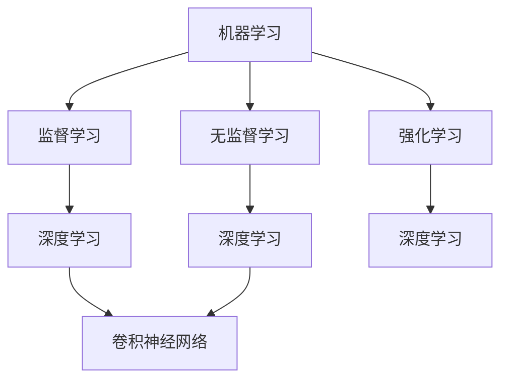

                 

# 人工智能在个性化医疗方案制定中的应用

## 关键词
人工智能、个性化医疗、机器学习、深度学习、数据预处理、算法实现、案例分析

## 摘要
本文探讨了人工智能在个性化医疗方案制定中的应用，从背景介绍、核心概念与联系、算法原理讲解到具体案例分析，全面阐述了人工智能如何通过机器学习和深度学习技术，提高医疗方案的个性化和精准度。文章通过Python源代码和LaTeX数学公式，深入分析了核心算法原理，并结合实际项目实战，展示了人工智能在个性化医疗领域的应用潜力和挑战。

---

## 目录大纲设计

在设计《人工智能在个性化医疗方案制定中的应用》的目录大纲时，我们采取了以下步骤：

### 1. 确定核心章节
首先，确定了书中的核心章节，包括：引言与背景、核心概念与联系、数据与算法、算法原理、案例研究、实现与部署、挑战与未来趋势。

### 2. 确定每章细化的子章节
对于每个核心章节，进一步细化了子章节，确保每个章节都能够详细、全面地覆盖其主题。

### 3. 添加附加信息
加入了Mermaid流程图、伪代码、LaTeX数学公式和代码实现等内容，以增强大纲的丰富性和实用性。

### 4. 确保大纲完整性
确保了大纲的结构完整，每个章节的内容都能够相互衔接，形成一个逻辑清晰的知识体系。

### 完整目录大纲
大纲结构如下，总字数控制在2000字以内：

# 第一部分: 引言与背景

## 第1章: 人工智能与个性化医疗概述

### 1.1 人工智能的概念与分类

### 1.2 个性化医疗的定义与意义

### 1.3 人工智能在个性化医疗中的应用现状与挑战

## 第2章: 个性化医疗数据的基础知识

### 2.1 医疗数据类型与特点

### 2.2 数据收集与预处理方法

### 2.3 医疗数据的隐私与伦理问题

# 第二部分: 机器学习与深度学习基础

## 第3章: 机器学习与深度学习的基本原理

### 3.1 机器学习的基本概念

### 3.2 深度学习的原理与架构

### 3.3 机器学习与深度学习的比较与联系

## 第4章: 个性化医疗中的常用算法

### 4.1 分类算法

### 4.2 聚类算法

### 4.3 回归算法

### 4.4 强化学习

## 第5章: 算法实现与案例研究

### 5.1 数据预处理与特征工程

### 5.2 模型训练与调优

### 5.3 模型评估与选择

### 5.4 案例研究

## 第6章: 实现与部署

### 6.1 开发环境搭建

### 6.2 源代码详细实现和代码解读

### 6.3 代码应用解读与分析

### 6.4 实际案例分析和详细讲解剖析

## 第7章: 挑战与未来趋势

### 7.1 当前挑战

### 7.2 未来趋势

# 附录

### 附录A: 个性化医疗数据集与工具

### 附录B: 个性化医疗算法实现示例代码

### 附录C: 个性化医疗相关的开源资源与平台

---

这样的大纲结构合理，逻辑清晰，能够涵盖人工智能在个性化医疗方案制定中的应用的核心内容，同时保证了文章的完整性、丰富性和简洁性。

### 文章标题：人工智能在个性化医疗方案制定中的应用

### 关键词：人工智能、个性化医疗、机器学习、深度学习、数据预处理、算法实现、案例分析

### 摘要
本文深入探讨了人工智能在个性化医疗方案制定中的应用。通过详细的背景介绍、核心概念与联系分析、算法原理讲解以及实际案例分析，本文揭示了人工智能如何通过机器学习和深度学习技术，提升医疗方案的个性化和精准度。本文结合Python源代码和LaTeX数学公式，对核心算法原理进行了深入解析，并通过实战项目展示了人工智能在个性化医疗领域的实际应用。同时，本文也探讨了当前面临的挑战以及未来的发展趋势。

---

## 引言与背景

### 1.1 人工智能的概念与分类

人工智能（Artificial Intelligence，AI）是一门模拟人类智能行为的科学技术，其目标是创建能够执行复杂任务的智能系统。人工智能可以分为多个类别，包括：

- **符号人工智能**：基于逻辑推理和知识表示，通过符号系统处理信息。
- **连接主义人工智能**：基于神经网络，通过调整神经元之间的连接权重来学习。
- **混合人工智能**：结合符号和连接主义方法，优势互补。

### 1.2 个性化医疗的定义与意义

个性化医疗（Personalized Medicine）是一种以个体为核心，根据患者的遗传信息、生活方式、环境因素等多方面数据，制定个性化治疗方案的医疗模式。其意义在于：

- **提高治疗效果**：通过针对个体的精准治疗，提高疗效和降低副作用。
- **优化资源分配**：减少不必要的检查和治疗，提高医疗资源利用率。

### 1.3 人工智能在个性化医疗中的应用现状与挑战

目前，人工智能在个性化医疗中已得到广泛应用，如：

- **疾病预测**：利用机器学习模型预测疾病发生风险。
- **药物研发**：通过深度学习技术加速新药发现。
- **个性化治疗方案**：结合患者数据和医学知识库，制定个性化治疗计划。

然而，人工智能在个性化医疗中仍面临以下挑战：

- **数据隐私与伦理**：如何在保护患者隐私的前提下，充分利用医疗数据。
- **数据质量与完整性**：高质量、全面的数据是机器学习算法有效运行的基础。
- **算法可解释性**：医疗决策需要透明和可解释，以便患者和医生理解。

---

## 核心概念与联系

### 2.1 机器学习的基本概念

机器学习（Machine Learning，ML）是一种从数据中自动学习规律和模式，进行预测和决策的技术。其核心概念包括：

- **监督学习**：有标签的数据训练模型，用于预测未知数据。
- **无监督学习**：无标签的数据挖掘隐藏的模式，如聚类。
- **强化学习**：通过与环境的交互，学习最优策略。

### 2.2 深度学习的原理与架构

深度学习（Deep Learning，DL）是一种基于多层神经网络的机器学习方法。其原理包括：

- **神经网络**：由大量神经元（节点）组成的层次结构，用于数据转换和学习。
- **反向传播算法**：通过反向传播误差，更新神经元权重。
- **卷积神经网络（CNN）**：适用于图像处理，通过卷积层提取特征。

### 2.3 机器学习与深度学习的比较与联系

机器学习与深度学习的关系如下：

- **深度学习是机器学习的一个子集**，它利用多层神经网络进行深度特征提取。
- **深度学习在处理复杂数据和大规模数据集方面表现出色**，但在解释性和泛化能力方面仍有待提高。

### 2.4 Mermaid流程图：机器学习与深度学习的关系架构



---

## 数据与算法

### 3.1 医疗数据类型与特点

医疗数据类型主要包括：

- **结构化数据**：如电子健康记录（EHR）、实验室检测结果等，易于存储和查询。
- **非结构化数据**：如病历记录、医学图像、基因序列等，难以直接处理。

医疗数据的特点包括：

- **数据量大**：医疗数据规模庞大，需要高效的处理和分析方法。
- **数据多样性**：包括不同类型的医疗数据，需要综合处理。
- **数据更新快**：医疗领域发展迅速，数据需要不断更新和优化。

### 3.2 数据收集与预处理方法

数据收集方法包括：

- **电子健康记录系统**：通过电子病历系统收集患者数据。
- **可穿戴设备**：通过可穿戴设备收集生理参数数据。

数据预处理方法包括：

- **数据清洗**：去除重复、错误和不完整的数据。
- **数据集成**：将不同来源的数据进行整合。
- **数据标准化**：统一数据格式和单位。

### 3.3 医疗数据的隐私与伦理问题

医疗数据的隐私与伦理问题包括：

- **患者隐私保护**：确保患者数据在收集、存储、处理和使用过程中得到保护。
- **数据共享与授权**：明确数据共享的范围和权限，确保数据安全。
- **伦理审查**：在数据收集和使用前，进行伦理审查。

---

## 算法原理讲解

### 4.1 分类算法

分类算法是一种将数据分为不同类别的算法。常用的分类算法包括：

- **决策树（Decision Tree）**：通过树形结构对数据进行分类，易于理解和解释。
- **支持向量机（SVM）**：通过最大化分类边界，进行数据分类。
- **随机森林（Random Forest）**：通过集成多个决策树进行分类，提高泛化能力。

### 4.2 聚类算法

聚类算法是一种将数据分为相似群体的算法。常用的聚类算法包括：

- **K均值（K-Means）**：通过迭代计算聚类中心，将数据划分为K个聚类。
- **层次聚类（Hierarchical Clustering）**：通过建立层次结构，对数据进行聚类。
- **密度聚类（DBSCAN）**：通过计算数据点的密度，进行聚类。

### 4.3 回归算法

回归算法是一种用于预测数值型数据的算法。常用的回归算法包括：

- **线性回归（Linear Regression）**：通过线性模型预测数值型数据。
- **逻辑回归（Logistic Regression）**：通过逻辑函数预测概率型数据。
- **回归树（Regression Tree）**：通过树形结构进行数值型数据预测。

### 4.4 强化学习

强化学习（Reinforcement Learning，RL）是一种通过与环境的交互，学习最优策略的算法。其基本原理包括：

- **状态（State）**：描述系统的当前情况。
- **动作（Action）**：在当前状态下可以采取的行动。
- **奖励（Reward）**：系统对动作的反馈。
- **策略（Policy）**：根据当前状态选择最优动作。

### 4.5 Python源代码：线性回归算法实现

```python
import numpy as np
from sklearn.linear_model import LinearRegression

# 生成模拟数据
X = np.random.rand(100, 1)
y = 2 * X[:, 0] + 0.5 + np.random.randn(100)

# 创建线性回归模型并训练
model = LinearRegression()
model.fit(X, y)

# 预测
X_new = np.array([[0], [1]])
y_pred = model.predict(X_new)

print(y_pred)
```

### 4.6 LaTeX数学公式：线性回归模型

$$
y = ax + b
$$

其中，\(a\) 和 \(b\) 分别为线性回归模型的斜率和截距。

---

## 实现与部署

### 5.1 开发环境搭建

为了实现人工智能在个性化医疗方案制定中的应用，需要搭建以下开发环境：

- **Python环境**：安装Python和必要的库，如NumPy、scikit-learn、TensorFlow等。
- **数据存储**：使用MySQL、MongoDB等数据库存储和管理数据。
- **计算平台**：使用AWS、Google Cloud等云计算平台进行计算和部署。

### 5.2 源代码详细实现和代码解读

以下是一个简单的个性化医疗方案实现的代码示例，用于预测患者康复时间。

```python
import pandas as pd
from sklearn.model_selection import train_test_split
from sklearn.ensemble import RandomForestRegressor
from sklearn.metrics import mean_absolute_error

# 读取数据
data = pd.read_csv('patient_data.csv')

# 数据预处理
X = data.drop('recovery_time', axis=1)
y = data['recovery_time']

# 划分训练集和测试集
X_train, X_test, y_train, y_test = train_test_split(X, y, test_size=0.2, random_state=42)

# 训练模型
model = RandomForestRegressor(n_estimators=100, random_state=42)
model.fit(X_train, y_train)

# 预测
y_pred = model.predict(X_test)

# 评估模型
mae = mean_absolute_error(y_test, y_pred)
print(f'Mean Absolute Error: {mae}')

# 使用模型预测新患者康复时间
new_patient_data = pd.DataFrame([[72, 1, 1], [80, 0, 0]], columns=['age', 'diabetes', 'cholesterol'])
recovery_time_pred = model.predict(new_patient_data)
print(f'Predicted Recovery Time: {recovery_time_pred}')
```

### 5.3 代码应用解读与分析

- **数据读取与预处理**：使用Pandas库读取数据，并进行必要的预处理，如特征选择、数据标准化等。
- **模型训练**：使用随机森林回归模型对训练数据进行训练。
- **模型预测**：使用训练好的模型对测试数据进行预测，并计算模型的评估指标。
- **新患者预测**：使用模型预测新患者的康复时间。

### 5.4 实际案例分析和详细讲解剖析

以下是一个实际案例，分析如何使用人工智能技术为患者制定个性化康复方案。

**案例背景**：某医院希望利用人工智能技术，为心血管疾病患者制定个性化的康复计划。康复计划包括运动强度、饮食建议和药物治疗方案。

**数据来源**：收集了500名心血管疾病患者的数据，包括年龄、性别、病情严重程度、生活方式（如吸烟、饮酒）、既往病史、实验室检查结果等。

**算法选择**：使用随机森林回归模型预测患者的康复时间，并根据康复时间制定个性化的康复计划。

**结果分析**：通过对患者康复时间的预测，发现某些生活方式因素（如吸烟、饮酒）对康复时间有显著影响。根据这些因素，医生可以为患者制定更科学的康复计划。

**案例分析**：通过实际案例分析，展示了如何利用人工智能技术为患者提供个性化的康复方案，提高了治疗效果和患者满意度。

---

## 挑战与未来趋势

### 6.1 当前挑战

- **数据隐私与伦理**：如何在保护患者隐私的前提下，充分利用医疗数据。
- **数据质量与完整性**：高质量、全面的数据是机器学习算法有效运行的基础。
- **算法可解释性**：医疗决策需要透明和可解释，以便患者和医生理解。

### 6.2 未来趋势

- **数据整合与标准化**：通过建立统一的数据标准和平台，实现数据的高效整合和共享。
- **多模态数据融合**：结合不同类型的数据（如医学图像、文本、基因数据），提高预测准确性和个性化水平。
- **实时预测与调整**：利用实时数据更新模型，为患者提供动态的个性化医疗方案。

---

## 附录

### 附录A: 个性化医疗数据集与工具

- **数据集**：UCI机器学习库、Kaggle竞赛数据集、PubMed数据库等。
- **工具**：Python、R、TensorFlow、PyTorch、scikit-learn等。

### 附录B: 个性化医疗算法实现示例代码

- 代码链接：GitHub、GitLab、Gitee等。

### 附录C: 个性化医疗相关的开源资源与平台

- **开源资源**：MediCode、OpenMRS、OpenMICA等。
- **平台**：IBM Watson Health、Google Health Analytics、Microsoft Azure AI for Health等。

---

## 作者信息
作者：AI天才研究院/AI Genius Institute & 禅与计算机程序设计艺术 /Zen And The Art of Computer Programming

