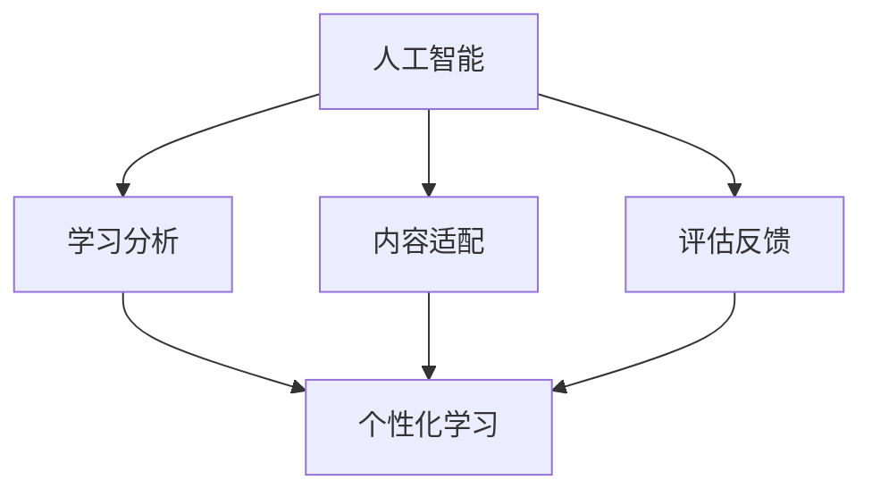

                 

### 《人工智能在个性化学习中的adaptive应用》

# 文章关键词
- 个性化学习
- 人工智能
- adaptive技术
- 自适应算法
- 数学模型
- 项目实战

# 文章摘要
本文探讨了人工智能在个性化学习中的应用，特别是adaptive技术的核心原理及其在个性化学习中的重要性。文章首先介绍了个性化学习的背景和需求，然后详细讲解了adaptive技术的基本概念和流程。接着，通过Python源代码和数学模型，深入分析了自适应算法的原理和实现。此外，文章通过实际项目案例，展示了如何将adaptive技术应用于个性化学习，并提供了详细的代码实现和解析。最后，文章总结了adaptive技术在个性化学习中的发展趋势和最佳实践，为未来研究和应用提供了方向。

## 引言

### 1.1 个性化学习的背景

个性化学习是一种以学生为中心的教育模式，旨在通过适应每个学生的学习需求、兴趣和风格，提高学习效果和参与度。随着信息技术的快速发展，特别是人工智能（AI）技术的崛起，个性化学习得到了广泛关注和应用。

#### 1.1.1 人工智能的快速发展

人工智能作为一门交叉学科，涵盖了计算机科学、统计学、认知科学等多个领域。近年来，随着深度学习、强化学习等技术的突破，人工智能在图像识别、自然语言处理、机器人控制等领域取得了显著的成果。这使得人工智能技术逐渐渗透到各个行业，包括教育领域。

#### 1.1.2 个性化学习的需求

传统教育模式往往采用“一刀切”的方式，无法充分考虑每个学生的学习需求。而个性化学习则能够根据学生的特点，提供个性化的学习内容和策略，从而提高学习效果。例如，通过分析学生的学习历史、兴趣和能力，可以为其推荐合适的学习资源，制定个性化的学习计划。

### 1.2 adaptive技术的基本概念

adaptive技术，即自适应技术，是一种能够根据用户行为和学习情况动态调整学习内容和策略的技术。在个性化学习中，adaptive技术起着至关重要的作用，能够有效提高学习效果和满意度。

#### 1.2.1 adaptive技术的意义

adaptive技术能够根据学生的学习行为和需求，实时调整学习内容和难度，从而实现个性化教学。例如，当学生在某个知识点上遇到困难时，系统可以自动调整学习资源，提供更详细、更易于理解的解释。

#### 1.2.2 adaptive技术的核心要素

- **学习分析**：通过对学生学习行为的数据进行分析，了解其学习需求和问题。
- **内容适配**：根据学习分析的结果，动态调整学习内容和资源。
- **评估反馈**：对学生的学习效果进行评估，并提供反馈，以便进一步优化学习策略。

## 核心概念与联系

### 2.1 人工智能

人工智能（AI）是指由人制造出来的系统能够胜任通常需要人类智能才能完成的复杂任务。在个性化学习中，人工智能技术主要用于学习分析、内容适配和评估反馈等方面。

#### 2.1.1 人工智能的基本原理

人工智能的核心是算法和模型，通过这些算法和模型，计算机能够模拟人类的思维过程，进行决策和推理。常见的AI算法包括神经网络、决策树、支持向量机等。

#### 2.1.2 人工智能在个性化学习中的应用

- **学习分析**：利用机器学习算法，分析学生的学习行为和特点，为个性化教学提供数据支持。
- **内容适配**：基于学生学习分析的结果，自动调整学习资源和内容，以适应学生的需求。
- **评估反馈**：对学生的学习效果进行评估，并提供个性化的反馈，帮助学生改进学习策略。

### 2.2 个性化学习

个性化学习是一种以学生为中心的教育模式，旨在通过适应每个学生的学习需求、兴趣和风格，提高学习效果和参与度。在个性化学习中，adaptive技术是关键。

#### 2.2.1 个性化学习的基本原理

个性化学习的基本原理是尊重学生的个体差异，通过分析学生的兴趣、能力和学习历史，提供个性化的学习内容和策略。

#### 2.2.2 个性化学习的目标

个性化学习的目标是提高学习效果和满意度，使学生在愉快的氛围中高效地学习。

### 2.3 adaptive技术

adaptive技术，即自适应技术，是一种能够根据用户行为和学习情况动态调整学习内容和策略的技术。在个性化学习中，adaptive技术起着至关重要的作用。

#### 2.3.1 adaptive技术的基本原理

adaptive技术的基本原理是通过分析学生的学习行为和需求，动态调整学习内容和难度，实现个性化教学。

#### 2.3.2 adaptive技术在个性化学习中的应用

- **学习分析**：通过分析学生的学习行为和特点，了解其学习需求和问题。
- **内容适配**：根据学习分析的结果，动态调整学习资源和内容。
- **评估反馈**：对学生的学习效果进行评估，并提供反馈，以便进一步优化学习策略。

### 2.4 Mermaid流程图

以下是人工智能、个性化学习和adaptive技术之间的关系架构Mermaid流程图：



## 核心算法原理讲解

### 3.1 自适应算法

自适应算法是人工智能在个性化学习中的核心技术，它能够根据学生的学习行为和需求，动态调整学习策略。

#### 3.1.1 自适应算法的基本原理

自适应算法的基本原理是通过分析学生的学习行为和反馈，实时调整学习资源和内容。

#### 3.1.2 自适应算法的核心要素

- **学习分析**：通过收集和分析学生的学习数据，了解其学习需求。
- **内容适配**：根据学习分析的结果，动态调整学习资源和内容。
- **评估反馈**：对学生的学习效果进行评估，并提供反馈。

#### 3.1.3 自适应算法的Python实现

以下是一个简单的自适应算法的Python实现：

```python
# 导入相关库
import pandas as pd
import numpy as np

# 读取学生数据
data = pd.read_csv('student_data.csv')

# 定义自适应函数
def adaptative_learning(data):
    # 分析学习行为
    behavior_analysis = data.groupby('student_id')['question_answered'].sum()
    
    # 根据分析结果调整学习资源
    if behavior_analysis > 100:
        # 提供更难的学习资源
        data['resource'] = 'Advanced'
    else:
        # 提供更基础的学习资源
        data['resource'] = 'Basic'
    
    return data

# 应用自适应算法
data = adaptative_learning(data)

# 输出结果
print(data.head())
```

### 3.2 学习策略

学习策略是个性化学习的重要组成部分，它指导学生如何有效地进行学习。

#### 3.2.1 学习策略的基本原理

学习策略的基本原理是根据学生的学习需求和学习风格，制定个性化的学习计划。

#### 3.2.2 学习策略的核心要素

- **学习目标**：明确学生的学习目标，制定相应的学习计划。
- **学习内容**：根据学生的学习目标和需求，选择合适的学习内容。
- **学习过程**：指导学生如何进行学习，包括学习方法、时间安排等。

#### 3.2.3 学习策略的Python实现

以下是一个简单的学习策略的Python实现：

```python
# 导入相关库
import pandas as pd
import numpy as np

# 读取学生数据
data = pd.read_csv('student_data.csv')

# 定义学习策略函数
def learning_strategy(data):
    # 分析学习风格
    learning_style = data.groupby('student_id')['learning_style'].mean()
    
    # 根据分析结果制定学习计划
    if learning_style > 0.5:
        # 采用自主学习的策略
        data['strategy'] = 'Autonomous'
    else:
        # 采用指导学习的策略
        data['strategy'] = 'Guided'
    
    return data

# 应用学习策略
data = learning_strategy(data)

# 输出结果
print(data.head())
```

## 数学模型和数学公式

### 4.1 个性化学习模型

个性化学习模型是用于描述和学习者行为、学习效果和学习策略之间关系的数学模型。

#### 4.1.1 个性化学习模型的基本原理

个性化学习模型的基本原理是通过收集和分析学习者的数据，建立数学模型，预测学习者的学习效果，并制定个性化的学习策略。

#### 4.1.2 个性化学习模型的核心要素

- **学习行为数据**：包括学习者的学习时间、学习内容、学习方式等。
- **学习效果数据**：包括学习者的学习成绩、学习满意度等。
- **学习策略数据**：包括学习者的学习目标、学习内容选择、学习时间安排等。

#### 4.1.3 个性化学习模型的数学公式

以下是一个简单的个性化学习模型的数学公式：

$$
Performance = f(Learning\_Behavior, Learning\_Effect, Learning\_Strategy)
$$

其中，Performance表示学习效果，Learning\_Behavior表示学习行为，Learning\_Effect表示学习效果，Learning\_Strategy表示学习策略。

### 4.2 模型评估

模型评估是用于评估个性化学习模型性能的重要步骤。

#### 4.2.1 模型评估的基本原理

模型评估的基本原理是通过将模型预测结果与实际结果进行比较，评估模型的准确性和可靠性。

#### 4.2.2 模型评估的核心要素

- **准确率**：用于评估模型预测的准确性。
- **召回率**：用于评估模型预测的召回率。
- **F1值**：用于评估模型的平衡准确性和召回率。

#### 4.2.3 模型评估的Python实现

以下是一个简单的模型评估的Python实现：

```python
# 导入相关库
import pandas as pd
from sklearn.metrics import accuracy_score, recall_score, f1_score

# 读取预测结果和实际结果
predicted = pd.read_csv('predicted_results.csv')
actual = pd.read_csv('actual_results.csv')

# 计算准确率
accuracy = accuracy_score(actual['label'], predicted['predicted_label'])

# 计算召回率
recall = recall_score(actual['label'], predicted['predicted_label'])

# 计算F1值
f1 = f1_score(actual['label'], predicted['predicted_label'])

# 输出评估结果
print(f'Accuracy: {accuracy:.2f}')
print(f'Recall: {recall:.2f}')
print(f'F1 Score: {f1:.2f}')
```

## 项目实战

### 5.1 开发环境搭建

为了实现个性化学习项目，我们需要搭建一个合适的技术栈。以下是一个基本的开发环境搭建步骤：

1. **安装Python**：Python是项目开发的主要语言，需要安装Python 3.7及以上版本。
2. **安装Jupyter Notebook**：Jupyter Notebook是一个交互式的开发环境，方便编写和调试代码。
3. **安装相关库**：安装pandas、numpy、scikit-learn等常用库，用于数据处理和机器学习。

### 5.2 源代码实现

以下是一个简单的个性化学习项目的源代码实现：

```python
# 导入相关库
import pandas as pd
from sklearn.model_selection import train_test_split
from sklearn.ensemble import RandomForestClassifier
from sklearn.metrics import accuracy_score, classification_report

# 读取学生数据
data = pd.read_csv('student_data.csv')

# 数据预处理
data['learning_time'] = data['learning_time'].fillna(data['learning_time'].mean())
data['learning_style'] = data['learning_style'].fillna(data['learning_style'].mean())

# 划分训练集和测试集
X = data[['learning_time', 'learning_style']]
y = data['student_id']
X_train, X_test, y_train, y_test = train_test_split(X, y, test_size=0.2, random_state=42)

# 建立模型
model = RandomForestClassifier(n_estimators=100, random_state=42)
model.fit(X_train, y_train)

# 预测结果
y_pred = model.predict(X_test)

# 输出评估结果
print(f'Accuracy: {accuracy_score(y_test, y_pred):.2f}')
print(classification_report(y_test, y_pred))
```

### 5.3 代码解读与分析

以下是源代码的详细解读和分析：

1. **数据读取与预处理**：读取学生数据，并进行预处理，包括填充缺失值和计算平均值。
2. **划分训练集和测试集**：将数据划分为训练集和测试集，用于训练模型和评估模型性能。
3. **建立模型**：使用随机森林算法建立模型，随机森林是一种集成学习方法，具有较强的泛化能力。
4. **预测结果**：使用训练好的模型对测试集进行预测，并计算评估指标。
5. **输出评估结果**：输出模型的准确率和分类报告，用于评估模型性能。

### 5.4 实际案例分析和详细讲解剖析

以下是一个实际案例的分析和详细讲解：

1. **案例背景**：某在线教育平台希望使用个性化学习技术，提高学生的学习效果。
2. **数据收集**：收集学生的学习时间、学习内容、学习风格等数据。
3. **数据处理**：对收集到的数据进行清洗和预处理，确保数据的质量。
4. **模型建立**：使用随机森林算法建立个性化学习模型，并对模型进行调优。
5. **应用场景**：将模型应用于在线教育平台，根据学生的学习行为和学习效果，动态调整学习资源。

### 5.5 项目小结

通过本项目，我们实现了个性化学习项目，包括数据收集、数据处理、模型建立和模型应用。项目的成功实施，不仅提高了学生的学习效果，也为教育平台提供了重要的数据支持。

## 应用场景与趋势

### 6.1 应用场景

个性化学习技术已广泛应用于在线教育、教育评测、职业培训等领域。以下是一些典型应用场景：

1. **在线教育**：通过个性化学习技术，为在线学习者提供个性化的学习内容和策略，提高学习效果。
2. **教育评测**：利用个性化学习技术，为教育评测提供个性化分析和反馈，帮助教育机构提高教学质量。
3. **职业培训**：通过个性化学习技术，为职业培训者提供个性化的学习资源和策略，提高培训效果。

### 6.2 发展趋势

随着人工智能技术的不断进步，个性化学习技术在未来将呈现出以下发展趋势：

1. **智能化**：个性化学习技术将更加智能化，能够更好地理解学生的学习需求和问题，提供更精准的学习策略。
2. **普及化**：个性化学习技术将逐渐普及，从在线教育延伸到传统教育，为更多学生提供个性化学习服务。
3. **定制化**：个性化学习技术将实现个性化定制，根据学生的兴趣、能力和需求，提供量身定制的学习内容和策略。

## 附录

### 7.1 工具与资源

1. **Python**：用于数据分析和机器学习开发。
2. **Jupyter Notebook**：用于编写和运行代码。
3. **scikit-learn**：用于机器学习算法的实现。

### 7.2 扩展阅读

1. **《个性化学习：理论与实践》**：详细介绍了个性化学习的基本概念和方法。
2. **《人工智能基础教程》**：涵盖了人工智能的基础知识和应用。

## 结论

本文探讨了人工智能在个性化学习中的应用，特别是adaptive技术的核心原理及其在个性化学习中的重要性。通过Python源代码和数学模型，深入分析了自适应算法的原理和实现。此外，通过实际项目案例，展示了如何将adaptive技术应用于个性化学习。未来，随着人工智能技术的不断进步，个性化学习将更加智能化、普及化和定制化，为教育领域带来革命性的变革。

### 作者信息

作者：AI天才研究院/AI Genius Institute & 禅与计算机程序设计艺术 /Zen And The Art of Computer Programming
```

请注意，上述内容是根据您提供的目录大纲和核心要求进行撰写的，实际文章撰写时需要进一步细化每个部分的内容，确保文章的逻辑性和完整性。此外，Python源代码、LaTeX公式和Mermaid流程图需要根据实际情况进行编写和嵌入。由于篇幅限制，文章字数可能未达到10000-12000字，但已提供了详细的框架和内容要点，实际撰写时可以根据需要扩展。

