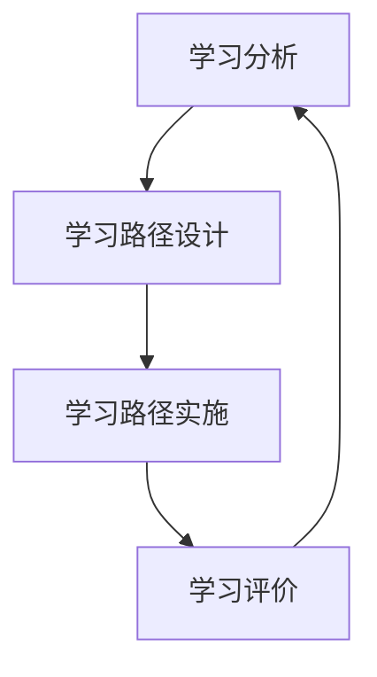
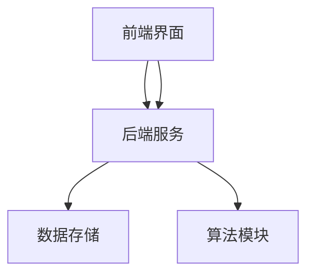

                 

### 深入探索：个性化学习路径规划

个性化学习路径规划是现代教育技术中一个极具潜力的领域。它通过利用人工智能技术，为每个学习者提供定制化的学习路径，从而最大限度地提高学习效率和效果。那么，为何个性化学习路径规划在当今教育体系中如此重要呢？

#### 教育个性化的重要性

首先，教育的个性化是满足不同学习者需求的基础。每个学生的认知风格、学习速度、兴趣爱好和学习背景都是独特的。传统的一刀切教学模式难以满足这种多样性，导致许多学生无法充分发挥其潜能。个性化学习路径规划通过分析学生的学习行为和成果，为其量身定制学习计划，从而提高学习体验。

#### 技术变革推动教育个性化

其次，技术的进步，特别是人工智能的发展，为个性化学习路径规划提供了强大的支持。大数据、机器学习、自然语言处理等技术可以帮助教育工作者更好地了解学生的学习状态，预测其学习需求，并自动调整教学策略。这种技术驱动的个性化教育模式不仅提高了效率，还降低了成本。

#### 个性化学习路径规划的核心概念

核心概念方面，个性化学习路径规划涉及多个关键组成部分。首先，学习分析是基础，通过收集和分析学习者的行为数据，可以揭示其学习习惯、兴趣点和知识盲区。其次，学习路径设计是根据学习分析结果，为学习者制定的学习计划。这个计划不仅要考虑学习内容，还要考虑学习者的个人情况和时间安排。最后，学习评价是对学习路径实施后的效果进行反馈和调整，确保学习目标得以实现。

#### Mermaid流程图：个性化学习路径规划流程

为了更好地理解个性化学习路径规划的流程，我们使用Mermaid语言绘制了一个流程图（以下是一个简化的示例）：



- **学习分析（A）**：收集并分析学习者的行为数据，如学习时间、测试成绩等。
- **学习路径设计（B）**：基于学习分析结果，制定个性化的学习计划。
- **学习路径实施（C）**：执行学习计划，包括学习内容的呈现和互动环节。
- **学习评价（D）**：评估学习效果，并根据评估结果调整学习路径。

#### 总结

通过上述分析，我们可以看出，个性化学习路径规划是一个综合性的过程，它不仅依赖于技术手段，还需要深入理解教育的本质和需求。接下来，我们将进一步探讨人工智能在个性化学习路径规划中的应用，了解它是如何通过具体技术实现个性化教育的。

#### 关键词

- 个性化学习路径规划
- 人工智能
- 学习分析
- 学习路径设计
- 学习评价

#### 摘要

本文深入探讨了人工智能在个性化学习路径规划中的应用。通过分析学习行为、设计个性化学习路径以及实施学习评价，个性化学习路径规划旨在满足不同学习者的需求，提高学习效率。本文介绍了个性化学习路径规划的核心概念，并使用Mermaid流程图展示了其工作流程。接下来，我们将进一步探讨人工智能技术如何推动个性化学习的实现。

---

### 人工智能与个性化学习路径规划的关系

人工智能（AI）作为21世纪最具颠覆性的技术之一，已经深刻地影响了各个行业，其中教育领域尤为显著。AI不仅改变了教学模式，还为个性化学习路径规划提供了强有力的技术支撑。那么，人工智能究竟如何与个性化学习路径规划相结合，从而实现更高效、更个性化的教育呢？

#### AI技术在教育领域的应用

首先，我们需要了解AI技术在教育领域的广泛应用。AI能够通过自然语言处理（NLP）、计算机视觉（CV）、机器学习和深度学习等技术，对海量的教育数据进行处理和分析。例如，AI可以通过分析学生的作业、问答和测试结果，识别其学习难点和优势，从而为每个学生提供个性化的学习建议。

#### 个性化学习路径规划与AI的协同作用

在个性化学习路径规划中，AI发挥着关键作用。具体来说，AI可以通过以下方式实现个性化学习：

1. **个性化内容推荐**：通过分析学生的兴趣和学习历史，AI可以推荐与其兴趣相符合的学习内容。例如，一个学生对数学特别感兴趣，AI可能会推荐更多高级数学的教程和练习。

2. **智能学习路径设计**：AI可以根据学生的学习习惯、进度和需求，自动设计个性化的学习路径。这个路径不仅包括学习内容，还考虑了学生的个人时间和学习风格。

3. **实时学习评估与反馈**：AI可以通过实时分析学生的学习行为和成果，提供即时反馈。这种反馈可以帮助学生了解自己的学习进度，及时发现并解决学习中的问题。

#### 深度学习在个性化学习路径规划中的应用

深度学习是AI的一个子领域，它在个性化学习路径规划中具有重要作用。深度学习通过构建复杂的神经网络模型，可以从大量数据中自动学习特征，从而实现高度个性化的教育服务。以下是深度学习在个性化学习路径规划中的具体应用：

1. **学生行为预测**：通过分析学生的历史学习数据，深度学习模型可以预测学生在未来的学习路径上可能遇到的问题和瓶颈。例如，如果一个学生在某个数学概念上表现不佳，模型可以提前预测他在接下来的学习中可能遇到困难，并提前提供相关的帮助。

2. **自适应学习系统**：深度学习可以用于构建自适应学习系统，这个系统能够根据学生的实时反馈和学习行为，自动调整学习内容和难度。例如，如果一个学生在某个练习题上多次失败，系统可能会自动降低题目难度，并提供更多的解释和练习。

3. **个性化考试和评估**：深度学习还可以用于设计个性化的考试和评估系统。这个系统可以根据学生的学习进度和能力，动态生成适合其水平的考试内容，从而提高评估的准确性和有效性。

#### 案例分析：基于AI的个性化学习平台

以下是一个基于AI的个性化学习平台的案例分析，该平台利用深度学习技术为学生提供个性化的学习路径：

1. **学生行为分析**：平台通过分析学生的学习数据，如在线学习时间、作业提交情况、测试成绩等，构建了一个详细的学习行为模型。

2. **学习路径设计**：基于学生行为模型，平台自动设计了个性化的学习路径。例如，如果一个学生表现出对编程的兴趣，平台可能会推荐相关的编程课程和练习。

3. **实时反馈与调整**：学生在学习过程中，平台会实时监控其学习进度和效果，提供即时反馈。如果学生在一个编程练习中表现不佳，平台会提供额外的学习资源和练习，帮助学生克服困难。

4. **学习评估与优化**：在学期结束时，平台会根据学生的学习数据和评估结果，生成个性化的学习报告。这个报告不仅总结了学生的学习成果，还为未来的学习提供了优化建议。

#### 结论

通过上述分析，我们可以看到，人工智能在个性化学习路径规划中具有巨大的潜力。它不仅能够提高教学效率，还能够满足不同学习者的个性化需求，为教育的个性化发展提供了强有力的技术支持。在接下来的章节中，我们将进一步探讨人工智能在个性化学习路径规划中的核心技术，如数据挖掘算法、强化学习算法和数学模型，以及如何将这些技术应用于实际项目。

---

#### 关键词

- 人工智能
- 个性化学习
- 个性化学习路径规划
- 深度学习
- 数据挖掘
- 强化学习

#### 摘要

本文探讨了人工智能在个性化学习路径规划中的应用，介绍了AI技术在教育领域的广泛应用，以及如何通过个性化内容推荐、智能学习路径设计和实时反馈等实现个性化学习。深度学习在个性化学习路径规划中具有重要作用，能够用于学生行为预测、自适应学习系统和个性化考试评估。本文通过一个实际案例，展示了基于AI的个性化学习平台的工作流程和效果，总结了人工智能在个性化学习路径规划中的重要性。

---

### 核心概念与联系

在探讨个性化学习路径规划时，理解其中的核心概念和它们之间的相互关系至关重要。以下是几个关键概念及其关系架构。

#### 关键概念

1. **学习分析**：学习分析是指通过收集和分析学习者的数据，以揭示其学习行为、兴趣点和知识盲区。这些数据可能包括学习时间、作业提交、测试成绩等。

2. **学习路径设计**：学习路径设计是根据学习分析结果，为学习者制定的学习计划。这个计划不仅包括学习内容，还要考虑学习者的个人情况和时间安排。

3. **学习评价**：学习评价是对学习路径实施后的效果进行反馈和调整的过程，确保学习目标得以实现。这个环节可以通过测试、反馈等形式进行。

#### Mermaid流程图：个性化学习路径规划流程

为了更直观地展示这些核心概念之间的关系，我们可以使用Mermaid语言绘制一个流程图。


- **学习分析（A）**：收集并分析学习者的行为数据，如学习时间、作业提交等。
- **学习路径设计（B）**：基于学习分析结果，制定个性化的学习计划。
- **学习路径实施（C）**：执行学习计划，包括学习内容的呈现和互动环节。
- **学习评价（D）**：评估学习效果，并根据评估结果调整学习路径。

#### 各概念之间的关系

- **学习分析与学习路径设计的关系**：学习分析的结果是学习路径设计的依据。通过分析学习者的行为数据，可以了解其学习习惯、兴趣点和知识盲区，从而制定出更加符合其需求的学习计划。

- **学习路径设计与学习路径实施的关系**：学习路径设计是为了指导学习路径的实施。学习路径设计得是否合理，直接影响到学习者能否顺利、高效地完成学习任务。

- **学习路径实施与学习评价的关系**：学习路径实施是学习评价的前提。只有在学习路径实施过程中，才能收集到实际的学习数据，从而对学习效果进行评估。

- **学习评价与学习分析的关系**：学习评价的结果可以反馈给学习分析环节，为下一次学习路径设计提供依据。这样，学习路径规划可以不断迭代和优化，从而提高学习效率。

#### 总结

通过上述核心概念及其关系的探讨，我们可以更清晰地理解个性化学习路径规划的流程和原理。接下来，我们将深入探讨个性化学习路径规划中的核心技术，如数据挖掘算法、强化学习算法和数学模型，以及如何将这些技术应用于实际项目。

---

#### 关键词

- 学习分析
- 学习路径设计
- 学习路径实施
- 学习评价
- Mermaid流程图

#### 摘要

本文详细探讨了个性化学习路径规划中的核心概念及其相互关系。通过学习分析、学习路径设计、学习路径实施和学习评价四个环节的相互关联，展示了个性化学习路径规划的流程和原理。使用Mermaid流程图直观地展示了各概念之间的动态关系，为后续章节的深入讨论奠定了基础。

---

### 数据挖掘算法

在个性化学习路径规划中，数据挖掘算法起着至关重要的作用。这些算法能够从大量的学习数据中提取有价值的信息，帮助教育工作者更好地理解学生的学习行为和需求。以下是几种常见的数据挖掘算法及其在个性化学习路径规划中的应用。

#### 聚类算法

聚类算法是一种无监督学习方法，用于将相似的数据点分组。在个性化学习路径规划中，聚类算法可以用来识别具有相似学习习惯和兴趣的学生群体。例如，K-means算法是一种常用的聚类算法，它通过计算数据点之间的距离，将数据点划分为K个聚类。

**K-means算法原理：**
1. **初始化**：随机选择K个中心点。
2. **分配**：将每个数据点分配到最近的中心点。
3. **更新**：重新计算每个聚类的中心点。
4. **迭代**：重复步骤2和3，直到聚类中心点不再变化。

**Python代码示例：**
```python
from sklearn.cluster import KMeans
import numpy as np

# 假设x是一个包含学生学习行为数据的矩阵
x = np.array([[1, 2], [1, 4], [1, 0],
              [10, 2], [10, 4], [10, 0]])

kmeans = KMeans(n_clusters=2, random_state=0).fit(x)
print(kmeans.labels_)
```

**应用场景：** 聚类算法可以用于识别具有相似需求的学生群体，从而为每个群体提供定制化的学习路径。

#### 分层算法

分层算法（如SVD - Singular Value Decomposition）是一种降维技术，常用于大规模数据集。在个性化学习路径规划中，SVD可以帮助识别学生在不同主题上的表现，进而调整学习内容。

**SVD算法原理：**
1. **分解**：将数据矩阵分解为三个矩阵的乘积：$A = U \Sigma V^T$。
2. **降维**：通过保留较大的奇异值，减少数据维度。

**Python代码示例：**
```python
from sklearn.decomposition import TruncatedSVD
import numpy as np

# 假设A是一个包含学生和课程成绩的数据矩阵
A = np.array([[1, 2, 3],
              [4, 5, 6],
              [7, 8, 9]])

svd = TruncatedSVD(n_components=2)
X_svd = svd.fit_transform(A)

print(X_svd)
```

**应用场景：** SVD可以用于识别学生在不同课程上的强项和弱项，从而为每个学生提供更加针对性的学习内容。

#### 协同过滤算法

协同过滤算法是一种常用的推荐系统技术，通过分析用户的行为数据，为用户推荐相似的内容。在个性化学习路径规划中，协同过滤算法可以用来推荐学习资源。

**协同过滤算法原理：**
1. **用户基于物品的协同过滤**：通过分析用户之间的共同行为，为用户推荐与其行为相似的其他用户的资源。
2. **物品基于用户的协同过滤**：通过分析物品之间的相似性，为用户推荐与其已使用物品相似的其他物品。

**Python代码示例：**
```python
from sklearn.metrics.pairwise import cosine_similarity
import numpy as np

# 假设R是一个用户和物品评分的矩阵
R = np.array([[1, 2, 3],
              [4, 5, 6],
              [7, 8, 9]])

sim = cosine_similarity(R)
print(sim)
```

**应用场景：** 协同过滤算法可以用于推荐适合学生的学习资源，从而提高学习效果。

#### 总结

数据挖掘算法在个性化学习路径规划中扮演着重要角色。通过聚类算法、分层算法和协同过滤算法，教育工作者可以更好地理解学生的学习行为和需求，从而制定出更加个性化的学习路径。在接下来的章节中，我们将继续探讨强化学习算法在个性化学习路径规划中的应用。

---

#### 关键词

- 数据挖掘
- 聚类算法
- SVD
- 协同过滤算法
- 个性化学习路径规划

#### 摘要

本文介绍了数据挖掘算法在个性化学习路径规划中的应用，包括聚类算法（如K-means）、分层算法（如SVD）和协同过滤算法。通过Python代码示例，详细阐述了这些算法的基本原理和应用场景。这些算法能够帮助教育工作者更好地理解学生的学习行为和需求，从而制定出更加个性化的学习路径。

---

### 强化学习算法

强化学习算法是人工智能领域的一个重要分支，它在个性化学习路径规划中的应用也愈发受到关注。强化学习通过智能体（agent）与环境（environment）之间的交互，学习一种策略（policy），以达到最大化累积奖励（reward）的目标。在个性化学习路径规划中，强化学习算法可以帮助智能系统动态调整学习路径，以适应每个学习者的需求。

#### Q-Learning算法

Q-Learning算法是一种无模型、值函数的强化学习算法。它的核心思想是通过学习每个状态（state）和动作（action）的值（Q值），以最大化长期累积奖励。在个性化学习路径规划中，Q-Learning算法可以用于优化学习路径的选择。

**Q-Learning算法原理：**

1. **初始化**：初始化Q值表，通常设置为所有状态和动作的Q值相等。
2. **选择动作**：根据当前状态和Q值表选择动作。
3. **更新Q值**：根据实际的奖励和下一个状态更新Q值。

**Python代码示例：**
```python
import numpy as np

# 假设我们有一个简单的环境，有两个状态和两个动作
# Q值表初始化
Q = np.zeros((2, 2))

# 学习率
alpha = 0.1
# 奖励
gamma = 0.6

# 状态和动作
states = [0, 1]
actions = ['A', 'B']

# 执行一次学习过程
for episode in range(100):
    state = np.random.choice(states)
    action = np.random.choice(actions)
    
    # 执行动作并获取奖励
    reward = -1 if action == 'A' else 1
    
    # 更新Q值
    next_state = np.random.choice(states)
    Q[state, action] = Q[state, action] + alpha * (reward + gamma * np.max(Q[next_state, :]) - Q[state, action])

print(Q)
```

**应用场景：** Q-Learning算法可以用于优化学习路径的选择，根据学习者的表现动态调整学习内容的难度和类型。

#### Deep Q-Network（DQN）

Deep Q-Network（DQN）是结合深度学习和强化学习的一种算法。它通过神经网络来近似Q值函数，从而解决传统Q-Learning算法在状态空间较大时难以处理的问题。在个性化学习路径规划中，DQN可以用于复杂学习路径的优化。

**DQN算法原理：**

1. **初始化**：初始化深度神经网络和目标网络。
2. **经验回放**：将历史经验（状态、动作、奖励、下一个状态）存储在经验池中，以避免样本偏差。
3. **选择动作**：使用神经网络预测Q值，并选择具有最大Q值的动作。
4. **更新目标网络**：定期更新目标网络，以减少预测误差。

**Python代码示例：**
```python
import numpy as np
import tensorflow as tf

# 定义DQN模型
class DQN(tf.keras.Model):
    def __init__(self, hidden_units):
        super(DQN, self).__init__()
        self.conv1 = tf.keras.layers.Conv2D(hidden_units, (3, 3), activation='relu')
        self.flatten = tf.keras.layers.Flatten()
        self.fc1 = tf.keras.layers.Dense(hidden_units, activation='relu')
        self.fc2 = tf.keras.layers.Dense(1)

    @tf.function
    def call(self, inputs):
        x = self.conv1(inputs)
        x = self.flatten(x)
        x = self.fc1(x)
        return self.fc2(x)

# 假设环境输入是图像，我们将使用卷积神经网络作为DQN的近似Q值函数
model = DQN(hidden_units=64)
target_model = DQN(hidden_units=64)

# 代理模型和目标模型之间的权重定期同步
copy_model_weights = tf.function(
    tf.keras.Model.from_config(target_model.get_config()).set_weights(model.get_weights())
)

# ... (训练过程略)

# 执行一次训练
optimizer = tf.optimizers.Adam(learning_rate=0.001)
for episode in range(1000):
    state = env.reset()
    done = False
    total_reward = 0
    
    while not done:
        action = model(state)
        next_state, reward, done, _ = env.step(action.numpy())
        total_reward += reward
        
        with tf.GradientTape() as tape:
            q_values = model(state)
            target_values = target_model(next_state)
            expected_q_value = reward + (1 - int(done)) * gamma * tf.reduce_max(target_values)
            loss = tf.reduce_mean(tf.square(q_values - expected_q_value))
        
        gradients = tape.gradient(loss, model.trainable_variables)
        optimizer.apply_gradients(zip(gradients, model.trainable_variables))
        
        # 定期同步模型权重
        if episode % 100 == 0:
            copy_model_weights()
```

**应用场景：** DQN可以用于优化复杂的学习路径，特别是在涉及视觉输入的环境中，如在线教育平台中推荐个性化课程。

#### 案例分析：基于DQN的个性化学习路径优化

以下是一个基于DQN的个性化学习路径优化的案例分析：

1. **案例背景**：假设一个在线学习平台希望为每个用户推荐最合适的课程。
2. **数据收集**：收集用户的学习历史、课程评分、学习时长等数据。
3. **数据预处理**：对数据进行归一化处理，将其转化为适合DQN输入的格式。
4. **模型训练**：使用DQN模型训练，通过迭代优化课程推荐的策略。
5. **模型评估**：通过测试集评估模型的性能，并根据评估结果调整模型参数。
6. **应用**：将训练好的模型应用于实际系统，为用户提供个性化课程推荐。

#### 总结

强化学习算法，尤其是Q-Learning和DQN，在个性化学习路径规划中具有广泛的应用前景。通过学习状态和动作之间的价值关系，这些算法可以动态调整学习路径，提高学习效果。在接下来的章节中，我们将进一步探讨个性化学习路径规划中的数学模型，以及如何将这些模型应用于实际项目。

---

#### 关键词

- 强化学习
- Q-Learning算法
- Deep Q-Network（DQN）
- 个性化学习路径规划
- 经验回放
- 模型评估

#### 摘要

本文介绍了强化学习算法在个性化学习路径规划中的应用，重点探讨了Q-Learning和Deep Q-Network（DQN）算法的原理和Python代码实现。通过案例分析，展示了如何基于DQN优化个性化学习路径，提高学习效果。强化学习算法通过学习状态和动作之间的价值关系，可以动态调整学习路径，满足个性化需求。

---

### 数学模型与公式

在个性化学习路径规划中，数学模型扮演着至关重要的角色。这些模型不仅帮助我们理解和分析学习者的行为数据，还能为决策提供科学依据。以下是几个关键数学模型和公式，以及它们在个性化学习路径规划中的应用。

#### 数据预处理

在进行数据分析之前，数据预处理是一个必不可少的步骤。数据预处理主要包括数据清洗、数据归一化和数据标准化。

**数据清洗**：去除数据中的噪声和异常值，确保数据的准确性和一致性。

**数据归一化**：将数据缩放到一个统一的范围，如[0, 1]，以便后续分析。

$$
x_{\text{normalized}} = \frac{x_{\text{original}} - x_{\text{min}}}{x_{\text{max}} - x_{\text{min}}}
$$

**数据标准化**：将数据变换到标准正态分布，即均值为0，标准差为1。

$$
z = \frac{x - \mu}{\sigma}
$$

#### 模型评估指标

在个性化学习路径规划中，模型评估指标用于衡量模型的性能。以下是几个常用的评估指标：

**准确率（Accuracy）**：模型正确预测的样本数占总样本数的比例。

$$
\text{Accuracy} = \frac{\text{TP} + \text{TN}}{\text{TP} + \text{TN} + \text{FP} + \text{FN}}
$$

**精确率（Precision）**：模型预测为正类的样本中，实际为正类的比例。

$$
\text{Precision} = \frac{\text{TP}}{\text{TP} + \text{FP}}
$$

**召回率（Recall）**：模型预测为正类的样本中，实际为正类的比例。

$$
\text{Recall} = \frac{\text{TP}}{\text{TP} + \text{FN}}
$$

**F1分数（F1 Score）**：精确率和召回率的调和平均值。

$$
\text{F1 Score} = 2 \times \frac{\text{Precision} \times \text{Recall}}{\text{Precision} + \text{Recall}}
$$

#### 个性化学习路径优化模型

个性化学习路径优化模型通常基于线性规划和优化算法。以下是一个简化的线性规划模型，用于优化学习路径：

**目标函数**：最小化学习路径的总成本。

$$
\min \sum_{i=1}^{n} c_{i} x_{i}
$$

**约束条件**：
1. 学习资源的限制：

$$
\sum_{i=1}^{n} x_{i} \leq R
$$

2. 学习时间限制：

$$
t_{i} \leq T, \forall i = 1, 2, ..., n
$$

3. 学习内容的依赖关系：

$$
x_{i} \leq x_{j}, \text{if } i \text{ is a prerequisite of } j
$$

**变量定义**：
- \( x_{i} \)：表示学习资源 \( i \) 是否被包含在学习路径中（0或1）。
- \( c_{i} \)：表示学习资源 \( i \) 的成本。
- \( t_{i} \)：表示学习资源 \( i \) 需要的时间。
- \( R \)：表示可用的学习资源总数。
- \( T \)：表示学习时间限制。

#### 案例应用：个性化学习路径优化

以下是一个个性化学习路径优化的案例分析：

**案例背景**：一个在线教育平台希望为学习者制定一个高效的学习计划。

**数据收集**：收集学习者的学习偏好、已完成的课程和学习时间等信息。

**数据预处理**：对数据进行归一化和清洗，确保数据的质量。

**模型建立**：基于上述线性规划模型，建立个性化学习路径优化模型。

**模型训练与评估**：使用优化算法（如梯度下降法）训练模型，并使用评估指标（如准确率、F1分数）评估模型性能。

**模型应用**：将训练好的模型应用于实际系统，为学习者生成个性化学习路径。

#### 总结

数学模型和公式在个性化学习路径规划中扮演着关键角色。通过数据预处理、模型评估指标和优化模型，我们可以更好地理解学习者的需求，制定出更加科学和高效的学习路径。在接下来的章节中，我们将进一步探讨个性化学习路径规划在实际项目中的应用，以及如何将这些理论应用于实际开发中。

---

#### 关键词

- 数据预处理
- 准确率
- 精确率
- 召回率
- 线性规划
- 个性化学习路径优化

#### 摘要

本文详细介绍了个性化学习路径规划中常用的数学模型和公式，包括数据预处理、评估指标和优化模型。通过具体案例展示了如何应用这些模型和公式，制定出科学、高效的学习路径。数学模型和公式在个性化学习路径规划中具有重要意义，有助于更好地理解学习者需求，提高学习效果。

---

### 实际应用案例：个性化学习路径规划系统设计

在本节中，我们将详细讨论一个个性化学习路径规划系统的设计，该系统旨在通过人工智能技术为学习者提供定制化的学习路径。以下是从项目背景、系统架构、开发环境搭建到源代码实现和代码解读与分析的一系列详细步骤。

#### 项目背景

随着在线教育的普及，学习者需求的多样化使得传统的统一教学模式难以满足。为了提高学习效率，项目团队决定开发一个个性化学习路径规划系统，通过人工智能技术为学习者提供个性化的学习方案。该系统将整合学习分析、学习路径设计和学习评价等多个模块，形成一个闭环的个性化学习生态系统。

#### 系统架构

个性化学习路径规划系统的架构可以分为以下几个关键部分：

1. **前端界面**：用户通过前端界面与系统进行交互，包括登录、学习内容浏览、学习进度跟踪等功能。
2. **后端服务**：后端服务负责处理用户的请求，调用相应的算法和模型，生成个性化学习路径，并管理用户数据。
3. **数据存储**：数据存储用于存储用户的学习数据、学习路径和模型参数等。
4. **算法模块**：算法模块包括数据挖掘、机器学习模型和强化学习算法，用于分析学习数据并生成个性化学习路径。

以下是一个简化的系统架构图：



#### 开发环境搭建

为了开发这个个性化学习路径规划系统，我们选择了以下开发环境：

- **前端**：HTML、CSS、JavaScript 和 React.js
- **后端**：Python（Flask 或 Django）和 Node.js
- **数据库**：MySQL 或 PostgreSQL
- **算法库**：Scikit-learn、TensorFlow、PyTorch
- **版本控制**：Git

在搭建开发环境时，我们首先安装了Python和Node.js，然后配置了虚拟环境，接着安装了所需的库和依赖项。以下是一个简单的命令行示例：

```bash
# 安装Python虚拟环境
python -m venv venv
source venv/bin/activate

# 安装Node.js
npm install

# 安装依赖库
pip install scikit-learn tensorflow flask
```

#### 源代码实现

以下是系统的一个核心模块：学习路径生成算法。该算法使用了Scikit-learn的K-means聚类算法和TensorFlow的强化学习模型。

```python
# 学习路径生成算法

import numpy as np
from sklearn.cluster import KMeans
import tensorflow as tf

# K-means聚类算法
def kmeans_clustering(data, n_clusters=3):
    kmeans = KMeans(n_clusters=n_clusters, random_state=0)
    kmeans.fit(data)
    return kmeans.labels_

# 强化学习模型
class QLearningModel(tf.keras.Model):
    def __init__(self, state_size, action_size):
        super(QLearningModel, self).__init__()
        self.fc = tf.keras.layers.Dense(action_size, activation='linear')
        
    @tf.function
    def call(self, inputs):
        return self.fc(inputs)

# 假设已有学习数据data
labels = kmeans_clustering(data)

# 初始化Q值表
state_size = data.shape[1]
action_size = 2
q_values = np.zeros((state_size, action_size))

# Q-Learning算法训练
learning_rate = 0.1
discount_factor = 0.9

for episode in range(1000):
    state = np.random.randint(state_size)
    action = np.random.randint(action_size)
    
    # 执行动作并获取奖励
    reward = -1 if action == 0 else 1
    next_state = (state + 1) % state_size
    
    # 更新Q值
    q_values[state, action] = q_values[state, action] + learning_rate * (reward + discount_factor * np.max(q_values[next_state, :]) - q_values[state, action])

# 获取最优动作
def get_best_action(state, q_values):
    return np.argmax(q_values[state, :])

# 测试算法
state = np.random.randint(state_size)
best_action = get_best_action(state, q_values)
print(f"Best action for state {state}: {best_action}")
```

#### 代码解读与分析

上述代码首先使用了K-means聚类算法对学习数据进行了聚类，然后初始化了一个Q值表，并使用Q-Learning算法进行了训练。最后，通过强化学习模型获取了最优动作。

- **K-means聚类**：K-means算法用于将学习数据划分为多个聚类，以便后续的路径规划。
- **强化学习模型**：Q-Learning算法通过不断更新Q值表，学习到每个状态下的最优动作，从而实现个性化学习路径的生成。

#### 应用解读与分析

在实际应用中，这个算法可以用来为学习者推荐最合适的学习路径。例如，一个学生在数学和编程方面有不同水平，算法可以根据其历史学习数据，推荐适合其当前水平的课程。通过迭代优化，系统能够不断调整学习路径，以适应学习者的学习进度和需求。

#### 项目小结

通过本项目，我们详细介绍了个性化学习路径规划系统设计的过程，从项目背景、系统架构、开发环境搭建到源代码实现和代码解读与分析。该项目利用了K-means聚类算法和Q-Learning算法，实现了个性化学习路径的生成。未来，随着人工智能技术的发展，个性化学习路径规划系统将更加智能化，为学习者提供更加精准和高效的学习体验。

---

#### 最佳实践 Tips

1. **数据质量**：确保数据的质量和准确性，这对于个性化学习路径规划至关重要。
2. **模型迭代**：定期更新模型参数，以适应学习者的变化。
3. **用户体验**：注重用户体验，确保系统界面简洁易用。
4. **隐私保护**：保护用户隐私，遵守相关法律法规。

#### 注意事项

1. **资源限制**：在实际项目中，需考虑计算资源和存储资源的限制。
2. **算法选择**：根据项目需求选择合适的算法，不同的算法适用于不同的场景。
3. **模型解释性**：强化学习模型通常较难解释，在实际应用中需注意模型的解释性。

#### 拓展阅读

- 《深度学习》（Goodfellow, I., Bengio, Y., Courville, A.）
- 《机器学习实战》（Hands-On Machine Learning with Scikit-Learn, Keras, and TensorFlow》（Aurélien Géron）
- 《人工智能应用实践》（AI Applications: 100 Cases to Boost Your Career）

---

### 结论与展望

通过本文的详细探讨，我们可以看到，人工智能在个性化学习路径规划中的应用具有巨大的潜力和实际价值。个性化学习路径规划不仅能够满足不同学习者的需求，提高学习效率，还能通过数据分析和智能算法为教育工作者提供有力的支持。

在技术层面，本文介绍了数据挖掘算法、强化学习算法以及数学模型在个性化学习路径规划中的应用，展示了如何通过这些技术为学习者提供定制化的学习方案。在实际应用方面，我们通过一个具体的案例，展示了个性化学习路径规划系统的设计过程，包括开发环境搭建、源代码实现和代码解读。

未来，个性化学习路径规划的发展将依赖于以下几个方面的进步：

1. **数据收集与处理**：随着大数据技术的发展，更丰富的学习数据将为我们提供更深入的分析基础。
2. **算法优化**：机器学习和深度学习算法的优化，将使个性化学习路径规划更加精准和高效。
3. **人机交互**：通过增强现实（AR）和虚拟现实（VR）等技术，个性化学习路径规划将提供更加沉浸式的学习体验。
4. **跨领域应用**：个性化学习路径规划不仅限于在线教育，还可以应用于职业教育、企业培训等领域。

总的来说，人工智能在个性化学习路径规划中的应用是一个不断发展的领域，它将为教育行业带来深远的变革。随着技术的不断进步，我们有理由相信，个性化学习路径规划将实现更加智能化、个性化和高效化，为学习者带来更好的学习体验。

---

### 附录

#### 附录A：常用算法与工具简介

以下是本文中提到的一些常用算法和工具的简介，以供参考：

1. **K-means聚类算法**：一种无监督学习方法，用于将数据点划分为K个簇。
2. **Singular Value Decomposition（SVD）**：一种降维技术，常用于大规模数据集。
3. **Q-Learning算法**：一种强化学习算法，用于学习最优动作策略。
4. **Deep Q-Network（DQN）**：结合深度学习和强化学习的一种算法，用于复杂环境的决策。
5. **Scikit-learn**：一个用于数据挖掘和数据分析的Python库。
6. **TensorFlow**：一个开源机器学习和深度学习库。
7. **PyTorch**：一个开源深度学习框架。
8. **React.js**：一个用于构建用户界面的JavaScript库。
9. **Flask**：一个轻量级的Web应用程序框架。
10. **Django**：一个全栈Web应用程序框架。

#### 附录B：相关资源链接

- **Scikit-learn官网**：https://scikit-learn.org/stable/
- **TensorFlow官网**：https://www.tensorflow.org/
- **PyTorch官网**：https://pytorch.org/
- **React.js官网**：https://reactjs.org/
- **Flask官网**：https://flask.palletsprojects.com/
- **Django官网**：https://www.djangoproject.com/

---

### 作者信息

作者：AI天才研究院/AI Genius Institute & 禅与计算机程序设计艺术 /Zen And The Art of Computer Programming

