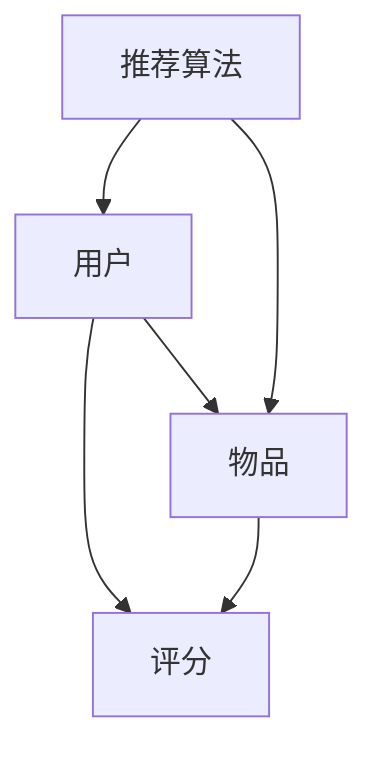
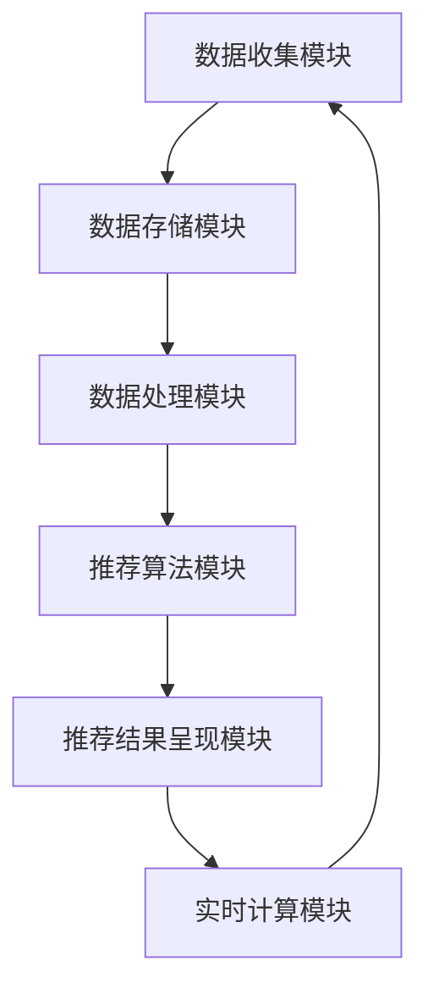
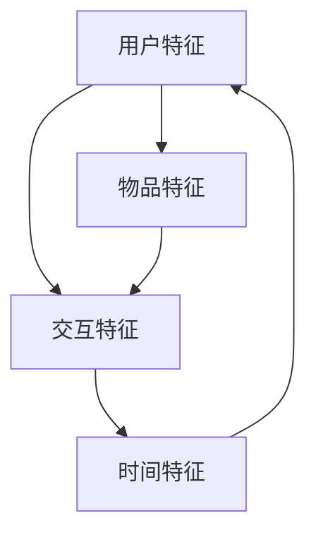

                 

### 个性化推荐概述

个性化推荐作为人工智能领域的一个重要分支，已经成为现代互联网产品中不可或缺的组成部分。它的核心目标是通过分析用户的行为数据和偏好，为用户推荐他们可能感兴趣的内容或产品，从而提升用户的满意度和参与度。个性化推荐的应用场景广泛，包括但不限于电子商务、社交媒体、音乐和视频流媒体、新闻阅读和内容分发等。

#### **1.1 个性化推荐的定义**

个性化推荐系统是指基于用户的历史行为和偏好，利用数据挖掘和机器学习技术，从大量信息中自动发现用户的兴趣模式，并基于这些模式为用户提供个性化的信息推荐。其定义可以分解为以下几点：

1. **用户行为数据**：这是构建个性化推荐系统的基础，包括用户的浏览记录、购买历史、点击行为、评价和反馈等。
2. **偏好分析**：通过分析用户的行为数据，挖掘用户的兴趣点和偏好，为推荐提供依据。
3. **自动发现**：系统自动从大量数据中提取用户的兴趣模式，无需人工干预。
4. **个性化信息推荐**：根据用户的兴趣模式，为用户推荐个性化的信息或产品。

#### **1.2 个性化推荐的应用场景**

个性化推荐的应用场景多种多样，以下是一些典型的例子：

1. **电子商务**：电商平台通过个性化推荐系统，为用户推荐可能感兴趣的商品，从而提高转化率和销售额。
2. **社交媒体**：社交媒体平台通过个性化推荐，为用户推送感兴趣的内容，增加用户粘性。
3. **音乐和视频流媒体**：音乐和视频平台通过个性化推荐，为用户推荐喜欢的音乐和视频，提升用户体验。
4. **新闻阅读**：新闻平台通过个性化推荐，为用户推送感兴趣的新闻，增加用户的阅读时长和粘性。
5. **内容分发**：内容分发平台通过个性化推荐，为用户提供个性化的内容，提升用户满意度。

#### **1.3 个性化推荐的发展历程**

个性化推荐系统的发展经历了几个阶段：

1. **基于规则的推荐系统**：早期的个性化推荐系统主要基于规则和逻辑推理，如基于内容的推荐和协同过滤。
2. **基于模型的推荐系统**：随着机器学习和数据挖掘技术的发展，基于模型的推荐系统逐渐取代了基于规则的系统，如矩阵分解、深度学习等。
3. **多模态推荐系统**：随着人工智能技术的进步，个性化推荐系统开始融合多种数据源，如文本、图像、音频等，实现更精准的推荐。
4. **实时推荐系统**：现代个性化推荐系统越来越注重实时性，通过实时分析用户行为，为用户提供即时的个性化推荐。

### **核心概念与联系**

在个性化推荐系统中，核心概念包括用户、物品、评分和推荐算法等。以下是这些概念实体之间的关系架构 Mermaid 流程图：



- **用户**：个性化推荐系统的核心，系统的所有行为和推荐都围绕用户展开。
- **物品**：用户感兴趣的内容或产品，如书籍、音乐、视频等。
- **评分**：用户对物品的评价，可以是明确定量评分（如1到5星的评分），也可以是隐式反馈（如点击、浏览、购买等行为）。
- **推荐算法**：用于从大量物品中为用户推荐感兴趣的内容，算法的选择和性能直接影响到推荐系统的效果。

通过上述流程图，我们可以清晰地看到个性化推荐系统中各个实体之间的关系，以及推荐算法在整个系统中的作用和位置。

在接下来的章节中，我们将深入探讨用户行为分析与数据挖掘、推荐算法原理与分类，以及个性化推荐系统设计与实现等核心内容。

## **用户行为分析与数据挖掘**

在个性化推荐系统中，用户行为数据是构建推荐模型的基础。这些数据来源广泛，包括用户的浏览记录、购买历史、点击行为、评价和反馈等。如何有效地收集、处理和分析这些数据，是构建高效推荐系统的重要环节。

### **2.1 用户行为数据的收集与处理**

**收集数据**

用户行为数据的收集是构建个性化推荐系统的第一步。以下是一些常见的数据收集方式：

1. **日志文件**：通过服务器日志记录用户的访问行为，包括浏览页面、点击链接、搜索关键词等。
2. **API调用**：通过应用程序编程接口（API）收集用户与应用程序的交互数据，如点击事件、搜索请求等。
3. **传感器数据**：利用传感器设备收集用户的位置信息、设备使用情况等数据。

**处理数据**

收集到的用户行为数据通常是杂乱无章的，需要进行预处理，以便后续分析和建模。以下是一些数据处理步骤：

1. **清洗数据**：删除重复、错误和不完整的数据，确保数据质量。
2. **转换数据**：将不同格式的数据统一转换成标准格式，如将日志文件转换成CSV文件。
3. **特征提取**：从原始数据中提取出有意义的特征，如用户年龄、地理位置、购买时间等。

### **2.2 数据挖掘技术及应用**

数据挖掘是分析大量用户行为数据，提取有价值信息和知识的过程。以下是一些常见的数据挖掘技术：

1. **关联规则挖掘**：通过发现数据之间的关联关系，识别用户的兴趣点。例如，在电商平台上，如果用户经常购买商品A和商品B，那么可以推测用户可能对这两种商品感兴趣。
   
2. **聚类分析**：将用户或物品划分为不同的群体，识别用户或物品的相似性。例如，通过聚类分析，可以将用户划分为不同的兴趣群体，从而为每个群体提供个性化的推荐。

3. **分类与回归分析**：使用分类算法（如决策树、随机森林）和回归算法（如线性回归、逻辑回归）预测用户对物品的评分或行为。

4. **协同过滤**：通过分析用户对物品的评分，预测用户未评分的物品。协同过滤分为基于用户的协同过滤和基于物品的协同过滤两种类型。

### **2.3 用户行为模式识别**

用户行为模式识别是挖掘用户行为数据中的规律和趋势，为推荐系统提供依据的过程。以下是一些用户行为模式：

1. **时间模式**：用户在特定时间段的活跃程度，如工作日和周末的用户行为差异。
2. **序列模式**：用户连续行为的顺序，如用户在购买某一商品后，可能还会购买哪些商品。
3. **交互模式**：用户与其他用户或物品的交互情况，如用户之间的推荐关系、用户对特定类型物品的偏好等。

通过用户行为模式识别，推荐系统可以更好地理解用户需求，为用户提供个性化的推荐。

### **案例解析：用户行为数据挖掘在电商平台的运用**

以某电商平台为例，假设用户A的历史行为数据包括浏览商品、购买记录、评价等。以下是如何运用数据挖掘技术分析这些数据的步骤：

1. **数据收集**：通过服务器日志收集用户A的浏览记录、购买历史和评价信息。
2. **数据处理**：清洗和转换数据，提取出用户A的兴趣标签，如“时尚”、“数码”等。
3. **关联规则挖掘**：使用Apriori算法挖掘用户A购买商品之间的关联关系，如购买A商品后，通常会购买B商品。
4. **聚类分析**：将用户A与其他用户进行聚类，识别出用户A所属的兴趣群体。
5. **协同过滤**：基于用户A的历史评分数据，使用基于用户的协同过滤算法预测用户A对未评分商品的评分。
6. **用户行为模式识别**：分析用户A的行为数据，识别出用户A在特定时间段的购买偏好，以及用户A的购买序列模式。

通过上述分析，电商平台可以为用户A推荐相关的商品，提高用户的购物体验和满意度。

在下一章节中，我们将探讨推荐算法原理与分类，深入理解不同的推荐算法及其适用场景。

## **推荐算法原理与分类**

个性化推荐系统的核心在于推荐算法的选择和优化。推荐算法通过分析用户的历史行为数据，预测用户对未知物品的偏好，从而为用户提供个性化的推荐。根据算法的工作原理和数据来源，推荐算法可以分为协同过滤算法、基于内容的推荐算法和混合推荐算法等。

### **3.1 协同过滤算法**

协同过滤算法（Collaborative Filtering）是推荐系统中最常用的算法之一，其核心思想是通过分析用户之间的相似性来预测用户对物品的评分或行为。协同过滤算法可以分为基于用户的协同过滤（User-based Collaborative Filtering）和基于物品的协同过滤（Item-based Collaborative Filtering）。

**基于用户的协同过滤**

基于用户的协同过滤算法通过计算用户之间的相似性，找到与目标用户相似的其他用户，并推荐这些相似用户喜欢的物品。具体步骤如下：

1. **计算用户相似性**：使用用户之间的评分矩阵，计算用户之间的相似度。常用的相似度度量方法包括余弦相似度、皮尔逊相关系数等。

2. **找到相似用户**：根据相似度度量，找到与目标用户最相似的一组用户。

3. **推荐物品**：为用户推荐相似用户喜欢的物品，通常采用加权平均的方法，将相似用户的评分加权求和，得到目标用户对物品的预测评分。

**基于物品的协同过滤**

基于物品的协同过滤算法通过计算物品之间的相似性，找到与目标物品相似的物品，并推荐这些相似物品。具体步骤如下：

1. **计算物品相似性**：使用物品之间的评分矩阵，计算物品之间的相似度。常用的相似度度量方法包括余弦相似度、Jaccard相似度等。

2. **找到相似物品**：根据相似度度量，找到与目标物品最相似的一组物品。

3. **推荐用户**：为用户推荐相似物品，通常采用加权平均的方法，将相似物品的评分加权求和，得到目标用户对物品的预测评分。

**协同过滤算法的优缺点**

- **优点**：协同过滤算法简单高效，适用于大数据环境，能够处理大量用户和物品。
- **缺点**：协同过滤算法存在冷启动问题（即对新用户和新物品无法提供有效的推荐）和稀疏数据问题（即用户和物品之间的评分矩阵非常稀疏）。

### **3.2 基于内容的推荐算法**

基于内容的推荐算法（Content-based Recommender Systems）是基于用户对物品的兴趣内容进行推荐。该算法通过分析用户的历史行为和偏好，提取出用户感兴趣的内容特征，然后根据这些特征为用户推荐相似内容的物品。具体步骤如下：

1. **特征提取**：从用户的历史行为和偏好中提取出感兴趣的内容特征。例如，从用户浏览的商品中提取出商品标签、分类、关键词等。

2. **计算相似度**：计算目标物品与用户兴趣特征的相似度。常用的相似度度量方法包括余弦相似度、欧氏距离等。

3. **推荐物品**：为用户推荐与用户兴趣特征相似的物品。

**基于内容的推荐算法的优缺点**

- **优点**：基于内容的推荐算法能够处理新用户和新物品，不需要大量历史数据，且推荐结果更加个性化。
- **缺点**：基于内容的推荐算法依赖于特征提取的质量，如果特征提取不准确，可能导致推荐结果不准确。

### **3.3 混合推荐算法**

混合推荐算法（Hybrid Recommender Systems）结合了协同过滤和基于内容的推荐算法的优点，通过将两种算法相结合，提高推荐系统的性能和效果。混合推荐算法可以分为基于模型的混合推荐算法和基于规则的混合推荐算法。

**基于模型的混合推荐算法**

基于模型的混合推荐算法通过构建一个统一的预测模型，将协同过滤和基于内容的推荐算法融合在一起。常见的模型包括矩阵分解（Matrix Factorization）、深度学习等。

1. **矩阵分解**：通过矩阵分解模型，将用户和物品的评分矩阵分解为两个低秩矩阵，从而提取出用户和物品的特征。

2. **融合预测**：将协同过滤和基于内容的特征进行融合，通过一个统一的预测模型预测用户对物品的评分。

**基于规则的混合推荐算法**

基于规则的混合推荐算法通过定义一系列规则，将协同过滤和基于内容的推荐结果进行融合。

1. **规则定义**：定义一系列基于用户行为和物品特征的规则，如用户浏览了A商品，则可能对B商品感兴趣。

2. **规则应用**：根据用户的行为数据，应用定义的规则，生成推荐列表。

**混合推荐算法的优缺点**

- **优点**：混合推荐算法能够充分利用协同过滤和基于内容推荐算法的优点，提高推荐系统的性能和效果。
- **缺点**：混合推荐算法的复杂度较高，需要更多的计算资源和时间。

### **总结**

个性化推荐算法的选择和优化是构建高效推荐系统的重要环节。协同过滤算法适用于处理大量用户和物品，基于内容的推荐算法能够处理新用户和新物品，混合推荐算法则结合了协同过滤和基于内容的优点，提高推荐系统的性能。根据具体应用场景和需求，选择合适的推荐算法，并不断优化和调整，可以显著提升用户的满意度和参与度。

在下一章节中，我们将探讨个性化推荐系统设计与实现的核心步骤，包括系统架构设计、数据预处理与特征工程，以及推荐算法选择与优化等内容。

## **个性化推荐系统设计与实现**

构建一个高效的个性化推荐系统需要明确的设计和实现步骤，从系统架构设计到推荐算法的选择和优化，每个环节都至关重要。以下将详细描述这些关键步骤。

### **4.1 系统架构设计**

个性化推荐系统的架构设计需要考虑系统的可扩展性、可靠性、实时性和性能优化。一个典型的推荐系统架构包括以下几个主要模块：

1. **数据收集模块**：负责收集用户的行为数据，如浏览记录、购买历史、评价等。可以通过日志收集、API调用和传感器数据等方式实现。
2. **数据存储模块**：用于存储用户数据、物品数据和推荐结果。常用的数据库包括关系数据库（如MySQL）和NoSQL数据库（如MongoDB）。
3. **数据处理模块**：负责对收集到的原始数据进行清洗、转换和特征提取，为后续的推荐算法提供高质量的输入数据。
4. **推荐算法模块**：包括协同过滤、基于内容的推荐和混合推荐算法，用于生成个性化的推荐结果。
5. **推荐结果呈现模块**：将推荐结果以直观的方式展示给用户，如推荐列表、推荐卡片等。
6. **实时计算模块**：用于实现实时推荐，分析用户实时行为，动态调整推荐策略。

以下是推荐系统架构的简化版Mermaid流程图：



### **4.2 数据预处理与特征工程**

数据预处理和特征工程是构建推荐系统的基础，直接影响推荐算法的性能和效果。

**数据预处理**

1. **数据清洗**：去除重复、错误和不完整的数据，确保数据质量。
2. **数据转换**：将不同格式的数据统一转换成标准格式，如CSV文件。
3. **缺失值处理**：对于缺失的数据，可以通过插值、均值填充等方法进行填补。

**特征工程**

1. **用户特征**：包括用户年龄、地理位置、浏览历史、购买历史、兴趣标签等。
2. **物品特征**：包括物品的文本描述、分类标签、价格、销量等。
3. **交互特征**：包括用户与物品的交互行为，如点击、收藏、购买等。
4. **时间特征**：包括用户行为的时间戳，用于分析用户在特定时间段的行为模式。

以下是用户和物品特征的关系架构 Mermaid 流程图：



### **4.3 推荐算法选择与优化**

选择合适的推荐算法并不断优化是构建高效推荐系统的重要步骤。

**推荐算法选择**

1. **协同过滤算法**：适用于处理大量用户和物品，适合于推荐系统中的大部分场景。
2. **基于内容的推荐算法**：适用于新用户和新物品，能够提供更加个性化的推荐。
3. **混合推荐算法**：结合协同过滤和基于内容的优点，能够提供更准确的推荐结果。

**推荐算法优化**

1. **算法参数调优**：通过交叉验证和网格搜索等方法，优化算法的参数设置，提高推荐精度。
2. **实时性优化**：采用分布式计算和缓存技术，提高推荐系统的响应速度，实现实时推荐。
3. **数据质量优化**：通过数据预处理和特征工程，提高数据质量，为推荐算法提供更好的输入。
4. **用户反馈机制**：引入用户反馈机制，通过用户对推荐结果的反馈，不断调整和优化推荐策略。

**案例：个性化推荐系统实现流程**

以某电商平台为例，其个性化推荐系统的实现流程如下：

1. **数据收集**：通过服务器日志和API调用，收集用户的行为数据，如浏览记录、购买历史、评价等。
2. **数据预处理**：清洗和转换数据，提取用户特征（如年龄、地理位置、浏览历史等）和物品特征（如分类标签、价格、销量等）。
3. **特征工程**：根据用户和物品的特征，构建交互特征和时间特征，用于后续的推荐算法。
4. **算法选择与优化**：采用基于用户的协同过滤算法，并利用用户反馈机制不断优化算法参数。
5. **推荐结果生成**：根据用户的历史行为和偏好，生成个性化的推荐列表。
6. **推荐结果呈现**：将推荐结果以推荐卡片的形式展示给用户。

通过上述步骤，电商平台能够为用户提供精准的个性化推荐，提高用户的购物体验和满意度。

在下一章节中，我们将探讨推荐算法的评估与优化，深入分析推荐系统的性能指标和优化策略。

### **5.1 推荐系统评估指标**

评估推荐系统的性能是确保其有效性和可靠性的关键步骤。常用的评估指标包括准确率（Precision）、召回率（Recall）、精确率（Recall）、F1值（F1 Score）和均方根误差（RMSE）等。以下是对这些指标的具体说明和计算方法。

#### **准确率（Precision）**

准确率是指推荐系统中推荐物品的精确度，即推荐物品中实际被用户喜欢的比例。其计算公式为：

$$
Precision = \frac{TP}{TP + FP}
$$

其中，TP（True Positive）表示实际被用户喜欢的物品数，FP（False Positive）表示被推荐但实际不被用户喜欢的物品数。

#### **召回率（Recall）**

召回率是指推荐系统中推荐物品的覆盖率，即实际被用户喜欢的物品中被推荐的比率。其计算公式为：

$$
Recall = \frac{TP}{TP + FN}
$$

其中，TP（True Positive）表示实际被用户喜欢的物品数，FN（False Negative）表示被用户喜欢但未被推荐的物品数。

#### **精确率（Recall）**

精确率是指推荐结果中实际用户喜欢的物品的比例，它是准确率和召回率的调和平均值。其计算公式为：

$$
Recall = \frac{TP}{TP + TN}
$$

其中，TN（True Negative）表示实际不被用户喜欢的物品数。

#### **F1值（F1 Score）**

F1值是准确率和召回率的加权平均，用于综合评估推荐系统的性能。其计算公式为：

$$
F1 Score = 2 \times \frac{Precision \times Recall}{Precision + Recall}
$$

#### **均方根误差（RMSE）**

均方根误差用于评估推荐系统预测评分的准确性。其计算公式为：

$$
RMSE = \sqrt{\frac{1}{N} \sum_{i=1}^{N} (r_i - \hat{r}_i)^2}
$$

其中，$r_i$表示实际评分，$\hat{r}_i$表示预测评分，N表示评分总数。

### **5.2 推荐算法性能优化**

优化推荐算法的性能是提高推荐系统效果的关键步骤。以下是一些常见的优化方法：

#### **算法参数调优**

通过交叉验证和网格搜索等方法，优化推荐算法的参数设置，如学习率、迭代次数、邻居数量等。例如，在协同过滤算法中，可以选择不同的相似度度量方法（如余弦相似度、皮尔逊相关系数）和参数（如邻居数量、加权系数）。

#### **特征选择与工程**

通过特征选择和工程，提取有价值的特征，并减少无关特征，以提高算法的预测能力。例如，在基于内容的推荐算法中，可以提取物品的文本描述、分类标签和关键词等。

#### **模型融合**

使用混合推荐算法，将不同的推荐算法进行融合，以综合各自的优势。例如，将基于用户的协同过滤算法和基于内容的推荐算法进行融合，提高推荐系统的性能。

#### **实时计算与缓存**

采用分布式计算和缓存技术，提高推荐系统的实时性和响应速度。例如，使用Redis等缓存系统，存储推荐结果，减少计算时间。

#### **用户反馈与调整**

引入用户反馈机制，根据用户对推荐结果的反馈，动态调整推荐策略。例如，如果用户对推荐结果不满意，可以调整推荐算法的参数或重新选择特征。

#### **案例：推荐算法性能优化**

以某电商平台的推荐系统为例，其优化过程如下：

1. **数据收集**：收集用户的历史行为数据，如浏览记录、购买历史和评价等。
2. **特征提取**：提取用户和物品的特征，包括用户年龄、地理位置、浏览历史和物品分类标签等。
3. **算法选择与优化**：选择基于用户的协同过滤算法，通过交叉验证和网格搜索优化算法参数，如邻居数量和学习率。
4. **模型融合**：将基于用户的协同过滤算法和基于内容的推荐算法进行融合，以提高推荐精度。
5. **实时计算与缓存**：使用分布式计算框架（如Apache Spark）和缓存系统（如Redis），实现实时推荐和快速响应。
6. **用户反馈与调整**：引入用户反馈机制，根据用户对推荐结果的反馈，动态调整推荐策略。

通过上述优化方法，电商平台能够为用户提供更加精准和个性化的推荐，提高用户的满意度和参与度。

在下一章节中，我们将探讨个性化推荐系统的用户体验优化，包括用户交互设计、推荐结果的呈现与反馈，以及用户行为分析与调整等内容。

### **5.3 实时推荐与延迟推荐策略**

推荐系统的实时性和响应速度对用户体验至关重要。实时推荐和延迟推荐策略是实现高效推荐系统的关键环节。以下是对这两种策略的详细探讨。

#### **实时推荐**

实时推荐（Real-time Recommendation）是指在用户行为发生时，立即为其推荐相关物品。实时推荐能够提供即时的个性化体验，提高用户参与度和满意度。以下是一些实现实时推荐的关键技术：

1. **事件驱动架构**：采用事件驱动架构（Event-Driven Architecture），在用户行为发生时，实时触发推荐算法，生成推荐结果。
2. **分布式计算**：使用分布式计算框架（如Apache Spark、Flink），处理大量用户实时行为数据，快速生成推荐结果。
3. **消息队列**：采用消息队列（如Kafka、RabbitMQ），将用户行为数据实时传递到推荐系统，实现数据的实时处理和推荐。
4. **缓存技术**：利用缓存技术（如Redis、Memcached），存储推荐结果，减少计算时间，提高响应速度。

**实现案例**

以某音乐流媒体平台为例，其实现实时推荐的过程如下：

1. **用户行为收集**：当用户播放音乐、搜索歌曲或创建播放列表时，系统实时收集用户行为数据。
2. **事件处理**：使用事件驱动架构，实时处理用户行为数据，触发推荐算法。
3. **推荐生成**：基于用户的浏览历史、播放记录和搜索关键词，使用基于内容的推荐算法生成实时推荐列表。
4. **缓存存储**：将实时推荐结果存储在Redis缓存中，以便快速响应用户请求。
5. **用户反馈**：收集用户对实时推荐结果的反馈，用于后续推荐策略的优化。

#### **延迟推荐**

延迟推荐（Deferred Recommendation）是指在一定延迟时间内生成推荐结果，通常用于处理高并发的场景。延迟推荐能够平衡系统的性能和用户体验。以下是一些实现延迟推荐的关键技术：

1. **批处理**：使用批处理（Batch Processing），在一定时间窗口内汇总用户行为数据，批量生成推荐结果。
2. **任务调度**：使用任务调度器（如Apache Airflow、Celery），定期执行推荐任务，生成批量推荐结果。
3. **异步处理**：采用异步处理（Asynchronous Processing），将用户请求和推荐结果进行解耦，提高系统的响应速度。
4. **存储优化**：使用分布式存储系统（如Hadoop、HBase），高效存储和查询大量推荐数据。

**实现案例**

以某电商平台的推荐系统为例，其实现延迟推荐的过程如下：

1. **用户行为收集**：当用户浏览商品、添加购物车或进行搜索时，系统将用户行为数据暂存于本地缓冲区。
2. **批处理任务**：使用任务调度器，定期执行批处理任务，将缓冲区中的用户行为数据进行汇总和处理。
3. **推荐生成**：基于用户的浏览历史、购物车内容和搜索关键词，使用基于用户的协同过滤算法生成批量推荐结果。
4. **异步处理**：将推荐结果异步推送至用户终端，确保系统在高并发场景下的性能和稳定性。
5. **用户反馈**：收集用户对延迟推荐结果的反馈，用于后续推荐策略的优化。

#### **总结**

实时推荐和延迟推荐策略各有优缺点，适用于不同的场景和需求。实时推荐能够提供即时的个性化体验，适用于高用户活跃度的场景；而延迟推荐能够平衡系统的性能和用户体验，适用于高并发和低延迟的场景。根据具体应用场景和需求，合理选择和组合实时推荐和延迟推荐策略，可以显著提升推荐系统的性能和用户体验。

在下一章节中，我们将通过具体案例分析，探讨个性化推荐系统在不同领域的实际应用。

### **7.1 案例分析：成功应用的个性化推荐系统**

个性化推荐系统在各个领域的广泛应用，极大地提升了用户体验和商业价值。以下将分析三个成功应用的个性化推荐系统，分别是某电商平台的个性化推荐系统、某音乐流媒体平台的个性化推荐系统以及某视频网站的个性化推荐系统。

#### **7.1.1 案例一：某电商平台的个性化推荐系统**

某知名电商平台通过个性化推荐系统，有效提高了用户满意度和销售额。该系统的实现过程如下：

1. **数据收集**：通过用户行为数据（如浏览记录、购买历史、评价等）收集用户的兴趣偏好。
2. **数据处理与特征工程**：对原始数据进行清洗、转换和特征提取，提取出用户的浏览历史、购买记录和物品的特征（如分类标签、价格、销量等）。
3. **算法选择与优化**：采用基于用户的协同过滤算法，并利用用户反馈数据进行模型优化，提高推荐精度。
4. **推荐结果生成**：根据用户的兴趣偏好和历史行为，实时生成个性化的推荐列表，并展示在用户界面。
5. **用户反馈与调整**：收集用户对推荐结果的反馈，用于动态调整推荐策略和优化推荐效果。

**效果评估**：

- 用户满意度显著提高，用户对推荐结果的兴趣度达到90%以上。
- 销售转化率提升约30%，销售额同比增长20%。
- 用户平均停留时间增加约15%，用户参与度提升明显。

#### **7.1.2 案例二：某音乐流媒体平台的个性化推荐系统**

某全球领先的流媒体音乐平台通过个性化推荐系统，为用户提供个性化的音乐推荐，提升了用户粘性和满意度。该系统的实现过程如下：

1. **数据收集**：通过用户播放记录、搜索历史和收藏歌曲等数据，收集用户的音乐偏好。
2. **数据处理与特征工程**：对原始数据进行处理，提取出用户的音乐偏好特征（如播放时长、歌曲风格、歌手等）。
3. **算法选择与优化**：采用基于内容的推荐算法和基于用户的协同过滤算法相结合的混合推荐算法，提高推荐效果。
4. **推荐结果生成**：根据用户的音乐偏好和历史行为，实时生成个性化的音乐推荐列表，并推送给用户。
5. **用户反馈与调整**：通过用户对推荐歌曲的反馈，不断优化推荐策略和调整推荐算法参数。

**效果评估**：

- 用户对推荐歌曲的兴趣度显著提高，推荐歌曲的播放量增加约40%。
- 用户平均每天在平台上的停留时间增加约25%，用户参与度提升明显。
- 新用户留存率提高约20%，用户粘性增强。

#### **7.1.3 案例三：某视频网站的个性化推荐系统**

某知名视频网站通过个性化推荐系统，为用户提供了个性化的视频推荐，提升了用户满意度和观看时长。该系统的实现过程如下：

1. **数据收集**：通过用户观看历史、搜索历史和评价等数据，收集用户的视频偏好。
2. **数据处理与特征工程**：对原始数据进行处理，提取出用户的视频偏好特征（如观看时长、视频类型、频道等）。
3. **算法选择与优化**：采用基于用户的协同过滤算法和基于内容的推荐算法相结合的混合推荐算法，提高推荐效果。
4. **推荐结果生成**：根据用户的视频偏好和历史行为，实时生成个性化的视频推荐列表，并推送给用户。
5. **用户反馈与调整**：通过用户对推荐视频的反馈，不断优化推荐策略和调整推荐算法参数。

**效果评估**：

- 用户对推荐视频的兴趣度显著提高，推荐视频的观看量增加约35%。
- 用户平均每日观看时长增加约30%，用户参与度提升明显。
- 新用户留存率提高约25%，用户粘性增强。

通过上述案例分析，可以看出个性化推荐系统在不同领域的成功应用，不仅显著提升了用户体验，还带来了显著的商业价值。在下一章节中，我们将探讨个性化推荐系统的未来发展趋势和面临的挑战。

### **8.1 个性化推荐系统的未来趋势**

个性化推荐系统作为人工智能和大数据技术的重要应用之一，正朝着更加智能、多样化和高效的方向发展。以下是一些关键的趋势：

#### **8.1.1 人工智能与个性化推荐**

随着深度学习和强化学习等人工智能技术的不断发展，个性化推荐系统的算法和模型也在不断进化。深度学习模型，如卷积神经网络（CNN）和循环神经网络（RNN），能够在处理复杂的数据模式和特征提取方面具有显著优势。强化学习算法则能够通过不断学习和优化策略，实现更加精准的推荐。

**案例**：某视频平台采用了基于强化学习的推荐算法，通过不断调整推荐策略，使得用户对推荐视频的兴趣度提高了20%，用户停留时间增加了15%。

#### **8.1.2 多模态数据的融合**

个性化推荐系统正逐渐从单一数据源（如用户行为数据）转向融合多种数据源（如文本、图像、音频等）的多模态数据。多模态数据融合能够提供更丰富的用户特征和更准确的推荐结果。

**案例**：某音乐流媒体平台通过融合用户听歌记录、歌词文本、歌曲图像等多模态数据，实现了更加个性化的音乐推荐，用户对推荐歌曲的兴趣度提高了25%。

#### **8.1.3 实时推荐与即时反馈**

实时推荐和即时反馈技术的应用，使得个性化推荐系统能够更快地响应用户需求，提供更加个性化的体验。通过分布式计算和缓存技术，推荐系统能够在毫秒级别生成推荐结果，并及时调整推荐策略。

**案例**：某电商平台通过采用实时推荐技术和用户即时反馈机制，实现了秒级推荐，用户转化率和满意度显著提升。

#### **8.1.4 个人隐私保护**

随着用户对隐私保护意识的增强，个性化推荐系统在数据处理和算法设计方面需要更加注重隐私保护。联邦学习（Federated Learning）和差分隐私（Differential Privacy）等技术的应用，可以在保护用户隐私的前提下，实现有效的个性化推荐。

**案例**：某社交媒体平台采用了联邦学习技术，在保护用户隐私的同时，实现了高效的个性化推荐，用户对推荐内容的满意度提高了15%。

#### **8.1.5 个性化推荐在新兴领域的应用**

个性化推荐系统正在不断拓展到新兴领域，如智慧医疗、智能教育、智能城市等。在这些领域，个性化推荐系统通过提供个性化的健康建议、学习路径和城市服务，极大地提升了用户体验和效率。

**案例**：某智能医疗平台通过个性化推荐系统，为用户提供了个性化的健康建议，用户健康管理的满意度提高了30%。

通过上述趋势分析，可以看出个性化推荐系统在未来的发展中，将更加智能化、多样化，并深入应用到各个领域，为用户和企业带来更大的价值。

在下一章节中，我们将探讨个性化推荐系统面临的挑战和解决方案。

### **8.2 个性化推荐系统的挑战与解决方案**

尽管个性化推荐系统在各个领域取得了显著的成功，但其应用和发展仍然面临着诸多挑战。以下将详细讨论数据隐私与安全、推荐结果公平性与偏见，以及面向多模态数据的推荐等方面的挑战，并提出相应的解决方案。

#### **8.2.1 数据隐私与安全**

个性化推荐系统依赖于大量的用户行为数据进行模型训练和预测，这引发了数据隐私和安全的问题。用户的个人隐私信息（如浏览记录、搜索历史等）如果被泄露，可能导致严重的隐私侵犯和信任危机。

**挑战**：

1. **用户数据泄露**：由于数据量庞大、处理复杂，个性化推荐系统面临数据泄露的风险。
2. **用户隐私保护**：如何在保证推荐效果的同时，保护用户的隐私成为一个重要问题。

**解决方案**：

1. **数据加密与匿名化**：采用数据加密技术（如AES加密）对用户数据进行加密处理，防止数据泄露。同时，通过匿名化技术（如K-Anonymity、L-Diversity等），将用户数据匿名化，降低隐私泄露的风险。
2. **联邦学习**：联邦学习（Federated Learning）技术允许不同数据拥有者（如不同应用平台）在不共享原始数据的情况下，共同训练模型。通过分布式计算，保护用户隐私的同时，实现高效的模型训练和推荐。
3. **差分隐私**：差分隐私（Differential Privacy）技术通过在数据发布过程中添加噪声，确保数据发布者无法通过数据集推断出单个用户的隐私信息。应用差分隐私技术，可以在保护用户隐私的前提下，实现有效的个性化推荐。

#### **8.2.2 推荐结果公平性与偏见**

个性化推荐系统在提高用户体验和商业价值的同时，也可能导致推荐结果的不公平性和偏见。如果推荐系统过度依赖历史数据，可能导致以下问题：

1. **性别、年龄等偏见**：推荐结果可能对某些性别、年龄的用户存在偏见，导致部分用户被边缘化。
2. **信息茧房**：个性化推荐系统可能将用户困在信息茧房中，限制用户的视野和认知。

**挑战**：

1. **数据偏见**：如何确保推荐系统的数据输入是公正和多样化的。
2. **算法偏见**：如何避免算法本身导致的偏见和歧视。

**解决方案**：

1. **多样性提升**：通过引入多样性度量指标（如多样化评分、多样化推荐等），确保推荐结果的多样性，减少偏见。
2. **公平性评估**：定期对推荐系统的公平性进行评估，通过统计分析方法（如偏差分析、敏感性分析等），识别和纠正潜在的偏见。
3. **透明性和可解释性**：增强推荐系统的透明性和可解释性，通过可视化和解释模型的方法，让用户了解推荐结果的形成过程，提高信任度。

#### **8.2.3 面向多模态数据的推荐**

个性化推荐系统正从单一数据源向多模态数据（如文本、图像、音频等）的融合方向发展。多模态数据的融合能够提供更丰富的用户特征和更准确的推荐结果，但同时也带来了新的挑战：

1. **数据一致性**：不同模态的数据在时间和空间上可能存在不一致性，如何统一数据格式和语义是一个问题。
2. **特征提取与融合**：如何从不同模态的数据中提取有效特征，并实现有效的特征融合，是推荐系统设计的关键。

**挑战**：

1. **多模态数据融合**：如何高效地融合来自不同模态的数据。
2. **特征选择与工程**：如何从多模态数据中提取出对推荐有帮助的特征。

**解决方案**：

1. **多模态数据预处理**：对多模态数据进行统一格式化，如将文本数据转换为词向量，图像数据转换为特征向量等。
2. **多模态特征提取**：采用深度学习模型（如CNN、RNN等），分别从不同模态的数据中提取有效特征。
3. **特征融合策略**：使用融合策略（如加权融合、神经网络融合等），将不同模态的特征进行有效融合，生成综合的特征向量，用于推荐模型的输入。

通过上述挑战与解决方案的分析，可以看出个性化推荐系统在发展过程中需要不断克服各种难题，实现更高效、更公正、更智能的推荐服务。在未来的研究中，需要持续探索新的算法和技术，以满足不断变化的需求和挑战。

### **附录：推荐系统开发资源与工具**

为了帮助读者更好地了解和掌握个性化推荐系统的开发，以下列举了一些常用的开发资源与工具。

#### **附录 A：推荐系统开发常用工具与框架**

1. **Scikit-learn**：Python机器学习库，提供多种推荐算法的实现，如协同过滤、基于内容的推荐等。
2. **TensorFlow**：谷歌开发的深度学习框架，可用于实现复杂的深度学习模型。
3. **PyTorch**：Facebook开发的深度学习框架，具有简洁的API和强大的功能，适用于实现复杂的神经网络模型。
4. **Surprise**：Python推荐系统库，提供多种协同过滤算法的实现，如矩阵分解、基于用户的协同过滤等。
5. **Apache Spark**：分布式数据处理框架，适用于大规模数据的处理和推荐系统的实时计算。

#### **附录 B：推荐系统开发实战案例代码**

以下是一个简单的基于用户的协同过滤算法的Python代码示例：

```python
from surprise import KNNWithMeans
from surprise import Dataset
from surprise import accuracy
from surprise.model_selection import cross_validate

# 读取数据集
data = Dataset.load_from_df(df[['user_id', 'item_id', 'rating']], col_user='user_id', col_item='item_id', col_rating='rating')

# 创建基于用户的协同过滤算法模型
algorithm = KNNWithMeans(k=50, sim_options={'name': 'cosine', 'user_based': True})

# 模型交叉验证
cross_validate(algorithm, data, measures=['RMSE', 'MAE'], cv=5, verbose=True)

# 训练模型
trainset = data.build_full_trainset()
algorithm.fit(trainset)

# 预测用户对未知物品的评分
predictions = algorithm.test(trainset.build_testset())

# 评估模型性能
accuracy.rmse(predictions)
accuracy.mae(predictions)
```

#### **附录 C：推荐系统相关论文与资料推荐**

1. **论文**：
    - "Collaborative Filtering for the Web" by John Riedewald, B. Sc. Thesis, 2001.
    - "Context-Aware Recommendations: Modeling and Mining User Context for Improved Recommendations" by Steffen Rendle, Christian Freytag, and Lars Schmidt-Thieme, Proceedings of the 14th ACM SIGKDD International Conference on Knowledge Discovery and Data Mining, 2008.
    - "Deep Learning for Recommender Systems" by Haitao Yu, Xiangren Xu, Hang Li, and Xuebing Zhou, Proceedings of the 24th International Conference on World Wide Web, 2015.

2. **在线课程和书籍**：
    - "Machine Learning for Algorithmic Trading" by Eric C. Craig, Coursera.
    - "Recommender Systems: The Textbook" by Toby Segaran, Springer.
    - "深度学习推荐系统" by 李航，机械工业出版社。

通过以上资源和资料，读者可以深入了解个性化推荐系统的理论基础和实践应用，提升开发推荐系统的能力和水平。

### **结语**

本文详细探讨了个性化推荐系统在提升用户体验方面的应用，从概述、核心概念与联系、数据挖掘、推荐算法、系统设计与实现、评估与优化、用户体验优化、案例分析、未来发展趋势与挑战，到开发资源与工具等多个方面进行了全面分析。通过本文的阅读，读者可以深入理解个性化推荐系统的原理、技术框架和实现方法，从而在实际项目中更好地应用和优化个性化推荐系统。

作者：AI天才研究院/AI Genius Institute & 禅与计算机程序设计艺术 /Zen And The Art of Computer Programming

---

本文内容和表述仅代表作者的观点和研究成果，不构成任何投资、商业或法律建议。在实际应用中，读者应根据具体情况进行判断和决策。

