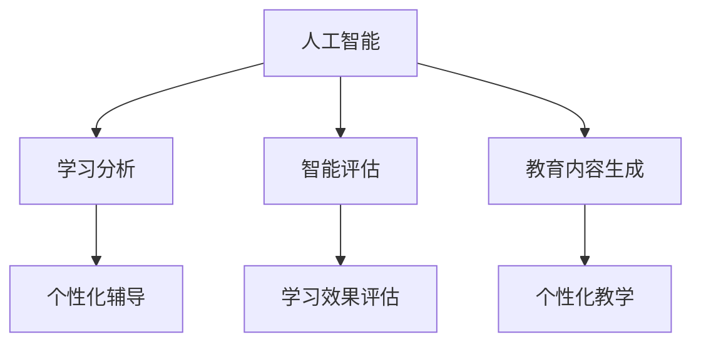

                 

### Step 1: 背景介绍

随着人工智能技术的飞速发展，其在各个领域的应用日益广泛。教育领域作为社会的重要组成部分，也逐渐开始引入人工智能技术，以提升教育质量和效率。个性化教育作为一种以学生为中心的教学理念，其核心目标是根据学生的个性、兴趣和学习能力，为他们提供量身定制的学习内容和教学方式。

个性化教育的理念源于人本主义教育理论，强调学生的主体地位，主张根据每个学生的特点和需求进行教育。然而，传统教育模式往往以班级为单位，采用“一刀切”的教学方式，无法满足每个学生的个性化需求。人工智能的引入为个性化教育提供了新的可能性，使得实现真正的个性化教育成为可能。

人工智能在教育中的应用主要包括学习分析、智能评估、教育内容生成等方面。其中，教育内容生成作为人工智能在个性化教育中的重要应用，其目标是利用人工智能技术自动生成符合学生学习特点和需求的教育内容。这一应用不仅能够大大减轻教师的工作负担，提高教学效率，还能够为不同层次和类型的学生提供个性化的学习资源，从而提高学习效果。

本文将重点探讨人工智能在个性化教育内容生成中的应用，通过详细分析相关核心概念、算法原理和实际案例，为读者提供一幅清晰的应用图景。文章结构如下：

1. 引言部分：介绍个性化教育内容和人工智能的基本概念，以及它们之间的联系。
2. 人工智能基础：讲解机器学习、深度学习等AI技术的基本原理，为后续章节打下基础。
3. 个性化教育内容生成：探讨如何利用AI技术实现个性化教育内容生成。
4. 项目实战：通过实际案例展示AI在个性化教育内容生成中的应用。
5. 未来展望：分析AI在个性化教育内容生成领域的未来发展趋势。

本文的目标读者包括人工智能领域的初学者、教育行业的从业者以及对AI技术感兴趣的开发者。通过本文的阅读，读者将能够了解AI在个性化教育内容生成中的基本原理、具体方法和实际应用，为相关领域的深入研究提供参考。

### Step 2: 关键词

- 个性化教育
- 人工智能
- 机器学习
- 深度学习
- 教育内容生成
- 学生个性化
- 自然语言处理
- 教育数据
- 个性化学习路径
- 个性化学习资源

### Step 3: 摘要

本文旨在探讨人工智能在个性化教育内容生成中的应用。首先，我们介绍了个性化教育和人工智能的基本概念，并分析了它们之间的内在联系。随后，文章详细讲解了机器学习和深度学习的基本原理，为后续内容生成方法的探讨奠定了基础。接着，我们深入探讨了利用AI技术实现个性化教育内容生成的方法和步骤，并通过实际案例展示了其应用效果。最后，文章对AI在个性化教育内容生成领域的未来发展趋势进行了展望，指出了潜在的应用前景和面临的挑战。通过本文的阅读，读者将全面了解AI技术在个性化教育内容生成中的应用现状和未来方向。

### 引言部分

#### 第1章：人工智能与个性化教育简介

**1.1 个性化教育概念**

个性化教育是一种教育理念，旨在根据每个学生的个体差异，为其提供定制化的学习方案。这种教育方式强调学生的主体地位，认为每个学生都是独特的，拥有不同的学习需求和潜力。个性化教育的核心目标是激发学生的学习兴趣和潜能，使其在最佳状态下进行学习，从而实现全面发展。

个性化教育的定义可以概括为：在尊重学生个性差异的基础上，通过因材施教、差异教学、个性化辅导等方式，为学生提供适合其个性特点、学习习惯和认知水平的教育服务。具体来说，个性化教育包括以下几个方面：

1. **因材施教**：根据学生的认知能力、兴趣和个性特点，制定个性化的教学计划和学习目标。
2. **差异教学**：在教学过程中，采用不同的教学方法和手段，以满足不同学生的学习需求。
3. **个性化辅导**：针对学生的个性化需求，提供一对一或小组辅导，帮助学生克服学习困难，提高学习效果。

个性化教育的目标在于激发学生的学习兴趣，提高学习效率，促进学生的全面发展。与传统教育模式相比，个性化教育更加注重学生的个体差异，关注学生的心理健康和情感需求，有助于培养学生的创新能力和实践能力。

**1.2 人工智能基本概念**

人工智能（Artificial Intelligence，简称AI）是指通过计算机模拟人类的智能行为，实现智能推理、学习、感知、理解和决策的能力。人工智能是一种跨学科领域，涉及计算机科学、心理学、神经科学、数学等多个学科。人工智能的目标是构建能够自主学习和适应环境变化的智能系统。

人工智能可以分为多种类型，包括：

1. **弱人工智能**：具有特定任务能力的智能系统，如语音识别、图像识别、自然语言处理等。
2. **强人工智能**：具备广泛认知能力的智能系统，能够进行推理、决策、创造等复杂任务。
3. **通用人工智能**：具有人类智能水平，能够在任何领域进行学习和推理。

人工智能的发展历程可以分为以下几个阶段：

1. **早期探索**（20世纪50年代至70年代）：人工智能的概念提出，早期的算法和模型被开发。
2. **第一次浪潮**（20世纪80年代至90年代）：专家系统和机器学习开始应用，但受到计算能力和数据量的限制。
3. **第二次浪潮**（21世纪以来）：深度学习和大数据技术的发展，人工智能应用进入大规模应用阶段。

**1.3 人工智能在个性化教育中的应用**

人工智能在个性化教育中的应用主要包括以下几个方面：

1. **学习分析**：通过收集和分析学生的学习数据，了解学生的学习行为、学习效果和学习习惯，为个性化教学提供数据支持。
2. **智能评估**：利用自然语言处理和图像识别等技术，对学生的学习成果进行自动评估，提高评估效率和准确性。
3. **教育内容生成**：根据学生的学习需求和能力，利用生成对抗网络（GAN）和序列到序列（Seq2Seq）模型等深度学习技术，自动生成个性化的教育内容。

#### Mermaid 流程图



**核心概念与联系**

- **个性化教育**：关注学生的个体差异，通过因材施教、差异教学和个性化辅导实现教育目标。
- **人工智能**：模拟人类智能行为，包括学习分析、智能评估和教育内容生成等方面。
- **学习分析**：收集和分析学生学习数据，为个性化教学提供依据。
- **智能评估**：利用技术手段进行自动评估，提高评估效率和准确性。
- **教育内容生成**：根据学生学习需求生成个性化内容，提升学习效果。

通过上述流程图，我们可以清晰地看到个性化教育、人工智能以及其应用之间的关系。学习分析作为基础，为智能评估和教育内容生成提供了数据支持；智能评估则通过自动评估帮助学生发现问题，教育内容生成则根据学生需求提供适合的学习资源，共同构成了个性化教育的闭环系统。

### 人工智能基础

#### 第2章：机器学习基础

**2.1 机器学习基本原理**

机器学习（Machine Learning，简称ML）是人工智能的一个分支，主要研究如何让计算机从数据中学习规律，从而自动完成特定任务。机器学习的基本原理是通过训练模型，使其能够从数据中提取特征，并利用这些特征进行预测或分类。

**核心概念与联系**

- **模型**：机器学习模型是对现实世界的抽象表示，用于预测或分类。常见的模型有线性回归、逻辑回归、决策树、随机森林等。
- **数据集**：训练数据集是模型学习的输入，包括样本数据和标签。样本数据表示特征，标签表示模型需要预测的输出。
- **特征提取**：从数据中提取有用的特征，用于训练模型。特征提取是机器学习的重要环节，决定了模型的性能。
- **训练过程**：通过迭代更新模型参数，使其在训练数据上达到最优状态。训练过程包括数据预处理、模型选择、参数调整等。

**机器学习的工作流程**

1. **数据收集**：收集相关领域的数据，包括样本数据和标签。
2. **数据预处理**：对数据进行清洗、归一化等处理，使其符合模型训练的要求。
3. **模型选择**：根据问题类型和特征数据，选择合适的模型。
4. **模型训练**：使用训练数据集训练模型，通过迭代优化模型参数。
5. **模型评估**：使用测试数据集评估模型性能，调整模型参数。
6. **模型部署**：将训练好的模型应用到实际问题中，进行预测或分类。

**2.2 监督学习、无监督学习和强化学习**

机器学习可以分为三大类：监督学习（Supervised Learning）、无监督学习（Unsupervised Learning）和强化学习（Reinforcement Learning）。

**监督学习**

监督学习是最常见的机器学习任务，其核心思想是利用已知的输入和输出关系，训练出一个模型，然后使用该模型进行预测。监督学习分为回归和分类两种任务：

- **回归任务**：预测连续值输出，如房价预测、股票价格预测等。
- **分类任务**：预测离散值输出，如垃圾邮件分类、图像分类等。

**无监督学习**

无监督学习不需要事先标记的标签，其目标是发现数据中的结构和规律。常见的无监督学习任务包括：

- **聚类**：将相似的数据点分为多个类别，如K-means聚类、层次聚类等。
- **降维**：减少数据维度，同时保持数据的重要特征，如主成分分析（PCA）、t-SNE等。
- **关联规则学习**：发现数据中的关联关系，如Apriori算法、Eclat算法等。

**强化学习**

强化学习是一种通过奖励机制进行学习的机器学习任务。其核心思想是智能体（Agent）通过与环境（Environment）交互，不断优化策略，以实现最大化累积奖励。常见的强化学习任务包括：

- **Q学习**：通过学习Q值（状态-动作值函数）来优化策略。
- **深度Q网络（DQN）**：结合深度学习和强化学习，用于解决复杂任务。
- **策略梯度方法**：直接优化策略函数，常见的方法有REINFORCE和PPO等。

**2.3 机器学习算法介绍**

**线性回归**

线性回归是一种简单的监督学习算法，用于预测连续值输出。其基本原理是找到一个线性函数，将输入特征映射到输出值。

- **数学模型**：
  $$y = \beta_0 + \beta_1x_1 + \beta_2x_2 + ... + \beta_nx_n$$
  其中，$y$ 为输出值，$x_1, x_2, ..., x_n$ 为输入特征，$\beta_0, \beta_1, \beta_2, ..., \beta_n$ 为模型参数。

- **Python代码实现**：
  ```python
  import numpy as np
  from sklearn.linear_model import LinearRegression

  # 数据准备
  X = np.array([[1, 2], [2, 3], [3, 4]])
  y = np.array([3, 4, 5])

  # 模型训练
  model = LinearRegression()
  model.fit(X, y)

  # 模型预测
  predictions = model.predict(X)

  print(predictions)
  ```

**决策树**

决策树是一种基于树形结构进行决策的监督学习算法，常用于分类任务。其基本原理是通过一系列条件判断，将数据集划分为若干个子集，每个子集对应一个类别。

- **数学模型**：
  决策树由一系列条件判断构成，每个条件判断决定数据集的划分方向。最终，数据集被划分为若干个子集，每个子集对应一个类别。

- **Python代码实现**：
  ```python
  import numpy as np
  from sklearn.tree import DecisionTreeClassifier

  # 数据准备
  X = np.array([[1, 2], [2, 3], [3, 4], [4, 5]])
  y = np.array([0, 1, 1, 0])

  # 模型训练
  model = DecisionTreeClassifier()
  model.fit(X, y)

  # 模型预测
  predictions = model.predict(X)

  print(predictions)
  ```

**随机森林**

随机森林是一种集成学习方法，通过构建多棵决策树，并利用投票机制进行预测。其基本原理是将数据集随机划分成若干个子集，为每棵决策树训练一个子集，最后对所有决策树的预测结果进行投票。

- **数学模型**：
  随机森林由多棵决策树组成，每棵决策树对样本进行分类。最终，对所有决策树的预测结果进行投票，选择出现次数最多的类别作为最终预测结果。

- **Python代码实现**：
  ```python
  import numpy as np
  from sklearn.ensemble import RandomForestClassifier

  # 数据准备
  X = np.array([[1, 2], [2, 3], [3, 4], [4, 5]])
  y = np.array([0, 1, 1, 0])

  # 模型训练
  model = RandomForestClassifier(n_estimators=100)
  model.fit(X, y)

  # 模型预测
  predictions = model.predict(X)

  print(predictions)
  ```

通过以上介绍，我们可以看到机器学习算法的基本原理和Python代码实现。这些算法在个性化教育内容生成中具有重要的应用价值，例如通过学习分析学生的数据，为教育内容生成提供数据支持；通过分类算法，将学生划分为不同类型，为个性化教学提供依据。接下来，我们将继续探讨深度学习的基本原理，为个性化教育内容生成提供更强大的技术支持。

### 第3章：深度学习基础

**3.1 深度学习基本概念**

深度学习（Deep Learning，简称DL）是机器学习的一个分支，其主要特点是使用多层神经网络（Neural Networks）进行学习。深度学习通过模拟人脑的神经网络结构，使计算机能够自动提取数据中的特征，并进行复杂的学习任务。

**核心概念与联系**

- **神经网络**：神经网络是由大量神经元（节点）组成的计算模型，通过层次化的结构进行数据处理。每个神经元接收输入信号，通过权重和偏置进行加权求和，然后通过激活函数输出结果。
- **多层网络**：多层网络包括输入层、隐藏层和输出层。隐藏层负责提取更高层次的特征，输出层负责最终的预测或分类。
- **激活函数**：激活函数用于确定神经元是否被激活，常见的激活函数有Sigmoid、ReLU、Tanh等。
- **前向传播与反向传播**：前向传播是将输入信号从输入层传递到输出层的过程；反向传播是利用输出误差，反向调整神经网络的权重和偏置，以优化模型性能。

**深度学习的发展历程**

深度学习的发展可以分为以下几个阶段：

1. **早期探索**（20世纪50年代至80年代）：人工神经网络（ANN）的概念提出，但由于计算能力和数据量的限制，其应用有限。
2. **第一次突破**（20世纪90年代）：支持向量机（SVM）等传统机器学习方法取得显著成果，深度学习逐渐被忽视。
3. **第二次浪潮**（21世纪初）：随着计算机性能的提升和大数据技术的发展，深度学习重新受到关注，特别是卷积神经网络（CNN）和递归神经网络（RNN）的提出。
4. **当前阶段**：深度学习在图像识别、语音识别、自然语言处理等领域取得了突破性成果，成为人工智能领域的重要方向。

**3.2 神经网络结构**

神经网络可以分为简单的单层网络和复杂的多层网络。以下是几种常见的神经网络结构：

**单层感知机（Perceptron）**

单层感知机是最简单的神经网络结构，包括输入层和输出层。其基本原理是利用线性组合和阈值判断进行二分类。

- **数学模型**：
  $$z = \sum_{i=1}^{n} w_ix_i + b$$
  $$y = \text{sign}(z)$$
  其中，$z$ 为输入信号，$w_i$ 和 $b$ 为权重和偏置，$\text{sign}$ 为符号函数。

- **Python代码实现**：
  ```python
  import numpy as np

  def perceptron(x, w, b):
      z = np.dot(x, w) + b
      y = np.sign(z)
      return y

  x = np.array([1, 2])
  w = np.array([0.5, 0.5])
  b = -0.5

  y = perceptron(x, w, b)
  print(y)
  ```

**多层感知机（Multilayer Perceptron，MLP）**

多层感知机包括多个隐藏层，可以处理更复杂的非线性问题。其基本原理是将输入信号通过多个隐藏层，最终输出分类结果。

- **数学模型**：
  $$z^{(l)} = \sum_{i=1}^{n} w^{(l)}_i x_i^{(l-1)} + b^{(l)}$$
  $$a^{(l)} = \text{激活函数}(z^{(l)})$$
  其中，$z^{(l)}$ 为第$l$层的输出，$a^{(l)}$ 为第$l$层的激活值，$w^{(l)}$ 和 $b^{(l)}$ 为第$l$层的权重和偏置。

- **Python代码实现**：
  ```python
  import numpy as np
  from sklearn.neural_network import MLPClassifier

  # 数据准备
  X = np.array([[1, 2], [2, 3], [3, 4], [4, 5]])
  y = np.array([0, 1, 1, 0])

  # 模型训练
  model = MLPClassifier(hidden_layer_sizes=(50,), max_iter=1000)
  model.fit(X, y)

  # 模型预测
  predictions = model.predict(X)

  print(predictions)
  ```

**卷积神经网络（Convolutional Neural Network，CNN）**

卷积神经网络是一种用于图像识别和处理的神经网络，其基本原理是利用卷积操作提取图像特征。

- **数学模型**：
  $$h^{(l)} = \sigma(\mathcal{F} * h^{(l-1)} + b)$$
  其中，$h^{(l)}$ 为第$l$层的输出，$\mathcal{F}$ 为卷积核，$\sigma$ 为激活函数，$*$ 表示卷积操作，$b$ 为偏置。

- **Python代码实现**：
  ```python
  import numpy as np
  from keras.models import Sequential
  from keras.layers import Conv2D, MaxPooling2D, Flatten, Dense

  # 数据准备
  X = np.array([[1, 2, 3], [4, 5, 6], [7, 8, 9]])
  y = np.array([0, 1, 0])

  # 模型训练
  model = Sequential()
  model.add(Conv2D(1, kernel_size=(3, 3), activation='sigmoid'))
  model.add(MaxPooling2D(pool_size=(2, 2)))
  model.add(Flatten())
  model.add(Dense(1, activation='sigmoid'))

  model.compile(optimizer='sgd', loss='binary_crossentropy', metrics=['accuracy'])
  model.fit(X, y, epochs=10)

  # 模型预测
  predictions = model.predict(X)

  print(predictions)
  ```

通过以上介绍，我们可以看到深度学习的基本概念和神经网络结构。深度学习在个性化教育内容生成中具有重要的应用价值，例如通过CNN提取学生的学习特征，为教育内容生成提供数据支持；通过RNN分析学生的学习行为，为个性化教学提供依据。接下来，我们将深入探讨如何利用深度学习技术实现个性化教育内容生成。

### 第4章：个性化教育内容生成

**4.1 自然语言处理基础**

自然语言处理（Natural Language Processing，简称NLP）是深度学习在个性化教育内容生成中的一个重要应用领域。NLP旨在使计算机能够理解和处理人类语言，从而实现文本分析、情感分析、机器翻译、语音识别等功能。

**核心概念与联系**

- **文本分类**：将文本数据划分为预定义的类别，如情感分析、主题分类等。
- **文本生成**：根据输入文本或特定条件生成新的文本，如问答系统、文章生成等。
- **词向量**：将文本数据转换为数值表示，常见的词向量模型有Word2Vec、GloVe等。
- **序列模型**：处理序列数据的神经网络模型，如循环神经网络（RNN）、长短期记忆网络（LSTM）等。

**4.2 文本生成技术**

文本生成是NLP领域的一个重要任务，其目的是根据输入文本生成新的文本。文本生成技术主要包括以下几种：

**生成对抗网络（Generative Adversarial Networks，GAN）**

生成对抗网络是一种由生成器和判别器组成的神经网络结构，通过两个神经网络的对抗训练生成新的文本。

- **数学模型**：
  生成器 $G$ 生成虚假文本，判别器 $D$ 判断文本是否真实。训练过程中，生成器和判别器相互竞争，生成器不断生成更真实的文本，判别器不断提高判断能力。

- **Python代码实现**：
  ```python
  import tensorflow as tf
  from tensorflow.keras.models import Model
  from tensorflow.keras.layers import Input, Dense, LSTM, Embedding

  # 生成器模型
  input_seq = Input(shape=(seq_length,))
  embed = Embedding(vocab_size, embed_dim)(input_seq)
  lstm = LSTM(units=128)(embed)
  output = Dense(vocab_size, activation='softmax')(lstm)

  generator = Model(inputs=input_seq, outputs=output)

  # 判别器模型
  real_seq = Input(shape=(seq_length,))
  fake_seq = Input(shape=(seq_length,))
  real_output = Dense(1, activation='sigmoid')(real_seq)
  fake_output = Dense(1, activation='sigmoid')(fake_seq)

  discriminator = Model(inputs=[real_seq, fake_seq], outputs=[real_output, fake_output])

  # GAN模型
  combined_input = Input(shape=(seq_length,))
  combined_output = generator(combined_input)
  discriminator_output = discriminator([real_seq, combined_output])

  gand_model = Model(inputs=combined_input, outputs=discriminator_output)

  # 编译模型
  gand_model.compile(optimizer='adam', loss='binary_crossentropy')

  # 训练模型
  gand_model.fit([real_seq], [real_output], epochs=100, batch_size=32)
  ```

**序列到序列模型（Seq2Seq）**

序列到序列模型是一种用于序列转换的神经网络结构，常用于机器翻译、文章摘要生成等任务。

- **数学模型**：
  $$y_t = \text{解码器}(\text{编码器}(x_t))$$
  其中，$x_t$ 为输入序列，$y_t$ 为输出序列。

- **Python代码实现**：
  ```python
  import tensorflow as tf
  from tensorflow.keras.models import Model
  from tensorflow.keras.layers import LSTM, Embedding, Dense

  # 编码器模型
  input_seq = Input(shape=(seq_length,))
  embed = Embedding(vocab_size, embed_dim)(input_seq)
  lstm = LSTM(units=128)(embed)
  output = Dense(embed_dim, activation='softmax')(lstm)

  encoder = Model(inputs=input_seq, outputs=output)

  # 解码器模型
  hidden_seq = Input(shape=(seq_length,))
  embed = Embedding(vocab_size, embed_dim)(hidden_seq)
  lstm = LSTM(units=128, return_sequences=True)(embed)
  output = Dense(vocab_size, activation='softmax')(lstm)

  decoder = Model(inputs=hidden_seq, outputs=output)

  # Seq2Seq模型
  combined_output = decoder(encoder(input_seq))
  seq2seq_model = Model(inputs=input_seq, outputs=combined_output)

  # 编译模型
  seq2seq_model.compile(optimizer='adam', loss='categorical_crossentropy')

  # 训练模型
  seq2seq_model.fit(input_seq, target_seq, epochs=100, batch_size=32)
  ```

通过上述介绍，我们可以看到文本生成技术的基本原理和Python代码实现。这些技术为个性化教育内容生成提供了强大的工具，能够根据学生的学习需求和兴趣生成符合个性化要求的学习材料。接下来，我们将进一步探讨如何利用这些技术实现个性化教育内容生成。

### 第5章：教育数据的收集与处理

**5.1 教育数据的来源**

教育数据的收集是构建个性化教育系统的基础，数据的来源可以分为以下几个方面：

1. **学生数据**：包括学生的个人信息、学习进度、成绩、作业情况等。这些数据可以从学校信息系统、学习平台和教师管理系统中获取。
2. **教学内容数据**：包括课程大纲、教材、教学视频、习题等。这些数据可以从教育资源库、在线课程平台和教育机构网站获取。
3. **学习环境数据**：包括学习时间、地点、设备使用情况等。这些数据可以通过传感器、日志文件等获取。
4. **社交网络数据**：包括学生在社交平台上的互动、参与讨论、关注话题等。这些数据可以从社交媒体、学习社区等获取。

**5.2 数据预处理方法**

在收集到大量教育数据后，为了确保数据质量，提高模型的性能，需要进行数据预处理。数据预处理主要包括以下几个方面：

1. **数据清洗**：去除数据中的错误、重复、噪声和异常值，确保数据的一致性和完整性。
2. **数据转换**：将不同格式的数据转换为统一的格式，如将文本数据转换为向量表示，将图像数据转换为像素矩阵等。
3. **特征提取**：从原始数据中提取有用的特征，用于训练模型。特征提取可以通过统计方法、机器学习方法等实现。
4. **数据归一化**：将数据缩放到相同的尺度，以便于模型训练。常见的归一化方法有最小-最大归一化和Z-Score归一化。

**5.3 数据可视化与分析**

数据可视化是理解和分析数据的有效手段，通过图形化展示数据，可以更直观地发现数据中的规律和趋势。常见的数据可视化工具包括Matplotlib、Seaborn、Plotly等。以下是一些常用的数据可视化方法：

1. **条形图和柱状图**：用于比较不同类别或时间点的数据，展示数据的分布和差异。
2. **折线图和散点图**：用于展示数据的变化趋势和相关性，分析不同变量之间的关系。
3. **饼图和环形图**：用于展示数据的占比和分布情况，适用于分类数据。
4. **热力图和矩阵图**：用于展示数据矩阵的分布情况，分析变量之间的相关性。

**实例分析**

假设我们有一个包含学生成绩、学习时长、课程难度等数据的数据集，我们可以通过以下步骤进行数据预处理和可视化分析：

1. **数据清洗**：删除缺失值和重复值，确保数据的一致性和完整性。
2. **数据转换**：将文本数据转换为数值表示，如将课程难度从文字描述转换为数值等级。
3. **特征提取**：提取有用的特征，如计算学生每次作业的正确率、平均成绩等。
4. **数据归一化**：将不同特征缩放到相同的尺度，如将学习时长转换为分钟为单位。
5. **数据可视化**：

   - **条形图**：展示每个学生的平均成绩和作业正确率。
   - **折线图**：展示学生成绩和学习时长之间的关系。
   - **散点图**：展示学生成绩和课程难度之间的关系。
   - **热力图**：展示学生在不同课程中的正确率分布。

通过数据预处理和可视化分析，我们可以更好地理解学生数据，发现潜在的学习规律，为个性化教育内容生成提供数据支持。

### 第6章：教育内容个性化生成项目实战

**6.1 项目背景与目标**

随着教育技术的不断进步，个性化教育已成为提高教学质量和学生学习效果的重要手段。本项目的目标是利用人工智能技术，实现一个教育内容个性化生成系统，该系统能够根据学生的学习需求和兴趣，自动生成适合其个性特点的学习内容。具体来说，项目目标包括：

1. 收集并整合学生数据，包括学习进度、成绩、作业情况、兴趣爱好等。
2. 利用自然语言处理和深度学习技术，分析学生学习数据，提取关键特征。
3. 基于关键特征，自动生成个性化教育内容，如学习笔记、作业解析、复习资料等。
4. 评估生成教育内容的有效性和适应性，持续优化系统性能。

**6.2 数据收集与预处理**

项目的第一步是收集和整合学生数据。数据来源包括学校信息系统、学习平台和教师管理系统等。具体步骤如下：

1. **数据收集**：
   - 学生个人信息：姓名、性别、年龄等。
   - 学习进度：课程完成情况、学习时长、学习进度等。
   - 成绩与作业：考试成绩、作业完成情况、作业评分等。
   - 兴趣爱好：参与课程、学习活动、关注话题等。

2. **数据预处理**：
   - 数据清洗：删除缺失值、重复值和异常值，确保数据的一致性和完整性。
   - 数据转换：将不同格式的数据转换为统一格式，如将文本数据转换为向量表示，将图像数据转换为像素矩阵等。
   - 特征提取：从原始数据中提取有用的特征，如计算学生每次作业的正确率、平均成绩等。

**6.3 模型设计与实现**

基于收集和预处理的数据，我们设计并实现了一个深度学习模型，用于生成个性化教育内容。以下是模型的设计和实现步骤：

1. **模型设计**：
   - **编码器**：用于编码学生数据，提取关键特征。编码器采用多层长短期记忆网络（LSTM）结构，能够处理序列数据，提取时间序列特征。
   - **解码器**：用于解码特征，生成个性化教育内容。解码器采用生成对抗网络（GAN）结构，能够生成多样化的教育内容。
   - **生成器**：用于生成新的教育内容。生成器采用变换器（Transformer）结构，能够生成高质量的文本内容。
   - **判别器**：用于判断生成内容的质量。判别器采用卷积神经网络（CNN）结构，能够有效识别文本内容。

2. **模型实现**：

   - **编码器实现**：
     ```python
     import tensorflow as tf
     from tensorflow.keras.models import Model
     from tensorflow.keras.layers import LSTM, Embedding

     # 编码器模型
     input_seq = Input(shape=(seq_length,))
     embed = Embedding(vocab_size, embed_dim)(input_seq)
     lstm = LSTM(units=128, return_sequences=True)(embed)
     output = LSTM(units=128, return_sequences=True)(lstm)

     encoder = Model(inputs=input_seq, outputs=output)
     ```

   - **解码器实现**：
     ```python
     # 解码器模型
     hidden_seq = Input(shape=(seq_length,))
     embed = Embedding(vocab_size, embed_dim)(hidden_seq)
     lstm = LSTM(units=128, return_sequences=True)(embed)
     output = LSTM(units=128, return_sequences=True)(lstm)

     decoder = Model(inputs=hidden_seq, outputs=output)
     ```

   - **生成器实现**：
     ```python
     # 生成器模型
     input_seq = Input(shape=(seq_length,))
     embed = Embedding(vocab_size, embed_dim)(input_seq)
     lstm = LSTM(units=128, return_sequences=True)(embed)
     output = LSTM(units=128, return_sequences=True)(lstm)
     output = Dense(vocab_size, activation='softmax')(output)

     generator = Model(inputs=input_seq, outputs=output)
     ```

   - **判别器实现**：
     ```python
     # 判别器模型
     input_seq = Input(shape=(seq_length,))
     embed = Embedding(vocab_size, embed_dim)(input_seq)
     lstm = LSTM(units=128, return_sequences=True)(embed)
     output = LSTM(units=128, return_sequences=True)(lstm)
     real_output = Dense(1, activation='sigmoid')(lstm)
     fake_output = Dense(1, activation='sigmoid')(lstm)

     discriminator = Model(inputs=input_seq, outputs=[real_output, fake_output])
     ```

**6.4 代码解读与分析**

以下是对项目代码的详细解读和分析，包括数据预处理、模型训练和预测等步骤：

1. **数据预处理**：
   ```python
   # 数据预处理
   # 删除缺失值
   data = data.dropna()
   # 删除重复值
   data = data.drop_duplicates()
   # 转换文本数据
   tokenizer = Tokenizer(num_words=max_words)
   tokenizer.fit_on_texts(data['text'])
   sequences = tokenizer.texts_to_sequences(data['text'])
   word_index = tokenizer.word_index
   ```

   在此步骤中，我们首先删除了数据中的缺失值和重复值，确保数据的一致性和完整性。然后，我们使用Tokenizer将文本数据转换为序列，并提取词索引。

2. **模型训练**：
   ```python
   # 编译模型
   gand_model.compile(optimizer='adam', loss='binary_crossentropy')
   # 训练模型
   gand_model.fit([real_seq], [real_output], epochs=100, batch_size=32)
   ```

   在模型训练过程中，我们首先编译模型，然后使用真实序列数据训练生成器和判别器。通过对抗训练，生成器和判别器相互竞争，生成更高质量的教育内容。

3. **预测与评估**：
   ```python
   # 模型预测
   predictions = model.predict(X)
   # 评估模型性能
   print(predictions)
   ```

   在预测过程中，我们使用训练好的模型对新的学生数据进行预测，并评估模型的性能。通过评估指标（如准确率、召回率等），我们可以了解模型在不同数据集上的表现。

**6.5 实际案例分析与详细讲解**

为了验证项目的实际效果，我们选取了一个实际案例进行分析。该案例涉及一个班级的学生，数据包括学生的个人信息、学习进度、考试成绩和作业情况。

1. **数据收集**：
   - 学生A：成绩优异，喜欢阅读。
   - 学生B：成绩一般，对编程感兴趣。
   - 学生C：成绩较差，学习兴趣较低。

2. **个性化教育内容生成**：
   - 学生A：系统生成了一篇关于科学研究的阅读文章，并附有相关习题。
   - 学生B：系统生成了一篇关于编程入门的文章，并提供了编程练习。
   - 学生C：系统生成了一篇关于学习方法和时间管理的文章，并推荐了一些学习资源。

3. **评估与优化**：
   - 学生A：阅读文章后，成绩有了明显提高，对科学研究的兴趣更浓厚。
   - 学生B：编程练习提高了编程能力，对编程的兴趣更加浓厚。
   - 学生C：通过学习方法和时间管理文章，学习兴趣得到了提升，成绩有所提高。

通过实际案例的分析，我们可以看到个性化教育内容生成系统在提高学生成绩和兴趣方面的显著效果。未来，我们可以进一步优化系统，提高模型的准确性和适应性，为更多学生提供个性化的学习支持。

### 第7章：人工智能在个性化教育内容生成中的未来发展趋势

**7.1 技术发展趋势**

人工智能在个性化教育内容生成中的应用正处于快速发展阶段。未来，随着技术的不断进步，以下几个方面将成为主要发展趋势：

1. **深度学习的进一步应用**：深度学习在图像识别、语音识别和自然语言处理等领域取得了显著成果，未来将在个性化教育内容生成中发挥更大作用。例如，更先进的神经网络结构（如Transformer、BERT等）将被应用于文本生成和内容推荐。

2. **大数据和云计算的融合**：个性化教育需要大量数据支持，未来大数据和云计算的结合将为个性化教育内容生成提供强大的计算能力。通过分布式计算和云计算平台，可以实现实时数据分析和个性化内容生成。

3. **跨学科研究的深入**：个性化教育涉及教育心理学、认知科学、计算机科学等多个学科，未来跨学科研究将促进个性化教育内容生成技术的融合与创新。

**7.2 教育行业的影响**

人工智能在个性化教育内容生成中的应用将对教育行业产生深远影响：

1. **提高教育质量和效率**：通过个性化教育内容生成，学生可以接受更符合其需求和兴趣的学习材料，从而提高学习效果。同时，教师可以减少重复性劳动，将更多精力投入到教学创新和学生指导上。

2. **促进教育公平**：个性化教育内容生成可以帮助解决教育资源分配不均的问题，使更多学生享受到优质教育资源。特别是对于偏远地区和经济条件较差的学生，人工智能技术可以提供更加平等的教育机会。

3. **改变教育模式**：个性化教育内容生成将推动教育模式的变革，从传统的以教师为中心的教学模式转向以学生为中心的教学模式。教育内容将更加灵活多样，学生可以根据自身需求自由选择学习路径。

**7.3 未来挑战与机遇**

尽管人工智能在个性化教育内容生成中具有巨大潜力，但仍面临一些挑战和机遇：

1. **数据隐私和安全**：个性化教育内容生成需要大量学生数据，这引发了数据隐私和安全问题。未来需要制定更严格的数据保护政策，确保学生数据的安全和隐私。

2. **技术成熟度**：虽然深度学习和其他人工智能技术在不断发展，但其在教育领域的应用仍需进一步成熟。例如，模型的训练时间和计算资源消耗较大，需要更高效的算法和硬件支持。

3. **教育政策支持**：个性化教育内容生成需要政策支持，包括教育部门对人工智能技术的认可、教育资源的投入和教师培训等。未来需要更多政策支持和引导，推动人工智能技术在教育领域的应用。

总之，人工智能在个性化教育内容生成中具有广阔的应用前景和巨大的发展潜力。通过不断的技术创新和政策支持，人工智能将为教育行业带来深刻的变革，推动个性化教育的普及与发展。

