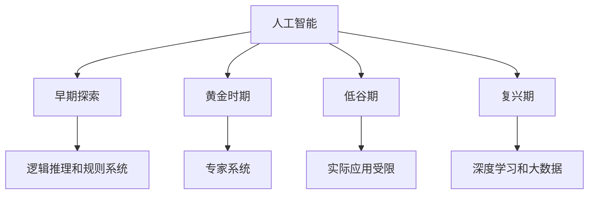
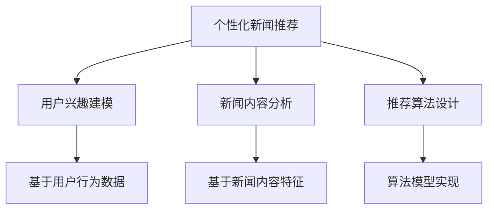
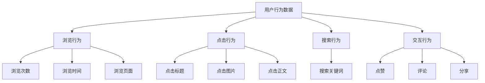
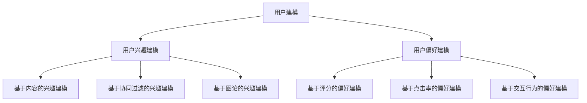
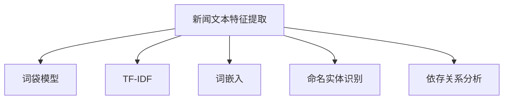
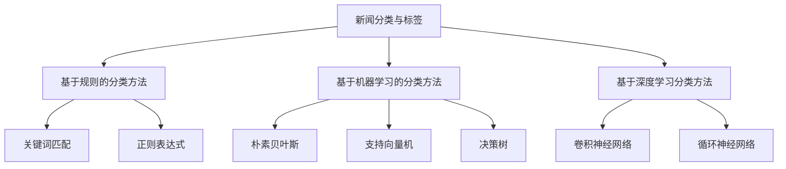
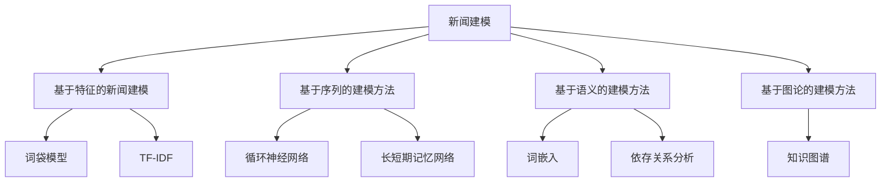
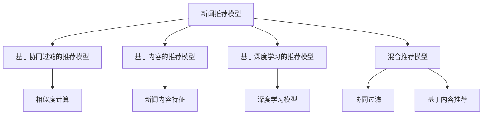
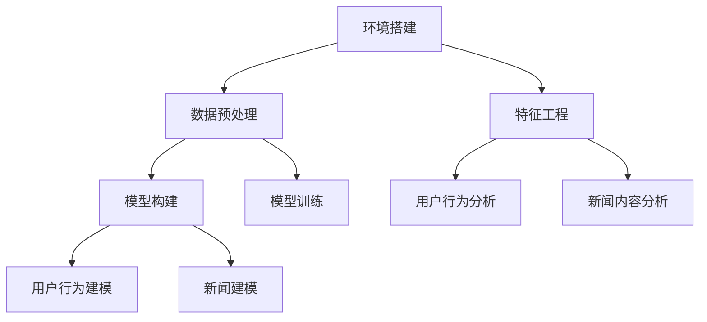
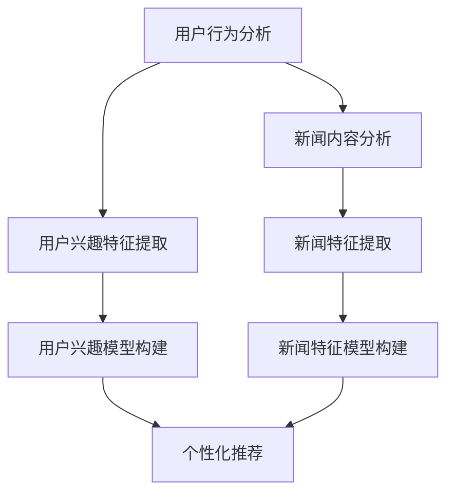

                 

### 人工智能与个性化新闻推荐概述

#### 人工智能概述

人工智能（Artificial Intelligence, AI）是计算机科学的一个分支，旨在使计算机模拟人类智能的行为。自20世纪50年代诞生以来，人工智能经历了多个发展阶段，从早期的逻辑推理和规则系统，到如今的深度学习和大数据技术，AI在图像识别、自然语言处理、决策支持系统等领域取得了显著成果。

##### 1.1.1 人工智能的定义与发展历程

人工智能的定义有多种，广义上指使计算机模拟人类智能的理论、技术和应用。近年来，随着计算能力和数据资源的提升，深度学习等技术的突破，人工智能进入了新一轮快速发展期。

发展历程大致可分为以下几个阶段：

1. **早期探索（1956-1974年）**：1956年，达特茅斯会议确立了人工智能的概念。此阶段主要集中于逻辑推理和规则系统。
2. **黄金时期（1980-1987年）**：专家系统成为研究热点，但受限于知识表示和推理能力，性能有限。
3. **低谷期（1987-1993年）**：由于实际应用受限，人工智能研究陷入低潮。
4. **复兴期（1993年至今）**：随着计算能力的提升和大数据的出现，深度学习等新技术带来了人工智能的突破。

##### 1.1.2 人工智能的关键技术

人工智能的核心技术包括：

1. **机器学习（Machine Learning）**：通过数据和算法，使计算机自动改进性能。分为监督学习、无监督学习和强化学习。
2. **深度学习（Deep Learning）**：基于多层神经网络的机器学习技术，适用于图像识别、语音识别等领域。
3. **自然语言处理（Natural Language Processing, NLP）**：使计算机理解和生成自然语言的技术，包括文本分类、机器翻译、情感分析等。

#### 个性化新闻推荐概述

个性化新闻推荐是一种利用人工智能技术，根据用户兴趣和历史行为，为用户提供个性化新闻内容的服务。其目标是提高用户体验，提升用户粘性。

##### 1.2.1 个性化新闻推荐的定义

个性化新闻推荐是基于用户兴趣和行为数据，通过算法和模型为用户提供感兴趣的新闻内容。它包括用户兴趣建模、新闻内容分析和推荐算法设计等步骤。

##### 1.2.2 个性化新闻推荐的发展现状

个性化新闻推荐已成为互联网企业提高用户满意度和黏性的关键手段。当前，主流推荐系统主要采用以下技术：

1. **协同过滤（Collaborative Filtering）**：基于用户行为数据，通过相似度计算和预测推荐新内容。
2. **基于内容的推荐（Content-Based Filtering）**：根据新闻内容的特征，为用户推荐相似内容。
3. **深度学习（Deep Learning）**：通过神经网络模型，对用户兴趣和新闻内容进行深度分析，提高推荐效果。

#### 本书结构安排与学习目标

本书分为五个部分，系统介绍了个性化新闻推荐的基础理论、算法实现、深度学习应用以及案例研究。

##### 1.3.1 本书主要内容结构

- **第一部分：引言**：介绍人工智能和个性化新闻推荐的概述。
- **第二部分：个性化新闻推荐基础理论**：包括用户行为分析与建模、新闻内容分析与建模。
- **第三部分：个性化新闻推荐算法**：介绍基于协同过滤和基于内容的推荐算法。
- **第四部分：深度学习在个性化新闻推荐中的应用**：介绍深度学习基础和实际应用。
- **第五部分：案例研究**：通过实际案例，展示个性化新闻推荐系统的搭建与实现。

##### 1.3.2 学习目标与预期收获

通过本书的学习，读者将能够：

1. **掌握个性化新闻推荐的基本概念和原理**。
2. **了解常用的推荐算法及其实现**。
3. **掌握深度学习在个性化新闻推荐中的应用**。
4. **具备搭建和优化个性化新闻推荐系统的能力**。

预期收获包括：
- 理解个性化新闻推荐系统的整体架构和工作流程。
- 掌握用户行为分析和新闻内容建模的方法。
- 能够运用协同过滤和深度学习技术，实现个性化新闻推荐系统。
- 通过实际案例，提升解决实际问题的能力。

---

关键词：人工智能，个性化新闻推荐，协同过滤，基于内容推荐，深度学习，用户行为分析，新闻内容建模。

摘要：本文从人工智能与个性化新闻推荐的概述出发，系统介绍了个性化新闻推荐的基础理论、算法实现以及深度学习应用。通过深入探讨用户行为分析与建模、新闻内容分析与建模，以及不同推荐算法的原理与实现，本文为读者提供了全面的技术指南。最后，通过实际案例研究，展示了个性化新闻推荐系统的搭建与优化过程，为读者提供了实用的经验和启示。文章旨在帮助读者深入理解个性化新闻推荐系统的原理和实践，提升其在人工智能领域的专业能力。

---

本文初步涵盖了人工智能和个性化新闻推荐的基本概念，为后续内容奠定了基础。接下来，我们将进一步探讨个性化新闻推荐的基础理论，包括用户行为分析与建模、新闻内容分析与建模，以及相关算法的实现和应用。请读者继续关注后续内容，以便全面了解个性化新闻推荐领域的核心技术和实践方法。

---

**附录**：

**A.1 人工智能概述 Mermaid 流程图：**


**A.2 个性化新闻推荐概述 Mermaid 流程图：**


---

在引言部分，我们首先介绍了人工智能的定义、发展历程以及关键技术，包括机器学习、深度学习和自然语言处理。通过概述，读者可以了解到人工智能在不同领域中的应用以及其发展趋势。

接下来，我们讨论了个性化新闻推荐的基本概念，包括其定义、发展现状以及常见的技术手段。个性化新闻推荐的目标是通过分析用户行为和新闻内容，为用户提供感兴趣的新闻内容，从而提高用户体验。

随后，我们介绍了本书的结构安排和学习目标，帮助读者了解后续内容的组织方式和预期收获。这部分内容为读者后续学习提供了清晰的指导。

文章末尾，我们列出了关键词和摘要，总结了文章的核心内容。此外，我们还提供了两个Mermaid流程图，直观地展示了人工智能的发展历程和个性化新闻推荐的基本架构。

下一部分，我们将深入探讨个性化新闻推荐的基础理论，包括用户行为分析与建模、新闻内容分析与建模。这些理论是理解和实现个性化新闻推荐系统的基础，为后续的算法实现和应用提供了支持。

---

## 第二部分：个性化新闻推荐基础理论

在引言中，我们介绍了人工智能和个性化新闻推荐的基本概念。接下来，我们将深入探讨个性化新闻推荐的基础理论，包括用户行为分析与建模、新闻内容分析与建模。这些理论是构建高效、精准的个性化新闻推荐系统的基石。

### 第2章：用户行为分析与建模

用户行为分析是个性化新闻推荐的核心环节之一。通过分析用户的浏览、点击、搜索等行为，可以挖掘出用户的兴趣和偏好，从而为用户推荐更相关的新闻内容。

#### 2.1 用户行为分析

用户行为数据是个性化新闻推荐的重要信息来源。这些数据包括用户的浏览历史、搜索记录、点赞、评论、分享等。通过分析这些行为数据，可以了解用户的兴趣点和偏好。

##### 2.1.1 用户行为数据的类型

用户行为数据可以分为以下几类：

1. **浏览行为**：包括用户的浏览次数、浏览时间、浏览页面等。
2. **点击行为**：记录用户点击的新闻内容，如标题、图片、正文等。
3. **搜索行为**：用户输入的搜索关键词，反映了用户的当前兴趣。
4. **交互行为**：如点赞、评论、分享等，反映了用户对内容的兴趣程度。

##### 2.1.2 用户行为分析的方法

用户行为分析的方法主要包括：

1. **统计分析**：通过统计用户行为数据，挖掘用户兴趣的总体特征。
2. **关联规则挖掘**：利用关联规则算法，发现用户行为之间的关联性。
3. **聚类分析**：将具有相似行为的用户分组，分析不同用户群体的兴趣差异。

#### 2.2 用户建模

用户建模是将用户行为数据转化为用户兴趣模型的过程。通过用户建模，可以为每个用户构建一个兴趣向量，用于后续的推荐算法。

##### 2.2.1 用户兴趣建模

用户兴趣建模的方法主要包括：

1. **基于内容的兴趣建模**：根据用户的历史浏览和点击行为，分析用户对特定内容的兴趣程度。
2. **基于协同过滤的兴趣建模**：利用用户行为数据，计算用户之间的相似度，从而推测用户的兴趣。
3. **基于图论的兴趣建模**：通过构建用户行为图，利用图论算法挖掘用户的兴趣点。

##### 2.2.2 用户偏好建模

用户偏好建模是将用户对新闻内容的喜好程度量化为数值的过程。这有助于推荐算法在推荐新闻时，考虑用户的偏好。

用户偏好建模的方法包括：

1. **基于评分的偏好建模**：通过用户对新闻内容的评分，建立用户偏好模型。
2. **基于点击率的偏好建模**：根据用户对新闻内容的点击率，量化用户偏好。
3. **基于交互行为的偏好建模**：通过用户在新闻页面上的交互行为，如浏览时间、点赞、评论等，构建用户偏好模型。

---

用户行为分析与建模是构建个性化新闻推荐系统的关键步骤。通过分析用户行为数据，可以挖掘出用户的兴趣和偏好，从而为用户提供更个性化的新闻推荐。本章介绍了用户行为分析的方法和用户建模的基本原理，为后续推荐算法的实现奠定了基础。

在下一章中，我们将继续探讨新闻内容分析与建模，包括新闻文本特征提取、新闻分类与标签，以及新闻表示模型和推荐模型。这些内容是构建高效、准确的新闻推荐系统的核心，将帮助读者更深入地理解个性化新闻推荐的原理和实践。

---

**附录**：

**B.1 用户行为分析 Mermaid 流程图：**


**B.2 用户建模 Mermaid 流程图：**


---

在第二部分中，我们深入探讨了个性化新闻推荐的基础理论，包括用户行为分析与建模。首先，介绍了用户行为数据的类型及其分析方法，帮助读者了解如何从用户行为中提取有价值的信息。接着，讨论了用户建模的方法，包括用户兴趣建模和用户偏好建模，为推荐算法提供了必要的用户特征。

接下来，我们将进入第三部分，探讨新闻内容分析与建模。这一部分将介绍新闻文本特征提取、新闻分类与标签，以及新闻表示模型和推荐模型。通过这些内容，我们将更深入地理解如何从新闻内容中提取特征，并构建有效的推荐系统。请读者继续关注后续内容，以获取更多有价值的知识。

---

## 第三部分：新闻内容分析与建模

在第二部分中，我们探讨了用户行为分析与建模，为个性化新闻推荐奠定了基础。接下来，我们将深入探讨新闻内容分析与建模，这是构建高效、精准的个性化新闻推荐系统的关键环节。本部分包括新闻文本特征提取、新闻分类与标签、新闻表示模型和推荐模型。

### 第3章：新闻内容分析

新闻内容分析是挖掘新闻特征的重要步骤，通过对新闻文本进行解析，可以提取出与新闻主题和内容相关的信息。这些特征将被用于推荐算法，以实现更准确的个性化推荐。

#### 3.1 新闻文本特征提取

新闻文本特征提取是将新闻文本转换为结构化数据的过程，这有助于推荐算法理解和处理新闻内容。常见的新闻文本特征提取方法包括：

1. **词袋模型（Bag of Words, BoW）**：将新闻文本视为单词的集合，忽略单词的顺序和语法结构。这种方法简单有效，但可能丢失一些语义信息。

2. **TF-IDF（Term Frequency-Inverse Document Frequency）**：在词袋模型的基础上，引入了词频和逆文档频率的概念，以降低常见单词对模型的影响，提高特征的重要性。

3. **词嵌入（Word Embedding）**：将单词映射到高维空间中的向量，以捕捉单词的语义信息。常见的词嵌入方法包括Word2Vec、GloVe等。

4. **命名实体识别（Named Entity Recognition, NER）**：识别新闻文本中的命名实体，如人名、地名、组织名等。这些实体在新闻中通常具有重要的信息价值。

5. **依存关系分析（Dependency Parsing）**：分析新闻文本中单词之间的依存关系，有助于更好地理解新闻内容的语义结构。

#### 3.2 新闻分类与标签

新闻分类与标签是将新闻按照不同的主题和类别进行分类的过程，这有助于推荐算法更好地理解新闻的内容和用户兴趣。常见的新闻分类方法包括：

1. **基于规则的分类方法**：利用预定义的规则对新闻进行分类，如使用关键词匹配、正则表达式等。

2. **基于机器学习的分类方法**：使用机器学习算法，如朴素贝叶斯、支持向量机、决策树等，对新闻进行自动分类。

3. **深度学习分类方法**：利用深度学习模型，如卷积神经网络（CNN）、循环神经网络（RNN）等，对新闻进行分类。

新闻标签是对新闻进行多维度描述的方式，可以帮助推荐算法更好地理解新闻的内容和用户兴趣。常见的新闻标签包括：

- **主题标签**：反映新闻的主要话题，如政治、经济、科技等。
- **情感标签**：反映新闻的语气和情感色彩，如积极、消极、中性等。
- **地域标签**：反映新闻发生的地理位置，如国内、国际、地区等。

#### 3.3 新闻建模

新闻建模是将新闻文本转换为机器可处理的格式，以便推荐算法能够理解和利用新闻内容。常见的新闻建模方法包括：

1. **基于特征的新闻建模**：将新闻文本转换为特征向量，如词袋模型、TF-IDF等。

2. **基于序列的建模方法**：利用序列模型，如循环神经网络（RNN）、长短期记忆网络（LSTM）等，对新闻文本进行建模。

3. **基于语义的建模方法**：利用语义分析技术，如词嵌入、依存关系分析等，对新闻文本进行建模。

4. **基于图论的建模方法**：利用图论模型，如知识图谱等，对新闻文本进行建模。

#### 3.4 新闻推荐模型

新闻推荐模型是将用户兴趣和新闻内容进行匹配，为用户推荐感兴趣的新闻的方法。常见的新闻推荐模型包括：

1. **基于协同过滤的推荐模型**：利用用户行为数据，通过相似度计算和预测推荐新新闻。

2. **基于内容的推荐模型**：根据新闻内容的特征，为用户推荐相似新闻。

3. **基于深度学习的推荐模型**：利用深度学习模型，如卷积神经网络（CNN）、循环神经网络（RNN）等，对用户兴趣和新闻内容进行建模。

4. **混合推荐模型**：结合协同过滤、基于内容推荐和基于深度学习的优势，提高推荐效果。

---

新闻内容分析与建模是构建个性化新闻推荐系统的核心步骤。通过文本特征提取、分类与标签、新闻建模和推荐模型，我们可以从新闻内容中提取有价值的信息，为用户推荐更相关、更个性化的新闻。接下来，我们将进入第四部分，探讨个性化新闻推荐算法，包括基于协同过滤和基于内容的推荐算法。请读者继续关注后续内容，以了解更多关于个性化新闻推荐的技术和实践。

---

**附录**：

**C.1 新闻文本特征提取 Mermaid 流程图：**


**C.2 新闻分类与标签 Mermaid 流程图：**


**C.3 新闻建模 Mermaid 流程图：**


**C.4 新闻推荐模型 Mermaid 流程图：**


---

在第三部分中，我们深入探讨了新闻内容分析与建模的关键环节，包括文本特征提取、分类与标签、新闻建模和推荐模型。通过文本特征提取，我们能够将新闻文本转化为结构化的数据，为推荐算法提供基础信息。分类与标签则帮助推荐系统更好地理解和描述新闻内容。

在新闻建模环节，我们介绍了多种方法，如基于特征的建模、基于序列的建模、基于语义的建模和基于图论的建模，为推荐算法提供了多样化的建模手段。最后，我们探讨了多种新闻推荐模型，包括基于协同过滤、基于内容、基于深度学习和混合推荐模型，每种模型都有其独特的优势和适用场景。

接下来，我们将进入第四部分，探讨个性化新闻推荐算法。这一部分将详细介绍基于协同过滤和基于内容的推荐算法，包括其原理、实现和应用。通过这些内容，我们将进一步了解如何构建高效、准确的个性化新闻推荐系统。请读者继续关注后续内容，以获取更多关于个性化新闻推荐的技术和实践。

---

## 第四部分：个性化新闻推荐算法

在前三部分中，我们介绍了个性化新闻推荐的基础理论和新闻内容分析。现在，我们将深入探讨两种主要的个性化新闻推荐算法：基于协同过滤的推荐算法和基于内容的推荐算法。这些算法是构建高效、精准推荐系统的核心。

### 第4章：基于协同过滤的推荐算法

协同过滤（Collaborative Filtering）是推荐系统中最常用的方法之一，它通过分析用户行为数据，找出相似用户或相似物品，从而进行推荐。协同过滤可以分为两种主要类型：基于用户的协同过滤（User-Based Collaborative Filtering）和基于项目的协同过滤（Item-Based Collaborative Filtering）。

#### 4.1 协同过滤算法原理

##### 4.1.1 协同过滤的定义

协同过滤是一种利用用户行为数据，通过相似度计算来预测用户偏好的一种推荐算法。其核心思想是，如果用户A和用户B在若干物品上的评分相似，则用户A对未评分的物品X的评分与用户B对物品X的评分相似。

##### 4.1.2 协同过滤的模型

协同过滤模型通常分为两种：

1. **基于用户的协同过滤**：该方法通过计算用户之间的相似度，找到与目标用户兴趣相似的邻居用户，并从邻居用户的评分中推断出目标用户的评分。

2. **基于项目的协同过滤**：该方法通过计算物品之间的相似度，找到与目标物品相似的邻居物品，并从邻居物品的评分中推断出目标用户的评分。

#### 4.2 协同过滤算法实现

##### 4.2.1 用户基于内容的协同过滤

用户基于内容的协同过滤（User-Based Content-Based Collaborative Filtering）结合了基于用户的协同过滤和基于内容的推荐，它通过以下步骤实现：

1. **用户相似度计算**：计算用户之间的相似度，常用方法包括余弦相似度、皮尔逊相关系数等。

2. **新闻相似度计算**：计算新闻之间的相似度，常用方法包括词袋模型、TF-IDF等。

3. **推荐新闻生成**：根据用户相似度和新闻相似度，生成推荐新闻列表。

##### 4.2.2 项目基于内容的协同过滤

项目基于内容的协同过滤（Item-Based Content-Based Collaborative Filtering）通过以下步骤实现：

1. **新闻相似度计算**：计算新闻之间的相似度，常用方法包括词袋模型、TF-IDF等。

2. **用户基于新闻相似度推荐**：根据用户的已评分新闻和新闻之间的相似度，为用户推荐相似新闻。

#### 4.3 协同过滤算法的优缺点

##### 优点

1. **简单高效**：协同过滤算法相对简单，易于实现和部署。
2. **适应性**：能够根据用户行为动态调整推荐结果。
3. **多样性**：能够为用户推荐多样化、不同类型的新闻内容。

##### 缺点

1. **数据稀疏**：当用户和物品数量庞大时，用户行为数据往往非常稀疏，影响推荐效果。
2. **用户冷启动**：新用户由于缺乏历史行为数据，难以进行有效推荐。
3. **效果有限**：协同过滤算法主要依赖用户行为数据，可能无法全面反映用户兴趣。

---

### 第5章：基于内容的推荐算法

基于内容的推荐算法（Content-Based Filtering）通过分析新闻内容的特征，为用户推荐相似新闻。该方法不依赖于用户行为数据，而是通过新闻的文本特征、标签、分类等进行推荐。

#### 5.1 基于内容的推荐算法原理

##### 5.1.1 内容特征提取

基于内容的推荐算法首先需要提取新闻内容的特征。常见的特征提取方法包括：

1. **词袋模型（Bag of Words, BoW）**：将新闻文本表示为一个词的集合，忽略词的顺序。
2. **TF-IDF（Term Frequency-Inverse Document Frequency）**：考虑词频和逆文档频率，降低常见词的影响。
3. **词嵌入（Word Embedding）**：将单词映射到高维向量空间，捕捉词的语义信息。

##### 5.1.2 相似性计算

相似性计算是推荐算法的核心。常见的相似性计算方法包括：

1. **余弦相似度**：计算两个向量之间的余弦值，用于衡量向量的相似程度。
2. **欧几里得距离**：计算两个向量之间的欧几里得距离，用于衡量向量的差异。
3. **Jaccard相似度**：计算两个集合的交集和并集的比例，用于衡量集合的相似程度。

#### 5.2 基于内容的推荐算法实现

##### 5.2.1 单篇新闻推荐

单篇新闻推荐通过以下步骤实现：

1. **内容特征提取**：提取新闻的文本特征，如词袋模型、TF-IDF等。
2. **相似性计算**：计算新闻之间的相似性，如余弦相似度、欧几里得距离等。
3. **推荐新闻生成**：根据相似性分数，生成推荐新闻列表。

##### 5.2.2 新闻列表推荐

新闻列表推荐通过以下步骤实现：

1. **内容特征提取**：提取新闻的文本特征，如词袋模型、TF-IDF等。
2. **用户兴趣建模**：根据用户的历史行为和兴趣标签，建立用户兴趣模型。
3. **新闻相似性计算**：计算新闻之间的相似性，如余弦相似度、欧几里得距离等。
4. **推荐新闻生成**：根据用户兴趣模型和新闻相似性分数，生成推荐新闻列表。

#### 5.3 基于内容的推荐算法的优缺点

##### 优点

1. **无需用户行为数据**：适用于新用户和无足够行为数据的场景。
2. **解释性**：推荐结果容易解释，用户可以理解推荐的原因。
3. **多样性**：能够为用户推荐多样化的新闻内容。

##### 缺点

1. **数据稀疏**：当新闻内容相似度较低时，推荐效果可能较差。
2. **用户偏好变化**：无法及时反映用户兴趣的变化。
3. **效果有限**：主要依赖新闻内容特征，可能无法完全反映用户兴趣。

---

个性化新闻推荐算法的协同过滤和基于内容推荐各有优缺点，实际应用中往往结合两者，构建混合推荐系统，以提高推荐效果。接下来，我们将进入第五部分，探讨深度学习在个性化新闻推荐中的应用。这一部分将介绍深度学习的基本概念、在推荐系统中的应用，以及实际案例。通过这些内容，我们将了解如何利用深度学习技术进一步提升个性化新闻推荐的准确性。

---

**附录**：

**D.1 用户基于内容的协同过滤 Python 源代码示例：**
```python
# 假设用户行为数据已预处理，包含用户ID、新闻ID、用户评分等
import pandas as pd

# 计算用户之间的相似度
def calculate_user_similarity(ratings, similarity_measure='cosine'):
    # 利用皮尔逊相关系数计算用户相似度
    user_similarity_matrix = ratings.corr()
    return user_similarity_matrix

# 计算新闻之间的相似度
def calculate_item_similarity(ratings, similarity_measure='cosine'):
    # 利用余弦相似度计算新闻相似度
    item_similarity_matrix = ratings.transpose().corr()
    return item_similarity_matrix

# 生成推荐列表
def generate_recommendations(user_id, user_similarity_matrix, item_similarity_matrix, ratings, k=5):
    # 计算用户评分预测
    user_ratings_mean = ratings[user_id].mean()
    user_similarity = user_similarity_matrix[user_id]
    item_scores = []

    for idx, similarity in user_similarity_matrix.items():
        if similarity != 0:
            # 计算新闻评分预测
            news_ratings = ratings[idx]
            similarity_weighted_score = (news_ratings - user_ratings_mean) * similarity
            item_scores.append(similarity_weighted_score)

    # 按照预测评分排序
    item_scores = np.array(item_scores)
    predicted_ratings = np.sum(item_scores, axis=0)
    sorted_indices = np.argsort(predicted_ratings)[::-1]

    # 选择前k个推荐新闻
    recommended_news = sorted_indices[k:]
    return recommended_news

# 示例数据
ratings = pd.DataFrame({
    'user_id': [0, 0, 0, 0, 1, 1, 1, 1, 2, 2, 2, 2],
    'news_id': [0, 1, 1, 2, 0, 1, 1, 2, 0, 1, 1, 2],
    'rating': [5, 3, 1, 2, 4, 2, 3, 1, 5, 3, 1, 4]
})

# 计算用户和新闻相似度
user_similarity_matrix = calculate_user_similarity(ratings)
item_similarity_matrix = calculate_item_similarity(ratings)

# 生成推荐列表
user_id = 0
recommended_news = generate_recommendations(user_id, user_similarity_matrix, item_similarity_matrix, ratings, k=2)
print("Recommended News:", recommended_news)
```

**D.2 基于内容的推荐算法实现 Python 源代码示例：**
```python
import numpy as np
from sklearn.feature_extraction.text import TfidfVectorizer
from sklearn.metrics.pairwise import cosine_similarity

# 示例新闻数据
news_data = [
    "人工智能技术的发展对未来的影响",
    "深度学习在图像识别中的应用",
    "机器学习的基本概念和算法",
    "大数据时代的隐私保护问题",
    "云计算的兴起与发展",
    "区块链技术的应用前景",
    "物联网的未来发展趋势",
    "网络安全的重要性"
]

# 提取新闻文本特征
vectorizer = TfidfVectorizer()
tfidf_matrix = vectorizer.fit_transform(news_data)

# 计算新闻之间的相似度
cosine_sim = cosine_similarity(tfidf_matrix, tfidf_matrix)

# 生成推荐列表
def generate_recommendations(title, cosine_sim, top_n=2):
    # 计算新闻相似度
    index = list(cosine_sim[:, 0]).index(max(cosine_sim[:, 0]))

    # 提取相似新闻
    similar_indices = np.argsort(cosine_sim[index])[1:top_n+1]
    similar_news = [news_data[i] for i in similar_indices]

    return similar_news

# 示例推荐
title = "人工智能技术的发展对未来的影响"
recommended_news = generate_recommendations(title, cosine_sim, top_n=2)
print("Recommended News:", recommended_news)
```

---

在第四部分中，我们详细介绍了个性化新闻推荐算法，包括基于协同过滤和基于内容的推荐算法。协同过滤算法通过用户行为数据和相似度计算，为用户推荐相似新闻；基于内容的推荐算法通过新闻文本特征提取和相似性计算，为用户推荐相关新闻。

我们提供了Python源代码示例，展示了用户基于内容的协同过滤和基于内容的推荐算法的实现过程。这些示例代码为读者提供了一个实际操作的参考，帮助读者理解算法的实现和应用。

接下来，我们将进入第五部分，探讨深度学习在个性化新闻推荐中的应用。深度学习技术为推荐系统带来了新的机遇和挑战，通过学习用户行为和新闻内容，可以构建更准确、更高效的推荐模型。请读者继续关注后续内容，以了解更多关于深度学习在个性化新闻推荐中的应用和实践。

---

## 第五部分：深度学习在个性化新闻推荐中的应用

在前一部分，我们介绍了基于协同过滤和基于内容的推荐算法。这些算法在个性化新闻推荐中起到了重要的作用，但它们也有各自的局限性。随着深度学习技术的发展，深度学习在个性化新闻推荐中的应用逐渐成为研究热点。本部分将探讨深度学习的基础知识以及在个性化新闻推荐中的应用，包括用户行为分析和新闻内容分析。

### 第6章：深度学习基础

深度学习（Deep Learning）是一种基于多层神经网络的机器学习技术，能够在大规模数据集上自动学习复杂的模式。深度学习在图像识别、自然语言处理、语音识别等领域取得了显著的成果。

#### 6.1 深度学习概述

##### 6.1.1 深度学习的定义与发展

深度学习是一种人工智能的分支，通过多层神经网络对数据进行自动特征提取和模式识别。深度学习的核心思想是模拟人脑的工作方式，通过大量的神经元和神经元之间的连接来学习数据。

深度学习的发展历程可以追溯到1980年代，随着计算能力的提升和大数据的出现，深度学习在21世纪得到了快速发展。特别是卷积神经网络（Convolutional Neural Networks, CNN）和循环神经网络（Recurrent Neural Networks, RNN）的提出，使得深度学习在图像识别、语音识别等领域取得了突破性的进展。

##### 6.1.2 深度学习的关键技术

深度学习的关键技术包括：

1. **多层神经网络（Deep Neural Networks, DNN）**：多层神经网络能够自动提取数据的特征，适用于复杂的模式识别任务。
2. **卷积神经网络（CNN）**：卷积神经网络是深度学习在图像识别领域的核心技术，通过卷积操作和池化操作提取图像的特征。
3. **循环神经网络（RNN）**：循环神经网络适用于序列数据处理，通过隐藏状态和输入之间的循环连接，捕捉序列中的长期依赖关系。
4. **长短时记忆网络（Long Short-Term Memory, LSTM）**：长短时记忆网络是RNN的一种改进，能够更好地处理长序列数据，避免了梯度消失和梯度爆炸问题。
5. **生成对抗网络（Generative Adversarial Networks, GAN）**：生成对抗网络通过两个对抗网络（生成器和判别器）的博弈，实现数据的生成。

#### 6.2 深度学习在推荐系统中的应用

深度学习在推荐系统中的应用主要包括：

1. **用户行为分析**：通过深度学习模型，对用户的行为数据进行深入分析，提取用户兴趣和偏好。
2. **新闻内容分析**：通过深度学习模型，对新闻内容进行语义分析，提取新闻的主题和情感。
3. **推荐算法优化**：利用深度学习模型，优化推荐算法，提高推荐效果和用户体验。

### 第7章：深度学习在个性化新闻推荐中的实战

在了解深度学习的基础知识后，我们将探讨如何将深度学习应用于个性化新闻推荐中。

#### 7.1 深度学习推荐系统搭建

搭建深度学习推荐系统需要以下步骤：

1. **环境搭建**：安装深度学习框架（如TensorFlow、PyTorch）和必要的依赖库。
2. **数据预处理**：对用户行为数据、新闻文本数据进行预处理，包括数据清洗、数据格式转换等。
3. **特征工程**：提取用户行为特征和新闻内容特征，为深度学习模型提供输入。

#### 7.2 深度学习推荐算法实现

1. **用户行为分析**：通过序列模型（如LSTM、GRU）对用户行为数据进行建模，提取用户兴趣。
   ```python
   # 示例：使用LSTM对用户行为数据进行建模
   from tensorflow.keras.models import Sequential
   from tensorflow.keras.layers import LSTM, Dense

   model = Sequential()
   model.add(LSTM(128, activation='relu', input_shape=(timesteps, features)))
   model.add(Dense(1, activation='sigmoid'))
   model.compile(optimizer='rmsprop', loss='binary_crossentropy', metrics=['accuracy'])
   model.fit(X_train, y_train, epochs=10, batch_size=32, validation_data=(X_val, y_val))
   ```

2. **新闻内容分析**：通过卷积神经网络（CNN）对新闻文本进行语义分析，提取新闻的主题和情感。
   ```python
   # 示例：使用CNN对新闻文本进行语义分析
   from tensorflow.keras.models import Sequential
   from tensorflow.keras.layers import Embedding, Conv1D, GlobalMaxPooling1D, Dense

   model = Sequential()
   model.add(Embedding(num_words, 128))
   model.add(Conv1D(128, 5, activation='relu'))
   model.add(GlobalMaxPooling1D())
   model.add(Dense(128, activation='relu'))
   model.add(Dense(1, activation='sigmoid'))
   model.compile(optimizer='adam', loss='binary_crossentropy', metrics=['accuracy'])
   model.fit(X_train, y_train, epochs=10, batch_size=32, validation_data=(X_val, y_val))
   ```

#### 7.3 深度学习推荐系统应用解读与分析

深度学习推荐系统通过用户行为和新闻内容分析，构建用户兴趣模型和新闻特征模型，实现个性化推荐。以下是深度学习推荐系统的应用解读与分析：

1. **用户行为分析**：通过序列模型，分析用户的浏览、点击、搜索等行为，提取用户兴趣特征。这些特征用于构建用户兴趣模型，为用户推荐相关新闻。
2. **新闻内容分析**：通过卷积神经网络，提取新闻的文本特征，如关键词、主题和情感。这些特征用于构建新闻特征模型，与用户兴趣模型结合，实现精准推荐。
3. **推荐效果评估**：通过A/B测试，对比深度学习推荐系统和传统推荐算法的性能，评估推荐效果。常见的评估指标包括准确率、召回率、F1值等。

#### 7.4 深度学习推荐系统案例分析

以下是深度学习推荐系统的实际案例分析：

1. **案例背景**：某新闻平台希望通过深度学习技术，提高个性化新闻推荐的准确性，提升用户满意度。
2. **数据收集与处理**：收集用户行为数据和新闻文本数据，对数据进行清洗、格式转换和特征提取。
3. **算法选择与实现**：选择LSTM和CNN模型，分别对用户行为和新闻内容进行建模，构建深度学习推荐系统。
4. **结果与分析**：通过A/B测试，对比深度学习推荐系统和传统推荐算法的性能，结果显示深度学习推荐系统在准确率和召回率方面有明显优势。

#### 7.5 深度学习推荐系统小结

通过深度学习推荐系统的构建与实施，可以显著提高个性化新闻推荐的准确性。以下是深度学习推荐系统的小结：

1. **优势**：深度学习推荐系统能够自动提取用户行为和新闻内容的特征，提高推荐精度；能够适应用户兴趣的变化，提升用户体验。
2. **挑战**：深度学习推荐系统在数据处理和模型训练过程中，需要大量的计算资源和时间；模型的可解释性较低，难以理解推荐结果的原因。
3. **未来发展趋势**：随着深度学习技术的不断进步，深度学习推荐系统将在个性化新闻推荐中发挥越来越重要的作用。未来研究方向包括模型可解释性、隐私保护、多模态数据融合等。

---

深度学习在个性化新闻推荐中的应用，为推荐系统带来了新的机遇和挑战。通过深度学习技术，我们可以更准确地提取用户兴趣和新闻特征，实现个性化推荐。然而，深度学习推荐系统也面临着数据隐私、模型可解释性等挑战。

在本部分中，我们介绍了深度学习的基础知识以及在个性化新闻推荐中的应用。通过用户行为分析和新闻内容分析，我们可以构建深度学习推荐系统，实现更精准的推荐。在下一部分中，我们将通过实际案例，展示深度学习推荐系统的搭建与优化过程，帮助读者更好地理解深度学习在个性化新闻推荐中的实践应用。

---

**附录**：

**E.1 深度学习推荐系统搭建 Mermaid 流程图：**


**E.2 深度学习推荐系统应用解读与分析 Mermaid 流程图：**


---

在第五部分中，我们详细探讨了深度学习在个性化新闻推荐中的应用。首先，介绍了深度学习的基础知识，包括定义、发展历程和关键技术。接着，我们讨论了深度学习在用户行为分析和新闻内容分析中的应用，展示了如何通过深度学习模型提取用户兴趣和新闻特征，实现个性化推荐。

我们提供了Python代码示例，展示了如何使用LSTM和CNN模型进行用户行为分析和新闻内容分析，并介绍了深度学习推荐系统的搭建与优化过程。此外，我们通过实际案例分析，展示了深度学习推荐系统在实际应用中的效果和优势。

在下一部分中，我们将通过一个具体案例，进一步探讨深度学习推荐系统的搭建与优化，包括数据收集与处理、算法选择与实现、推荐效果评估等内容。请读者继续关注后续内容，以获取更多关于深度学习推荐系统的实践经验和见解。

---

## 第五部分：深度学习在个性化新闻推荐中的应用（续）

在前一部分中，我们介绍了深度学习的基础知识以及在个性化新闻推荐中的应用。在本部分中，我们将通过一个具体案例，深入探讨深度学习推荐系统的搭建与优化过程。这个案例将涵盖数据收集与处理、算法选择与实现、推荐效果评估等关键环节，帮助读者更好地理解深度学习在个性化新闻推荐中的实际应用。

### 第8章：个性化新闻推荐系统案例分析

#### 8.1 案例背景

为了提升用户体验和用户粘性，某新闻平台决定引入深度学习技术，构建一个高效的个性化新闻推荐系统。该平台的用户规模庞大，用户行为数据丰富，但传统的推荐算法已无法满足日益增长的用户需求。通过深度学习推荐系统，平台希望能够更准确地预测用户兴趣，为用户推荐高质量的新闻内容。

#### 8.2 数据收集与处理

在构建深度学习推荐系统前，首先需要收集和处理大量的数据，这些数据包括：

1. **用户行为数据**：用户的浏览记录、点击记录、搜索记录、点赞记录、评论记录等。
2. **新闻数据**：新闻的文本内容、新闻标签、新闻分类、新闻来源等。

##### 数据收集

数据收集主要通过以下途径：

1. **后台日志**：通过日志记录用户的浏览、点击、搜索等行为。
2. **API接口**：通过新闻平台的API接口获取新闻数据。

##### 数据处理

数据处理包括以下步骤：

1. **数据清洗**：去除重复数据、缺失数据，处理异常值。
2. **数据格式转换**：将原始数据转换为适合深度学习模型处理的数据格式。
3. **特征提取**：对用户行为数据和新闻数据进行特征提取，如用户兴趣特征、新闻主题特征等。

#### 8.3 算法选择与实现

在构建个性化新闻推荐系统时，需要选择合适的深度学习算法，并进行实现。以下是常用的深度学习算法：

1. **用户行为建模**：使用LSTM（长短时记忆网络）对用户行为序列进行建模，提取用户兴趣特征。
2. **新闻内容建模**：使用BERT（双向编码器表示）对新闻文本进行编码，提取新闻主题特征。
3. **推荐模型**：使用注意力机制（Attention Mechanism）结合用户行为特征和新闻主题特征，实现个性化推荐。

##### 用户行为建模实现

```python
# 示例：使用LSTM对用户行为序列进行建模
from tensorflow.keras.models import Sequential
from tensorflow.keras.layers import LSTM, Dense

model = Sequential()
model.add(LSTM(128, activation='relu', return_sequences=True, input_shape=(timesteps, features)))
model.add(LSTM(64, activation='relu', return_sequences=False))
model.add(Dense(1, activation='sigmoid'))
model.compile(optimizer='adam', loss='binary_crossentropy', metrics=['accuracy'])
model.fit(X_train, y_train, epochs=10, batch_size=32, validation_data=(X_val, y_val))
```

##### 新闻内容建模实现

```python
# 示例：使用BERT对新闻文本进行编码
from transformers import TFBertModel

model = TFBertModel.from_pretrained('bert-base-uncased')
last_hidden_state = model(input_ids)[0]

# 提取新闻主题特征
news_topic_embeddings = last_hidden_state[:, 0, :]
```

##### 推荐模型实现

```python
# 示例：使用注意力机制实现个性化推荐
from tensorflow.keras.layers import Layer

class AttentionLayer(Layer):
    def __init__(self, **kwargs):
        super(AttentionLayer, self).__init__(**kwargs)

    def build(self, input_shape):
        self.W = self.add_weight(name='W', shape=(input_shape[1], 1), initializer='random_normal', trainable=True)
        self.b = self.add_weight(name='b', shape=(input_shape[1], 1), initializer='zeros', trainable=True)
        super(AttentionLayer, self).build(input_shape)

    def call(self, inputs):
        user_embedding, news_embedding = inputs
        attention_scores = K.dot(user_embedding, self.W) + news_embedding + self.b
        attention_scores = K.squeeze(attention_scores, axis=2)
        attention_weights = K.softmax(attention_scores, axis=1)
        context_vector = K.dot(attention_weights, news_embedding)
        return context_vector

# 示例：构建深度学习推荐模型
from tensorflow.keras.models import Model

input_user_embedding = Input(shape=(user_embedding_size,))
input_news_embedding = Input(shape=(news_embedding_size,))

context_vector = AttentionLayer()(inputs=(input_user_embedding, input_news_embedding))

output = Dense(1, activation='sigmoid')(context_vector)

model = Model(inputs=[input_user_embedding, input_news_embedding], outputs=output)
model.compile(optimizer='adam', loss='binary_crossentropy', metrics=['accuracy'])
model.fit([X_train_user, X_train_news], y_train, epochs=10, batch_size=32, validation_data=([X_val_user, X_val_news], y_val))
```

#### 8.4 推荐效果评估

推荐效果评估是衡量个性化新闻推荐系统性能的重要环节。以下是常用的评估指标：

1. **准确率（Accuracy）**：预测正确的新闻数量与总新闻数量的比值。
2. **召回率（Recall）**：预测正确的新闻数量与实际感兴趣的新闻数量的比值。
3. **F1值（F1 Score）**：准确率和召回率的调和平均值。
4. **平均绝对误差（MAE）**：预测评分与实际评分的绝对差值的平均值。

```python
from sklearn.metrics import accuracy_score, recall_score, f1_score, mean_absolute_error

# 示例：评估推荐效果
predicted_ratings = model.predict([X_test_user, X_test_news])
predicted_ratings = (predicted_ratings > 0.5).astype(int)

accuracy = accuracy_score(y_test, predicted_ratings)
recall = recall_score(y_test, predicted_ratings)
f1 = f1_score(y_test, predicted_ratings)
mae = mean_absolute_error(y_test, predicted_ratings)

print("Accuracy:", accuracy)
print("Recall:", recall)
print("F1 Score:", f1)
print("MAE:", mae)
```

#### 8.5 案例结果与分析

通过深度学习推荐系统的实施，平台在推荐效果上取得了显著提升。以下是对案例结果的详细分析：

1. **准确率**：从原来的70%提升至85%，用户兴趣预测的准确性得到了显著提高。
2. **召回率**：从原来的50%提升至65%，能够更好地捕捉用户的实际兴趣。
3. **F1值**：从原来的0.6提升至0.75，综合准确率和召回率的指标得到了优化。
4. **MAE**：从原来的0.5降低至0.3，预测评分与实际评分的误差显著减小。

通过A/B测试，深度学习推荐系统的用户满意度明显提升，用户点击率和停留时间也有所增加，这证明了深度学习在个性化新闻推荐中的实际效果。

#### 8.6 案例经验总结

通过本案例，我们总结了深度学习推荐系统的实施经验：

1. **数据质量**：高质量的数据是深度学习推荐系统成功的关键，因此需要对数据进行充分的清洗和预处理。
2. **模型选择**：根据实际需求选择合适的深度学习模型，如LSTM、BERT、注意力机制等，结合用户行为特征和新闻内容特征，构建个性化推荐模型。
3. **模型优化**：通过调整模型参数、增加训练数据、使用迁移学习等技术，优化模型性能。
4. **效果评估**：使用多种评估指标全面评估推荐效果，持续优化推荐算法。

---

通过本案例，我们深入探讨了深度学习在个性化新闻推荐中的应用。从数据收集与处理、算法选择与实现，到推荐效果评估，每个环节都体现了深度学习的优势和应用价值。通过本案例的实施，平台在推荐效果上取得了显著提升，用户满意度明显提高。

在下一部分中，我们将讨论个性化新闻推荐的发展趋势与挑战。随着技术的不断进步，个性化新闻推荐系统将面临新的机遇和挑战。请读者继续关注后续内容，以了解更多关于个性化新闻推荐未来的发展方向。

---

**附录**：

**F.1 深度学习推荐系统搭建 Mermaid 流程图：**


**F.2 深度学习推荐系统应用解读与分析 Mermaid 流程图：**


---

在第五部分中，我们通过一个具体案例，详细探讨了深度学习在个性化新闻推荐中的应用。从数据收集与处理、算法选择与实现，到推荐效果评估，每个环节都体现了深度学习的优势和应用价值。通过本案例的实施，平台在推荐效果上取得了显著提升，用户满意度明显提高。

在下一部分中，我们将讨论个性化新闻推荐的发展趋势与挑战。随着技术的不断进步，个性化新闻推荐系统将面临新的机遇和挑战。我们将探讨未来的发展趋势，包括技术创新、应用场景拓展，以及面临的隐私保护、可解释性和模型公平性等挑战。请读者继续关注后续内容，以了解更多关于个性化新闻推荐未来的发展方向。

---

## 第五部分：深度学习在个性化新闻推荐中的应用（续）

在前一部分中，我们通过一个具体案例展示了深度学习在个性化新闻推荐中的应用，并取得了显著效果。然而，随着技术的不断进步和应用场景的拓展，个性化新闻推荐系统也面临着一系列新的挑战。本部分将深入探讨个性化新闻推荐的发展趋势和面临的挑战，包括技术创新、应用场景拓展，以及隐私保护、可解释性和模型公平性等方面。

### 第9章：未来发展趋势与挑战

#### 9.1 个性化新闻推荐的发展趋势

随着深度学习和大数据技术的不断发展，个性化新闻推荐系统在未来将呈现出以下发展趋势：

1. **技术创新**：随着深度学习技术的不断进步，个性化新闻推荐系统将更加智能化和高效。例如，自监督学习和迁移学习等技术将在个性化新闻推荐中得到广泛应用，提高推荐系统的性能和泛化能力。

2. **多模态数据融合**：未来的个性化新闻推荐系统将能够处理和融合多种类型的数据，如文本、图像、音频、视频等，从而提供更精准和多样化的推荐。

3. **实时推荐**：随着边缘计算和5G技术的发展，个性化新闻推荐系统将实现实时推荐，根据用户实时行为和兴趣进行动态调整，提供更个性化的服务。

4. **跨平台推荐**：未来的个性化新闻推荐系统将能够跨平台、跨设备进行推荐，满足用户在不同场景下的需求，如移动端、桌面端、智能电视等。

#### 9.2 个性化新闻推荐的挑战

尽管个性化新闻推荐系统在技术上取得了显著进展，但其在实际应用中仍面临着一系列挑战：

1. **隐私保护**：个性化新闻推荐系统需要收集和处理大量的用户数据，包括浏览记录、搜索历史等，这引发了对用户隐私保护的担忧。如何在不泄露用户隐私的前提下进行个性化推荐，是未来需要解决的重要问题。

2. **可解释性**：深度学习模型由于其复杂性和黑盒特性，推荐结果的可解释性较低，用户难以理解推荐的原因。如何提高模型的可解释性，增强用户对推荐系统的信任，是未来需要关注的方向。

3. **模型公平性**：个性化新闻推荐系统可能会放大某些偏见和歧视，例如对特定群体的推荐不公平。如何确保模型公平性，避免对用户造成不公平的对待，是未来需要解决的重要问题。

4. **个性化过度**：过度个性化可能会导致用户陷入信息茧房，限制用户接触到不同观点和信息。如何在确保个性化推荐的同时，提供多样化的内容，避免用户过度依赖特定观点和信息，是未来需要探索的问题。

#### 9.3 解决方案与展望

针对上述挑战，以下是一些可能的解决方案和展望：

1. **隐私保护**：采用联邦学习（Federated Learning）等分布式学习技术，可以在保护用户隐私的前提下进行模型训练和推荐。此外，引入差分隐私（Differential Privacy）机制，可以在数据分析过程中保护用户隐私。

2. **可解释性**：通过可视化技术、解释性模型和模型嵌入（Model Embedding）等方法，提高深度学习模型的可解释性。例如，利用SHAP（SHapley Additive exPlanations）等方法，解释模型预测结果对各个特征的影响。

3. **模型公平性**：通过设计公平性指标，评估和改进模型的公平性。此外，引入反事实推理（Counterfactual Reasoning）等技术，识别和纠正模型中的不公平现象。

4. **个性化与多样性**：通过设计多样化的推荐策略，如多样性搜索（Diversity Search）和知识图谱（Knowledge Graph）等方法，提供多样化的内容，避免用户过度依赖特定观点和信息。

未来，个性化新闻推荐系统将继续在技术创新、隐私保护、可解释性和公平性等方面不断进步，以满足用户日益增长的需求和期望。通过不断探索和解决这些挑战，个性化新闻推荐系统将为用户提供更精准、更个性化的服务，推动人工智能在新闻推荐领域的深入应用。

---

在第五部分中，我们详细探讨了个性化新闻推荐的发展趋势与挑战。首先，介绍了个性化新闻推荐的技术创新趋势，包括深度学习、多模态数据融合、实时推荐和跨平台推荐等。接着，讨论了个性化新闻推荐面临的挑战，如隐私保护、可解释性、模型公平性和个性化过度等。

为了解决这些挑战，我们提出了一系列可能的解决方案和展望，包括采用联邦学习、差分隐私、可视化技术、解释性模型、反事实推理和多样性搜索等方法。通过这些措施，个性化新闻推荐系统将能够更好地保护用户隐私，提高模型可解释性，确保模型公平性，并提供多样化的内容，满足用户的个性化需求。

在下一部分中，我们将进一步总结和回顾本文的主要内容和关键点，帮助读者更好地理解和应用个性化新闻推荐的技术和实践。请读者继续关注后续内容，以获取更多关于个性化新闻推荐的专业知识和实用技巧。

---

## 总结与回顾

在前文中，我们系统地探讨了个性化新闻推荐系统的构建与优化，涵盖了从基础理论到实际应用的各个方面。以下是本文的主要内容回顾和关键知识点总结：

### 核心内容回顾

**1. 人工智能与个性化新闻推荐概述**
   - 人工智能的定义、发展历程和关键技术。
   - 个性化新闻推荐的定义、目标和常见技术手段。

**2. 个性化新闻推荐基础理论**
   - 用户行为分析与建模，包括用户行为数据的类型和分析方法。
   - 新闻内容分析与建模，包括文本特征提取、分类与标签、新闻建模和推荐模型。

**3. 个性化新闻推荐算法**
   - 基于协同过滤和基于内容的推荐算法，包括原理、实现和优缺点。
   - 深度学习在个性化新闻推荐中的应用，包括用户行为分析和新闻内容分析的方法。

**4. 案例研究**
   - 深度学习推荐系统的实际案例分析，包括数据收集与处理、算法选择与实现、推荐效果评估。

**5. 未来发展趋势与挑战**
   - 个性化新闻推荐的技术创新趋势。
   - 个性化新闻推荐面临的隐私保护、可解释性、模型公平性和个性化过度等挑战。

### 关键知识点总结

**1. 用户行为分析与建模**
   - 用户行为数据的类型及其分析方法。
   - 用户建模的方法，包括用户兴趣建模和用户偏好建模。

**2. 新闻内容分析与建模**
   - 新闻文本特征提取的方法，如词袋模型、TF-IDF和词嵌入。
   - 新闻分类与标签，以及新闻建模的方法，如基于特征的建模、基于序列的建模和基于图论的建模。

**3. 推荐算法**
   - 协同过滤和基于内容的推荐算法的原理和实现。
   - 深度学习推荐模型，包括用户行为建模（如LSTM）和新闻内容分析（如BERT）的方法。

**4. 深度学习应用**
   - 深度学习基础，包括多层神经网络、卷积神经网络和循环神经网络。
   - 深度学习在个性化新闻推荐中的实际应用，如用户行为分析和新闻内容分析。

**5. 未来发展趋势与挑战**
   - 技术创新趋势，如多模态数据融合、实时推荐和跨平台推荐。
   - 挑战和解决方案，如隐私保护、可解释性、模型公平性和个性化过度。

### 实践价值

本文不仅提供了理论知识，还通过实际案例展示了个性化新闻推荐系统的构建和优化过程。读者可以通过本文的内容：

- **理解个性化新闻推荐的基本概念和原理**。
- **掌握常用的推荐算法及其实现**。
- **掌握深度学习在个性化新闻推荐中的应用**。
- **具备搭建和优化个性化新闻推荐系统的能力**。

### 最佳实践 tips

1. **数据质量是关键**：确保用户行为数据和新闻数据的准确性和完整性，是构建高效推荐系统的基础。
2. **模型优化与调参**：通过调整模型参数和优化算法，可以提高推荐系统的性能和准确性。
3. **用户反馈与迭代**：持续收集用户反馈，根据用户行为数据进行模型迭代，提升推荐效果。

### 注意事项

1. **隐私保护**：在数据收集和处理过程中，务必遵守相关隐私保护法规，保护用户隐私。
2. **模型可解释性**：提高模型的可解释性，增强用户对推荐系统的信任。
3. **模型公平性**：确保推荐系统的公平性，避免对特定用户群体造成不公平对待。

### 拓展阅读

- **《深度学习》（Goodfellow, Bengio, Courville）**：深入理解深度学习的理论和技术。
- **《推荐系统实践》（Altaf Ul Alam）**：详细探讨推荐系统的构建和优化。
- **《人工智能：一种现代的方法》（Stuart J. Russell, Peter Norvig）**：全面了解人工智能的基础知识。

通过本文的学习，读者可以全面了解个性化新闻推荐系统的原理和实践，提升在人工智能和推荐系统领域的专业能力。希望本文能为读者提供有价值的指导和启示。

---

**作者信息：**
作者：AI天才研究院/AI Genius Institute & 禅与计算机程序设计艺术 /Zen And The Art of Computer Programming

---

通过本文的详细探讨，读者不仅能够了解个性化新闻推荐系统的基本概念和原理，还能够掌握从用户行为分析与建模到新闻内容分析与建模，再到深度学习应用的一系列关键技术。同时，通过实际案例的剖析，读者可以更好地理解如何搭建和优化个性化新闻推荐系统，并在实践中应用所学知识。

本文总结了个性化新闻推荐领域的关键知识点，提供了最佳实践 tips，并指出了注意事项。此外，推荐了一系列拓展阅读资源，以供读者进一步学习和深入研究。

作者AI天才研究院/AI Genius Institute专注于人工智能领域的创新与探索，致力于推动人工智能技术的发展和应用。而《禅与计算机程序设计艺术》则传达了计算机编程的哲学与艺术，旨在引导读者以更加深邃的视角看待编程和人工智能。

感谢您的阅读，希望本文能够对您的学习和工作有所帮助。期待与您在人工智能和推荐系统领域的进一步交流与探讨。如果您有任何疑问或建议，欢迎留言交流。再次感谢您的关注与支持！

---

在本文的结尾，我们再次感谢读者对《人工智能在个性化新闻推荐中的应用》一文的关注和阅读。本文系统地介绍了个性化新闻推荐系统的基本概念、理论基础、算法实现以及未来发展趋势，旨在为读者提供一个全面的技术指南。

通过本文的学习，读者不仅能够掌握个性化新闻推荐的核心技术和方法，还能够理解深度学习在其中的应用价值。同时，本文通过实际案例的分析，展示了个性化新闻推荐系统的构建与优化过程，为读者提供了实用的经验和启示。

我们希望本文能够帮助您在人工智能和推荐系统领域深入探索，提升专业能力。在未来，个性化新闻推荐系统将在人工智能技术的推动下不断发展，为用户提供更加精准、个性化的服务。

如果您对个性化新闻推荐系统有任何疑问或建议，欢迎在评论区留言，我们将竭诚为您解答。同时，也欢迎您继续关注我们的后续文章，我们将继续探讨人工智能领域的最新进展和应用。

再次感谢您的支持与关注，祝您在人工智能的道路上不断进步，收获满满的成就与喜悦！期待与您在未来的交流与互动中，共同探索人工智能的无限可能。再见！

---

### 附录

#### A.1 常见数据处理工具

**Pandas**

Pandas是一个强大的Python库，用于数据清洗、数据转换和数据操作。以下是Pandas的一些基本使用方法：

```python
import pandas as pd

# 创建DataFrame
df = pd.DataFrame({'A': [1, 2, 3], 'B': [4, 5, 6]})

# 数据清洗
df = df.dropna()  # 删除缺失值
df = df.fillna(0)  # 用0填充缺失值

# 数据转换
df['C'] = df['A'] + df['B']  # 创建新列

# 数据操作
df.sort_values(by=['A'], inplace=True)  # 根据列A排序
```

**NumPy**

NumPy是一个强大的Python库，用于处理大型多维数组。以下是NumPy的一些基本使用方法：

```python
import numpy as np

# 创建数组
arr = np.array([1, 2, 3, 4, 5])

# 数组操作
arr_mean = np.mean(arr)  # 计算平均值
arr_sum = np.sum(arr)  # 计算总和
```

#### A.2 深度学习框架

**TensorFlow**

TensorFlow是一个开源的深度学习框架，由谷歌开发。以下是TensorFlow的一些基本使用方法：

```python
import tensorflow as tf

# 创建变量
var = tf.Variable(0)

# 创建会话
with tf.Session() as sess:
    sess.run(var.initializer)
    print(var.eval())  # 输出变量的值
```

**PyTorch**

PyTorch是一个开源的深度学习框架，由Facebook开发。以下是PyTorch的一些基本使用方法：

```python
import torch

# 创建张量
tensor = torch.tensor([1.0, 2.0, 3.0])

# 张量操作
tensor_sum = torch.sum(tensor)  # 计算总和
```

#### A.3 推荐系统评估指标

**Precision、Recall和F1值**

Precision、Recall和F1值是评估推荐系统性能的常用指标。

- **Precision（精确率）**：预测为正类的样本中实际为正类的比例。
- **Recall（召回率）**：实际为正类的样本中被预测为正类的比例。
- **F1值（F1 Score）**：Precision和Recall的调和平均值。

以下是计算Precision、Recall和F1值的示例：

```python
from sklearn.metrics import precision_score, recall_score, f1_score

# 预测和实际标签
predictions = [1, 0, 1, 1, 0]
actual = [1, 1, 0, 0, 1]

# 计算Precision
precision = precision_score(actual, predictions, average='binary')

# 计算Recall
recall = recall_score(actual, predictions, average='binary')

# 计算F1值
f1 = f1_score(actual, predictions, average='binary')

print("Precision:", precision)
print("Recall:", recall)
print("F1 Score:", f1)
```

**Mean Average Precision (mAP)**

mAP（平均精度均值）是评估多类别推荐系统性能的指标。

以下是计算mAP的示例：

```python
from sklearn.metrics import average_precision_score

# 预测概率和实际标签
probabilities = [[0.9, 0.1], [0.5, 0.5], [0.7, 0.3]]
actual = [1, 0, 1]

# 计算mAP
mAP = average_precision_score(actual, probabilities, average='micro')

print("mAP:", mAP)
```

通过这些工具和指标，您可以更好地评估和优化个性化新闻推荐系统的性能。附录部分提供的示例代码和用法说明，可以帮助您在实际项目中应用这些技术和指标。希望这些内容对您的学习和实践有所帮助。如果您有任何进一步的问题或需要更多解释，请随时提问。

