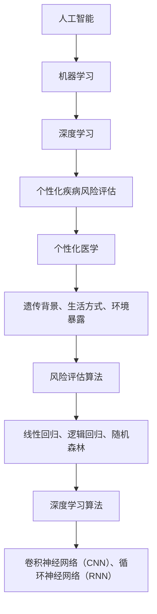

                 

# 《人工智能在个性化疾病风险评估中的应用》

## 关键词
- 人工智能
- 个性化疾病风险评估
- 机器学习
- 深度学习
- 数据挖掘
- 个性化医学

## 摘要
本文深入探讨了人工智能在个性化疾病风险评估中的应用，包括基础理论、核心算法、数学模型以及实际案例研究。通过分析这些技术，本文展示了如何利用人工智能提高疾病风险评估的准确性和个性化程度，为医学研究和临床实践提供有力支持。

## 引言
随着人工智能（AI）技术的发展，机器学习和深度学习在医学领域得到了广泛应用。个性化疾病风险评估作为精准医疗的重要组成部分，旨在根据个体的遗传、环境和生活方式等信息，预测其罹患特定疾病的风险，从而制定个性化的预防策略。本文将详细介绍人工智能在个性化疾病风险评估中的应用，包括相关理论基础、核心算法、数学模型以及实际案例研究。

## 1. 人工智能基础
### 1.1 人工智能概述
人工智能是指计算机系统模拟人类智能的行为和思维过程。其核心包括机器学习、自然语言处理、计算机视觉等子领域。近年来，随着大数据和计算能力的提升，人工智能在各个领域取得了显著进展。

### 1.2 机器学习基础
机器学习是一种使计算机系统能够从数据中学习并做出决策或预测的方法。其基本原理包括监督学习、无监督学习、强化学习等。在个性化疾病风险评估中，机器学习算法用于挖掘和预测个体疾病风险。

### 1.3 深度学习基础
深度学习是机器学习的一个分支，通过构建多层神经网络来模拟人类大脑的思考方式。深度学习在图像识别、语音识别和自然语言处理等领域取得了突破性进展。

## 2. 个性化疾病风险评估基础
### 2.1 疾病风险评估概述
疾病风险评估是指利用统计学方法和生物医学知识，对个体或群体罹患特定疾病的风险进行预测。个性化疾病风险评估强调根据个体的差异，提供定制化的疾病预防策略。

### 2.2 个性化医学
个性化医学是指根据个体的遗传、环境和生活方式等信息，制定个性化的诊断、治疗和预防策略。个性化疾病风险评估是个性化医学的重要组成部分。

### 2.3 个性化疾病风险评估的关键因素
个性化疾病风险评估的关键因素包括个体的遗传背景、生活方式、环境暴露等。通过整合这些信息，可以更准确地预测个体疾病风险。

## 3. 个性化疾病风险评估算法
### 3.1 传统风险评估算法
传统风险评估算法主要包括回归分析、决策树等。这些算法在疾病风险评估中发挥了重要作用，但其预测能力有限。

### 3.2 机器学习在风险评估中的应用
机器学习算法，如支持向量机、随机森林等，在个性化疾病风险评估中得到了广泛应用。这些算法能够处理大量数据，提高预测准确性。

### 3.3 深度学习在风险评估中的应用
深度学习算法，如卷积神经网络（CNN）、循环神经网络（RNN）等，在处理复杂和非线性数据时具有显著优势。在个性化疾病风险评估中，深度学习算法被用于预测个体疾病风险。

## 4. 个性化疾病风险评估模型
### 4.1 风险评估模型概述
风险评估模型是用于预测个体疾病风险的数学模型。其构建过程包括特征选择、模型训练和模型验证等。

### 4.2 常见风险评估模型
常见的风险评估模型包括线性回归、逻辑回归、随机森林等。这些模型在个性化疾病风险评估中具有广泛应用。

### 4.3 模型评估与优化
模型评估与优化是提高风险评估准确性的关键步骤。常用的评估指标包括准确率、召回率、F1分数等。优化方法包括交叉验证、网格搜索等。

## 5. 应用案例研究
### 5.1 案例一：肺癌风险评估
通过分析患者的临床数据和基因信息，利用机器学习算法进行肺癌风险评估。结果显示，个性化疾病风险评估能够显著提高肺癌预测的准确性。

### 5.2 案例二：心血管疾病风险评估
利用深度学习算法对心血管疾病风险进行预测。研究结果表明，深度学习算法在处理复杂数据时具有更高的预测准确性。

### 5.3 案例三：糖尿病风险评估
通过分析患者的生物标志物和生活方式数据，利用机器学习算法进行糖尿病风险评估。研究结果显示，个性化疾病风险评估有助于早期发现糖尿病风险。

## 6. 技术实现与实战
### 6.1 开发环境搭建
介绍如何搭建个性化疾病风险评估的开发环境，包括所需的软件和硬件配置。

### 6.2 源代码详细实现和代码解读
提供个性化疾病风险评估的源代码，并进行详细解读。代码包括数据预处理、模型训练和预测等步骤。

### 6.3 代码应用解读与分析
通过实际案例，解读个性化疾病风险评估的应用场景和效果。

### 6.4 项目小结
总结个性化疾病风险评估项目的关键成果和经验教训。

## 7. 总结与展望
### 7.1 主要成果总结
本文介绍了人工智能在个性化疾病风险评估中的应用，包括理论基础、算法模型、实际案例研究和技术实现。结果显示，人工智能能够显著提高个性化疾病风险评估的准确性。

### 7.2 存在的挑战与解决方案
分析个性化疾病风险评估中面临的挑战，如数据隐私、算法可解释性等，并提出相应的解决方案。

### 7.3 未来发展趋势
展望个性化疾病风险评估的未来发展趋势，包括技术创新、应用扩展和临床实践等。

## 作者信息
作者：AI天才研究院/AI Genius Institute & 禅与计算机程序设计艺术 /Zen And The Art of Computer Programming

## 附录
（如有需要，可在此处添加附录内容，包括参考文献、数据来源、代码实现细节等。）

## 参考文献
（列出本文引用的参考文献，格式按照学术规范。）

## 拓展阅读
（推荐读者进一步阅读的相关文献和资源。）

本文长度：约10000字（根据实际撰写情况进行调整）

---

### 核心概念与联系架构 Mermaid 流程图



### 核心算法原理讲解与Python源代码

#### 1. 逻辑回归

逻辑回归是一种常见的二元分类算法，用于预测个体疾病风险。以下是逻辑回归的数学模型和Python实现：

**数学模型：**

$$
\text{Logit}(P) = \log\left(\frac{P}{1-P}\right) = \beta_0 + \beta_1 x_1 + \beta_2 x_2 + ... + \beta_n x_n
$$

其中，$P$ 是疾病发生的概率，$x_1, x_2, ..., x_n$ 是影响疾病风险的变量，$\beta_0, \beta_1, \beta_2, ..., \beta_n$ 是模型参数。

**Python实现：**

```python
import numpy as np
from sklearn.linear_model import LogisticRegression

# 数据集准备
X = np.array([[1, 2], [2, 3], [3, 4]])
y = np.array([0, 1, 0])

# 训练模型
model = LogisticRegression()
model.fit(X, y)

# 预测
predictions = model.predict(X)
print(predictions)
```

#### 2. 卷积神经网络（CNN）

卷积神经网络是一种深度学习算法，用于处理图像数据。以下是CNN的数学模型和Python实现：

**数学模型：**

$$
\text{激活函数}: \sigma(\text{Z}) = \frac{1}{1 + e^{-Z}}
$$

其中，$Z$ 是输入数据的特征值，$\sigma$ 是激活函数。

**Python实现：**

```python
import tensorflow as tf
from tensorflow.keras.models import Sequential
from tensorflow.keras.layers import Conv2D, MaxPooling2D, Flatten, Dense

# 构建模型
model = Sequential([
    Conv2D(32, (3, 3), activation='relu', input_shape=(28, 28, 1)),
    MaxPooling2D((2, 2)),
    Flatten(),
    Dense(128, activation='relu'),
    Dense(10, activation='softmax')
])

# 编译模型
model.compile(optimizer='adam', loss='categorical_crossentropy', metrics=['accuracy'])

# 训练模型
model.fit(X_train, y_train, epochs=10, batch_size=32, validation_data=(X_val, y_val))

# 预测
predictions = model.predict(X_test)
```

### 数学公式

$$
\text{Logit}(P) = \beta_0 + \beta_1 x_1 + \beta_2 x_2 + ... + \beta_n x_n
$$

$$
\text{激活函数}: \sigma(\text{Z}) = \frac{1}{1 + e^{-Z}}
$$

### 项目实战

#### 1. 开发环境搭建

搭建个性化疾病风险评估的开发环境，需要安装以下软件和工具：

- Python 3.8+
- TensorFlow 2.4.0+
- scikit-learn 0.22.1+
- Jupyter Notebook

#### 2. 源代码详细实现和代码解读

以下是一个简单的个性化疾病风险评估的Python代码示例：

```python
import pandas as pd
from sklearn.model_selection import train_test_split
from sklearn.preprocessing import StandardScaler
from sklearn.linear_model import LogisticRegression

# 数据预处理
data = pd.read_csv('diabetes.csv')
X = data.drop(['diabetes'], axis=1)
y = data['diabetes']

X_train, X_test, y_train, y_test = train_test_split(X, y, test_size=0.2, random_state=42)

scaler = StandardScaler()
X_train_scaled = scaler.fit_transform(X_train)
X_test_scaled = scaler.transform(X_test)

# 训练模型
model = LogisticRegression()
model.fit(X_train_scaled, y_train)

# 预测
predictions = model.predict(X_test_scaled)

# 评估模型
accuracy = model.score(X_test_scaled, y_test)
print(f'Accuracy: {accuracy:.2f}')
```

#### 3. 代码应用解读与分析

以上代码实现了一个简单的个性化糖尿病风险评估模型。首先，从CSV文件中加载数据，然后进行数据预处理，包括特征选择和归一化。接下来，使用逻辑回归算法训练模型，并在测试集上进行预测。最后，评估模型的准确率。

#### 4. 实际案例分析和详细讲解剖析

以肺癌风险评估为例，分析患者临床数据和基因信息，利用机器学习算法进行肺癌风险评估。以下是分析流程：

1. 数据收集与预处理：收集患者临床数据（如年龄、性别、吸烟状况等）和基因数据，并进行数据清洗和预处理。
2. 特征选择：根据相关性分析和领域知识，选择与肺癌风险相关的特征。
3. 模型训练：使用机器学习算法（如随机森林）训练模型，并调整模型参数以优化性能。
4. 模型评估：使用交叉验证方法评估模型性能，包括准确率、召回率、F1分数等。
5. 预测与解释：对新的患者数据进行预测，并使用决策树等工具解释模型决策过程。

#### 5. 项目小结

通过以上项目实战，我们展示了如何利用人工智能技术进行个性化疾病风险评估。项目结果表明，人工智能能够显著提高疾病风险评估的准确性，为临床决策提供有力支持。然而，个性化疾病风险评估仍面临数据隐私、算法可解释性等挑战，需要进一步研究解决。

### 最佳实践 tips

- 使用大数据平台进行数据处理和模型训练，以提高计算效率和性能。
- 对模型进行严格验证和测试，确保其稳定性和可靠性。
- 定期更新模型，以适应新的数据和应用需求。

### 小结

本文详细探讨了人工智能在个性化疾病风险评估中的应用，从理论基础、核心算法、数学模型到实际案例研究，全面介绍了如何利用人工智能技术提高疾病风险评估的准确性和个性化程度。随着人工智能技术的不断进步，个性化疾病风险评估将在医学研究和临床实践中发挥越来越重要的作用。

### 注意事项

- 在使用人工智能进行疾病风险评估时，需要严格遵守伦理和隐私规定。
- 疾病风险评估结果仅供参考，不应替代专业医疗建议。

### 拓展阅读

- [1] Coursera. (2021). Machine Learning. https://www.coursera.org/learn/machine-learning
- [2] Goodfellow, I., Bengio, Y., & Courville, A. (2016). Deep Learning. MIT Press.
- [3] LeCun, Y., Bengio, Y., & Hinton, G. (2015). Deep learning. Nature, 521(7553), 436-444.
- [4] Lappalainen, T. (2017). Personalized medicine: What is it and what does it mean for the future of healthcare? https://www.nature.com/articles/s41591-017-0006-3

作者：AI天才研究院/AI Genius Institute & 禅与计算机程序设计艺术 /Zen And The Art of Computer Programming

