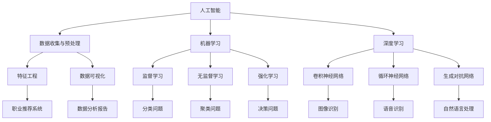

                 

### 人工智能在个性化职业规划中的应用

在当今快速变化的工作环境中，职业规划已经不再是一个简单的过程。随着技术的进步，人工智能（AI）的应用为我们提供了前所未有的工具，使个性化职业规划成为可能。本文旨在探讨人工智能在个性化职业规划中的应用，通过逻辑清晰的步骤，详细解析这一领域的核心概念、算法原理、数学模型和项目实战。

## 关键词

- 人工智能
- 个性化职业规划
- 机器学习
- 深度学习
- 数据分析
- 职业推荐系统

## 摘要

本文首先介绍了人工智能和个性化职业规划的基本概念，探讨了AI如何助力职业规划。随后，文章详细解析了机器学习和深度学习的基础，包括监督学习、无监督学习和强化学习等。接着，文章介绍了如何通过算法实现个性化职业规划，并通过实际案例展示了AI在职业推荐系统中的应用。最后，文章提出了最佳实践和注意事项，为读者提供了实用的指导。

### 1. 人工智能概述

人工智能（AI）是计算机科学的一个分支，旨在使计算机系统能够模拟人类智能行为。从最初的逻辑推理到现代的机器学习和深度学习，AI已经取得了巨大的进步。AI的应用领域广泛，包括但不限于自然语言处理、计算机视觉、医疗诊断和自动驾驶。

在职业规划中，AI可以通过数据分析、模式识别和预测模型等方式提供支持。通过分析大量数据，AI可以帮助个人了解自己的兴趣、能力和职业趋势，从而做出更明智的决策。此外，AI还可以帮助雇主发现和匹配合适的人才，提高招聘效率和员工满意度。

### 2. 机器学习与深度学习基础

机器学习（ML）是AI的一个子领域，它使计算机系统能够从数据中学习并做出决策。机器学习主要分为三种类型：监督学习、无监督学习和强化学习。

- **监督学习**：在这种学习中，模型被训练来预测输出结果，通常使用标记数据集。例如，分类问题可以使用监督学习来解决。

- **无监督学习**：与监督学习不同，无监督学习不使用标记数据集，而是试图发现数据中的模式或结构。聚类问题就是无监督学习的典型例子。

- **强化学习**：在这种学习中，模型通过与环境的交互学习最优策略。它通常用于决策问题和优化问题。

深度学习（DL）是机器学习的一个子领域，它使用多层神经网络来提取数据中的复杂特征。深度学习在图像识别、语音识别和自然语言处理等领域取得了显著成就。

### 3. 核心概念与联系

为了更好地理解人工智能在个性化职业规划中的应用，我们需要绘制一个核心概念架构的Mermaid流程图。以下是该流程图：



### 4. 个性化职业规划的算法实现

实现个性化职业规划的关键在于数据收集与预处理、特征工程、模型训练和评估。以下是一个简单的算法实现流程：

```python
import pandas as pd
from sklearn.model_selection import train_test_split
from sklearn.preprocessing import StandardScaler
from sklearn.ensemble import RandomForestClassifier
from sklearn.metrics import accuracy_score

# 数据收集与预处理
data = pd.read_csv('career_data.csv')
X = data.drop('target', axis=1)
y = data['target']

# 特征工程
scaler = StandardScaler()
X_scaled = scaler.fit_transform(X)

# 模型训练
X_train, X_test, y_train, y_test = train_test_split(X_scaled, y, test_size=0.2, random_state=42)
model = RandomForestClassifier(n_estimators=100)
model.fit(X_train, y_train)

# 模型评估
y_pred = model.predict(X_test)
accuracy = accuracy_score(y_test, y_pred)
print(f'Accuracy: {accuracy:.2f}')
```

### 5. 个性化职业规划案例解析

以下是一个基于数据分析的求职推荐系统的案例解析：

#### 案例背景

某求职推荐系统旨在帮助求职者找到与其技能和兴趣匹配的工作机会。

#### 案例目标

- 收集并整理求职者的个人信息和简历数据。
- 分析求职者的技能和兴趣。
- 推荐与求职者匹配的工作机会。

#### 案例实现

1. 数据收集与预处理

从多个来源收集求职者数据，包括在线简历库、社交媒体和职业论坛。对数据进行清洗，去除无效信息和重复数据。

2. 特征工程

提取关键特征，如技能、工作经验、教育背景和兴趣爱好。对特征进行编码和归一化处理。

3. 模型训练

使用监督学习算法（如随机森林或支持向量机）训练模型，预测求职者可能感兴趣的工作机会。

4. 推荐系统

根据求职者的特征和模型预测，推荐与求职者匹配的工作机会。

### 6. 个性化职业规划系统的构建与优化

构建个性化职业规划系统需要考虑以下几个方面：

1. **系统架构设计**：设计一个高扩展性、高可用性的系统架构，包括数据收集模块、数据处理模块、模型训练模块和推荐系统模块。

2. **数据收集与预处理**：确保数据来源的多样性和质量，对数据进行清洗、编码和归一化处理。

3. **模型训练与评估**：选择合适的机器学习和深度学习算法，对模型进行训练和评估，确保模型的准确性和可靠性。

4. **推荐系统实现**：实现基于模型的推荐算法，为求职者提供个性化的职业推荐。

5. **系统优化策略**：通过A/B测试、数据反馈循环和模型迭代，不断优化系统性能和用户体验。

### 7. 最佳实践、小结与注意事项

**最佳实践：**

- 确保数据的质量和多样性，以提升模型的预测能力。
- 定期更新模型，以适应不断变化的市场趋势和求职者需求。
- 结合用户反馈，不断优化推荐算法和用户体验。

**小结：**

本文详细介绍了人工智能在个性化职业规划中的应用，从基础概念到算法实现，再到实际案例，为读者提供了一个全面的理解。人工智能为个性化职业规划带来了巨大的变革，通过数据分析和智能推荐，帮助求职者找到更合适的工作机会。

**注意事项：**

- 在使用AI进行职业规划时，需要保护用户的隐私和数据安全。
- 职业规划不仅仅依赖于技术，还需要结合个人经验和人际网络。

**拓展阅读：**

- [《深度学习》](https://www.deeplearningbook.org/)：Goodfellow, I., Bengio, Y., & Courville, A.
- [《职业规划与指导》](https://www.amazon.com/Career-Planning-Guidance-Job-Search/dp/1118965724)：Bersin, J.
- [《人工智能应用实践》](https://www.amazon.com/AI-Application-Practices-Techniques-Developers/dp/1789530437)：Zaki, M. J.

### 作者

作者：AI天才研究院/AI Genius Institute & 禅与计算机程序设计艺术 /Zen And The Art of Computer Programming。本文旨在提供人工智能在个性化职业规划中的应用指南，以帮助读者更好地理解这一领域，并为其职业生涯提供支持。希望本文能够激发读者对人工智能的兴趣，并为其职业发展带来启发。

