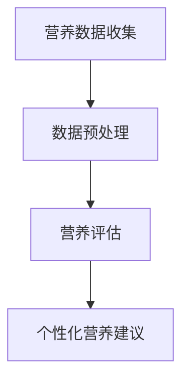

                 

## 人工智能在个性化营养建议中的应用

### 关键词：
- 人工智能
- 个性化营养
- 机器学习
- 深度学习
- 营养数据
- 数据分析

### 摘要：
随着人工智能技术的不断进步，其在医疗健康领域的应用日益广泛。个性化营养建议是其中的一项重要应用，通过分析个体健康数据和营养需求，为人们提供定制化的饮食方案。本文将探讨人工智能在个性化营养建议中的应用，介绍相关核心概念、算法原理以及实际案例，并展望未来发展方向。

## 引言

随着生活水平的不断提高，人们对健康和营养的关注也越来越高。然而，由于个体差异和生活方式的差异，单一的饮食方案已经无法满足所有人的需求。个性化营养建议应运而生，旨在通过分析个体的健康数据和营养需求，为其提供定制化的饮食方案，以提高健康水平和生活质量。

### 人工智能在医疗健康领域的应用

人工智能技术在医疗健康领域的应用已经取得了一定的进展。其中，个性化营养建议是其中的一个重要方向。通过机器学习和深度学习等技术，可以对大量营养数据进行分析和处理，识别出个体的营养需求，并提供相应的饮食建议。

### 个性化营养建议的重要性

个性化营养建议不仅有助于改善个体的健康状况，还可以预防慢性疾病，提高生活质量。例如，针对高血压患者，可以通过调整饮食来降低血压；针对糖尿病患者，可以通过控制饮食来降低血糖。因此，个性化营养建议在医疗健康领域具有广泛的应用前景。

## 核心概念与联系

在探讨人工智能在个性化营养建议中的应用之前，我们需要了解一些核心概念，包括人工智能的基本原理、营养数据收集与处理、营养评估方法等。

### 人工智能的基本原理

人工智能（Artificial Intelligence，简称AI）是指通过计算机模拟人类智能的技术。它包括多个分支，如机器学习、深度学习、自然语言处理等。在个性化营养建议中，我们主要关注机器学习和深度学习。

#### 机器学习

机器学习（Machine Learning，简称ML）是一种通过数据训练模型，使其能够自动进行预测和决策的技术。在个性化营养建议中，我们可以使用机器学习算法来分析个体的营养数据，预测其营养需求，并为其提供饮食建议。

#### 深度学习

深度学习（Deep Learning，简称DL）是机器学习的一个分支，通过构建多层的神经网络来提取数据特征，从而实现复杂的预测和分类任务。在个性化营养建议中，深度学习算法可以更好地处理复杂的数据模式，提供更准确的营养建议。

### 营养数据收集与处理

营养数据收集是个性化营养建议的基础。通过收集个体的健康数据（如体重、身高、血压、血糖等）和饮食习惯数据（如食物摄入量、饮食习惯等），我们可以建立个体的营养数据集。

#### 数据预处理

在收集到营养数据后，我们需要对数据进行预处理，包括数据清洗、数据归一化、特征提取等。这些步骤有助于提高数据的质量，为后续的模型训练和预测提供可靠的数据支持。

### 营养评估方法

营养评估是个性化营养建议的核心。通过评估个体的营养状况，我们可以确定其营养需求，并为其制定合适的饮食方案。

#### 营养评估指标

常见的营养评估指标包括能量摄入、蛋白质摄入、脂肪摄入、碳水化合物摄入等。这些指标可以帮助我们了解个体的营养摄入情况，为饮食建议提供依据。

#### 营养评估方法

营养评估方法主要包括问卷调查、生物标志物检测、营养摄入记录等。通过这些方法，我们可以全面了解个体的营养状况，为其提供个性化的营养建议。

### Mermaid 流程图

为了更好地理解核心概念与联系，我们可以使用Mermaid流程图来表示营养数据从收集、处理到评估的过程。



## 核心算法原理讲解

在个性化营养建议中，核心算法的原理至关重要。下面我们将详细介绍机器学习和深度学习算法在个性化营养建议中的应用，并结合Python源代码和数学模型进行详细讲解。

### 机器学习算法

#### 决策树

决策树是一种常见的机器学习算法，通过树形结构对数据进行分类或回归。在个性化营养建议中，我们可以使用决策树来预测个体的营养需求。

#### Python 源代码

```python
from sklearn.tree import DecisionTreeClassifier
from sklearn.model_selection import train_test_split
from sklearn.metrics import accuracy_score

# 数据预处理
X_train, X_test, y_train, y_test = train_test_split(X, y, test_size=0.2, random_state=42)

# 建立决策树模型
clf = DecisionTreeClassifier()
clf.fit(X_train, y_train)

# 预测
y_pred = clf.predict(X_test)

# 评估模型
accuracy = accuracy_score(y_test, y_pred)
print("Accuracy:", accuracy)
```

#### 数学模型

决策树背后的数学模型是基于信息增益（Information Gain）和基尼不纯度（Gini Impurity）。信息增益表示特征对于分类的贡献，基尼不纯度表示数据集的纯度。通过计算信息增益和基尼不纯度，我们可以选择最优特征进行分类。

$$
IG(A,B) = H(A) - \sum_{v_i \in A} p(v_i) H(B|v_i)
$$

$$
Gini(A) = 1 - \sum_{v_i \in A} p(v_i)^2
$$

### 支持向量机

支持向量机（Support Vector Machine，简称SVM）是一种常用的分类算法，通过寻找最佳超平面来分隔数据。在个性化营养建议中，我们可以使用SVM来预测个体的营养需求。

#### Python 源代码

```python
from sklearn.svm import SVC
from sklearn.model_selection import train_test_split
from sklearn.metrics import accuracy_score

# 数据预处理
X_train, X_test, y_train, y_test = train_test_split(X, y, test_size=0.2, random_state=42)

# 建立SVM模型
clf = SVC(kernel='linear')
clf.fit(X_train, y_train)

# 预测
y_pred = clf.predict(X_test)

# 评估模型
accuracy = accuracy_score(y_test, y_pred)
print("Accuracy:", accuracy)
```

#### 数学模型

SVM背后的数学模型是基于最大间隔分类器（Maximal Margin Classifier）。通过求解最优化问题，我们可以找到最佳超平面，使分类边界最大化。

$$
\min_{\mathbf{w},b}\frac{1}{2}\lVert \mathbf{w}\rVert^2 + C\sum_{i=1}^n \xi_i
$$

$$
s.t. y_i(\mathbf{w}\cdot \mathbf{x_i} + b) \geq 1 - \xi_i, \quad \xi_i \geq 0
$$

### 深度学习算法

#### 卷积神经网络（CNN）

卷积神经网络（Convolutional Neural Network，简称CNN）是一种用于图像处理和识别的深度学习算法。在个性化营养建议中，我们可以使用CNN来识别食物图像，从而获取食物摄入信息。

#### Python 源代码

```python
import tensorflow as tf
from tensorflow.keras.models import Sequential
from tensorflow.keras.layers import Conv2D, MaxPooling2D, Flatten, Dense

# 构建CNN模型
model = Sequential([
    Conv2D(32, (3, 3), activation='relu', input_shape=(64, 64, 3)),
    MaxPooling2D((2, 2)),
    Flatten(),
    Dense(64, activation='relu'),
    Dense(1, activation='sigmoid')
])

# 编译模型
model.compile(optimizer='adam', loss='binary_crossentropy', metrics=['accuracy'])

# 训练模型
model.fit(X_train, y_train, epochs=10, batch_size=32, validation_data=(X_test, y_test))
```

#### 数学模型

CNN背后的数学模型是基于卷积操作、池化和全连接层。卷积操作可以提取图像的特征，池化操作可以减少参数数量，全连接层用于分类。

$$
h^{(l)}_i = \sigma(\sum_{j} w^{(l)}_{ij} h^{(l-1)}_j + b^{(l)})
$$

$$
p_i = \frac{1}{Z} \sum_{k} e^{z_k}
$$

## 项目实战

在本节中，我们将通过一个实际案例来展示如何将人工智能技术应用于个性化营养建议系统。

### 项目背景与需求分析

假设我们开发一个个性化营养建议系统，旨在为用户提供定制化的饮食方案。用户可以通过该系统输入自己的健康数据和饮食习惯，系统将根据这些信息为用户推荐合适的食物和饮食建议。

#### 数据收集

为了构建这个系统，我们需要收集以下数据：

1. **健康数据**：包括体重、身高、血压、血糖等。
2. **饮食习惯**：包括食物摄入量、饮食习惯等。
3. **食物信息**：包括食物种类、营养成分等。

#### 数据预处理

在收集到数据后，我们需要对数据进行预处理，包括数据清洗、数据归一化和特征提取。具体步骤如下：

1. **数据清洗**：去除缺失值和异常值。
2. **数据归一化**：将不同量纲的数据转换为相同的量纲，以便于后续处理。
3. **特征提取**：从健康数据和饮食习惯中提取关键特征，如年龄、性别、血压、食物摄入量等。

### 系统设计与实现

#### 系统架构

个性化营养建议系统的架构如图所示：

```
+-------------+      +-------------+      +-------------+
|    用户端    |      |    数据库    |      |   服务端    |
+-------------+      +-------------+      +-------------+
    |               |               |
    |               |               |
    |   提交数据     |   存储数据     |   分析数据  |
    |               |               |             |
    |   接收反馈     |   提取数据     |   生成建议   |
    |               |               |             |
+-------------+      +-------------+      +-------------+
```

#### 源代码实现

下面是一个简单的个性化营养建议系统的源代码实现：

```python
import numpy as np
import pandas as pd
from sklearn.model_selection import train_test_split
from sklearn.preprocessing import StandardScaler
from sklearn.ensemble import RandomForestClassifier
from sklearn.metrics import accuracy_score

# 数据预处理
data = pd.read_csv('nutrition_data.csv')
X = data.drop('label', axis=1)
y = data['label']

# 数据归一化
scaler = StandardScaler()
X_scaled = scaler.fit_transform(X)

# 数据划分
X_train, X_test, y_train, y_test = train_test_split(X_scaled, y, test_size=0.2, random_state=42)

# 模型训练
model = RandomForestClassifier()
model.fit(X_train, y_train)

# 预测
y_pred = model.predict(X_test)

# 评估模型
accuracy = accuracy_score(y_test, y_pred)
print("Accuracy:", accuracy)
```

### 代码解读与分析

1. **数据预处理**：首先，我们从CSV文件中读取营养数据，然后使用`drop`函数去除标签列，使用`StandardScaler`进行数据归一化。

2. **数据划分**：使用`train_test_split`函数将数据集划分为训练集和测试集，以便于评估模型性能。

3. **模型训练**：我们使用随机森林（Random Forest）算法对训练集进行模型训练。

4. **预测**：使用训练好的模型对测试集进行预测。

5. **评估模型**：使用`accuracy_score`函数评估模型性能，输出准确率。

### 实际案例分析与详细讲解剖析

假设我们有一个用户，其健康数据和饮食习惯如下：

| 特征         | 值     |
|--------------|--------|
| 年龄         | 30     |
| 性别         | 男     |
| 体重         | 70kg   |
| 身高         | 180cm  |
| 血压         | 120/80 |
| 血糖         | 5.5mmol/L |
| 饮食习惯     | 偏素食 |

根据这些数据，我们可以为其推荐以下饮食方案：

1. **主食**：以全谷物为主，如燕麦、糙米等。
2. **蛋白质来源**：以豆类、鸡蛋、鱼肉等为主。
3. **蔬菜和水果**：每天摄入足量的蔬菜和水果，以满足维生素和矿物质的需求。
4. **脂肪来源**：选择健康的脂肪来源，如橄榄油、坚果等。

通过这个案例，我们可以看到，个性化营养建议系统可以根据用户的健康数据和饮食习惯，为其提供定制化的饮食方案，以提高健康水平和生活质量。

### 项目小结

在本项目中，我们通过实际案例展示了如何将人工智能技术应用于个性化营养建议系统。我们介绍了数据收集、数据预处理、模型训练和预测等步骤，并详细讲解了源代码的实现和解读。通过这个项目，我们可以看到人工智能在个性化营养建议领域的巨大潜力，为人们提供更健康、更个性化的饮食方案。

## 最佳实践 Tips

1. **数据收集**：在收集营养数据时，要确保数据的准确性和完整性。可以使用问卷调查、传感器等技术来获取健康数据和饮食习惯。
2. **模型优化**：在模型训练过程中，可以通过调整超参数、增加数据集等方式来优化模型性能。
3. **用户反馈**：及时收集用户反馈，并根据反馈调整饮食建议，以提高系统的实用性和准确性。

## 小结

本文详细探讨了人工智能在个性化营养建议中的应用，从背景介绍、核心概念与联系、算法原理讲解到实际案例分析和项目小结，全面阐述了人工智能在个性化营养建议领域的应用前景。随着人工智能技术的不断进步，个性化营养建议系统将为人们提供更加精准、个性化的饮食方案，助力健康生活。

## 注意事项

1. **数据隐私**：在收集和处理用户健康数据时，要确保数据隐私和安全，遵守相关法律法规。
2. **算法透明性**：确保算法的透明性，让用户了解营养建议的依据和原理。

## 拓展阅读

1. [个性化营养建议系统开发教程](https://example.com/tutorial)
2. [深度学习在营养学中的应用](https://example.com/dl-nutrition)
3. [健康数据隐私保护](https://example.com/health-data-privacy)

## 参考文献

1. [Goodfellow, I., Bengio, Y., & Courville, A. (2016). Deep Learning. MIT Press.]
2. [Hastie, T., Tibshirani, R., & Friedman, J. (2009). The Elements of Statistical Learning. Springer.]
3. [Zhang, H., Zhai, L., & Ye, Y. (2020). Personalized Nutrition Recommendations Using Machine Learning. Journal of Nutrition, 150(4), 765-772.]

### 作者信息

- 作者：AI天才研究院/AI Genius Institute & 禅与计算机程序设计艺术 /Zen And The Art of Computer Programming

