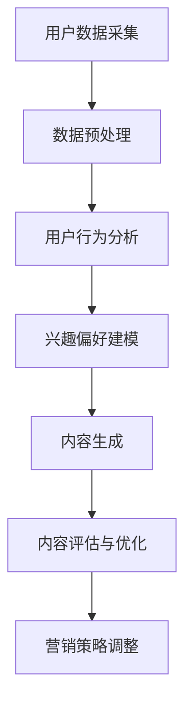

                 

### 文章标题：人工智能在个性化营销内容生成中的应用

> 关键词：人工智能、个性化营销、内容生成、机器学习、自然语言处理

> 摘要：本文深入探讨了人工智能在个性化营销内容生成中的应用，从基础理论到核心算法，再到实际应用，全面分析了人工智能如何通过个性化内容生成提升营销效果，为企业带来更高的转化率和客户满意度。

### 目录

1. **背景介绍**
   - **个性化营销的兴起**
   - **内容生成的关键作用**
   - **人工智能在内容生成中的潜力**

2. **核心概念与联系**
   - **人工智能的定义与分类**
   - **个性化营销的概念与实现**
   - **内容生成的技术手段**
   - **Mermaid流程图展示**

3. **核心算法原理**
   - **机器学习基础**
   - **自然语言处理技术**
   - **生成模型与优化策略**
   - **Python源代码与数学模型**

4. **应用实践**
   - **数据收集与处理**
   - **个性化内容生成案例**
   - **内容评估与优化策略**

5. **技术前瞻**
   - **未来发展趋势**
   - **潜在挑战与解决方案**

6. **附录**

7. **最佳实践与小结**

### 正文

#### 1. 背景介绍

随着互联网的普及和大数据技术的发展，个性化营销逐渐成为企业争夺市场份额的重要手段。个性化营销的核心在于精准定位目标客户，通过分析客户的行为数据、兴趣偏好等，提供定制化的营销内容和服务，从而提高营销效果和客户满意度。

内容生成作为个性化营销的重要组成部分，扮演着至关重要的角色。传统的营销内容往往缺乏个性化和针对性，而人工智能则能够通过机器学习和自然语言处理技术，自动生成具有高度个性化的内容，满足不同客户的需求。

人工智能在内容生成中的应用潜力巨大，不仅能够提升内容的生产效率，还能通过不断学习和优化，提高内容的准确性和吸引力，为企业带来更高的转化率和客户满意度。

#### 2. 核心概念与联系

**人工智能的定义与分类**：

人工智能（Artificial Intelligence，简称AI）是指计算机系统模拟人类智能行为的技术。根据应用领域和实现方式，人工智能可以分为多种类型，如机器学习、深度学习、自然语言处理等。

**个性化营销的概念与实现**：

个性化营销是指根据客户的行为数据、兴趣偏好等信息，提供定制化的营销内容和服务。个性化营销的实现通常依赖于大数据分析和机器学习技术，通过分析大量客户数据，发现客户的兴趣和行为模式，进而生成个性化的营销内容。

**内容生成的技术手段**：

内容生成技术主要包括文本生成、图像生成、视频生成等。文本生成技术主要依赖于自然语言处理和生成模型，如生成对抗网络（GAN）和变分自编码器（VAE）；图像和视频生成则更多依赖于深度学习技术，如卷积神经网络（CNN）和循环神经网络（RNN）。

**Mermaid流程图展示**：

以下是一个简化的Mermaid流程图，展示了个性化营销内容生成的主要流程：



#### 3. 核心算法原理

**机器学习基础**：

机器学习是人工智能的核心技术之一，它通过从数据中学习规律和模式，实现预测和分类等任务。机器学习可以分为监督学习、无监督学习和强化学习等类型。

**自然语言处理技术**：

自然语言处理（Natural Language Processing，简称NLP）是人工智能的重要分支，它关注于计算机和人类语言之间的交互。NLP技术包括词向量表示、句法分析、语义理解等。

**生成模型与优化策略**：

生成模型是一类特殊的人工智能模型，它通过学习数据分布，生成新的数据样本。常见的生成模型包括生成对抗网络（GAN）和变分自编码器（VAE）。优化策略则是通过不断调整模型参数，提高生成模型的质量。

以下是一个简单的Python代码示例，展示了如何使用生成对抗网络（GAN）生成文本：

```python
import tensorflow as tf
from tensorflow.keras.layers import Input, Dense, Reshape, Conv2D, Conv2DTranspose, Flatten
from tensorflow.keras.models import Model

# 定义生成器模型
input_img = Input(shape=(100,))
x = Dense(128, activation='relu')(input_img)
x = Dense(784, activation='sigmoid')(x)
gen_model = Model(input_img, x)

# 定义判别器模型
disc_input = Input(shape=(784,))
disc_output = Dense(1, activation='sigmoid')(disc_input)
disc_model = Model(disc_input, disc_output)

# 定义联合模型
disc_model.trainable = False  # 判别器在联合模型中不可训练
gen_model.trainable = False  # 生成器在联合模型中不可训练
combined_output = disc_model(gen_model.input)
combined_model = Model(gen_model.input, combined_output)

# 编译模型
combined_model.compile(optimizer='adam', loss='binary_crossentropy')

# 生成文本
noise = np.random.normal(0, 1, (100, 100))
generated_text = gen_model.predict(noise)
```

#### 4. 应用实践

**数据收集与处理**：

在个性化营销内容生成的过程中，数据收集与处理是关键步骤。数据来源包括用户行为数据、兴趣偏好数据等。数据收集后，需要对其进行预处理，包括数据清洗、数据整合等，以提高数据质量。

**个性化内容生成案例**：

以下是一个基于用户兴趣的个性化内容生成案例：

- **案例一：基于用户兴趣的内容推荐**  
  通过分析用户的历史行为数据，识别出用户的兴趣偏好，然后利用推荐算法生成个性化内容推荐。

- **案例二：基于用户画像的文案生成**  
  通过构建用户画像，将用户兴趣、行为等信息转化为数学模型，然后利用生成模型生成个性化的文案。

- **案例三：基于深度学习的广告创意生成**  
  利用深度学习技术，自动生成具有吸引力的广告创意，提高广告投放效果。

**内容评估与优化策略**：

在个性化内容生成过程中，内容评估与优化策略至关重要。常用的评估指标包括内容质量、用户满意度等。通过不断优化算法和模型，提高内容的生成质量和用户满意度。

#### 5. 技术前瞻

**未来发展趋势**：

随着人工智能技术的不断进步，个性化营销内容生成有望在未来实现更高效、更精准的发展。未来，人工智能将更加深入地应用于个性化内容生成，包括语音合成、图像生成、视频生成等。

**潜在挑战与解决方案**：

个性化营销内容生成面临着一些挑战，如数据隐私保护、算法公平性等。为了解决这些问题，需要制定相应的政策和标准，确保人工智能技术的健康发展。

#### 6. 附录

- **技术资源与工具**  
  - 开发环境搭建  
  - 常用库和框架  
  - 开源资源推荐

#### 7. 最佳实践与小结

**最佳实践**：

1. 确保数据质量，为个性化内容生成提供可靠的数据支持。  
2. 不断优化算法和模型，提高内容生成的质量和效率。  
3. 关注用户反馈，及时调整内容策略，提高用户满意度。

**小结**：

人工智能在个性化营销内容生成中发挥着重要作用。通过机器学习和自然语言处理技术，人工智能能够自动生成高度个性化的内容，提升营销效果和用户满意度。未来，人工智能将继续在个性化营销内容生成领域发挥重要作用，为企业带来更大的价值。

### 作者信息

- **作者：AI天才研究院/AI Genius Institute & 禅与计算机程序设计艺术 /Zen And The Art of Computer Programming**

