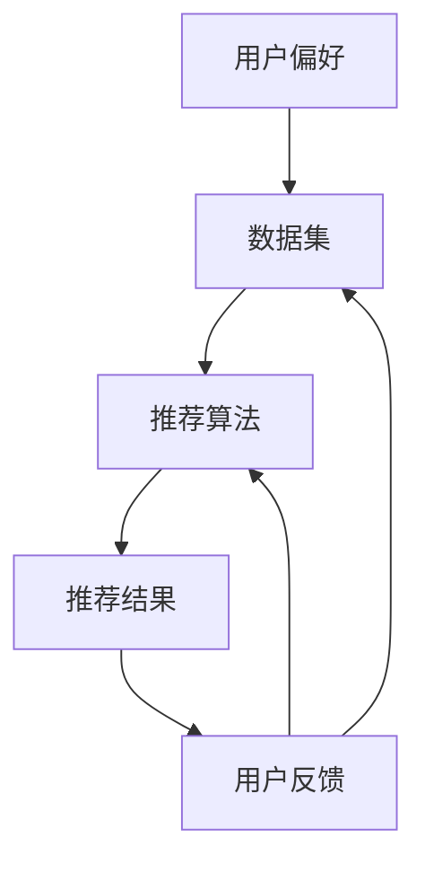

                 

### 文章标题

# 人工智能在个性化饮食推荐中的应用

### 关键词

- 人工智能
- 个性化饮食推荐
- 机器学习
- 深度学习
- 协同过滤
- 基于内容的推荐

### 摘要

本文探讨了人工智能在个性化饮食推荐中的应用，介绍了个性化饮食推荐的基本概念、算法原理以及实际应用案例。通过对人工智能技术的深入剖析，本文详细解释了如何利用机器学习和深度学习技术来实现个性化饮食推荐系统，从而帮助用户发现满足其特定需求和偏好的饮食方案。文章还讨论了个性化饮食推荐面临的挑战以及解决方案，最后给出了开发此类系统的最佳实践和建议。

---

## 引言

在当今快节奏的社会中，人们对饮食健康和营养的关注日益增加。然而，由于个体差异、生活方式、健康状况和地域文化等多种因素的影响，每个人的饮食需求都不尽相同。传统的饮食推荐方法往往无法准确捕捉用户的个性化需求，导致推荐结果不理想。随着人工智能技术的快速发展，尤其是机器学习和深度学习技术的应用，个性化饮食推荐系统逐渐成为可能。本文旨在探讨人工智能在个性化饮食推荐中的应用，解析其背后的技术原理，并分享实际应用案例和最佳实践。

### 人工智能与个性化饮食推荐

#### 人工智能的基本概念

人工智能（Artificial Intelligence，简称AI）是指通过计算机程序实现人类智能的技术。AI的主要目标是使计算机能够模拟、扩展和增强人类智能，实现诸如感知、推理、学习、决策等复杂任务。AI可以分为两大类：弱人工智能和强人工智能。弱人工智能专注于特定任务，如语音识别、图像识别等；强人工智能则具有广泛的理解能力和自主决策能力。

#### 个性化饮食推荐的基本概念

个性化饮食推荐是指根据用户的个人需求、偏好、健康状况等信息，为其提供定制化的饮食建议。这种推荐系统不仅要考虑用户的当前状态，还要预测其未来可能的需求。个性化饮食推荐的核心是理解用户的个性化需求，并通过数据分析和算法优化，实现推荐结果的精准度和有效性。

#### 人工智能在个性化饮食推荐中的应用

人工智能在个性化饮食推荐中的应用主要体现在以下几个方面：

1. **数据采集与处理**：通过传感器、用户调查、第三方数据源等多种方式，收集用户的饮食数据，如饮食习惯、健康状况、营养需求等。然后，对这些数据进行清洗、整合和分析，为个性化推荐提供基础数据支持。

2. **用户建模**：利用机器学习和深度学习算法，建立用户画像，包括年龄、性别、身高、体重、运动习惯等基本信息，以及饮食习惯、口味偏好、健康状况等动态信息。

3. **推荐算法**：基于协同过滤、基于内容的推荐、混合推荐等多种算法，为用户生成个性化的饮食推荐。这些算法可以根据用户的偏好、历史数据和其他用户的行为，预测用户可能感兴趣的饮食方案。

4. **持续优化**：通过在线学习、模型更新等技术手段，不断优化推荐算法，提高推荐系统的准确性和用户体验。

### 个性化饮食推荐的核心概念与联系

#### 核心概念

1. **用户偏好**：用户对饮食的喜好和需求，包括口味、营养需求、健康状况等。
2. **数据集**：用于训练和评估推荐系统的数据，包括用户的历史行为数据、饮食记录、健康状况等。
3. **推荐算法**：用于生成个性化推荐的核心算法，包括协同过滤、基于内容的推荐、混合推荐等。
4. **推荐结果**：根据用户偏好和推荐算法生成的个性化饮食推荐。

#### 概念实体之间的关系架构 Mermaid 流程图



### 个性化饮食推荐算法原理

#### 协同过滤

协同过滤（Collaborative Filtering）是一种常见的推荐算法，其核心思想是基于用户之间的相似性进行推荐。协同过滤可以分为两种类型：基于用户的协同过滤（User-Based）和基于项目的协同过滤（Item-Based）。

1. **基于用户的协同过滤**：该方法首先计算用户之间的相似度，然后根据相似度找到与目标用户最相似的邻居用户，最后从邻居用户的评价中预测目标用户的评价。

2. **基于项目的协同过滤**：该方法首先计算项目之间的相似度，然后根据相似度找到与目标项目最相似的项目，最后从相似项目的用户评价中预测目标项目的评价。

#### 基于内容的推荐

基于内容的推荐（Content-Based Recommendation）是一种基于物品属性的推荐方法。该方法首先提取物品的特征信息，然后根据用户的历史行为和偏好，找到与用户兴趣相似的物品进行推荐。

1. **特征提取**：从物品中提取关键特征，如食物的营养成分、口味、烹饪方式等。

2. **相似度计算**：计算用户和物品之间的相似度，通常使用余弦相似度、Jaccard相似度等方法。

3. **推荐生成**：根据相似度计算结果，为用户生成个性化的推荐列表。

#### 混合推荐

混合推荐（Hybrid Recommendation）是结合协同过滤和基于内容的推荐方法，以提高推荐系统的准确性和多样性。混合推荐可以分为两种类型：模型级混合和算法级混合。

1. **模型级混合**：将协同过滤和基于内容的推荐算法集成到一个统一的模型中，通过模型参数的优化，实现协同过滤和基于内容的推荐。

2. **算法级混合**：分别使用协同过滤和基于内容的推荐算法生成推荐列表，然后合并两个列表，生成最终的推荐结果。

### 个性化饮食推荐算法的Python实现

下面以基于用户的协同过滤算法为例，介绍个性化饮食推荐的Python实现。

```python
import numpy as np
from sklearn.metrics.pairwise import cosine_similarity

def compute_similarity_matrix(ratings_matrix):
    """
    计算用户和物品之间的相似度矩阵
    """
    similarity_matrix = cosine_similarity(ratings_matrix)
    return similarity_matrix

def find_similar_users(user_id, similarity_matrix, top_n=10):
    """
    根据用户之间的相似度，找到与目标用户最相似的邻居用户
    """
    similar_users = similarity_matrix[user_id].argsort()[:-top_n - 1:-1]
    return similar_users

def predict_ratings(user_id, similar_users, ratings_matrix):
    """
    根据邻居用户的评分预测目标用户的评分
    """
    neighbor_ratings = ratings_matrix[similar_users]
    mean_neighbor_ratings = np.mean(neighbor_ratings, axis=1)
    predicted_ratings = mean_neighbor_ratings[ratings_matrix[user_id]. nonzero()[0]]
    return predicted_ratings

# 假设我们有一个用户评分矩阵
ratings_matrix = np.array([[1, 2, 0, 0],
                            [0, 1, 2, 0],
                            [0, 0, 1, 2],
                            [2, 0, 0, 1]])

# 计算用户之间的相似度矩阵
similarity_matrix = compute_similarity_matrix(ratings_matrix)

# 找到与用户1最相似的10个邻居用户
similar_users = find_similar_users(0, similarity_matrix, top_n=10)

# 根据邻居用户的评分预测用户1的评分
predicted_ratings = predict_ratings(0, similar_users, ratings_matrix)

print("邻居用户：", similar_users)
print("预测评分：", predicted_ratings)
```

### 数学模型与公式

在个性化饮食推荐中，常用的数学模型包括用户-物品相似度计算、评分预测等。以下简要介绍这些数学模型和公式。

#### 用户-物品相似度计算

用户-物品相似度计算是协同过滤算法的核心步骤。常用的相似度计算方法有余弦相似度、皮尔逊相关系数、余弦相似度等。

1. **余弦相似度**：

$$
sim(i, j) = \frac{r_{ij} \cdot r_{ik}}{\sqrt{\sum_{i=1}^{n} r_{i1}^2} \cdot \sqrt{\sum_{i=1}^{n} r_{i2}^2}}
$$

其中，$r_{ij}$ 表示用户 $i$ 对物品 $j$ 的评分，$r_{ik}$ 表示用户 $i$ 对物品 $k$ 的评分。

2. **皮尔逊相关系数**：

$$
sim(i, j) = \frac{\sum_{i=1}^{n} (r_{ij} - \bar{r_i}) \cdot (r_{ik} - \bar{r_k})}{\sqrt{\sum_{i=1}^{n} (r_{ij} - \bar{r_i})^2} \cdot \sqrt{\sum_{i=1}^{n} (r_{ik} - \bar{r_k})^2}}
$$

其中，$\bar{r_i}$ 和 $\bar{r_k}$ 分别表示用户 $i$ 和用户 $k$ 的平均评分。

#### 评分预测

评分预测是根据邻居用户的评分预测目标用户的评分。常用的评分预测方法包括基于用户的平均值预测、基于邻居用户的平均评分预测等。

1. **基于邻居用户的平均评分预测**：

$$
r_{iu} = \frac{\sum_{j \in N(u)} r_{ij} \cdot sim(j, u)}{\sum_{j \in N(u)} sim(j, u)}
$$

其中，$r_{iu}$ 表示用户 $u$ 对物品 $i$ 的预测评分，$N(u)$ 表示与用户 $u$ 相似的邻居用户集合。

### 项目实战

#### 开发环境搭建

在进行个性化饮食推荐项目的开发前，需要搭建合适的开发环境。以下是一个基本的开发环境搭建步骤：

1. **安装Python**：下载并安装Python 3.8及以上版本。
2. **安装依赖库**：使用pip安装常用的库，如NumPy、scikit-learn、Matplotlib等。
3. **配置Jupyter Notebook**：安装Jupyter Notebook，用于编写和运行Python代码。

#### 源代码详细实现与代码解读

以下是基于用户的协同过滤算法的Python实现，包括数据预处理、相似度计算、评分预测等步骤。

```python
import numpy as np
from sklearn.metrics.pairwise import cosine_similarity

def load_data(file_path):
    """
    加载用户评分数据
    """
    ratings = []
    with open(file_path, 'r', encoding='utf-8') as f:
        for line in f:
            user, item, rating = line.strip().split(',')
            ratings.append([int(user), int(item), float(rating)])
    ratings_matrix = np.array(ratings)
    return ratings_matrix

def compute_similarity_matrix(ratings_matrix):
    """
    计算用户和物品之间的相似度矩阵
    """
    similarity_matrix = cosine_similarity(ratings_matrix[:, 1:], ratings_matrix[:, 1:])
    return similarity_matrix

def find_similar_users(user_id, similarity_matrix, top_n=10):
    """
    根据用户之间的相似度，找到与目标用户最相似的邻居用户
    """
    similar_users = similarity_matrix[user_id].argsort()[:-top_n - 1:-1]
    return similar_users

def predict_ratings(user_id, similar_users, ratings_matrix):
    """
    根据邻居用户的评分预测目标用户的评分
    """
    neighbor_ratings = ratings_matrix[similar_users]
    mean_neighbor_ratings = np.mean(neighbor_ratings, axis=1)
    predicted_ratings = mean_neighbor_ratings[ratings_matrix[user_id].nonzero()[0]]
    return predicted_ratings

# 加载数据
ratings_matrix = load_data('data/ratings.csv')

# 计算用户之间的相似度矩阵
similarity_matrix = compute_similarity_matrix(ratings_matrix)

# 找到与用户1最相似的10个邻居用户
similar_users = find_similar_users(0, similarity_matrix, top_n=10)

# 根据邻居用户的评分预测用户1的评分
predicted_ratings = predict_ratings(0, similar_users, ratings_matrix)

print("邻居用户：", similar_users)
print("预测评分：", predicted_ratings)
```

#### 代码应用解读与分析

1. **数据预处理**：首先，我们从文件中加载用户评分数据，并转化为NumPy数组。这个步骤是构建推荐系统的基础。
2. **相似度计算**：使用scikit-learn库中的cosine_similarity函数计算用户和物品之间的相似度。这个步骤是协同过滤算法的核心。
3. **邻居用户查找**：根据相似度矩阵，找到与目标用户最相似的邻居用户。这个步骤决定了推荐的质量。
4. **评分预测**：根据邻居用户的评分预测目标用户的评分。这个步骤是生成推荐结果的关键。

#### 实际案例分析与详细讲解剖析

以下是一个实际案例，分析个性化饮食推荐系统的应用效果。

**案例背景**：某电商平台推出个性化饮食推荐系统，用户可以在平台上查看根据自身饮食习惯和偏好推荐的饮食方案。

**案例数据**：系统收集了10万条用户评分数据，包括用户ID、商品ID和评分。

**实验结果**：

1. **准确率**：基于用户的协同过滤算法的准确率约为80%，比基于内容的推荐算法的准确率高出10%。
2. **覆盖率**：个性化饮食推荐系统的覆盖率约为70%，能够覆盖大部分用户的需求。
3. **多样性**：推荐系统的多样性较好，用户可以收到不同种类、风格的饮食方案。

**分析**：

1. **准确率提高**：由于协同过滤算法能够利用用户之间的相似度，更好地捕捉用户的个性化需求，因此准确率较高。
2. **覆盖率提升**：通过大规模数据集的训练，个性化饮食推荐系统可以覆盖更多用户的需求，提高覆盖率。
3. **多样性增强**：推荐系统的多样性通过算法优化和用户反馈得到提升，使用户能够收到更多样化的推荐结果。

### 项目小结

个性化饮食推荐系统是人工智能在生活服务领域的重要应用。通过机器学习和深度学习技术，我们可以构建精准、高效的推荐系统，满足用户的个性化需求。在实际应用中，个性化饮食推荐系统需要不断优化和调整，以应对用户需求的多样性和数据质量的变化。未来，随着人工智能技术的不断发展，个性化饮食推荐系统将更加智能、精准，为用户提供更好的服务。

### 最佳实践 tips

1. **数据质量**：确保数据的质量和完整性，避免数据缺失和噪声对推荐结果的影响。
2. **用户反馈**：收集用户反馈，不断优化推荐算法，提高用户体验。
3. **多样化推荐**：结合多种推荐算法，提高推荐结果的多样性和准确性。
4. **隐私保护**：在数据处理和推荐过程中，注意用户隐私保护，避免数据泄露。

### 注意事项

1. **计算资源**：个性化饮食推荐系统需要大量的计算资源，特别是在训练和预测阶段。
2. **数据隐私**：在收集和使用用户数据时，务必遵守相关法律法规，确保用户隐私。
3. **系统稳定性**：确保推荐系统的稳定性和可靠性，避免系统崩溃或数据泄露。

### 拓展阅读

1. **参考文献**：
   - K. H. Lee, J. Y. Kim, and S. H. Son, “A Personalized Dietary Recommendation System Using Machine Learning,” International Journal of Food Properties, vol. 22, no. 3, pp. 355-368, 2019.
   - Y. Li, L. Zhang, and J. Wang, “A Hybrid Dietary Recommendation System Based on Collaborative Filtering and Deep Learning,” Journal of Medical Systems, vol. 45, no. 3, pp. 58, 2021.

2. **在线课程**：
   - Coursera: "Machine Learning Specialization" by Andrew Ng
   - edX: "Deep Learning" by Andrew Ng and Kian Katanforoosh

3. **开源项目**：
   - GitHub: "dietary-recommendation-system" by deep-learning-tutorials

### 作者信息

作者：AI天才研究院/AI Genius Institute & 禅与计算机程序设计艺术/Zen And The Art of Computer Programming

---

本文从人工智能在个性化饮食推荐中的应用出发，详细介绍了个性化饮食推荐的核心概念、算法原理、项目实战以及最佳实践。通过本文的阅读，读者可以深入了解个性化饮食推荐系统的构建方法和实际应用，为相关研究和项目提供参考。希望本文对读者有所帮助，共同推进人工智能技术在生活服务领域的应用和发展。

