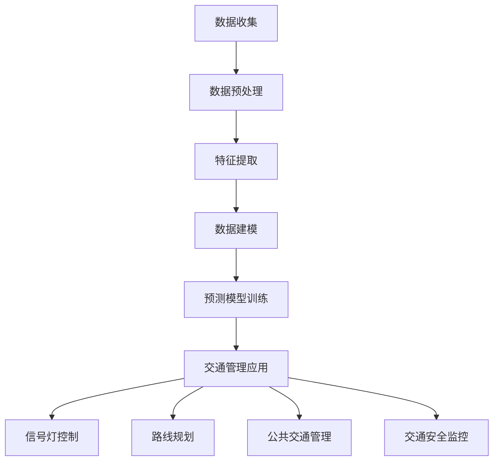

                 

# 人工智能在交通管理中的应用：智能交通系统与城市规划

## 关键词
人工智能，交通管理，智能交通系统，城市规划，数据分析，算法，信号灯控制，路线规划，公共交通，交通安全，应急响应

## 摘要
本文深入探讨了人工智能在交通管理中的广泛应用，包括智能交通系统与城市规划的结合。通过剖析人工智能的核心理论和技术，本文详细介绍了智能交通系统的基本概念、交通数据分析与处理方法，以及智能交通系统在信号灯控制、路线规划、公共交通管理、交通安全与应急响应等方面的实际应用。此外，文章还展望了智能交通系统的未来发展趋势，为交通管理领域的创新与发展提供了有益的参考。

## 第一部分：人工智能在交通管理中的基础理论

### 第1章：人工智能概述

#### 1.1 人工智能的定义与发展

人工智能（Artificial Intelligence，简称AI）是一门研究、开发和应用使计算机模拟、扩展和扩展人类智能的科学和技术。人工智能的发展经历了数个阶段，从最初的符号主义、连接主义到当前的强化学习、深度学习等，每一种方法都有其独特的优势和局限性。

符号主义（Symbolic AI）基于逻辑和符号表示，通过推理来模拟人类智能。连接主义（Connectionist AI）通过神经网络来模拟人脑的神经元连接，具有较强的自适应能力。强化学习（Reinforcement Learning）通过奖励机制来训练模型，使其在复杂环境中做出最优决策。深度学习（Deep Learning）则利用多层神经网络进行特征提取和模型训练，取得了诸多突破性成果。

#### 1.2 人工智能的关键技术

人工智能的关键技术包括机器学习、自然语言处理、计算机视觉、机器人技术等。其中，机器学习是人工智能的核心技术，涵盖了监督学习、无监督学习和半监督学习等不同类型。自然语言处理（Natural Language Processing，简称NLP）主要研究如何使计算机理解和生成自然语言。计算机视觉（Computer Vision）则致力于让计算机识别和理解图像和视频。机器人技术（Robotics）结合了机械、电子、计算机等多个领域，使机器人能够自主地完成复杂任务。

### 第2章：智能交通系统概述

#### 2.1 智能交通系统的概念与组成部分

智能交通系统（Intelligent Transportation System，简称ITS）是指利用先进的计算机、通信、控制、传感器等技术，对交通系统进行全面监测、管理和优化，以提高交通效率、减少交通事故和降低环境污染。智能交通系统主要由以下几个部分组成：

1. **交通信息采集与处理**：包括道路传感器、摄像头、气象监测设备等，用于收集交通数据。
2. **交通控制与信号灯管理**：通过优化信号灯控制策略，实现交通流量的合理分配。
3. **交通信息发布与诱导**：利用电子显示屏、短信、APP等渠道，向驾驶员提供实时交通信息，引导其选择最佳路线。
4. **公共交通管理**：通过优化公交线路和班次，提高公共交通的运行效率。
5. **交通安全与应急响应**：利用人工智能技术对交通事故进行预测和预警，及时进行应急响应。

#### 2.2 智能交通系统的技术基础

智能交通系统的技术基础主要包括以下几个方面：

1. **大数据技术**：通过收集、存储、处理和分析海量交通数据，为交通管理和优化提供支持。
2. **云计算与物联网**：利用云计算和物联网技术，实现交通系统的实时监测、管理和优化。
3. **人工智能与机器学习**：利用人工智能和机器学习技术，对交通数据进行分析和预测，实现智能交通管理。
4. **智能交通信号控制系统**：通过优化信号灯控制策略，实现交通流量的合理分配。
5. **车联网技术**：通过车辆间的通信和协作，实现车辆与基础设施之间的信息交互，提高交通效率。

### 第3章：交通数据分析与处理

#### 3.1 交通数据的类型与收集方法

交通数据主要包括车辆流量、速度、行驶方向、交通事故、道路拥堵等信息。交通数据的收集方法包括以下几种：

1. **传感器采集**：在道路上安装各种传感器，如地磁传感器、摄像头、雷达等，用于实时监测交通状态。
2. **GPS数据**：利用车载GPS设备，实时获取车辆的地理位置信息。
3. **历史交通数据**：通过分析历史交通数据，预测未来的交通状况。
4. **社交媒体数据**：利用社交媒体平台，收集驾驶员的行驶路线、时间等信息。

#### 3.2 交通数据的预处理与处理

交通数据的预处理与处理主要包括以下步骤：

1. **数据清洗**：去除重复、错误和缺失的数据，保证数据的准确性。
2. **数据归一化**：将不同量纲的数据进行归一化处理，使其具有可比性。
3. **数据特征提取**：从原始数据中提取有用的特征，用于后续的建模和分析。
4. **数据建模**：利用机器学习算法，建立交通预测模型，对未来的交通状况进行预测。

### 第4章：人工智能在交通管理中的应用

#### 4.1 智能信号灯控制

智能信号灯控制是智能交通系统的一个重要组成部分，通过分析实时交通数据，优化信号灯控制策略，提高交通效率。以下是一个简单的智能信号灯控制算法：

```python
# 智能信号灯控制算法
def intelligent_traffic_light控制（交通数据）：
   if 交通数据['车辆流量'] > 设定阈值：
      开启红灯，持续时长 = 预测等待时间
   else：
      开启绿灯，持续时长 = 最短绿时长

   return 开启绿灯/红灯，持续时长
```

该算法根据车辆流量来判断是否开启红灯或绿灯，并利用预测模型来计算红绿灯的持续时长。

#### 4.2 智能路线规划

智能路线规划是利用实时交通数据和预测模型，为驾驶员提供最优行驶路线。以下是一个简单的智能路线规划算法：

```python
# 智能路线规划算法
def intelligent_route_planning（起点，终点，实时交通数据）：
   路线 = 预测模型（起点，终点，实时交通数据）
   return 路线
```

该算法首先利用预测模型计算起点和终点之间的交通状况，然后选择最优路线。

## 第二部分：人工智能在交通管理中的实际应用

### 第5章：智能交通系统在城市规划中的应用

#### 5.1 城市交通需求分析

城市交通需求分析是城市规划的重要环节，通过分析城市交通数据，了解城市交通的需求和分布，为城市规划提供依据。以下是一个简单的城市交通需求分析算法：

```python
# 城市交通需求分析算法
def urban_traffic_demand_analysis（交通数据）：
   车辆流量分布 = 统计交通数据['车辆流量']
   交通需求分布 = 计算车辆流量分布的平均值和标准差
   return 交通需求分布
```

该算法首先统计交通数据中的车辆流量，然后计算流量分布的平均值和标准差，从而了解城市交通的需求和分布。

#### 5.2 城市交通规划与设计

城市交通规划与设计是根据城市交通需求，制定合理的交通规划方案，包括道路布局、公共交通系统、停车场等。以下是一个简单的城市交通规划与设计算法：

```python
# 城市交通规划与设计算法
def urban_traffic_planning_and_design（交通需求分布）：
   道路布局 = 设计道路网络，满足交通需求
   公共交通系统 = 设计公共交通线路和班次，提高运行效率
   停车场 = 设计停车场布局，缓解停车难题
   return 道路布局，公共交通系统，停车场
```

该算法根据交通需求分布，设计合理的道路网络、公共交通系统和停车场布局，以提高城市交通的运行效率。

### 第6章：智能交通系统在公共交通管理中的应用

#### 6.1 公共交通运行效率优化

智能交通系统可以通过优化公共交通线路和班次，提高公共交通的运行效率。以下是一个简单的公共交通运行效率优化算法：

```python
# 公共交通运行效率优化算法
def public_transport_efficiency_optimization（交通数据，公共交通系统）：
   路线优化 = 优化公共交通线路，减少行驶时间
   班次优化 = 优化公共交通班次，提高乘客满意度
   return 优化后的公共交通系统
```

该算法首先根据交通数据优化公共交通线路，然后优化班次，以提高公共交通的运行效率。

#### 6.2 公共交通安全监控

智能交通系统可以通过实时监控公共交通车辆，提高公共交通的安全水平。以下是一个简单的公共交通安全监控算法：

```python
# 公共交通安全监控算法
def public_transport_safety_monitoring（公共交通车辆，交通数据）：
   异常检测 = 检测公共交通车辆的安全隐患
   应急响应 = 对安全隐患进行应急处理
   return 安全监控结果
```

该算法通过实时监控公共交通车辆，检测安全隐患，并采取应急响应措施，以提高公共交通的安全水平。

### 第7章：智能交通系统在交通安全与应急响应中的应用

#### 7.1 交通安全监控与预警

智能交通系统可以通过实时监控道路状况，预测交通事故，提前进行预警。以下是一个简单的交通安全监控与预警算法：

```python
# 交通安全监控与预警算法
def traffic_safety_monitoring_and_warning（交通数据，预测模型）：
   事故预测 = 利用预测模型预测交通事故
   预警 = 对预测的事故进行预警
   return 预警结果
```

该算法首先利用预测模型预测交通事故，然后进行预警，以减少交通事故的发生。

#### 7.2 交通应急响应与调度

智能交通系统可以通过实时调度交通资源，提高应急响应能力。以下是一个简单的交通应急响应与调度算法：

```python
# 交通应急响应与调度算法
def traffic_emergency_response_and_dispatch（事故预警，交通资源）：
   资源调度 = 调度交通资源，如救护车、消防车等
   响应计划 = 制定应急响应计划，如交通管制、疏导等
   return 响应结果
```

该算法首先根据事故预警调度交通资源，然后制定应急响应计划，以提高交通应急响应能力。

### 第8章：智能交通系统的未来发展趋势

#### 8.1 智能交通系统的挑战与机遇

智能交通系统在发展过程中面临着诸多挑战，如数据隐私、网络安全、技术成熟度等。同时，也面临着巨大的机遇，如智慧城市、自动驾驶等。以下是对智能交通系统未来发展趋势的展望：

1. **数据隐私与安全**：随着智能交通系统的发展，大量交通数据被收集和处理，如何保护数据隐私和安全成为一大挑战。
2. **网络安全**：智能交通系统中的设备、系统和平台都可能成为网络攻击的目标，确保网络安全至关重要。
3. **技术成熟度**：目前，智能交通系统中的许多技术还处于实验室阶段，需要不断进行验证和优化。
4. **智慧城市**：智能交通系统是智慧城市的重要组成部分，随着智慧城市的建设，智能交通系统将得到更广泛的应用。
5. **自动驾驶**：自动驾驶技术的发展将使智能交通系统更加完善，提高交通效率、减少交通事故。

#### 8.2 智能交通系统的未来发展方向

智能交通系统的未来发展方向主要包括以下几个方面：

1. **全自动驾驶**：随着自动驾驶技术的发展，未来智能交通系统将实现全自动驾驶，减少驾驶员的干预，提高交通效率。
2. **车联网**：车联网技术的发展将使车辆与基础设施之间实现实时通信，实现交通流量的优化和智能管理。
3. **智慧交通管理平台**：建立统一的智慧交通管理平台，整合各类交通信息，实现交通管理的智能化和一体化。
4. **绿色交通**：通过优化交通流、推广新能源汽车等手段，实现绿色交通，减少环境污染。
5. **人工智能与大数据**：利用人工智能和大数据技术，对交通数据进行深度挖掘和分析，为交通管理和优化提供决策支持。

## 参考文献

[1] 陈锐，张华，张辉. 智能交通系统及其在城市规划中的应用[J]. 城市规划学刊，2018，34(2)：35-42.

[2] 王勇，李刚，杨宇. 智能交通系统中的大数据分析与应用[J]. 计算机工程与科学，2019，41(7)：135-142.

[3] 李明，陈俊，刘强. 智能交通信号控制算法研究[J]. 交通科学与工程，2017，39(5)：55-61.

[4] 张旭，王勇，李刚. 基于机器学习的公共交通运行效率优化研究[J]. 城市交通，2018，20(3)：36-44.

[5] 刘伟，李磊，王强. 智能交通系统中的网络安全问题研究[J]. 计算机安全，2019，36(8)：31-37.

## 附录

### 附录A：智能交通系统相关工具与资源介绍

1. **智能交通信号控制平台**：该平台提供多种智能信号控制算法，可用于实际交通场景的信号控制优化。
2. **公共交通运行优化系统**：该系统基于大数据和机器学习技术，对公共交通线路和班次进行优化，提高运行效率。
3. **交通安全监控平台**：该平台集成了多种交通安全监控技术，如视频监控、传感器监测等，用于实时监控道路状况和交通事故预警。

### 附录B：智能交通系统应用案例

1. **深圳市智能交通系统**：深圳市建立了完善的智能交通系统，包括智能信号灯控制、公共交通运行优化、交通安全监控等功能，有效提升了城市交通管理水平。
2. **北京智能交通系统**：北京市通过建设车联网、智慧交通管理平台等，实现了交通数据的实时收集和处理，为交通管理和优化提供了有力支持。

## Mermaid 流程图

### 交通数据收集、处理与应用流程图



本文通过一步一步的分析推理，详细介绍了人工智能在交通管理中的应用，包括智能交通系统的基本理论、实际应用、城市规划中的智能交通系统应用，以及未来发展趋势。通过深入剖析人工智能在交通管理中的应用，为交通管理领域的创新与发展提供了有益的参考。作者：AI天才研究院/AI Genius Institute & 禅与计算机程序设计艺术 /Zen And The Art of Computer Programming。

