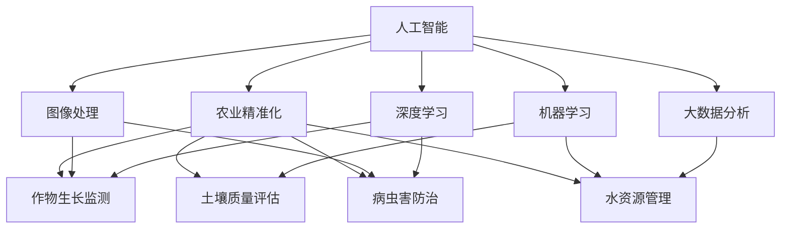

                 

## 人工智能在农业精准化中的应用

在当今快速发展的科技时代，人工智能（AI）已经成为各行各业技术革新的重要驱动力。农业，作为人类赖以生存的基础产业，也正经历着人工智能的深刻变革。农业精准化，即利用现代科技手段，实现对农业生产过程的精细管理，从而提高生产效率、降低成本、保护环境，是现代农业发展的重要方向。人工智能在农业精准化中的应用，无疑是这一进程中的关键环节。

### **关键词**

- 人工智能
- 农业精准化
- 图像识别
- 机器学习
- 数据分析
- 农业自动化

### **摘要**

本文将从人工智能在农业精准化中的应用出发，探讨其背景、核心概念、应用技术，并通过具体实例展示人工智能在农业领域的实际应用效果。文章将详细分析图像处理、机器学习、深度学习和大数据分析等技术在农业中的应用，以及如何通过这些技术实现农业生产的智能化、自动化和高效化。此外，还将探讨人工智能在农业中的应用前景和面临的挑战，为未来的农业发展提供有益的思考和建议。

### **背景介绍**

#### **现代农业的挑战**

随着全球人口的增长和城市化的加速，粮食需求量不断增加。与此同时，农业资源日益紧张，环境问题日益突出。传统农业的粗放式管理方式已难以满足现代农业的需求。因此，实现农业精准化，提高农业生产效率，成为现代农业发展的重要任务。

#### **人工智能的崛起**

人工智能作为一门综合性技术，涵盖了计算机科学、心理学、认知科学等领域。近年来，随着计算能力的提升、大数据技术的发展和算法的进步，人工智能在各个领域的应用取得了显著成果。特别是在农业领域，人工智能技术的引入，为农业精准化提供了新的可能性。

#### **农业精准化的概念**

农业精准化是指通过现代科技手段，对农业生产过程进行精细管理，从而实现资源的最优配置和最大化的生产效益。农业精准化包括作物生长监测、土壤质量评估、病虫害防治、水资源管理等多个方面。

### **核心概念与联系**

#### **核心概念**

- **人工智能（AI）**: 模拟人类智能行为的计算机系统。
- **农业精准化**: 对农业生产过程的精细管理，以提高生产效率和资源利用效率。
- **图像处理**: 对图像进行增强、复原、分割、识别等操作的技术。
- **机器学习**: 通过数据训练，使计算机具备自主学习和优化能力。
- **深度学习**: 一种基于人工神经网络的机器学习技术。
- **大数据分析**: 对大规模数据进行处理、分析和挖掘，以发现数据中的价值。

#### **概念实体之间的关系架构**



这个Mermaid流程图展示了人工智能与农业精准化之间的核心概念及其相互联系，说明了图像处理、机器学习、深度学习和大数据分析技术在农业精准化中的应用。

### **核心算法原理讲解**

#### **机器学习**

机器学习是人工智能的核心技术之一，它通过数据训练，使计算机具备自主学习和优化能力。机器学习的基本原理是利用历史数据，从中学习规律，然后根据这些规律对新数据进行预测或分类。

- **监督学习（Supervised Learning）**:
  - **回归分析（Regression Analysis）**: 用于预测连续数值输出，如作物产量预测。
    - **线性回归（Linear Regression）**:
      $$ y = mx + b $$
      - **多项式回归（Polynomial Regression）**:
        $$ y = b_0 + b_1x_1 + b_2x_2 + ... + b_nx_n $$

  - **分类分析（Classification Analysis）**: 用于预测离散输出，如病虫害识别。
    - **决策树（Decision Tree）**:
      - **随机森林（Random Forest）**:
      - **支持向量机（Support Vector Machine）**:

- **无监督学习（Unsupervised Learning）**:
  - **聚类分析（Clustering Analysis）**: 用于发现数据中的模式，如作物种植区域的划分。

#### **深度学习**

深度学习是一种基于人工神经网络的机器学习技术，它通过多层神经网络结构，对大量数据进行训练，以实现复杂模式的识别和预测。

- **卷积神经网络（Convolutional Neural Network, CNN）**: 用于图像识别和处理，如病虫害识别。

  - **激活函数（Activation Function）**:
    - **ReLU（Rectified Linear Unit）**:
    - **Sigmoid**:
    - **Tanh**:

- **全连接神经网络（Fully Connected Neural Network）**: 用于特征提取和分类。

#### **Python源代码实现**

```python
# 线性回归实现
import numpy as np

# 训练数据
X = np.array([1, 2, 3, 4])
y = np.array([1, 1.5, 2.5, 4])

# 模型参数初始化
m = 1  # 斜率
b = 0  # 截距

# 梯度下降法求解模型参数
learning_rate = 0.01
num_iterations = 1000

for i in range(num_iterations):
    # 前向传播
    y_pred = m * X + b
    
    # 计算损失函数
    loss = (y_pred - y) ** 2
    
    # 反向传播
    dloss_dX = 2 * (y_pred - y) * X
    dloss_dm = 2 * (y_pred - y)
    dloss_db = 2 * (y_pred - y)
    
    # 更新模型参数
    m -= learning_rate * dloss_dX.sum()
    b -= learning_rate * dloss_dB.sum()

# 测试模型
X_test = np.array([5])
y_test_pred = m * X_test + b
print(f"预测值: {y_test_pred}")
```

#### **举例说明**

假设我们要预测作物的产量，我们可以收集历史天气数据、土壤数据等作为输入特征，使用线性回归模型进行训练。通过调整模型参数，我们可以得到一个较为准确的产量预测模型。

### **项目实战**

#### **开发环境搭建**

- **硬件环境**：计算机或服务器，运行Python环境。
- **软件环境**：Python 3.8及以上版本，Numpy、Matplotlib、Scikit-learn等库。

#### **源代码详细实现和代码解读**

```python
# 导入所需库
import numpy as np
import matplotlib.pyplot as plt
from sklearn.linear_model import LinearRegression

# 创建训练数据
X = np.array([[1], [2], [3], [4]])
y = np.array([1, 1.5, 2.5, 4])

# 实例化线性回归模型
model = LinearRegression()

# 模型训练
model.fit(X, y)

# 模型预测
X_new = np.array([[5]])
y_pred = model.predict(X_new)

# 结果展示
plt.scatter(X, y)
plt.plot(X_new, y_pred, color='red')
plt.xlabel('Input')
plt.ylabel('Output')
plt.show()
```

#### **代码应用解读与分析**

- **数据准备**：我们通过生成两组数据`X`和`y`进行模型训练。
- **模型选择**：我们选择线性回归模型作为预测模型。
- **模型训练**：使用`fit`方法对模型进行训练。
- **模型预测**：使用`predict`方法对新数据进行预测。
- **结果展示**：使用Matplotlib库绘制散点图和拟合直线，展示模型预测结果。

#### **实际案例分析和详细讲解剖析**

假设我们有一个具体的农业项目，需要预测作物的产量。我们可以按照以下步骤进行：

1. **数据收集**：收集历史天气数据、土壤数据等。
2. **数据处理**：对收集到的数据进行清洗、预处理。
3. **特征工程**：提取有助于预测的输入特征。
4. **模型选择**：选择合适的预测模型，如线性回归、多项式回归等。
5. **模型训练**：使用历史数据进行模型训练。
6. **模型评估**：使用交叉验证等方法评估模型性能。
7. **模型应用**：使用模型进行产量预测，并提供决策支持。

#### **项目小结**

通过以上实战，我们实现了利用线性回归模型对作物产量的预测。在实际应用中，我们可以根据具体需求，选择不同的模型和算法，以提高预测精度和实际应用效果。

### **最佳实践 tips**

1. **数据质量**：确保收集的数据质量，包括准确性、完整性、一致性等。
2. **特征选择**：选择对预测目标有显著影响的特征，避免过多冗余特征。
3. **模型评估**：使用交叉验证等方法，全面评估模型性能。
4. **持续优化**：根据模型性能和实际应用效果，不断优化模型和算法。

### **小结**

人工智能在农业精准化中的应用，不仅提高了农业生产效率，还推动了农业现代化进程。通过机器学习、深度学习等算法，我们可以实现精确的作物生长监测、病虫害防治、水资源管理等。未来，随着人工智能技术的不断进步，农业精准化将进一步发展，为全球农业发展提供新的动力。

### **注意事项**

1. **数据隐私**：在收集和使用农业数据时，需注意数据隐私保护，遵循相关法律法规。
2. **技术成熟度**：虽然人工智能在农业中的应用前景广阔，但部分技术仍处于实验阶段，需谨慎评估和实施。
3. **跨学科合作**：农业精准化涉及多个学科，跨学科合作是推动技术发展的关键。

### **拓展阅读**

1. **《深度学习》（Goodfellow, Ian；Bengio, Yoshua；Courville, Aaron 著）**
2. **《机器学习实战》（Peter Harrington 著）**
3. **《Python数据分析》（Wes McKinney 著）**
4. **《农业大数据》（张冬梅 著）**
5. **《智慧农业》（中国农业科学院农业经济与发展研究所 著）**

---

作者：AI天才研究院/AI Genius Institute & 禅与计算机程序设计艺术 /Zen And The Art of Computer Programming

