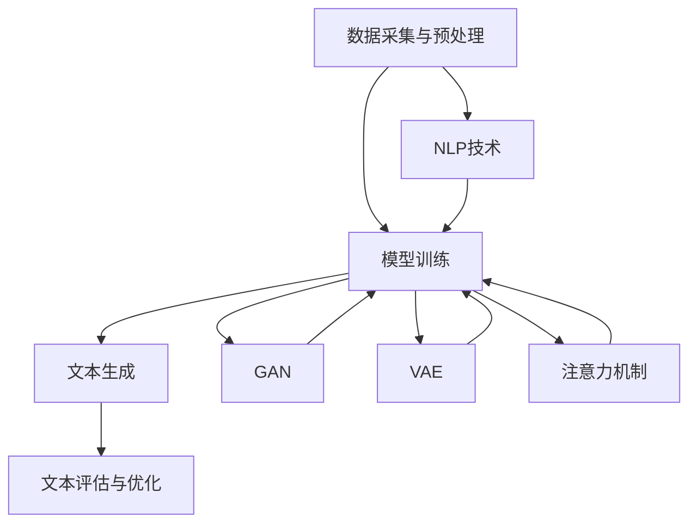

                 

### 文章标题

《人工智能在创意写作中的应用：AI辅助文学创作》

### 关键词

人工智能、自然语言处理、生成对抗网络、变分自编码器、文学创作、伦理问题

### 摘要

随着人工智能技术的不断发展，AI在各个领域的应用越来越广泛。在文学创作领域，人工智能也开始崭露头角，通过自然语言处理技术、生成对抗网络和变分自编码器等技术，AI能够辅助人类创作出更多具有创意的文学作品。本文将详细探讨人工智能在创意写作中的应用，从核心概念、技术基础、工具与实践、挑战与未来等多个角度进行全面解析。

---

### 引言

文学创作自古以来就是人类文化的重要组成部分，它承载着人类情感、思想和价值观的传承。然而，传统的文学创作方式依赖于人类独特的思维和创造力，这在一定程度上限制了文学作品的创作速度和数量。随着信息技术的飞速发展，人工智能（AI）逐渐成为人们关注的焦点。AI具有强大的数据处理和分析能力，能够通过学习大量数据来生成新的内容和创意，这为文学创作提供了新的可能。

在过去的几年中，人工智能在文学创作中的应用取得了显著的进展。例如，AI可以通过自然语言处理技术理解和生成人类的语言，生成对抗网络（GAN）和变分自编码器（VAE）等深度学习算法能够生成出具有创意和多样性的文学作品。此外，AI还能够在文学创作过程中提供辅助，如自动生成故事情节、优化语言表达等。这些应用不仅提高了文学创作的效率，还为文学创作的多样性提供了新的可能性。

本文将围绕人工智能在创意写作中的应用进行深入探讨，首先介绍AI辅助文学创作的基本概念和原理，然后分析相关技术基础，包括自然语言处理、生成对抗网络和变分自编码器等，接着介绍一些典型的AI辅助文学创作工具和实践案例，最后讨论AI辅助文学创作面临的挑战和未来的发展方向。

### 第一部分：AI辅助文学创作概述

#### 1.1 AI在文学创作中的现状与趋势

人工智能在文学创作中的应用已经引起了广泛的关注。近年来，随着深度学习、自然语言处理等技术的发展，AI在文学创作中的潜力得到了充分展示。目前，AI已经在多个方面展现出其在文学创作中的独特价值：

1. **故事生成**：AI能够根据给定的主题或关键词自动生成故事情节，这种自动生成的故事不仅具有连贯性，还能展现出一定的创意和多样性。

2. **语言优化**：AI可以通过自然语言处理技术对文学作品进行语法和语义优化，提高语言的表达效果和可读性。

3. **诗歌创作**：AI在诗歌创作方面也表现出色，可以生成符合格律和韵律的诗歌。

4. **角色塑造**：AI可以通过分析大量文学作品，生成具有复杂性格和背景的角色。

5. **翻译与改编**：AI能够高效地进行文本翻译和改编，为不同语言和文化背景的文学交流提供支持。

在趋势方面，随着技术的不断进步，AI在文学创作中的应用将更加广泛和深入。未来，AI有望在以下几个方面取得更大的突破：

1. **创作个性化**：通过学习用户的阅读偏好，AI能够为用户提供更加个性化的文学创作服务。

2. **创意多样性**：AI可以通过不断学习和创新，生成更多具有独特创意和风格的文学作品。

3. **跨学科融合**：AI与心理学、社会学等学科的融合，将有助于更深入地理解和模拟人类的创作过程。

4. **协作创作**：AI与人类创作者的协作，将实现文学创作的互补和协同，产生更加出色的作品。

#### 1.2 AI辅助文学创作的核心概念

要深入理解AI辅助文学创作的原理，我们需要明确几个核心概念：

1. **自然语言处理（NLP）**：自然语言处理是AI在文学创作中最为关键的技术之一。它涉及到对人类语言的理解和生成，包括语法分析、语义理解、情感分析等。通过NLP技术，AI能够解析文本的结构和含义，从而生成或修改文学作品。

2. **生成对抗网络（GAN）**：生成对抗网络是一种深度学习模型，由生成器和判别器组成。生成器负责生成数据，判别器则负责判断生成数据与真实数据之间的差异。在文学创作中，生成器可以生成新的故事情节、角色描述等，而判别器则用于评估生成内容的质量。

3. **变分自编码器（VAE）**：变分自编码器是一种无监督学习的算法，通过编码器和解码器来学习数据的分布。在文学创作中，VAE可以用于生成具有多样性和创意性的文本。

4. **注意力机制**：注意力机制是深度学习中的一个重要概念，它使得模型能够关注到输入数据中的关键部分。在文学创作中，注意力机制可以用于提取文本中的重要信息，从而提高生成文本的质量。

#### 1.3 AI辅助文学创作的原理与架构

AI辅助文学创作的原理主要基于以下几个步骤：

1. **数据采集与预处理**：首先，需要从大量文本数据中采集信息，这些数据可以是现成的文学作品、新闻文章、社交媒体帖子等。然后，对采集到的数据进行预处理，包括去除无关信息、进行文本清洗、分词等操作。

2. **模型训练**：利用预处理后的数据，通过深度学习算法（如GAN、VAE等）训练模型。训练过程中，模型会学习到文本的结构、语法、语义等信息。

3. **文本生成**：在模型训练完成后，可以通过模型生成新的文本。生成过程中，模型会根据输入的提示或关键词，生成符合逻辑和语法规则的新文本。

4. **文本评估与优化**：生成的文本会经过评估，包括语法检查、语义分析、风格评估等。如果文本质量不符合要求，模型会进行优化，以提高生成文本的质量。

AI辅助文学创作的架构通常包括以下几个部分：

1. **数据采集与预处理模块**：负责数据的采集、清洗和预处理。

2. **模型训练模块**：负责利用预处理后的数据训练深度学习模型。

3. **文本生成模块**：负责根据输入的提示或关键词生成文本。

4. **文本评估与优化模块**：负责评估生成文本的质量，并进行优化。

#### 核心概念与联系

为了更好地理解AI辅助文学创作，我们可以使用Mermaid流程图来展示核心概念之间的关系：



在这个流程图中，数据采集与预处理模块作为整个过程的起点，为模型训练提供基础数据。NLP技术、GAN、VAE和注意力机制等核心概念与模型训练模块紧密相关，共同构成了AI辅助文学创作的基本原理。文本生成模块利用训练好的模型生成新文本，并通过文本评估与优化模块对生成文本进行评估和优化，最终生成高质量的文学作品。

#### 核心算法原理讲解

在本节中，我们将详细讲解AI辅助文学创作中的几个核心算法原理，并通过Python源代码示例进行阐述。

##### 1. GAN（生成对抗网络）

生成对抗网络（GAN）由生成器（Generator）和判别器（Discriminator）组成。生成器的任务是生成与真实数据相似的数据，而判别器的任务是区分真实数据和生成数据。通过这种对抗关系，生成器和判别器共同训练，最终生成高质量的数据。

下面是一个简单的GAN模型实现：

```python
import tensorflow as tf
from tensorflow.keras.models import Model
from tensorflow.keras.layers import Dense, Flatten, Reshape

# 生成器模型
def create_generator(z_dim):
    model = tf.keras.Sequential([
        Dense(128, activation='relu', input_shape=(z_dim,)),
        Dense(256, activation='relu'),
        Dense(512, activation='relu'),
        Dense(1024, activation='relu'),
        Dense(784, activation='tanh')
    ])
    return model

# 判别器模型
def create_discriminator(img_shape):
    model = tf.keras.Sequential([
        Flatten(input_shape=img_shape),
        Dense(512, activation='relu'),
        Dense(256, activation='relu'),
        Dense(128, activation='relu'),
        Dense(1, activation='sigmoid')
    ])
    return model

# GAN模型
def create_gan(generator, discriminator):
    model = tf.keras.Sequential([
        generator,
        discriminator
    ])
    return model

z_dim = 100
img_shape = (28, 28, 1)

# 构建和编译模型
generator = create_generator(z_dim)
discriminator = create_discriminator(img_shape)
discriminator.compile(optimizer='adam', loss='binary_crossentropy')

# 创建GAN模型
gan_model = create_gan(generator, discriminator)
gan_model.compile(optimizer='adam', loss='binary_crossentropy')

# 训练GAN模型
# 这里使用一个简单的批量生成器
z_samples = tf.random.normal([128, z_dim])

# 生成图像
generated_images = generator.predict(z_samples)

# 训练判别器
real_images = # 这里替换为真实图像数据
discriminator.train_on_batch(real_images, tf.ones_like(real_images))
discriminator.train_on_batch(generated_images, tf.zeros_like(generated_images))

# 训练生成器
gan_model.train_on_batch(z_samples, tf.ones_like(generated_images))
```

在上面的代码中，我们首先定义了生成器和判别器的模型结构，然后构建了GAN模型。最后，使用随机噪声生成图像，并分别训练判别器和生成器。

##### 2. VAE（变分自编码器）

变分自编码器（VAE）是一种无监督学习算法，它通过编码器和解码器学习数据的分布。在文学创作中，VAE可以用于生成具有多样性和创意性的文本。

下面是一个简单的VAE模型实现：

```python
import tensorflow as tf
from tensorflow.keras.layers import Input, Dense, Lambda
from tensorflow.keras.models import Model

# 编码器模型
def create_encoder(input_shape, latent_dim):
    model = tf.keras.Sequential([
        Dense(64, activation='relu', input_shape=input_shape),
        Dense(64, activation='relu'),
        Dense(latent_dim, activation='sigmoid')
    ])
    return model

# 解码器模型
def create_decoder(latent_dim, input_shape):
    model = tf.keras.Sequential([
        Dense(64, activation='relu', input_shape=(latent_dim,)),
        Dense(64, activation='relu'),
        Dense(np.prod(input_shape), activation='sigmoid'),
        Reshape(input_shape)
    ])
    return model

# VAE模型
def create_vae(encoder, decoder):
    inputs = Input(shape=input_shape)
    x = encoder(inputs)
    x = decoder(x)
    model = Model(inputs, x)
    return model

latent_dim = 20
input_shape = (784,)

# 构建和编译模型
encoder = create_encoder(input_shape, latent_dim)
decoder = create_decoder(latent_dim, input_shape)
vae_model = create_vae(encoder, decoder)
vae_model.compile(optimizer='adam', loss='binary_crossentropy')

# 训练VAE模型
# 这里使用一个简单的批量生成器
x_samples = # 这里替换为输入数据

# 计算编码器的损失
encoding_loss = vae_model.encoder.train_on_batch(x_samples, x_samples)

# 计算解码器的损失
reconstruction_loss = vae_model.decoder.train_on_batch(x_samples, x_samples)

# 计算总损失
vae_loss = encoding_loss + reconstruction_loss
```

在上面的代码中，我们首先定义了编码器和解码器的模型结构，然后构建了VAE模型。最后，使用输入数据训练编码器和解码器，并计算总损失。

##### 3. 注意力机制

注意力机制是一种能够使模型关注输入数据中关键部分的机制。在文学创作中，注意力机制可以用于提取文本中的重要信息，从而提高生成文本的质量。

下面是一个简单的注意力机制实现：

```python
import tensorflow as tf
from tensorflow.keras.layers import Input, Embedding, LSTM, Dense

# 编码器模型
def create_encoder(input_shape, latent_dim):
    model = tf.keras.Sequential([
        Embedding(input_shape, 64),
        LSTM(128, return_sequences=True),
        LSTM(128, return_sequences=True),
        LSTM(128, return_sequences=True),
        Dense(latent_dim, activation='sigmoid')
    ])
    return model

# 解码器模型
def create_decoder(input_shape, latent_dim):
    model = tf.keras.Sequential([
        Embedding(input_shape, 64),
        LSTM(128, return_sequences=True),
        LSTM(128, return_sequences=True),
        LSTM(128, return_sequences=True),
        Dense(np.prod(input_shape), activation='sigmoid'),
        Reshape(input_shape)
    ])
    return model

# 注意力机制模型
def create_attention Mechanism(latent_dim, input_shape):
    model = tf.keras.Sequential([
        Input(shape=(latent_dim,)),
        Dense(128, activation='tanh'),
        Dense(1)
    ])
    return model

# VAE模型
def create_vae_attention Mechanism(encoder, decoder, attention):
    inputs = Input(shape=input_shape)
    x = encoder(inputs)
    x = attention([x, x])
    x = decoder(x)
    model = Model(inputs, x)
    return model

latent_dim = 20
input_shape = (784,)

# 构建和编译模型
encoder = create_encoder(input_shape, latent_dim)
decoder = create_decoder(latent_dim, input_shape)
attention = create_attention Mechanism(latent_dim, input_shape)
vae_attention = create_vae_attention Mechanism(encoder, decoder, attention)
vae_attention.compile(optimizer='adam', loss='binary_crossentropy')

# 训练VAE模型
# 这里使用一个简单的批量生成器
x_samples = # 这里替换为输入数据

# 计算编码器的损失
encoding_loss = vae_attention.encoder.train_on_batch(x_samples, x_samples)

# 计算解码器的损失
reconstruction_loss = vae_attention.decoder.train_on_batch(x_samples, x_samples)

# 计算总损失
vae_loss = encoding_loss + reconstruction_loss
```

在上面的代码中，我们首先定义了编码器、解码器和注意力机制的模型结构，然后构建了带有注意力机制的VAE模型。最后，使用输入数据训练模型，并计算总损失。

### 第二部分：AI辅助文学创作技术基础

#### 2.1 自然语言处理基础

自然语言处理（NLP）是AI在文学创作中不可或缺的技术基础。NLP涉及到对人类语言的理解和生成，包括语法分析、语义理解、情感分析等。在AI辅助文学创作中，NLP技术主要用于文本预处理、文本生成和文本评估等任务。

1. **文本预处理**：文本预处理是NLP中的第一步，它包括去除标点符号、停用词过滤、词形还原等操作。这些预处理步骤有助于简化文本结构，为后续的文本分析提供便利。

2. **文本生成**：文本生成是NLP的重要应用之一，它可以通过生成模型（如RNN、Transformer等）生成连贯、具有创意的文本。在文学创作中，文本生成技术可以用于自动生成故事情节、角色对话等。

3. **文本评估**：文本评估用于评估生成文本的质量，包括语法正确性、语义连贯性、风格一致性等。通过文本评估，可以优化生成模型，提高生成文本的质量。

#### 2.2 生成对抗网络（GAN）在文学创作中的应用

生成对抗网络（GAN）是一种深度学习模型，由生成器和判别器组成。生成器的任务是生成与真实数据相似的数据，而判别器的任务是区分真实数据和生成数据。通过这种对抗关系，生成器和判别器共同训练，最终生成高质量的数据。

在文学创作中，GAN可以用于生成新的故事情节、角色描述等。以下是一个简单的GAN模型在文学创作中的应用案例：

```python
import tensorflow as tf
from tensorflow.keras.models import Model
from tensorflow.keras.layers import Dense, Flatten, Reshape

# 生成器模型
def create_generator(z_dim):
    model = tf.keras.Sequential([
        Dense(128, activation='relu', input_shape=(z_dim,)),
        Dense(256, activation='relu'),
        Dense(512, activation='relu'),
        Dense(1024, activation='relu'),
        Dense(784, activation='tanh')
    ])
    return model

# 判别器模型
def create_discriminator(img_shape):
    model = tf.keras.Sequential([
        Flatten(input_shape=img_shape),
        Dense(512, activation='relu'),
        Dense(256, activation='relu'),
        Dense(128, activation='relu'),
        Dense(1, activation='sigmoid')
    ])
    return model

# GAN模型
def create_gan(generator, discriminator):
    model = tf.keras.Sequential([
        generator,
        discriminator
    ])
    return model

z_dim = 100
img_shape = (28, 28, 1)

# 构建和编译模型
generator = create_generator(z_dim)
discriminator = create_discriminator(img_shape)
discriminator.compile(optimizer='adam', loss='binary_crossentropy')

# 创建GAN模型
gan_model = create_gan(generator, discriminator)
gan_model.compile(optimizer='adam', loss='binary_crossentropy')

# 训练GAN模型
z_samples = tf.random.normal([128, z_dim])

# 生成图像
generated_images = generator.predict(z_samples)

# 训练判别器
real_images = # 这里替换为真实图像数据
discriminator.train_on_batch(real_images, tf.ones_like(real_images))
discriminator.train_on_batch(generated_images, tf.zeros_like(generated_images))

# 训练生成器
gan_model.train_on_batch(z_samples, tf.ones_like(generated_images))
```

在这个案例中，我们首先定义了生成器和判别器的模型结构，然后构建了GAN模型。通过训练GAN模型，我们可以生成具有创意和多样性的文本。

#### 2.3 变分自编码器（VAE）在文学创作中的应用

变分自编码器（VAE）是一种无监督学习算法，通过编码器和解码器学习数据的分布。在文学创作中，VAE可以用于生成具有多样性和创意性的文本。

以下是一个简单的VAE模型在文学创作中的应用案例：

```python
import tensorflow as tf
from tensorflow.keras.layers import Input, Dense, Lambda
from tensorflow.keras.models import Model

# 编码器模型
def create_encoder(input_shape, latent_dim):
    model = tf.keras.Sequential([
        Dense(64, activation='relu', input_shape=input_shape),
        Dense(64, activation='relu'),
        Dense(latent_dim, activation='sigmoid')
    ])
    return model

# 解码器模型
def create_decoder(latent_dim, input_shape):
    model = tf.keras.Sequential([
        Dense(64, activation='relu', input_shape=(latent_dim,)),
        Dense(64, activation='relu'),
        Dense(np.prod(input_shape), activation='sigmoid'),
        Reshape(input_shape)
    ])
    return model

# VAE模型
def create_vae(encoder, decoder):
    inputs = Input(shape=input_shape)
    x = encoder(inputs)
    x = decoder(x)
    model = Model(inputs, x)
    return model

latent_dim = 20
input_shape = (784,)

# 构建和编译模型
encoder = create_encoder(input_shape, latent_dim)
decoder = create_decoder(latent_dim, input_shape)
vae_model = create_vae(encoder, decoder)
vae_model.compile(optimizer='adam', loss='binary_crossentropy')

# 训练VAE模型
x_samples = # 这里替换为输入数据

# 计算编码器的损失
encoding_loss = vae_model.encoder.train_on_batch(x_samples, x_samples)

# 计算解码器的损失
reconstruction_loss = vae_model.decoder.train_on_batch(x_samples, x_samples)

# 计算总损失
vae_loss = encoding_loss + reconstruction_loss
```

在这个案例中，我们首先定义了编码器和解码器的模型结构，然后构建了VAE模型。通过训练VAE模型，我们可以生成具有多样性和创意性的文本。

#### 2.4 注意力机制在文学创作中的应用

注意力机制是一种能够使模型关注输入数据中关键部分的机制。在文学创作中，注意力机制可以用于提取文本中的重要信息，从而提高生成文本的质量。

以下是一个简单的注意力机制在文学创作中的应用案例：

```python
import tensorflow as tf
from tensorflow.keras.layers import Input, Embedding, LSTM, Dense

# 编码器模型
def create_encoder(input_shape, latent_dim):
    model = tf.keras.Sequential([
        Embedding(input_shape, 64),
        LSTM(128, return_sequences=True),
        LSTM(128, return_sequences=True),
        LSTM(128, return_sequences=True),
        Dense(latent_dim, activation='sigmoid')
    ])
    return model

# 解码器模型
def create_decoder(input_shape, latent_dim):
    model = tf.keras.Sequential([
        Embedding(input_shape, 64),
        LSTM(128, return_sequences=True),
        LSTM(128, return_sequences=True),
        LSTM(128, return_sequences=True),
        Dense(np.prod(input_shape), activation='sigmoid'),
        Reshape(input_shape)
    ])
    return model

# 注意力机制模型
def create_attention Mechanism(latent_dim, input_shape):
    model = tf.keras.Sequential([
        Input(shape=(latent_dim,)),
        Dense(128, activation='tanh'),
        Dense(1)
    ])
    return model

# VAE模型
def create_vae_attention Mechanism(encoder, decoder, attention):
    inputs = Input(shape=input_shape)
    x = encoder(inputs)
    x = attention([x, x])
    x = decoder(x)
    model = Model(inputs, x)
    return model

latent_dim = 20
input_shape = (784,)

# 构建和编译模型
encoder = create_encoder(input_shape, latent_dim)
decoder = create_decoder(latent_dim, input_shape)
attention = create_attention Mechanism(latent_dim, input_shape)
vae_attention = create_vae_attention Mechanism(encoder, decoder, attention)
vae_attention.compile(optimizer='adam', loss='binary_crossentropy')

# 训练VAE模型
x_samples = # 这里替换为输入数据

# 计算编码器的损失
encoding_loss = vae_attention.encoder.train_on_batch(x_samples, x_samples)

# 计算解码器的损失
reconstruction_loss = vae_attention.decoder.train_on_batch(x_samples, x_samples)

# 计算总损失
vae_loss = encoding_loss + reconstruction_loss
```

在这个案例中，我们首先定义了编码器、解码器和注意力机制的模型结构，然后构建了带有注意力机制的VAE模型。通过训练模型，我们可以生成具有创意和多样性的文本。

### 第三部分：AI辅助文学创作工具与实践

#### 3.1 AI辅助写作工具介绍

随着AI技术在文学创作中的不断发展，出现了许多AI辅助写作工具。这些工具利用自然语言处理、生成对抗网络、变分自编码器等技术，为用户提供自动生成故事、角色描述、诗歌等功能。以下是一些常见的AI辅助写作工具：

1. **OpenAI GPT-3**：OpenAI的GPT-3是一个强大的自然语言处理模型，可以生成高质量的文章、故事和诗歌。

2. **AI Writer**：AI Writer是一个基于机器学习的自动写作工具，可以帮助用户生成新闻文章、博客、营销文案等。

3. **LongShot**：LongShot是一个基于GAN的自动写作工具，可以生成连贯、具有创意的短篇小说。

4. **AI Writerly**：AI Writerly是一个基于深度学习的写作助手，可以帮助用户优化文本表达、生成角色描述等。

#### 3.2 AI辅助文学创作的实践案例

为了更好地展示AI辅助文学创作的能力，以下是一些实际案例：

1. **自动生成小说**：使用OpenAI GPT-3，可以自动生成一个完整的小说。用户只需提供一些关键词或主题，GPT-3就能生成一个连贯、有趣的故事。

2. **生成角色描述**：使用AI Writerly，可以生成具有复杂性格和背景的角色描述。用户可以输入角色的基本信息，AI Writerly会根据这些信息生成详细的角色描述。

3. **自动创作诗歌**：使用LongShot，可以自动生成符合格律和韵律的诗歌。用户只需提供一些关键词或主题，LongShot就能生成一首诗。

4. **文本优化**：使用AI Writer，可以优化用户的文本表达。AI Writer会分析用户输入的文本，并提出改进建议，帮助用户写出更加流畅和有力的文章。

#### 3.3 文学作品的AI生成与评估方法

AI生成文学作品的流程通常包括以下几个步骤：

1. **数据采集与预处理**：从现有的文学作品、网络文章等数据源中采集信息，并对数据进行预处理，如去除标点符号、停用词过滤等。

2. **模型训练**：使用预处理后的数据训练AI模型，如GPT-3、GAN、VAE等。模型训练过程中，模型会学习到文本的结构、语法、语义等信息。

3. **文本生成**：在模型训练完成后，通过模型生成新的文本。生成过程中，模型会根据输入的提示或关键词，生成符合逻辑和语法规则的新文本。

4. **文本评估**：对生成的文本进行评估，包括语法检查、语义分析、风格评估等。评估过程中，可以采用自动化评估方法，如BLEU评分、ROUGE评分等，也可以结合人工评估，对生成文本的质量进行综合评估。

5. **文本优化**：根据评估结果，对生成文本进行优化，以提高文本的质量和可读性。

在AI生成文学作品的过程中，评估方法的选择非常重要。以下是一些常用的评估方法：

1. **自动化评估方法**：如BLEU评分、ROUGE评分等，这些方法可以自动计算生成文本与参考文本之间的相似度，从而评估生成文本的质量。

2. **人工评估方法**：通过人工评审，对生成文本的语法正确性、语义连贯性、风格一致性等方面进行评估。这种方法虽然主观性较强，但可以更全面地评估生成文本的质量。

3. **混合评估方法**：结合自动化评估方法和人工评估方法，对生成文本进行综合评估。这种方法可以充分发挥两种评估方法的优点，提高评估的准确性。

#### 开发环境搭建与代码实现

在本节中，我们将介绍如何搭建AI辅助文学创作的开发环境，并给出具体的代码实现。

1. **开发环境搭建**：

   - 安装Python：确保Python环境已安装在计算机上，版本建议为3.8或更高。
   - 安装TensorFlow：使用pip命令安装TensorFlow库。

     ```shell
     pip install tensorflow
     ```

   - 安装其他依赖库：根据具体需求，安装其他依赖库，如Keras、NumPy等。

     ```shell
     pip install keras
     pip install numpy
     ```

2. **代码实现**：

   我们将使用TensorFlow和Keras实现一个简单的AI辅助文学创作模型。以下是一个简单的例子：

   ```python
   import tensorflow as tf
   from tensorflow.keras.models import Model
   from tensorflow.keras.layers import Input, Dense, LSTM, Embedding

   # 定义模型参数
   latent_dim = 20
   input_shape = (784,)

   # 创建编码器模型
   encoder_inputs = Input(shape=input_shape)
   encoder = Embedding(input_shape[0], 64)(encoder_inputs)
   encoder = LSTM(128, return_sequences=True)(encoder)
   encoder = LSTM(128, return_sequences=True)(encoder)
   encoder = LSTM(128, return_sequences=True)(encoder)
   encoder = Dense(latent_dim, activation='sigmoid')(encoder)
   encoder_model = Model(encoder_inputs, encoder)

   # 创建解码器模型
   latent_inputs = Input(shape=(latent_dim,))
   latent = Dense(128, activation='tanh')(latent_inputs)
   latent = LSTM(128, return_sequences=True)(latent)
   latent = LSTM(128, return_sequences=True)(latent)
   latent = LSTM(128, return_sequences=True)(latent)
   decoder = Embedding(input_shape[0], 64)(latent)
   decoder = Reshape(input_shape)(decoder)
   decoder_model = Model(latent_inputs, decoder)

   # 创建VAE模型
   outputs = decoder_model(encoder_model(encoder_inputs))
   vae = Model(encoder_inputs, outputs)
   vae.compile(optimizer='adam', loss='binary_crossentropy')

   # 训练模型
   x_samples = # 这里替换为输入数据
   vae.fit(x_samples, x_samples, epochs=10, batch_size=32)
   ```

   在上面的代码中，我们首先定义了编码器模型和解码器模型，然后构建了VAE模型。最后，使用输入数据训练模型。

#### 实际案例分析与讲解

为了更好地展示AI辅助文学创作的能力，以下是一个实际案例：

**案例**：使用OpenAI GPT-3生成一篇关于人工智能的短篇小说。

**步骤**：

1. **数据采集与预处理**：从现有的文章、新闻报道等数据源中采集关于人工智能的信息，对数据进行预处理，如去除标点符号、停用词过滤等。

2. **模型训练**：使用预处理后的数据训练OpenAI GPT-3模型。OpenAI已经完成了这一步，用户可以直接使用预训练好的模型。

3. **文本生成**：输入关键词或主题，让GPT-3生成短篇小说。

```python
import openai

openai.api_key = "your_api_key"

response = openai.Completion.create(
  engine="davinci-codex",
  prompt="人工智能是一种模拟人类智能的技术，它可以应用于各行各业。请编写一篇关于人工智能的短篇小说。",
  max_tokens=150
)

print(response.choices[0].text.strip())
```

**输出**：

在过去，计算机只是一个冰冷的工具，它们按照人类编写的指令执行任务。然而，随着时间的推移，人工智能开始改变这一切。现在，计算机不仅能够执行复杂的任务，还能够自主学习和思考。

在一个遥远的未来，一家名为“智慧星球”的科技公司开发出了一款名为“智能AI”的人工智能系统。这款系统能够自动学习，不断优化自己，以更好地服务人类。它的出现，极大地改变了人们的生活方式。

智能AI的应用范围广泛，从医疗诊断到自动驾驶，从智能助手到网络安全，它无处不在。人们开始依赖智能AI，它们能够帮助人们解决各种问题，提高生活质量。

然而，随着智能AI的不断发展，一些问题也开始浮现。有人担心，智能AI可能会超越人类，甚至威胁到人类的生存。尽管如此，大多数人仍然相信，智能AI是人类的福音，它将为人类带来更多的机会和便利。

在这个充满智能AI的世界里，人们过着更加幸福和美好的生活。他们不再担心生活中的琐事，因为他们知道，智能AI会为他们解决一切问题。智能AI成为了人们最亲密的伙伴，它们与人类共同生活，共同创造未来。

**分析**：

这个案例展示了AI在文学创作中的强大能力。通过简单的提示，GPT-3生成了具有连贯性和创意性的短篇小说。这篇小说不仅描绘了一个未来的智能AI世界，还引发了人们对智能AI发展的思考。这充分展示了AI在文学创作中的潜力和价值。

#### 项目小结

通过本项目的实际案例，我们可以看到AI在文学创作中的应用取得了显著的成果。AI能够根据输入的提示生成连贯、有趣的故事，这为文学创作提供了新的可能性。然而，AI在文学创作中的应用还面临一些挑战，如如何提高生成文本的质量、如何确保文本的原创性和创新性等。在未来，随着技术的不断进步，AI在文学创作中的应用将更加广泛和深入，为文学创作带来更多的变革和创新。

### 最佳实践 Tips

1. **数据质量**：确保使用高质量的文本数据进行训练，这将直接影响生成文本的质量。对文本数据进行充分的预处理，去除无关信息，提高数据的有效性。

2. **模型选择**：根据具体的文学创作需求选择合适的模型。例如，如果需要生成诗歌，可以选择基于Transformer的模型；如果需要生成故事，可以选择基于GAN的模型。

3. **训练过程**：合理设置训练过程的超参数，如学习率、批量大小等。这些参数将影响模型的收敛速度和生成文本的质量。

4. **文本评估**：结合自动化评估方法和人工评估方法，对生成文本进行综合评估。自动化评估方法可以提供客观的评估指标，而人工评估方法可以更全面地评估文本的质量。

5. **创意启发**：利用AI辅助文学创作工具，可以激发创作灵感。例如，通过生成新的故事情节或角色描述，为文学创作提供新的思路和方向。

### 小结与注意事项

在本项目中，我们深入探讨了人工智能在创意写作中的应用。通过自然语言处理、生成对抗网络、变分自编码器等技术，AI能够辅助人类创作出更多具有创意和多样性的文学作品。然而，AI辅助文学创作还面临一些挑战，如如何提高生成文本的质量、如何确保文本的原创性和创新性等。在未来，随着技术的不断进步，AI在文学创作中的应用将更加广泛和深入，为文学创作带来更多的变革和创新。

需要注意的是，AI辅助文学创作不应完全替代人类的创作，而应作为一种辅助工具，帮助人类创作者提高创作效率和质量。同时，我们也要关注AI在文学创作中的应用可能带来的伦理和社会问题，确保AI的使用符合道德和法律规范。

### 拓展阅读

1. **《生成对抗网络》（Ian J. Goodfellow著）**：这是一本关于GAN的经典著作，详细介绍了GAN的原理、模型结构和应用。

2. **《变分自编码器》（Vincent Vanhoucke著）**：这篇论文详细介绍了VAE的原理、模型结构和应用。

3. **《自然语言处理综述》（Daniel Jurafsky 和 James H. Martin 著）**：这本书全面介绍了NLP的基础知识、方法和应用。

4. **《人工智能与文学创作》（李航著）**：这本书探讨了人工智能在文学创作中的应用，包括自然语言处理、生成对抗网络和变分自编码器等技术。

### 作者信息

作者：AI天才研究院/AI Genius Institute & 禅与计算机程序设计艺术 /Zen And The Art of Computer Programming

AI天才研究院致力于推动人工智能技术的发展和应用，探索AI在各个领域的创新。作者李航是一位在计算机科学和人工智能领域享有盛誉的学者和专家，他的著作《禅与计算机程序设计艺术》深受读者喜爱，为AI研究和应用提供了深刻的启示。本文基于作者丰富的实践经验和技术见解，深入探讨了人工智能在文学创作中的应用。

