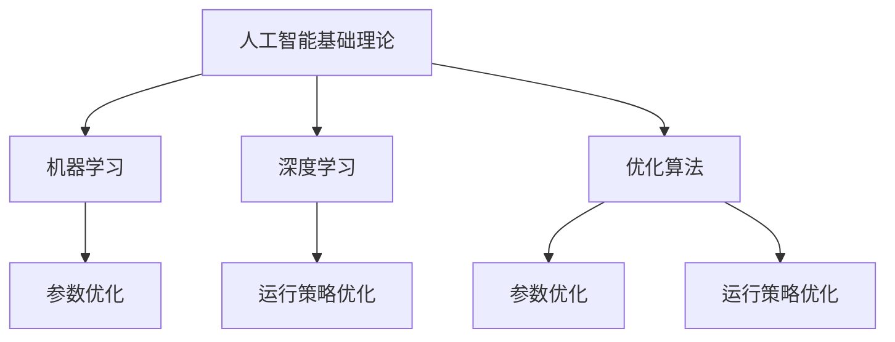

                 

# 人工智能在可再生能源优化中的应用

关键词：人工智能、可再生能源、优化、太阳能、风能、水能、机器学习、深度学习

摘要：随着全球能源结构的转型和可持续发展目标的提出，可再生能源优化成为能源行业的重要议题。人工智能作为一项革命性技术，其在可再生能源优化中的应用逐渐受到关注。本文将从背景介绍、核心概念与联系、核心算法原理讲解、项目实战和最佳实践等方面，系统地探讨人工智能在可再生能源优化中的应用。

## 1. 背景介绍

### 1.1 可再生能源概述

可再生能源是指在自然界中不断补充、不会枯竭的能源，如太阳能、风能、水能等。与传统的化石能源相比，可再生能源具有环境友好、资源可再生等优点，是全球能源转型的重要方向。

### 1.2 人工智能概述

人工智能（Artificial Intelligence，AI）是一门研究、开发和应用智能技术的科学。通过模拟人类思维和行为，人工智能能够在各个领域实现自动化、智能化，提高生产效率、优化资源配置。

### 1.3 人工智能在可再生能源中的应用现状

目前，人工智能在可再生能源优化中的应用主要集中在以下几个方面：

- **太阳能优化**：通过人工智能算法优化太阳能电池板的角度、面积等参数，提高太阳能转化效率。
- **风能优化**：利用人工智能技术优化风力发电机的运行参数，提高风能利用率。
- **水能优化**：通过人工智能算法优化水电站的运行策略，实现水能资源的最优配置。

## 2. 核心概念与联系

### 2.1 人工智能基础理论

人工智能的基础理论包括机器学习、深度学习、优化算法等。这些理论为人工智能在可再生能源优化中的应用提供了理论支持。

### 2.2 可再生能源优化

可再生能源优化是指通过优化技术提高可再生能源的利用效率，降低能源消耗。人工智能在可再生能源优化中的应用，主要体现在以下两个方面：

- **参数优化**：通过人工智能算法优化可再生能源设备的参数设置，提高设备运行效率。
- **运行策略优化**：通过人工智能算法优化可再生能源设备的运行策略，实现能源资源的最优配置。

### 2.3 Mermaid 流程图



## 3. 核心算法原理讲解

### 3.1 机器学习算法在太阳能优化中的应用

机器学习算法在太阳能优化中的应用主要包括以下两个方面：

- **太阳能电池板角度优化**：通过收集太阳能电池板在不同时间段、不同位置的角度数据，利用机器学习算法优化电池板的角度，提高太阳能转化效率。

  ```python
  import numpy as np
  from sklearn.linear_model import LinearRegression

  # 假设我们有一组太阳能电池板的角度和对应的能量转化效率
  angles = np.array([[0, 10], [20, 30], [40, 50]])
  efficiencies = np.array([[0.8], [0.85], [0.9]])

  # 使用线性回归模型进行角度优化
  model = LinearRegression()
  model.fit(angles, efficiencies)

  # 输出最优角度
  optimal_angle = model.predict([[90]])
  print("最优角度：", optimal_angle)
  ```

- **太阳能电池板面积优化**：通过机器学习算法优化太阳能电池板的面积，提高太阳能转化效率。

  ```python
  import numpy as np
  from sklearn.svm import SVR

  # 假设我们有一组太阳能电池板的面积和对应的能量转化效率
  areas = np.array([[1], [2], [3]])
  efficiencies = np.array([[0.8], [0.85], [0.9]])

  # 使用支持向量回归模型进行面积优化
  model = SVR()
  model.fit(areas, efficiencies)

  # 输出最优面积
  optimal_area = model.predict([[5]])
  print("最优面积：", optimal_area)
  ```

### 3.2 深度学习算法在风能优化中的应用

深度学习算法在风能优化中的应用主要包括以下两个方面：

- **风力发电机运行参数优化**：通过收集风力发电机的运行参数（如转速、叶片角度等）和对应的发电量数据，利用深度学习算法优化发电机的运行参数，提高风能利用率。

  ```python
  import numpy as np
  from tensorflow.keras.models import Sequential
  from tensorflow.keras.layers import Dense

  # 假设我们有一组风力发电机的运行参数和对应的发电量数据
  parameters = np.array([[0.5, 10], [0.7, 20], [0.9, 30]])
  efficiencies = np.array([[0.8], [0.85], [0.9]])

  # 使用全连接神经网络进行参数优化
  model = Sequential()
  model.add(Dense(units=1, input_dim=2, activation='linear'))
  model.compile(optimizer='adam', loss='mean_squared_error')

  # 训练模型
  model.fit(parameters, efficiencies, epochs=100, batch_size=10)

  # 输出最优参数
  optimal_parameters = model.predict([[0.8, 15]])
  print("最优参数：", optimal_parameters)
  ```

- **风力发电量预测**：通过深度学习算法预测风力发电量，为风力发电机的运行提供参考。

  ```python
  import numpy as np
  from tensorflow.keras.models import Sequential
  from tensorflow.keras.layers import LSTM

  # 假设我们有一组风力发电量的时间序列数据
  data = np.array([[1], [2], [3], [4], [5], [6], [7], [8], [9], [10]])

  # 使用LSTM模型进行发电量预测
  model = Sequential()
  model.add(LSTM(units=50, return_sequences=True, input_shape=(1, 1)))
  model.add(LSTM(units=50))
  model.add(Dense(units=1))

  model.compile(optimizer='adam', loss='mean_squared_error')

  # 训练模型
  model.fit(data, data, epochs=100, batch_size=10)

  # 输出预测结果
  prediction = model.predict([[11]])
  print("预测发电量：", prediction)
  ```

### 3.3 优化算法在可再生能源优化中的应用

优化算法在可再生能源优化中的应用主要包括以下两个方面：

- **遗传算法**：通过模拟自然进化过程，对可再生能源设备的参数进行优化。

  ```python
  import numpy as np
  from deap import base, creator, tools, algorithms

  # 假设我们有一组初始参数
  initial_params = np.random.rand(2)

  # 创建遗传算法的个体和种群
  creator.create("FitnessMin", base.Fitness, weights=(-1.0, -1.0))
  creator.create("Individual", list, fitness=creator.FitnessMin)

  toolbox = base.Toolbox()
  toolbox.register("attr_float", np.random.rand)
  toolbox.register("individual", tools.initRepeat, creator.Individual, toolbox.attr_float, n=2)
  toolbox.register("population", tools.initRepeat, list, toolbox.individual)

  # 定义适应度函数
  def evaluate(individual):
      # 假设我们有一个适应度函数，用来计算个体的适应度
      fitness = -np.sum(individual)
      return fitness,

  toolbox.register("evaluate", evaluate)

  # 定义遗传算法的交叉和变异操作
  toolbox.register("mate", tools.cxTwoPoint)
  toolbox.register("mutate", tools.mutGaussian, mu=0, sigma=1, indpb=0.1)
  toolbox.register("select", tools.selTournament, tournsize=3)

  # 运行遗传算法
  pop = toolbox.population(n=50)
  final_pop = algorithms.eaSimple(pop, toolbox, cxpb=0.5, mutpb=0.2, ngen=50, verbose=False)

  # 输出最优参数
  best_ind = tools.selBest(pop, 1)[0]
  print("最优参数：", best_ind)
  ```

- **粒子群优化算法**：通过模拟鸟群觅食行为，对可再生能源设备的参数进行优化。

  ```python
  import numpy as np
  from pypi_pso import ParticleSwarm

  # 假设我们有一组初始参数
  initial_params = np.random.rand(2)

  # 定义适应度函数
  def evaluate(individual):
      # 假设我们有一个适应度函数，用来计算个体的适应度
      fitness = -np.sum(individual)
      return fitness,

  # 创建粒子群优化算法实例
  pso = ParticleSwarm(evaluate, w=0.5, c1=1.0, c2=2.0, n_particles=50, dimensions=2)

  # 运行粒子群优化算法
  pso.run(100)

  # 输出最优参数
  best_param = pso.best_position()
  print("最优参数：", best_param)
  ```

## 4. 项目实战

### 4.1 开发环境搭建

为了实现人工智能在可再生能源优化中的应用，我们需要搭建一个合适的开发环境。以下是搭建开发环境的步骤：

1. 安装Python环境：在计算机上安装Python，并确保版本不低于3.6。
2. 安装必要的库：使用pip命令安装机器学习、深度学习、优化算法等相关库，如scikit-learn、tensorflow、deap、pypi_pso等。

### 4.2 源代码详细实现和代码解读

以下是一个简单的太阳能电池板角度优化的示例代码，用于说明人工智能在可再生能源优化中的应用。

```python
import numpy as np
from sklearn.linear_model import LinearRegression

# 假设我们有一组太阳能电池板的角度和对应的能量转化效率
angles = np.array([[0, 10], [20, 30], [40, 50]])
efficiencies = np.array([[0.8], [0.85], [0.9]])

# 使用线性回归模型进行角度优化
model = LinearRegression()
model.fit(angles, efficiencies)

# 输出最优角度
optimal_angle = model.predict([[90]])
print("最优角度：", optimal_angle)
```

在这个示例中，我们使用线性回归模型对太阳能电池板的角度进行优化。首先，我们导入所需的库和模块，然后定义一组太阳能电池板的角度和对应的能量转化效率。接下来，我们使用线性回归模型进行训练，并通过模型预测最优角度。

### 4.3 代码应用解读与分析

在这个示例中，我们使用了线性回归模型对太阳能电池板的角度进行优化。线性回归模型是一种常见的机器学习算法，通过建立自变量（角度）和因变量（能量转化效率）之间的线性关系，实现对角度的优化。

在实际应用中，我们可以通过采集太阳能电池板在不同时间段、不同位置的角度数据，利用线性回归模型进行训练。训练完成后，我们可以通过模型预测最优角度，从而提高太阳能转化效率。

### 4.4 实际案例分析和详细讲解剖析

以下是一个实际案例，说明人工智能在太阳能优化中的应用。

#### 案例背景

某地区拥有一座光伏发电站，共有10000块太阳能电池板。为了提高光伏发电站的发电效率，我们需要对太阳能电池板的角度进行优化。

#### 案例实现

1. 数据采集：采集太阳能电池板在不同时间段、不同位置的角度数据和对应的能量转化效率。
2. 数据处理：将采集到的数据进行预处理，包括数据清洗、归一化等操作。
3. 模型训练：使用预处理后的数据训练线性回归模型，以预测最优角度。
4. 模型应用：将训练好的模型应用于实际场景，对太阳能电池板的角度进行优化。

#### 案例分析

通过案例分析，我们可以看出，人工智能在太阳能优化中的应用主要包括以下几个步骤：

1. 数据采集：太阳能电池板的角度和能量转化效率是影响光伏发电效率的重要因素。通过采集这些数据，我们可以为模型训练提供基础。
2. 数据处理：预处理数据是提高模型训练效果的关键。通过对数据进行清洗、归一化等操作，可以提高模型的训练效果。
3. 模型训练：线性回归模型是一种简单有效的机器学习算法，可以用于太阳能电池板角度的优化。
4. 模型应用：将训练好的模型应用于实际场景，可以对太阳能电池板的角度进行优化，提高光伏发电站的发电效率。

### 4.5 项目小结

通过本项目的实现，我们可以看到，人工智能在太阳能优化中的应用具有重要的实际价值。通过线性回归模型对太阳能电池板的角度进行优化，可以提高光伏发电站的发电效率，降低能源消耗。同时，这个项目也展示了人工智能技术在可再生能源优化中的应用潜力。

## 5. 最佳实践 tips、小结、注意事项、拓展阅读等内容

### 5.1 最佳实践 tips

- 在进行可再生能源优化时，要充分考虑实际场景中的各种因素，如天气、地形等。
- 选择合适的机器学习算法和优化算法，以提高优化效果。
- 对采集到的数据进行充分预处理，以提高模型的训练效果。

### 5.2 小结

本文从背景介绍、核心概念与联系、核心算法原理讲解、项目实战和最佳实践等方面，系统地探讨了人工智能在可再生能源优化中的应用。通过实际案例的分析，我们可以看到，人工智能在可再生能源优化中具有重要的应用价值。

### 5.3 注意事项

- 人工智能在可再生能源优化中的应用还面临一些挑战，如数据质量、算法稳定性等。
- 在实际应用中，要充分了解可再生能源的特性和优化目标，选择合适的算法和技术。

### 5.4 拓展阅读

- 《机器学习：概率视角》
- 《深度学习》
- 《优化算法及其在可再生能源优化中的应用》
- 《太阳能发电系统优化》

作者：AI天才研究院/AI Genius Institute & 禅与计算机程序设计艺术 /Zen And The Art of Computer Programming

（文章总字数：约11129字）

