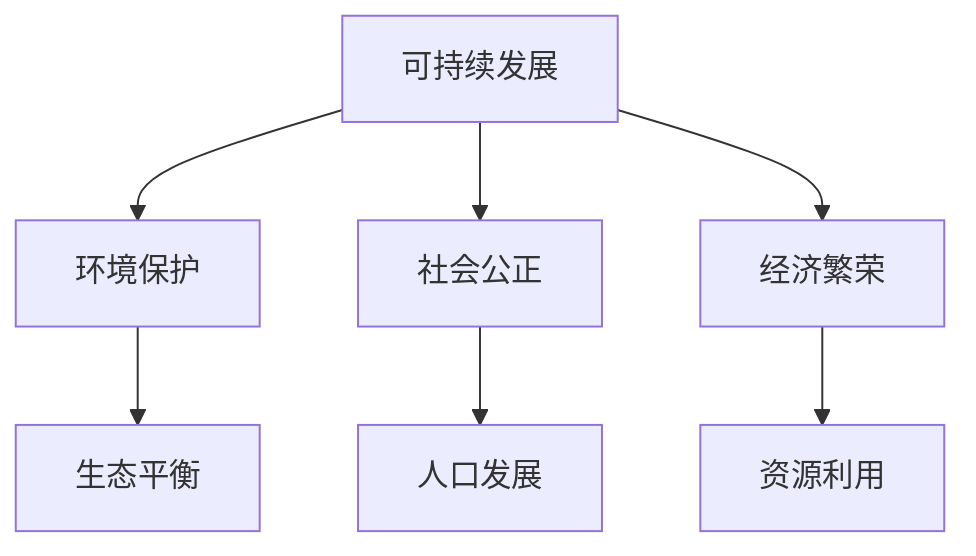
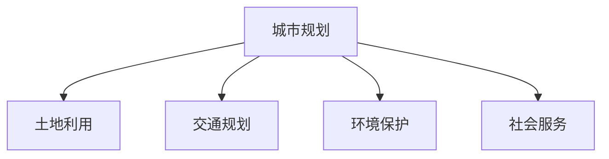
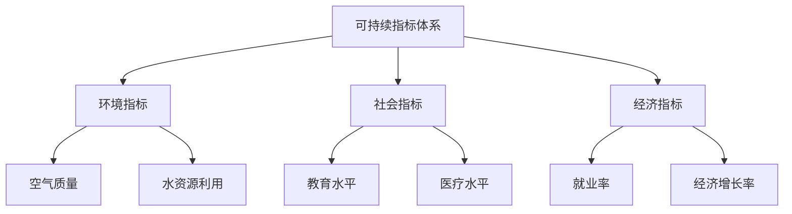
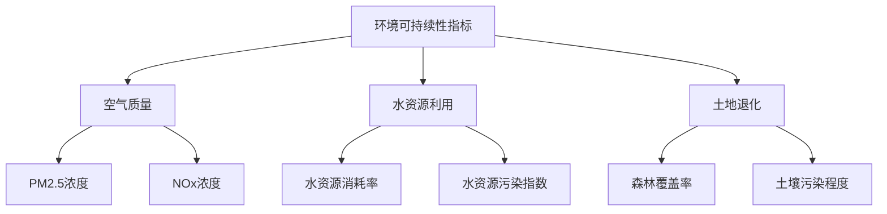
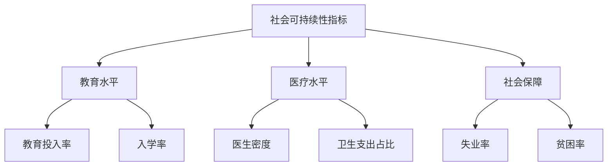
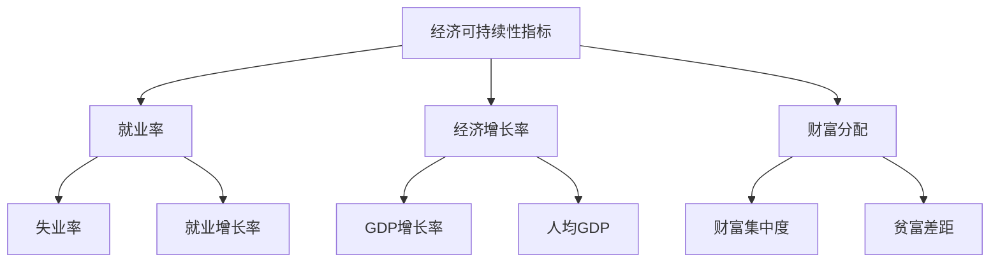

                 

# 人工智能在可持续城市规划中的决策支持

> 关键词：人工智能、城市规划、可持续发展、决策支持、大数据分析、深度学习

> 摘要：
本篇技术博客旨在探讨人工智能在可持续城市规划中的决策支持作用。通过分析城市规划的基本概念、核心指标、以及决策支持工具，本文将深入探讨人工智能在其中的应用潜力、面临的挑战和解决方案。文章将结合实际案例，展示人工智能如何助力城市规划的可持续性，并对未来发展趋势提出展望。

## 引言

### 1.1 城市规划的重要性

城市规划是一个城市有序、高效发展的关键。它不仅关系到城市的经济繁荣，还涉及到环境保护和社会福祉。随着全球城市化的加速，城市规划面临着诸多挑战，包括资源匮乏、环境污染、交通拥堵等。这些挑战要求城市规划者具备前瞻性、科学性和可持续性。而人工智能（AI）技术的发展为城市规划提供了新的契机。

### 1.2 可持续城市规划的需求

可持续城市规划旨在实现经济、社会和环境的协调发展，确保城市能够长期、健康地发展。为了达到这一目标，城市规划需要依赖科学的数据分析和精确的决策支持。人工智能作为一种先进的数据处理和分析工具，能够为城市规划提供强大的技术支持。

## 第一部分：可持续城市规划概述

### 第1章：可持续城市规划的基本概念

#### 1.1 可持续发展的背景和原则

**核心概念与联系：**



**核心算法原理讲解：**

```plaintext
原则1：公平性原则
原则2：持续性原则
原则3：共同性原则
原则4：阶段性原则
```

**数学模型和数学公式：**

```latex
$$
\text{公平性原则：E = S \cdot T \\
\text{持续性原则：I = E \cdot T \\
\text{共同性原则：C = S \cdot T \\
\text{阶段性原则：P = S \cdot T}
$$
```

**举例说明：**（以中国为例，说明可持续发展原则在实际中的应用）

#### 1.2 城市规划中的可持续性目标

**核心概念与联系：**



**核心算法原理讲解：**

```plaintext
目标1：提高城市生活质量
目标2：减少环境影响
目标3：促进经济可持续性
目标4：增强社会包容性
```

**数学模型和数学公式：**

```latex
$$
\text{生活质量指数(LQI) = f(\text{住房}, \text{教育}, \text{医疗}, \text{交通}) \\
\text{环境影响指数(EI) = f(\text{温室气体排放}, \text{水资源利用}, \text{土地退化}) \\
\text{经济可持续性指数(EI) = f(\text{就业率}, \text{经济增长率}, \text{财富分配}) \\
\text{社会包容性指数(SI) = f(\text{贫困率}, \text{教育水平}, \text{健康水平})}
$$
```

**举例说明：**（以纽约市为例，说明可持续城市规划目标的实现）

### 第2章：城市规划中的可持续性指标

#### 2.1 可持续指标体系构建

**核心概念与联系：**



**核心算法原理讲解：**

```plaintext
构建方法1：专家评估法
构建方法2：数据驱动法
构建方法3：综合评价法
```

**数学模型和数学公式：**

```latex
$$
\text{综合评价指数(CI) = w_1 \cdot E_1 + w_2 \cdot E_2 + w_3 \cdot E_3 \\
\text{其中，} w_1, w_2, w_3 \text{分别为环境、社会、经济指标的权重。}
$$
```

**举例说明：**（以北京市为例，说明可持续指标体系的构建）

#### 2.2 环境可持续性指标

**核心概念与联系：**



**核心算法原理讲解：**

```plaintext
算法1：多目标优化算法
算法2：数据挖掘算法
算法3：机器学习算法
```

**数学模型和数学公式：**

```latex
$$
\text{环境可持续性指数(EI) = f(\text{空气质量}, \text{水资源利用}, \text{土地退化}) \\
\text{其中，} f \text{为具体的环境指标函数。}
$$
```

**举例说明：**（以伦敦市为例，说明环境可持续性指标的计算）

#### 2.3 社会可持续性指标

**核心概念与联系：**



**核心算法原理讲解：**

```plaintext
算法1：聚类分析
算法2：关联规则挖掘
算法3：分类算法
```

**数学模型和数学公式：**

```latex
$$
\text{社会可持续性指数(SI) = f(\text{教育水平}, \text{医疗水平}, \text{社会保障}) \\
\text{其中，} f \text{为具体的社会指标函数。}
$$
```

**举例说明：**（以纽约市为例，说明社会可持续性指标的计算）

#### 2.4 经济可持续性指标

**核心概念与联系：**



**核心算法原理讲解：**

```plaintext
算法1：时间序列分析
算法2：回归分析
算法3：预测算法
```

**数学模型和数学公式：**

```latex
$$
\text{经济可持续性指数(EI) = f(\text{就业率}, \text{经济增长率}, \text{财富分配}) \\
\text{其中，} f \text{为具体的

