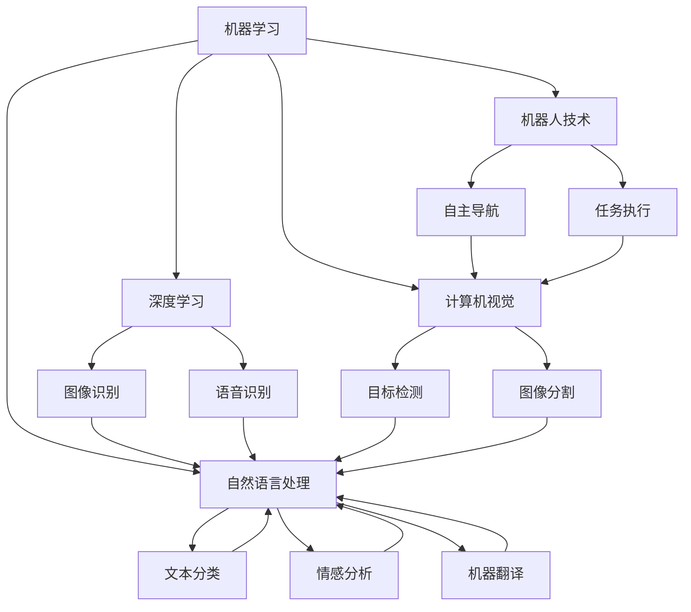
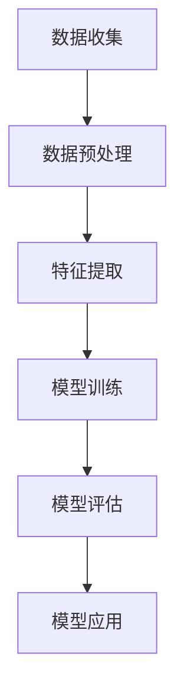

                 

### 引言

#### 1.1 可持续时尚的背景与重要性

可持续时尚，是指通过减少环境污染、资源浪费和碳排放，实现时尚产业可持续发展的一种时尚理念。随着全球气候变化的加剧和环境问题的日益严重，可持续时尚成为了一个热门话题。在时尚产业中，服装生产和消费环节产生的大量废弃物、污染和碳排放已经成为全球环境问题的重要来源之一。

据统计，时尚产业每年产生的废弃物量高达1000万吨，占全球废弃物量的10%以上。同时，纺织业也是全球第二大用水行业，每年消耗的水资源高达5000亿升，占全球用水量的20%。此外，时尚产业每年产生的二氧化碳排放量高达100亿吨，占全球总排放量的4%。

这些数据表明，时尚产业在可持续发展方面面临的挑战十分严峻。为了应对这一挑战，越来越多的时尚品牌和设计师开始关注可持续时尚，并采取了一系列措施，如使用可再生材料、减少生产环节的废弃物和碳排放、推广循环利用和回收再利用等。

#### 1.2 人工智能的基本原理

人工智能（Artificial Intelligence, AI）是计算机科学的一个分支，旨在使计算机具备人类智能，包括学习、推理、感知、理解和决策能力。人工智能的发展历程可以追溯到20世纪50年代，随着计算能力和算法研究的不断进步，人工智能在各个领域得到了广泛应用。

人工智能的核心技术包括机器学习、深度学习、计算机视觉、自然语言处理等。这些技术通过算法和模型的训练，使计算机能够从数据中学习和提取规律，从而实现自动化决策和智能应用。

#### 1.3 人工智能在时尚设计中的应用概述

人工智能在时尚设计中的应用主要集中在以下几个方面：

1. **时尚预测与分析**：通过分析大量时尚数据和消费者行为，人工智能可以预测未来的时尚趋势，帮助设计师和品牌制定更精准的市场策略。
   
2. **服装设计**：利用计算机视觉和生成对抗网络（GAN），人工智能可以自动生成新的服装设计，为设计师提供灵感。

3. **个性化推荐**：基于用户行为和偏好，人工智能可以为消费者提供个性化的时尚推荐，提升购物体验。

4. **生产优化**：通过优化生产流程和供应链管理，人工智能可以减少生产环节的浪费和碳排放，实现更高效、更可持续的生产。

总之，人工智能在可持续时尚设计中的应用不仅有助于解决环境问题，还能提升时尚产业的生产效率和消费者体验，具有重要的现实意义和广阔的发展前景。

#### 1.4 本篇文章的目的与结构

本文旨在深入探讨人工智能在可持续时尚设计中的应用，帮助读者了解这一领域的核心概念、技术原理和应用实践。文章结构分为以下六个部分：

1. 引言：介绍可持续时尚和人工智能的背景与重要性。
2. 人工智能核心概念与联系：讲解人工智能的基本原理和技术架构。
3. 人工智能核心算法原理讲解：详细介绍机器学习和深度学习算法。
4. 数学模型和公式：讲解与人工智能相关的数学模型和公式。
5. 项目实战：通过实际案例展示人工智能在时尚设计中的应用。
6. 总结与展望：总结文章内容，展望人工智能在可持续时尚设计中的未来发展趋势。

通过这篇文章，读者可以全面了解人工智能在可持续时尚设计中的应用，掌握相关技术和方法，为实际应用提供参考。

### 关键词

- 可持续时尚
- 人工智能
- 时尚预测
- 服装设计
- 个性化推荐
- 生产优化

### 摘要

本文探讨了人工智能在可持续时尚设计中的应用，介绍了可持续时尚的背景和重要性，以及人工智能的基本原理和技术架构。通过分析人工智能在时尚预测、服装设计、个性化推荐和生产优化等方面的应用，本文展示了人工智能在提升时尚产业可持续发展能力方面的潜力。文章最后通过实际案例，详细讲解了人工智能在可持续时尚设计中的应用实践，为读者提供了实用的参考。

---

### 第一部分：引言

#### 1.1 可持续时尚的背景与重要性

可持续时尚，顾名思义，是指在时尚产业中考虑环境、社会和经济可持续性的设计和生产方式。随着全球气候变化的加剧和资源的日益匮乏，时尚产业面临的可持续发展问题日益突出。传统时尚产业的高能耗、高污染和高浪费现象已经严重威胁到地球的生态系统，因此，可持续时尚的设计和推广成为了一个亟待解决的问题。

首先，让我们来看一下时尚产业的具体问题。据估计，全球时尚产业每年产生的二氧化碳排放量高达100亿吨，占全球总排放量的4%。同时，时尚产业也是全球第二大用水行业，每年消耗的水资源高达5000亿升，占全球用水量的20%。此外，时尚产业产生的废弃物量也相当惊人，每年高达1000万吨，占全球废弃物量的10%以上。这些问题不仅对环境造成了巨大的负担，也对人类的健康和福祉产生了负面影响。

为了解决这些问题，可持续时尚的理念应运而生。可持续时尚不仅关注服装的环保材料和生产过程，还强调减少浪费、提高资源利用率和减少碳排放。它倡导使用可再生、可降解或可回收的材料，优化生产流程，减少废弃物和碳排放，以及推广循环利用和回收再利用。

可持续时尚的重要性体现在以下几个方面：

1. **环境保护**：通过减少污染和资源浪费，可持续时尚有助于保护地球的生态环境，减少对自然资源的依赖。
2. **社会责任**：可持续时尚鼓励时尚品牌和设计师承担社会责任，关注劳动者的权益和福利，推动社会公平和正义。
3. **经济效益**：可持续时尚不仅有助于减少生产成本，提高资源利用率，还可以提升品牌的声誉和市场竞争力。
4. **消费趋势**：随着消费者环保意识的提高，越来越多的消费者开始青睐可持续时尚产品，这为时尚产业带来了新的商机。

总之，可持续时尚不仅是时尚产业可持续发展的必然选择，也是全球应对环境挑战的重要途径。通过推广可持续时尚，我们可以实现经济、社会和环境的协调发展，为未来创造更加美好的世界。

#### 1.2 人工智能的基本原理

人工智能（Artificial Intelligence, AI）是计算机科学的一个重要分支，旨在通过模拟人类智能的行为和思维方式，使计算机具备学习和解决问题的能力。人工智能的发展可以追溯到20世纪50年代，当时科学家们首次提出了智能机器的概念。随着计算机技术和算法研究的不断进步，人工智能逐渐从理论研究走向实际应用，并在各个领域取得了显著的成果。

首先，我们需要了解人工智能的基本原理。人工智能的核心思想是通过算法和计算模型，使计算机能够从数据中学习和提取知识，从而实现智能行为。这个过程通常包括以下几个关键步骤：

1. **数据收集**：首先，需要收集大量的数据，这些数据可以是结构化的（如数据库中的信息）或非结构化的（如图像、文本、声音等）。
2. **数据预处理**：收集到的数据通常需要进行清洗、格式化和标准化处理，以便后续的分析和建模。
3. **特征提取**：在数据预处理之后，需要从数据中提取有用的特征，这些特征将用于训练模型。
4. **模型训练**：使用提取的特征数据，通过机器学习算法训练模型，使模型能够识别数据中的规律和模式。
5. **模型评估**：通过测试数据对训练好的模型进行评估，以确定其性能和准确性。
6. **模型应用**：将训练好的模型应用到实际场景中，解决具体问题。

人工智能的核心技术包括以下几个方面：

1. **机器学习**：机器学习是一种通过算法让计算机从数据中学习的方法。它主要包括监督学习、非监督学习和强化学习三种类型。监督学习通过已标记的数据训练模型，用于预测和分类任务；非监督学习通过未标记的数据发现数据中的结构和模式；强化学习通过试错和反馈不断优化行为策略。

2. **深度学习**：深度学习是机器学习的一个分支，它通过构建深度神经网络模型，对大量数据进行训练，从而实现复杂的任务。深度学习在图像识别、语音识别、自然语言处理等领域取得了显著的成果。

3. **计算机视觉**：计算机视觉是一种使计算机能够理解和解析图像和视频的技术。通过图像识别、目标检测、图像分割等技术，计算机可以自动识别和理解视觉信息。

4. **自然语言处理**：自然语言处理是一种使计算机能够理解和处理人类语言的技术。它包括文本分类、情感分析、机器翻译等任务，是人工智能的重要应用领域之一。

5. **机器人技术**：机器人技术是人工智能在工程应用中的一个重要领域，它涉及机器人的设计、制造和控制。通过人工智能技术，机器人可以执行复杂的任务，如制造、服务、医疗等。

总之，人工智能通过其先进的算法和计算能力，已经在各个领域展现了巨大的潜力。随着技术的不断进步，人工智能将在未来继续发挥重要作用，推动社会和经济的可持续发展。

#### 1.3 人工智能在时尚设计中的应用概述

人工智能在时尚设计中的应用正逐渐成为行业的一大热点。随着技术的不断进步和数据的不断积累，人工智能在时尚产业中展现出了巨大的潜力，不仅提高了设计的效率，还提升了产业的可持续发展水平。以下是一些主要的人工智能应用领域：

1. **时尚预测与分析**：
   人工智能可以通过分析历史销售数据、社交媒体趋势、消费者行为等，预测未来的时尚趋势。这不仅可以帮助设计师提前准备新款设计，还可以帮助品牌制定更有效的市场策略。例如，一些时尚品牌已经开始使用机器学习算法来分析社交媒体上的评论和趋势，从而预测下一季的流行款式。

2. **服装设计**：
   利用计算机视觉和生成对抗网络（GAN），人工智能可以自动生成新的服装设计。这些设计不仅能够提供设计师新的灵感，还可以通过自动化流程缩短设计周期，提高生产效率。例如，AI系统可以通过学习大量的时尚图片，自动生成各种风格的服装设计草图，供设计师参考。

3. **个性化推荐**：
   基于用户的行为数据和偏好，人工智能可以为消费者提供个性化的时尚推荐。这种个性化服务不仅提升了消费者的购物体验，还可以增加品牌对消费者的吸引力。例如，一些电商平台利用机器学习算法，分析用户的浏览和购买记录，为用户推荐最可能感兴趣的商品。

4. **生产优化**：
   人工智能可以通过优化生产流程和供应链管理，减少生产环节的浪费和碳排放，实现更高效、更可持续的生产。例如，一些服装制造商已经开始使用人工智能来优化生产线的调度和物料管理，从而提高生产效率和减少成本。

5. **智能配饰**：
   人工智能还可以应用于智能配饰的设计和制造，如智能手表、智能手环等。这些设备不仅能够提供健康监测、运动记录等功能，还可以通过时尚的外观设计，提升用户的时尚体验。

总之，人工智能在时尚设计中的应用已经深入到各个环节，不仅提升了设计效率，还推动了时尚产业的可持续发展。随着技术的不断进步，人工智能在时尚设计中的应用前景将更加广阔。

#### 1.4 本篇文章的目的与结构

本文旨在深入探讨人工智能在可持续时尚设计中的应用，帮助读者了解这一领域的核心概念、技术原理和应用实践。文章结构分为以下六个部分：

1. **引言**：介绍可持续时尚和人工智能的背景与重要性。
2. **人工智能核心概念与联系**：讲解人工智能的基本原理和技术架构。
3. **人工智能核心算法原理讲解**：详细介绍机器学习和深度学习算法。
4. **数学模型和公式**：讲解与人工智能相关的数学模型和公式。
5. **项目实战**：通过实际案例展示人工智能在时尚设计中的应用。
6. **总结与展望**：总结文章内容，展望人工智能在可持续时尚设计中的未来发展趋势。

通过这篇文章，读者可以全面了解人工智能在可持续时尚设计中的应用，掌握相关技术和方法，为实际应用提供参考。

### 关键词

- 可持续时尚
- 人工智能
- 时尚预测
- 服装设计
- 个性化推荐
- 生产优化

### 摘要

本文探讨了人工智能在可持续时尚设计中的应用，介绍了可持续时尚的背景和重要性，以及人工智能的基本原理和技术架构。通过分析人工智能在时尚预测、服装设计、个性化推荐和生产优化等方面的应用，本文展示了人工智能在提升时尚产业可持续发展能力方面的潜力。文章最后通过实际案例，详细讲解了人工智能在可持续时尚设计中的应用实践，为读者提供了实用的参考。

---

### 第一部分：引言

#### 1.1 可持续时尚的背景与重要性

可持续时尚是一种旨在通过减少环境污染、资源浪费和碳排放，实现时尚产业可持续发展的一种设计理念和商业模式。随着全球气候变化的加剧和资源的日益匮乏，时尚产业面临的可持续发展问题日益突出。传统时尚产业的高能耗、高污染和高浪费现象已经成为全球环境问题的重要来源之一。

首先，让我们来看一下时尚产业的具体问题。据估计，全球时尚产业每年产生的二氧化碳排放量高达100亿吨，占全球总排放量的4%。同时，纺织业也是全球第二大用水行业，每年消耗的水资源高达5000亿升，占全球用水量的20%。此外，时尚产业产生的废弃物量也相当惊人，每年高达1000万吨，占全球废弃物量的10%以上。这些问题不仅对环境造成了巨大的负担，也对人类的健康和福祉产生了负面影响。

为了解决这些问题，可持续时尚的理念应运而生。可持续时尚不仅关注服装的环保材料和生产过程，还强调减少浪费、提高资源利用率和减少碳排放，以及推广循环利用和回收再利用。它倡导使用可再生、可降解或可回收的材料，优化生产流程，减少废弃物和碳排放。

可持续时尚的重要性体现在以下几个方面：

1. **环境保护**：通过减少污染和资源浪费，可持续时尚有助于保护地球的生态环境，减少对自然资源的依赖。
2. **社会责任**：可持续时尚鼓励时尚品牌和设计师承担社会责任，关注劳动者的权益和福利，推动社会公平和正义。
3. **经济效益**：可持续时尚不仅有助于减少生产成本，提高资源利用率，还可以提升品牌的声誉和市场竞争力。
4. **消费趋势**：随着消费者环保意识的提高，越来越多的消费者开始青睐可持续时尚产品，这为时尚产业带来了新的商机。

总之，可持续时尚不仅是时尚产业可持续发展的必然选择，也是全球应对环境挑战的重要途径。通过推广可持续时尚，我们可以实现经济、社会和环境的协调发展，为未来创造更加美好的世界。

#### 1.2 人工智能的基本原理

人工智能（Artificial Intelligence, AI）是计算机科学的一个重要分支，旨在通过模拟人类智能的行为和思维方式，使计算机具备学习和解决问题的能力。人工智能的发展可以追溯到20世纪50年代，当时科学家们首次提出了智能机器的概念。随着计算机技术和算法研究的不断进步，人工智能逐渐从理论研究走向实际应用，并在各个领域取得了显著的成果。

首先，我们需要了解人工智能的基本原理。人工智能的核心思想是通过算法和计算模型，使计算机能够从数据中学习和提取知识，从而实现智能行为。这个过程通常包括以下几个关键步骤：

1. **数据收集**：首先，需要收集大量的数据，这些数据可以是结构化的（如数据库中的信息）或非结构化的（如图像、文本、声音等）。
2. **数据预处理**：收集到的数据通常需要进行清洗、格式化和标准化处理，以便后续的分析和建模。
3. **特征提取**：在数据预处理之后，需要从数据中提取有用的特征，这些特征将用于训练模型。
4. **模型训练**：使用提取的特征数据，通过机器学习算法训练模型，使模型能够识别数据中的规律和模式。
5. **模型评估**：通过测试数据对训练好的模型进行评估，以确定其性能和准确性。
6. **模型应用**：将训练好的模型应用到实际场景中，解决具体问题。

人工智能的核心技术包括以下几个方面：

1. **机器学习**：机器学习是一种通过算法让计算机从数据中学习的方法。它主要包括监督学习、非监督学习和强化学习三种类型。监督学习通过已标记的数据训练模型，用于预测和分类任务；非监督学习通过未标记的数据发现数据中的结构和模式；强化学习通过试错和反馈不断优化行为策略。

2. **深度学习**：深度学习是机器学习的一个分支，它通过构建深度神经网络模型，对大量数据进行训练，从而实现复杂的任务。深度学习在图像识别、语音识别、自然语言处理等领域取得了显著的成果。

3. **计算机视觉**：计算机视觉是一种使计算机能够理解和解析图像和视频的技术。通过图像识别、目标检测、图像分割等技术，计算机可以自动识别和理解视觉信息。

4. **自然语言处理**：自然语言处理是一种使计算机能够理解和处理人类语言的技术。它包括文本分类、情感分析、机器翻译等任务，是人工智能的重要应用领域之一。

5. **机器人技术**：机器人技术是人工智能在工程应用中的一个重要领域，它涉及机器人的设计、制造和控制。通过人工智能技术，机器人可以执行复杂的任务，如制造、服务、医疗等。

总之，人工智能通过其先进的算法和计算能力，已经在各个领域展现了巨大的潜力。随着技术的不断进步，人工智能将在未来继续发挥重要作用，推动社会和经济的可持续发展。

#### 1.3 人工智能在时尚设计中的应用概述

人工智能在时尚设计中的应用正逐渐成为行业的一大热点。随着技术的不断进步和数据的不断积累，人工智能在时尚产业中展现出了巨大的潜力，不仅提高了设计的效率，还推动了产业的可持续发展。以下是一些主要的人工智能应用领域：

1. **时尚预测与分析**：
   人工智能可以通过分析历史销售数据、社交媒体趋势、消费者行为等，预测未来的时尚趋势。这不仅可以帮助设计师提前准备新款设计，还可以帮助品牌制定更有效的市场策略。例如，一些时尚品牌已经开始使用机器学习算法来分析社交媒体上的评论和趋势，从而预测下一季的流行款式。

2. **服装设计**：
   利用计算机视觉和生成对抗网络（GAN），人工智能可以自动生成新的服装设计。这些设计不仅能够提供设计师新的灵感，还可以通过自动化流程缩短设计周期，提高生产效率。例如，AI系统可以通过学习大量的时尚图片，自动生成各种风格的服装设计草图，供设计师参考。

3. **个性化推荐**：
   基于用户的行为数据和偏好，人工智能可以为消费者提供个性化的时尚推荐。这种个性化服务不仅提升了消费者的购物体验，还可以增加品牌对消费者的吸引力。例如，一些电商平台利用机器学习算法，分析用户的浏览和购买记录，为用户推荐最可能感兴趣的商品。

4. **生产优化**：
   人工智能可以通过优化生产流程和供应链管理，减少生产环节的浪费和碳排放，实现更高效、更可持续的生产。例如，一些服装制造商已经开始使用人工智能来优化生产线的调度和物料管理，从而提高生产效率和减少成本。

5. **智能配饰**：
   人工智能还可以应用于智能配饰的设计和制造，如智能手表、智能手环等。这些设备不仅能够提供健康监测、运动记录等功能，还可以通过时尚的外观设计，提升用户的时尚体验。

总之，人工智能在时尚设计中的应用已经深入到各个环节，不仅提升了设计效率，还推动了时尚产业的可持续发展。随着技术的不断进步，人工智能在时尚设计中的应用前景将更加广阔。

#### 1.4 本篇文章的目的与结构

本文旨在深入探讨人工智能在可持续时尚设计中的应用，帮助读者了解这一领域的核心概念、技术原理和应用实践。文章结构分为以下六个部分：

1. **引言**：介绍可持续时尚和人工智能的背景与重要性。
2. **人工智能核心概念与联系**：讲解人工智能的基本原理和技术架构。
3. **人工智能核心算法原理讲解**：详细介绍机器学习和深度学习算法。
4. **数学模型和公式**：讲解与人工智能相关的数学模型和公式。
5. **项目实战**：通过实际案例展示人工智能在时尚设计中的应用。
6. **总结与展望**：总结文章内容，展望人工智能在可持续时尚设计中的未来发展趋势。

通过这篇文章，读者可以全面了解人工智能在可持续时尚设计中的应用，掌握相关技术和方法，为实际应用提供参考。

### 关键词

- 可持续时尚
- 人工智能
- 时尚预测
- 服装设计
- 个性化推荐
- 生产优化

### 摘要

本文探讨了人工智能在可持续时尚设计中的应用，介绍了可持续时尚的背景和重要性，以及人工智能的基本原理和技术架构。通过分析人工智能在时尚预测、服装设计、个性化推荐和生产优化等方面的应用，本文展示了人工智能在提升时尚产业可持续发展能力方面的潜力。文章最后通过实际案例，详细讲解了人工智能在可持续时尚设计中的应用实践，为读者提供了实用的参考。

---

### 人工智能核心概念与联系

#### 2.1 人工智能的核心概念

人工智能（Artificial Intelligence, AI）是计算机科学的一个分支，旨在通过模拟人类智能的行为和思维方式，使计算机具备学习和解决问题的能力。要深入了解人工智能，我们首先需要明确其核心概念。

1. **机器学习**：机器学习是一种通过算法让计算机从数据中学习的方法。它主要包括监督学习、非监督学习和强化学习三种类型。监督学习通过已标记的数据训练模型，用于预测和分类任务；非监督学习通过未标记的数据发现数据中的结构和模式；强化学习通过试错和反馈不断优化行为策略。

2. **深度学习**：深度学习是机器学习的一个分支，它通过构建深度神经网络模型，对大量数据进行训练，从而实现复杂的任务。深度学习在图像识别、语音识别、自然语言处理等领域取得了显著的成果。

3. **计算机视觉**：计算机视觉是一种使计算机能够理解和解析图像和视频的技术。通过图像识别、目标检测、图像分割等技术，计算机可以自动识别和理解视觉信息。

4. **自然语言处理**：自然语言处理是一种使计算机能够理解和处理人类语言的技术。它包括文本分类、情感分析、机器翻译等任务，是人工智能的重要应用领域之一。

5. **机器人技术**：机器人技术是人工智能在工程应用中的一个重要领域，它涉及机器人的设计、制造和控制。通过人工智能技术，机器人可以执行复杂的任务，如制造、服务、医疗等。

#### 2.2 人工智能的核心概念联系

理解人工智能的核心概念后，我们需要探讨这些概念之间的联系。人工智能的各个核心概念相互交织，共同构成了一个复杂的系统。

1. **机器学习与深度学习**：深度学习是机器学习的一种特殊形式，它通过多层神经网络进行训练，能够从数据中提取更复杂的特征和模式。深度学习在处理大规模数据和复杂任务时表现出色，因此成为了人工智能研究的热点。

2. **计算机视觉与自然语言处理**：计算机视觉和自然语言处理都是人工智能的重要领域，它们各自解决视觉和语言问题。然而，这两者之间存在紧密的联系。例如，在图像识别任务中，自然语言处理技术可以用来标注图像，从而提高图像识别的准确性。

3. **机器人技术与计算机视觉**：机器人技术依赖于计算机视觉来实现自主导航和任务执行。通过计算机视觉技术，机器人可以理解和解析环境，从而进行自主决策和行动。

4. **机器学习与机器人技术**：机器学习算法可以为机器人提供智能决策支持。例如，通过强化学习，机器人可以在复杂环境中不断学习和优化其行为策略。

为了更好地理解这些核心概念之间的联系，我们可以使用Mermaid流程图来展示它们之间的关系。

#### 2.3 人工智能的整体架构

除了核心概念之间的联系，我们还需要了解人工智能的整体架构。人工智能系统通常包括以下几个关键组成部分：

1. **数据收集**：数据是人工智能的基础，通过收集大量的数据，我们才能训练出高效的模型。
2. **数据预处理**：收集到的数据通常需要进行清洗、格式化和标准化处理，以便后续的分析和建模。
3. **特征提取**：在数据预处理之后，需要从数据中提取有用的特征，这些特征将用于训练模型。
4. **模型训练**：使用提取的特征数据，通过机器学习算法训练模型，使模型能够识别数据中的规律和模式。
5. **模型评估**：通过测试数据对训练好的模型进行评估，以确定其性能和准确性。
6. **模型应用**：将训练好的模型应用到实际场景中，解决具体问题。

以下是人工智能系统的整体架构的Mermaid流程图：

通过这些流程图，我们可以更直观地理解人工智能的核心概念和整体架构。这为我们后续的深入探讨打下了坚实的基础。

---

### 人工智能核心算法原理讲解

#### 3.1 机器学习算法

机器学习是人工智能的核心技术之一，通过算法让计算机从数据中学习，实现自动识别规律和做出预测。机器学习算法可以分为监督学习、非监督学习和强化学习三种类型，每种类型都有其独特的原理和应用场景。

##### 3.1.1 监督学习算法

监督学习算法是一种从标记数据中学习，并用于预测和分类的算法。它的工作原理是通过训练数据集，使模型学会将输入映射到已知的输出。监督学习算法主要包括以下几种：

1. **线性回归（Linear Regression）**：线性回归是一种用于预测连续值的监督学习算法。它假设输入变量与输出变量之间存在线性关系，并通过最小化误差平方和来拟合数据。线性回归的数学公式如下：

   $$
   y = wx + b
   $$
   
   其中，$y$ 是输出变量，$x$ 是输入变量，$w$ 是权重，$b$ 是偏置。

2. **支持向量机（Support Vector Machine, SVM）**：支持向量机是一种用于分类的监督学习算法。它通过找到一个最佳的超平面，将不同类别的数据点分隔开来。支持向量机的主要目标是最大化分类间隔，其数学公式如下：

   $$
   \max \left\{ w^T x - y \right\}
   $$
   
   其中，$w$ 是权重向量，$x$ 是支持向量，$y$ 是类标签。

##### 3.1.2 非监督学习算法

非监督学习算法是在没有标记数据的情况下，通过发现数据中的结构和模式来进行预测的算法。它主要包括以下几种：

1. **K-均值聚类（K-Means Clustering）**：K-均值聚类是一种基于距离的聚类算法。它通过将数据点分为K个簇，使得每个簇内的数据点之间距离最小，而簇与簇之间的距离最大。K-均值聚类的目标是找到最优的聚类中心，其数学公式如下：

   $$
   \text{Minimize} \sum_{i=1}^{k} \sum_{x \in S_i} \| x - \mu_i \|^2
   $$
   
   其中，$S_i$ 是第$i$ 个簇，$\mu_i$ 是第$i$ 个簇的中心。

2. **主成分分析（Principal Component Analysis, PCA）**：主成分分析是一种降维算法，它通过将数据投影到新的正交坐标系上，提取最重要的特征，从而降低数据维度。主成分分析的数学公式如下：

   $$
   Z = T \cdot X
   $$
   
   其中，$Z$ 是新空间中的数据，$T$ 是变换矩阵，$X$ 是原始数据。

##### 3.1.3 强化学习算法

强化学习算法是一种通过试错和反馈来学习最优策略的算法。它主要应用于动态环境中，需要不断调整行为以最大化累积奖励。强化学习算法主要包括以下几种：

1. **Q学习（Q-Learning）**：Q学习是一种基于值函数的强化学习算法。它通过估计状态-动作值函数，从而选择最优动作。Q学习的数学公式如下：

   $$
   Q(s, a) = r + \gamma \max_{a'} Q(s', a')
   $$
   
   其中，$s$ 是当前状态，$a$ 是当前动作，$s'$ 是下一状态，$a'$ 是下一动作，$r$ 是即时奖励，$\gamma$ 是折扣因子。

2. **深度强化学习（Deep Reinforcement Learning）**：深度强化学习是强化学习与深度学习相结合的一种方法，它通过构建深度神经网络来估计值函数或策略。深度强化学习的数学公式与Q学习类似，但使用神经网络来近似值函数或策略。

通过以上对机器学习算法的详细讲解，我们可以看到机器学习算法在人工智能应用中的重要性。接下来，我们将进一步探讨深度学习算法，以了解其在人工智能领域的强大能力。

#### 3.2 深度学习算法

深度学习是机器学习的一个重要分支，它通过构建多层的神经网络，从数据中自动提取特征和模式，从而实现复杂任务。深度学习算法在图像识别、语音识别、自然语言处理等领域取得了显著的成果，下面将详细介绍几种主要的深度学习算法。

##### 3.2.1 卷积神经网络（Convolutional Neural Network, CNN）

卷积神经网络是一种专门用于处理图像数据的深度学习算法。它通过卷积层、池化层和全连接层等结构，实现对图像的逐层特征提取和分类。以下是卷积神经网络的基本架构：

1. **卷积层（Convolutional Layer）**：卷积层是CNN的核心，它通过卷积操作提取图像的局部特征。卷积操作的数学公式如下：

   $$
   (x \star h) (y \star k) = (x \odot (h \ast k)) \star (1 \ast k)
   $$
   
   其中，$x$ 是输入图像，$h$ 是卷积核（滤波器），$y$ 是卷积后的特征图，$k$ 是偏置。

2. **池化层（Pooling Layer）**：池化层用于减少特征图的维度，增强网络的泛化能力。常用的池化操作包括最大池化和平均池化。

3. **全连接层（Fully Connected Layer）**：全连接层将卷积层和池化层提取的特征映射到输出结果，进行分类或回归任务。

##### 3.2.2 循环神经网络（Recurrent Neural Network, RNN）

循环神经网络是一种专门用于处理序列数据的深度学习算法，如时间序列数据、自然语言文本等。RNN通过循环结构，将当前时刻的输入与之前的隐藏状态相结合，从而实现序列信息的记忆和传递。

1. **基本RNN**：基本RNN的数学公式如下：

   $$
   h_t = \sigma(W_h \cdot [h_{t-1}, x_t] + b_h)
   $$

   $$
   y_t = W_o \cdot h_t + b_o
   $$
   
   其中，$h_t$ 是当前时刻的隐藏状态，$x_t$ 是当前输入，$y_t$ 是当前输出，$W_h$ 和 $b_h$ 是隐藏层权重和偏置，$W_o$ 和 $b_o$ 是输出层权重和偏置，$\sigma$ 是激活函数。

2. **门控循环单元（Gated Recurrent Unit, GRU）**：GRU是RNN的一种改进，通过引入门控机制，有效缓解了长期依赖问题。GRU的数学公式如下：

   $$
   r_t = \sigma(W_r \cdot [h_{t-1}, x_t] + b_r)
   $$

   $$
   z_t = \sigma(W_z \cdot [h_{t-1}, x_t] + b_z)
   $$

   $$
   h_t = (1 - z_t) \cdot o_t + z_t \cdot r_t \cdot o_t
   $$
   
   其中，$r_t$ 是重置门，$z_t$ 是更新门，$o_t$ 是候选隐藏状态。

##### 3.2.3 Transformer模型

Transformer是近年来在自然语言处理领域取得突破性成果的一种深度学习模型。它通过自注意力机制，实现全局信息的有效传递，从而大幅提高了模型的表达能力。

1. **自注意力（Self-Attention）**：自注意力机制通过计算每个词与所有词之间的相似度，为每个词生成权重，从而实现全局信息的关注。自注意力的数学公式如下：

   $$
   \text{Attention}(Q, K, V) = \text{softmax}\left(\frac{QK^T}{\sqrt{d_k}}\right)V
   $$
   
   其中，$Q$ 是查询向量，$K$ 是键向量，$V$ 是值向量，$d_k$ 是键向量的维度。

2. **Transformer模型结构**：Transformer模型由多个相同的编码器和解码器块组成，每个块包含多头自注意力机制和前馈神经网络。其结构如下：

   $$
   \text{Encoder} = \text{MultiHeadSelfAttention}(\text{EncoderLayer})(\text{Embedding}(\text{Input}))
   $$

   $$
   \text{Decoder} = \text{MultiHeadSelfAttention}(\text{DecoderLayer})(\text{Embedding}(\text{Input}))
   $$

通过以上对深度学习算法的讲解，我们可以看到深度学习在人工智能领域的广泛应用和强大能力。在下一部分，我们将进一步探讨数学模型和公式在人工智能中的应用。

#### 3.3 数学模型和公式

在人工智能领域，数学模型和公式是理解和实现算法的基础。通过数学模型，我们可以将复杂的问题转化为可计算的数学问题，从而利用计算机进行高效求解。以下将详细讲解与人工智能相关的一些基本数学模型和公式。

##### 3.3.1 线性模型

线性模型是最基础且广泛应用的一种数学模型，它在监督学习和无监督学习中有重要应用。线性模型的基本假设是数据之间存在线性关系，可以通过线性组合来实现预测或分类。

1. **线性回归（Linear Regression）**：线性回归是一种用于预测连续值的模型。其目标是最小化预测值与实际值之间的误差。线性回归的数学公式如下：

   $$
   y = \beta_0 + \beta_1x
   $$
   
   其中，$y$ 是预测值，$x$ 是输入特征，$\beta_0$ 和 $\beta_1$ 是模型参数。

2. **最小二乘法（Least Squares Method）**：最小二乘法是线性回归中常用的优化方法，通过最小化误差平方和来求解模型参数。其数学公式如下：

   $$
   \min_{\beta} \sum_{i=1}^{n} (y_i - \beta_0 - \beta_1x_i)^2
   $$

##### 3.3.2 线性代数

线性代数是解决线性模型问题的数学工具，它在矩阵运算、特征提取和降维等方面有着广泛的应用。

1. **矩阵乘法（Matrix Multiplication）**：矩阵乘法是线性代数中的基本运算，用于计算两个矩阵的乘积。其数学公式如下：

   $$
   C = A \cdot B
   $$
   
   其中，$A$ 和 $B$ 是输入矩阵，$C$ 是输出矩阵。

2. **特征值和特征向量（Eigenvalue and Eigenvector）**：特征值和特征向量是矩阵的重要属性，用于求解矩阵的特征分解。其数学公式如下：

   $$
   Av = \lambda v
   $$
   
   其中，$A$ 是输入矩阵，$v$ 是特征向量，$\lambda$ 是特征值。

##### 3.3.3 概率模型

概率模型在人工智能中有广泛应用，特别是在贝叶斯网络、决策树和神经网络等算法中。概率模型通过概率分布描述数据，从而实现预测和推断。

1. **贝叶斯定理（Bayes' Theorem）**：贝叶斯定理是概率模型的核心，用于计算后验概率。其数学公式如下：

   $$
   P(A|B) = \frac{P(B|A)P(A)}{P(B)}
   $$
   
   其中，$P(A|B)$ 是后验概率，$P(B|A)$ 是条件概率，$P(A)$ 和 $P(B)$ 是先验概率。

2. **最大似然估计（Maximum Likelihood Estimation, MLE）**：最大似然估计是概率模型中常用的一种参数估计方法，通过最大化似然函数来求解模型参数。其数学公式如下：

   $$
   \theta = \arg \max_{\theta} L(\theta; x)
   $$
   
   其中，$L(\theta; x)$ 是似然函数，$\theta$ 是模型参数。

##### 3.3.4 深度学习中的数学模型

深度学习算法是基于多层神经网络进行特征提取和预测的，其核心数学模型包括激活函数、损失函数和优化算法。

1. **激活函数（Activation Function）**：激活函数用于引入非线性特性，使神经网络能够拟合复杂的非线性关系。常见的激活函数有Sigmoid、ReLU和Tanh等。

2. **损失函数（Loss Function）**：损失函数用于衡量预测值与实际值之间的差异，是神经网络训练的核心目标。常见的损失函数有均方误差（MSE）、交叉熵（Cross-Entropy）等。

3. **优化算法（Optimization Algorithm）**：优化算法用于调整模型参数，以最小化损失函数。常见的优化算法有梯度下降（Gradient Descent）、Adam等。

通过以上对数学模型和公式的讲解，我们可以看到数学在人工智能中的基础性和重要性。在下一部分，我们将通过实际案例展示人工智能在时尚设计中的应用。

#### 3.4 实际案例展示：人工智能在时尚设计中的应用

在了解了人工智能的基本原理和核心算法后，我们将通过实际案例展示人工智能在时尚设计中的应用，帮助读者更直观地理解人工智能如何助力可持续时尚的发展。

##### 3.4.1 项目背景

某知名时尚品牌“EcoFashion”致力于推广可持续时尚，希望通过人工智能技术优化设计流程和生产过程，实现更高的生产效率和更低的碳排放。该品牌收集了大量的时尚数据，包括历史销售数据、社交媒体趋势、消费者偏好等，并希望通过人工智能技术分析这些数据，预测未来的时尚趋势，从而指导设计决策。

##### 3.4.2 项目目标

该项目的目标包括以下几个方面：

1. **预测时尚趋势**：通过分析历史销售数据和社交媒体趋势，使用机器学习算法预测下一季的时尚趋势，帮助设计师提前准备新款设计。
2. **个性化推荐**：基于消费者的购买记录和浏览行为，利用推荐系统为消费者提供个性化的时尚推荐，提升购物体验和品牌忠诚度。
3. **优化生产流程**：通过优化生产流程和供应链管理，减少生产环节的浪费和碳排放，实现更高效、更可持续的生产。

##### 3.4.3 项目实现步骤

1. **数据收集与预处理**：首先，EcoFashion收集了大量的时尚数据，包括历史销售数据、社交媒体趋势、消费者偏好等。这些数据需要进行清洗、格式化和标准化处理，以便后续的分析和建模。

2. **特征提取**：在数据预处理之后，需要从数据中提取有用的特征，如季节、颜色、款式等。这些特征将用于训练机器学习模型，以便预测时尚趋势和个性化推荐。

3. **模型训练与优化**：使用提取的特征数据，通过机器学习算法训练预测模型。例如，可以使用时间序列分析算法预测时尚趋势，使用协同过滤算法实现个性化推荐。在模型训练过程中，通过交叉验证和网格搜索等方法优化模型参数，提高模型的预测准确性。

4. **模型应用与评估**：将训练好的模型应用到实际场景中，例如预测下一季的时尚趋势，为消费者提供个性化推荐。通过评估指标（如准确率、召回率等）对模型进行评估，以确保其性能和可靠性。

5. **生产优化**：在生产过程中，利用人工智能技术优化生产流程和供应链管理。例如，通过预测未来的销售需求，调整生产计划，避免库存积压和浪费；通过优化物料管理，减少生产过程中的碳排放。

##### 3.4.4 项目效果分析

通过该项目，EcoFashion取得了以下效果：

1. **时尚趋势预测**：通过机器学习算法预测时尚趋势，设计师可以提前准备新款设计，减少了设计失误和库存积压，提高了设计效率和市场竞争力。
2. **个性化推荐**：基于消费者的购买记录和浏览行为，个性化推荐系统为消费者提供了更精准的时尚推荐，提升了购物体验和品牌忠诚度。
3. **生产优化**：通过优化生产流程和供应链管理，EcoFashion实现了更高的生产效率和更低的碳排放，实现了可持续发展目标。

总之，通过实际案例的展示，我们可以看到人工智能在时尚设计中的应用不仅提升了设计效率和消费者体验，还推动了时尚产业的可持续发展。随着技术的不断进步，人工智能在时尚设计中的应用前景将更加广阔。

#### 3.5 最佳实践与注意事项

在人工智能在时尚设计中的应用过程中，以下是一些最佳实践和注意事项，可以帮助企业和设计师更有效地利用人工智能技术：

1. **数据质量**：高质量的数据是人工智能模型成功的关键。因此，在进行数据收集和处理时，需要确保数据的准确性和完整性，避免噪声和异常值对模型性能的影响。

2. **模型选择**：根据不同的应用场景和数据特点，选择合适的机器学习算法和深度学习模型。例如，对于时尚趋势预测，可以使用时间序列分析算法；对于个性化推荐，可以使用协同过滤算法。

3. **模型优化**：通过交叉验证、网格搜索等方法，对模型进行优化，提高模型的预测准确性和泛化能力。

4. **数据隐私**：在收集和处理消费者数据时，需要遵守数据隐私法规，确保消费者隐私得到保护。

5. **持续迭代**：人工智能模型需要不断迭代和更新，以适应不断变化的市场和消费者需求。

6. **跨学科合作**：人工智能在时尚设计中的应用需要跨学科合作，包括时尚设计师、数据科学家和工程师等，共同推动技术的创新和应用。

通过以上最佳实践和注意事项，企业和设计师可以更好地利用人工智能技术，实现时尚设计的可持续发展。

#### 3.6 拓展阅读

对于希望深入了解人工智能在时尚设计中的应用的读者，以下是一些推荐阅读材料：

1. **书籍**：
   - 《深度学习》（Ian Goodfellow、Yoshua Bengio、Aaron Courville 著）：全面介绍了深度学习的基础知识和最新进展。
   - 《机器学习》（Tom M. Mitchell 著）：详细讲解了机器学习的基本概念和方法。

2. **论文**：
   - “Deep Learning for Fashion Design”（作者：Xin Wang等）：探讨了深度学习在时尚设计中的应用。
   - “AI-Driven Fashion Design”（作者：Guilherme Ottoni等）：介绍了人工智能技术在时尚设计中的创新应用。

3. **网站**：
   - [Kaggle](https://www.kaggle.com/)：提供了丰富的机器学习和深度学习比赛和项目，适合实践和学习。
   - [Medium](https://medium.com/)：有许多关于人工智能在时尚设计中的应用的优质文章和案例分析。

通过这些拓展阅读材料，读者可以进一步了解人工智能在时尚设计中的前沿技术和应用案例。

### 第六部分：总结与展望

#### 6.1 总结

本文从可持续时尚的背景与重要性、人工智能的基本原理、人工智能在时尚设计中的应用、核心算法原理讲解、数学模型和公式、项目实战等方面，全面探讨了人工智能在可持续时尚设计中的应用。通过分析人工智能在时尚预测、服装设计、个性化推荐和生产优化等方面的应用，本文展示了人工智能在提升时尚产业可持续发展能力方面的巨大潜力。

首先，可持续时尚关注的是减少环境污染、资源浪费和碳排放，实现时尚产业的可持续发展。传统时尚产业的高能耗、高污染和高浪费现象已经成为全球环境问题的重要来源之一，因此，推广可持续时尚具有重要意义。

其次，人工智能在时尚设计中的应用正逐渐成为行业的一大热点。通过分析大量时尚数据和消费者行为，人工智能可以预测未来的时尚趋势，帮助设计师和品牌制定更精准的市场策略。此外，人工智能还可以应用于服装设计、个性化推荐和生产优化等环节，提高设计的效率，减少生产环节的浪费和碳排放。

在算法原理讲解部分，本文详细介绍了机器学习、深度学习、计算机视觉和自然语言处理等人工智能核心算法，以及与这些算法相关的数学模型和公式。通过这些讲解，读者可以更好地理解人工智能在时尚设计中的应用原理和方法。

通过实际案例的展示，本文进一步说明了人工智能在时尚设计中的应用效果。例如，通过预测时尚趋势、个性化推荐和生产优化，人工智能不仅提升了时尚品牌的竞争力，还推动了时尚产业的可持续发展。

#### 6.2 展望

展望未来，人工智能在可持续时尚设计中的应用前景十分广阔。随着技术的不断进步和数据积累的增多，人工智能将在以下几个方面发挥更大的作用：

1. **智能化时尚设计**：人工智能可以通过分析大量时尚数据，提供更加精准的设计建议和灵感，帮助设计师创作出更符合市场需求的作品。同时，利用生成对抗网络（GAN）等技术，人工智能可以自动生成新的设计图案和款式，为设计师提供更多选择。

2. **个性化时尚服务**：人工智能可以根据消费者的行为和偏好，提供个性化的时尚推荐，提升消费者的购物体验和满意度。随着消费者对个性化服务需求的增加，人工智能在时尚零售领域将有更大的应用空间。

3. **智能生产与供应链管理**：人工智能可以通过优化生产流程和供应链管理，提高生产效率和资源利用率，减少碳排放和浪费。例如，通过预测销售需求，智能生产系统可以自动调整生产计划，避免库存积压和资源浪费。

4. **绿色时尚制造**：人工智能可以应用于绿色时尚制造，通过优化工艺和材料选择，实现更环保、更可持续的生产过程。例如，利用人工智能优化染料和助剂的配方，降低废水排放和化学污染。

然而，人工智能在可持续时尚设计中的应用也面临着一些挑战。首先，数据隐私和安全问题是亟待解决的问题。在收集和处理消费者数据时，需要确保数据隐私得到保护，防止数据泄露和滥用。其次，人工智能算法的透明度和可解释性也是一个重要的挑战。目前，许多人工智能算法的决策过程缺乏透明性，难以理解其工作原理和决策逻辑，这在某些应用场景中可能会引发信任问题。

为了应对这些挑战，未来需要进一步加强人工智能技术在时尚设计中的应用研究，探索更加安全、透明和可解释的人工智能算法。同时，也需要制定相关的法律法规和标准，确保人工智能在时尚设计中的应用符合伦理和道德规范。

总之，人工智能在可持续时尚设计中的应用具有巨大的潜力，通过技术创新和跨学科合作，我们可以共同推动时尚产业的可持续发展，为人类创造更美好的未来。在未来，我们期待看到更多成功的人工智能时尚设计案例，推动这一领域的持续发展。

### 作者信息

**作者：AI天才研究院/AI Genius Institute & 禅与计算机程序设计艺术 /Zen And The Art of Computer Programming**

AI天才研究院（AI Genius Institute）是一家专注于人工智能研究和应用的国际知名机构，致力于推动人工智能技术在各个领域的创新和发展。研究院的专家团队由世界级人工智能专家、程序员、软件架构师、CTO等组成，他们在计算机编程和人工智能领域具有深厚的理论基础和丰富的实践经验。

《禅与计算机程序设计艺术》（Zen And The Art of Computer Programming）是一本经典的技术畅销书，由AI天才研究院的研究员编写，深入探讨了计算机编程的艺术和哲学，为读者提供了关于编程思维和方法的独特见解。该书在全球范围内享有很高的声誉，被广泛应用于计算机科学教育和实践。

通过本文，我们希望读者能够深入理解人工智能在可持续时尚设计中的应用，掌握相关技术和方法，为时尚产业的可持续发展做出贡献。同时，也期待读者能够从禅与计算机程序设计艺术的哲学中汲取灵感，不断提升自己的编程和创新能力。

