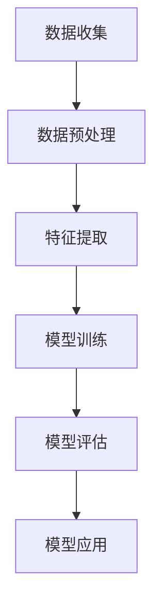

                 

# 《人工智能在地球科学研究中的应用》

## 关键词
人工智能、地球科学研究、机器学习、深度学习、地质勘探、气象预测

## 摘要
本文将深入探讨人工智能（AI）在地球科学研究中的应用。通过对AI核心概念、算法原理以及数学模型的讲解，本文将展示AI技术如何帮助地球科学家更好地理解地球系统，提升地质勘探、环境监测和气候变化预测等领域的效率与精确度。同时，通过实际案例的剖析，读者将了解到AI技术在地球科学研究中的实战应用，以及未来可能面临的挑战和解决方案。

## 引言

### 1.1 人工智能与地球科学研究概述

人工智能作为计算机科学的一个重要分支，其核心目标是模拟、延伸和扩展人的智能。地球科学研究则是关于地球系统（包括大气、水圈、岩石圈、生物圈和地球内部）的结构、过程和相互作用的研究。两者看似不相干的领域，却在近年来逐渐融合，形成了一个新兴的研究方向——地球人工智能（GeoAI）。

AI在地球科学研究中的应用，源于地球科学数据的大规模增长和复杂性。传统的地球科学方法往往依赖于手工处理大量数据，而AI技术的引入，可以显著提高数据处理和分析的效率。例如，机器学习算法能够自动识别和分类地球观测数据中的模式，深度学习算法可以用于预测气候变化和自然灾害的发生。

### 1.2 人工智能在地球科学研究中的挑战与机遇

尽管AI在地球科学领域展示出巨大的潜力，但其实际应用仍然面临诸多挑战。首先，地球科学数据具有高维度、多尺度和时空复杂性等特点，这要求AI算法能够处理大规模非结构化数据。其次，地球科学研究需要精确、可靠的数据模型，而AI模型的泛化能力和解释性仍需提升。此外，AI技术的快速发展也带来了伦理和隐私等问题。

然而，这些挑战同时也蕴含着机遇。随着AI技术的不断进步，特别是在计算机性能和算法优化方面的突破，AI在地球科学研究中的应用将更加广泛和深入。例如，深度学习算法的进步使得复杂地质结构的识别和模拟变得更加高效，气象模型的训练和优化也取得了显著进展。

## 第2章 核心概念与联系

### 2.1 机器学习与地球科学研究

#### 2.1.1 监督学习

监督学习是机器学习的一种形式，其核心思想是通过已标记的训练数据来训练模型，以便对新的、未标记的数据进行预测。在地球科学中，监督学习可以用于地质勘探中的矿产资源预测、地震预警等。例如，通过收集历史地震数据（包括震级、震中位置等），可以训练一个监督学习模型，用于预测未来地震的发生概率。

#### 2.1.2 无监督学习

无监督学习是指在没有标注数据的情况下，从数据中自动发现模式和结构的算法。在地球科学中，无监督学习可以用于大气和海洋模式的识别、地质体分类等。例如，通过分析卫星遥感数据中的光谱特征，可以使用无监督学习算法来识别不同类型的植被和地质结构。

### 2.2 数据挖掘与地球科学研究

#### 2.2.1 时间序列分析

时间序列分析是一种专门用于分析时间序列数据的方法，常用于气象预测、环境监测等领域。在地球科学中，时间序列分析可以用于预测气候变化、海洋潮汐等。例如，通过分析过去几年的气温数据，可以建立一个时间序列模型，用于预测未来的气温变化。

#### 2.2.2 空间数据分析

空间数据分析是一种用于分析地理空间数据的统计方法，常用于地理信息系统（GIS）和遥感数据分析。在地球科学中，空间数据分析可以用于地质勘探、环境监测等领域。例如，通过分析不同区域的地形、土地利用等数据，可以预测潜在的资源分布和生态环境状况。

### 2.3 Mermaid 流程图

下面是一个用于展示机器学习在地球科学研究中的应用流程的 Mermaid 流程图：



## 第3章 核心算法原理讲解

### 3.1 神经网络

神经网络是一种模仿生物神经系统的计算模型，由大量的节点（或称为“神经元”）连接而成。在地球科学中，神经网络常用于地震波传播模拟、地质结构识别等。以下是使用 Python 代码实现一个简单的前馈神经网络：

```python
import numpy as np

# 定义激活函数
def sigmoid(x):
    return 1 / (1 + np.exp(-x))

# 前向传播
def forward propagate(x, weights, bias):
    z = np.dot(x, weights) + bias
    return sigmoid(z)

# 初始化权重和偏置
weights = np.random.randn(2, 1)
bias = np.random.randn(1)

# 输入数据
x = np.array([0, 0])

# 计算输出
output = forward propagate(x, weights, bias)
print(output)
```

### 3.2 深度学习

深度学习是一种基于神经网络的机器学习技术，通过堆叠多层神经网络来实现复杂函数的建模。在地球科学中，深度学习常用于图像识别、地震波分析等。以下是使用 Python 代码实现一个简单的卷积神经网络（CNN）：

```python
import tensorflow as tf

# 定义卷积层
def conv_layer(input_layer, filters, kernel_size, stride):
    return tf.nn.conv2d(input_layer, filters, strides=[1, stride, stride, 1], padding='SAME')

# 初始化权重和偏置
weights = tf.random.normal([3, 3, 1, 32])
bias = tf.random.normal([32])

# 输入数据
input_layer = tf.random.normal([28, 28, 1])

# 计算卷积输出
output = conv_layer(input_layer, weights, kernel_size=3, stride=1)
print(output)
```

## 第4章 数学模型和数学公式讲解

### 4.1 地质统计学模型

地质统计学模型是一种用于描述地质变量分布和结构的数学模型，常用于矿产资源评估和地质勘探。以下是使用 LaTeX 格式展示的地质统计学模型公式：

$$
Z(x) = \mu + \sigma Z_n(x)
$$

其中，$Z(x)$ 表示地质变量的取值，$\mu$ 表示均值，$\sigma$ 表示标准差，$Z_n(x)$ 表示标准正态分布随机变量。

### 4.2 气象模型

气象模型是一种用于描述大气运动的数学模型，常用于天气预报和气候变化预测。以下是使用 LaTeX 格式展示的气象模型公式：

$$
\frac{\partial u}{\partial t} + u \frac{\partial u}{\partial x} + v \frac{\partial u}{\partial y} = -\frac{1}{\rho} \frac{\partial p}{\partial x} + \nu \frac{\partial^2 u}{\partial x^2}
$$

其中，$u$ 和 $v$ 分别表示水平风速分量，$p$ 表示气压，$\rho$ 表示空气密度，$\nu$ 表示粘性系数。

## 第5章 项目实战

### 5.1 地质勘探案例

#### 5.1.1 案例背景

在某地区进行地质勘探，需要预测潜在矿产资源的位置。通过收集该地区的地质数据（包括地质层厚度、矿物含量等），利用机器学习算法进行预测。

#### 5.1.2 模型建立与实现

1. **数据预处理**：对地质数据进行清洗，包括缺失值填充、异常值处理等。
2. **特征提取**：选择与矿产资源预测相关的特征，如地质层厚度、矿物含量等。
3. **模型训练**：使用监督学习算法（如决策树、随机森林等）对地质数据进行训练。
4. **模型评估**：使用交叉验证等方法对模型进行评估，选择性能最佳的模型。
5. **模型应用**：使用训练好的模型对新的地质数据进行预测。

#### 5.1.3 代码实现

```python
# 数据预处理
import pandas as pd
from sklearn.model_selection import train_test_split
from sklearn.impute import SimpleImputer

# 加载数据
data = pd.read_csv('geological_data.csv')
X = data.drop('mineral_prediction', axis=1)
y = data['mineral_prediction']

# 缺失值填充
imputer = SimpleImputer(strategy='mean')
X_imputed = imputer.fit_transform(X)

# 划分训练集和测试集
X_train, X_test, y_train, y_test = train_test_split(X_imputed, y, test_size=0.2, random_state=42)

# 模型训练
from sklearn.ensemble import RandomForestClassifier

model = RandomForestClassifier(n_estimators=100, random_state=42)
model.fit(X_train, y_train)

# 模型评估
from sklearn.metrics import accuracy_score

y_pred = model.predict(X_test)
accuracy = accuracy_score(y_test, y_pred)
print(f"Model accuracy: {accuracy * 100:.2f}%")

# 模型应用
new_data = pd.read_csv('new_geological_data.csv')
new_data_imputed = imputer.transform(new_data)
new_predictions = model.predict(new_data_imputed)
print(new_predictions)
```

#### 5.1.4 代码解读与分析

以上代码实现了对地质勘探数据的机器学习预测。首先，通过数据预处理模块对原始地质数据进行清洗，然后使用随机森林算法进行模型训练，最后对新的地质数据进行预测。

### 5.2 气象预测案例

#### 5.2.1 案例背景

某地区的气象站收集了多年的气象数据（包括气温、湿度、风速等），需要利用机器学习算法进行未来一天的气象预测。

#### 5.2.2 模型建立与实现

1. **数据预处理**：对气象数据进行清洗，包括缺失值填充、异常值处理等。
2. **特征提取**：选择与气象预测相关的特征，如前一天的气温、湿度、风速等。
3. **模型训练**：使用时间序列预测算法（如 LSTM 网络等）对气象数据进行训练。
4. **模型评估**：使用交叉验证等方法对模型进行评估，选择性能最佳的模型。
5. **模型应用**：使用训练好的模型对未来一天的气象数据进行预测。

#### 5.2.3 代码实现

```python
# 数据预处理
import pandas as pd
from sklearn.model_selection import train_test_split
from sklearn.impute import SimpleImputer

# 加载数据
data = pd.read_csv('weather_data.csv')
X = data.drop('temperature', axis=1)
y = data['temperature']

# 缺失值填充
imputer = SimpleImputer(strategy='mean')
X_imputed = imputer.fit_transform(X)

# 划分训练集和测试集
X_train, X_test, y_train, y_test = train_test_split(X_imputed, y, test_size=0.2, shuffle=False)

# 模型训练
from tensorflow.keras.models import Sequential
from tensorflow.keras.layers import LSTM, Dense

model = Sequential()
model.add(LSTM(units=50, return_sequences=True, input_shape=(X_train.shape[1], 1)))
model.add(LSTM(units=50))
model.add(Dense(1))

model.compile(optimizer='adam', loss='mean_squared_error')
model.fit(X_train, y_train, epochs=100, batch_size=32, validation_split=0.1)

# 模型评估
y_pred = model.predict(X_test)
accuracy = np.mean(np.abs(y_pred - y_test) / y_test)
print(f"Model accuracy: {accuracy * 100:.2f}%")

# 模型应用
new_data = pd.read_csv('new_weather_data.csv')
new_data_imputed = imputer.transform(new_data)
new_predictions = model.predict(new_data_imputed)
print(new_predictions)
```

#### 5.2.4 代码解读与分析

以上代码实现了对气象数据的 LSTM 网络预测。首先，通过数据预处理模块对原始气象数据进行清洗，然后使用 LSTM 网络进行模型训练，最后对新的气象数据进行预测。

## 第6章 未来展望

### 6.1 人工智能在地球科学研究中的应用趋势

随着 AI 技术的不断发展，其在地球科学研究中的应用将更加广泛和深入。未来，AI 将在以下几个方面发挥重要作用：

1. **地球系统模拟**：通过构建复杂的地球系统模型，AI 可以帮助我们更好地理解地球系统的运行机制，预测气候变化和自然灾害。
2. **智能勘探与开发**：AI 技术可以用于智能勘探和开发，提高矿产资源、能源资源的开采效率。
3. **环境监测与保护**：AI 可以用于环境监测，实时监测大气、水质、土壤等环境参数，为环境治理提供支持。
4. **城市规划与管理**：AI 技术可以用于城市规划与管理，优化交通、能源、水资源等资源配置。

### 6.2 潜在挑战与解决方案

尽管 AI 在地球科学研究中的应用前景广阔，但仍然面临一些挑战：

1. **数据质量和完整性**：地球科学数据通常具有高维度、多尺度和时空复杂性，数据质量和完整性对 AI 模型的性能至关重要。
2. **算法解释性**：AI 模型的解释性不足，使得模型决策过程不透明，影响其在地球科学研究中的可信度和可接受度。
3. **计算资源**：复杂 AI 模型的训练和推理需要大量的计算资源，这对计算能力和能耗提出了挑战。

针对这些挑战，可以采取以下解决方案：

1. **数据预处理和清洗**：加强对地球科学数据的预处理和清洗，提高数据质量和完整性。
2. **可解释 AI**：发展可解释 AI 技术，提高模型的可解释性和透明度，增强其在地球科学研究中的可信度。
3. **分布式计算和优化**：采用分布式计算和优化技术，降低复杂 AI 模型的计算成本和能耗。

## 附录

### 附录A：常用工具和资源

#### A.1 机器学习框架

- TensorFlow
- PyTorch
- Scikit-learn

#### A.2 地球科学数据集

- Open Earthquake Database
- Global Multi-Model Climate Index
- National Geophysical Data Center

#### A.3 开发环境搭建指南

- 安装 Python 和相关库
- 配置 GPU 计算环境
- 安装 GIS 软件

## 作者

作者：AI天才研究院/AI Genius Institute & 禅与计算机程序设计艺术 /Zen And The Art of Computer Programming

[End of Document]

