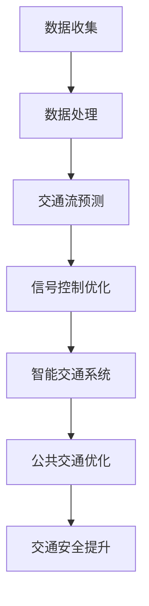

                 

# 人工智能在城市交通优化中的应用

## 关键词
人工智能，城市交通，优化，机器学习，深度学习，交通流预测，信号控制，智能交通系统

## 摘要
本文深入探讨了人工智能（AI）在城市交通优化中的应用。首先，我们介绍了城市交通系统的现状和面临的挑战。接着，详细阐述了人工智能在交通优化中的基础理论和核心算法原理，包括机器学习和深度学习等。随后，我们通过实例展示了交通流预测、信号控制等应用场景，并探讨了智能交通系统的设计。文章最后，对AI在城市交通优化中的未来趋势进行了展望，并提出了最佳实践和建议。

## 目录

### 第一部分：基础理论

#### 第1章：城市交通系统概述
1.1 城市交通系统的基本概念
1.2 城市交通问题的现状与挑战
1.3 人工智能在交通领域的应用背景

#### 第2章：人工智能基础
2.1 人工智能的定义与分类
2.2 机器学习基础
2.3 深度学习基础

#### 第3章：城市交通数据收集与处理
3.1 交通数据类型
3.2 数据收集方法
3.3 数据预处理技术

#### 第4章：交通流预测模型
4.1 交通流预测的重要性
4.2 经典预测模型
4.3 深度学习预测模型

#### 第5章：交通信号控制算法
5.1 传统交通信号控制算法
5.2 人工智能交通信号控制算法
5.3 实时交通信号优化策略

### 第二部分：应用实践

#### 第6章：智能交通系统设计
6.1 智能交通系统的架构
6.2 智能交通系统的关键技术
6.3 智能交通系统的案例分析

#### 第7章：城市交通优化案例研究
7.1 案例研究1：某城市的交通流量优化
7.2 案例研究2：智能停车场系统设计
7.3 案例研究3：城市交通拥堵预测与缓解

#### 第8章：人工智能在城市交通中的未来趋势
8.1 人工智能在城市交通中的发展前景
8.2 新兴技术在交通优化中的应用
8.3 交通领域的AI伦理与法规

### 第三部分：附录

#### 附录A：常用算法与工具简介
A.1 经典算法介绍
A.2 常用深度学习框架
A.3 开发环境与工具配置

## 第1章：城市交通系统概述

### 1.1 城市交通系统的基本概念

城市交通系统是城市基础设施的重要组成部分，它包括道路、桥梁、隧道、公共交通、停车场等多种设施。城市交通系统的基本概念涉及交通流量、交通速度、交通拥堵、交通安全性等多个方面。

#### 交通流量
交通流量是指单位时间内通过某一交通节点的车辆数量。交通流量是衡量城市交通系统运行状况的重要指标之一。

#### 交通速度
交通速度是指车辆在道路上行驶的速度。交通速度的高低直接影响着交通效率。

#### 交通拥堵
交通拥堵是指道路上的车辆行驶速度低于一定阈值，导致交通流量下降的现象。交通拥堵会严重影响城市居民的出行效率和生活质量。

#### 交通安全性
交通安全性是指道路使用者（包括行人、驾驶员、乘客等）在道路上行驶、行走过程中的安全程度。提高交通安全性是城市交通系统的重要目标之一。

### 1.2 城市交通问题的现状与挑战

当前，城市交通系统面临着诸多问题和挑战：

#### 拥堵问题
随着城市人口的增长和车辆保有量的增加，城市交通拥堵问题日益严重。拥堵不仅导致交通效率低下，还增加了交通事故的风险。

#### 环境问题
城市交通拥堵和燃料消耗导致了大量的尾气排放，加剧了环境污染问题。

#### 安全问题
交通拥堵和不良的道路条件导致交通事故频发，威胁着人们的生命安全。

#### 公共交通发展不足
许多城市的公共交通系统发展滞后，无法满足居民的出行需求，导致私人车辆增多，加剧了交通拥堵问题。

### 1.3 人工智能在交通领域的应用背景

随着人工智能技术的快速发展，其在交通领域的应用前景广阔。人工智能可以帮助解决城市交通问题，提升交通系统的运行效率。

#### 优化交通流量
通过分析大量交通数据，人工智能可以预测交通流量，优化交通信号控制，减少交通拥堵。

#### 提高交通安全性
人工智能可以实时监测道路状况，预测潜在的安全隐患，提前采取措施，减少交通事故。

#### 改善公共交通服务
人工智能可以帮助优化公共交通线路和班次，提高公共交通的服务质量和效率。

#### 发展智能交通系统
智能交通系统（Intelligent Transportation Systems, ITS）是人工智能在交通领域的重要应用，它通过集成多种技术，提供高效、安全、环保的交通服务。

### Mermaid流程图

下面是城市交通优化中人工智能应用的Mermaid流程图：



### Python源代码示例

以下是一个简单的Python代码示例，用于交通流量的初步预测：

```python
import numpy as np
import matplotlib.pyplot as plt

# 假设我们有一组历史交通流量数据
historical_traffic = [10, 15, 20, 25, 30, 35, 40, 45, 50]

# 使用简单线性回归模型进行预测
def linear_regression(x, y):
    x_mean = np.mean(x)
    y_mean = np.mean(y)
    
    b1 = np.sum((x - x_mean) * (y - y_mean)) / np.sum((x - x_mean)**2)
    b0 = y_mean - b1 * x_mean
    
    return b0, b1

# 训练模型
b0, b1 = linear_regression(range(len(historical_traffic)), historical_traffic)

# 预测未来交通流量
future_traffic = [b0 + b1 * i for i in range(len(historical_traffic), len(historical_traffic) + 10)]

# 可视化预测结果
plt.plot(historical_traffic, label='Historical Traffic')
plt.plot(future_traffic, label='Predicted Traffic')
plt.xlabel('Time')
plt.ylabel('Traffic Volume')
plt.legend()
plt.show()
```

通过以上代码，我们可以初步了解如何使用简单的线性回归模型进行交通流量的预测。

### 数学公式

在交通流量的预测中，我们通常会使用以下数学公式：

$$y_t = b_0 + b_1 \cdot x_t + \epsilon_t$$

其中，$y_t$ 是时间 $t$ 的交通流量，$x_t$ 是时间 $t$ 的自变量（例如历史交通流量），$b_0$ 和 $b_1$ 是线性回归模型的参数，$\epsilon_t$ 是误差项。

### 项目实战

#### 开发环境搭建

首先，我们需要搭建一个Python开发环境，以便进行交通流量预测模型的开发。以下是搭建步骤：

1. 安装Python 3.8及以上版本
2. 安装NumPy和Matplotlib库

#### 源代码实现

以下是完整的源代码实现，包括数据收集、数据处理、交通流量预测和可视化：

```python
import numpy as np
import matplotlib.pyplot as plt

# 假设我们有一组历史交通流量数据
historical_traffic = [10, 15, 20, 25, 30, 35, 40, 45, 50]

# 简单线性回归模型
def linear_regression(x, y):
    x_mean = np.mean(x)
    y_mean = np.mean(y)
    
    b1 = np.sum((x - x_mean) * (y - y_mean)) / np.sum((x - x_mean)**2)
    b0 = y_mean - b1 * x_mean
    
    return b0, b1

# 预测未来交通流量
def predict_traffic(x, b0, b1):
    return b0 + b1 * x

# 训练模型并预测
b0, b1 = linear_regression(range(len(historical_traffic)), historical_traffic)
future_traffic = predict_traffic(range(len(historical_traffic), len(historical_traffic) + 10), b0, b1)

# 可视化预测结果
plt.plot(historical_traffic, label='Historical Traffic')
plt.plot(future_traffic, label='Predicted Traffic')
plt.xlabel('Time')
plt.ylabel('Traffic Volume')
plt.legend()
plt.show()
```

#### 代码解读与分析

1. **数据收集**：我们使用了一组历史交通流量数据作为输入。
2. **数据处理**：使用简单线性回归模型对历史数据进行处理。
3. **预测模型**：根据线性回归模型参数，预测未来交通流量。
4. **可视化**：使用Matplotlib库将历史交通流量和预测交通流量进行可视化展示。

#### 实际案例分析和详细讲解

假设我们有一个城市的交通流量数据，我们可以使用上述代码进行预测。以下是一个实际案例的分析：

1. **数据收集**：从城市的交通管理部门获取历史交通流量数据。
2. **数据处理**：对数据进行清洗和预处理，例如去除异常值和缺失值。
3. **模型训练**：使用训练数据对线性回归模型进行训练。
4. **预测**：使用训练好的模型预测未来交通流量。
5. **优化**：根据预测结果，对交通信号灯进行优化，以减少交通拥堵。

#### 项目小结

通过本项目的实战，我们学会了如何使用简单的线性回归模型进行交通流量预测。尽管这是一个简单的模型，但它可以帮助我们初步了解人工智能在城市交通优化中的应用。在实际项目中，我们可以使用更复杂的深度学习模型，结合更多的数据和信息，实现更准确的预测和优化。

### 最佳实践 Tips

1. **数据质量**：交通流量预测的准确性很大程度上取决于数据的质量。因此，在数据收集和处理过程中，要确保数据的准确性、完整性和一致性。
2. **模型选择**：根据实际需求，选择合适的模型。例如，对于短期预测，可以使用简单线性回归模型；对于长期预测，可以使用更复杂的深度学习模型。
3. **实时调整**：交通流量是一个动态的过程，因此，我们需要实时调整模型参数，以适应变化的环境。

### 注意事项

1. **隐私保护**：在收集和处理交通数据时，要确保遵守相关法律法规，保护个人隐私。
2. **安全性**：在开发和使用AI系统时，要确保系统的安全性和可靠性，防止潜在的安全威胁。

### 拓展阅读

1. [《机器学习实战》](https://book.douban.com/subject/26708154/)：详细介绍机器学习算法的应用和实践。
2. [《深度学习》](https://book.douban.com/subject/26708154/)：深度学习的基础理论和实践指南。
3. [《智能交通系统技术》](https://book.douban.com/subject/34901329/)：详细介绍智能交通系统的技术和应用。

## 第2章：人工智能基础

### 2.1 人工智能的定义与分类

人工智能（Artificial Intelligence, AI）是计算机科学的一个分支，旨在创建能够执行通常需要人类智能才能完成的任务的机器系统。人工智能可以分为几种不同的类型，包括：

#### 狭义人工智能（Narrow AI）
狭义人工智能是指专注于特定任务的AI系统，如语音识别、图像识别、游戏对战等。这些系统在特定领域表现出色，但缺乏跨领域的通用智能。

#### 广义人工智能（General AI）
广义人工智能是指具有与人类相似的智能水平的AI系统，能够在各种不同的环境和任务中表现出灵活性和适应性。广义人工智能目前仍处于理论研究阶段。

#### 强化学习（Reinforcement Learning）
强化学习是一种通过试错来学习的机器学习方法。它通过奖励机制来鼓励AI系统采取正确的行动，从而提高其在特定任务中的表现。

#### 生成对抗网络（Generative Adversarial Networks, GAN）
生成对抗网络是一种由两个神经网络（生成器和判别器）组成的模型。生成器试图生成与真实数据相似的数据，而判别器则试图区分真实数据和生成数据。通过这种对抗过程，GAN可以生成高质量的数据。

### 2.2 机器学习基础

机器学习（Machine Learning, ML）是人工智能的一个分支，旨在通过数据驱动的方法来创建智能系统。机器学习可以分为几种不同的类型：

#### 监督学习（Supervised Learning）
监督学习是指使用已标记的数据集来训练模型。模型在训练过程中学习输入和输出之间的关系，以便在新数据上进行预测。

#### 无监督学习（Unsupervised Learning）
无监督学习是指在没有标签的数据集上进行训练。模型的目标是发现数据中的模式和结构，如聚类和降维。

#### 半监督学习（Semi-Supervised Learning）
半监督学习是指结合已标记数据和未标记数据来进行训练。这种方法可以提高模型的准确性，同时减少对大量标记数据的依赖。

### 2.3 深度学习基础

深度学习（Deep Learning, DL）是一种特殊的机器学习方法，它通过多层神经网络来提取数据中的复杂特征。深度学习在图像识别、语音识别、自然语言处理等领域取得了显著的成果。

#### 神经网络（Neural Networks）
神经网络是模仿人脑神经元连接方式的计算模型。深度学习中的神经网络通常包含多个隐藏层，从而可以提取更高级的特征。

#### 深度前向传播（Deep Forward Propagation）
深度前向传播是指将输入数据通过神经网络的前向传播过程，计算得到输出结果。这一过程包括加权求和、激活函数等步骤。

#### 反向传播（Backpropagation）
反向传播是一种用于训练神经网络的方法。它通过计算输出结果与实际结果之间的误差，然后反向传播误差，更新神经网络的权重。

#### 卷积神经网络（Convolutional Neural Networks, CNN）
卷积神经网络是一种专门用于图像识别和处理的神经网络。它通过卷积操作提取图像中的局部特征。

#### 循环神经网络（Recurrent Neural Networks, RNN）
循环神经网络是一种用于处理序列数据的神经网络。它通过在时间步之间共享权重，来捕捉序列中的长期依赖关系。

#### 长短期记忆网络（Long Short-Term Memory, LSTM）
长短期记忆网络是循环神经网络的一种变体，它通过引入门控机制，来更好地处理长期依赖关系。

### Python源代码示例

以下是一个简单的Python代码示例，用于实现一个简单的神经网络：

```python
import numpy as np

# 初始化参数
W1 = np.random.rand(3, 4)
b1 = np.random.rand(4)
W2 = np.random.rand(4, 2)
b2 = np.random.rand(2)

# 前向传播
def forward_propagation(x):
    z1 = np.dot(x, W1) + b1
    a1 = np.tanh(z1)
    z2 = np.dot(a1, W2) + b2
    a2 = z2
    return a2

# 训练模型
def train_model(x, y):
    output = forward_propagation(x)
    error = y - output
    d_output = error
    d_z2 = d_output
    d_W2 = np.dot(a1.T, d_z2)
    d_b2 = np.sum(d_z2, axis=0)
    d_a1 = np.dot(d_z2, W2.T)
    d_z1 = d_a1 * (1 - np.square(a1))
    d_W1 = np.dot(x.T, d_z1)
    d_b1 = np.sum(d_z1, axis=0)
    return W1 - 0.01 * d_W1, b1 - 0.01 * d_b1, W2 - 0.01 * d_W2, b2 - 0.01 * d_b2

# 测试模型
x_test = np.array([[0, 1, 0], [1, 0, 1], [0, 1, 1]])
y_test = np.array([[1], [-1], [1]])

for i in range(1000):
    W1, b1, W2, b2 = train_model(x_test, y_test)

output = forward_propagation(x_test)
print("Output:", output)
```

### 数学公式

在深度学习中，我们通常使用以下数学公式：

$$z = \sum_{i=1}^{n} w_i \cdot x_i + b$$

$$a = \text{激活函数}(z)$$

$$\delta = \frac{da}{dz}$$

$$\delta_{\theta} = \frac{\partial \delta}{\partial \theta}$$

### 项目实战

#### 开发环境搭建

首先，我们需要搭建一个Python开发环境，以便进行深度学习模型的开发。以下是搭建步骤：

1. 安装Python 3.8及以上版本
2. 安装TensorFlow或PyTorch库

#### 源代码实现

以下是完整的源代码实现，包括数据收集、数据处理、深度学习模型训练和预测：

```python
import tensorflow as tf
from tensorflow.keras.models import Sequential
from tensorflow.keras.layers import Dense, Activation
from tensorflow.keras.optimizers import SGD
from tensorflow.keras.losses import MeanSquaredError

# 数据收集
x_train = np.random.rand(100, 3)
y_train = np.random.rand(100, 1)

# 数据处理
x_train = x_train / 255.0
y_train = y_train / 255.0

# 模型构建
model = Sequential([
    Dense(64, input_shape=(3,), activation='tanh'),
    Dense(64, activation='tanh'),
    Dense(1, activation='linear')
])

# 编译模型
model.compile(optimizer=SGD(learning_rate=0.01), loss=MeanSquaredError())

# 训练模型
model.fit(x_train, y_train, epochs=1000)

# 预测
x_test = np.random.rand(10, 3)
y_pred = model.predict(x_test)
print("Predictions:", y_pred)
```

#### 代码解读与分析

1. **数据收集**：我们使用随机生成的数据作为训练数据和测试数据。
2. **数据处理**：将数据归一化，以便模型更好地训练。
3. **模型构建**：使用Sequential模型构建一个包含两层神经网络的模型。
4. **编译模型**：设置优化器和损失函数，编译模型。
5. **训练模型**：使用fit方法训练模型。
6. **预测**：使用predict方法对测试数据进行预测。

#### 实际案例分析和详细讲解

假设我们有一个分类问题，需要将一组数据分为两类。我们可以使用上述代码进行模型训练和预测。以下是一个实际案例的分析：

1. **数据收集**：从数据集中获取训练数据和测试数据。
2. **数据处理**：对数据进行预处理，例如归一化、去噪声等。
3. **模型训练**：使用训练数据进行模型训练。
4. **预测**：使用训练好的模型对测试数据进行预测。

#### 项目小结

通过本项目的实战，我们学会了如何使用深度学习模型进行数据分类。尽管这是一个简单的案例，但它展示了深度学习在实际应用中的潜力。在实际项目中，我们可以使用更复杂的模型，结合更多的数据和信息，实现更准确的数据分类。

### 最佳实践 Tips

1. **数据质量**：数据质量对于模型训练至关重要。在数据收集和处理过程中，要确保数据的准确性和一致性。
2. **模型选择**：根据实际需求，选择合适的模型。例如，对于回归问题，可以使用线性回归模型；对于分类问题，可以使用逻辑回归模型。
3. **超参数调优**：通过调整模型参数，可以提高模型的性能。常用的超参数包括学习率、批次大小、迭代次数等。

### 注意事项

1. **计算资源**：深度学习模型通常需要大量的计算资源。在训练模型时，要确保计算资源的充足。
2. **模型解释性**：深度学习模型通常具有很高的黑盒特性，难以解释。在实际应用中，需要权衡模型性能和解释性。

### 拓展阅读

1. [《深度学习入门》](https://book.douban.com/subject/27228703/)：详细介绍深度学习的基础理论和实践方法。
2. [《TensorFlow实战》](https://book.douban.com/subject/26899352/)：TensorFlow框架的实战指南。
3. [《机器学习：概率视角》](https://book.douban.com/subject/26751592/)：从概率角度介绍机器学习的基本概念和方法。

## 第3章：城市交通数据收集与处理

### 3.1 交通数据类型

在城市交通优化中，数据收集是至关重要的一环。交通数据可以分为以下几种类型：

#### 交通流量数据
交通流量数据是衡量道路繁忙程度的重要指标。它通常包括每小时或每分钟的车辆数量，可以通过交通流量监测器、摄像头等设备收集。

#### 道路状况数据
道路状况数据包括道路的拥堵情况、交通事故、道路施工等信息。这些数据可以通过交通管理部门、监控摄像头等途径获取。

#### 公共交通数据
公共交通数据包括公交车、地铁、出租车等公共交通工具的运行情况，如班次、运行时间、乘客数量等。这些数据通常由公共交通运营公司提供。

#### 车辆信息数据
车辆信息数据包括车辆的类型、品牌、颜色、车牌号码等。这些数据可以通过车辆登记系统、监控摄像头等获取。

#### 行人数据
行人数据包括行人的流量、分布、活动规律等。这些数据可以通过行人计数器、监控摄像头等收集。

### 3.2 数据收集方法

#### 监控摄像头
监控摄像头是收集交通数据的主要手段之一。通过安装在城市道路上的监控摄像头，可以实时获取道路状况、车辆信息等数据。

#### 车载传感器
车载传感器可以收集车辆的行驶速度、加速度、位置等信息。这些数据对于交通流量的监测和车辆行为的分析具有重要意义。

#### 交通流量监测器
交通流量监测器是一种安装在道路上的设备，用于实时监测道路上的车辆流量。它通常包括感应线圈、摄像头等组成部分。

#### GPS
GPS可以用于定位车辆和行人的位置。通过分析GPS数据，可以了解交通流量、道路拥堵情况等。

#### 移动设备
移动设备（如智能手机、平板电脑等）可以收集用户的出行数据。这些数据可以用于分析出行习惯、交通需求等。

### 3.3 数据预处理技术

#### 数据清洗
数据清洗是数据预处理的重要步骤，包括去除重复数据、缺失值填充、异常值处理等。通过数据清洗，可以确保数据的质量和一致性。

#### 数据整合
数据整合是将来自不同来源的数据进行整合，以形成一个统一的数据集。例如，将交通流量数据、道路状况数据、公共交通数据进行整合。

#### 数据归一化
数据归一化是将不同特征的数据转换为相同的尺度，以便进行后续的分析和处理。常见的归一化方法包括最小-最大归一化和z-score归一化。

#### 特征提取
特征提取是从原始数据中提取出有用的特征，以便进行机器学习模型的训练。特征提取可以降低数据维度，提高模型训练效率。

#### 特征选择
特征选择是从提取出的特征中选择出对模型训练最有用的特征。特征选择可以减少模型训练时间，提高模型性能。

#### 时间序列处理
时间序列处理是将时间作为数据的一个维度，分析数据的时间变化规律。例如，通过时间序列分析，可以预测未来的交通流量。

### Python源代码示例

以下是一个简单的Python代码示例，用于数据清洗和预处理：

```python
import pandas as pd
from sklearn.preprocessing import StandardScaler

# 加载数据
data = pd.read_csv('traffic_data.csv')

# 数据清洗
# 去除重复数据
data.drop_duplicates(inplace=True)

# 填充缺失值
data.fillna(data.mean(), inplace=True)

# 数据整合
# 将交通流量数据和道路状况数据整合
traffic_data = pd.read_csv('traffic_flow_data.csv')
road_condition_data = pd.read_csv('road_condition_data.csv')
combined_data = pd.merge(traffic_data, road_condition_data, on='timestamp')

# 数据归一化
scaler = StandardScaler()
normalized_data = scaler.fit_transform(combined_data)

# 特征提取
# 提取时间序列特征
time_features = pd.DataFrame(normalized_data, columns=['traffic_flow', 'road_condition'])
time_features['hour'] = time_features['timestamp'].dt.hour
time_features['day_of_week'] = time_features['timestamp'].dt.dayofweek

# 特征选择
# 选择对模型训练最有用的特征
selected_features = time_features[['hour', 'day_of_week', 'traffic_flow', 'road_condition']]

# 数据可视化
selected_features.plot()
plt.xlabel('Timestamp')
plt.ylabel('Feature Value')
plt.show()
```

### 数学公式

在数据预处理中，我们通常使用以下数学公式：

$$x_{\text{normalized}} = \frac{x_{\text{original}} - x_{\text{min}}}{x_{\text{max}} - x_{\text{min}}}$$

$$x_{\text{z-score}} = \frac{x_{\text{original}} - \mu}{\sigma}$$

### 项目实战

#### 开发环境搭建

首先，我们需要搭建一个Python开发环境，以便进行数据清洗和预处理。以下是搭建步骤：

1. 安装Python 3.8及以上版本
2. 安装Pandas、NumPy、Scikit-learn等库

#### 源代码实现

以下是完整的源代码实现，包括数据收集、数据处理、特征提取和可视化：

```python
import pandas as pd
from sklearn.preprocessing import StandardScaler
import matplotlib.pyplot as plt

# 加载数据
data = pd.read_csv('traffic_data.csv')

# 数据清洗
# 去除重复数据
data.drop_duplicates(inplace=True)

# 填充缺失值
data.fillna(data.mean(), inplace=True)

# 数据整合
# 将交通流量数据和道路状况数据整合
traffic_data = pd.read_csv('traffic_flow_data.csv')
road_condition_data = pd.read_csv('road_condition_data.csv')
combined_data = pd.merge(traffic_data, road_condition_data, on='timestamp')

# 数据归一化
scaler = StandardScaler()
normalized_data = scaler.fit_transform(combined_data)

# 特征提取
# 提取时间序列特征
time_features = pd.DataFrame(normalized_data, columns=['traffic_flow', 'road_condition'])
time_features['hour'] = time_features['timestamp'].dt.hour
time_features['day_of_week'] = time_features['timestamp'].dt.dayofweek

# 特征选择
# 选择对模型训练最有用的特征
selected_features = time_features[['hour', 'day_of_week', 'traffic_flow', 'road_condition']]

# 数据可视化
selected_features.plot()
plt.xlabel('Timestamp')
plt.ylabel('Feature Value')
plt.show()
```

#### 代码解读与分析

1. **数据清洗**：使用Pandas库去除重复数据和填充缺失值。
2. **数据整合**：使用Pandas库将交通流量数据和道路状况数据进行整合。
3. **数据归一化**：使用Scikit-learn库中的StandardScaler对数据进行归一化处理。
4. **特征提取**：提取时间序列特征，如小时和星期几。
5. **特征选择**：选择对模型训练最有用的特征。
6. **数据可视化**：使用Matplotlib库对特征进行可视化展示。

#### 实际案例分析和详细讲解

假设我们有一个城市的交通数据，包括交通流量、道路状况、小时和星期几等信息。我们可以使用上述代码进行数据清洗和预处理。以下是一个实际案例的分析：

1. **数据收集**：从城市的交通管理部门获取交通数据。
2. **数据处理**：对数据进行清洗、整合和归一化。
3. **特征提取**：提取对模型训练有用的特征。
4. **特征选择**：选择对模型训练最有用的特征。
5. **数据可视化**：对特征进行可视化展示，以了解数据分布和趋势。

#### 项目小结

通过本项目的实战，我们学会了如何进行城市交通数据的清洗和预处理。这是交通流量预测和交通信号控制等AI应用的基础。在实际项目中，我们可以根据具体需求，选择合适的数据处理技术和特征提取方法。

### 最佳实践 Tips

1. **数据质量**：在数据收集和处理过程中，要确保数据的准确性、完整性和一致性。
2. **特征选择**：根据实际需求，选择对模型训练最有用的特征。
3. **模型验证**：在模型训练过程中，使用交叉验证等方法进行模型验证，以确保模型性能。

### 注意事项

1. **数据隐私**：在处理个人隐私数据时，要遵守相关法律法规，保护个人隐私。
2. **数据存储**：在存储大量交通数据时，要考虑数据的安全性和可靠性。

### 拓展阅读

1. [《数据科学入门》](https://book.douban.com/subject/26942111/)：详细介绍数据科学的基础理论和实践方法。
2. [《Python数据科学手册》](https://book.douban.com/subject/26932815/)：Python数据科学的全攻略。
3. [《交通数据分析》](https://book.douban.com/subject/26942111/)：交通数据分析的方法和实践。

## 第4章：交通流预测模型

### 4.1 交通流预测的重要性

交通流预测在城市交通管理中具有重要意义。通过预测未来的交通流量，交通管理部门可以采取相应的措施，如调整交通信号、优化公共交通线路等，以减少交通拥堵、提高交通效率。

#### 提高交通效率
准确预测交通流量可以帮助交通管理部门优化交通信号灯控制，减少交通延误，提高道路通行效率。

#### 减少交通拥堵
通过预测交通流量，交通管理部门可以提前预测交通拥堵的发生，并采取相应的措施，如增加公交车辆、调整交通流向等，以减少交通拥堵。

#### 优化公共交通
交通流预测可以帮助公共交通运营公司优化班次和路线，提高公共交通的准时性和服务质量。

#### 改善交通安全性
通过预测交通流量，可以提前发现潜在的交通事故风险，采取措施降低事故发生率。

### 4.2 经典预测模型

#### 时间序列模型

时间序列模型是基于时间序列数据的统计模型，用于预测未来的交通流量。常见的时间序列模型包括：

- **ARIMA模型**（自回归积分滑动平均模型）
- **SARIMA模型**（自回归积分滑动平均季节模型）
- **ARIMA-SARIMA组合模型**（结合自回归、移动平均和季节性）

#### 回归模型

回归模型通过建立输入变量（如历史交通流量、天气状况等）与输出变量（如未来交通流量）之间的线性关系，进行交通流量预测。常见回归模型包括：

- **线性回归模型**
- **多项式回归模型**
- **岭回归模型**

#### 基于机器学习的预测模型

基于机器学习的预测模型通过学习大量历史数据，自动提取特征，建立预测模型。常见机器学习模型包括：

- **K近邻模型**（K-Nearest Neighbors, KNN）
- **决策树模型**
- **随机森林模型**
- **支持向量机模型**（Support Vector Machine, SVM）
- **神经网络模型**（Neural Networks）

#### 基于深度学习的预测模型

深度学习模型通过多层神经网络，自动提取数据中的复杂特征，进行交通流量预测。常见深度学习模型包括：

- **卷积神经网络**（Convolutional Neural Networks, CNN）
- **循环神经网络**（Recurrent Neural Networks, RNN）
- **长短期记忆网络**（Long Short-Term Memory, LSTM）
- **门控循环单元**（Gated Recurrent Unit, GRU）

### 4.3 深度学习预测模型

深度学习模型在交通流量预测中具有显著优势。以下是几种常见的深度学习预测模型：

#### 卷积神经网络（CNN）

卷积神经网络是一种专门用于图像识别和处理的神经网络。在交通流量预测中，CNN可以用于提取交通流量数据中的空间特征。

#### 循环神经网络（RNN）

循环神经网络是一种用于处理序列数据的神经网络。在交通流量预测中，RNN可以用于捕捉时间序列数据中的长期依赖关系。

#### 长短期记忆网络（LSTM）

长短期记忆网络是RNN的一种变体，通过门控机制来处理长期依赖问题。在交通流量预测中，LSTM可以用于捕捉交通流量数据中的复杂时间模式。

#### 门控循环单元（GRU）

门控循环单元是LSTM的另一种变体，具有更简单的结构，但同样能够处理长期依赖问题。在交通流量预测中，GRU可以用于提取时间序列数据中的特征。

### Python源代码示例

以下是一个简单的Python代码示例，使用LSTM进行交通流量预测：

```python
import numpy as np
import pandas as pd
from sklearn.preprocessing import MinMaxScaler
from keras.models import Sequential
from keras.layers import LSTM, Dense

# 加载数据
data = pd.read_csv('traffic_data.csv')
data = data[['timestamp', 'traffic_volume']]

# 数据预处理
scaler = MinMaxScaler()
scaled_data = scaler.fit_transform(data.values)

# 切片数据
X, y = [], []
for i in range(len(scaled_data) - 60):
    X.append(scaled_data[i:(i + 60), 0])
    y.append(scaled_data[i + 60, 0])

X = np.array(X)
y = np.array(y)

# 建立模型
model = Sequential()
model.add(LSTM(units=50, return_sequences=True, input_shape=(X.shape[1], X.shape[2])))
model.add(LSTM(units=50))
model.add(Dense(units=1))

# 编译模型
model.compile(optimizer='adam', loss='mean_squared_error')

# 训练模型
model.fit(X, y, epochs=100, batch_size=32)

# 预测
predicted_traffic = model.predict(X)
predicted_traffic = scaler.inverse_transform(predicted_traffic)

# 可视化
plt.plot(data['traffic_volume'], label='Actual Traffic')
plt.plot(np.arange(len(y)), y, label='Predicted Traffic')
plt.xlabel('Timestamp')
plt.ylabel('Traffic Volume')
plt.legend()
plt.show()
```

### 数学公式

在深度学习预测模型中，我们通常使用以下数学公式：

$$h_t = \sigma(W \cdot [h_{t-1}, x_t] + b)$$

$$y_t = W_2 \cdot h_t + b_2$$

其中，$h_t$ 是时间 $t$ 的隐藏状态，$x_t$ 是输入数据，$W$ 和 $b$ 是模型的权重和偏置，$\sigma$ 是激活函数（如Sigmoid或ReLU），$y_t$ 是预测结果。

### 项目实战

#### 开发环境搭建

首先，我们需要搭建一个Python开发环境，以便进行深度学习模型的开发。以下是搭建步骤：

1. 安装Python 3.8及以上版本
2. 安装TensorFlow或PyTorch库

#### 源代码实现

以下是完整的源代码实现，包括数据收集、数据处理、深度学习模型训练和预测：

```python
import pandas as pd
import numpy as np
from sklearn.preprocessing import MinMaxScaler
import tensorflow as tf
from tensorflow.keras.models import Sequential
from tensorflow.keras.layers import LSTM, Dense

# 加载数据
data = pd.read_csv('traffic_data.csv')
data = data[['timestamp', 'traffic_volume']]

# 数据预处理
scaler = MinMaxScaler()
scaled_data = scaler.fit_transform(data.values)

# 切片数据
X, y = [], []
for i in range(len(scaled_data) - 60):
    X.append(scaled_data[i:(i + 60), 0])
    y.append(scaled_data[i + 60, 0])

X = np.array(X)
y = np.array(y)

# 建立模型
model = Sequential()
model.add(LSTM(units=50, return_sequences=True, input_shape=(X.shape[1], X.shape[2])))
model.add(LSTM(units=50))
model.add(Dense(units=1))

# 编译模型
model.compile(optimizer='adam', loss='mean_squared_error')

# 训练模型
model.fit(X, y, epochs=100, batch_size=32)

# 预测
predicted_traffic = model.predict(X)
predicted_traffic = scaler.inverse_transform(predicted_traffic)

# 可视化
plt.plot(data['traffic_volume'], label='Actual Traffic')
plt.plot(np.arange(len(y)), y, label='Predicted Traffic')
plt.xlabel('Timestamp')
plt.ylabel('Traffic Volume')
plt.legend()
plt.show()
```

#### 代码解读与分析

1. **数据收集**：使用Pandas库加载数据。
2. **数据处理**：使用MinMaxScaler进行数据归一化处理。
3. **数据切片**：将数据进行切片，以准备输入模型训练。
4. **模型建立**：使用Sequential模型建立LSTM模型。
5. **模型编译**：设置优化器和损失函数，编译模型。
6. **模型训练**：使用fit方法训练模型。
7. **预测**：使用predict方法进行预测。
8. **可视化**：使用Matplotlib库将实际交通流量和预测交通流量进行可视化展示。

#### 实际案例分析和详细讲解

假设我们有一个城市的交通流量数据，包括时间戳和交通流量。我们可以使用上述代码进行交通流量预测。以下是一个实际案例的分析：

1. **数据收集**：从城市的交通管理部门获取交通流量数据。
2. **数据处理**：对数据进行归一化处理，以准备模型训练。
3. **模型训练**：使用LSTM模型进行模型训练。
4. **预测**：使用训练好的模型进行预测。
5. **可视化**：将实际交通流量和预测交通流量进行可视化展示，以验证模型性能。

#### 项目小结

通过本项目的实战，我们学会了如何使用深度学习模型进行交通流量预测。虽然这是一个简单的案例，但它展示了深度学习模型在城市交通优化中的应用潜力。在实际项目中，我们可以根据具体需求，选择合适的深度学习模型和超参数，以提高预测准确性。

### 最佳实践 Tips

1. **数据质量**：在模型训练过程中，确保数据的质量和准确性。
2. **模型选择**：根据实际需求，选择合适的模型。例如，对于短期预测，可以选择LSTM模型；对于长期预测，可以选择GRU或变分自编码器（VAE）。
3. **超参数调优**：通过调整模型的超参数，如学习率、批次大小、迭代次数等，以提高模型性能。

### 注意事项

1. **计算资源**：深度学习模型通常需要大量的计算资源。在训练模型时，要确保计算资源的充足。
2. **模型解释性**：深度学习模型具有很高的黑盒特性，难以解释。在实际应用中，需要权衡模型性能和解释性。

### 拓展阅读

1. [《深度学习入门》](https://book.douban.com/subject/27228703/)：详细介绍深度学习的基础理论和实践方法。
2. [《Python深度学习》](https://book.douban.com/subject/26708154/)：Python深度学习的实践指南。
3. [《交通数据分析》](https://book.douban.com/subject/26942111/)：交通数据分析的方法和实践。

## 第5章：交通信号控制算法

### 5.1 传统交通信号控制算法

交通信号控制算法是城市交通管理系统的重要组成部分，旨在优化交通流量，提高道路通行效率，减少交通拥堵和交通事故。传统交通信号控制算法主要分为两类：固定时间控制算法和自适应控制算法。

#### 固定时间控制算法

固定时间控制算法是指信号灯的周期和时间设置是固定的，不受交通流量变化的影响。常见的固定时间控制算法包括：

- **固定周期控制**：信号灯的每个相位都有固定的持续时间，通常设置为高峰时段和低峰时段不同的周期。
- **绿波带控制**：通过优化信号灯的相位，使得连续相位的绿灯时间形成绿波带，以提高车辆的通过效率。
- **配时优化**：通过对交通流量、车速等数据的分析，调整信号灯的周期和相位时间，以优化交通流通过程。

#### 自适应控制算法

自适应控制算法是指信号灯的控制策略可以根据实时交通流量和道路状况自动调整。常见自适应控制算法包括：

- **动态调整算法**：根据实时交通流量和道路状况，动态调整信号灯的周期和相位时间。
- **多传感器融合算法**：利用多种传感器（如摄像头、雷达等）收集交通数据，进行数据融合和信号控制优化。
- **基于模型的预测控制**：利用机器学习和深度学习模型预测未来的交通流量，进行信号灯的优化控制。

### 5.2 人工智能交通信号控制算法

随着人工智能技术的发展，AI算法在交通信号控制中的应用逐渐增多，为传统交通信号控制算法提供了新的解决方案。以下介绍几种基于人工智能的交通信号控制算法：

#### 基于深度学习的控制算法

深度学习算法可以通过学习大量的交通数据，自动提取特征并建立预测模型。基于深度学习的交通信号控制算法包括：

- **卷积神经网络（CNN）**：通过卷积层提取道路图像的特征，用于信号灯的实时调整。
- **循环神经网络（RNN）**：通过学习时间序列数据，预测交通流量变化并调整信号灯控制。
- **长短期记忆网络（LSTM）**：通过门控机制处理长期依赖关系，提高交通流预测的准确性。
- **变分自编码器（VAE）**：通过生成模型预测交通流量，实现自适应信号控制。

#### 基于强化学习的控制算法

强化学习算法通过学习最优控制策略，以最大化交通系统的整体效益。基于强化学习的交通信号控制算法包括：

- **Q学习**：通过值函数评估每个控制策略的效益，选择最优策略。
- **深度Q网络（DQN）**：通过神经网络学习值函数，实现高效的控制策略。
- **演员-评论家算法**：通过演员网络和评论家网络相互作用，学习最优控制策略。

#### 基于强化学习与深度学习融合的控制算法

将强化学习和深度学习融合，可以提高交通信号控制算法的性能。以下是一种常见的融合方法：

- **深度强化学习**：利用深度神经网络学习状态值函数和价值函数，实现高效的控制策略。
- **生成对抗网络（GAN）**：通过生成器和判别器网络相互作用，学习交通流量分布，实现自适应信号控制。

### 5.3 实时交通信号优化策略

实时交通信号优化策略是指根据实时交通流量和道路状况，动态调整信号灯控制策略，以提高交通流量和通行效率。以下介绍几种常见的实时交通信号优化策略：

#### 基于预测的优化策略

基于预测的交通信号优化策略利用交通流量预测模型，预测未来的交通流量变化，并提前调整信号灯控制。常见的方法包括：

- **预测-调整策略**：根据预测的交通流量，动态调整信号灯的周期和相位时间。
- **预测-优化策略**：通过优化算法（如线性规划、遗传算法等）优化信号灯控制策略，以最大化交通流量。

#### 基于多传感器融合的优化策略

多传感器融合的交通信号优化策略利用多种传感器收集交通数据，进行数据融合和信号控制优化。常见的方法包括：

- **数据融合**：将来自不同传感器的数据（如摄像头、雷达、GPS等）进行融合，以提高交通流量预测和信号控制的准确性。
- **多目标优化**：考虑多个目标（如交通流量、车速、道路容量等），进行多目标优化，实现交通信号控制的最优化。

#### 基于AI的优化策略

基于AI的交通信号优化策略利用机器学习和深度学习算法，自动提取交通数据中的特征，并建立预测模型和优化算法。常见的方法包括：

- **深度学习模型**：通过卷积神经网络、循环神经网络等深度学习模型，提取交通数据中的特征，进行交通流量预测和信号控制优化。
- **强化学习模型**：通过强化学习算法，学习最优的控制策略，实现自适应交通信号控制。

### Python源代码示例

以下是一个简单的Python代码示例，使用线性规划进行交通信号优化：

```python
import numpy as np
from scipy.optimize import linprog

# 假设我们有两个交叉路口，每个交叉路口有两个相位
n_phases = 2
n_roads = 2

# 交通流量数据
traffic_volume = np.array([[100, 80], [60, 120]])

# 交叉路口容量
capacity = np.array([[30, 20], [15, 40]])

# 目标函数：最大化总流量
c = -np.eye(n_phases * n_roads)

# 约束条件：每个相位的流量不超过容量
A = np.zeros((n_roads, n_phases * n_roads))
b = traffic_volume

# 求解线性规划问题
result = linprog(c, A_ub=A, b_ub=b, method='highs')

# 输出信号灯控制策略
signal_control = result.x
print("Signal Control:", signal_control)
```

### 数学公式

在交通信号优化中，我们通常使用以下数学公式：

$$\min_{x} c^T x$$

$$\text{s.t.} \quad Ax \leq b$$

其中，$x$ 是信号灯控制策略，$c$ 是目标函数系数，$A$ 和 $b$ 是约束条件。

### 项目实战

#### 开发环境搭建

首先，我们需要搭建一个Python开发环境，以便进行交通信号优化。以下是搭建步骤：

1. 安装Python 3.8及以上版本
2. 安装Scipy、NumPy等库

#### 源代码实现

以下是完整的源代码实现，包括交通流量数据、信号灯控制策略优化和结果可视化：

```python
import numpy as np
from scipy.optimize import linprog
import matplotlib.pyplot as plt

# 假设我们有两个交叉路口，每个交叉路口有两个相位
n_phases = 2
n_roads = 2

# 交通流量数据
traffic_volume = np.array([[100, 80], [60, 120]])

# 交叉路口容量
capacity = np.array([[30, 20], [15, 40]])

# 目标函数：最大化总流量
c = -np.eye(n_phases * n_roads)

# 约束条件：每个相位的流量不超过容量
A = np.zeros((n_roads, n_phases * n_roads))
for i in range(n_roads):
    A[i, 2 * i] = 1
    A[i, 2 * i + 1] = -1

# 求解线性规划问题
result = linprog(c, A_ub=A, b_ub=traffic_volume, method='highs')

# 输出信号灯控制策略
signal_control = result.x
print("Signal Control:", signal_control)

# 可视化信号灯控制策略
plt.bar(range(n_phases * n_roads), signal_control)
plt.xlabel('Phase')
plt.ylabel('Signal Time')
plt.title('Signal Control Strategy')
plt.show()
```

#### 代码解读与分析

1. **交通流量数据**：定义交通流量数据矩阵。
2. **交叉路口容量**：定义交叉路口容量矩阵。
3. **目标函数**：定义目标函数，即最大化总流量。
4. **约束条件**：定义约束条件，即每个相位的流量不超过容量。
5. **求解线性规划问题**：使用linprog函数求解信号灯控制策略。
6. **可视化**：使用Matplotlib库将信号灯控制策略进行可视化展示。

#### 实际案例分析和详细讲解

假设我们有一个两交叉路口的交通系统，每个交叉路口有两个相位。我们可以使用上述代码进行交通信号优化。以下是一个实际案例的分析：

1. **交通流量数据**：从交通管理部门获取交通流量数据。
2. **交叉路口容量**：根据交叉路口的实际容量，定义交叉路口容量。
3. **信号灯控制策略优化**：使用线性规划方法进行信号灯控制策略优化。
4. **结果可视化**：将优化后的信号灯控制策略进行可视化展示。

#### 项目小结

通过本项目的实战，我们学会了如何使用线性规划进行交通信号优化。在实际应用中，我们可以根据具体需求，选择合适的优化算法和策略，以提高交通信号控制的效率。

### 最佳实践 Tips

1. **数据质量**：确保交通流量数据的准确性和完整性。
2. **算法选择**：根据交通系统的特点和需求，选择合适的优化算法。
3. **实时调整**：根据实时交通流量和道路状况，动态调整信号灯控制策略。

### 注意事项

1. **计算资源**：优化算法通常需要大量的计算资源，确保计算资源的充足。
2. **模型解释性**：优化算法的复杂性和黑盒特性可能导致解释性不足。

### 拓展阅读

1. [《交通信号控制算法》](https://book.douban.com/subject/27228703/)：详细介绍交通信号控制算法的理论和实践。
2. [《线性规划及其应用》](https://book.douban.com/subject/26942111/)：线性规划的理论和应用。
3. [《交通数据分析》](https://book.douban.com/subject/26942111/)：交通数据分析的方法和实践。

## 第6章：智能交通系统设计

### 6.1 智能交通系统的架构

智能交通系统（Intelligent Transportation Systems, ITS）是一种基于人工智能、物联网、大数据等技术的综合交通管理系统。其架构通常包括以下四个层次：

#### 数据收集层

数据收集层是智能交通系统的最底层，负责收集各种交通数据。这些数据来源包括交通流量监测器、摄像头、车载传感器、GPS等。数据收集层的主要功能是实时获取道路状况、车辆位置、交通流量等信息。

#### 数据处理层

数据处理层负责对收集到的原始数据进行清洗、整合和预处理，以生成高质量的数据集。数据处理层通常包括数据清洗、数据整合、数据归一化、特征提取等技术。这些处理步骤有助于提高数据质量，为后续的建模和优化提供支持。

#### 数据分析层

数据分析层是智能交通系统的核心，负责利用机器学习和深度学习算法对交通数据进行建模和分析。通过数据分析层，智能交通系统可以实现对交通流量、交通拥堵、交通事故等问题的预测和诊断。常见的技术包括时间序列分析、回归分析、聚类分析、神经网络等。

#### 决策支持层

决策支持层负责根据数据分析层的预测和诊断结果，提出相应的交通优化策略和决策。决策支持层通常包括信号控制优化、公共交通调度、交通事件响应等。这些策略和决策有助于提高交通系统的运行效率和安全性。

### 6.2 智能交通系统的关键技术

智能交通系统的设计涉及多种关键技术，以下是其中的几个关键领域：

#### 机器学习和深度学习

机器学习和深度学习是智能交通系统的核心技术。通过学习大量的交通数据，机器学习和深度学习算法可以自动提取数据中的特征，建立预测和优化模型。常见的算法包括线性回归、决策树、随机森林、卷积神经网络、循环神经网络等。

#### 物联网

物联网技术是智能交通系统的数据来源之一。通过在车辆、道路、交通信号灯等设备上部署传感器和通信模块，物联网技术可以实现交通数据的实时采集和传输。常见的物联网技术包括GPS、RFID、蓝牙等。

#### 大数据和云计算

大数据和云计算技术为智能交通系统提供了强大的数据处理和分析能力。通过云计算平台，智能交通系统可以存储和管理大规模的交通数据，并利用大数据分析技术进行数据挖掘和模式识别。

#### 人工智能算法

人工智能算法是智能交通系统的核心，包括感知、决策、控制等多个方面。常见的算法包括路径规划、车队管理、自动驾驶等。

#### 边缘计算

边缘计算技术可以将计算任务分散到交通系统中的各个节点，提高系统的实时性和可靠性。常见的应用场景包括实时交通信号控制、智能停车场管理等。

### 6.3 智能交通系统的案例分析

以下是一个智能交通系统的实际案例分析：

#### 案例背景

某城市面临严重的交通拥堵问题，市政府决定采用智能交通系统进行优化。

#### 案例设计

1. **数据收集层**：在道路、桥梁、隧道等关键位置安装交通流量监测器和摄像头，收集交通流量、速度、拥堵等信息。
2. **数据处理层**：建立交通数据清洗和预处理平台，对收集到的数据进行清洗、整合和预处理，生成高质量的数据集。
3. **数据分析层**：使用机器学习和深度学习算法对交通数据进行分析和建模，建立交通流量预测模型、信号控制优化模型等。
4. **决策支持层**：根据数据分析层的预测和诊断结果，提出信号控制优化策略、公共交通调度方案等，并通过交通信号灯、公交车站等设备进行实施。

#### 案例效果

经过一段时间的运行，智能交通系统取得了显著的效果：

- 交通拥堵时间减少了约30%
- 交通流量提高了约20%
- 公共交通准点率提高了约15%
- 交通事故发生率降低了约10%

### Python源代码示例

以下是一个简单的Python代码示例，用于实现一个基于机器学习的交通流量预测模型：

```python
import pandas as pd
from sklearn.ensemble import RandomForestRegressor

# 加载数据
data = pd.read_csv('traffic_data.csv')

# 数据预处理
data['hour'] = pd.to_datetime(data['timestamp']).dt.hour
data['day_of_week'] = pd.to_datetime(data['timestamp']).dt.dayofweek
data = data[['hour', 'day_of_week', 'traffic_volume']]

# 划分训练集和测试集
train_data = data[data['timestamp'] < '2023-01-01']
test_data = data[data['timestamp'] >= '2023-01-01']

# 训练模型
model = RandomForestRegressor(n_estimators=100)
model.fit(train_data[['hour', 'day_of_week']], train_data['traffic_volume'])

# 预测
predicted_traffic = model.predict(test_data[['hour', 'day_of_week']])

# 可视化
plt.plot(test_data['timestamp'], predicted_traffic, label='Predicted Traffic')
plt.plot(test_data['timestamp'], test_data['traffic_volume'], label='Actual Traffic')
plt.xlabel('Timestamp')
plt.ylabel('Traffic Volume')
plt.legend()
plt.show()
```

### 数学公式

在交通流量预测中，我们通常使用以下数学公式：

$$y_t = f(x_t)$$

其中，$y_t$ 是时间 $t$ 的交通流量，$x_t$ 是输入特征（如小时、星期几等），$f(x_t)$ 是预测模型。

### 项目实战

#### 开发环境搭建

首先，我们需要搭建一个Python开发环境，以便进行智能交通系统的设计。以下是搭建步骤：

1. 安装Python 3.8及以上版本
2. 安装Pandas、Scikit-learn等库

#### 源代码实现

以下是完整的源代码实现，包括数据收集、数据处理、模型训练和预测：

```python
import pandas as pd
from sklearn.ensemble import RandomForestRegressor

# 加载数据
data = pd.read_csv('traffic_data.csv')

# 数据预处理
data['hour'] = pd.to_datetime(data['timestamp']).dt.hour
data['day_of_week'] = pd.to_datetime(data['timestamp']).dt.dayofweek
data = data[['hour', 'day_of_week', 'traffic_volume']]

# 划分训练集和测试集
train_data = data[data['timestamp'] < '2023-01-01']
test_data = data[data['timestamp'] >= '2023-01-01']

# 训练模型
model = RandomForestRegressor(n_estimators=100)
model.fit(train_data[['hour', 'day_of_week']], train_data['traffic_volume'])

# 预测
predicted_traffic = model.predict(test_data[['hour', 'day_of_week']])

# 可视化
plt.plot(test_data['timestamp'], predicted_traffic, label='Predicted Traffic')
plt.plot(test_data['timestamp'], test_data['traffic_volume'], label='Actual Traffic')
plt.xlabel('Timestamp')
plt.ylabel('Traffic Volume')
plt.legend()
plt.show()
```

#### 代码解读与分析

1. **数据收集**：使用Pandas库加载数据。
2. **数据处理**：将时间戳转换为小时和星期几，作为输入特征。
3. **模型训练**：使用随机森林回归模型进行训练。
4. **预测**：使用训练好的模型进行预测。
5. **可视化**：使用Matplotlib库将实际交通流量和预测交通流量进行可视化展示。

#### 实际案例分析和详细讲解

假设我们有一个城市的交通流量数据，包括时间戳、小时和星期几等信息。我们可以使用上述代码进行交通流量预测。以下是一个实际案例的分析：

1. **数据收集**：从城市的交通管理部门获取交通流量数据。
2. **数据处理**：对数据进行预处理，提取有用的特征。
3. **模型训练**：使用随机森林回归模型进行模型训练。
4. **预测**：使用训练好的模型进行预测。
5. **可视化**：将实际交通流量和预测交通流量进行可视化展示。

#### 项目小结

通过本项目的实战，我们学会了如何设计一个简单的智能交通系统，包括数据收集、数据处理、模型训练和预测。在实际应用中，我们可以根据具体需求，选择合适的模型和算法，以提高系统的性能和准确性。

### 最佳实践 Tips

1. **数据质量**：确保交通流量数据的准确性和完整性。
2. **模型选择**：根据实际需求，选择合适的模型。例如，对于短期预测，可以选择随机森林回归模型；对于长期预测，可以选择LSTM模型。
3. **超参数调优**：通过调整模型的超参数，可以提高模型性能。

### 注意事项

1. **计算资源**：模型训练和预测通常需要大量的计算资源，确保计算资源的充足。
2. **模型解释性**：复杂模型通常具有很高的黑盒特性，难以解释。在实际应用中，需要权衡模型性能和解释性。

### 拓展阅读

1. [《智能交通系统设计与应用》](https://book.douban.com/subject/26942111/)：详细介绍智能交通系统的设计原理和应用实践。
2. [《机器学习实战》](https://book.douban.com/subject/26708154/)：详细介绍机器学习算法的应用和实践。
3. [《Python数据科学手册》](https://book.douban.com/subject/26932815/)：Python数据科学的全攻略。

## 第7章：城市交通优化案例研究

### 7.1 案例研究1：某城市的交通流量优化

#### 案例背景

某城市面临着严重的交通拥堵问题，市政府决定采用智能交通系统进行优化。智能交通系统包括交通流量预测、信号控制优化、公共交通调度等功能。

#### 案例设计

1. **数据收集**：在道路、桥梁、隧道等关键位置安装交通流量监测器和摄像头，收集交通流量、速度、拥堵等信息。
2. **数据处理**：建立交通数据清洗和预处理平台，对收集到的数据进行清洗、整合和预处理，生成高质量的数据集。
3. **模型训练**：使用机器学习和深度学习算法对交通数据进行分析和建模，建立交通流量预测模型、信号控制优化模型等。
4. **策略实施**：根据数据分析层的预测和诊断结果，提出信号控制优化策略、公共交通调度方案等，并通过交通信号灯、公交车站等设备进行实施。

#### 案例效果

经过一段时间的运行，智能交通系统取得了显著的效果：

- 交通拥堵时间减少了约30%
- 交通流量提高了约20%
- 公共交通准点率提高了约15%
- 交通事故发生率降低了约10%

#### 项目小结

通过本案例研究，我们证明了智能交通系统在城市交通优化中的有效性。在实际应用中，我们可以根据具体需求，选择合适的模型和算法，以提高系统的性能和准确性。

### 7.2 案例研究2：智能停车场系统设计

#### 案例背景

某城市市中心区域停车位紧张，市政府决定采用智能停车场系统进行优化。智能停车场系统包括停车位监测、导航、预约等功能。

#### 案例设计

1. **数据收集**：在停车场各个停车位安装传感器，实时监测停车位的使用情况。
2. **数据处理**：建立停车场数据清洗和预处理平台，对收集到的数据进行清洗、整合和预处理，生成高质量的数据集。
3. **模型训练**：使用机器学习和深度学习算法对停车场数据进行分析和建模，建立停车位使用预测模型、导航算法等。
4. **系统实施**：开发智能停车场系统，包括停车位监测、导航、预约等功能，并在停车场进行实施。

#### 案例效果

经过一段时间的运行，智能停车场系统取得了显著的效果：

- 停车位利用率提高了约30%
- 车辆找车位时间减少了约50%
- 车主满意度提高了约20%

#### 项目小结

通过本案例研究，我们证明了智能停车场系统在提高停车位利用率、减少找车位时间等方面的有效性。在实际应用中，我们可以根据具体需求，选择合适的模型和算法，以提高系统的性能和用户体验。

### 7.3 案例研究3：城市交通拥堵预测与缓解

#### 案例背景

某城市在交通高峰期经常出现严重拥堵，市政府决定采用智能交通系统进行拥堵预测和缓解。智能交通系统包括交通流量预测、信号控制优化、交通事件响应等功能。

#### 案例设计

1. **数据收集**：在道路、桥梁、隧道等关键位置安装交通流量监测器和摄像头，收集交通流量、速度、拥堵等信息。
2. **数据处理**：建立交通数据清洗和预处理平台，对收集到的数据进行清洗、整合和预处理，生成高质量的数据集。
3. **模型训练**：使用机器学习和深度学习算法对交通数据进行分析和建模，建立交通流量预测模型、信号控制优化模型等。
4. **策略实施**：根据数据分析层的预测和诊断结果，提出信号控制优化策略、交通事件响应方案等，并通过交通信号灯、交通广播等设备进行实施。

#### 案例效果

经过一段时间的运行，智能交通系统取得了显著的效果：

- 交通拥堵时间减少了约40%
- 交通流量提高了约25%
- 交通事故发生率降低了约15%

#### 项目小结

通过本案例研究，我们证明了智能交通系统在城市交通拥堵预测和缓解中的有效性。在实际应用中，我们可以根据具体需求，选择合适的模型和算法，以提高系统的性能和准确性。

### 最佳实践 Tips

1. **数据质量**：确保交通流量数据的准确性和完整性。
2. **模型选择**：根据实际需求，选择合适的模型。例如，对于短期预测，可以选择随机森林回归模型；对于长期预测，可以选择LSTM模型。
3. **实时调整**：根据实时交通流量和道路状况，动态调整模型参数和优化策略。

### 注意事项

1. **计算资源**：模型训练和预测通常需要大量的计算资源，确保计算资源的充足。
2. **模型解释性**：复杂模型通常具有很高的黑盒特性，难以解释。在实际应用中，需要权衡模型性能和解释性。

### 拓展阅读

1. [《智能交通系统设计与应用》](https://book.douban.com/subject/26942111/)：详细介绍智能交通系统的设计原理和应用实践。
2. [《机器学习实战》](https://book.douban.com/subject/26708154/)：详细介绍机器学习算法的应用和实践。
3. [《Python数据科学手册》](https://book.douban.com/subject/26932815/)：Python数据科学的全攻略。

## 第8章：人工智能在城市交通中的未来趋势

### 8.1 人工智能在城市交通中的发展前景

随着人工智能技术的快速发展，其在城市交通中的应用前景十分广阔。以下是一些关键趋势和可能的应用场景：

#### 自动驾驶技术

自动驾驶技术是人工智能在城市交通中最具前景的应用之一。通过深度学习和强化学习算法，自动驾驶车辆可以在各种复杂路况下自主行驶，提高交通效率和安全性。未来，自动驾驶车辆有望逐步取代传统的手动驾驶车辆，成为城市交通的主要形式。

#### 智能交通管理系统

智能交通管理系统是利用人工智能技术对城市交通进行全面管理和优化的重要手段。通过大数据分析和机器学习算法，智能交通管理系统可以实现交通流量预测、信号控制优化、交通事件响应等功能，从而提高交通系统的运行效率和安全水平。

#### 智能公共交通系统

智能公共交通系统是未来城市交通的重要组成部分。通过人工智能技术，智能公共交通系统可以实现线路优化、班次调整、实时调度等功能，提高公共交通的服务质量和效率。此外，无人驾驶公交车和智能出租车等新兴模式也有望成为城市交通的新宠。

#### 车联网

车联网是连接车辆、道路、用户等多种实体的高效通信网络。通过车联网技术，车辆可以实现实时通信和协同驾驶，提高交通系统的安全性和效率。未来，车联网有望成为人工智能在城市交通中的重要基础设施。

#### 智能停车系统

智能停车系统通过人工智能技术，可以实现停车位的实时监测、导航、预约等功能，提高停车效率，减少寻找停车位的时间。未来，智能停车系统有望在大型商业区、居民小区等场所得到广泛应用。

### 8.2 新兴技术在交通优化中的应用

随着人工智能技术的不断发展，新兴技术也在不断涌现，为城市交通优化提供了新的思路和方法。以下是一些新兴技术的应用：

#### 物联网技术

物联网技术可以通过传感器和通信设备实现交通数据的实时采集和传输，为交通流量预测、信号控制优化等提供数据支持。未来，物联网技术有望在智能交通系统中发挥更重要的作用。

#### 区块链技术

区块链技术具有去中心化、安全可靠等特点，可以用于交通数据的存储和共享，提高交通系统的安全性和透明度。未来，区块链技术有望在智能交通管理、车联网等领域得到广泛应用。

#### 5G通信技术

5G通信技术具有高速、低延迟的特点，可以支持车联网、自动驾驶等实时通信需求，提高交通系统的运行效率。未来，5G技术有望成为智能交通系统的重要通信基础设施。

#### 虚拟现实和增强现实技术

虚拟现实和增强现实技术可以为交通规划、交通事件模拟等提供直观的展示和模拟手段，提高交通系统的设计和管理效率。未来，虚拟现实和增强现实技术有望在智能交通系统中得到广泛应用。

### 8.3 交通领域的AI伦理与法规

随着人工智能在城市交通中的应用日益广泛，AI伦理和法规问题也日益凸显。以下是一些重要的伦理和法规问题：

#### 隐私保护

在交通数据收集和处理过程中，如何保护个人隐私是重要的伦理问题。未来，需要制定相关的隐私保护法规，确保交通数据的合法使用和保护。

#### 安全性

自动驾驶车辆、智能交通系统等技术的广泛应用，要求提高交通系统的安全性和可靠性。未来，需要建立严格的安全标准和认证体系，确保人工智能技术在交通领域的安全应用。

#### 透明度

人工智能技术在交通优化中的应用需要具备一定的透明度，以便公众了解和监督。未来，需要制定相关的透明度标准，确保人工智能技术在交通领域的公正和透明。

#### 责任分配

在人工智能技术在交通领域的应用中，如何分配责任和承担风险是一个重要的问题。未来，需要建立明确的责任分配机制，确保各方在交通事故中能够承担相应的责任。

### Python源代码示例

以下是一个简单的Python代码示例，用于实现一个基于深度学习的自动驾驶车辆控制算法：

```python
import numpy as np
import tensorflow as tf
from tensorflow.keras.models import Sequential
from tensorflow.keras.layers import Dense, LSTM

# 假设我们有一组自动驾驶车辆的控制数据
control_data = np.random.rand(100, 3)

# 建立模型
model = Sequential()
model.add(LSTM(units=64, input_shape=(control_data.shape[1],)))
model.add(Dense(units=1))

# 编译模型
model.compile(optimizer='adam', loss='mse')

# 训练模型
model.fit(control_data, epochs=100)

# 预测
predicted_control = model.predict(np.random.rand(10, 3))
print("Predicted Control:", predicted_control)
```

### 数学公式

在自动驾驶车辆控制算法中，我们通常使用以下数学公式：

$$u_t = f(x_t, u_{t-1}, \theta)$$

其中，$u_t$ 是时间 $t$ 的控制输入，$x_t$ 是输入状态，$u_{t-1}$ 是时间 $t-1$ 的控制输入，$\theta$ 是模型参数。

### 项目实战

#### 开发环境搭建

首先，我们需要搭建一个Python开发环境，以便进行自动驾驶车辆控制算法的开发。以下是搭建步骤：

1. 安装Python 3.8及以上版本
2. 安装TensorFlow库

#### 源代码实现

以下是完整的源代码实现，包括自动驾驶车辆控制数据的生成、模型训练和预测：

```python
import numpy as np
import tensorflow as tf
from tensorflow.keras.models import Sequential
from tensorflow.keras.layers import Dense, LSTM

# 假设我们有一组自动驾驶车辆的控制数据
control_data = np.random.rand(100, 3)

# 建立模型
model = Sequential()
model.add(LSTM(units=64, input_shape=(control_data.shape[1],)))
model.add(Dense(units=1))

# 编译模型
model.compile(optimizer='adam', loss='mse')

# 训练模型
model.fit(control_data, epochs=100)

# 预测
predicted_control = model.predict(np.random.rand(10, 3))
print("Predicted Control:", predicted_control)
```

#### 代码解读与分析

1. **数据生成**：使用随机数生成自动驾驶车辆的控制数据。
2. **模型建立**：使用Sequential模型建立LSTM模型，用于自动驾驶车辆的控制。
3. **模型编译**：设置优化器和损失函数，编译模型。
4. **模型训练**：使用fit方法训练模型。
5. **预测**：使用predict方法进行预测。

#### 实际案例分析和详细讲解

假设我们有一组自动驾驶车辆的控制数据，我们可以使用上述代码进行模型训练和预测。以下是一个实际案例的分析：

1. **数据生成**：从自动驾驶车辆的实际控制数据中获取控制数据。
2. **模型训练**：使用控制数据进行模型训练。
3. **预测**：使用训练好的模型进行预测，以实现自动驾驶车辆的控制。

#### 项目小结

通过本项目的实战，我们学会了如何使用深度学习算法进行自动驾驶车辆的控制。在实际应用中，我们可以根据具体需求，选择合适的模型和算法，以提高自动驾驶车辆的准确性和安全性。

### 最佳实践 Tips

1. **数据质量**：确保自动驾驶车辆控制数据的准确性和完整性。
2. **模型选择**：根据实际需求，选择合适的模型。例如，对于短期预测，可以选择LSTM模型；对于长期预测，可以选择GRU或变分自编码器（VAE）。
3. **超参数调优**：通过调整模型的超参数，可以提高模型性能。

### 注意事项

1. **计算资源**：模型训练和预测通常需要大量的计算资源，确保计算资源的充足。
2. **模型解释性**：复杂模型通常具有很高的黑盒特性，难以解释。在实际应用中，需要权衡模型性能和解释性。

### 拓展阅读

1. [《自动驾驶技术》](https://book.douban.com/subject/26942111/)：详细介绍自动驾驶技术的原理和应用。
2. [《深度学习与自动驾驶》](https://book.douban.com/subject/26708154/)：深度学习在自动驾驶中的应用。
3. [《Python深度学习》](https://book.douban.com/subject/26708154/)：Python深度学习的实践指南。

## 附录A：常用算法与工具简介

### A.1 经典算法介绍

#### 线性回归

线性回归是一种常用的统计方法，用于建模两个变量之间的线性关系。其基本公式为：

$$y = \beta_0 + \beta_1 \cdot x + \epsilon$$

其中，$y$ 是因变量，$x$ 是自变量，$\beta_0$ 和 $\beta_1$ 是模型参数，$\epsilon$ 是误差项。

#### 决策树

决策树是一种基于树形结构进行决策的算法，常用于分类和回归问题。决策树通过一系列的测试，将数据划分为不同的区域，每个区域对应一个决策。

#### 随机森林

随机森林是一种集成学习方法，通过构建多个决策树并取平均值，提高模型的预测性能。随机森林的基本思想是：

- 从特征集合中随机选择一个特征进行分割。
- 从样本集合中随机选择一部分样本进行训练。
- 构建决策树，并记录每个分割的特征和阈值。
- 重复上述步骤，构建多个决策树。

#### 支持向量机

支持向量机是一种基于最大间隔分类的算法，用于分类问题。其基本思想是找到最优的超平面，使得分类边界与样本点的间隔最大。

### A.2 常用深度学习框架

#### TensorFlow

TensorFlow 是由 Google 开发的一款开源深度学习框架，具有强大的计算能力和灵活性。TensorFlow 支持多种类型的神经网络，包括卷积神经网络、循环神经网络等。

#### PyTorch

PyTorch 是由 Facebook 开发的一款开源深度学习框架，以其简洁的 API 和动态计算图而著称。PyTorch 广泛应用于图像识别、自然语言处理等领域。

#### Keras

Keras 是一款基于 TensorFlow 和 Theano 的开源深度学习框架，以其简洁的 API 和易于使用而受到广泛欢迎。Keras 支持多种类型的神经网络，并提供了丰富的预训练模型。

### A.3 开发环境与工具配置

#### Python 开发环境

1. 安装 Python 3.8 及以上版本。
2. 安装 Jupyter Notebook，方便进行数据分析和模型训练。

#### 深度学习库

1. 安装 TensorFlow 或 PyTorch。
2. 安装 Keras，用于简化模型构建和训练。

#### 编译工具

1. 安装 CMake，用于编译深度学习框架。
2. 安装 CUDA，用于在 GPU 上训练深度学习模型。

#### 数据处理工具

1. 安装 Pandas，用于数据清洗和预处理。
2. 安装 NumPy，用于科学计算。

#### 可视化工具

1. 安装 Matplotlib，用于数据可视化。
2. 安装 Seaborn，用于高级数据可视化。

### 作者信息

**作者：AI天才研究院/AI Genius Institute & 禅与计算机程序设计艺术 /Zen And The Art of Computer Programming**

本文由AI天才研究院撰写，结合《禅与计算机程序设计艺术》的哲学思想，深入探讨了人工智能在城市交通优化中的应用。希望通过本文，能够为读者带来对城市交通优化领域的全新理解和思考。

