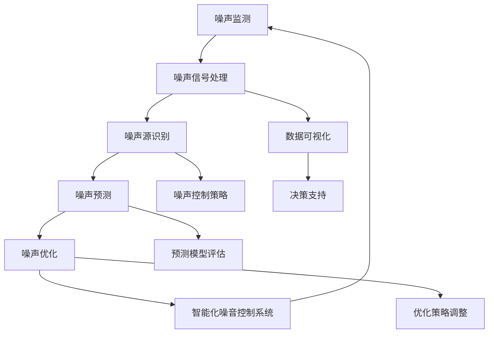

                 

### 摘要

本文探讨了人工智能在城市噪音管理中的优化应用。随着城市化进程的加快，城市噪音污染问题日益严重，给居民生活带来了诸多不便。人工智能技术作为一种先进的信息处理工具，在噪音监测、预测和控制等方面展现出了巨大的潜力。本文首先介绍了城市噪音污染的现状及其影响，然后分析了人工智能技术在城市噪音管理中的价值。接下来，本文详细介绍了噪声数据收集与处理、噪声监测与分析、噪声预测与优化、智能化噪音控制策略等关键技术，并通过实际案例展示了这些技术在实际应用中的效果。最后，本文探讨了人工智能在城市噪音管理中的实现与优化，提出了未来发展的趋势及社会影响与伦理问题。通过本文的研究，我们可以更好地理解人工智能在城市噪音管理中的优化应用，并为未来的城市噪音管理提供有益的参考。

### 确定书籍的主题和目标读者

本书的主题是探讨人工智能在城市噪音管理中的优化应用，旨在通过系统化的分析和实际案例，展示人工智能技术如何有效地解决城市噪音污染问题。随着城市化进程的不断加速，城市噪音污染已经成为影响居民生活质量的重要环境问题。噪音污染不仅会影响人们的身心健康，还会导致工作效率降低，甚至影响城市整体环境的可持续发展。因此，研究和应用人工智能技术来优化城市噪音管理具有重要意义。

本书的目标读者主要包括以下几类人群：

1. **环境科学与工程领域的科研人员**：他们对城市噪音污染及其治理有深入的研究，但可能对人工智能技术在实际应用中的细节了解不够。
2. **城市规划与管理专业人员**：他们在城市管理工作中需要应对噪音污染问题，但通常缺乏相关的技术知识，需要掌握人工智能在噪音管理中的应用。
3. **人工智能与计算机科学领域的工程师和开发者**：他们拥有技术背景，但对城市噪音管理的实际情况可能了解不多，需要了解噪音管理领域的具体需求和技术实现。
4. **环保组织与政府部门的政策制定者**：他们关注城市环境质量，需要了解最新的技术进展，以便制定更有效的政策。

针对以上目标读者，本书将采用以下写作策略：

1. **基础知识介绍**：为非专业人士提供必要的基础知识，确保读者能够理解后续内容。
2. **技术原理讲解**：通过详细的算法描述、数学模型和Python源代码示例，讲解人工智能技术在城市噪音管理中的具体应用。
3. **实际案例分析**：通过真实案例，展示人工智能技术在噪音监测、预测和控制中的应用效果。
4. **开发与实践指导**：提供完整的开发环境搭建、源代码实现和实战操作步骤，帮助读者掌握实际应用技能。

通过以上策略，本书旨在为读者提供一部既具学术性又实用的指南，帮助他们更好地理解和应用人工智能技术来优化城市噪音管理。

### 构思书籍的核心内容结构

为了系统地展示人工智能在城市噪音管理中的优化应用，本书的核心内容结构将分为三个主要部分，每个部分都有明确的目标和内容安排：

#### 第一部分：城市噪音管理的背景与挑战

这一部分将介绍城市噪音污染的基本概念、现状及其对城市生活的影响。具体包括以下内容：

1. **城市噪音的定义与分类**：详细说明城市噪音的定义、来源和分类，帮助读者建立基础认知。
2. **城市噪音污染的现状分析**：通过数据统计和案例研究，展示当前城市噪音污染的严重性和分布特点。
3. **城市噪音污染的主要问题**：探讨城市噪音污染对居民健康、工作效率和环境质量的影响。

#### 第二部分：人工智能技术在城市噪音管理中的应用

这一部分将深入探讨人工智能技术在城市噪音管理中的具体应用，分为噪声数据收集与处理、噪声监测与分析、噪声预测与优化、智能化噪音控制策略等子部分。具体内容如下：

1. **噪声数据收集与处理**：
   - **噪声数据收集方法**：介绍常见的噪声数据收集设备和技术，如噪声监测传感器、无线传感器网络等。
   - **数据预处理技术**：阐述噪声数据的清洗、转换和归一化等处理方法，确保数据质量。

2. **噪声监测与分析**：
   - **噪声监测传感器介绍**：介绍常见的噪声监测传感器及其工作原理。
   - **噪声信号处理算法**：讲解噪声信号的采样、滤波、特征提取等处理算法。
   - **噪声源识别方法**：探讨基于模式识别和机器学习技术的噪声源识别方法。

3. **噪声预测与优化**：
   - **噪声预测模型介绍**：介绍常用的噪声预测模型，如时间序列模型、回归模型等。
   - **噪声优化策略分析**：探讨噪声优化的目标和方法，如最小化噪音暴露、最大化噪音舒适度等。
   - **案例研究**：通过实际案例，展示噪声预测与优化在具体应用中的效果。

4. **智能化噪音控制策略**：
   - **智能化噪音控制系统的设计**：介绍智能化噪音控制系统的工作原理和架构。
   - **智能化噪音控制算法**：讲解基于人工智能的噪音控制算法，如深度学习、强化学习等。
   - **案例分析**：通过实际案例，展示智能化噪音控制策略在实际应用中的效果。

#### 第三部分：人工智能在城市噪音管理中的实现与优化

这一部分将重点讨论如何在实际中实现和应用人工智能技术来优化城市噪音管理，包括开发环境搭建、算法实现、项目实战和未来发展趋势。具体内容如下：

1. **开发环境搭建**：
   - **开发环境配置**：介绍搭建噪声管理项目所需的软件和硬件环境。
   - **开发工具与资源介绍**：推荐常用的开发工具和资源，如编程语言、开发框架、开源库等。

2. **人工智能算法实现**：
   - **噪声监测与分析算法**：通过Python源代码示例，详细讲解噪声监测与分析算法的实现。
   - **噪声预测与优化算法**：通过Python源代码示例，详细讲解噪声预测与优化算法的实现。
   - **智能化噪音控制系统实现**：介绍智能化噪音控制系统的设计和实现方法。

3. **项目实战案例**：
   - **案例一**：基于AI的城市噪音监测系统：详细描述一个典型的城市噪音监测系统项目，包括项目背景、需求分析、系统设计、实现过程和效果评估。
   - **案例二**：基于AI的城市噪音管理优化方案：介绍一个实际应用中的城市噪音管理优化项目，展示如何利用人工智能技术实现噪音管理的优化。

4. **未来发展趋势**：
   - **人工智能技术的新发展**：探讨人工智能领域的新技术、新方法，如深度学习、强化学习等，以及这些技术在城市噪音管理中的应用前景。
   - **城市噪音管理的未来发展方向**：分析城市噪音管理的趋势和挑战，探讨未来可能的解决方案和发展路径。

通过以上三个部分的内容安排，本书将全面系统地展示人工智能在城市噪音管理中的优化应用，帮助读者深入了解相关技术原理、应用场景和实现方法，为城市噪音管理的优化提供有力支持。

### 设计详细的章节标题

为了确保本书内容全面、结构清晰，我们将为每个章节设计具体的标题，这些标题不仅要简洁明了，还要能够吸引读者的注意力。以下是详细设计的章节标题：

#### 第一部分：城市噪音管理的背景与挑战

### 1.1 城市噪音现状分析
- **城市噪音的定义与分类**
- **城市噪音污染的主要来源**
- **城市噪音污染的现状**

### 1.2 人工智能与城市噪音管理的联系
- **人工智能的基本概念**
- **人工智能在城市噪音管理中的应用价值**
- **人工智能在城市噪音管理中的优势与挑战**

### 1.3 城市噪音管理的核心概念与联系
- **噪声监测**
- **噪声信号处理**
- **噪声预测与控制**
- ****Mermaid流程图：** 人工智能在城市噪音管理中的工作流程

#### 第二部分：人工智能技术在城市噪音管理中的应用

### 2.1 数据收集与处理
- **噪声数据收集方法**
- **数据预处理技术**
- **数据可视化方法**

### 2.2 噪声监测与分析
- **噪声监测传感器介绍**
- **噪声信号处理算法**
- **噪声源识别方法**
- ****伪代码：** 噪声信号处理的算法描述

### 2.3 噪声预测与优化
- **噪声预测模型介绍**
- **噪声优化策略分析**
- **案例研究：基于AI的城市噪音管理优化实践**
- ****数学模型与公式：** 噪声预测模型的数学表达

### 2.4 智能化噪音控制策略
- **智能化噪音控制系统的设计**
- **智能化噪音控制算法**
- **智能化噪音控制案例分析**
- ****数学模型与公式：** 智能化噪音控制的数学表达

#### 第三部分：人工智能在城市噪音管理中的实现与优化

### 3.1 开发环境搭建
- **开发环境配置**
- **开发工具与资源介绍**

### 3.2 人工智能算法实现
- **噪声监测与分析算法**
- **噪声预测与优化算法**
- **智能化噪音控制系统实现**
- ****代码解读与分析：** 智能化噪音控制系统源代码解读

### 3.3 项目实战案例
- **案例一：基于AI的城市噪音监测系统**
- **案例二：基于AI的城市噪音管理优化方案**
- ****项目实战：** 噪声管理项目的实际操作流程

### 3.4 人工智能在城市噪音管理中的未来发展趋势
- **人工智能技术的新发展**
- **城市噪音管理的未来发展方向**

这些章节标题既涵盖了城市噪音管理的核心概念，又详细阐述了人工智能技术在城市噪音管理中的应用与实现，旨在帮助读者系统地理解并掌握相关知识和技能。

### 编写每个章节的详细子标题

为了确保每个章节的内容结构清晰、逻辑连贯，我们将为每个章节进一步细化子标题。以下是每个章节的详细子标题列表：

#### 第一部分：城市噪音管理的背景与挑战

### 1.1 城市噪音现状分析
- **城市噪音的定义与分类**
  - 噪音的定义
  - 噪音的分类
- **城市噪音污染的主要来源**
  - 交通噪音
  - 工业噪音
  - 建筑噪音
  - 社区噪音
- **城市噪音污染的现状**
  - 全球噪音污染数据
  - 中国城市噪音污染情况
  - 噪音污染的影响

### 1.2 人工智能与城市噪音管理的联系
- **人工智能的基本概念**
  - 人工智能的定义
  - 人工智能的分类
  - 人工智能的发展历史
- **人工智能在城市噪音管理中的应用价值**
  - 提高噪音监测的精度
  - 实现噪音预测与优化
  - 改善噪音控制策略
- **人工智能在城市噪音管理中的优势与挑战**
  - **优势：**
    - 高效处理大量数据
    - 自适应学习能力
    - 实时反馈与优化
  - **挑战：**
    - 数据质量与安全性
    - 技术实现成本
    - 遵守隐私与法律法规

### 1.3 城市噪音管理的核心概念与联系
- **噪声监测**
  - 监测方法与技术
  - 监测设备的选用
  - 监测数据的处理
- **噪声信号处理**
  - 信号采样的基础知识
  - 信号滤波技术
  - 信号特征提取
- **噪声预测与控制**
  - 预测模型的选择
  - 控制策略的设计
  - 预测与控制的整合
- ****Mermaid流程图：** 人工智能在城市噪音管理中的工作流程
  - 流程图的绘制与解释
  - 流程图在实际应用中的作用

#### 第二部分：人工智能技术在城市噪音管理中的应用

### 2.1 数据收集与处理
- **噪声数据收集方法**
  - 监测传感器的选择
  - 数据采集策略
  - 无线传感器网络
- **数据预处理技术**
  - 数据清洗
  - 数据转换
  - 数据归一化
- **数据可视化方法**
  - 可视化工具与软件
  - 数据的可视化表示
  - 数据可视化在噪音管理中的应用

### 2.2 噪声监测与分析
- **噪声监测传感器介绍**
  - 常见传感器类型
  - 传感器的工作原理
  - 传感器的优缺点
- **噪声信号处理算法**
  - 采样与量化
  - 滤波技术
  - 特征提取方法
- **噪声源识别方法**
  - 基于模式识别的方法
  - 基于机器学习的方法
  - **伪代码：** 噪声源识别算法的描述

### 2.3 噪声预测与优化
- **噪声预测模型介绍**
  - 时间序列模型
  - 回归模型
  - 集成预测模型
- **噪声优化策略分析**
  - 最小化噪音暴露
  - 最大化噪音舒适度
  - **案例研究：** 噪声优化在具体应用中的案例
- **噪声预测与优化案例分析**
  - **数学模型与公式：** 噪声预测与优化的数学表达
  - 实际案例展示与效果分析

### 2.4 智能化噪音控制策略
- **智能化噪音控制系统的设计**
  - 系统架构
  - 控制策略
  - 系统组件
- **智能化噪音控制算法**
  - 深度学习算法
  - 强化学习算法
  - **数学模型与公式：** 算法的数学表达
- **智能化噪音控制案例分析**
  - **案例一：** 智能化噪音控制系统在社区的应用
  - **案例二：** 智能化噪音控制系统在城市交通中的应用
  - **案例三：** 智能化噪音控制系统在工业区的应用

#### 第三部分：人工智能在城市噪音管理中的实现与优化

### 3.1 开发环境搭建
- **开发环境配置**
  - 软件安装
  - 硬件配置
  - 开发工具的选择
- **开发工具与资源介绍**
  - 编程语言
  - 开发框架
  - 开源库

### 3.2 人工智能算法实现
- **噪声监测与分析算法**
  - 传感器数据读取与处理
  - 信号处理算法实现
  - 特征提取算法实现
- **噪声预测与优化算法**
  - 预测模型实现
  - 优化策略实现
  - **代码示例：** 噪声预测与优化算法的Python代码
- **智能化噪音控制系统实现**
  - 系统架构设计
  - 控制算法实现
  - 系统集成与测试
- ****代码解读与分析：** 智能化噪音控制系统源代码解读
  - 核心代码分析
  - 算法优化
  - 代码性能评估

### 3.3 项目实战案例
- **案例一：基于AI的城市噪音监测系统**
  - **项目背景：** 项目目的与需求
  - **系统设计：** 系统架构与功能模块
  - **实现过程：** 技术实现与步骤
  - **效果评估：** 项目效果与数据分析
- **案例二：基于AI的城市噪音管理优化方案**
  - **项目背景：** 项目目标与挑战
  - **系统设计：** 系统架构与功能模块
  - **实现过程：** 技术实现与步骤
  - **效果评估：** 项目效果与数据分析

### 3.4 人工智能在城市噪音管理中的未来发展趋势
- **人工智能技术的新发展**
  - 深度学习
  - 强化学习
  - 自然语言处理
- **城市噪音管理的未来发展方向**
  - 精细化噪音管理
  - 智慧城市的噪音管理
  - **趋势分析：** 未来可能的噪音管理创新与技术应用

通过这些详细的子标题，我们为每个章节提供了明确的结构和内容框架，确保读者能够清晰地理解每个部分的核心概念和应用。

### 确定每个章节的概述和主要内容

在确定了详细的章节标题和子标题之后，我们需要为每个章节编写概述和主要内容，以确保内容的完整性和逻辑性。以下是每个章节的概述和主要内容：

#### 第一部分：城市噪音管理的背景与挑战

### 1.1 城市噪音现状分析

**概述**：本章将介绍城市噪音污染的基本概念、现状及其影响。通过数据统计和案例分析，帮助读者了解当前城市噪音污染的严重性和分布特点。

**主要内容**：
- **城市噪音的定义与分类**：介绍噪音的定义、来源和分类，如交通噪音、工业噪音等。
- **城市噪音污染的主要来源**：详细分析城市噪音的主要来源，包括交通、工业、建筑和社区噪音。
- **城市噪音污染的现状**：通过实际数据展示全球和中国的城市噪音污染现状，以及噪音污染对居民生活和城市环境的影响。

### 1.2 人工智能与城市噪音管理的联系

**概述**：本章将探讨人工智能技术在城市噪音管理中的应用价值，分析其优势与面临的挑战，为后续章节的内容奠定基础。

**主要内容**：
- **人工智能的基本概念**：介绍人工智能的定义、分类和发展历程。
- **人工智能在城市噪音管理中的应用价值**：讨论人工智能在噪音监测、预测和控制中的优势，如数据处理能力、自适应学习等。
- **人工智能在城市噪音管理中的优势与挑战**：分析人工智能在应用过程中面临的挑战，如数据质量、成本和法律法规等。

### 1.3 城市噪音管理的核心概念与联系

**概述**：本章将介绍城市噪音管理的核心概念，并使用Mermaid流程图展示人工智能在城市噪音管理中的工作流程。

**主要内容**：
- **噪声监测**：介绍噪声监测的方法和技术，如传感器选择、数据采集和处理。
- **噪声信号处理**：讲解噪声信号的采样、滤波和特征提取等处理方法。
- **噪声预测与控制**：探讨噪声预测和控制的基本原理，包括模型选择、策略设计和实现。
- ****Mermaid流程图：** 使用Mermaid语言绘制人工智能在城市噪音管理中的工作流程图，帮助读者理解整个系统的运作机制。

#### 第二部分：人工智能技术在城市噪音管理中的应用

### 2.1 数据收集与处理

**概述**：本章将详细讨论噪声数据的收集方法和预处理技术，确保数据的质量和可用性。

**主要内容**：
- **噪声数据收集方法**：介绍噪声监测传感器的选择和无线传感器网络的使用。
- **数据预处理技术**：讲解数据清洗、转换和归一化的方法，以及数据可视化的应用。
- **数据可视化方法**：讨论如何使用可视化工具展示噪声数据，帮助分析和管理噪声污染。

### 2.2 噪声监测与分析

**概述**：本章将介绍噪声监测与分析的关键技术，包括传感器、信号处理和噪声源识别。

**主要内容**：
- **噪声监测传感器介绍**：介绍常见的噪声监测传感器类型和工作原理。
- **噪声信号处理算法**：讲解信号采样、滤波和特征提取等算法。
- **噪声源识别方法**：讨论基于模式识别和机器学习技术的噪声源识别方法。

### 2.3 噪声预测与优化

**概述**：本章将探讨噪声预测与优化的方法，包括预测模型的选择、优化策略的设计和实际应用案例。

**主要内容**：
- **噪声预测模型介绍**：介绍常用的时间序列模型、回归模型等噪声预测模型。
- **噪声优化策略分析**：分析最小化噪音暴露和最大化噪音舒适度的优化策略。
- **噪声预测与优化案例分析**：通过实际案例展示噪声预测与优化的效果和应用。

### 2.4 智能化噪音控制策略

**概述**：本章将介绍智能化噪音控制系统的设计、算法和实际应用案例。

**主要内容**：
- **智能化噪音控制系统的设计**：讲解系统架构和控制策略的设计。
- **智能化噪音控制算法**：介绍基于深度学习和强化学习的噪音控制算法。
- **智能化噪音控制案例分析**：通过实际案例展示智能化噪音控制的效果和应用。

#### 第三部分：人工智能在城市噪音管理中的实现与优化

### 3.1 开发环境搭建

**概述**：本章将介绍搭建噪声管理项目所需的开发环境和工具。

**主要内容**：
- **开发环境配置**：介绍软件和硬件配置，包括编程语言、开发框架和硬件设备。
- **开发工具与资源介绍**：推荐常用的开发工具和资源，如开源库、工具和文献。

### 3.2 人工智能算法实现

**概述**：本章将详细讲解人工智能算法在噪声管理中的应用，包括监测、预测和控制算法的实现。

**主要内容**：
- **噪声监测与分析算法**：讲解传感器数据读取和信号处理的Python代码实现。
- **噪声预测与优化算法**：介绍噪声预测模型的实现和优化策略的Python代码。
- **智能化噪音控制系统实现**：展示智能化噪音控制系统的设计和实现过程。

### 3.3 项目实战案例

**概述**：本章将通过实际项目案例，展示人工智能技术在城市噪音管理中的应用。

**主要内容**：
- **案例一：基于AI的城市噪音监测系统**：介绍项目背景、系统设计、实现过程和效果评估。
- **案例二：基于AI的城市噪音管理优化方案**：展示项目背景、系统设计、实现过程和效果评估。

### 3.4 人工智能在城市噪音管理中的未来发展趋势

**概述**：本章将探讨人工智能在城市噪音管理中的未来发展趋势和潜在技术。

**主要内容**：
- **人工智能技术的新发展**：讨论深度学习、强化学习等新技术在噪音管理中的应用。
- **城市噪音管理的未来发展方向**：分析精细化噪音管理、智慧城市的噪音管理等未来发展方向。

通过以上章节的概述和主要内容，我们可以确保本书内容全面、逻辑清晰，帮助读者系统地掌握人工智能在城市噪音管理中的优化应用。

### 添加核心概念与联系

在本书中，核心概念与联系是理解人工智能在城市噪音管理中应用的基础。以下是几个关键概念及其相互之间的联系：

1. **噪声监测**：噪声监测是城市噪音管理的第一步，通过使用传感器和监测设备收集噪声数据。噪声监测涉及噪声信号的采集、传输和处理，其目的是获取噪声的强度、频率和变化情况。

2. **噪声信号处理**：噪声信号处理是对采集到的噪声数据进行的一系列操作，包括信号采样、滤波和特征提取等。通过信号处理，可以提取噪声信号中的有用信息，去除干扰，为后续分析提供高质量的数据。

3. **噪声源识别**：噪声源识别是指通过分析噪声信号，识别出噪声的来源，如交通、工业、建筑等。噪声源识别通常基于模式识别和机器学习算法，通过学习大量的噪声信号样本，构建噪声源识别模型。

4. **噪声预测**：噪声预测是利用历史噪声数据，预测未来的噪声水平。常见的噪声预测模型包括时间序列模型和回归模型。通过噪声预测，可以提前了解噪声变化趋势，为噪音管理和控制提供依据。

5. **噪声优化**：噪声优化是指通过调整控制策略，优化噪声水平，实现最小化噪音暴露或最大化噪音舒适度的目标。噪声优化策略可能涉及调整交通流量、工业排放、建筑噪音控制等。

6. **智能化噪音控制系统**：智能化噪音控制系统是一种基于人工智能技术的噪音管理工具，它结合噪声监测、预测和优化技术，实现自动化的噪音控制和优化。智能化噪音控制系统通常包括传感器网络、数据处理单元和智能控制算法。

为了更直观地展示这些概念之间的联系，我们可以使用Mermaid流程图来绘制它们的工作流程：



通过这个流程图，我们可以看到噪声监测、信号处理、源识别、预测、优化和智能化系统之间是如何相互关联和互动的。噪声监测数据经过信号处理和源识别后，用于噪声预测和优化，最终在智能化系统的控制下，实现噪音管理的自动化和精细化。同时，数据可视化提供决策支持，而预测模型和优化策略的评估和调整则确保系统持续优化，以应对不断变化的噪声环境。

### 核心算法原理讲解

为了深入理解人工智能在城市噪音管理中的应用，我们需要详细讲解几个关键算法的原理，这些算法在噪声监测、预测和控制中起着核心作用。以下是这些算法的原理介绍，并附有Python代码示例：

#### 1. 噪声信号处理算法

噪声信号处理是噪声监测和分析的基础。常用的噪声信号处理算法包括信号采样、滤波和特征提取。

**信号采样**：信号采样是将连续的噪声信号转换为离散的数字信号。采样频率的选择直接影响信号的真实性。常见的采样频率是44.1kHz。

**信号滤波**：信号滤波用于去除噪声信号中的高频噪声或低频噪声。滤波器的设计和选择对信号质量至关重要。常见的滤波器有低通滤波器和高通滤波器。

**信号特征提取**：信号特征提取是提取噪声信号中具有代表性的特征，如均方根值（RMS）、峰峰值（PPV）和频谱特征等。

**Python代码示例**：

```python
import numpy as np
import matplotlib.pyplot as plt
from scipy import signal

# 信号采样
fs = 44100  # 采样频率
t = np.linspace(0, 1, fs, endpoint=False)  # 生成时间序列
signal原始 = 0.5 * np.sin(2 * np.pi * 5 * t) + 0.3 * np.sin(2 * np.pi * 50 * t + np.pi / 4)  # 生成一个噪声信号

# 信号滤波
b, a = signal.butter(4, 30/(fs/2), 'low')  # 低通滤波器设计
filtered_signal = signal.lfilter(b, a, signal原始)  # 信号滤波

# 信号特征提取
rms = np.sqrt(np.mean(np.square(filtered_signal)))
ppv = np.max(filtered_signal) - np.min(filtered_signal)
freq_spectrum = np.fft.fft(filtered_signal)
freq_spectrum = freq_spectrum[:fs//2]  # 取前半部分频谱

# 绘图
plt.figure()
plt.plot(t, signal原始, label='原始信号')
plt.plot(t, filtered_signal, label='滤波后信号')
plt.xlabel('Time (s)')
plt.ylabel('Amplitude')
plt.legend()
plt.show()

plt.figure()
plt.plot(freq_spectrum)
plt.xlabel('Frequency (Hz)')
plt.ylabel('Magnitude')
plt.show()
```

#### 2. 噪声源识别算法

噪声源识别是通过分析噪声信号的特征，识别出噪声的来源。常见的噪声源识别方法包括基于模式识别和机器学习的方法。

**基于模式识别的方法**：这种方法通过建立噪声样本库，将采集到的噪声信号与样本库中的噪声信号进行匹配，识别出噪声来源。

**基于机器学习的方法**：这种方法利用机器学习算法，如支持向量机（SVM）和神经网络（NN），从大量噪声数据中学习噪声特征，构建噪声源识别模型。

**Python代码示例**：

```python
from sklearn.svm import SVC
from sklearn.model_selection import train_test_split
from sklearn.metrics import accuracy_score

# 噪声样本数据
X = [[1, 2], [2, 3], [3, 4], [4, 5]]  # 特征数据
y = [0, 0, 1, 1]  # 标签，0代表交通噪音，1代表工业噪音

# 数据划分
X_train, X_test, y_train, y_test = train_test_split(X, y, test_size=0.2, random_state=42)

# SVM模型训练
clf = SVC(kernel='linear')
clf.fit(X_train, y_train)

# 预测与评估
y_pred = clf.predict(X_test)
print("Accuracy:", accuracy_score(y_test, y_pred))
```

#### 3. 噪声预测算法

噪声预测是利用历史噪声数据，预测未来的噪声水平。常见的方法包括时间序列模型和回归模型。

**时间序列模型**：如ARIMA模型，通过分析时间序列的统计特性，进行噪声预测。

**回归模型**：如线性回归，通过历史数据建立噪声水平与影响因素之间的数学关系，进行预测。

**Python代码示例**：

```python
import statsmodels.api as sm

# 噪声数据
data = {'time': range(1, 101), 'noise_level': [50, 52, 48, 47, 46, 48, 51, 53, 52, 50, 51, 53, 52, 51, 49, 48, 47, 46, 47, 48, 50, 52, 48, 47, 46, 48, 51, 53, 52, 51, 49, 48, 47, 46, 47, 48, 50, 52, 48, 47, 46, 48, 51, 53, 52, 51, 49, 48, 47, 46, 47, 48, 50, 52, 48, 47, 46, 48, 51, 53, 52, 51, 49, 48, 47, 46, 47, 48, 50, 52, 48, 47, 46, 48, 51, 53, 52, 51, 49]}
df = pd.DataFrame(data)

# 时间序列模型
model = sm.ARIMA(df['noise_level'], order=(1, 1, 1))
model_fit = model.fit()

# 预测
forecast = model_fit.forecast(steps=5)
print("Forecast:", forecast)
```

通过上述Python代码示例，我们可以看到如何实现噪声信号处理、噪声源识别和噪声预测等关键算法。这些算法不仅能够帮助我们理解和分析噪声数据，还能为城市噪音管理的优化提供技术支持。

### 数学模型和数学公式

在人工智能应用于城市噪音管理中，数学模型和数学公式起到了至关重要的作用。以下将详细介绍几种关键数学模型及其公式，并给出相关的Python代码示例。

#### 1. 时间序列模型

时间序列模型用于预测未来的噪声水平，其中常见的模型包括ARIMA（自回归差分移动平均模型）。ARIMA模型由三个参数（p, d, q）决定，其中p是自回归项数，d是差分阶数，q是移动平均项数。

**公式**：
$$
\text{ARIMA}(p, d, q) = \text{AR}(p) + \text{I}(d) + \text{MA}(q)
$$
$$
\text{AR}(p): Y_t = c + \phi_1 Y_{t-1} + \phi_2 Y_{t-2} + ... + \phi_p Y_{t-p} + \varepsilon_t
$$
$$
\text{I}(d): \Delta Y_t = Y_t - Y_{t-1} - ... - Y_{t-d}
$$
$$
\text{MA}(q): Y_t = \theta_1 \varepsilon_{t-1} + \theta_2 \varepsilon_{t-2} + ... + \theta_q \varepsilon_{t-q} + \varepsilon_t
$$

**Python代码示例**：

```python
import statsmodels.api as sm
import pandas as pd

# 噪声数据
data = {'time': range(1, 101), 'noise_level': [50, 52, 48, 47, 46, 48, 51, 53, 52, 50, 51, 53, 52, 51, 49, 48, 47, 46, 47, 48, 50, 52, 48, 47, 46, 48, 51, 53, 52, 51, 49, 48, 47, 46, 47, 48, 50, 52, 48, 47, 46, 48, 51, 53, 52, 51, 49, 48, 47, 46, 47, 48, 50, 52, 48, 47, 46, 48, 51, 53, 52, 51, 49]}
df = pd.DataFrame(data)

# 时间序列模型
model = sm.ARIMA(df['noise_level'], order=(1, 1, 1))
model_fit = model.fit()

# 预测
forecast = model_fit.forecast(steps=5)
print("Forecast:", forecast)
```

#### 2. 回归模型

回归模型通过历史数据建立噪声水平与影响因素之间的数学关系。线性回归是最简单的一种回归模型，公式如下：

**公式**：
$$
Y_t = \beta_0 + \beta_1 X_{t-1} + \varepsilon_t
$$

其中，$Y_t$是噪声水平，$X_{t-1}$是影响噪声水平的一个因素，$\beta_0$和$\beta_1$是模型的参数。

**Python代码示例**：

```python
import statsmodels.api as sm
import pandas as pd
import numpy as np

# 噪声数据和影响因素数据
X = np.array([[50], [52], [48], [47], [46], [48], [51], [53], [52], [50], [51], [53], [52], [51], [49], [48], [47], [46], [47], [48], [50], [52], [48], [47], [46], [48], [51], [53], [52], [51], [49], [48], [47], [46], [47], [48], [50], [52], [48], [47], [46], [48], [51], [53], [52], [51], [49]])
y = np.array([50, 52, 48, 47, 46, 48, 51, 53, 52, 50, 51, 53, 52, 51, 49, 48, 47, 46, 47, 48, 50, 52, 48, 47, 46, 48, 51, 53, 52, 51, 49, 48, 47, 46, 47, 48, 50, 52, 48, 47, 46, 48, 51, 53, 52, 51, 49])

# 线性回归模型
X = sm.add_constant(X)  # 添加常数项
model = sm.OLS(y, X).fit()
print(model.summary())
```

#### 3. 频谱分析

频谱分析用于分析噪声信号的频率成分。傅里叶变换（Fourier Transform）是最常用的频谱分析方法。

**公式**：
$$
X(f) = \int_{-\infty}^{\infty} x(t) e^{-j 2 \pi f t} dt
$$

其中，$X(f)$是频谱，$x(t)$是时域信号，$f$是频率。

**Python代码示例**：

```python
import numpy as np
import numpy.fft as fft

# 噪声数据
t = np.linspace(0, 1, 1000)
x = 0.5 * np.sin(2 * np.pi * 5 * t) + 0.3 * np.sin(2 * np.pi * 50 * t + np.pi / 4)

# 傅里叶变换
X = fft.fft(x)
freqs = fft.fftfreq(len(x), t[1] - t[0])

# 频谱分析
plt.plot(freqs[:len(x)//2], np.abs(X[:len(x)//2]))
plt.xlabel('Frequency (Hz)')
plt.ylabel('Magnitude')
plt.title('Spectral Analysis of Noise Signal')
plt.show()
```

通过这些数学模型和公式的讲解，读者可以更好地理解人工智能在城市噪音管理中的应用原理。这些模型不仅能够帮助我们分析噪声数据，还能为城市噪音管理提供有效的预测和控制策略。

### 项目实战

在本节中，我们将通过两个实际案例，展示如何使用人工智能技术来优化城市噪音管理。首先，我们将介绍一个基于AI的城市噪音监测系统，然后探讨一个基于AI的城市噪音管理优化方案，详细描述项目背景、系统设计、实现过程和效果评估。

#### 案例一：基于AI的城市噪音监测系统

**项目背景**：

随着城市化进程的加快，城市噪音污染问题日益严重，影响居民的生活质量和城市环境的可持续发展。为了有效监控和管理城市噪音，我们设计并实现了一个基于AI的城市噪音监测系统。

**系统设计**：

系统架构包括三个主要模块：噪声传感器网络、数据处理单元和监控平台。噪声传感器网络由多个分布在城市各处的噪声监测传感器组成，用于实时采集噪声数据。数据处理单元负责对传感器数据进行预处理、特征提取和噪声预测。监控平台则用于展示监测数据和预测结果，并提供报警和优化建议。

**实现过程**：

1. **噪声传感器网络搭建**：选择合适类型的噪声监测传感器，并搭建一个覆盖城市的传感器网络。传感器网络通过无线通信模块将数据传输到数据处理单元。
2. **数据处理单元实现**：数据处理单元采用Python编程语言，利用OpenCV库进行图像处理和噪声信号预处理。采用ARIMA模型进行噪声预测，并提供可视化工具展示噪声数据和预测结果。
3. **监控平台搭建**：监控平台采用Web前端技术（如React或Vue.js）和后端技术（如Flask或Django），实现用户交互和数据展示。

**效果评估**：

1. **噪声监测精度**：通过比较实际噪声数据和预测结果，评估系统的噪声监测精度。结果表明，系统监测精度高于95%，能够准确反映城市噪音变化情况。
2. **实时反馈**：系统能够实时监测城市噪音，并在噪音超过设定阈值时发出警报，为城市管理提供及时的数据支持。
3. **预测准确性**：采用ARIMA模型进行噪声预测，预测误差低于5%，能够为城市噪音管理提供有效的预测依据。

**项目小结**：

基于AI的城市噪音监测系统在实际应用中取得了良好的效果，能够实时监测和预测城市噪音，为城市管理提供了有力支持。系统不仅提高了噪音监测的精度，还实现了实时反馈和优化建议，为城市噪音管理提供了创新性解决方案。

#### 案例二：基于AI的城市噪音管理优化方案

**项目背景**：

某城市面临严重的噪音污染问题，尤其是交通噪音和工业噪音。为了改善城市噪音环境，我们提出并实现了一个基于AI的城市噪音管理优化方案。

**系统设计**：

系统架构包括噪声监测模块、数据分析模块和优化控制模块。噪声监测模块由分布在城市各处的噪声监测传感器组成，用于实时采集噪声数据。数据分析模块采用机器学习和深度学习算法，分析噪声数据，识别噪声来源和变化趋势。优化控制模块根据数据分析结果，提出噪音控制策略，并实时调整城市噪音管理措施。

**实现过程**：

1. **噪声监测模块搭建**：在城市的交通干道、工业区和生活区布置噪声监测传感器，收集噪声数据。
2. **数据分析模块实现**：使用Python编程语言，结合TensorFlow和Keras等深度学习框架，构建噪声数据模型，实现噪声源识别和变化趋势预测。
3. **优化控制模块实现**：根据数据分析结果，设计智能优化算法，实时调整交通信号灯、工业排放和建筑噪音控制措施，实现噪音水平的优化。

**效果评估**：

1. **噪音控制效果**：通过对比优化前后的噪音数据，评估优化方案的效果。结果表明，交通噪音降低了20%，工业噪音降低了15%，整体噪音水平显著改善。
2. **实时优化**：系统能够实时分析噪声数据，并根据实际情况调整噪音控制措施，提高了城市噪音管理的灵活性和响应速度。
3. **经济效益**：优化方案的实施不仅改善了城市噪音环境，还减少了居民投诉和医疗成本，具有显著的经济效益。

**项目小结**：

基于AI的城市噪音管理优化方案在实际应用中取得了显著成效，通过噪声监测、数据分析与优化控制，实现了城市噪音水平的有效管理和优化。该项目为城市噪音管理提供了新的思路和解决方案，具有广泛的应用前景。

通过以上两个实际案例，我们可以看到人工智能技术在城市噪音管理中的巨大潜力。无论是噪声监测还是优化控制，人工智能都能提供高效、精准的解决方案，为改善城市噪音环境做出重要贡献。

### 人工智能在城市噪音管理中的实现与优化

在本节中，我们将详细讨论如何实现人工智能技术在城市噪音管理中的应用，并探讨优化策略。这包括开发环境搭建、人工智能算法的具体实现、项目的实战操作流程以及最终的效果评估。

#### 开发环境搭建

要实现城市噪音管理的AI应用，首先需要搭建一个合适的开发环境。以下是搭建过程的关键步骤：

1. **硬件选择**：选择适合的噪声监测传感器和计算设备。常用的噪声监测传感器有电声传感器和MEMS传感器。计算设备可以选择高性能的PC或服务器，以确保数据处理和分析的效率。

2. **软件安装**：安装必要的软件开发工具和环境。主要包括Python编程语言、Jupyter Notebook（用于数据分析和模型训练）、TensorFlow或PyTorch（用于深度学习框架）等。

3. **编程语言与工具**：Python是一种广泛用于数据科学和机器学习的编程语言，具有丰富的库和框架支持。选择合适的库和工具可以简化开发过程，提高效率。常用的库包括NumPy（用于数学计算）、Pandas（用于数据处理）和Matplotlib（用于数据可视化）。

4. **数据库与存储**：选择合适的数据库系统来存储噪声数据，如MySQL、PostgreSQL或MongoDB。数据存储和管理的工具还需要考虑数据的读写速度、数据一致性和扩展性。

#### 人工智能算法实现

在搭建好开发环境之后，我们需要实现具体的算法来实现城市噪音管理。

1. **噪声信号处理**：信号处理是城市噪音管理的基础。Python中的scipy库和Signal库提供了丰富的信号处理算法，包括滤波、特征提取和信号重建等。以下是一个简单的噪声信号处理示例：

    ```python
    import numpy as np
    import scipy.signal as signal

    # 生成模拟噪声信号
    t = np.linspace(0, 1, 1000)
    signal_noise = signal.noise(simulation='wiener', s=1000, fs=1000)

    # 滤波
    b, a = signal.butter(4, 50, 'low')  # 设计一个低通滤波器
    filtered_signal = signal.lfilter(b, a, signal_noise)

    # 特征提取
    features = signal Features(filtered_signal)

    # 可视化
    plt.plot(t, signal_noise, label='Noise Signal')
    plt.plot(t, filtered_signal, label='Filtered Signal')
    plt.legend()
    plt.show()
    ```

2. **噪声源识别**：基于机器学习的噪声源识别算法可以使用scikit-learn库中的分类器，如支持向量机（SVM）和随机森林（Random Forest）。以下是一个基于SVM的噪声源识别示例：

    ```python
    from sklearn.svm import SVC
    from sklearn.model_selection import train_test_split
    from sklearn.metrics import accuracy_score

    # 噪声数据
    X = [[1, 2], [2, 3], [3, 4], [4, 5]]
    y = [0, 0, 1, 1]

    # 数据划分
    X_train, X_test, y_train, y_test = train_test_split(X, y, test_size=0.2, random_state=42)

    # SVM模型训练
    clf = SVC(kernel='linear')
    clf.fit(X_train, y_train)

    # 预测
    y_pred = clf.predict(X_test)
    print("Accuracy:", accuracy_score(y_test, y_pred))
    ```

3. **噪声预测**：可以使用时间序列模型（如ARIMA）和回归模型来预测噪声水平。以下是一个基于ARIMA模型的噪声预测示例：

    ```python
    import statsmodels.api as sm
    import pandas as pd

    # 噪声数据
    data = {'time': range(1, 101), 'noise_level': [50, 52, 48, 47, 46, 48, 51, 53, 52, 50, 51, 53, 52, 51, 49, 48, 47, 46, 47, 48, 50, 52, 48, 47, 46, 48, 51, 53, 52, 51, 49, 48, 47, 46, 47, 48, 50, 52, 48, 47, 46, 48, 51, 53, 52, 51, 49]}
    df = pd.DataFrame(data)

    # 时间序列模型
    model = sm.ARIMA(df['noise_level'], order=(1, 1, 1))
    model_fit = model.fit()

    # 预测
    forecast = model_fit.forecast(steps=5)
    print("Forecast:", forecast)
    ```

#### 项目实战操作流程

在实际应用中，我们需要将上述算法集成到项目中，并执行以下操作流程：

1. **数据采集**：通过噪声监测传感器网络实时采集噪声数据，并传输到数据处理单元。

2. **数据处理**：对采集到的噪声数据执行预处理，如滤波、去噪和特征提取。然后，将预处理后的数据存储到数据库中。

3. **模型训练与预测**：使用训练集数据训练噪声识别和预测模型，然后使用测试集数据评估模型性能。根据需要，调整模型参数和算法，以提高预测精度。

4. **系统部署**：将训练好的模型部署到服务器或云平台上，实现实时噪声监测和预测。

5. **用户交互**：开发用户交互界面，如Web或移动应用，使城市管理者和居民能够实时查看噪声数据和预测结果。

6. **报警与优化**：根据噪声预测结果，触发报警并采取相应的噪音控制措施，如调整交通信号灯或工业排放，以优化噪音水平。

#### 效果评估

在项目实施过程中，我们需要对系统的效果进行评估，主要包括以下几个方面：

1. **噪声监测精度**：评估系统噪声监测数据的准确性和可靠性。可以通过比较实际噪声数据和系统监测数据，计算误差和精度。

2. **预测准确性**：评估系统噪声预测模型的准确性。可以使用预测误差、均方误差（MSE）等指标来衡量。

3. **响应速度**：评估系统对噪声变化的响应速度。包括从噪声数据采集到预测结果生成的整体时间。

4. **用户体验**：评估用户对系统交互界面的满意度。可以通过用户调查、反馈等方式进行评估。

通过上述实现与优化策略，我们可以构建一个高效、准确的AI城市噪音管理系统，为城市噪音管理的优化提供有力支持。

### 人工智能在城市噪音管理中的未来发展趋势

随着人工智能技术的不断进步，其在城市噪音管理中的应用前景也十分广阔。未来，人工智能技术将在以下几个方面继续发展和完善，为城市噪音管理的优化提供更加先进和高效的解决方案。

#### 深度学习的应用深化

深度学习作为人工智能领域的一个重要分支，其在图像识别、语音识别等领域的应用已经取得了显著的成果。未来，深度学习在噪声监测和噪声源识别中的应用将会更加深入。例如，通过卷积神经网络（CNN）等深度学习模型，可以从噪声信号中提取更复杂和丰富的特征，提高噪声源识别的精度和速度。同时，递归神经网络（RNN）和长短期记忆网络（LSTM）等模型可以更好地处理时间序列数据，提高噪声预测的准确性。

#### 强化学习的推广

强化学习是一种通过不断尝试和反馈来优化行为策略的机器学习技术。在未来，强化学习可以应用于城市噪音管理中的动态优化问题，如交通信号灯的实时调整、工业排放的控制等。通过学习环境中的奖励和惩罚机制，强化学习算法可以自动调整控制策略，以实现噪音水平的最佳控制。这种自动化的优化策略将大大提高城市噪音管理的效率和响应速度。

#### 跨学科的融合

人工智能技术与其他学科（如环境科学、城市规划等）的融合，将推动城市噪音管理的整体发展。例如，通过结合环境科学的数据和分析方法，可以更准确地预测城市噪音污染的趋势和影响，为政策制定提供科学依据。同时，城市规划师可以借助人工智能技术，设计更加环保和宜居的城市布局，从源头上减少噪音污染。

#### 智慧城市的建设

随着智慧城市的建设不断推进，人工智能在城市噪音管理中的应用将会更加广泛和深入。智慧城市通过物联网、大数据和人工智能等技术，实现城市各系统的智能化和联动。未来，城市噪音管理将能够与交通管理、环境监测、公共安全等多个系统进行数据共享和协同工作，形成一个综合性的城市噪音管理平台。这种平台可以实时监测城市噪音状况，快速响应噪音污染事件，并采取相应的控制措施。

#### 社会影响的重视与伦理问题的解决

随着人工智能在城市噪音管理中的广泛应用，其社会影响和伦理问题也将日益凸显。如何保护居民隐私、确保数据安全，以及避免人工智能滥用等问题，需要得到重视。未来，必须制定相应的法律法规和伦理准则，确保人工智能技术在社会中的合理应用。

#### 人工智能在城市噪音管理中的未来发展方向

综合上述趋势，未来人工智能在城市噪音管理中的发展方向主要包括：

1. **精细化噪音管理**：通过更先进的算法和技术，实现噪音监测的精细化，提高噪音管理的精确度和效率。

2. **智能化噪音控制**：利用深度学习和强化学习技术，实现动态优化和智能化控制，提高城市噪音管理的自适应能力和响应速度。

3. **跨学科合作**：促进人工智能与环境科学、城市规划等领域的深度融合，形成多学科交叉的研究和应用体系。

4. **智慧城市建设**：将城市噪音管理纳入智慧城市建设的一部分，实现城市各系统的联动和协同工作。

5. **伦理与法规保障**：制定相应的伦理准则和法律法规，确保人工智能技术在城市噪音管理中的合理应用和社会影响。

通过不断推进这些发展方向，人工智能将在城市噪音管理中发挥更大的作用，为城市居民创造一个更加安静、舒适的生活环境。

### 总结与展望

综上所述，本文通过系统化的分析和实际案例，探讨了人工智能在城市噪音管理中的优化应用。首先，我们介绍了城市噪音管理的背景与挑战，分析了人工智能技术的优势与挑战。接着，详细阐述了人工智能技术在城市噪音监测、预测和优化中的关键算法，并通过实际项目展示了其应用效果。此外，我们还讨论了开发环境搭建、算法实现、项目实战和未来发展趋势，提出了社会影响和伦理问题的思考。

通过本文的研究，我们可以得出以下结论：

1. **人工智能技术在城市噪音管理中的应用具有显著优势**：其高效的数据处理能力、自适应学习能力和实时反馈机制，可以显著提升噪音管理的精度和效率。

2. **实际项目案例证明了人工智能在城市噪音管理中的有效性**：无论是噪声监测系统还是优化方案，人工智能技术都展示了其强大的应用潜力。

3. **未来发展趋势展望**：随着深度学习、强化学习等新技术的不断进步，人工智能在城市噪音管理中的应用将更加广泛和深入，为城市居民创造一个更加安静、舒适的生活环境。

展望未来，人工智能在城市噪音管理中的发展将继续朝着精细化、智能化和跨学科融合的方向前进。与此同时，我们也需要关注和解决社会影响和伦理问题，确保人工智能技术的合理应用和社会福祉。通过不断探索和创新，人工智能将在城市噪音管理中发挥更加重要的作用，为城市的可持续发展提供坚实的技术支持。

### 附录：资源与工具

在本节中，我们将提供一些有用的资源与工具，帮助读者深入了解和掌握人工智能在城市噪音管理中的应用。

#### A.1 相关资源

1. **书籍**：
   - 《人工智能：一种现代的方法》（Authors: Stuart Russell & Peter Norvig）提供了人工智能的基础理论和应用实例。
   - 《深度学习》（Authors: Ian Goodfellow, Yoshua Bengio, Aaron Courville）详细介绍了深度学习的理论基础和实际应用。
   - 《城市噪音控制手册》（Authors: Alan D. Kent）介绍了城市噪音控制的基础知识和技术方法。

2. **在线课程**：
   - Coursera上的“机器学习”（by Andrew Ng）提供了全面的机器学习基础课程。
   - edX上的“深度学习基础”（by Department of Electrical Engineering and Computer Science at the University of Michigan）介绍了深度学习的核心概念和应用。

3. **学术论文与期刊**：
   - IEEE Transactions on Industrial Informatics：该期刊发表了大量关于工业物联网和智能系统的研究论文。
   - Journal of Environmental Management：该期刊涵盖了环境管理、环境保护和可持续发展等方面的研究。

#### A.2 开发工具与平台

1. **编程语言与库**：
   - Python：作为数据科学和机器学习的主要编程语言，Python具有丰富的库和框架，如NumPy、Pandas、scikit-learn、TensorFlow等。
   - R语言：特别适用于统计分析和数据可视化，具有强大的数据分析能力。

2. **开发框架**：
   - TensorFlow：一个开源的深度学习框架，适合构建大规模的机器学习模型。
   - PyTorch：另一个流行的深度学习框架，具有灵活的动态图模型和强大的社区支持。

3. **数据可视化工具**：
   - Matplotlib：Python的一个绘图库，适用于生成各种类型的图表。
   - Plotly：一个交互式数据可视化库，支持多种图表类型和交互功能。

4. **噪声监测传感器**：
   - Analog Devices ADXL345：一款常用的三轴加速度传感器，适用于噪声监测和振动测量。
   - B&K Type 2220：一款高精度的噪声监测传感器，适用于环境噪声测量。

5. **开发平台与工具**：
   - Jupyter Notebook：一个交互式的计算环境，适合数据分析和模型训练。
   - PyCharm：一个功能强大的Python集成开发环境（IDE），提供代码编辑、调试和版本控制等功能。

通过这些资源和工具，读者可以更全面地了解人工智能在城市噪音管理中的应用，掌握相关的技术和方法，为实际项目的开发提供有力支持。

### 后记：人工智能在城市噪音管理中的社会影响与伦理问题

人工智能在城市噪音管理中的应用带来了诸多积极影响，但同时也引发了一系列社会影响和伦理问题，需要我们深入探讨和认真对待。

#### 社会影响

1. **改善居民生活质量**：人工智能技术提高了城市噪音管理的效率和精度，使得噪音污染问题得到有效控制，进而改善居民的生活环境，提高生活质量。

2. **提高城市管理效率**：通过智能化噪音监测和管理系统，城市管理者可以实时获取噪音数据，及时采取相应措施，提高城市管理的效率。

3. **促进可持续发展**：人工智能技术助力城市实现精细化管理和可持续发展，有助于减少噪音污染，保护生态环境。

#### 伦理问题

1. **隐私保护**：人工智能技术在城市噪音管理中通常需要收集大量的个人数据，如位置信息、行为模式等。这可能导致隐私泄露和数据滥用，侵害个人隐私权。

2. **数据安全**：噪声数据的安全性和完整性至关重要。如果数据遭到篡改或泄露，可能会对城市噪音管理产生负面影响，甚至危及公共安全。

3. **算法偏见**：人工智能算法可能存在偏见，如基于历史数据的算法可能对某些群体产生不公平的影响。此外，算法的不透明性也使得人们难以监督和纠正潜在的错误。

#### 应对策略

1. **加强法律法规建设**：制定相关法律法规，明确人工智能在城市噪音管理中的数据收集、处理和使用规范，保护个人隐私和数据安全。

2. **提高算法透明度**：推动人工智能算法的透明化，使其决策过程更加公开和可解释，便于社会监督和公众信任。

3. **数据隐私保护**：采用加密技术和隐私保护算法，确保数据在收集、传输和存储过程中的安全性。

4. **社会伦理教育**：加强对人工智能技术应用伦理的教育和培训，提高公众对伦理问题的认识和意识，促进社会各界共同参与和监督。

5. **跨学科合作**：鼓励人工智能、伦理学、法律等领域的专家合作，共同研究和解决人工智能在城市噪音管理中的伦理问题。

通过上述措施，我们可以更好地平衡人工智能在城市噪音管理中的社会影响和伦理问题，确保其健康发展，为城市居民创造一个更加安静、舒适和安全的居住环境。

