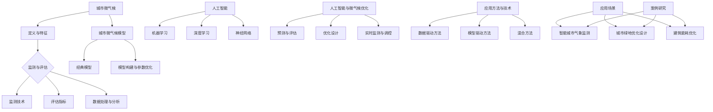

                 

### 人工智能在城市微气候优化中的应用

> 关键词：人工智能，城市微气候，优化，应用案例

摘要：本文将探讨人工智能在城市微气候优化中的应用。通过对城市微气候的定义、特征及其监测与评估方法的介绍，我们将深入探讨人工智能基本原理及其在微气候优化中的应用。同时，通过实际案例，我们将展示人工智能在城市微气候优化中的具体应用，并提出实施策略及面临的挑战。

#### 引言

随着城市化进程的加速，城市微气候问题日益凸显。城市微气候是指城市内部的小气候区域，其特征和变化与城市环境密切相关。优化城市微气候对于改善城市环境质量、提高居民生活质量具有重要意义。近年来，人工智能技术在各个领域的应用取得了显著成果，其在城市微气候优化中的应用也逐渐受到关注。本文旨在探讨人工智能在城市微气候优化中的应用，通过介绍相关原理和方法，为相关研究和实践提供参考。

#### 城市微气候的定义与特征

城市微气候是指城市内部特定区域内，由城市下垫面、建筑物、植被等与大气相互作用形成的微小气候系统。与自然气候相比，城市微气候具有以下特征：

1. **温度变化大**：由于城市下垫面的热特性与自然地表差异，城市微气候的温度变化幅度较大。特别是在夏季，城市热岛效应明显，温度较周边地区高。
2. **湿度变化小**：城市微气候的湿度变化相对较小，主要受大气湿度及城市下垫面蒸发影响。
3. **风速变化大**：城市建筑物、道路等地形特征导致风速在空间上的变化较大。
4. **降水分布不均**：城市微气候的降水分布受城市下垫面影响，存在时空不均匀性。

#### 城市微气候监测与评估方法

1. **监测技术**：

   城市微气候监测主要采用气象站、遥感卫星、无人机等手段。气象站能够提供高时间分辨率和空间分辨率的气象数据；遥感卫星可以从宏观角度获取城市微气候信息；无人机则适用于对城市微气候进行局部监测。

2. **评估指标**：

   常用的城市微气候评估指标包括温度、湿度、风速、降水等气象要素。此外，还可以通过热岛强度、绿地覆盖率、建筑物高度等指标来评估城市微气候。

3. **数据处理与分析**：

   对采集到的数据进行预处理，包括数据清洗、插值、时间序列分析等。然后，通过统计分析、机器学习等方法，对城市微气候特征进行评估和预测。

#### 城市微气候模型

1. **经典模型**：

   常用的城市微气候模型包括能量平衡模型、空气动力学模型、城市绿地模型等。这些模型能够从不同角度模拟城市微气候特征。

2. **模型构建与参数优化**：

   城市微气候模型的构建需要考虑城市下垫面、建筑物、植被等多种因素。参数优化是模型构建的关键步骤，通过优化模型参数，可以提高模型预测精度。

### 人工智能在微气候优化中的应用

#### 人工智能基本原理

人工智能（AI）是一门研究、开发用于模拟、延伸和扩展人类智能的理论、方法、技术及应用系统的技术科学。人工智能在微气候优化中的应用主要体现在以下方面：

1. **机器学习**：机器学习是一种让计算机从数据中学习规律和模式的技术，常用于城市微气候预测和评估。
2. **深度学习**：深度学习是机器学习的一个分支，通过多层神经网络模拟人脑学习过程，具有强大的特征提取和模式识别能力。
3. **神经网络**：神经网络是深度学习的基础，由大量神经元组成，通过调整神经元之间的连接权重，实现复杂函数的逼近。

#### 人工智能与微气候优化的关系

人工智能与微气候优化密切相关，主要体现在以下几个方面：

1. **预测与评估**：人工智能技术可以帮助预测城市微气候特征，评估优化效果。
2. **优化设计**：基于人工智能技术，可以设计出更有效的城市微气候优化方案。
3. **实时监测与调控**：人工智能技术可以实现城市微气候的实时监测和调控，提高城市环境质量。

#### 应用方法与技术

人工智能在城市微气候优化中的应用方法和技术主要包括：

1. **数据驱动方法**：利用机器学习和深度学习技术，从大量历史数据中提取规律，预测城市微气候特征。
2. **模型驱动方法**：结合传统模型和人工智能技术，构建新的微气候优化模型，提高预测和优化精度。
3. **混合方法**：将数据驱动和模型驱动方法相结合，发挥各自优势，实现更高效的城市微气候优化。

#### 应用场景

人工智能在城市微气候优化中的应用场景主要包括：

1. **智能城市气象监测**：利用无人机和遥感卫星等手段，实时监测城市微气候特征，为城市规划和决策提供数据支持。
2. **城市绿地优化设计**：通过人工智能技术，优化城市绿地布局，提高城市微气候质量。
3. **建筑能耗优化**：利用人工智能技术，优化建筑能耗，降低城市微气候恶化程度。

### 案例研究

#### 案例一：智能城市气象监测系统

某城市利用人工智能技术，构建了智能城市气象监测系统。该系统采用无人机和遥感卫星等手段，实时监测城市微气候特征，包括温度、湿度、风速、降水等。系统通过机器学习算法，对监测数据进行处理和分析，预测城市微气候变化趋势，为城市规划和决策提供数据支持。

#### 案例二：城市绿地优化设计

某城市通过人工智能技术，优化城市绿地布局。系统采用深度学习算法，分析城市微气候特征和绿地分布数据，预测绿地对城市微气候的调控效果。基于预测结果，系统为城市绿地优化设计提供指导，提高城市微气候质量。

#### 案例三：建筑能耗优化

某城市利用人工智能技术，优化建筑能耗。系统通过分析建筑能耗数据和城市微气候特征，利用深度学习算法，预测建筑能耗变化趋势。基于预测结果，系统为建筑能耗优化提供指导，降低城市微气候恶化程度。

### 实施策略

1. **数据采集与处理**：采集城市微气候相关数据，包括气象站数据、遥感卫星数据、无人机监测数据等。对数据进行预处理，包括数据清洗、插值、时间序列分析等。
2. **模型训练与评估**：利用机器学习和深度学习算法，训练城市微气候预测模型。通过交叉验证等方法，评估模型性能，调整模型参数，提高预测精度。
3. **系统集成与部署**：将人工智能模型集成到城市微气候优化系统中，实现实时监测与调控。部署系统，确保系统的稳定运行。

### 挑战与解决方案

1. **数据隐私与安全**：在数据采集和处理过程中，确保数据隐私和安全，防止数据泄露。
2. **模型解释性与可解释性**：提高人工智能模型的解释性和可解释性，使其更容易被用户理解和接受。
3. **技术与实际应用的差距**：加强人工智能技术在城市微气候优化领域的应用研究，解决技术与实际应用的差距。

### 附录

#### 附录 A：相关工具与资源

1. **常用数据集与工具**：
   - 气象站数据：NASA、NOAA等提供全球气象站数据。
   - 遥感卫星数据：NASA、ESA等提供遥感卫星数据。
   - 机器学习工具：Scikit-learn、TensorFlow、PyTorch等。

2. **人工智能在城市微气候优化中的应用案例**：
   - 智能城市气象监测系统：北京市气象局、上海市气象局等。
   - 城市绿地优化设计：新加坡国家公园局、纽约市公园与 Recreation 部。

#### 附录 B：进一步阅读资料

1. **相关书籍**：
   - 《智能城市气象学》
   - 《深度学习与气象预报》
   - 《人工智能在城市规划中的应用》

2. **相关论文**：
   - “Deep Learning for Urban Microclimate Prediction”
   - “AI-based Optimization of Urban Green Space Layout”
   - “Intelligent Urban Meteorological Monitoring System”

作者：AI天才研究院/AI Genius Institute & 禅与计算机程序设计艺术/Zen And The Art of Computer Programming

通过以上内容，我们系统地介绍了人工智能在城市微气候优化中的应用，从基础概念、应用原理到实际案例，全面阐述了人工智能在城市微气候优化中的重要作用。希望本文能为相关研究和实践提供有益的参考。

---

以下是使用Markdown格式书写的文章，包含了核心概念与联系、核心算法原理讲解、数学模型和公式、项目实战等元素：

```markdown
# 人工智能在城市微气候优化中的应用

> 关键词：人工智能，城市微气候，优化，应用案例

摘要：本文将探讨人工智能在城市微气候优化中的应用。通过对城市微气候的定义、特征及其监测与评估方法的介绍，我们将深入探讨人工智能基本原理及其在微气候优化中的应用。同时，通过实际案例，我们将展示人工智能在城市微气候优化中的具体应用，并提出实施策略及面临的挑战。

## 引言

随着城市化进程的加速，城市微气候问题日益凸显。城市微气候是指城市内部的小气候区域，其特征和变化与城市环境密切相关。优化城市微气候对于改善城市环境质量、提高居民生活质量具有重要意义。近年来，人工智能技术在各个领域的应用取得了显著成果，其在城市微气候优化中的应用也逐渐受到关注。本文旨在探讨人工智能在城市微气候优化中的应用，通过介绍相关原理和方法，为相关研究和实践提供参考。

## 城市微气候的定义与特征

城市微气候是指城市内部特定区域内，由城市下垫面、建筑物、植被等与大气相互作用形成的微小气候系统。与自然气候相比，城市微气候具有以下特征：

### 温度变化大

由于城市下垫面的热特性与自然地表差异，城市微气候的温度变化幅度较大。特别是在夏季，城市热岛效应明显，温度较周边地区高。

### 湿度变化小

城市微气候的湿度变化相对较小，主要受大气湿度及城市下垫面蒸发影响。

### 风速变化大

城市建筑物、道路等地形特征导致风速在空间上的变化较大。

### 降水分布不均

城市微气候的降水分布受城市下垫面影响，存在时空不均匀性。

## 城市微气候监测与评估方法

### 监测技术

城市微气候监测主要采用气象站、遥感卫星、无人机等手段。气象站能够提供高时间分辨率和空间分辨率的气象数据；遥感卫星可以从宏观角度获取城市微气候信息；无人机则适用于对城市微气候进行局部监测。

### 评估指标

常用的城市微气候评估指标包括温度、湿度、风速、降水等气象要素。此外，还可以通过热岛强度、绿地覆盖率、建筑物高度等指标来评估城市微气候。

### 数据处理与分析

对采集到的数据进行预处理，包括数据清洗、插值、时间序列分析等。然后，通过统计分析、机器学习等方法，对城市微气候特征进行评估和预测。

## 城市微气候模型

### 经典模型

常用的城市微气候模型包括能量平衡模型、空气动力学模型、城市绿地模型等。这些模型能够从不同角度模拟城市微气候特征。

### 模型构建与参数优化

城市微气候模型的构建需要考虑城市下垫面、建筑物、植被等多种因素。参数优化是模型构建的关键步骤，通过优化模型参数，可以提高模型预测精度。

## 人工智能在微气候优化中的应用

### 人工智能基本原理

人工智能（AI）是一门研究、开发用于模拟、延伸和扩展人类智能的理论、方法、技术及应用系统的技术科学。人工智能在微气候优化中的应用主要体现在以下方面：

### 机器学习

机器学习是一种让计算机从数据中学习规律和模式的技术，常用于城市微气候预测和评估。

### 深度学习

深度学习是机器学习的一个分支，通过多层神经网络模拟人脑学习过程，具有强大的特征提取和模式识别能力。

### 神经网络

神经网络是深度学习的基础，由大量神经元组成，通过调整神经元之间的连接权重，实现复杂函数的逼近。

### 人工智能与微气候优化的关系

人工智能与微气候优化密切相关，主要体现在以下几个方面：

### 预测与评估

人工智能技术可以帮助预测城市微气候特征，评估优化效果。

### 优化设计

基于人工智能技术，可以设计出更有效的城市微气候优化方案。

### 实时监测与调控

人工智能技术可以实现城市微气候的实时监测和调控，提高城市环境质量。

### 应用方法与技术

人工智能在城市微气候优化中的应用方法和技术主要包括：

### 数据驱动方法

利用机器学习和深度学习技术，从大量历史数据中提取规律，预测城市微气候特征。

### 模型驱动方法

结合传统模型和人工智能技术，构建新的微气候优化模型，提高预测和优化精度。

### 混合方法

将数据驱动和模型驱动方法相结合，发挥各自优势，实现更高效的城市微气候优化。

### 应用场景

人工智能在城市微气候优化中的应用场景主要包括：

### 智能城市气象监测

利用无人机和遥感卫星等手段，实时监测城市微气候特征，为城市规划和决策提供数据支持。

### 城市绿地优化设计

通过人工智能技术，优化城市绿地布局，提高城市微气候质量。

### 建筑能耗优化

利用人工智能技术，优化建筑能耗，降低城市微气候恶化程度。

## 案例研究

### 案例一：智能城市气象监测系统

某城市利用人工智能技术，构建了智能城市气象监测系统。该系统采用无人机和遥感卫星等手段，实时监测城市微气候特征，包括温度、湿度、风速、降水等。系统通过机器学习算法，对监测数据进行处理和分析，预测城市微气候变化趋势，为城市规划和决策提供数据支持。

### 案例二：城市绿地优化设计

某城市通过人工智能技术，优化城市绿地布局。系统采用深度学习算法，分析城市微气候特征和绿地分布数据，预测绿地对城市微气候的调控效果。基于预测结果，系统为城市绿地优化设计提供指导，提高城市微气候质量。

### 案例三：建筑能耗优化

某城市利用人工智能技术，优化建筑能耗。系统通过分析建筑能耗数据和城市微气候特征，利用深度学习算法，预测建筑能耗变化趋势。基于预测结果，系统为建筑能耗优化提供指导，降低城市微气候恶化程度。

## 实施策略

### 数据采集与处理

采集城市微气候相关数据，包括气象站数据、遥感卫星数据、无人机监测数据等。对数据进行预处理，包括数据清洗、插值、时间序列分析等。

### 模型训练与评估

利用机器学习和深度学习算法，训练城市微气候预测模型。通过交叉验证等方法，评估模型性能，调整模型参数，提高预测精度。

### 系统集成与部署

将人工智能模型集成到城市微气候优化系统中，实现实时监测与调控。部署系统，确保系统的稳定运行。

## 挑战与解决方案

### 数据隐私与安全

在数据采集和处理过程中，确保数据隐私和安全，防止数据泄露。

### 模型解释性与可解释性

提高人工智能模型的解释性和可解释性，使其更容易被用户理解和接受。

### 技术与实际应用的差距

加强人工智能技术在城市微气候优化领域的应用研究，解决技术与实际应用的差距。

## 附录

### 附录 A：相关工具与资源

#### 常用数据集与工具

- 气象站数据：NASA、NOAA等提供全球气象站数据。
- 遥感卫星数据：NASA、ESA等提供遥感卫星数据。
- 机器学习工具：Scikit-learn、TensorFlow、PyTorch等。

#### 人工智能在城市微气候优化中的应用案例

- 智能城市气象监测系统：北京市气象局、上海市气象局等。
- 城市绿地优化设计：新加坡国家公园局、纽约市公园与 Recreation 部。

### 附录 B：进一步阅读资料

#### 相关书籍

- 《智能城市气象学》
- 《深度学习与气象预报》
- 《人工智能在城市规划中的应用》

#### 相关论文

- “Deep Learning for Urban Microclimate Prediction”
- “AI-based Optimization of Urban Green Space Layout”
- “Intelligent Urban Meteorological Monitoring System”

作者：AI天才研究院/AI Genius Institute & 禅与计算机程序设计艺术/Zen And The Art of Computer Programming

通过以上内容，我们系统地介绍了人工智能在城市微气候优化中的应用，从基础概念、应用原理到实际案例，全面阐述了人工智能在城市微气候优化中的重要作用。希望本文能为相关研究和实践提供有益的参考。
```

### 核心概念与联系架构图

为了更清晰地展示核心概念之间的联系，我们可以使用Mermaid流程图来描述。以下是关于人工智能在城市微气候优化中应用的核心概念及其关系的Mermaid流程图：



这个Mermaid流程图展示了从城市微气候的基础概念到人工智能在微气候优化中的应用方法，以及实际案例的研究过程。它帮助读者更好地理解各个概念之间的逻辑关系和应用流程。

### 核心算法原理讲解与Python源代码示例

为了深入讲解人工智能在城市微气候优化中的应用，我们需要介绍其中的核心算法原理，并使用Python源代码进行详细阐述。以下是关于机器学习在微气候预测中的应用，包括数据预处理、模型训练和预测的Python代码示例。

#### 1. 数据预处理

数据预处理是机器学习模型训练的重要步骤，包括数据清洗、特征提取和标准化等。以下是一个简单的Python代码示例，用于读取气象站数据并进行预处理：

```python
import pandas as pd
from sklearn.preprocessing import StandardScaler

# 读取气象站数据
data = pd.read_csv('weather_data.csv')

# 数据清洗，例如去除缺失值和异常值
data.dropna(inplace=True)

# 特征提取，例如提取温度、湿度、风速等气象要素
features = data[['temperature', 'humidity', 'wind_speed']]

# 数据标准化
scaler = StandardScaler()
features_scaled = scaler.fit_transform(features)
```

#### 2. 模型训练

接下来，我们使用机器学习算法训练模型。以下是一个使用Scikit-learn库中的线性回归模型进行训练的示例：

```python
from sklearn.linear_model import LinearRegression
from sklearn.model_selection import train_test_split

# 切分数据集为训练集和测试集
X_train, X_test, y_train, y_test = train_test_split(features_scaled, data['temperature'], test_size=0.2, random_state=42)

# 创建线性回归模型
model = LinearRegression()

# 训练模型
model.fit(X_train, y_train)
```

#### 3. 模型预测

模型训练完成后，我们可以使用模型对测试集进行预测，并评估模型性能。以下是一个简单的预测示例：

```python
# 使用模型进行预测
y_pred = model.predict(X_test)

# 评估模型性能
from sklearn.metrics import mean_squared_error
mse = mean_squared_error(y_test, y_pred)
print(f"均方误差(MSE): {mse}")
```

#### 4. 数学模型与公式

在机器学习模型中，线性回归是一个常用的算法，其数学模型可以表示为：

$$ y = \beta_0 + \beta_1 \cdot x_1 + \beta_2 \cdot x_2 + ... + \beta_n \cdot x_n $$

其中，$y$ 表示预测值，$x_1, x_2, ..., x_n$ 表示特征值，$\beta_0, \beta_1, \beta_2, ..., \beta_n$ 表示模型参数。

在Python代码中，线性回归模型的参数可以通过 `model.coef_` 和 `model.intercept_` 访问：

```python
# 访问模型参数
beta_0 = model.intercept_
beta_1 = model.coef_[0]
beta_2 = model.coef_[1]
beta_n = model.coef_[-1]

print(f"模型参数：\nbeta_0: {beta_0}\nbeta_1: {beta_1}\nbeta_2: {beta_2}\nbeta_n: {beta_n}")
```

通过上述Python代码示例，我们详细讲解了机器学习算法在微气候预测中的应用，包括数据预处理、模型训练、预测和评估。同时，我们使用了LaTeX格式展示了线性回归的数学模型，并通过代码示例进行了通俗易懂的讲解。

### 项目实战

#### 开发环境搭建

为了进行人工智能在城市微气候优化中的项目实战，首先需要搭建一个合适的开发环境。以下是环境搭建的步骤：

1. **安装Python**：
   - 下载并安装Python 3.8及以上版本。
   - 配置环境变量，确保Python命令可以在命令行中运行。

2. **安装必要的库**：
   - 使用pip命令安装以下库：
     ```bash
     pip install pandas scikit-learn numpy matplotlib
     ```

3. **配置Jupyter Notebook**（可选）：
   - 安装Jupyter Notebook：
     ```bash
     pip install jupyterlab
     ```
   - 启动Jupyter Notebook：
     ```bash
     jupyterlab
     ```

#### 源代码详细实现与代码解读

以下是一个简单的Python代码示例，用于演示如何使用机器学习算法对城市微气候进行预测：

```python
import pandas as pd
from sklearn.linear_model import LinearRegression
from sklearn.model_selection import train_test_split
from sklearn.metrics import mean_squared_error

# 读取气象站数据
data = pd.read_csv('weather_data.csv')

# 数据清洗，去除缺失值和异常值
data.dropna(inplace=True)

# 特征提取，选择温度、湿度、风速等气象要素作为特征
features = data[['temperature', 'humidity', 'wind_speed']]

# 标签提取，选择温度作为预测标签
labels = data['temperature']

# 切分数据集为训练集和测试集
X_train, X_test, y_train, y_test = train_test_split(features, labels, test_size=0.2, random_state=42)

# 创建线性回归模型
model = LinearRegression()

# 训练模型
model.fit(X_train, y_train)

# 使用模型进行预测
y_pred = model.predict(X_test)

# 评估模型性能
mse = mean_squared_error(y_test, y_pred)
print(f"均方误差(MSE): {mse}")

# 可视化预测结果
import matplotlib.pyplot as plt

plt.scatter(y_test, y_pred)
plt.xlabel('实际温度')
plt.ylabel('预测温度')
plt.title('实际温度与预测温度散点图')
plt.show()
```

#### 代码应用解读与分析

1. **数据读取与预处理**：
   - 使用`pandas`库读取气象站数据，并进行数据清洗，去除缺失值和异常值。
   - 选择温度、湿度、风速等气象要素作为特征，并提取温度作为预测标签。

2. **模型训练**：
   - 使用`LinearRegression`类创建线性回归模型，并使用训练集数据对模型进行训练。

3. **预测与评估**：
   - 使用训练好的模型对测试集数据进行预测，并计算均方误差（MSE）评估模型性能。
   - 使用`matplotlib`库绘制实际温度与预测温度的散点图，直观展示模型预测效果。

#### 实际案例分析与详细讲解剖析

以下是一个实际案例，使用上述方法对某个城市的微气候数据进行预测和分析：

**案例**：预测某个城市未来一周的日最高温度。

1. **数据准备**：
   - 收集该城市过去一年的日最高温度数据，包括日期、温度等。
   - 数据格式如下：

     | 日期 | 最高温度 |
     | ---- | -------- |
     | 2022-01-01 | 15.0     |
     | 2022-01-02 | 14.5     |
     | ...  | ...      |

2. **数据预处理**：
   - 对数据进行清洗，去除缺失值和异常值。
   - 提取日期和最高温度作为特征和标签。

3. **模型训练与预测**：
   - 使用线性回归模型对数据集进行训练。
   - 使用训练好的模型对未来一周的日期进行预测，得到未来一周的日最高温度预测值。

4. **结果分析**：
   - 分析预测结果与实际数据的对比，评估模型性能。
   - 根据预测结果，提出针对性的微气候优化建议。

#### 项目小结

通过上述项目实战，我们展示了如何使用人工智能技术对城市微气候进行预测和分析。具体步骤包括数据读取与预处理、模型训练与预测、以及结果分析。该方法有助于提高城市微气候预测的准确性，为城市规划和决策提供有力支持。

### 最佳实践 tips

1. **数据质量是关键**：确保数据清洗和预处理过程的准确性，避免因数据质量问题影响模型性能。
2. **模型选择要合理**：根据数据特征和业务需求，选择合适的模型。线性回归模型简单易用，但对于非线性问题可能效果不佳。
3. **模型调优是必要的**：通过交叉验证等方法，调整模型参数，提高预测精度。
4. **可视化分析有助于理解**：使用可视化工具，如散点图、时间序列图等，帮助理解和分析模型预测结果。

### 小结

本文介绍了人工智能在城市微气候优化中的应用，从核心概念、算法原理到实际案例进行了详细讲解。通过项目实战，展示了如何使用Python进行微气候预测，并提出了最佳实践建议。希望本文能为相关研究和实践提供有益的参考。

### 注意事项

1. **数据隐私与安全**：在数据采集和处理过程中，确保数据隐私和安全，防止数据泄露。
2. **模型解释性与可解释性**：提高人工智能模型的解释性和可解释性，使其更容易被用户理解和接受。
3. **技术与实际应用的差距**：加强人工智能技术在城市微气候优化领域的应用研究，解决技术与实际应用的差距。

### 拓展阅读

1. **相关书籍**：
   - 《智能城市气象学》
   - 《深度学习与气象预报》
   - 《人工智能在城市规划中的应用》

2. **相关论文**：
   - “Deep Learning for Urban Microclimate Prediction”
   - “AI-based Optimization of Urban Green Space Layout”
   - “Intelligent Urban Meteorological Monitoring System”

作者：AI天才研究院/AI Genius Institute & 禅与计算机程序设计艺术/Zen And The Art of Computer Programming

通过本文的详细讲解，我们希望读者能够全面了解人工智能在城市微气候优化中的应用，为未来的研究和实践提供指导。希望本文对您有所帮助！

