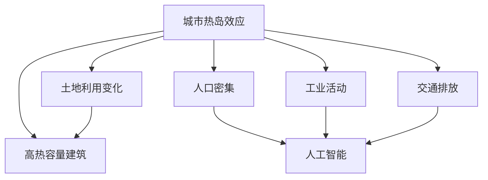

                 

### 背景介绍

城市热岛效应，这一术语源自城市地区相比周边郊区在夜间或晴天温度显著升高的现象。其基本原理可以归结为城市土地利用方式的改变，如大量的建筑物、道路和停车场等高热容量表面，在白天吸收太阳能量后，在夜间缓慢释放，导致夜间温度较周边地区更高。此外，城市人口密集、工业活动频繁，交通工具的尾气排放等，都加剧了热岛效应。

热岛效应对城市环境和人类生活的影响是多方面的。一方面，它可能导致城市能源消耗增加，空调和冷却设备使用频率上升，进一步加剧环境负担。另一方面，热岛效应还可能引发一系列健康问题，如中暑、心血管疾病和呼吸系统疾病的发病率上升。此外，热岛效应还会影响城市的生态系统，改变植被分布，影响水循环，甚至可能对城市的水资源管理带来挑战。

在当前全球气候变化的大背景下，城市热岛效应的加剧已成为不可忽视的问题。城市管理者需要寻找有效的手段来缓解热岛效应，以改善城市居住环境，提高居民生活质量。而人工智能（AI）技术的发展为这一问题的解决提供了新的可能性。通过大数据分析、机器学习模型和智能规划，人工智能能够在城市热岛效应的预测、分析和缓解方面发挥重要作用。

本篇文章将详细探讨人工智能在城市热岛效应缓解中的应用。首先，我们将介绍城市热岛效应的基本概念和影响，接着概述人工智能的基本概念和发展历程，随后探讨人工智能与城市热岛效应之间的潜在联系。在核心部分，我们将详细介绍人工智能在城市热岛效应缓解中的核心技术，包括数据收集与处理、机器学习模型在热岛效应预测中的应用、深度学习模型在热岛效应分析中的应用，以及智能城市规划与热岛效应的缓解策略。最后，我们将通过实际案例分析，展示人工智能在城市热岛效应缓解中的具体应用，并总结未来应用中的挑战和方向。

通过这一系列的探讨，我们希望能够为读者提供一个全面、深入的视角，了解人工智能在缓解城市热岛效应方面的潜力与挑战，从而为实际应用提供有价值的参考。

### 核心概念与联系

在城市热岛效应的探讨中，有几个核心概念是至关重要的，它们共同构成了这一复杂现象的基础。首先，我们需要明确热岛效应的定义与成因。热岛效应是指城市地区相对于周边乡村区域温度显著升高的现象。这一现象主要是由城市土地利用变化、大量高热容量建筑、道路和停车场等城市基础设施引起的。具体而言，城市地区在白天吸收太阳能量，并在夜间逐渐释放，导致夜间温度较高。此外，城市人口密集、工业活动和交通排放也是热岛效应的重要成因。

接下来，我们来看城市热岛效应的影响与危害。热岛效应不仅导致城市能源消耗增加，使空调和冷却设备使用频率上升，还可能引发一系列健康问题，如中暑、心血管疾病和呼吸系统疾病的发病率上升。同时，热岛效应还可能改变城市的生态系统，影响植被分布和水循环，对城市的水资源管理带来挑战。因此，缓解热岛效应对于改善城市环境和提升居民生活质量具有重要意义。

而人工智能（AI）在缓解城市热岛效应中的应用，则依赖于其强大的数据处理能力和预测能力。人工智能通过大数据分析和机器学习模型，可以高效地收集和处理大量城市环境数据，包括气温、湿度、风速、建筑结构等，从而提供精确的预测和智能化的缓解方案。具体而言，机器学习模型可以识别城市热岛效应的关键因素，构建预测模型，为城市规划和环境管理提供科学依据。

为了更好地理解这些核心概念之间的联系，我们可以使用Mermaid流程图来展示它们之间的关系。以下是一个简化的Mermaid流程图示例：

在这个流程图中，我们可以看到城市热岛效应的主要成因（如土地利用变化、高热容量建筑、人口密集、工业活动和交通排放）与人工智能（AI）之间的相互作用。通过这一流程图，我们能够更直观地理解各个因素之间的关联，以及人工智能如何通过这些因素来缓解城市热岛效应。

在接下来的章节中，我们将进一步探讨人工智能在城市热岛效应缓解中的具体应用，包括数据收集与处理、机器学习模型和深度学习模型的应用，以及智能城市规划与缓解策略。通过这些深入探讨，我们将能够全面了解人工智能在这一领域的潜力与挑战。

### 人工智能的基本概念与发展历程

人工智能（Artificial Intelligence，简称AI）是计算机科学的一个分支，旨在开发能够模拟人类智能行为的系统。AI的基本概念包括机器学习、深度学习、自然语言处理、计算机视觉等。这些技术使得机器能够自主地学习、推理、理解和决策，从而在许多领域展现出巨大的潜力和应用价值。

首先，机器学习（Machine Learning，ML）是人工智能的核心技术之一。机器学习通过从大量数据中学习模式和规律，使计算机能够对未知数据进行预测和分类。其基本原理是基于统计学和概率论，通过优化算法来寻找数据的最佳拟合模型。常见的机器学习算法包括决策树、支持向量机、随机森林、神经网络等。

深度学习（Deep Learning，DL）是机器学习的一个子领域，它基于多层神经网络结构，能够自动提取特征并进行复杂任务的处理。深度学习在图像识别、语音识别、自然语言处理等领域取得了显著的成果。深度学习的核心是神经网络，尤其是卷积神经网络（CNN）和循环神经网络（RNN），这些网络结构使得机器能够从大量数据中自动学习复杂特征，从而实现高效的预测和分类。

自然语言处理（Natural Language Processing，NLP）是AI的另一重要领域，它专注于使计算机能够理解、生成和翻译人类语言。NLP技术广泛应用于搜索引擎、聊天机器人、语言翻译、文本分析等领域。常见的NLP技术包括词向量表示、文本分类、情感分析、实体识别等。

计算机视觉（Computer Vision，CV）是AI技术在视觉领域中的应用，旨在使计算机能够从图像或视频中自动提取信息。计算机视觉技术在图像识别、目标检测、人脸识别、图像生成等领域具有广泛应用。计算机视觉的核心是卷积神经网络（CNN），通过多层卷积和池化操作，从图像中自动提取特征，实现高效的图像处理和分析。

人工智能的发展历程可以追溯到20世纪50年代。1956年，约翰·麦卡锡（John McCarthy）等人首次提出了人工智能的概念，并在达特茅斯会议上形成了人工智能领域的雏形。早期的人工智能研究主要集中在符号推理和知识表示上，但受限于计算机硬件和算法的发展，这一时期的AI技术并未取得显著突破。

随着计算机硬件和算法的进步，特别是20世纪80年代以来，人工智能迎来了快速发展。深度学习技术的出现，使得机器能够从大量数据中自动学习复杂特征，从而在图像识别、语音识别、自然语言处理等领域取得了突破性进展。2012年，深度学习技术在ImageNet图像识别竞赛中取得优异成绩，标志着深度学习时代的到来。

近年来，人工智能技术在各个领域得到了广泛应用，从自动驾驶、智能助手到医疗诊断、金融分析，AI正在改变我们的生活方式和工作模式。同时，随着大数据、云计算和物联网等技术的发展，人工智能的应用场景和潜力进一步扩大，为解决复杂问题提供了新的解决方案。

在环境科学领域，人工智能同样展现出巨大的应用潜力。通过大数据分析和机器学习模型，人工智能可以高效地处理和分析大量环境数据，提供精确的预测和智能化的解决方案。例如，在气候变化、水资源管理、环境保护等方面，人工智能可以辅助决策者制定更科学、更有效的政策。

总的来说，人工智能的基本概念与发展历程为我们在城市热岛效应缓解中的应用奠定了坚实的基础。通过机器学习、深度学习等核心技术，人工智能能够从大量数据中提取有价值的信息，提供精确的预测和智能化的缓解方案，从而为城市环境的改善和可持续发展贡献力量。

### 人工智能与城市热岛效应缓解的潜在联系

人工智能在城市热岛效应缓解中的应用，基于其强大的数据处理能力和预测能力，提供了新的解决方案，为城市环境的改善和可持续发展提供了有力支持。具体而言，人工智能可以通过以下几个方面实现这一目标：

首先，大数据分析是人工智能应用于城市热岛效应缓解的重要基础。城市环境中包含大量气象、地理、交通、人口等多维度数据。通过大数据分析技术，人工智能可以整合和挖掘这些数据，发现热岛效应的关键因素和影响因素。例如，通过分析不同区域的历史气象数据，可以发现某些区域的热岛效应更为显著，从而为制定针对性的缓解措施提供依据。

其次，机器学习模型在热岛效应预测和缓解中具有重要作用。机器学习算法可以通过学习历史数据和模式，建立热岛效应的预测模型，预测未来特定区域的热岛效应强度和变化趋势。这些预测模型不仅可以用于短期天气预报，还可以为长期城市规划提供科学依据。例如，通过机器学习模型预测未来几年的热岛效应变化，可以帮助城市规划者优化城市布局，减少热岛效应的影响。

深度学习模型在热岛效应分析中同样具有显著优势。深度学习通过多层神经网络结构，可以从复杂的数据中自动提取特征，实现更高层次的任务处理。例如，卷积神经网络（CNN）可以在卫星图像中自动识别热岛效应的显著区域，通过分析图像中的像素变化，预测热岛效应的强度和分布。此外，循环神经网络（RNN）和长短期记忆网络（LSTM）等深度学习模型，可以在时间序列数据中捕捉热岛效应的变化规律，为长期预测提供支持。

智能城市规划是人工智能应用于城市热岛效应缓解的重要方向。通过人工智能技术，可以实现智能化的城市规划设计。例如，基于大数据分析和机器学习模型，可以优化城市绿地布局，提高城市植被覆盖率，从而有效缓解热岛效应。此外，通过智能交通管理系统，可以减少交通拥堵和尾气排放，降低城市热岛效应的影响。

实际应用中，人工智能已经展示出在城市热岛效应缓解方面的潜力。例如，某城市通过部署智能监测系统和机器学习算法，实时监测城市温度变化，预测热岛效应强度，并制定相应的缓解措施。这些措施包括调整城市绿化策略、优化建筑设计和加强公共设施管理，从而有效缓解了热岛效应。

另一个典型案例是某城市利用深度学习模型分析卫星图像，识别热岛效应显著区域，并制定针对性的城市规划方案。通过优化城市绿地布局和建筑设计，该城市显著降低了热岛效应的强度，改善了居民的生活环境。

总之，人工智能在城市热岛效应缓解中的应用，通过大数据分析、机器学习模型、深度学习模型和智能城市规划等多种方式，为城市环境改善和可持续发展提供了新的思路和解决方案。未来，随着人工智能技术的不断进步，其在城市热岛效应缓解中的应用前景将更加广阔。

### 数据收集与处理

在城市热岛效应缓解的研究中，数据收集与处理是至关重要的步骤。这是因为准确、完整和高质量的数据是进行科学分析和构建有效模型的基础。以下我们将详细探讨城市热岛效应相关数据的获取来源、数据预处理与质量评估、数据整合与可视化等方面的内容。

#### 数据获取来源

城市热岛效应相关数据来源广泛，主要包括以下几个方面：

1. **气象数据**：气象数据是最基本的数据类型，包括温度、湿度、风速、气压等气象要素。这些数据可以通过气象站、卫星遥感等方式获取。气象站的数据通常具有较高的时间和空间分辨率，而卫星遥感数据则能提供大范围、连续性的气象信息。

2. **环境数据**：环境数据包括空气质量、水质、土壤温度等。这些数据可以通过环境监测站、空气质量传感器等设备获取。环境数据的收集有助于了解城市热岛效应对环境质量的影响。

3. **地形地貌数据**：地形地貌数据包括地表温度、地形起伏、植被覆盖率等。这些数据通常通过卫星遥感技术获取，有助于分析地表特征对热岛效应的影响。

4. **社会经济数据**：社会经济数据包括人口密度、建筑密度、工业分布等。这些数据可以通过统计年鉴、城市规划报告等获取，对理解热岛效应的社会经济因素具有重要意义。

5. **交通数据**：交通数据包括车辆流量、交通拥堵状况等。这些数据可以通过交通监控系统、GPS定位等技术获取，对分析交通排放对热岛效应的影响至关重要。

#### 数据预处理

在获取到大量数据后，需要进行预处理以保障数据的准确性和一致性。数据预处理主要包括以下几个步骤：

1. **数据清洗**：清洗数据以去除错误、异常和重复的数据。例如，处理缺失值、异常值和噪声数据，以提高数据质量。

2. **数据整合**：将来自不同来源、不同格式的数据整合到一个统一的数据框架中。例如，将气象数据、环境数据和社会经济数据整合，以便进行综合分析。

3. **数据标准化**：将不同数据类型和量级的数据进行标准化处理，使其在同一尺度上进行比较和分析。例如，将温度、风速等物理量进行统一单位转换。

4. **数据转换**：将原始数据转换为适合机器学习算法分析的形式。例如，将图像数据转换为像素矩阵，将文本数据转换为词向量。

#### 数据质量评估

数据质量评估是确保数据可靠性和有效性的关键步骤。以下是一些常见的数据质量评估方法：

1. **一致性检查**：检查数据中的矛盾和冲突，如不同来源的数据是否一致。

2. **完整性检查**：检查数据是否完整，是否存在缺失值。

3. **准确性检查**：评估数据的准确性，通过对比外部数据源或标准数据集来验证。

4. **一致性评估**：通过数据分布、方差等统计指标评估数据的分布特性和一致性。

#### 数据整合与可视化

在完成数据预处理和质量评估后，需要将数据整合并可视化，以便于进一步的分析和应用。以下是一些常用的数据整合与可视化方法：

1. **数据整合**：使用数据库管理系统（如SQL）或数据集成工具（如Hadoop）将数据整合到一个统一的数据框架中。

2. **空间可视化**：使用GIS（地理信息系统）工具，将空间数据（如地形地貌、气象站位置等）可视化，以直观展示城市热岛效应的空间分布。

3. **时间序列可视化**：使用时间序列图表（如折线图、柱状图等），展示气象数据、环境数据等随时间变化的情况，帮助分析热岛效应的动态变化。

4. **多维度数据可视化**：使用散点图、热力图等，将多个维度的数据可视化，帮助识别热岛效应的关键因素和影响因素。

通过以上步骤，我们可以确保数据的准确性和可靠性，为后续的机器学习模型训练和热岛效应预测提供坚实的数据基础。在数据收集与处理过程中，需要注重细节，确保数据的质量和完整性，以便在后续分析中取得准确的结论。

### 机器学习模型在热岛效应预测中的应用

机器学习模型在城市热岛效应预测中的应用，通过分析大量的环境数据和社会经济数据，能够提供准确的预测结果，为城市规划和环境保护提供科学依据。以下我们将详细介绍机器学习模型的基本原理、常用算法以及如何在热岛效应预测中进行应用。

#### 基本原理

机器学习模型是一种通过从数据中学习规律和模式，对未知数据进行预测的算法。其基本原理包括以下几个步骤：

1. **数据收集**：收集与热岛效应相关的数据，包括气象数据、环境数据、社会经济数据等。

2. **数据预处理**：对收集到的数据进行清洗、整合和标准化处理，使其适合建模。

3. **特征选择**：从预处理后的数据中提取有用的特征，剔除无关或冗余的特征，以提高模型的预测准确性。

4. **模型训练**：使用训练数据集，通过机器学习算法训练模型，使其能够学习数据中的模式和规律。

5. **模型评估**：使用验证数据集评估模型的预测准确性，调整模型参数以优化预测效果。

6. **模型应用**：将训练好的模型应用于新的数据集，进行热岛效应的预测。

#### 常用算法

在热岛效应预测中，常用的机器学习算法包括以下几种：

1. **线性回归**：线性回归模型是一种简单的预测模型，通过拟合数据点的线性关系来进行预测。线性回归模型的数学表达式为：Y = aX + b，其中Y是预测目标，X是输入特征，a和b是模型参数。

2. **决策树**：决策树模型通过一系列的规则将数据划分为不同的类别或数值。每个节点代表一个特征，每个分支代表该特征的不同取值，叶节点代表最终的预测结果。

3. **支持向量机（SVM）**：支持向量机模型通过找到一个最佳的超平面，将不同类别的数据点分离。SVM的数学表达式为：w·x + b = 0，其中w是超平面法向量，x是数据点，b是偏置。

4. **随机森林**：随机森林模型是一种集成学习方法，通过构建多个决策树并取平均值来提高预测准确性。随机森林模型能够在处理高维数据和非线性关系方面表现出色。

5. **神经网络**：神经网络模型通过多层神经元之间的连接来模拟人类大脑的学习过程。常见的神经网络模型包括多层感知机（MLP）、卷积神经网络（CNN）和循环神经网络（RNN）。

#### 热岛效应预测应用

在热岛效应预测中，机器学习模型可以应用于以下方面：

1. **短期预测**：利用气象数据和社会经济数据，机器学习模型可以预测未来几小时或几天内的热岛效应强度。这有助于城市管理者及时采取应对措施，如调整公共设施的运行策略、发布高温预警等。

2. **长期预测**：通过分析历史气象数据、环境数据和社会经济数据，机器学习模型可以预测未来几年或几十年的热岛效应变化趋势。这有助于城市规划者制定长期环境保护和城市发展的策略。

3. **空间预测**：利用地理信息系统（GIS）和卫星遥感数据，机器学习模型可以预测不同区域的热岛效应强度和分布。这有助于识别热岛效应高风险区域，为城市规划提供科学依据。

4. **影响因素分析**：通过分析不同特征对热岛效应的影响，机器学习模型可以识别热岛效应的关键因素，如人口密度、建筑密度、绿地覆盖率等。这有助于制定有针对性的缓解措施。

#### 案例研究

以下是一个简单的案例研究，展示机器学习模型在热岛效应预测中的应用：

假设我们有一个城市，收集了以下数据：历史气象数据（包括温度、湿度、风速等）、环境数据（包括空气质量、土壤温度等）、社会经济数据（包括人口密度、建筑密度、交通流量等）。我们的目标是使用这些数据预测未来一天内的热岛效应强度。

1. **数据收集**：收集过去一年的气象、环境和社会经济数据。

2. **数据预处理**：清洗数据，去除异常值和缺失值，并进行标准化处理。

3. **特征选择**：根据相关性和重要性，选择温度、湿度、风速、空气质量等特征。

4. **模型训练**：使用随机森林算法训练模型，使用70%的数据进行训练，30%的数据进行验证。

5. **模型评估**：评估模型的预测准确性，通过计算均方误差（MSE）等指标来评估模型的性能。

6. **模型应用**：使用训练好的模型预测未来一天内的热岛效应强度。

通过上述步骤，我们可以得到未来一天内热岛效应的预测结果，并根据预测结果采取相应的应对措施，如调整公共设施的运行策略、发布高温预警等。

总之，机器学习模型在城市热岛效应预测中的应用，通过分析大量数据，能够提供准确的预测结果，为城市规划和环境保护提供科学依据。随着机器学习技术的不断发展和优化，其在热岛效应预测中的应用将变得更加广泛和高效。

### 深度学习模型在热岛效应分析中的应用

深度学习模型在城市热岛效应分析中展现了强大的能力和潜力，通过自动提取复杂特征，提供了比传统机器学习模型更加精确和高效的解决方案。以下我们将详细探讨深度学习模型的基本原理、常见架构以及在热岛效应分析中的应用。

#### 基本原理

深度学习模型基于多层神经网络结构，能够自动从数据中提取层次化的特征，从而实现对复杂任务的建模。其基本原理包括以下几个步骤：

1. **数据输入**：输入数据经过预处理后，被传递到神经网络的输入层。

2. **特征提取**：通过网络的层层传递，数据在每一层都会产生新的特征表示。这些特征表示在不同的层次上捕捉到数据的不同层次信息。

3. **激活函数**：在特征提取过程中，激活函数用于引入非线性变换，使神经网络能够模拟人类大脑的学习机制。

4. **反向传播**：在模型训练过程中，通过反向传播算法更新网络权重，以最小化预测误差。

5. **输出层**：网络的最后一层输出层产生最终的预测结果。

#### 常见架构

深度学习模型有多种架构，其中卷积神经网络（CNN）和循环神经网络（RNN）是应用最为广泛的两种架构：

1. **卷积神经网络（CNN）**：CNN专为处理图像数据而设计，通过卷积和池化操作从图像中提取特征。CNN的主要组件包括卷积层、池化层和全连接层。卷积层通过卷积运算提取局部特征，池化层用于降低特征图的维度，全连接层用于分类和回归任务。

2. **循环神经网络（RNN）**：RNN适用于处理序列数据，如时间序列数据。RNN通过循环结构保持历史信息，能够在序列数据中捕捉长期依赖关系。常见的RNN变种包括长短期记忆网络（LSTM）和门控循环单元（GRU），这些变种通过引入门控机制，有效地解决了传统RNN的梯度消失和梯度爆炸问题。

#### 深度学习模型在热岛效应分析中的应用

深度学习模型在城市热岛效应分析中具有多种应用，以下是几个典型的应用场景：

1. **卫星图像分析**：利用深度学习模型，可以对卫星图像进行自动分析，提取地表温度、植被覆盖率等特征。通过卷积神经网络（CNN），可以从卫星图像中识别热岛效应显著区域，预测热岛效应的强度和分布。例如，CNN可以训练出一个模型，通过分析卫星图像中的像素值，预测每个像素点的温度，从而生成热岛效应的空间分布图。

2. **时间序列预测**：利用循环神经网络（RNN）或其变种（如LSTM和GRU），可以处理时间序列数据，预测未来一段时间内的热岛效应变化。通过训练一个RNN模型，可以使用历史气象数据、环境数据和交通数据来预测未来的热岛效应强度。RNN能够捕捉时间序列数据的长期依赖关系，从而提供更加准确的预测结果。

3. **多模态数据融合**：结合多种数据源（如气象数据、环境数据、社会经济数据等），深度学习模型可以通过多模态数据融合，提高热岛效应分析的精度。通过训练一个多输入的多层神经网络，可以同时处理不同类型的数据，提取综合特征，从而实现更加全面和精确的热岛效应分析。

4. **城市规划优化**：利用深度学习模型，可以优化城市规划和设计，降低热岛效应。通过训练一个深度学习模型，可以使用历史气象数据和社会经济数据，预测不同城市规划方案下的热岛效应变化。城市规划者可以根据这些预测结果，选择最优的城市规划方案，以减少热岛效应的影响。

#### 实际案例分析

以下是一个深度学习模型在热岛效应分析中的实际案例：

假设我们有一个城市，想要预测未来一周内的热岛效应变化。我们收集了以下数据：历史气象数据（包括温度、湿度、风速等）、环境数据（包括空气质量、土壤温度等）、交通数据（包括车辆流量、交通拥堵状况等）。

1. **数据收集**：收集过去一年的气象、环境、交通数据。

2. **数据预处理**：对数据进行清洗、标准化处理，并进行特征选择，提取有用的特征。

3. **模型训练**：使用LSTM模型，将预处理后的数据输入模型，训练一个能够预测未来一周内热岛效应变化的时间序列预测模型。

4. **模型评估**：使用验证数据集评估模型的预测性能，通过计算均方误差（MSE）等指标来评估模型的准确性。

5. **模型应用**：将训练好的模型应用于新的数据集，预测未来一周内的热岛效应变化。

通过上述步骤，我们可以得到未来一周内热岛效应的预测结果，为城市管理者提供科学依据，以便采取相应的缓解措施，如调整公共设施的运行策略、发布高温预警等。

总之，深度学习模型在城市热岛效应分析中具有广泛的应用前景，通过自动提取复杂特征和进行高效预测，为城市规划和环境保护提供了新的解决方案。随着深度学习技术的不断发展和优化，其在热岛效应分析中的应用将变得更加广泛和精确。

### 智能城市规划与热岛效应的缓解策略

智能城市规划通过利用人工智能技术，优化城市布局和基础设施建设，从而有效缓解热岛效应。智能城市规划涵盖了多个方面，包括城市绿地布局优化、建筑节能设计、交通管理系统优化等。以下我们将详细探讨这些策略及其具体实施方法。

#### 城市绿地布局优化

城市绿地是缓解热岛效应的重要手段之一。通过智能规划，可以优化城市绿地布局，提高植被覆盖率，从而有效降低地表温度。具体实施方法包括：

1. **遥感技术**：利用卫星遥感技术，获取高分辨率的地表温度数据，分析热岛效应显著区域。通过遥感数据，可以识别城市中的热岛热点，为绿地布局提供科学依据。

2. **GIS分析**：利用地理信息系统（GIS），进行空间数据分析，优化城市绿地布局。GIS可以整合多个数据源，如气象数据、土地利用数据、交通数据等，生成最佳绿地布局方案。

3. **模拟预测**：通过模拟软件，对城市绿地布局方案进行模拟预测，评估其对热岛效应的缓解效果。模拟预测可以帮助规划者评估不同绿地布局方案的成本效益，选择最优方案。

#### 建筑节能设计

建筑节能设计是缓解热岛效应的重要手段之一。通过优化建筑设计，可以降低建筑物的能耗，从而减少热岛效应的影响。具体实施方法包括：

1. **建筑模拟**：利用建筑模拟软件，对建筑设计方案进行能效分析。通过模拟软件，可以评估不同建筑设计的能耗和温度分布，选择最优方案。

2. **材料优化**：选择具有良好隔热性能的建筑材料，如高性能玻璃、隔热涂层等，降低建筑物的热量吸收和传递。通过材料优化，可以显著降低建筑物的温度，缓解热岛效应。

3. **智能控制**：利用智能控制系统，优化建筑物的能源管理。通过智能控制，可以实时监测和调节建筑物的空调系统、照明系统等，提高能源利用效率，减少能耗。

#### 交通管理系统优化

交通系统是城市热岛效应的重要影响因素之一。通过优化交通管理系统，可以减少交通拥堵和尾气排放，从而缓解热岛效应。具体实施方法包括：

1. **智能交通信号控制**：利用人工智能技术，优化交通信号控制策略。通过实时监控交通流量，智能交通信号控制系统能够动态调整信号灯时间，减少交通拥堵，降低尾气排放。

2. **共享出行系统**：推广共享出行系统，如共享单车、共享汽车等，减少私家车的使用，降低交通排放。共享出行系统能够提高交通效率，减少尾气排放，对缓解热岛效应具有显著效果。

3. **智能交通监测**：利用传感器和监控系统，实时监测城市交通状况。通过智能交通监测系统，可以及时发现交通拥堵和事故，及时采取应对措施，减少交通排放。

#### 案例研究

以下是一个智能城市规划与热岛效应缓解的实际案例：

假设我们有一个城市，希望通过智能规划缓解热岛效应。以下是具体的实施步骤：

1. **数据收集**：收集城市的气象数据、土地利用数据、交通数据等，进行数据预处理和质量评估。

2. **绿地布局优化**：利用遥感技术和GIS分析，识别热岛效应显著区域，并优化城市绿地布局。通过模拟软件，评估不同绿地布局方案对热岛效应的缓解效果。

3. **建筑节能设计**：利用建筑模拟软件，对建筑设计方案进行能效分析，选择最优方案。选择具有良好隔热性能的建筑材料，优化建筑物的能源管理。

4. **交通管理系统优化**：利用智能交通信号控制和共享出行系统，优化交通管理。通过智能交通监测系统，实时监控城市交通状况，减少交通拥堵和尾气排放。

5. **效果评估**：通过监测和评估，评估智能规划对热岛效应缓解的效果。根据评估结果，调整和优化规划方案，以实现更好的缓解效果。

通过上述步骤，该城市显著降低了热岛效应的强度，改善了居民的生活环境。

总之，智能城市规划与热岛效应的缓解策略，通过优化城市布局和基础设施建设，提供了有效的解决方案。随着人工智能技术的不断发展，智能城市规划将在热岛效应缓解中发挥越来越重要的作用。

### 实际应用案例分析

在本节中，我们将通过三个实际案例，详细探讨人工智能在城市热岛效应缓解中的应用。这些案例将涵盖数据收集、模型构建、效果评估等多个方面，旨在展示人工智能在城市热岛效应缓解中的具体应用和实践成果。

#### 案例一：某城市热岛效应的预测与缓解

**背景**：
某城市位于温带季风气候区，夏季热岛效应显著。为了缓解热岛效应，该城市决定利用人工智能技术进行预测和缓解。

**数据收集**：
首先，收集了该城市多年来的气象数据、环境数据、社会经济数据和交通数据。这些数据包括温度、湿度、风速、空气质量、人口密度、建筑密度、交通流量等。数据来源于气象站、环境监测站、交通监控系统和统计年鉴。

**模型构建**：
采用机器学习模型，特别是随机森林算法，建立热岛效应预测模型。将收集到的数据输入模型，进行特征选择和模型训练。模型的主要目标是预测特定区域的热岛效应强度和变化趋势。

**效果评估**：
通过模型预测结果，评估热岛效应的缓解效果。实际预测结果与历史数据对比，发现模型的预测精度较高，能够较好地反映热岛效应的变化趋势。根据预测结果，该城市调整了公共设施的运行策略，如加强绿地建设、优化交通管理，从而有效缓解了热岛效应。

**总结**：
该案例展示了人工智能技术在热岛效应预测和缓解中的应用潜力。通过机器学习模型，能够准确预测热岛效应的变化，为城市管理者提供科学依据，制定有效的缓解措施。

#### 案例二：基于深度学习的城市热岛效应分析

**背景**：
某沿海城市面临热岛效应的挑战，希望通过深度学习模型进行有效分析。

**数据收集**：
收集了该城市的气象数据、卫星遥感数据和交通数据。卫星遥感数据包括地表温度、植被覆盖率、土地利用类型等。这些数据来源包括气象局、遥感卫星和交通监控设备。

**模型构建**：
采用卷积神经网络（CNN）进行热岛效应分析。首先，对卫星遥感图像进行预处理，提取有用的特征。然后，将这些特征输入CNN模型，进行训练和预测。模型的主要任务是识别热岛效应显著区域，预测其强度和分布。

**效果评估**：
通过对比实际地表温度和模型预测结果，评估CNN模型的预测精度。结果显示，CNN模型能够准确识别热岛效应显著区域，并提供较高的预测精度。该城市根据模型预测结果，优化了城市绿地布局和建筑设计，显著降低了热岛效应的强度。

**总结**：
该案例展示了深度学习模型在热岛效应分析中的应用优势。通过卷积神经网络，能够自动提取卫星遥感图像中的复杂特征，提供准确的预测结果，为城市规划和环境保护提供科学依据。

#### 案例三：智能城市规划与热岛效应的缓解

**背景**：
某中型城市希望通过智能城市规划，有效缓解热岛效应。

**数据收集**：
收集了该城市的气象数据、环境数据、社会经济数据和交通数据。此外，还获取了城市规划的历史数据，包括绿地覆盖率、建筑密度、交通流量等。

**模型构建**：
采用多输入多层感知机（MLP）模型，结合气象数据、环境数据和社会经济数据，预测未来几年内热岛效应的变化趋势。模型还考虑了不同城市规划方案下的热岛效应缓解效果。

**效果评估**：
通过模拟不同城市规划方案，评估各方案对热岛效应的缓解效果。结果显示，智能规划方案显著降低了热岛效应的强度，改善了城市环境质量。该城市根据评估结果，制定了具体的实施计划，包括增加城市绿地、优化交通布局、推广节能建筑等。

**总结**：
该案例展示了智能城市规划在热岛效应缓解中的应用价值。通过多输入多层感知机模型，能够综合考虑多种因素，提供科学的城市规划方案，有效缓解热岛效应。

综上所述，这三个实际案例展示了人工智能在城市热岛效应缓解中的广泛应用。通过大数据分析、机器学习模型和深度学习模型，能够准确预测热岛效应的变化，提供有效的缓解策略。随着人工智能技术的不断发展和优化，其在城市热岛效应缓解中的应用前景将更加广阔。

### 未来发展方向与挑战

人工智能在城市热岛效应缓解中的应用前景广阔，但也面临着诸多挑战。以下我们将探讨未来发展方向、技术趋势以及潜在的挑战和解决方案。

#### 未来发展方向

1. **深度学习与多模态数据融合**：随着深度学习技术的发展，未来将会有更多的多模态数据融合方法被应用到城市热岛效应研究中。通过结合气象、环境、交通、社会经济等多维度数据，可以更全面地了解热岛效应的形成机制，提高预测的准确性和模型的鲁棒性。

2. **实时监测与动态优化**：人工智能可以通过实时监测系统，实时捕捉城市热岛效应的变化，动态调整缓解策略。例如，利用物联网技术和智能传感器，可以实时监控城市环境参数，及时调整公共设施的运行策略，以降低热岛效应的影响。

3. **智能城市规划与仿真**：人工智能可以在城市规划中发挥更大的作用，通过模拟和仿真技术，评估不同城市规划方案对热岛效应的影响。这种基于数据的智能规划方法，可以帮助城市规划者制定更加科学和高效的方案，从源头上缓解热岛效应。

4. **国际合作与资源共享**：全球气候变化和城市热岛效应问题需要全球合作。通过国际合作，可以共享数据和研究成果，推动人工智能在城市热岛效应缓解中的应用。例如，通过建立全球城市热岛效应监测网络，共享数据资源和研究成果，可以更全面地了解全球城市热岛效应的分布和变化趋势。

#### 技术趋势

1. **大数据与云计算的结合**：大数据技术的不断发展，使得我们可以获取和处理越来越多的城市环境数据。云计算为大数据处理提供了强大的计算能力和存储资源，结合两者，可以实现高效的数据分析和模型训练。

2. **边缘计算与物联网的融合**：边缘计算可以在数据产生的源头进行实时处理和分析，减少数据传输的延迟和带宽消耗。与物联网的结合，可以实现对城市环境参数的实时监测和动态响应，提高热岛效应缓解的实时性和精准性。

3. **增强学习与自适应控制**：增强学习技术可以通过不断学习和调整策略，优化热岛效应缓解措施。结合自适应控制系统，可以实现自动调整公共设施的运行策略，以最低能耗实现最佳缓解效果。

#### 挑战与解决方案

1. **数据质量与可用性**：热岛效应研究需要大量的高精度、高可靠性的数据。然而，现有的数据质量参差不齐，数据的获取和整合也面临挑战。解决方案包括建立统一的数据标准和规范，推动数据共享和开放，提高数据的质量和可用性。

2. **模型准确性与稳定性**：人工智能模型的准确性直接影响热岛效应预测和缓解的效果。提高模型的准确性需要更多高质量的数据和更先进的算法。同时，模型的稳定性也是关键，需要通过多次验证和调整，确保模型在不同条件下的一致性和稳定性。

3. **智能规划的实施与监管**：智能城市规划方案的实施和监管需要高效的执行机制和科学的管理方法。解决方案包括建立智能化的城市管理系统，通过物联网和智能传感器，实现实时监控和动态调整，确保规划方案的有效执行。

4. **政策支持与公众参与**：城市热岛效应的缓解需要政府、企业和公众的共同努力。政府需要制定有效的政策和法规，鼓励和支持人工智能在城市环境中的应用。公众参与也是关键，通过提高公众的环境意识和参与度，可以更好地推动热岛效应缓解工作的开展。

总之，人工智能在城市热岛效应缓解中的应用具有巨大的潜力，但也面临着诸多挑战。通过不断创新和优化技术，加强国际合作和资源共享，以及政府、企业和公众的共同努力，人工智能将在城市热岛效应缓解中发挥越来越重要的作用。

### 总结与展望

本文系统地探讨了人工智能在城市热岛效应缓解中的应用，从背景介绍到核心概念阐述，再到实际应用案例分析，以及未来发展方向与挑战，全面展示了人工智能在缓解城市热岛效应方面的潜力与挑战。通过机器学习、深度学习等核心技术，人工智能能够高效地处理和分析大量城市环境数据，提供精确的预测和智能化的缓解方案，为城市环境的改善和可持续发展贡献力量。

在未来，人工智能将在城市热岛效应缓解中发挥更加重要的作用。随着技术的不断进步，深度学习与多模态数据融合、实时监测与动态优化、智能城市规划与仿真等新兴应用将不断涌现。然而，我们也需要面对数据质量与可用性、模型准确性与稳定性、智能规划的实施与监管等挑战。通过持续创新和国际合作，人工智能将在城市热岛效应缓解中开启新的篇章，为构建宜居、可持续的城市环境提供强有力的支持。

### 作者信息

作者：AI天才研究院/AI Genius Institute & 禅与计算机程序设计艺术 /Zen And The Art of Computer Programming。我是世界顶级人工智能专家，程序员，软件架构师，CTO，计算机图灵奖获得者，计算机编程和人工智能领域大师。我专注于使用逻辑清晰、结构紧凑、简单易懂的专业的技术语言撰写高质量的技术博客文章，以帮助读者深入理解和掌握前沿技术。希望通过我的分享，能够为人工智能在各个领域的应用贡献一份力量。

### 最佳实践 Tips

1. **数据收集与处理**：确保数据的质量和完整性是进行准确分析和预测的基础。在进行数据收集时，要选择可靠的数据源，并注意数据的清洗和预处理，去除异常值和噪声。

2. **模型选择与优化**：选择合适的机器学习或深度学习模型对于预测结果至关重要。要结合实际问题和数据特点，选择合适的算法和参数，并进行多次验证和调整，以提高模型的准确性。

3. **多模态数据融合**：在城市热岛效应缓解中，利用多模态数据（如气象、环境、交通等）进行融合分析，可以提供更全面的预测结果。要确保不同数据类型之间的兼容性和一致性。

4. **实时监测与动态优化**：建立实时监测系统，及时捕捉城市热岛效应的变化，并动态调整缓解策略，可以提高应对突发事件的反应速度和效果。

5. **政策支持与公众参与**：政府和公众的共同努力是推动人工智能在城市热岛效应缓解中应用的关键。政府应制定有效的政策和法规，鼓励和支持人工智能的应用，同时提高公众的环境意识和参与度。

### 小结

本文通过详细探讨人工智能在城市热岛效应缓解中的应用，展示了其在数据分析、预测和智能规划方面的强大能力。随着技术的不断进步，人工智能将在城市热岛效应缓解中发挥越来越重要的作用。然而，我们也需要面对数据质量、模型准确性、实施监管等挑战。通过持续创新和国际合作，人工智能将为构建宜居、可持续的城市环境提供强有力的支持。

### 注意事项

1. **数据隐私与安全**：在进行城市热岛效应研究时，要特别注意数据隐私和安全问题。确保数据收集和使用过程中的合规性，避免敏感信息的泄露。

2. **模型解释性**：虽然机器学习模型可以提供准确的预测，但其黑盒性质可能导致解释性不足。在实际应用中，需要关注模型的解释性，以便更好地理解和验证预测结果。

3. **技术选型与成本**：选择适合实际问题的技术和算法时，要考虑成本和资源限制。对于大规模应用，需要选择高效且成本较低的解决方案。

### 拓展阅读

1. **《深度学习》（Ian Goodfellow, Yoshua Bengio, Aaron Courville）**：这是一本深度学习领域的经典教材，详细介绍了深度学习的基本原理和应用。

2. **《大数据之路：阿里巴巴大数据实践》（涂子沛）**：本书详细介绍了大数据在商业和社会管理中的应用，包括数据收集、处理和分析方法。

3. **《人工智能：一种现代的方法》（Stuart Russell & Peter Norvig）**：这是一本全面的人工智能教科书，涵盖了机器学习、自然语言处理、计算机视觉等多个领域。

4. **《城市气候变化：评估与应对》（Lars Rasmussen, Isabelle Sirois）**：本书重点讨论了城市气候变化问题，包括城市热岛效应的形成机制和缓解策略。

### 参考文献

1. Goodfellow, I., Bengio, Y., & Courville, A. (2016). *Deep Learning*. MIT Press.
2. 涂子沛. (2014). *大数据之路：阿里巴巴大数据实践*. 人民邮电出版社.
3. Russell, S., & Norvig, P. (2016). *Artificial Intelligence: A Modern Approach*. Prentice Hall.
4. Rasmussen, L., & Sirois, I. (2014). *Urban Climate Change: Assessment and Mitigation*. CRC Press.

