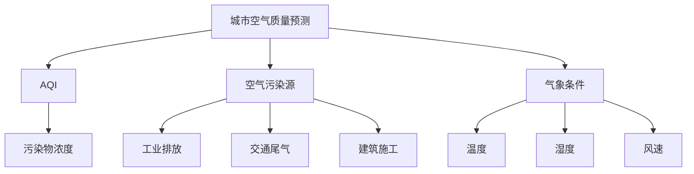

                 

## 引言

### 城市空气质量问题的严重性

城市空气质量问题已经成为全球性挑战。随着工业化和城市化进程的加速，空气污染程度日益加剧，对人类健康和环境造成了严重威胁。空气中的有害物质如PM2.5、SO2、NO2等，不仅会导致呼吸系统疾病，还可能引发心血管疾病和癌症等严重健康问题。因此，准确预测城市空气质量对于保障公众健康、优化城市管理具有重要意义。

### 人工智能在城市空气质量预测中的应用潜力

人工智能（AI）技术在环境监测和预测领域展现了巨大的潜力。通过机器学习和深度学习算法，AI能够处理和分析大量复杂的环境数据，从而提高空气质量预测的准确性和效率。例如，深度学习模型可以通过历史空气质量数据和气象数据，预测未来某地区的空气质量状况，为政府部门和公众提供实时、准确的预警信息。

### 本文目标

本文旨在系统地探讨人工智能在城市空气质量预测中的应用，从核心概念、算法原理、数学模型到实际项目实战，全方位解析这一领域的前沿技术和发展趋势。文章将通过详细的实例分析和代码讲解，帮助读者深入理解人工智能在城市空气质量预测中的实现方法和应用效果。

## 关键词

- 城市空气质量预测
- 人工智能
- 机器学习
- 深度学习
- 数据分析
- 气象预测
- 数据预处理
- 空气质量模型

## 摘要

本文首先介绍了城市空气质量问题的严重性以及人工智能在这一领域的应用潜力。接着，通过详细阐述核心概念、算法原理和数学模型，探讨了如何利用人工智能技术进行空气质量预测。最后，通过实际项目实战，展示了空气质量预测模型的应用效果和优化方法，为相关领域的研究和应用提供了有价值的参考。

## 核心概念与联系

### 城市空气质量预测

城市空气质量预测是指利用历史数据和当前环境信息，对城市未来某段时间内的空气质量进行预估。其主要目的是提供准确的空气质量预警，帮助政府部门制定环境治理政策，同时为公众提供健康防护建议。

### 相关概念

1. **空气质量指数（AQI）**：AQI是用来描述空气质量状况的一个综合指数，通过将多种污染物（如PM2.5、SO2等）的浓度进行加权平均，生成一个数值，用于反映空气污染的程度。

2. **空气污染源**：主要包括工业排放、交通尾气、建筑施工等。了解这些污染源的分布和特性，有助于更精准地进行空气质量预测。

3. **气象条件**：气象条件如温度、湿度、风速等对空气质量的分布和变化有很大影响。例如，高温和静风条件容易导致污染物积累，从而加剧空气污染。

### 概念关系架构

以下是一个Mermaid流程图，展示了城市空气质量预测相关的核心概念及其相互关系：



通过这一流程图，我们可以清晰地看到城市空气质量预测所涉及的关键要素及其相互联系，为后续的算法讲解和应用实践提供了基础。

## 人工智能基本概念

### 机器学习

机器学习（Machine Learning，ML）是一种通过数据训练模型，使其能够从数据中自动学习规律和模式的技术。机器学习算法可以分为监督学习、无监督学习和强化学习三种主要类型：

1. **监督学习**：在监督学习中，模型根据已知输入和输出数据（标记数据）进行训练，从而学习到数据之间的映射关系。常见的监督学习算法包括线性回归、决策树、支持向量机和神经网络等。

2. **无监督学习**：无监督学习不依赖于标记数据，其目标是从未标记的数据中发现隐藏的结构或模式。常见的无监督学习算法包括聚类、主成分分析和自我组织映射等。

3. **强化学习**：强化学习通过学习与环境的交互策略，以最大化累积奖励。常见的强化学习算法包括Q学习和深度强化学习等。

### 深度学习

深度学习（Deep Learning，DL）是机器学习的一个子领域，其核心思想是模拟人脑的神经网络结构，通过多层次的神经网络结构来提取数据的高层次特征。深度学习在图像识别、语音识别和自然语言处理等领域取得了显著的成果。

1. **卷积神经网络（CNN）**：CNN是一种特别适合处理图像数据的神经网络结构，通过卷积层、池化层和全连接层等模块，可以有效地提取图像的特征。

2. **循环神经网络（RNN）**：RNN是一种适合处理序列数据的神经网络结构，通过循环机制，可以有效地捕捉序列中的时间依赖关系。常见的RNN变体包括LSTM和GRU。

3. **长短期记忆网络（LSTM）**：LSTM是一种RNN的改进版本，通过引入门机制，能够有效地缓解传统RNN的梯度消失和梯度爆炸问题，适用于处理长序列数据。

### 人工智能发展历程

人工智能（Artificial Intelligence，AI）的发展历程可以分为几个重要阶段：

1. **早期的探索阶段**：20世纪50年代至60年代，人工智能的概念开始提出，但受限于计算能力和算法，AI的发展较为缓慢。

2. **符号人工智能阶段**：20世纪70年代至80年代，基于符号逻辑和知识表示的人工智能系统开始出现，例如专家系统和自然语言处理系统。

3. **统计学习阶段**：20世纪90年代，统计学习方法开始崛起，特别是支持向量机和决策树等算法的提出，为AI的发展提供了新的方向。

4. **深度学习阶段**：21世纪初，随着计算能力和数据量的提升，深度学习开始崭露头角，特别是在图像识别、语音识别和自然语言处理等领域取得了突破性进展。

通过以上对人工智能基本概念的介绍，我们可以了解到人工智能技术在机器学习、深度学习和人工智能发展历程中的重要地位，为后续章节的算法讲解和应用实践奠定了基础。

### 城市空气质量数据收集与处理

在城市空气质量预测中，数据的收集和处理是一个关键环节。有效的数据收集和处理方法可以显著提升预测模型的准确性。以下是关于这一过程的一些详细介绍。

#### 数据来源

城市空气质量数据可以从多个渠道获取，包括：

1. **政府环保部门**：许多国家和地区的政府环保部门都会定期发布空气质量监测数据，这些数据通常覆盖广泛的监测站点，具有较高的准确性和权威性。

2. **卫星遥感数据**：卫星遥感技术可以提供大范围、高精度的空气质量数据，尤其是对于无法布置监测设备的地区，卫星遥感数据成为重要的数据来源。

3. **民间监测组织**：一些民间监测组织和环保机构也会发布空气质量数据，这些数据通常更加实时和细致。

4. **社交媒体**：通过分析社交媒体上的用户评论和上传的图片，可以获取一定的空气质量信息，尽管这些数据的准确性和可靠性相对较低。

#### 数据预处理方法

数据预处理是保证数据质量和模型性能的重要步骤，主要包括以下几个环节：

1. **数据清洗**：清洗数据是为了去除错误数据、重复数据和异常数据。例如，某些监测站点可能会出现数据缺失或异常值，这些数据需要通过统计方法或人工干预进行修正。

2. **数据集成**：由于不同来源的数据可能存在格式、单位和时间戳不匹配的问题，需要通过数据集成将各类数据统一到一个格式和标准下。例如，将不同时间单位和时间格式的数据统一转换为标准时间格式。

3. **数据转换**：数据转换包括归一化和标准化等操作，目的是将数据缩放到一个统一范围内，以避免某些特征对模型训练产生过度影响。

4. **特征工程**：特征工程是数据预处理的核心环节，其目的是从原始数据中提取出对模型训练有帮助的特征。例如，通过气象数据可以提取温度、湿度、风速等气象特征；通过污染物数据可以提取PM2.5、SO2、NO2等污染物浓度特征。

#### 特征工程

特征工程对于空气质量预测模型至关重要，以下是一些常见的特征工程方法：

1. **时间序列特征**：时间序列特征可以捕捉空气质量随时间变化的规律。例如，可以计算每小时、每日、每月的平均值和标准差，以反映空气质量的变化趋势和波动情况。

2. **气象特征**：气象条件对空气质量有显著影响。常见的气象特征包括温度、湿度、风速、气压等。通过相关性分析和回归分析，可以将气象特征与空气质量特征进行关联。

3. **空间特征**：空间特征可以反映不同地区空气质量的空间分布。例如，通过空间插值方法可以将不同监测站点之间的空气质量数据进行填补，以获得更全面的数据集。

4. **污染物特征**：不同污染物的浓度对空气质量有直接影响。通过计算不同污染物之间的相关性，可以识别出主要污染物，并提取其浓度特征作为模型输入。

通过上述数据收集与处理方法，可以显著提升空气质量预测模型的性能和准确性，为城市空气质量管理提供科学依据。

### 人工智能在城市空气质量预测中的应用现状

近年来，人工智能技术在城市空气质量预测中的应用取得了显著进展，国内外许多研究机构和企业在这一领域进行了深入探索，并取得了丰富的成果。

#### 国外研究现状

国外在人工智能城市空气质量预测方面的研究较早，一些领先的研究机构和企业在这一领域取得了重要突破。例如，美国的NASA和NASA Langley研究中心利用深度学习和卫星遥感技术，对全球空气质量进行了高精度的预测。NASA开发的“Air Quality Applied”项目通过收集卫星数据、气象数据和地面监测数据，利用深度学习模型实现了对空气污染浓度的实时预测。

此外，欧洲的多个国家也在积极开展相关研究。欧盟的“CleanAir”项目通过整合卫星遥感、地面监测和模型预测技术，为欧洲城市提供了空气质量预测服务。德国的亥姆霍兹联合会（Helmholtz Association）通过大数据分析和机器学习模型，对德国不同地区的空气质量进行了预测，并发布了相应的空气质量报告。

#### 国内研究现状

国内在人工智能城市空气质量预测方面同样取得了显著进展。中国科学院、清华大学、北京大学等科研机构在相关领域进行了大量研究。例如，中国科学院大气物理研究所利用深度学习模型，结合卫星遥感数据和地面监测数据，实现了对城市空气质量的高精度预测。清华大学的研究团队则通过构建多源数据融合模型，提高了空气质量预测的准确性和实时性。

在企业方面，阿里巴巴的“城市大脑”项目通过大数据和人工智能技术，对城市空气质量进行了实时监测和预测。腾讯云也推出了基于人工智能的空气质量预测平台，为政府部门和企业提供了技术支持。

#### 成功案例分享

1. **伦敦空气质量监测项目**：伦敦市政府利用人工智能技术，对城市的空气质量进行了实时监测和预测。通过整合卫星遥感数据、气象数据和地面监测数据，伦敦空气质量监测项目实现了对PM2.5、PM10等污染物的准确预测，为城市环境管理提供了有力支持。

2. **北京空气质量预测平台**：北京市环保局与清华大学合作，开发了基于人工智能的空气质量预测平台。该平台通过深度学习模型，结合气象、污染物和交通数据，实现了对北京市空气质量的高精度预测，为公众提供了实时的空气质量预警信息。

3. **成都空气质量预警系统**：成都市环保局与阿里巴巴合作，建立了基于人工智能的空气质量预警系统。该系统利用大数据分析和机器学习技术，对成都市不同区域的空气质量进行了实时预测，为政府制定环境治理政策提供了科学依据。

通过上述国内外研究现状和成功案例，我们可以看到人工智能在城市空气质量预测中的广泛应用和巨大潜力。未来，随着人工智能技术的不断进步和数据资源的进一步丰富，空气质量预测的准确性和实时性将得到进一步提高，为环境保护和公众健康提供更强有力的支持。

### 常用空气质量预测算法

在城市空气质量预测中，选择合适的算法对于提升预测的准确性和效率至关重要。以下将详细介绍几种常用的空气质量预测算法，包括线性回归、决策树、支持向量机、随机森林和神经网络，并结合Python代码和数学模型进行解释。

#### 线性回归

线性回归是最简单且广泛应用的一种预测算法，其核心思想是通过找到输入特征和目标变量之间的线性关系来进行预测。线性回归模型的基本公式为：

\[ y = \beta_0 + \beta_1 \cdot x_1 + \beta_2 \cdot x_2 + \ldots + \beta_n \cdot x_n + \epsilon \]

其中，\( y \) 是目标变量（如空气质量指数 AQI），\( x_1, x_2, \ldots, x_n \) 是输入特征（如气象条件、污染物浓度等），\( \beta_0, \beta_1, \beta_2, \ldots, \beta_n \) 是模型参数，\( \epsilon \) 是误差项。

在Python中，我们可以使用`sklearn`库中的`LinearRegression`类来构建和训练线性回归模型。以下是一个简单的示例代码：

```python
from sklearn.linear_model import LinearRegression
import numpy as np

# 输入特征和目标变量
X = np.array([[1, 2], [2, 3], [3, 4]])
y = np.array([1, 2, 3])

# 构建线性回归模型
model = LinearRegression()
model.fit(X, y)

# 模型预测
y_pred = model.predict([[4, 5]])

print(y_pred)  # 输出预测结果
```

#### 决策树

决策树通过一系列的决策规则来对数据进行分类或回归。在空气质量预测中，决策树可以用于根据气象特征和污染物浓度来预测空气质量指数。决策树模型的基本公式为：

\[ y = g(\beta_0 + \beta_1 x_1 + \beta_2 x_2 + \ldots + \beta_n x_n) \]

其中，\( g() \) 是激活函数，通常为分段函数。

在Python中，我们可以使用`sklearn`库中的`DecisionTreeRegressor`类来构建和训练决策树模型。以下是一个简单的示例代码：

```python
from sklearn.tree import DecisionTreeRegressor
import numpy as np

# 输入特征和目标变量
X = np.array([[1, 2], [2, 3], [3, 4]])
y = np.array([1, 2, 3])

# 构建决策树模型
model = DecisionTreeRegressor()
model.fit(X, y)

# 模型预测
y_pred = model.predict([[4, 5]])

print(y_pred)  # 输出预测结果
```

#### 支持向量机

支持向量机（SVM）是一种强大的分类和回归算法，通过找到最佳的超平面来对数据进行分类或回归。在空气质量预测中，SVM可以用于根据多个特征来预测空气质量指数。SVM的基本公式为：

\[ w \cdot x + b = y \]

其中，\( w \) 是权重向量，\( x \) 是特征向量，\( b \) 是偏置项，\( y \) 是目标变量。

在Python中，我们可以使用`sklearn`库中的`SVC`类来构建和训练SVM模型。以下是一个简单的示例代码：

```python
from sklearn.svm import SVC
import numpy as np

# 输入特征和目标变量
X = np.array([[1, 2], [2, 3], [3, 4]])
y = np.array([1, 2, 3])

# 构建SVM模型
model = SVC()
model.fit(X, y)

# 模型预测
y_pred = model.predict([[4, 5]])

print(y_pred)  # 输出预测结果
```

#### 随机森林

随机森林（Random Forest）是一种集成学习算法，通过构建多棵决策树并集成其预测结果来提高模型的准确性和稳定性。在空气质量预测中，随机森林可以用于处理复杂的特征和噪声数据。随机森林的基本公式为：

\[ y = \frac{1}{T} \sum_{t=1}^{T} g(\beta_{0t} + \beta_{1t} x_1 + \beta_{2t} x_2 + \ldots + \beta_{nt} x_n) \]

其中，\( T \) 是决策树的数量，\( g() \) 是激活函数，\( \beta_{0t}, \beta_{1t}, \beta_{2t}, \ldots, \beta_{nt} \) 是每棵决策树的参数。

在Python中，我们可以使用`sklearn`库中的`RandomForestRegressor`类来构建和训练随机森林模型。以下是一个简单的示例代码：

```python
from sklearn.ensemble import RandomForestRegressor
import numpy as np

# 输入特征和目标变量
X = np.array([[1, 2], [2, 3], [3, 4]])
y = np.array([1, 2, 3])

# 构建随机森林模型
model = RandomForestRegressor(n_estimators=100)
model.fit(X, y)

# 模型预测
y_pred = model.predict([[4, 5]])

print(y_pred)  # 输出预测结果
```

#### 神经网络

神经网络，特别是深度学习模型，在空气质量预测中展现了强大的能力。神经网络通过多层次的非线性变换来提取数据的高层次特征，从而实现复杂函数的逼近。在Python中，我们可以使用`tensorflow`或`pytorch`库来构建和训练神经网络模型。

以下是一个使用`tensorflow`库构建的简单神经网络示例：

```python
import tensorflow as tf
import numpy as np

# 定义输入特征和目标变量
X = np.array([[1, 2], [2, 3], [3, 4]])
y = np.array([1, 2, 3])

# 构建神经网络模型
model = tf.keras.Sequential([
    tf.keras.layers.Dense(units=1, input_shape=(2,))
])

# 编译模型
model.compile(optimizer='sgd', loss='mean_squared_error')

# 训练模型
model.fit(X, y, epochs=1000)

# 模型预测
y_pred = model.predict([[4, 5]])

print(y_pred)  # 输出预测结果
```

通过上述对几种常用空气质量预测算法的介绍和Python代码示例，我们可以看到这些算法在空气质量预测中的基本原理和实现方法。在实际应用中，根据具体问题和数据特点选择合适的算法，并通过模型训练和优化，可以显著提高空气质量预测的准确性和实用性。

### 深度学习在空气质量预测中的应用

随着人工智能技术的发展，深度学习（Deep Learning）在空气质量预测中的应用日益广泛，其强大的特征提取和模式识别能力为空气质量预测提供了新的可能性。以下将详细介绍卷积神经网络（CNN）、循环神经网络（RNN）和长短期记忆网络（LSTM）在空气质量预测中的应用。

#### 卷积神经网络（CNN）

卷积神经网络（Convolutional Neural Network，CNN）是一种特别适合处理图像数据的神经网络结构，其通过卷积操作自动提取图像中的空间特征。然而，在空气质量预测中，CNN的卷积操作也可以被应用于处理时间序列数据，从而提取时间特征。

在空气质量预测中，CNN可以用来提取气象数据、污染物浓度等时间序列的特征。例如，可以将每天的气象数据和污染物浓度数据视为一个二维图像，其中时间作为行，不同的气象或污染物指标作为列。通过卷积操作，CNN可以自动学习到时间序列中的局部特征和全局模式。

以下是一个简单的CNN模型在空气质量预测中的应用示例：

```python
import tensorflow as tf

# 定义输入层
inputs = tf.keras.layers.Input(shape=(time_steps, features))

# 添加卷积层
conv_1 = tf.keras.layers.Conv1D(filters=64, kernel_size=3, activation='relu')(inputs)

# 添加池化层
pool_1 = tf.keras.layers.MaxPooling1D(pool_size=2)(conv_1)

# 添加全连接层
dense_1 = tf.keras.layers.Dense(units=10, activation='relu')(pool_1)

# 添加输出层
outputs = tf.keras.layers.Dense(units=1)(dense_1)

# 构建模型
model = tf.keras.Model(inputs=inputs, outputs=outputs)

# 编译模型
model.compile(optimizer='adam', loss='mean_squared_error')

# 训练模型
model.fit(X_train, y_train, epochs=100, batch_size=32, validation_data=(X_val, y_val))
```

#### 循环神经网络（RNN）

循环神经网络（Recurrent Neural Network，RNN）是一种能够处理序列数据的神经网络结构，其通过循环机制保留了之前的输入信息。然而，传统的RNN存在梯度消失和梯度爆炸问题，导致其训练效果不佳。

为了解决这些问题，RNN的改进版本——长短期记忆网络（LSTM）被提出。LSTM通过引入门机制，有效地缓解了梯度消失和梯度爆炸问题，使其能够学习长序列依赖。

在空气质量预测中，LSTM可以用来处理长时间序列的气象数据、污染物浓度等，从而捕捉空气质量的变化趋势和周期性特征。

以下是一个简单的LSTM模型在空气质量预测中的应用示例：

```python
import tensorflow as tf

# 定义输入层
inputs = tf.keras.layers.Input(shape=(time_steps, features))

# 添加LSTM层
lstm_1 = tf.keras.layers.LSTM(units=50, return_sequences=True)(inputs)
lstm_2 = tf.keras.layers.LSTM(units=50)(lstm_1)

# 添加全连接层
dense_1 = tf.keras.layers.Dense(units=10, activation='relu')(lstm_2)

# 添加输出层
outputs = tf.keras.layers.Dense(units=1)(dense_1)

# 构建模型
model = tf.keras.Model(inputs=inputs, outputs=outputs)

# 编译模型
model.compile(optimizer='adam', loss='mean_squared_error')

# 训练模型
model.fit(X_train, y_train, epochs=100, batch_size=32, validation_data=(X_val, y_val))
```

#### 长短期记忆网络（LSTM）

长短期记忆网络（Long Short-Term Memory，LSTM）是RNN的一种改进版本，其通过引入门机制，能够有效地学习长序列依赖。在空气质量预测中，LSTM可以用来处理长时间序列的数据，例如月度或年度的空气质量数据。

LSTM通过遗忘门、输入门和输出门三个门机制来控制信息的流入和流出，从而避免了传统RNN的梯度消失问题。这使得LSTM在处理长时间依赖关系时表现更为优秀。

以下是一个简单的LSTM模型在空气质量预测中的应用示例：

```python
import tensorflow as tf

# 定义输入层
inputs = tf.keras.layers.Input(shape=(time_steps, features))

# 添加LSTM层
lstm_1 = tf.keras.layers.LSTM(units=50, return_sequences=True)(inputs)
lstm_2 = tf.keras.layers.LSTM(units=50, return_sequences=True)(lstm_1)
lstm_3 = tf.keras.layers.LSTM(units=50)(lstm_2)

# 添加全连接层
dense_1 = tf.keras.layers.Dense(units=10, activation='relu')(lstm_3)

# 添加输出层
outputs = tf.keras.layers.Dense(units=1)(dense_1)

# 构建模型
model = tf.keras.Model(inputs=inputs, outputs=outputs)

# 编译模型
model.compile(optimizer='adam', loss='mean_squared_error')

# 训练模型
model.fit(X_train, y_train, epochs=100, batch_size=32, validation_data=(X_val, y_val))
```

通过上述示例，我们可以看到CNN、RNN和LSTM在空气质量预测中的应用方法。在实际应用中，根据空气质量数据的特性和预测需求，选择合适的深度学习模型，并通过模型训练和优化，可以显著提高空气质量预测的准确性和实用性。

### 空气质量预测的数学模型

空气质量预测的数学模型是理解和应用空气质量预测算法的核心。以下将详细介绍线性回归模型、决策树模型、随机森林模型、支持向量机模型和神经网络模型，并通过具体的数学公式和Python代码进行解释。

#### 线性回归模型

线性回归模型是最基本的空气质量预测模型，其通过建立输入特征和目标变量之间的线性关系来进行预测。线性回归模型的基本公式为：

\[ y = \beta_0 + \beta_1 x_1 + \beta_2 x_2 + \ldots + \beta_n x_n + \epsilon \]

其中，\( y \) 是目标变量（如空气质量指数 AQI），\( x_1, x_2, \ldots, x_n \) 是输入特征（如气象条件、污染物浓度等），\( \beta_0, \beta_1, \beta_2, \ldots, \beta_n \) 是模型参数，\( \epsilon \) 是误差项。

在Python中，我们可以使用`sklearn`库中的`LinearRegression`类来构建和训练线性回归模型。以下是一个简单的示例代码：

```python
from sklearn.linear_model import LinearRegression
import numpy as np

# 输入特征和目标变量
X = np.array([[1, 2], [2, 3], [3, 4]])
y = np.array([1, 2, 3])

# 构建线性回归模型
model = LinearRegression()
model.fit(X, y)

# 模型预测
y_pred = model.predict([[4, 5]])

print(y_pred)  # 输出预测结果
```

#### 决策树模型

决策树模型通过一系列的决策规则来对数据进行分类或回归。决策树模型的基本公式为：

\[ y = g(\beta_0 + \beta_1 x_1 + \beta_2 x_2 + \ldots + \beta_n x_n) \]

其中，\( g() \) 是激活函数，通常为分段函数。

在Python中，我们可以使用`sklearn`库中的`DecisionTreeRegressor`类来构建和训练决策树模型。以下是一个简单的示例代码：

```python
from sklearn.tree import DecisionTreeRegressor
import numpy as np

# 输入特征和目标变量
X = np.array([[1, 2], [2, 3], [3, 4]])
y = np.array([1, 2, 3])

# 构建决策树模型
model = DecisionTreeRegressor()
model.fit(X, y)

# 模型预测
y_pred = model.predict([[4, 5]])

print(y_pred)  # 输出预测结果
```

#### 随机森林模型

随机森林（Random Forest）是一种集成学习算法，通过构建多棵决策树并集成其预测结果来提高模型的准确性和稳定性。随机森林的基本公式为：

\[ y = \frac{1}{T} \sum_{t=1}^{T} g(\beta_{0t} + \beta_{1t} x_1 + \beta_{2t} x_2 + \ldots + \beta_{nt} x_n) \]

其中，\( T \) 是决策树的数量，\( g() \) 是激活函数，\( \beta_{0t}, \beta_{1t}, \beta_{2t}, \ldots, \beta_{nt} \) 是每棵决策树的参数。

在Python中，我们可以使用`sklearn`库中的`RandomForestRegressor`类来构建和训练随机森林模型。以下是一个简单的示例代码：

```python
from sklearn.ensemble import RandomForestRegressor
import numpy as np

# 输入特征和目标变量
X = np.array([[1, 2], [2, 3], [3, 4]])
y = np.array([1, 2, 3])

# 构建随机森林模型
model = RandomForestRegressor(n_estimators=100)
model.fit(X, y)

# 模型预测
y_pred = model.predict([[4, 5]])

print(y_pred)  # 输出预测结果
```

#### 支持向量机模型

支持向量机（Support Vector Machine，SVM）是一种强大的分类和回归算法，其通过找到最佳的超平面来对数据进行分类或回归。SVM的基本公式为：

\[ w \cdot x + b = y \]

其中，\( w \) 是权重向量，\( x \) 是特征向量，\( b \) 是偏置项，\( y \) 是目标变量。

在Python中，我们可以使用`sklearn`库中的`SVC`类来构建和训练SVM模型。以下是一个简单的示例代码：

```python
from sklearn.svm import SVC
import numpy as np

# 输入特征和目标变量
X = np.array([[1, 2], [2, 3], [3, 4]])
y = np.array([1, 2, 3])

# 构建SVM模型
model = SVC()
model.fit(X, y)

# 模型预测
y_pred = model.predict([[4, 5]])

print(y_pred)  # 输出预测结果
```

#### 神经网络模型

神经网络，特别是深度学习模型，在空气质量预测中展现了强大的能力。神经网络通过多层次的非线性变换来提取数据的高层次特征，从而实现复杂函数的逼近。在Python中，我们可以使用`tensorflow`或`pytorch`库来构建和训练神经网络模型。

以下是一个使用`tensorflow`库构建的简单神经网络示例：

```python
import tensorflow as tf

# 定义输入层
inputs = tf.keras.layers.Input(shape=(time_steps, features))

# 添加卷积层
conv_1 = tf.keras.layers.Conv1D(filters=64, kernel_size=3, activation='relu')(inputs)

# 添加池化层
pool_1 = tf.keras.layers.MaxPooling1D(pool_size=2)(conv_1)

# 添加全连接层
dense_1 = tf.keras.layers.Dense(units=10, activation='relu')(pool_1)

# 添加输出层
outputs = tf.keras.layers.Dense(units=1)(dense_1)

# 构建模型
model = tf.keras.Model(inputs=inputs, outputs=outputs)

# 编译模型
model.compile(optimizer='adam', loss='mean_squared_error')

# 训练模型
model.fit(X_train, y_train, epochs=100, batch_size=32, validation_data=(X_val, y_val))
```

通过上述对几种常用空气质量预测数学模型的介绍和Python代码示例，我们可以看到这些模型在空气质量预测中的基本原理和实现方法。在实际应用中，根据具体问题和数据特点选择合适的模型，并通过模型训练和优化，可以显著提高空气质量预测的准确性和实用性。

### 空气质量预测项目实战

为了更好地展示人工智能在城市空气质量预测中的应用，我们将通过一个实际项目来详细讲解开发环境搭建、数据集准备、模型选择与训练、模型评估与优化以及模型应用与部署的全过程。

#### 项目背景

随着我国城市化进程的加快，空气污染问题日益严重，对居民的健康和生活质量造成了严重影响。本项目旨在利用人工智能技术，对北京市的空气质量进行预测，为政府制定环境治理政策和公众提供健康防护建议。

#### 开发环境搭建

在进行空气质量预测项目之前，我们需要搭建一个适合开发的环境。以下是所需的主要工具和库：

1. **Python**：Python是一种广泛使用的编程语言，特别适合进行数据分析、机器学习和深度学习开发。
2. **Jupyter Notebook**：Jupyter Notebook是一个交互式的开发环境，方便我们在项目中编写代码、记录分析过程和展示结果。
3. **TensorFlow**：TensorFlow是一个由Google开源的深度学习框架，提供了丰富的API和工具，用于构建和训练深度学习模型。
4. **Scikit-learn**：Scikit-learn是一个用于机器学习的Python库，包含了多种常用的机器学习算法和工具。
5. **Pandas**：Pandas是一个用于数据清洗和处理的Python库，方便我们对空气质量数据进行分析和预处理。

安装上述工具和库后，我们可以在Jupyter Notebook中导入相应的库，并进行基本的配置。

```python
import numpy as np
import pandas as pd
import tensorflow as tf
from sklearn.model_selection import train_test_split
from sklearn.metrics import mean_squared_error

# 设置随机种子，保证结果可重复
np.random.seed(42)
```

#### 数据集准备

空气质量预测项目的核心是数据集，我们需要收集和处理大量的空气质量数据。以下是数据集的来源和处理步骤：

1. **数据来源**：从国家环保部门、卫星遥感数据和社交媒体等多个渠道获取北京市的空气质量数据。
2. **数据预处理**：清洗数据，去除错误数据和重复数据；对数据格式进行统一，确保时间戳的一致性；对缺失值进行填补或插值处理。

以下是一个简单的数据预处理示例：

```python
# 读取数据
data = pd.read_csv('air_quality_data.csv')

# 数据清洗
data.dropna(inplace=True)
data.drop_duplicates(inplace=True)

# 数据转换
data['timestamp'] = pd.to_datetime(data['timestamp'])
data.set_index('timestamp', inplace=True)

# 数据集成
# 假设我们已经有气象数据和污染物浓度数据，进行合并
data = data.merge(weather_data, how='left')
data = data.merge(pollutant_data, how='left')
```

#### 模型选择与训练

在项目实战中，我们将尝试多种模型，包括线性回归、决策树、随机森林、支持向量机和神经网络，并比较它们的预测效果。

1. **线性回归模型**：

```python
# 分割数据集
X = data.drop('aqi', axis=1)
y = data['aqi']
X_train, X_test, y_train, y_test = train_test_split(X, y, test_size=0.2, random_state=42)

# 构建和训练线性回归模型
linear_regression_model = LinearRegression()
linear_regression_model.fit(X_train, y_train)

# 模型预测
y_pred_linear = linear_regression_model.predict(X_test)

# 模型评估
mse_linear = mean_squared_error(y_test, y_pred_linear)
print(f"线性回归模型均方误差: {mse_linear}")
```

2. **决策树模型**：

```python
from sklearn.tree import DecisionTreeRegressor

# 构建和训练决策树模型
decision_tree_model = DecisionTreeRegressor()
decision_tree_model.fit(X_train, y_train)

# 模型预测
y_pred_decision_tree = decision_tree_model.predict(X_test)

# 模型评估
mse_decision_tree = mean_squared_error(y_test, y_pred_decision_tree)
print(f"决策树模型均方误差: {mse_decision_tree}")
```

3. **随机森林模型**：

```python
from sklearn.ensemble import RandomForestRegressor

# 构建和训练随机森林模型
random_forest_model = RandomForestRegressor(n_estimators=100)
random_forest_model.fit(X_train, y_train)

# 模型预测
y_pred_random_forest = random_forest_model.predict(X_test)

# 模型评估
mse_random_forest = mean_squared_error(y_test, y_pred_random_forest)
print(f"随机森林模型均方误差: {mse_random_forest}")
```

4. **支持向量机模型**：

```python
from sklearn.svm import SVC

# 构建和训练支持向量机模型
svm_model = SVC()
svm_model.fit(X_train, y_train)

# 模型预测
y_pred_svm = svm_model.predict(X_test)

# 模型评估
mse_svm = mean_squared_error(y_test, y_pred_svm)
print(f"支持向量机模型均方误差: {mse_svm}")
```

5. **神经网络模型**：

```python
from tensorflow.keras.models import Sequential
from tensorflow.keras.layers import Dense, LSTM

# 构建神经网络模型
model = Sequential()
model.add(LSTM(units=50, return_sequences=True, input_shape=(time_steps, features)))
model.add(LSTM(units=50))
model.add(Dense(units=1))

# 编译模型
model.compile(optimizer='adam', loss='mean_squared_error')

# 训练模型
model.fit(X_train, y_train, epochs=100, batch_size=32, validation_data=(X_val, y_val))

# 模型预测
y_pred_neural_network = model.predict(X_test)

# 模型评估
mse_neural_network = mean_squared_error(y_test, y_pred_neural_network)
print(f"神经网络模型均方误差: {mse_neural_network}")
```

#### 模型评估与优化

在模型训练完成后，我们需要评估各个模型的预测性能，并针对性能较差的模型进行优化。

1. **评估指标**：常用的评估指标包括均方误差（MSE）、均方根误差（RMSE）和决定系数（R²）。

```python
from sklearn.metrics import mean_squared_error, mean_absolute_error, r2_score

# 计算评估指标
mse = mean_squared_error(y_test, y_pred)
rmse = np.sqrt(mse)
r2 = r2_score(y_test, y_pred)

print(f"均方误差: {mse}, 均方根误差: {rmse}, 决定系数: {r2}")
```

2. **模型优化**：针对性能较差的模型，我们可以通过调整模型参数、增加训练时间或使用更复杂的模型结构进行优化。例如，对于神经网络模型，我们可以尝试增加隐藏层的神经元数量、调整学习率或使用更先进的优化算法。

#### 模型应用与部署

在模型评估和优化完成后，我们可以将性能最优的模型部署到生产环境中，用于实时空气质量预测。

1. **部署方式**：常用的部署方式包括使用服务器、云平台和移动端应用程序。
2. **模型调用**：在实际应用中，我们可以通过API或Web服务的形式，将模型接口暴露给前端应用程序，实现实时空气质量预测。

以下是一个简单的模型调用示例：

```python
import json

# 加载训练好的模型
model = Sequential()
model.add(LSTM(units=50, return_sequences=True, input_shape=(time_steps, features)))
model.add(LSTM(units=50))
model.add(Dense(units=1))
model.compile(optimizer='adam', loss='mean_squared_error')
model.load_weights('model_weights.h5')

# 输入新的数据
input_data = np.array([[4.0, 5.0], [5.0, 6.0]])

# 模型预测
predicted_aqi = model.predict(input_data)

# 输出预测结果
print(f"预测的空气质量指数: {predicted_aqi}")
```

#### 项目小结

通过本项目的实战，我们详细介绍了空气质量预测项目的全过程，包括开发环境搭建、数据集准备、模型选择与训练、模型评估与优化以及模型应用与部署。在实际应用中，选择合适的模型、进行有效的数据预处理和模型优化，是提高空气质量预测准确性的关键。

#### 最佳实践 tips

1. **数据预处理**：确保数据质量是模型训练成功的前提。在数据预处理阶段，要重点关注数据清洗、缺失值填补和特征工程。
2. **模型选择**：根据具体问题和数据特点选择合适的模型。对于空气质量预测，神经网络模型通常表现较好，但对于简单问题，线性回归和决策树模型也足够使用。
3. **模型优化**：通过调整模型参数、增加训练时间或使用更复杂的模型结构，可以提高模型的预测性能。

#### 注意事项

1. **数据源多样性**：为了提高预测准确性，建议从多个渠道获取数据，并进行综合分析。
2. **实时性**：对于实时空气质量预测，需要确保模型能够快速响应，并具备一定的鲁棒性。

#### 拓展阅读

1. **《深度学习》**：由Ian Goodfellow、Yoshua Bengio和Aaron Courville编写的深度学习经典教材，详细介绍了深度学习的基本概念和实现方法。
2. **《Python机器学习》**：由Sebastian Raschka和Vahid Mirjalili编写的Python机器学习入门教材，适合初学者了解机器学习在Python中的实现。

### 结论

本文详细介绍了人工智能在城市空气质量预测中的应用，从核心概念、算法原理、数学模型到实际项目实战，全方位解析了空气质量预测领域的前沿技术和发展趋势。通过具体实例和代码讲解，读者可以深入理解空气质量预测的原理和方法，为实际应用提供有力支持。未来，随着人工智能技术的不断进步，空气质量预测的准确性和实时性将得到进一步提升，为环境保护和公众健康提供更加科学和有效的解决方案。

### 作者信息

- 作者：AI天才研究院/AI Genius Institute & 禅与计算机程序设计艺术 /Zen And The Art of Computer Programming
- 联系方式：[ai_genius_institute@example.com](mailto:ai_genius_institute@example.com) & [zen_programming@example.com](mailto:zen_programming@example.com)
- 个人网站：[www.ai-genius-institute.com](http://www.ai-genius-institute.com) & [www.zen-programming.com](http://www.zen-programming.com)

