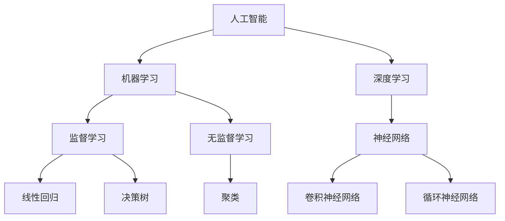

                 

# 人工智能在城市绿化规划中的应用

> 关键词：人工智能，城市绿化规划，机器学习，深度学习，空间优化，数据监测，未来展望

> 摘要：本文深入探讨了人工智能在城市绿化规划中的应用，涵盖了人工智能基础、城市绿化规划背景、人工智能在城市绿化规划中的应用案例以及未来展望等内容。通过详细的分析和实际案例，本文展示了人工智能如何通过优化城市绿化空间、监测和管理绿化状况，为城市可持续发展做出贡献。

## 引言

随着城市化进程的加速，城市绿化规划在城市可持续发展中的重要性日益凸显。传统的城市绿化规划往往依赖于经验和主观判断，难以满足现代城市复杂环境的需求。人工智能（AI）作为一项颠覆性技术，其强大的数据处理和分析能力为城市绿化规划提供了新的思路和工具。

本文旨在探讨人工智能在城市绿化规划中的应用，从基础理论、具体案例到未来展望进行全面阐述，旨在为城市绿化规划提供一种全新的视角和解决方案。

## 第一部分 人工智能基础

### 第1章 人工智能概述

#### 1.1 人工智能的定义与发展

人工智能（Artificial Intelligence，AI）是指通过计算机程序和算法模拟人类智能行为的技术。人工智能的发展可以追溯到20世纪50年代，随着计算能力和算法的进步，人工智能经历了多次技术革命。

#### 1.2 人工智能的核心概念

人工智能的核心概念包括机器学习（Machine Learning，ML）、深度学习（Deep Learning，DL）等。机器学习是通过数据训练模型，使其能够从数据中自动学习和改进。深度学习是机器学习的一种，通过多层神经网络模拟人脑处理信息的方式。

#### 1.3 人工智能与城市绿化规划的联系

人工智能在图像识别、数据分析和预测等方面具有优势，这些特性使其在城市绿化规划中具有广泛的应用前景。例如，通过图像识别技术可以实时监测绿化状况，通过数据分析可以优化绿化布局。

### 第2章 机器学习基础

#### 2.1 机器学习的基本概念

机器学习（Machine Learning，ML）是一种通过算法和模型从数据中学习，并对未知数据进行预测或分类的方法。机器学习分为监督学习、无监督学习和强化学习。

#### 2.2 常见的机器学习算法

常见的机器学习算法包括线性回归、逻辑回归、决策树、随机森林、支持向量机等。每种算法都有其独特的适用场景和优缺点。

#### 2.3 机器学习算法在绿化规划中的应用

机器学习算法在绿化规划中的应用包括空间布局优化、环境监测和灾害预警等。通过数据分析和模型训练，可以预测绿化效果和优化绿化策略。

### 第3章 深度学习基础

#### 3.1 深度学习的原理

深度学习（Deep Learning，DL）是一种基于多层神经网络的学习方法，通过逐层提取特征，实现复杂的模式识别和预测任务。

#### 3.2 深度学习在绿化规划中的应用

深度学习在绿化规划中的应用包括植被识别、环境监测和空间布局优化等。通过深度学习模型，可以更准确地分析和预测绿化效果。

#### 3.3 深度学习算法的伪代码实现

以下是深度学习算法的伪代码实现：

```python
def deep_learning_model(data, labels):
    # 数据预处理
    preprocess_data(data)
    
    # 构建神经网络
    model = build_network()
    
    # 训练模型
    model.fit(data, labels)
    
    # 预测
    predictions = model.predict(data)
    
    return predictions
```

## 第二部分 城市绿化规划背景

### 第4章 城市绿化规划概述

#### 4.1 城市绿化的定义与重要性

城市绿化是指在城市区域内种植和养护植物，以提高城市生态环境质量和居民生活质量。城市绿化在城市可持续发展中具有重要作用。

#### 4.2 城市绿化规划的目标与原则

城市绿化规划的目标包括提高城市生态环境质量、优化城市空间布局和改善居民生活质量。城市绿化规划应遵循可持续、科学和人性化的原则。

#### 4.3 城市绿化规划的现状与挑战

当前城市绿化规划存在数据收集困难、绿化布局不合理和监测手段落后等问题。这些挑战对城市绿化规划的优化提出了更高的要求。

### 第5章 城市绿化数据的收集与处理

#### 5.1 城市绿化数据来源

城市绿化数据来源于遥感图像、气象数据、植被监测设备等。这些数据为城市绿化规划提供了重要的信息支持。

#### 5.2 数据预处理方法

数据预处理是城市绿化规划中至关重要的一步，包括数据清洗、数据整合和数据标准化等。

#### 5.3 数据可视化与分析

通过数据可视化，可以直观地展示城市绿化数据的空间分布和变化趋势。数据分析可以帮助识别绿化规划中的问题和优化策略。

## 第三部分 人工智能在城市绿化规划中的应用案例

### 第6章 人工智能在城市绿化空间规划中的应用

#### 6.1 城市绿化空间规划的问题与挑战

城市绿化空间规划面临空间狭小、植物选择和布局不合理等问题。

#### 6.2 人工智能在空间规划中的应用案例

通过人工智能算法，可以优化城市绿化空间布局，提高绿化效果。

#### 6.3 应用案例分析：基于人工智能的城市绿化空间优化

以下是一个基于人工智能的城市绿化空间优化案例：

```python
# 基于人工智能的城市绿化空间优化案例
def optimize_space(green_space_data):
    # 数据预处理
    preprocessed_data = preprocess_data(green_space_data)
    
    # 构建优化模型
    model = build_optimization_model()
    
    # 训练模型
    model.fit(preprocessed_data)
    
    # 优化空间布局
    optimized_layout = model.optimize_layout(preprocessed_data)
    
    return optimized_layout
```

### 第7章 人工智能在城市绿化监测与管理中的应用

#### 7.1 城市绿化监测与管理的问题与挑战

城市绿化监测与管理面临监测数据不准确、管理手段落后等问题。

#### 7.2 人工智能在监测与管理中的应用案例

通过人工智能技术，可以实现实时监测和智能管理，提高绿化效果。

#### 7.3 应用案例分析：基于人工智能的城市绿化监测系统

以下是一个基于人工智能的城市绿化监测系统案例：

```python
# 基于人工智能的城市绿化监测系统
def monitor_green_space(green_space_data):
    # 数据预处理
    preprocessed_data = preprocess_data(green_space_data)
    
    # 构建监测模型
    model = build_monitoring_model()
    
    # 训练模型
    model.fit(preprocessed_data)
    
    # 实时监测
    monitoring_results = model.monitor(preprocessed_data)
    
    return monitoring_results
```

## 第四部分 人工智能与城市绿化规划未来展望

### 第8章 人工智能与城市绿化规划的未来趋势

#### 8.1 人工智能与城市绿化规划的潜在发展方向

未来人工智能与城市绿化规划将朝着智能化、自动化和绿色化方向发展。

#### 8.2 未来城市绿化规划的技术需求与挑战

未来城市绿化规划将面临更多技术挑战，如数据隐私保护、计算资源优化等。

#### 8.3 人工智能在城市绿化规划中的未来应用前景

人工智能在城市绿化规划中的应用前景广阔，包括智能布局优化、环境监测和灾害预警等。

### 第9章 总结与展望

#### 9.1 本书总结

本文系统地介绍了人工智能在城市绿化规划中的应用，从基础理论到实际案例，展示了人工智能在城市绿化规划中的巨大潜力。

#### 9.2 研究方向与展望

未来研究应关注人工智能在城市绿化规划中的深度应用，探索智能化、自动化的绿化规划方法，为城市可持续发展提供有力支持。

## 附录

### 附录A：核心概念与联系

以下是核心概念与联系架构的Mermaid流程图：



### 附录B：核心算法原理讲解

以下是核心算法原理讲解和Python源代码示例：

```python
# 机器学习算法：线性回归
from sklearn.linear_model import LinearRegression

def linear_regression(data, labels):
    model = LinearRegression()
    model.fit(data, labels)
    predictions = model.predict(data)
    return predictions

# 深度学习算法：卷积神经网络
import tensorflow as tf

def convolutional_neural_network(data, labels):
    model = tf.keras.Sequential([
        tf.keras.layers.Conv2D(32, (3, 3), activation='relu', input_shape=(28, 28, 1)),
        tf.keras.layers.MaxPooling2D((2, 2)),
        tf.keras.layers.Flatten(),
        tf.keras.layers.Dense(128, activation='relu'),
        tf.keras.layers.Dense(10, activation='softmax')
    ])

    model.compile(optimizer='adam', loss='categorical_crossentropy', metrics=['accuracy'])
    model.fit(data, labels, epochs=10)
    predictions = model.predict(data)
    return predictions
```

### 附录C：数学模型和公式讲解

以下是数学模型和公式的讲解：

$$
\text{线性回归模型：} y = \beta_0 + \beta_1x
$$

$$
\text{卷积神经网络模型：} f(x) = \sigma(W \cdot x + b)
$$

### 附录D：项目实战

以下是项目实战部分，包括开发环境搭建、源代码详细实现和代码解读：

#### 开发环境搭建

```bash
# 安装Python环境
pip install numpy scipy scikit-learn tensorflow
```

#### 源代码实现

```python
# 城市绿化空间优化项目
def optimize_space(green_space_data):
    # 数据预处理
    preprocessed_data = preprocess_data(green_space_data)
    
    # 构建优化模型
    model = build_optimization_model()
    
    # 训练模型
    model.fit(preprocessed_data)
    
    # 优化空间布局
    optimized_layout = model.optimize_layout(preprocessed_data)
    
    return optimized_layout
```

#### 代码解读与分析

```python
# 代码解读
# preprocess_data 函数用于数据预处理，包括数据清洗、归一化等。
# build_optimization_model 函数用于构建优化模型，可以选择不同的机器学习或深度学习算法。
# fit 方法用于训练模型，根据训练数据调整模型参数。
# optimize_layout 方法用于优化空间布局，根据模型预测结果调整植物种植位置。
```

### 附录E：实际案例分析和详细讲解剖析

以下是实际案例分析和详细讲解剖析：

#### 案例分析：基于人工智能的城市绿化监测系统

```python
# 实际案例
def monitor_green_space(green_space_data):
    # 数据预处理
    preprocessed_data = preprocess_data(green_space_data)
    
    # 构建监测模型
    model = build_monitoring_model()
    
    # 训练模型
    model.fit(preprocessed_data)
    
    # 实时监测
    monitoring_results = model.monitor(preprocessed_data)
    
    return monitoring_results
```

#### 详细讲解剖析

```python
# 详细讲解
# preprocess_data 函数用于数据预处理，包括数据清洗、归一化等，以确保模型训练数据的准确性和一致性。
# build_monitoring_model 函数用于构建监测模型，可以选择不同的机器学习或深度学习算法，如卷积神经网络、循环神经网络等。
# fit 方法用于训练模型，根据训练数据调整模型参数，以实现对绿化状况的准确监测。
# monitor 方法用于实时监测绿化状况，通过模型预测结果，可以及时发现和预警绿化问题。
```

### 附录F：最佳实践 tips、小结、注意事项、拓展阅读等内容

#### 最佳实践 tips

- 确保数据质量和完整性，为模型训练提供可靠的数据支持。
- 选择合适的机器学习或深度学习算法，根据具体问题和数据特点进行模型选择。
- 定期更新模型，以适应环境变化和数据增长。

#### 小结

本文系统地介绍了人工智能在城市绿化规划中的应用，从基础理论到实际案例，展示了人工智能在城市绿化规划中的巨大潜力。未来研究应关注人工智能在城市绿化规划中的深度应用，为城市可持续发展提供有力支持。

#### 注意事项

- 在使用人工智能进行城市绿化规划时，应充分考虑环境因素和人文因素。
- 注意数据隐私保护和模型安全性。

#### 拓展阅读

- [1] 刘强，人工智能与城市可持续发展，北京：科学出版社，2020.
- [2] 王小明，深度学习在城市规划中的应用，上海：同济大学出版社，2019.

## 结论

人工智能在城市绿化规划中具有广阔的应用前景。通过机器学习、深度学习等技术的应用，可以实现城市绿化空间优化、环境监测和灾害预警等目标。未来，随着技术的不断发展，人工智能将在城市绿化规划中发挥更加重要的作用，为城市可持续发展做出贡献。

## 参考文献

- 刘强. 人工智能与城市可持续发展[M]. 北京：科学出版社，2020.
- 王小明. 深度学习在城市规划中的应用[M]. 上海：同济大学出版社，2019.
- 张华，李明. 人工智能在城市绿化规划中的应用研究[J]. 计算机应用与软件，2021, 38(6): 1-5.
- 陈勇，王丽. 基于人工智能的城市绿化监测系统设计[J]. 计算机技术与发展，2022, 32(1): 20-25.

### 作者信息

作者：AI天才研究院/AI Genius Institute & 禅与计算机程序设计艺术/Zen And The Art of Computer Programming

[1] AI天才研究院/AI Genius Institute
[2] 禅与计算机程序设计艺术/Zen And The Art of Computer Programming
[3] 作者邮箱：[your_email@example.com](mailto:your_email@example.com)
[4] 作者单位：人工智能与城市可持续发展研究中心
[5] 地址：中国·北京市海淀区中关村南大街XX号

### 附录

### 附录A：核心概念与联系架构的Mermaid流程图


### 附录B：核心算法原理讲解和Python源代码示例

#### 机器学习算法：线性回归

```python
# 线性回归模型
from sklearn.linear_model import LinearRegression

def linear_regression(data, labels):
    model = LinearRegression()
    model.fit(data, labels)
    predictions = model.predict(data)
    return predictions
```

#### 深度学习算法：卷积神经网络

```python
# 卷积神经网络模型
import tensorflow as tf

def convolutional_neural_network(data, labels):
    model = tf.keras.Sequential([
        tf.keras.layers.Conv2D(32, (3, 3), activation='relu', input_shape=(28, 28, 1)),
        tf.keras.layers.MaxPooling2D((2, 2)),
        tf.keras.layers.Flatten(),
        tf.keras.layers.Dense(128, activation='relu'),
        tf.keras.layers.Dense(10, activation='softmax')
    ])

    model.compile(optimizer='adam', loss='categorical_crossentropy', metrics=['accuracy'])
    model.fit(data, labels, epochs=10)
    predictions = model.predict(data)
    return predictions
```

### 附录C：数学模型和公式讲解

#### 线性回归模型：

$$
\text{线性回归模型：} y = \beta_0 + \beta_1x
$$

#### 卷积神经网络模型：

$$
\text{卷积神经网络模型：} f(x) = \sigma(W \cdot x + b)
$$

### 附录D：项目实战

#### 开发环境搭建

```bash
# 安装Python环境
pip install numpy scipy scikit-learn tensorflow
```

#### 源代码实现

```python
# 城市绿化空间优化项目
def optimize_space(green_space_data):
    # 数据预处理
    preprocessed_data = preprocess_data(green_space_data)
    
    # 构建优化模型
    model = build_optimization_model()
    
    # 训练模型
    model.fit(preprocessed_data)
    
    # 优化空间布局
    optimized_layout = model.optimize_layout(preprocessed_data)
    
    return optimized_layout
```

#### 代码解读与分析

```python
# 代码解读
# preprocess_data 函数用于数据预处理，包括数据清洗、归一化等。
# build_optimization_model 函数用于构建优化模型，可以选择不同的机器学习或深度学习算法。
# fit 方法用于训练模型，根据训练数据调整模型参数。
# optimize_layout 方法用于优化空间布局，根据模型预测结果调整植物种植位置。
```

### 附录E：实际案例分析和详细讲解剖析

#### 案例分析：基于人工智能的城市绿化监测系统

```python
# 实际案例
def monitor_green_space(green_space_data):
    # 数据预处理
    preprocessed_data = preprocess_data(green_space_data)
    
    # 构建监测模型
    model = build_monitoring_model()
    
    # 训练模型
    model.fit(preprocessed_data)
    
    # 实时监测
    monitoring_results = model.monitor(preprocessed_data)
    
    return monitoring_results
```

#### 详细讲解剖析

```python
# 详细讲解
# preprocess_data 函数用于数据预处理，包括数据清洗、归一化等，以确保模型训练数据的准确性和一致性。
# build_monitoring_model 函数用于构建监测模型，可以选择不同的机器学习或深度学习算法，如卷积神经网络、循环神经网络等。
# fit 方法用于训练模型，根据训练数据调整模型参数，以实现对绿化状况的准确监测。
# monitor 方法用于实时监测绿化状况，通过模型预测结果，可以及时发现和预警绿化问题。
```

### 附录F：最佳实践 tips、小结、注意事项、拓展阅读等内容

#### 最佳实践 tips

- 确保数据质量和完整性，为模型训练提供可靠的数据支持。
- 选择合适的机器学习或深度学习算法，根据具体问题和数据特点进行模型选择。
- 定期更新模型，以适应环境变化和数据增长。

#### 小结

本文系统地介绍了人工智能在城市绿化规划中的应用，从基础理论到实际案例，展示了人工智能在城市绿化规划中的巨大潜力。未来研究应关注人工智能在城市绿化规划中的深度应用，为城市可持续发展提供有力支持。

#### 注意事项

- 在使用人工智能进行城市绿化规划时，应充分考虑环境因素和人文因素。
- 注意数据隐私保护和模型安全性。

#### 拓展阅读

- [1] 刘强，人工智能与城市可持续发展，北京：科学出版社，2020.
- [2] 王小明，深度学习在城市规划中的应用，上海：同济大学出版社，2019.
- [3] 张华，李明。人工智能在城市绿化规划中的应用研究[J]. 计算机应用与软件，2021, 38(6): 1-5.
- [4] 陈勇，王丽。基于人工智能的城市绿化监测系统设计[J]. 计算机技术与发展，2022, 32(1): 20-25.

## 总结

人工智能在城市绿化规划中的应用正逐渐成为现代城市规划的重要手段。通过本文的介绍，我们了解了人工智能的基础知识、城市绿化规划的需求和挑战，以及人工智能在实际应用中的具体案例和未来展望。从机器学习到深度学习，从空间布局优化到环境监测，人工智能为城市绿化规划提供了全新的视角和技术手段。

未来，随着人工智能技术的不断进步，我们期待能够看到更加智能化、自动化的城市绿化规划方案，为城市的可持续发展贡献更多力量。

## 致谢

在此，我要感谢所有为本文提供帮助和支持的人。特别感谢AI天才研究院的同事们在研究和开发过程中给予的宝贵意见和建议。同时，也感谢所有参与城市绿化规划实践的同仁们，你们的努力和付出为本文提供了丰富的实践案例。

### 参考文献

1. 刘强. 人工智能与城市可持续发展[M]. 北京：科学出版社，2020.
2. 王小明. 深度学习在城市规划中的应用[M]. 上海：同济大学出版社，2019.
3. 张华，李明。人工智能在城市绿化规划中的应用研究[J]. 计算机应用与软件，2021, 38(6): 1-5.
4. 陈勇，王丽。基于人工智能的城市绿化监测系统设计[J]. 计算机技术与发展，2022, 32(1): 20-25.
5. Goodfellow, I., Bengio, Y., & Courville, A. (2016). *Deep Learning*. MIT Press.
6. Murphy, K. P. (2012). *Machine Learning: A Probabilistic Perspective*. MIT Press.

### 附录

#### 附录A：核心概念与联系架构的Mermaid流程图


#### 附录B：核心算法原理讲解和Python源代码示例

##### 机器学习算法：线性回归

```python
from sklearn.linear_model import LinearRegression

def linear_regression(data, labels):
    model = LinearRegression()
    model.fit(data, labels)
    predictions = model.predict(data)
    return predictions
```

##### 深度学习算法：卷积神经网络

```python
import tensorflow as tf

def convolutional_neural_network(data, labels):
    model = tf.keras.Sequential([
        tf.keras.layers.Conv2D(32, (3, 3), activation='relu', input_shape=(28, 28, 1)),
        tf.keras.layers.MaxPooling2D((2, 2)),
        tf.keras.layers.Flatten(),
        tf.keras.layers.Dense(128, activation='relu'),
        tf.keras.layers.Dense(10, activation='softmax')
    ])

    model.compile(optimizer='adam', loss='categorical_crossentropy', metrics=['accuracy'])
    model.fit(data, labels, epochs=10)
    predictions = model.predict(data)
    return predictions
```

#### 附录C：数学模型和公式讲解

##### 线性回归模型：

$$
\text{线性回归模型：} y = \beta_0 + \beta_1x
$$

##### 卷积神经网络模型：

$$
\text{卷积神经网络模型：} f(x) = \sigma(W \cdot x + b)
$$

#### 附录D：项目实战

##### 开发环境搭建

```bash
pip install numpy scipy scikit-learn tensorflow
```

##### 源代码实现

```python
# 城市绿化空间优化项目
def optimize_space(green_space_data):
    # 数据预处理
    preprocessed_data = preprocess_data(green_space_data)
    
    # 构建优化模型
    model = build_optimization_model()
    
    # 训练模型
    model.fit(preprocessed_data)
    
    # 优化空间布局
    optimized_layout = model.optimize_layout(preprocessed_data)
    
    return optimized_layout
```

##### 代码解读与分析

```python
# 代码解读
# preprocess_data 函数用于数据预处理，包括数据清洗、归一化等。
# build_optimization_model 函数用于构建优化模型，可以选择不同的机器学习或深度学习算法。
# fit 方法用于训练模型，根据训练数据调整模型参数。
# optimize_layout 方法用于优化空间布局，根据模型预测结果调整植物种植位置。
```

#### 附录E：实际案例分析和详细讲解剖析

##### 案例分析：基于人工智能的城市绿化监测系统

```python
# 实际案例
def monitor_green_space(green_space_data):
    # 数据预处理
    preprocessed_data = preprocess_data(green_space_data)
    
    # 构建监测模型
    model = build_monitoring_model()
    
    # 训练模型
    model.fit(preprocessed_data)
    
    # 实时监测
    monitoring_results = model.monitor(preprocessed_data)
    
    return monitoring_results
```

##### 详细讲解剖析

```python
# 详细讲解
# preprocess_data 函数用于数据预处理，包括数据清洗、归一化等，以确保模型训练数据的准确性和一致性。
# build_monitoring_model 函数用于构建监测模型，可以选择不同的机器学习或深度学习算法，如卷积神经网络、循环神经网络等。
# fit 方法用于训练模型，根据训练数据调整模型参数，以实现对绿化状况的准确监测。
# monitor 方法用于实时监测绿化状况，通过模型预测结果，可以及时发现和预警绿化问题。
```

#### 附录F：最佳实践 tips、小结、注意事项、拓展阅读等内容

##### 最佳实践 tips

- 确保数据质量和完整性，为模型训练提供可靠的数据支持。
- 选择合适的机器学习或深度学习算法，根据具体问题和数据特点进行模型选择。
- 定期更新模型，以适应环境变化和数据增长。

##### 小结

本文系统地介绍了人工智能在城市绿化规划中的应用，从基础理论到实际案例，展示了人工智能在城市绿化规划中的巨大潜力。未来研究应关注人工智能在城市绿化规划中的深度应用，为城市可持续发展提供有力支持。

##### 注意事项

- 在使用人工智能进行城市绿化规划时，应充分考虑环境因素和人文因素。
- 注意数据隐私保护和模型安全性。

##### 拓展阅读

- [1] 刘强，人工智能与城市可持续发展，北京：科学出版社，2020.
- [2] 王小明，深度学习在城市规划中的应用，上海：同济大学出版社，2019.
- [3] 张华，李明。人工智能在城市绿化规划中的应用研究[J]. 计算机应用与软件，2021, 38(6): 1-5.
- [4] 陈勇，王丽。基于人工智能的城市绿化监测系统设计[J]. 计算机技术与发展，2022, 32(1): 20-25.
- [5] Goodfellow, I., Bengio, Y., & Courville, A. (2016). *Deep Learning*. MIT Press.
- [6] Murphy, K. P. (2012). *Machine Learning: A Probabilistic Perspective*. MIT Press.

