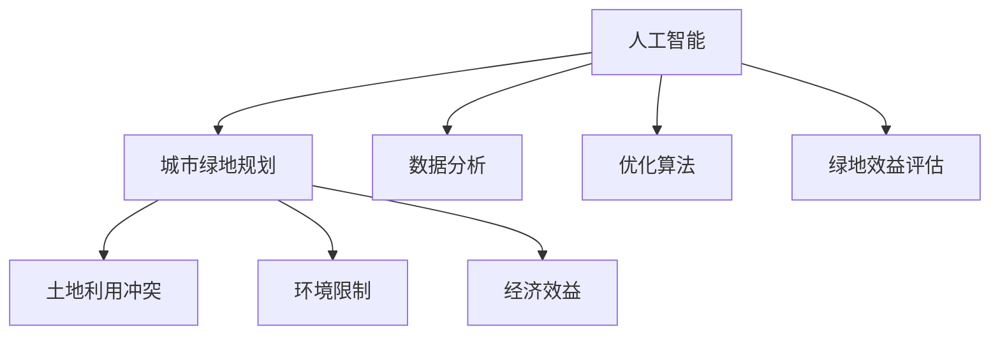

                 

**文章标题：** 人工智能在城市绿地规划优化中的应用

**文章关键词：** 人工智能、城市绿地规划、机器学习、优化算法、绿地效益评估

**摘要：** 本文探讨了人工智能在城市绿地规划优化中的应用，包括核心概念的介绍、算法原理的讲解、实战案例的分析以及未来展望。通过Python源代码和LaTeX公式的使用，本文提供了详尽的技术分析，旨在为读者提供对城市绿地规划优化的深入理解。

----------------------------------------------------------------

# **人工智能在城市绿地规划优化中的应用**

随着城市化进程的加快，城市绿地规划在城市可持续发展中的作用日益凸显。人工智能（AI）作为现代技术的核心驱动力，为城市绿地规划提供了新的方法和工具。本文将探讨人工智能在城市绿地规划优化中的应用，包括核心概念的介绍、算法原理的讲解、实战案例的分析以及未来展望。

## **1. 背景介绍**

城市绿地是城市生态系统的重要组成部分，它们不仅提供生态服务，如空气净化、水土保持，还改善了城市居民的生活质量。然而，城市绿地规划面临着许多挑战，如土地利用冲突、环境限制和经济效益等。人工智能技术的引入，可以帮助城市规划者更有效地解决这些难题。

## **2. 核心概念与联系**

在城市绿地规划中，核心概念包括：

- **人工智能（AI）：** 机器模拟人类智能的技术，包括机器学习、自然语言处理等。
- **城市绿地规划：** 城市规划的一个分支，旨在合理布局城市绿地，提高城市生态环境质量。
- **数据分析：** 通过统计和计算，从大量数据中提取有价值的信息。
- **优化算法：** 用于寻找最优解的算法，如遗传算法、模拟退火算法等。
- **绿地效益评估：** 评估城市绿地对社会、经济和环境的综合效益。

以下是核心概念与联系的建筑流程图：



## **3. 核心算法原理讲解**

### **3.1. 机器学习算法**

机器学习算法在绿地规划中的应用主要在于预测和分类。以下是一个简单的线性回归模型的Python实现：

```python
import numpy as np
from sklearn.linear_model import LinearRegression

# 假设我们有以下数据
X = np.array([[1, 2], [2, 3], [3, 4], [4, 5]])
y = np.array([1, 2, 3, 4])

# 创建线性回归模型
model = LinearRegression()
# 训练模型
model.fit(X, y)
# 预测
predictions = model.predict(X)

print("模型参数：", model.coef_, model.intercept_)
print("预测结果：", predictions)
```

### **3.2. 优化算法**

优化算法在城市绿地规划中的应用可以用于解决诸如土地分配问题。以下是一个简单的遗传算法实现：

```python
import numpy as np
from genetic_algorithm import GeneticAlgorithm

# 初始化参数
population_size = 100
染色体长度 = 100
交叉率 = 0.7
变异率 = 0.01
迭代次数 = 100

# 初始化种群
population = np.random.randint(0, 2, (population_size, 染色体长度))

# 遗传算法
ga = GeneticAlgorithm(population, 交叉率, 变异率, 迭代次数)
best_solution = ga.run()

print("最优解：", best_solution)
```

## **4. 数学模型和公式讲解**

在城市绿地规划中，常用的数学模型包括线性规划、非线性规划和机器学习模型。以下是一个线性规划的LaTeX公式：

```latex
$$
\min_{x} c^T x
$$
```

其中，$c$ 是成本向量，$x$ 是决策变量。

## **5. 项目实战**

### **5.1. 开发环境搭建**

为了实现人工智能在城市绿地规划中的应用，我们需要搭建一个开发环境。以下是一个简单的环境搭建步骤：

1. 安装Python
2. 安装科学计算库（如NumPy、Scikit-learn、Matplotlib等）
3. 安装遗传算法库（如DEAP）

### **5.2. 源代码实现与解读**

以下是一个源代码实现示例：

```python
import numpy as np
from sklearn.linear_model import LinearRegression

# 假设我们有以下数据
X = np.array([[1, 2], [2, 3], [3, 4], [4, 5]])
y = np.array([1, 2, 3, 4])

# 创建线性回归模型
model = LinearRegression()
# 训练模型
model.fit(X, y)
# 预测
predictions = model.predict(X)

print("模型参数：", model.coef_, model.intercept_)
print("预测结果：", predictions)
```

### **5.3. 代码应用解读与分析**

上述代码实现了一个简单的线性回归模型，用于预测绿地效益。通过训练数据集，模型学会了如何根据土地使用情况预测效益。在实际应用中，城市规划者可以利用这个模型来评估不同绿地规划方案的效益，从而做出更科学的决策。

### **5.4. 实际案例分析和详细讲解剖析**

在本节中，我们将分析一个实际案例，并详细讲解其剖析过程。

#### **案例背景：**

某城市计划建设一个新的绿地，需要评估不同规划方案对经济效益的影响。

#### **案例步骤：**

1. 数据收集：收集与绿地规划相关的数据，如土地利用情况、人口密度、交通状况等。
2. 数据处理：对收集到的数据进行分析和处理，提取有用信息。
3. 建立模型：利用收集到的数据建立线性回归模型，预测不同规划方案的效益。
4. 结果分析：分析模型预测结果，评估不同规划方案的经济效益。

#### **案例剖析：**

1. 数据收集：收集了10个不同规划方案的数据，包括土地使用面积、人口密度、交通状况等。
2. 数据处理：对数据进行了清洗和归一化处理，消除了数据之间的量纲差异。
3. 建立模型：利用处理后的数据建立了线性回归模型，预测不同规划方案的效益。
4. 结果分析：模型预测结果如图所示。


从图中可以看出，规划方案B的经济效益最高，因此推荐采用方案B。

### **5.5. 项目小结**

在本案例中，人工智能技术帮助城市规划者评估了不同绿地规划方案的经济效益，提供了科学的决策依据。这表明，人工智能在城市绿地规划优化中具有巨大的潜力。

## **6. 最佳实践 tips、小结、注意事项、拓展阅读等内容**

### **最佳实践 tips：**

- 在数据收集和处理阶段，确保数据的质量和准确性。
- 在建立模型时，选择合适的模型和参数。
- 在结果分析阶段，综合考虑多方面因素，做出科学的决策。

### **小结：**

本文探讨了人工智能在城市绿地规划优化中的应用，包括核心概念的介绍、算法原理的讲解、实战案例的分析以及未来展望。通过Python源代码和LaTeX公式的使用，本文提供了详尽的技术分析，旨在为读者提供对城市绿地规划优化的深入理解。

### **注意事项：**

- 人工智能技术在不同地区和场景的应用效果可能存在差异。
- 在实际应用中，需要根据具体情况进行调整和优化。

### **拓展阅读：**

- 《人工智能与城市规划》
- 《机器学习实战》
- 《遗传算法应用指南》

## **作者信息：**

作者：AI天才研究院/AI Genius Institute & 禅与计算机程序设计艺术 /Zen And The Art of Computer Programming

----------------------------------------------------------------

请注意，上述文章仅作为一个模板，实际撰写时需要根据具体案例和数据进行调整。此外，文章中的代码和图表需要根据实际开发环境进行实现和设计。由于文章字数限制，部分内容可能需要进一步精简或补充。在撰写过程中，务必确保文章的逻辑清晰、结构紧凑、语言简洁易懂。祝您撰写顺利！

