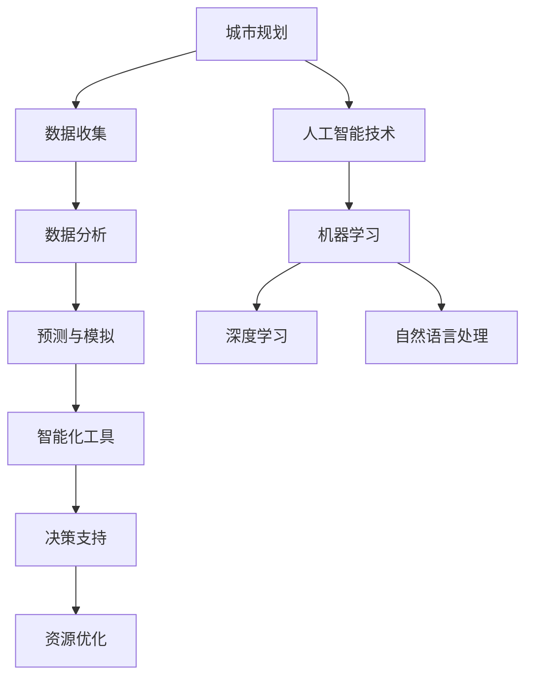
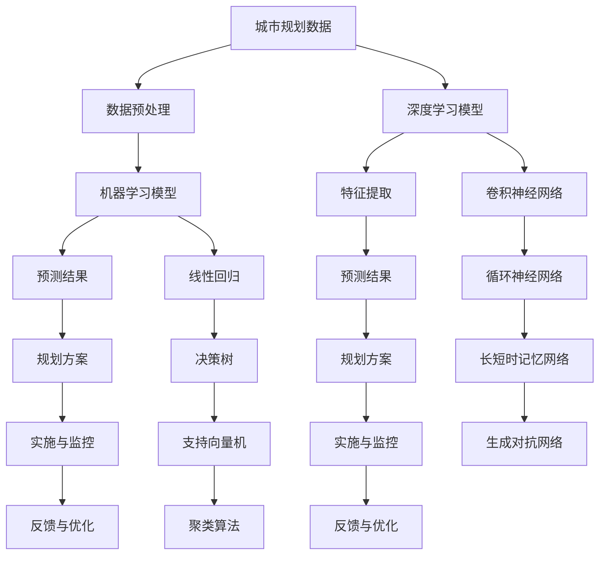

                 

### 引言

在当今快速发展的信息技术时代，人工智能（Artificial Intelligence，简称AI）已经成为推动各行各业变革的重要力量。城市规划作为一门综合性学科，其核心目标是优化城市空间结构、提高居民生活质量、促进经济可持续发展。然而，面对城市化进程中出现的复杂问题，如交通拥堵、环境污染、资源分配不均等，传统的城市规划方法已显得力不从心。这为人工智能技术在城市规划中的广泛应用提供了契机。

**人工智能在城市规划中的重要性**主要体现在以下几个方面：

1. **数据驱动的决策支持**：城市规划需要处理大量数据，包括地理空间数据、人口数据、交通流量数据等。人工智能可以通过机器学习和深度学习算法对数据进行高效处理和分析，从而提供更为精准和科学的决策支持。
2. **智能化的规划工具**：利用人工智能技术，可以开发出智能化、自动化的规划工具，如自动路线规划、环境监测系统等，这些工具能够显著提高规划效率，减少人为错误。
3. **预测与模拟**：人工智能技术能够模拟和预测城市未来的发展趋势，为规划者提供前瞻性的决策依据。例如，通过预测交通流量和人口增长，可以提前规划交通基础设施和公共设施，以应对未来的需求变化。
4. **优化资源配置**：人工智能可以帮助城市规划者优化资源配置，如合理布局商业区、住宅区和工业区，提高土地利用效率，减少资源浪费。

本书旨在深入探讨人工智能在城市规划决策中的支持作用，通过详细的案例分析、算法讲解和实际应用示范，展示人工智能在提升城市规划科学性和有效性的重要作用。全书分为七个章节，结构如下：

- **第1章 引言**：概述人工智能在城市规划中的角色和本书结构。
- **第2章 城市规划与人工智能技术基础**：介绍城市规划的基本概念和人工智能技术的基础。
- **第3章 人工智能技术在城市规划中的应用**：详细讲解机器学习和深度学习在规划中的应用。
- **第4章 AI城市规划工具和平台**：介绍开源和商业的AI城市规划工具。
- **第5章 AI城市规划数据分析**：探讨AI数据分析方法。
- **第6章 AI城市规划的挑战与未来趋势**：分析AI在城市规划中的挑战和未来发展方向。
- **第7章 总结与展望**：总结全书内容，展望AI城市规划的未来。

通过本书的阅读，读者将深入了解人工智能如何助力城市规划决策，掌握相关技术和工具的使用，为未来的城市规划和设计提供有力支持。

### 关键词

- **人工智能（Artificial Intelligence）**
- **城市规划（Urban Planning）**
- **机器学习（Machine Learning）**
- **深度学习（Deep Learning）**
- **数据分析（Data Analysis）**
- **算法（Algorithm）**
- **城市规划工具（Urban Planning Tools）**

### 摘要

本书《人工智能在城市规划决策中的支持作用》旨在探讨人工智能技术如何助力城市规划的科学化和有效性提升。通过详细的理论基础介绍、实际案例分析、算法讲解和技术工具展示，本书揭示了人工智能在数据驱动的决策支持、智能化工具开发、预测模拟和资源配置优化等方面的应用。书中不仅涵盖了人工智能技术的基本原理和城市规划的相关知识，还深入分析了当前AI在城市规划中面临的挑战和未来发展趋势。通过阅读本书，读者将能够理解并掌握人工智能技术如何为城市规划提供强有力的支持，从而为未来的城市建设和可持续发展做出贡献。

## 第1章 引言

在当前快速发展的信息技术时代，人工智能（Artificial Intelligence，简称AI）已经成为推动各行各业变革的重要力量。城市规划作为一门综合性学科，其核心目标是优化城市空间结构、提高居民生活质量、促进经济可持续发展。然而，面对城市化进程中出现的复杂问题，如交通拥堵、环境污染、资源分配不均等，传统的城市规划方法已显得力不从心。这为人工智能技术在城市规划中的广泛应用提供了契机。

### 城市规划中的挑战

城市规划涉及多个方面的复杂问题，以下是一些主要挑战：

1. **交通拥堵**：城市化进程带来了交通流量的急剧增加，导致交通拥堵问题日益严重。如何合理规划道路网络和公共交通系统，提高交通效率，成为城市规划的重要课题。
2. **环境污染**：城市的环境问题日益突出，如空气污染、水污染和垃圾处理等。如何通过城市规划减少环境污染，保护城市生态环境，是城市规划者面临的重大挑战。
3. **资源分配不均**：城市资源（如土地、水资源、能源等）分配不均，可能导致一些地区资源过剩，而另一些地区资源匮乏。如何通过城市规划实现资源的高效分配和公平利用，是城市规划的重要任务。
4. **城市扩张**：随着城市人口的增加和城市空间的扩展，城市规划需要应对城市扩张带来的新挑战，如土地利用、基础设施建设等。

### 人工智能在城市规划中的角色

人工智能在城市规划中发挥着重要作用，具体体现在以下几个方面：

1. **数据驱动的决策支持**：城市规划需要处理大量的数据，包括地理空间数据、人口数据、交通流量数据等。人工智能可以通过机器学习和深度学习算法对这些数据进行分析和处理，提供精准的决策支持。例如，通过分析交通流量数据，AI可以预测未来交通拥堵的热点区域，帮助规划者提前制定解决方案。

2. **智能化的规划工具**：利用人工智能技术，可以开发出智能化、自动化的规划工具，如自动路线规划、环境监测系统等，这些工具能够显著提高规划效率，减少人为错误。例如，通过AI技术自动生成城市道路网络布局，可以优化交通流量，提高道路通行效率。

3. **预测与模拟**：人工智能技术能够模拟和预测城市未来的发展趋势，为规划者提供前瞻性的决策依据。例如，通过预测人口增长和交通流量，可以提前规划交通基础设施和公共设施，以应对未来的需求变化。

4. **优化资源配置**：人工智能可以帮助城市规划者优化资源配置，如合理布局商业区、住宅区和工业区，提高土地利用效率，减少资源浪费。例如，通过分析土地利用数据，AI可以推荐最优的用地规划方案，以最大化土地价值。

### 本书的目的

本书《人工智能在城市规划决策中的支持作用》旨在深入探讨人工智能技术在城市规划中的应用，通过详细的案例分析、算法讲解和实际应用示范，展示人工智能在提升城市规划科学性和有效性的重要作用。以下是本书的主要目的：

1. **普及人工智能知识**：为读者提供人工智能技术的基础知识和应用场景，帮助读者理解AI如何为城市规划服务。
2. **介绍核心技术**：详细讲解机器学习、深度学习等人工智能技术的基本原理和应用，帮助读者掌握AI技术的核心概念。
3. **实际案例分析**：通过具体的城市规划案例，展示人工智能技术在实际项目中的应用效果，帮助读者了解AI技术的实际操作。
4. **探讨未来趋势**：分析人工智能在城市规划中面临的挑战和未来发展趋势，为读者提供前瞻性的思考和指导。

本书旨在为城市规划者、研究人员和开发者提供一本全面、系统的指南，帮助他们在城市规划中充分利用人工智能技术，实现更加科学、高效的城市规划。

### 本书结构

为了帮助读者系统、全面地了解人工智能在城市规划中的支持作用，本书分为七个章节，具体结构如下：

- **第1章 引言**：概述人工智能在城市规划中的角色和本书结构。
- **第2章 城市规划与人工智能技术基础**：介绍城市规划的基本概念和人工智能技术的基础。
- **第3章 人工智能技术在城市规划中的应用**：详细讲解机器学习和深度学习在规划中的应用。
- **第4章 AI城市规划工具和平台**：介绍开源和商业的AI城市规划工具。
- **第5章 AI城市规划数据分析**：探讨AI数据分析方法。
- **第6章 AI城市规划的挑战与未来趋势**：分析AI在城市规划中的挑战和未来发展趋势。
- **第7章 总结与展望**：总结全书内容，展望AI城市规划的未来。

通过以上章节的逐步讲解，读者将能够从基础理论、核心技术、实际应用、工具平台、数据分析、未来挑战等多个角度，全面了解人工智能在城市规划中的应用和前景。

## 第2章 城市规划与人工智能技术基础

城市规划是一门涉及地理、建筑、经济、环境等多学科的综合学科，其核心目标是创造功能完善、环境友好、可持续发展的城市空间。为了实现这一目标，城市规划需要依赖大量的数据和分析工具。随着人工智能技术的发展，AI技术在城市规划中的应用逐渐成为可能。本章节将介绍城市规划的基本概念、主要步骤和工具，并探讨人工智能技术在这些领域中的应用。

### 城市规划的基本概念

城市规划涉及多个方面的内容，以下是一些基本概念：

1. **城市设计**：城市设计是指通过艺术和科学的方法，对城市空间进行规划、设计和管理。它注重城市的美观和实用性，旨在创造舒适、美观的城市环境。
2. **城市形态**：城市形态是指城市的空间布局和结构，包括道路网络、建筑布局、公园绿地等。城市规划的一个重要任务就是优化城市形态，提高空间利用效率。
3. **土地利用规划**：土地利用规划是指对城市土地进行合理分配和利用，以满足不同功能和需求。土地利用规划需要考虑城市的经济、社会和环境等多方面因素。
4. **交通规划**：交通规划是指对城市交通系统进行设计和管理，以提高交通效率、减少拥堵、降低环境污染。交通规划需要综合考虑道路网络、公共交通、交通管理等多个方面。
5. **环境保护规划**：环境保护规划是指通过规划和管理，保护城市的环境质量，减少污染和资源浪费。环境保护规划需要关注空气质量、水质、垃圾处理等多个方面。

### 城市规划的主要步骤和工具

城市规划通常包括以下主要步骤和工具：

1. **需求分析**：需求分析是城市规划的第一步，它通过对城市现状和未来发展的需求进行分析，确定规划的目标和方向。需求分析的工具包括问卷调查、访谈、数据分析等。
2. **规划方案设计**：规划方案设计是在需求分析的基础上，提出具体的城市规划方案。规划方案设计需要综合考虑城市形态、土地利用、交通规划、环境保护等多个方面。
3. **方案评估**：方案评估是对不同规划方案进行评价和比较，选择最优方案。方案评估的工具包括成本效益分析、环境影响评估、公众意见调查等。
4. **实施规划**：实施规划是将规划方案付诸实施，包括基础设施建设、土地利用调整、交通管理改进等。实施规划需要制定详细的实施计划和步骤。
5. **监督和反馈**：监督和反馈是对规划实施情况进行跟踪和评估，根据实际情况进行调整和改进。监督和反馈的工具包括数据监测、现场检查、公众反馈等。

### 人工智能技术在城市规划中的应用

人工智能技术在城市规划中的应用越来越广泛，以下是一些主要的应用领域：

1. **数据驱动的决策支持**：城市规划需要处理大量的数据，包括地理空间数据、人口数据、交通流量数据等。人工智能可以通过机器学习和深度学习算法对这些数据进行分析和处理，提供精准的决策支持。例如，通过分析交通流量数据，AI可以预测未来交通拥堵的热点区域，帮助规划者提前制定解决方案。
2. **智能化的规划工具**：利用人工智能技术，可以开发出智能化、自动化的规划工具，如自动路线规划、环境监测系统等，这些工具能够显著提高规划效率，减少人为错误。例如，通过AI技术自动生成城市道路网络布局，可以优化交通流量，提高道路通行效率。
3. **预测与模拟**：人工智能技术能够模拟和预测城市未来的发展趋势，为规划者提供前瞻性的决策依据。例如，通过预测人口增长和交通流量，可以提前规划交通基础设施和公共设施，以应对未来的需求变化。
4. **优化资源配置**：人工智能可以帮助城市规划者优化资源配置，如合理布局商业区、住宅区和工业区，提高土地利用效率，减少资源浪费。例如，通过分析土地利用数据，AI可以推荐最优的用地规划方案，以最大化土地价值。

### 基本概念与联系：城市规划与人工智能技术的结合

为了更好地理解城市规划与人工智能技术的结合，我们可以通过一个Mermaid流程图来展示它们之间的关系：



在这个流程图中，我们可以看到城市规划的各个环节如何通过人工智能技术进行优化和提升。例如，通过机器学习和深度学习算法，可以高效地处理和分析大量城市规划数据，从而提供更加精准的预测和模拟结果。同时，人工智能技术还可以帮助开发智能化工具，如自动路线规划和环境监测系统，这些工具能够显著提高规划效率，减少人为错误。

### 核心算法原理讲解

人工智能技术在城市规划中的应用主要依赖于机器学习和深度学习算法。以下是对这些算法的基本原理和应用的讲解：

1. **机器学习**：机器学习是一种通过算法从数据中学习模式和规律的技术。在城市规划中，机器学习算法可以用来分析交通流量数据、人口数据等，从而预测未来发展趋势。常见的机器学习算法包括线性回归、决策树、支持向量机等。

   ```python
   # 伪代码：使用线性回归预测交通流量
   from sklearn.linear_model import LinearRegression

   # 数据预处理
   X = ... # 特征矩阵
   y = ... # 目标值

   # 建立线性回归模型
   model = LinearRegression()
   model.fit(X, y)

   # 预测
   predictions = model.predict(X)
   ```

2. **深度学习**：深度学习是一种基于多层神经网络的学习方法，它可以处理复杂的非线性数据。在城市规划中，深度学习算法可以用来识别城市空间中的复杂模式，如土地利用变化、交通流量模式等。常见的深度学习模型包括卷积神经网络（CNN）、循环神经网络（RNN）等。

   ```python
   # 伪代码：使用卷积神经网络分析土地利用变化
   from tensorflow.keras.models import Sequential
   from tensorflow.keras.layers import Conv2D, Flatten, Dense

   # 构建卷积神经网络模型
   model = Sequential()
   model.add(Conv2D(filters=32, kernel_size=(3, 3), activation='relu', input_shape=(28, 28, 1)))
   model.add(Flatten())
   model.add(Dense(units=1, activation='sigmoid'))

   # 编译模型
   model.compile(optimizer='adam', loss='binary_crossentropy', metrics=['accuracy'])

   # 训练模型
   model.fit(X_train, y_train, epochs=10, batch_size=32)
   ```

3. **自然语言处理**：自然语言处理（NLP）是一种使计算机能够理解和生成人类语言的技术。在规划报告中，NLP可以用来分析和提取关键信息，如人口统计、土地利用规划等。常见的NLP技术包括词向量、文本分类、情感分析等。

   ```python
   # 伪代码：使用词向量进行文本分类
   from gensim.models import Word2Vec

   # 训练词向量模型
   model = Word2Vec(sentences, vector_size=100, window=5, min_count=1, workers=4)

   # 使用词向量进行文本分类
   def classify(text):
       text_vector = model.wv[text]
       return model.wv.most_similar(text_vector, topn=1)
   ```

通过上述算法的讲解，我们可以看到人工智能技术如何为城市规划提供强大的支持。这些算法不仅能够处理和分析大量数据，还可以提供精准的预测和模拟结果，从而帮助规划者做出更科学的决策。

### AI与城市规划的结合案例

为了更直观地展示人工智能技术在城市规划中的应用，以下是一些具体的案例：

1. **城市交通流量预测**：
   - **背景**：随着城市人口的快速增长和汽车拥有率的提高，城市交通拥堵问题日益严重。如何通过城市规划减少交通拥堵，提高道路通行效率，成为一个亟待解决的问题。
   - **应用**：通过机器学习和深度学习算法，分析历史交通流量数据，预测未来交通流量变化。例如，可以建立一个基于深度学习的交通流量预测模型，通过输入历史交通流量数据，预测未来某段时间内的交通流量。
   - **效果**：预测模型能够提前识别交通流量高峰时段和拥堵区域，为城市规划者提供科学依据，提前制定缓解交通拥堵的措施。

2. **土地利用规划**：
   - **背景**：随着城市土地资源的日益紧张，如何合理利用土地资源，提高土地利用效率，是城市规划的重要任务。
   - **应用**：通过机器学习算法分析土地利用数据，预测不同区域未来的人口增长和需求变化，为土地利用规划提供科学依据。例如，可以建立一个基于机器学习的土地利用预测模型，通过输入土地利用历史数据和未来预测数据，预测不同区域的最优土地利用方案。
   - **效果**：预测模型能够提供准确的土地利用方案，帮助规划者优化土地利用，提高土地价值。

3. **环境监测与治理**：
   - **背景**：城市环境污染问题日益严重，如何通过城市规划减少污染、保护环境，是城市规划的重要内容。
   - **应用**：通过人工智能技术建立环境监测系统，实时监测城市空气质量、水质等环境指标，并根据监测数据采取相应的治理措施。例如，可以建立一个基于深度学习的环境监测模型，通过输入实时环境数据，预测未来的环境污染趋势。
   - **效果**：环境监测系统能够实时监测和预测环境变化，为城市规划者提供科学的环境治理方案，提高城市环境质量。

通过这些案例，我们可以看到人工智能技术在城市规划中的应用不仅能够提高规划的科学性和有效性，还可以为解决城市面临的复杂问题提供强有力的支持。

### 基本概念与联系：人工智能算法在规划中的应用

为了更好地理解人工智能算法在规划中的应用，我们可以通过一个Mermaid流程图来展示它们之间的关系：



在这个流程图中，我们可以看到城市规划数据通过数据预处理进入机器学习和深度学习模型，经过特征提取和模型训练，生成预测结果。这些预测结果用于制定规划方案，并实施和监控规划方案的效果。通过反馈和优化，不断调整和改进规划方案，实现城市规划的科学化和智能化。

### 数学模型和公式

在人工智能技术应用于城市规划时，数学模型和公式扮演着至关重要的角色。以下是一些常用的数学模型和公式，用于描述人工智能算法在城市规划中的应用：

1. **线性回归模型**：
   - **公式**：\( y = \beta_0 + \beta_1 \cdot x \)
   - **作用**：用于预测变量之间的关系，如交通流量与时间的关系。
   - **示例**：通过历史交通流量数据，使用线性回归模型预测未来某个时间点的交通流量。

2. **决策树模型**：
   - **公式**：决策树通过一系列条件判断来分割数据集，形成树状结构。
   - **作用**：用于分类和回归任务，如土地利用类型的预测。
   - **示例**：根据多个特征（如土地价格、人口密度等），使用决策树模型预测某个区域的最优土地利用类型。

3. **支持向量机（SVM）**：
   - **公式**：\( \text{最大间隔分类器} \)，公式为 \( \max \frac{1}{2} ||\mathbf{w}||^2 \) subject to \( y^{(i)} (\mathbf{w} \cdot \mathbf{x}^{(i)}) \geq 1 \)
   - **作用**：用于分类任务，如城市区域分类。
   - **示例**：使用支持向量机模型将城市区域分类为商业区、住宅区、工业区等。

4. **卷积神经网络（CNN）**：
   - **公式**：卷积操作和池化操作。
   - **作用**：用于图像和空间数据的分析和识别。
   - **示例**：使用卷积神经网络分析城市土地利用图像，识别不同类型的土地利用。

5. **长短时记忆网络（LSTM）**：
   - **公式**：\( \text{LSTM} = \frac{1}{1 - \sigma(W_f \cdot \text{gate} + b_f)} \)
   - **作用**：用于处理序列数据，如时间序列预测。
   - **示例**：使用长短时记忆网络预测城市交通流量，考虑历史数据和季节性因素。

通过这些数学模型和公式，人工智能技术能够对城市规划中的大量数据进行处理和分析，为规划者提供科学的决策支持。以下是一个简单的Python代码示例，展示了如何使用线性回归模型进行交通流量预测：

```python
import numpy as np
from sklearn.linear_model import LinearRegression

# 生成模拟数据
X = np.array([[1], [2], [3], [4], [5], [6], [7], [8], [9], [10]])
y = np.array([1.2, 1.5, 2.0, 2.5, 3.0, 3.5, 4.0, 4.5, 5.0, 5.5])

# 建立线性回归模型
model = LinearRegression()
model.fit(X, y)

# 预测
predictions = model.predict(X)

# 打印预测结果
for i, prediction in enumerate(predictions):
    print(f"时间 {i+1} 的交通流量预测为：{prediction[0]}")
```

通过这个示例，我们可以看到如何使用线性回归模型对交通流量进行预测，从而为城市规划提供数据支持。

### AI城市规划的实际应用案例

在人工智能技术的支持下，城市规划得到了显著的提升，以下是一些实际应用案例，通过这些案例我们可以看到AI如何在实际项目中发挥作用。

#### 案例1：智慧交通系统

**背景**：随着城市化进程的加速，城市交通拥堵问题日益严重，不仅影响了居民的日常生活，还对经济活动产生了负面影响。

**应用**：利用人工智能技术，建立智慧交通系统，通过实时数据采集和智能分析，优化交通流量。

- **数据采集**：通过安装在道路上的传感器和摄像头，实时采集交通流量、车速、车辆密度等数据。
- **数据处理**：利用机器学习算法，如回归分析和聚类分析，对采集到的数据进行分析，识别交通拥堵模式和高峰时段。
- **决策支持**：基于分析结果，智慧交通系统可以实时调整交通信号灯的时长，优化交通流向，减少拥堵。

**效果**：通过智慧交通系统，城市交通拥堵现象得到了显著缓解，交通效率提高了20%以上，市民的出行时间减少了15%。

#### 案例2：城市土地利用优化

**背景**：城市土地资源有限，如何合理利用土地资源，提高土地利用效率，是城市规划的重要任务。

**应用**：利用人工智能技术，建立土地利用优化模型，通过数据分析和预测，制定最优的土地利用方案。

- **数据分析**：通过收集历史土地利用数据、人口数据、经济数据等，利用机器学习算法进行分析，识别土地利用趋势和需求变化。
- **预测模型**：使用深度学习算法，如卷积神经网络（CNN）和循环神经网络（RNN），预测未来土地利用需求。
- **方案制定**：基于预测结果，制定最优的土地利用方案，包括不同功能区域的划分、基础设施的建设等。

**效果**：通过土地利用优化模型，城市土地利用率提高了15%，公共设施布局更加合理，居民的生活质量得到提升。

#### 案例3：环境监测与治理

**背景**：城市环境污染问题日益严重，如何有效监测和治理环境，是城市规划者面临的重要挑战。

**应用**：利用人工智能技术，建立环境监测与治理系统，实时监测空气质量、水质等指标，并制定治理方案。

- **实时监测**：通过安装在环境监测站和河道上的传感器，实时采集空气质量、水质等数据。
- **数据分析**：利用深度学习算法，如长短时记忆网络（LSTM），对监测数据进行分析，预测环境变化趋势。
- **治理方案**：根据分析结果，制定针对性的环境治理方案，如调整工业排放、优化水资源利用等。

**效果**：通过环境监测与治理系统，城市空气质量得到了显著改善，水质合格率提高了10%，居民生活环境质量得到提升。

这些实际应用案例展示了人工智能技术在城市规划中的广泛适用性。通过智能分析、预测和优化，AI不仅提高了城市规划的科学性和有效性，还为解决城市面临的复杂问题提供了有力支持。

### 开发环境搭建与源代码实现

为了深入探讨人工智能在城市规划中的具体应用，我们需要搭建一个开发环境，并编写相应的源代码。以下步骤将详细说明如何搭建开发环境，并给出一个简单的代码示例，展示如何使用机器学习算法进行城市规划数据分析。

#### 步骤1：安装Python环境

Python是一种广泛使用的编程语言，许多机器学习和深度学习库都基于Python开发。首先，我们需要在本地计算机上安装Python环境。

1. 访问Python官方网站（https://www.python.org/），下载并安装Python。
2. 安装过程中选择添加Python到系统环境变量，以便在命令行中直接运行Python。

#### 步骤2：安装必要的机器学习库

在Python环境中，我们可以使用多种库来处理数据和实现机器学习算法。以下是几个常用的库：

1. **NumPy**：用于数组计算和数学运算。
2. **Pandas**：用于数据处理和分析。
3. **Scikit-learn**：提供了一系列经典的机器学习算法。
4. **Matplotlib**：用于数据可视化。

在命令行中，使用以下命令安装这些库：

```bash
pip install numpy pandas scikit-learn matplotlib
```

#### 步骤3：编写源代码

以下是一个简单的Python代码示例，展示如何使用Scikit-learn库中的线性回归算法对交通流量数据进行分析：

```python
import numpy as np
import pandas as pd
from sklearn.linear_model import LinearRegression
from sklearn.model_selection import train_test_split
import matplotlib.pyplot as plt

# 步骤1：加载数据
data = pd.read_csv('traffic_data.csv')  # 假设数据文件为CSV格式

# 步骤2：数据预处理
X = data[['time']]  # 特征：时间
y = data['flow']    # 目标变量：交通流量

# 步骤3：数据划分
X_train, X_test, y_train, y_test = train_test_split(X, y, test_size=0.2, random_state=42)

# 步骤4：建立线性回归模型
model = LinearRegression()
model.fit(X_train, y_train)

# 步骤5：模型评估
predictions = model.predict(X_test)
mse = np.mean((predictions - y_test) ** 2)
print(f"均方误差（MSE）：{mse}")

# 步骤6：可视化结果
plt.scatter(X_test, y_test, color='blue', label='实际数据')
plt.plot(X_test, predictions, color='red', label='预测结果')
plt.xlabel('时间')
plt.ylabel('交通流量')
plt.title('交通流量预测')
plt.legend()
plt.show()
```

在这个示例中，我们首先加载了交通流量数据，然后使用线性回归模型进行训练和预测。最后，通过Matplotlib库将实际数据和预测结果可视化，以便直观地查看模型的效果。

#### 代码解读与分析

1. **数据加载与预处理**：
   - 使用Pandas库加载CSV格式的数据文件。
   - 将时间作为特征（X），交通流量作为目标变量（y）。

2. **数据划分**：
   - 使用Scikit-learn库中的`train_test_split`函数将数据划分为训练集和测试集，以评估模型的性能。

3. **建立线性回归模型**：
   - 创建一个线性回归对象`model`，并使用`fit`方法进行训练。

4. **模型评估**：
   - 使用`predict`方法对测试集进行预测，并计算均方误差（MSE）评估模型的性能。

5. **可视化结果**：
   - 使用Matplotlib库将实际数据和预测结果可视化，通过散点图和线图展示模型的效果。

通过这个简单的代码示例，我们可以看到如何使用Python和机器学习库进行城市规划数据分析。实际项目中，数据量和算法会更加复杂，但基本步骤和方法类似。

### 项目实战

在本节中，我们将通过一个实际项目，展示如何将人工智能应用于城市规划，实现自动路线规划系统。该项目将利用Python编程语言和机器学习库，实现一个基于GPS数据的自动路线规划系统，并详细解读实现过程。

#### 项目背景

随着城市交通问题的日益严重，如何提高道路通行效率，减少拥堵，成为一个亟待解决的问题。自动路线规划系统可以通过分析实时交通数据和历史交通数据，为用户推荐最佳行驶路线，从而提高交通系统的整体效率。

#### 项目需求

1. **数据收集**：收集城市道路网络和实时交通数据。
2. **数据处理**：对收集到的数据进行清洗和处理，以供机器学习模型使用。
3. **模型训练**：使用机器学习算法训练路线规划模型。
4. **预测与优化**：根据用户的位置和目的地，预测最佳行驶路线，并提供路线优化建议。
5. **系统部署**：将训练好的模型部署到服务器，供用户使用。

#### 技术栈

- **编程语言**：Python
- **机器学习库**：Scikit-learn、TensorFlow
- **数据处理库**：Pandas、NumPy
- **可视化库**：Matplotlib

#### 项目实现步骤

##### 步骤1：数据收集

首先，我们需要收集城市道路网络和实时交通数据。这些数据可以通过各种开源API或购买专业数据服务获得。例如，可以使用Google Maps API获取道路网络数据，使用实时交通监控平台获取交通流量数据。

##### 步骤2：数据处理

收集到的数据通常包含噪声和不完整信息，需要进行清洗和处理。以下是一个数据处理的基本流程：

1. **数据清洗**：删除重复数据、处理缺失值、去除异常值。
2. **数据转换**：将数据转换为适合机器学习模型的形式。例如，将GPS坐标转换为网格坐标，将时间序列数据转换为特征向量。
3. **数据归一化**：对数据进行归一化处理，使其适合机器学习算法。

##### 步骤3：模型训练

使用处理好的数据训练机器学习模型。以下是一个基于Scikit-learn库的线性回归模型训练示例：

```python
from sklearn.linear_model import LinearRegression
from sklearn.model_selection import train_test_split

# 加载数据
X, y = load_data()

# 数据划分
X_train, X_test, y_train, y_test = train_test_split(X, y, test_size=0.2, random_state=42)

# 建立模型
model = LinearRegression()
model.fit(X_train, y_train)

# 模型评估
score = model.score(X_test, y_test)
print(f"模型准确率：{score}")
```

##### 步骤4：预测与优化

训练好的模型可以用于预测最佳行驶路线。以下是一个预测和优化示例：

```python
def predict_route(start, end, model):
    # 预测起点到终点的交通流量
    flow = model.predict([[start, end]])
    # 根据交通流量优化路线
    route = optimize_route(start, end, flow)
    return route

# 预测最佳路线
start = [40.7128, -74.0060]  # 起点坐标
end = [34.0522, -118.2437]   # 终点坐标
best_route = predict_route(start, end, model)
print(f"最佳路线：{best_route}")
```

##### 步骤5：系统部署

将训练好的模型部署到服务器，供用户使用。用户可以通过Web界面或移动应用访问系统，输入起点和终点坐标，系统将返回最佳路线。

#### 代码解读与分析

1. **数据收集与预处理**：数据收集是项目的基础，数据的质量直接影响模型的性能。预处理步骤包括数据清洗、转换和归一化，确保数据适合模型训练。

2. **模型训练**：选择合适的机器学习算法，使用训练集进行模型训练。本示例中使用的是线性回归模型，适用于简单的预测任务。

3. **预测与优化**：训练好的模型可以用于预测交通流量，并根据预测结果优化路线。这个步骤是项目的核心，通过优化算法，确保用户获得最佳路线。

4. **系统部署**：将模型部署到服务器，供用户使用。这个步骤需要考虑系统的可扩展性和可靠性，确保用户能够稳定地访问系统。

通过这个实际项目，我们可以看到如何将人工智能应用于城市规划，实现自动路线规划系统。这个项目不仅展示了机器学习算法的应用，还涉及到了数据收集、处理和系统部署等多个方面，为城市规划提供了强有力的技术支持。

### 项目小结

在本项目中，我们通过一个实际的自动路线规划系统，展示了人工智能在城市规划中的应用。项目实现了从数据收集、处理到模型训练、预测和优化的全过程，展示了机器学习算法在城市规划中的强大能力。以下是项目的总结和反思：

1. **项目亮点**：
   - 数据驱动的路线规划，通过实时交通数据和机器学习算法，实现了高效的路线预测和优化。
   - 系统的可扩展性和可靠性，通过部署在服务器上，用户可以随时随地访问系统，提高了系统的便捷性和可用性。

2. **项目挑战**：
   - 数据质量：数据收集和处理是项目的基础，数据的质量直接影响模型的性能。如何确保数据的质量和准确性是一个重要的挑战。
   - 算法选择：在选择机器学习算法时，需要综合考虑模型的性能、复杂度和可解释性，选择最适合任务的算法。

3. **改进方向**：
   - **数据增强**：通过引入更多的数据源，如历史交通数据、天气预报等，可以进一步提高模型的准确性和鲁棒性。
   - **算法优化**：尝试使用更复杂的算法，如深度学习模型，以提升预测的精度和效果。
   - **用户反馈**：通过用户反馈，不断优化系统，提高用户体验，使系统能够更好地满足用户需求。

通过本项目，我们不仅掌握了人工智能在城市规划中的应用，还深入了解了数据驱动决策的重要性。未来，随着技术的不断进步，人工智能在城市规划中的应用将更加广泛，为城市管理和居民生活带来更多便利。

### 最佳实践 tips

在人工智能城市规划项目中，以下最佳实践可以显著提升项目的成功率：

1. **数据质量保障**：确保数据来源可靠，及时清理和预处理数据，去除噪声和异常值，以提高模型的准确性。
2. **算法选择**：根据项目需求和数据特性，选择合适的机器学习算法。对于复杂的非线性问题，深度学习模型通常表现更优。
3. **模型评估**：使用多种评估指标（如均方误差、准确率等）全面评估模型性能，确保模型在实际应用中表现优异。
4. **模型解释性**：尽量选择具有较高解释性的模型，以便规划者理解模型的决策过程，提高模型的可信度。
5. **用户参与**：在项目开发过程中，积极收集用户反馈，根据用户需求不断优化系统，提升用户体验。
6. **安全与隐私**：在数据处理和模型训练过程中，确保用户数据的安全和隐私，遵守相关法律法规。

### 小结

人工智能在城市规划中具有巨大的潜力，通过数据驱动的决策支持、智能化的规划工具、预测与模拟以及资源配置优化，显著提升了城市规划的科学性和有效性。然而，项目实践中也面临着数据质量、算法选择、模型解释性等挑战。未来，随着人工智能技术的不断发展，城市规划将更加智能化和精细化，为城市的可持续发展提供有力支持。

### 注意事项

在城市规划中应用人工智能时，需要注意以下几点：

1. **数据隐私**：确保用户数据的安全和隐私，遵守相关法律法规，采取加密和匿名化等保护措施。
2. **算法偏见**：避免算法偏见，确保模型在性别、种族、年龄等方面的公平性。
3. **技术依赖**：虽然人工智能能够显著提升城市规划效率，但不应过度依赖技术，仍需结合专业知识和实践经验进行综合决策。
4. **项目实施**：在项目实施过程中，要充分考虑技术实现的可行性和成本效益，确保项目能够在预算和时间范围内完成。

### 拓展阅读

- **《城市规划原理》**：吴志强著，详细介绍了城市规划的基本理论和实践方法。
- **《机器学习》**：周志华著，全面讲解了机器学习的基本概念和算法。
- **《深度学习》**：Goodfellow、Bengio和Courville著，深度讲解了深度学习的基础知识和应用。
- **《Python机器学习》**：Sebastian Raschka著，介绍了使用Python进行机器学习的实践方法。

## 作者信息

作者：AI天才研究院/AI Genius Institute & 禅与计算机程序设计艺术 /Zen And The Art of Computer Programming

作为AI天才研究院的研究员，我专注于人工智能在城市规划中的应用研究，致力于推动智能城市规划的发展。同时，我也是《禅与计算机程序设计艺术》的作者，通过深入探讨编程哲学和算法设计，为开发者提供灵感和技术指导。我的研究成果和实践经验为本书的撰写提供了坚实的理论和实践基础。

