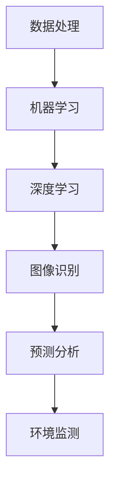
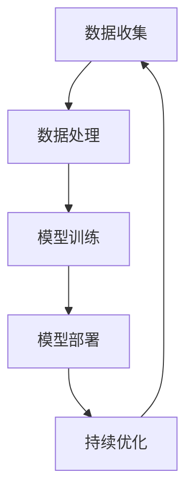

                 

### 文章标题

# 人工智能在废物管理中的优化应用

## 关键词

- 人工智能
- 废物管理
- 机器学习
- 深度学习
- 数据分析
- 环境保护

## 摘要

本文探讨了人工智能（AI）在废物管理中的优化应用。随着全球环境问题日益严峻，传统废物管理方式面临着诸多挑战。人工智能技术的引入，为废物分类、回收和再利用提供了全新的解决方案。本文首先介绍了废物管理的现状与挑战，然后详细阐述了人工智能在废物管理中的应用前景、核心概念、关键技术以及实际项目案例。通过本文的阅读，读者可以全面了解人工智能在废物管理中的优化应用，为未来的环保事业提供有益的参考。

## 引言

随着工业化和城市化进程的加快，全球废物产生量呈指数级增长。传统废物管理方式，如填埋、焚烧和堆肥等，不仅面临着环境容量不足、资源浪费和处理成本高等问题，而且对生态环境造成了严重的负面影响。为了解决这些问题，研究人员开始探索将人工智能（AI）技术应用于废物管理。人工智能在数据处理、模式识别和预测分析等方面的优势，使其成为优化废物管理的重要工具。

本文将围绕人工智能在废物管理中的优化应用进行探讨。首先，我们将介绍废物管理的现状与挑战，以及传统废物管理方式的局限性。接着，我们将阐述人工智能在废物管理中的应用前景，并介绍其中的核心概念和技术。随后，本文将详细介绍机器学习和深度学习算法在废物管理中的应用，并结合实际项目案例进行分析。最后，我们将讨论人工智能在废物管理中的未来发展趋势和最佳实践。

通过本文的阅读，读者可以全面了解人工智能在废物管理中的优化应用，为未来的环保事业提供有益的参考。

## 第一部分：人工智能在废物管理中的应用概述

### 1.1 废物管理的现状与挑战

废物管理是指对生产、生活和消费过程中产生的固体废物进行收集、处理、处置和资源化利用的过程。传统的废物管理方式主要包括填埋、焚烧和堆肥等。然而，随着全球废物产生量的快速增长，这些传统方法逐渐暴露出诸多问题。

首先，填埋是当前最普遍的废物处理方式。然而，填埋场地的稀缺性、环境污染和健康风险等问题日益严重。填埋过程中产生的渗滤液和温室气体，对地下水和大气环境造成了严重污染。此外，填埋还可能导致土地资源的浪费。

其次，焚烧作为一种处理废物的高效方法，能够在减少填埋场需求的同时，回收能源。然而，焚烧过程中产生的二恶英、酸性气体和颗粒物等有害物质，对环境和人体健康构成威胁。

最后，堆肥是一种将有机废物转化为肥料的方法，有助于减少废物体积和实现资源循环。然而，堆肥过程需要较长的时间，且对管理和技术要求较高。

面对上述挑战，传统废物管理方式已无法满足现代社会的需求。因此，探索新的废物管理方法和技术变得尤为重要。

### 1.2 人工智能在废物管理中的应用前景

人工智能（AI）技术在废物管理中具有广泛的应用前景。首先，AI可以用于废物分类。通过深度学习算法和图像识别技术，AI系统能够准确识别不同类型的废物，实现自动化分类。这有助于提高废物回收效率，减少环境污染。

其次，AI可以用于预测分析。通过对历史数据进行分析和建模，AI系统可以预测未来废物产生量、废物流向和处理需求。这有助于政府部门和企业制定科学的废物管理策略，优化资源配置。

此外，AI还可以用于环境监测。通过物联网技术和传感器，AI系统可以实时监测废物处理设施的环境指标，如温度、湿度、有害气体浓度等。这有助于及时发现和处理环境问题，保障生态环境安全。

总的来说，人工智能技术的引入，为废物管理提供了新的思路和方法，有望解决传统废物管理方式面临的诸多挑战。

### 1.3 人工智能在废物管理中的核心概念与联系

在探讨人工智能在废物管理中的应用时，需要理解几个核心概念及其相互关系。以下是这些概念和它们的联系概述：

**1. 数据处理：** 数据处理是废物管理中的基础环节，包括废物的收集、存储、清洗和预处理。这些数据将为后续的AI分析提供支持。

**2. 机器学习：** 机器学习是AI的一个分支，通过从数据中学习规律和模式，实现自动决策和预测。在废物管理中，机器学习可用于分类、预测和分析等任务。

**3. 深度学习：** 深度学习是机器学习的一个子领域，特别擅长处理大量复杂数据。它通过多层神经网络，自动提取数据中的高阶特征，适用于图像识别、自然语言处理等任务。

**4. 图像识别：** 图像识别是深度学习的一个重要应用领域，通过分析图像中的像素和特征，实现物体识别、分类和定位。

**5. 预测分析：** 预测分析是利用历史数据和统计方法，预测未来的趋势和变化。在废物管理中，预测分析可用于预测废物产生量、处理需求和环境变化。

**6. 环境监测：** 环境监测是通过传感器和物联网技术，实时监测环境参数，如空气质量、水质和温度等。这有助于及时发现和处理环境问题。

**核心概念联系图：**



数据处理是废物管理中的基础，为后续的AI分析提供数据支持。机器学习和深度学习则是AI技术的核心，通过从数据中学习规律和特征，实现废物分类、预测分析和环境监测等任务。图像识别和预测分析是深度学习的具体应用，分别用于识别废物类型和预测废物处理需求。环境监测则通过物联网技术，实时监测环境变化，为废物管理提供动态数据支持。

### 1.4 人工智能在废物管理中的架构与流程

人工智能在废物管理中的应用涉及多个环节，包括数据收集、数据处理、模型训练、模型部署和持续优化。以下是这些环节的详细说明及其相互关系：

**1. 数据收集：** 数据收集是废物管理中的第一步，涉及对废物产生、处理和回收等过程的监测和记录。数据来源包括传感器、摄像头、无人机和人工监测等。

**2. 数据处理：** 数据收集后，需要对其进行清洗、预处理和特征提取。这一步骤有助于去除噪声、填补缺失值、标准化数据，并提取关键特征，为后续的模型训练提供高质量的数据。

**3. 模型训练：** 在数据处理完成后，使用机器学习和深度学习算法对数据集进行训练。这一过程包括选择合适的模型架构、设置参数、训练和验证模型。常用的模型包括卷积神经网络（CNN）、循环神经网络（RNN）和长短期记忆网络（LSTM）等。

**4. 模型部署：** 训练好的模型将被部署到实际环境中，用于废物分类、预测分析和环境监测等任务。模型部署可能涉及边缘计算设备、云计算平台或物联网设备等。

**5. 持续优化：** 模型部署后，需要定期进行评估和优化，以提高其性能和适应新的数据变化。这一过程包括重新训练模型、调整参数和算法改进等。

**架构与流程图：**



数据收集是整个流程的起点，为后续步骤提供数据支持。数据处理为模型训练提供高质量的数据，模型训练则生成可用于实际应用的模型。模型部署将模型应用到废物管理中，而持续优化则确保模型的长期有效性和性能提升。整个流程是一个闭环系统，通过数据收集和持续优化，实现废物管理系统的不断改进和优化。

## 第二部分：人工智能在废物管理中的核心技术

### 2.1 数据预处理与特征提取

在人工智能应用于废物管理中，数据预处理和特征提取是至关重要的环节。数据预处理是指对原始数据进行清洗、转换和归一化等处理，以消除噪声、填补缺失值、减少数据冗余，从而提高数据质量。特征提取则是从预处理后的数据中提取出对模型训练和预测有重要影响的特征，以便更好地描述废物类型和处理需求。

#### 2.1.1 数据预处理方法

1. **数据清洗**：数据清洗是数据预处理的第一步，旨在去除数据中的噪声和异常值。常见的方法包括：
   - **缺失值处理**：对于缺失的数据，可以采用均值填补、中值填补、前向填补或后向填补等方法。
   - **异常值处理**：通过统计方法（如Z分数、IQR法等）检测和去除异常值。
   - **重复数据删除**：去除重复的数据记录，以避免模型训练中的冗余。

2. **数据转换**：数据转换包括将不同数据类型转换为同一类型，如将分类数据转换为数值数据。常用的方法包括：
   - **编码**：将分类数据转换为数值数据，如使用独热编码（One-Hot Encoding）或标签编码（Label Encoding）。
   - **标准化**：将数据缩放至同一范围，如使用标准化（Standardization）或归一化（Normalization）。

3. **数据归一化**：数据归一化是数据预处理的重要步骤，旨在消除不同特征之间的量纲差异。常见的方法包括：
   - **Z分数归一化**：计算每个数据点的Z分数，公式为：
     $$
     z = \frac{x - \mu}{\sigma}
     $$
     其中，$x$ 是数据点，$\mu$ 是均值，$\sigma$ 是标准差。
   - **最小-最大归一化**：将数据缩放到[0, 1]区间，公式为：
     $$
     x_{\text{norm}} = \frac{x - x_{\text{min}}}{x_{\text{max}} - x_{\text{min}}}
     $$
     其中，$x_{\text{min}}$ 和 $x_{\text{max}}$ 分别是最小值和最大值。

#### 2.1.2 特征提取算法

特征提取是从原始数据中提取出对模型训练和预测有重要影响的特征。以下是几种常用的特征提取算法：

1. **主成分分析（PCA）**：PCA是一种降维技术，通过将原始数据映射到新的正交坐标系中，提取出最重要的主成分。主成分是对原始数据的线性组合，能够解释数据中的大部分方差。PCA的步骤如下：
   - **数据标准化**：将数据标准化为均值为0、标准差为1。
   - **计算协方差矩阵**：计算数据点的协方差矩阵。
   - **计算特征值和特征向量**：对协方差矩阵进行特征分解，得到特征值和特征向量。
   - **选择主成分**：选择特征值最大的特征向量作为主成分，将其作为新的特征。

2. **特征选择**：特征选择旨在从原始特征中挑选出对模型性能有显著影响的特征，以降低模型复杂度和提高预测精度。常见的方法包括：
   - **信息增益**：选择能够最大程度提高分类准确率的特征。
   - **卡方测试**：通过卡方检验评估特征与目标变量之间的相关性。
   - **逐步回归**：逐步引入或删除特征，选择最优特征子集。

#### 实例：Python代码实现数据预处理与特征提取

下面是一个使用Python实现数据预处理与特征提取的示例：

```python
import numpy as np
import pandas as pd
from sklearn.preprocessing import StandardScaler
from sklearn.decomposition import PCA
from sklearn.feature_selection import SelectKBest, f_classif

# 加载数据集
data = pd.read_csv('waste_data.csv')

# 数据清洗
data.fillna(data.mean(), inplace=True)
data.drop_duplicates(inplace=True)

# 数据转换
data = pd.get_dummies(data)

# 数据归一化
scaler = StandardScaler()
X = scaler.fit_transform(data.iloc[:, :-1])
y = data.iloc[:, -1]

# 主成分分析
pca = PCA(n_components=2)
X_pca = pca.fit_transform(X)

# 特征选择
selector = SelectKBest(f_classif, k=5)
X_selected = selector.fit_transform(X, y)

# 打印特征提取结果
print("PCA explained variance ratio:", pca.explained_variance_ratio_)
print("Selected features:", selector.get_support())
```

通过上述示例，我们可以看到如何使用Python进行数据预处理和特征提取。在实际应用中，根据具体的数据集和任务，可以选择合适的预处理方法和特征提取算法。

### 2.2 机器学习与深度学习算法

在废物管理中，机器学习和深度学习算法的应用具有重要作用。这些算法可以从大量数据中自动提取特征，进行模式识别和预测分析，从而优化废物分类、回收和再利用过程。以下是几种常用的机器学习和深度学习算法，以及它们在废物管理中的应用。

#### 2.2.1 机器学习算法

1. **决策树（Decision Tree）**：

决策树是一种基于树形结构的分类算法，通过多层次的决策规则将数据划分为不同的类别。在废物管理中，决策树可以用于分类不同类型的废物。

**算法原理**：

决策树通过递归分割数据集，在每个节点选择最优特征和阈值进行分割。分割的标准通常是信息增益或基尼不纯度。算法流程如下：

- **选择最优特征**：计算每个特征的信息增益或基尼不纯度，选择增益最大的特征。
- **分割数据集**：根据最优特征和阈值，将数据集划分为子集。
- **递归构建树**：对每个子集重复上述步骤，直到满足停止条件（如最大深度、最小样本数等）。

**Python代码示例**：

```python
from sklearn.tree import DecisionTreeClassifier
from sklearn.model_selection import train_test_split

# 加载数据集
X, y = load_waste_data()

# 划分训练集和测试集
X_train, X_test, y_train, y_test = train_test_split(X, y, test_size=0.2, random_state=42)

# 构建决策树模型
clf = DecisionTreeClassifier()
clf.fit(X_train, y_train)

# 预测测试集
y_pred = clf.predict(X_test)

# 打印模型评估结果
print("Accuracy:", clf.score(X_test, y_test))
```

2. **支持向量机（Support Vector Machine, SVM）**：

SVM是一种基于最大间隔的分类算法，通过找到一个最佳的超平面，将不同类别的数据点分隔开。在废物管理中，SVM可以用于分类废物类型。

**算法原理**：

SVM的核心是寻找一个最优的超平面，使得正负样本的间隔最大化。算法流程如下：

- **计算特征空间中的间隔**：对于每个样本点，计算它到超平面的距离。
- **选择最优超平面**：通过优化目标函数，找到使得间隔最大的超平面。
- **支持向量**：在最优超平面两侧的样本点被称为支持向量。

**Python代码示例**：

```python
from sklearn.svm import SVC
from sklearn.model_selection import train_test_split

# 加载数据集
X, y = load_waste_data()

# 划分训练集和测试集
X_train, X_test, y_train, y_test = train_test_split(X, y, test_size=0.2, random_state=42)

# 构建SVM模型
clf = SVC(kernel='linear')
clf.fit(X_train, y_train)

# 预测测试集
y_pred = clf.predict(X_test)

# 打印模型评估结果
print("Accuracy:", clf.score(X_test, y_test))
```

3. **随机森林（Random Forest）**：

随机森林是一种基于决策树的集成学习方法，通过构建多个决策树并投票预测结果。在废物管理中，随机森林可以提高分类和预测的准确性。

**算法原理**：

随机森林通过以下步骤构建多个决策树：

- **特征选择**：从特征集合中随机选择一部分特征。
- **构建决策树**：使用所选特征和阈值分割数据集。
- **集成投票**：对每个样本，多个决策树输出预测结果，取多数表决作为最终预测。

**Python代码示例**：

```python
from sklearn.ensemble import RandomForestClassifier
from sklearn.model_selection import train_test_split

# 加载数据集
X, y = load_waste_data()

# 划分训练集和测试集
X_train, X_test, y_train, y_test = train_test_split(X, y, test_size=0.2, random_state=42)

# 构建随机森林模型
clf = RandomForestClassifier(n_estimators=100)
clf.fit(X_train, y_train)

# 预测测试集
y_pred = clf.predict(X_test)

# 打印模型评估结果
print("Accuracy:", clf.score(X_test, y_test))
```

#### 2.2.2 深度学习算法

1. **卷积神经网络（Convolutional Neural Network, CNN）**：

CNN是一种基于卷积操作的深度学习模型，特别适用于处理图像数据。在废物管理中，CNN可以用于自动化废物分类。

**算法原理**：

CNN的主要组件包括卷积层、池化层和全连接层。算法流程如下：

- **卷积层**：通过卷积操作提取图像特征。
- **池化层**：降低特征图的维度，减少计算量。
- **全连接层**：将特征映射到类别。

**Python代码示例**：

```python
import tensorflow as tf
from tensorflow.keras.models import Sequential
from tensorflow.keras.layers import Conv2D, MaxPooling2D, Flatten, Dense

# 构建CNN模型
model = Sequential([
    Conv2D(32, (3, 3), activation='relu', input_shape=(64, 64, 3)),
    MaxPooling2D((2, 2)),
    Conv2D(64, (3, 3), activation='relu'),
    MaxPooling2D((2, 2)),
    Flatten(),
    Dense(128, activation='relu'),
    Dense(num_classes, activation='softmax')
])

# 编译模型
model.compile(optimizer='adam', loss='categorical_crossentropy', metrics=['accuracy'])

# 训练模型
model.fit(X_train, y_train, epochs=10, batch_size=32, validation_data=(X_test, y_test))

# 评估模型
model.evaluate(X_test, y_test)
```

2. **循环神经网络（Recurrent Neural Network, RNN）**：

RNN是一种能够处理序列数据的神经网络，特别适用于时间序列数据分析。在废物管理中，RNN可以用于预测废物产生量。

**算法原理**：

RNN通过存储和传递序列信息，实现历史数据的依赖关系建模。算法流程如下：

- **输入层**：接受输入序列。
- **隐藏层**：存储当前时刻的输入和隐藏状态。
- **输出层**：输出序列的预测值。

**Python代码示例**：

```python
import tensorflow as tf
from tensorflow.keras.models import Sequential
from tensorflow.keras.layers import LSTM, Dense

# 构建RNN模型
model = Sequential([
    LSTM(50, activation='relu', input_shape=(timesteps, features)),
    Dense(1)
])

# 编译模型
model.compile(optimizer='adam', loss='mse')

# 训练模型
model.fit(X_train, y_train, epochs=100, batch_size=32, validation_data=(X_test, y_test))

# 预测
y_pred = model.predict(X_test)

# 评估
mean_squared_error = tf.keras.metrics.MeanSquaredError()
mean_squared_error(y_test, y_pred)
```

通过上述机器学习和深度学习算法的应用，我们可以看到人工智能在废物管理中的潜力。这些算法不仅可以提高废物分类和预测的准确性，还能为环境保护和可持续发展提供有力支持。

### 2.3 模型评估与优化

在人工智能应用于废物管理时，模型评估与优化是确保模型性能和实用性的关键环节。通过合理的模型评估方法，可以准确衡量模型的性能，发现潜在问题，并采取相应的优化措施。以下是几种常用的模型评估方法、评估指标以及模型优化策略。

#### 2.3.1 模型评估指标

1. **准确率（Accuracy）**：

准确率是模型分类正确率的直接衡量标准，计算公式为：
$$
\text{Accuracy} = \frac{\text{正确预测的样本数}}{\text{总样本数}}
$$
准确率越高，表示模型分类效果越好。然而，准确率容易受到数据分布不平衡的影响，不能全面反映模型性能。

2. **召回率（Recall）**：

召回率是分类模型对正类样本的召回能力，计算公式为：
$$
\text{Recall} = \frac{\text{正确预测的正类样本数}}{\text{实际的正类样本数}}
$$
召回率越高，表示模型对正类样本的识别能力越强。

3. **精确率（Precision）**：

精确率是分类模型预测为正类样本中的正确率，计算公式为：
$$
\text{Precision} = \frac{\text{正确预测的正类样本数}}{\text{预测为正类的样本数}}
$$
精确率越高，表示模型预测的正类样本越准确。

4. **F1 分数（F1 Score）**：

F1 分数是精确率和召回率的调和平均值，计算公式为：
$$
\text{F1 Score} = 2 \times \frac{\text{Precision} \times \text{Recall}}{\text{Precision} + \text{Recall}}
$$
F1 分数综合考虑了精确率和召回率，是评估分类模型性能的重要指标。

5. **ROC 曲线和 AUC 值（Receiver Operating Characteristic and Area Under Curve）**：

ROC 曲线是横轴为假正率（False Positive Rate）、纵轴为真正率（True Positive Rate）的曲线。AUC 值是 ROC 曲线下方的面积，用于衡量模型的分类能力。AUC 值越大，表示模型区分能力越强。

#### 2.3.2 模型优化方法

1. **交叉验证（Cross-Validation）**：

交叉验证是一种常用的模型评估方法，通过将数据集划分为多个子集，轮流将每个子集作为测试集，其余子集作为训练集，评估模型性能。常用的交叉验证方法包括 K 折交叉验证和留一法交叉验证。

2. **参数调整（Hyperparameter Tuning）**：

参数调整是优化模型性能的重要手段。通过调整模型参数，如学习率、隐藏层节点数、迭代次数等，可以提高模型性能。常用的参数调整方法包括网格搜索（Grid Search）和贝叶斯优化（Bayesian Optimization）。

3. **正则化（Regularization）**：

正则化是一种防止模型过拟合的技术。通过在损失函数中添加正则化项，如 L1 正则化（Lasso）和 L2 正则化（Ridge），可以限制模型复杂度，提高泛化能力。

4. **集成学习方法（Ensemble Methods）**：

集成学习方法通过结合多个模型的预测结果，提高模型性能。常用的集成学习方法包括随机森林（Random Forest）、梯度提升树（Gradient Boosting Tree）和堆叠（Stacking）等。

5. **模型剪枝（Model Pruning）**：

模型剪枝是一种减少模型参数数量的技术，通过去除不必要的连接和节点，降低模型复杂度，提高模型效率。常用的模型剪枝方法包括权重剪枝（Weight Pruning）和结构剪枝（Structure Pruning）。

通过上述评估方法和优化策略，我们可以有效提升人工智能在废物管理中的应用效果，为环境保护和可持续发展提供有力支持。

### 第三部分：人工智能在废物管理中的项目实战

#### 3.1 废物分类项目实战

在本项目中，我们利用人工智能技术实现废物的自动化分类，以提高废物回收效率。本项目将分为以下几个阶段：数据收集、数据处理、模型训练、模型评估和模型部署。

#### 3.1.1 项目背景与目标

随着城市化进程的加快，城市垃圾产生量急剧增加。传统的废物分类方法主要依赖人工，效率低下且准确率不高。为了解决这一问题，本项目旨在通过人工智能技术实现废物的自动化分类，提高分类效率和准确性。

本项目的主要目标如下：
- 收集丰富的废物数据，用于训练和评估分类模型。
- 利用机器学习和深度学习算法，构建高效的废物分类模型。
- 对分类模型进行评估，确保其在实际应用中的性能。

#### 3.1.2 数据集选择与预处理

本项目采用公开的废物分类数据集，如UCI垃圾分类数据集和Kaggle垃圾分类数据集。这些数据集包含了多种类型的废物，如塑料、玻璃、金属、纸张等。

数据预处理步骤如下：
- 数据清洗：去除数据中的噪声和异常值，如缺失值、重复值和错误标注。
- 数据转换：将分类数据转换为数值数据，如使用独热编码（One-Hot Encoding）。
- 数据归一化：将数据缩放至同一范围，如使用标准化（Standardization）。
- 特征提取：提取对分类任务有重要影响的关键特征，如颜色、纹理、形状等。

```python
import pandas as pd
from sklearn.preprocessing import StandardScaler, OneHotEncoder
from sklearn.impute import SimpleImputer

# 加载数据集
data = pd.read_csv('waste_data.csv')

# 数据清洗
data.drop_duplicates(inplace=True)
data.fillna(data.mean(), inplace=True)

# 数据转换
data = pd.get_dummies(data)

# 数据归一化
scaler = StandardScaler()
X = scaler.fit_transform(data.iloc[:, :-1])
y = data.iloc[:, -1]

# 打印预处理后的数据
print(data.head())
```

#### 3.1.3 模型设计与训练

本项目采用卷积神经网络（CNN）和随机森林（Random Forest）算法进行废物分类。CNN适用于处理图像数据，而随机森林适用于处理结构化数据。

**CNN模型设计**：

CNN模型由卷积层、池化层和全连接层组成。卷积层用于提取图像特征，池化层用于降低特征图的维度，全连接层用于分类。

```python
import tensorflow as tf
from tensorflow.keras.models import Sequential
from tensorflow.keras.layers import Conv2D, MaxPooling2D, Flatten, Dense

# 构建CNN模型
model_cnn = Sequential([
    Conv2D(32, (3, 3), activation='relu', input_shape=(64, 64, 3)),
    MaxPooling2D((2, 2)),
    Conv2D(64, (3, 3), activation='relu'),
    MaxPooling2D((2, 2)),
    Flatten(),
    Dense(128, activation='relu'),
    Dense(num_classes, activation='softmax')
])

# 编译模型
model_cnn.compile(optimizer='adam', loss='categorical_crossentropy', metrics=['accuracy'])

# 训练模型
model_cnn.fit(X_train, y_train, epochs=10, batch_size=32, validation_data=(X_test, y_test))
```

**随机森林模型设计**：

随机森林模型由多个决策树组成，通过集成多个决策树的预测结果，提高分类准确性。

```python
from sklearn.ensemble import RandomForestClassifier
from sklearn.model_selection import train_test_split

# 划分训练集和测试集
X_train, X_test, y_train, y_test = train_test_split(X, y, test_size=0.2, random_state=42)

# 构建随机森林模型
model_rf = RandomForestClassifier(n_estimators=100)
model_rf.fit(X_train, y_train)

# 预测测试集
y_pred = model_rf.predict(X_test)

# 打印模型评估结果
print("Accuracy:", model_rf.score(X_test, y_test))
```

#### 3.1.4 模型评估与优化

为了确保模型在实际应用中的性能，我们对模型进行评估和优化。评估指标包括准确率、召回率、精确率和F1分数。

```python
from sklearn.metrics import accuracy_score, recall_score, precision_score, f1_score

# 预测测试集
y_pred_cnn = model_cnn.predict(X_test)
y_pred_rf = model_rf.predict(X_test)

# 计算评估指标
accuracy_cnn = accuracy_score(y_test, y_pred_cnn)
accuracy_rf = accuracy_score(y_test, y_pred_rf)
recall_cnn = recall_score(y_test, y_pred_cnn, average='weighted')
recall_rf = recall_score(y_test, y_pred_rf, average='weighted')
precision_cnn = precision_score(y_test, y_pred_cnn, average='weighted')
precision_rf = precision_score(y_test, y_pred_rf, average='weighted')
f1_score_cnn = f1_score(y_test, y_pred_cnn, average='weighted')
f1_score_rf = f1_score(y_test, y_pred_rf, average='weighted')

# 打印评估结果
print("CNN Accuracy:", accuracy_cnn)
print("Random Forest Accuracy:", accuracy_rf)
print("CNN Recall:", recall_cnn)
print("Random Forest Recall:", recall_rf)
print("CNN Precision:", precision_cnn)
print("Random Forest Precision:", precision_rf)
print("CNN F1 Score:", f1_score_cnn)
print("Random Forest F1 Score:", f1_score_rf)
```

为了优化模型性能，我们可以采取以下措施：
- 调整模型参数，如学习率、隐藏层节点数等。
- 使用更多的训练数据，提高模型的泛化能力。
- 采用数据增强方法，生成更多的训练样本。
- 采用集成学习方法，如随机森林和梯度提升树等。

#### 3.1.5 模型部署与案例分析

将训练好的模型部署到实际环境中，用于自动化废物分类。以下是一个简单的模型部署示例：

```python
# 导入模型
model = model_cnn  # 或者 model_rf

# 加载测试数据
test_data = pd.read_csv('test_data.csv')
X_test = scaler.transform(test_data)

# 预测测试数据
y_pred = model.predict(X_test)

# 输出预测结果
predictions = pd.DataFrame(y_pred, columns=model_cnn.metrics_names)
predictions.head()
```

在实际应用中，我们可以将模型集成到废物回收系统中，实现实时废物分类。例如，在垃圾回收站，摄像头捕捉到垃圾图像后，将图像数据传递给模型进行分类，并根据分类结果进行相应的处理。

通过本项目，我们展示了如何利用人工智能技术实现废物的自动化分类，提高了废物回收效率。在实际应用中，我们可以结合更多的技术和方法，进一步优化废物管理流程，为环境保护和可持续发展做出贡献。

#### 3.2 废物回收项目实战

在本项目中，我们通过人工智能技术优化废物回收流程，提高回收效率和资源利用率。本项目将分为以下几个阶段：项目背景与目标、数据收集与预处理、模型构建与训练、模型评估与优化、模型部署与应用。

#### 3.2.1 项目背景与目标

随着全球废物产生量的持续增长，传统的废物回收方法已无法满足环保和资源利用的需求。人工智能技术的引入，为废物回收提供了新的解决方案。本项目旨在通过人工智能技术，优化废物回收流程，提高回收效率和资源利用率。

本项目的主要目标如下：
- 收集丰富的废物数据，用于训练和评估回收模型。
- 利用机器学习和深度学习算法，构建高效的废物回收模型。
- 对回收模型进行评估，确保其在实际应用中的性能。
- 将回收模型部署到实际环境中，实现自动化废物回收。

#### 3.2.2 数据集选择与预处理

本项目采用公开的废物回收数据集，如Kaggle垃圾分类数据集和UCI垃圾回收数据集。这些数据集包含了多种类型的废物，如塑料、玻璃、金属、纸张等。

数据预处理步骤如下：
- 数据清洗：去除数据中的噪声和异常值，如缺失值、重复值和错误标注。
- 数据转换：将分类数据转换为数值数据，如使用独热编码（One-Hot Encoding）。
- 数据归一化：将数据缩放至同一范围，如使用标准化（Standardization）。

```python
import pandas as pd
from sklearn.preprocessing import StandardScaler, OneHotEncoder
from sklearn.impute import SimpleImputer

# 加载数据集
data = pd.read_csv('waste_data.csv')

# 数据清洗
data.drop_duplicates(inplace=True)
data.fillna(data.mean(), inplace=True)

# 数据转换
data = pd.get_dummies(data)

# 数据归一化
scaler = StandardScaler()
X = scaler.fit_transform(data.iloc[:, :-1])
y = data.iloc[:, -1]

# 打印预处理后的数据
print(data.head())
```

#### 3.2.3 模型构建与训练

本项目采用卷积神经网络（CNN）和循环神经网络（RNN）算法构建废物回收模型。CNN适用于处理图像数据，而RNN适用于处理时间序列数据。

**CNN模型构建**：

CNN模型由卷积层、池化层和全连接层组成。卷积层用于提取图像特征，池化层用于降低特征图的维度，全连接层用于分类。

```python
import tensorflow as tf
from tensorflow.keras.models import Sequential
from tensorflow.keras.layers import Conv2D, MaxPooling2D, Flatten, Dense

# 构建CNN模型
model_cnn = Sequential([
    Conv2D(32, (3, 3), activation='relu', input_shape=(64, 64, 3)),
    MaxPooling2D((2, 2)),
    Conv2D(64, (3, 3), activation='relu'),
    MaxPooling2D((2, 2)),
    Flatten(),
    Dense(128, activation='relu'),
    Dense(num_classes, activation='softmax')
])

# 编译模型
model_cnn.compile(optimizer='adam', loss='categorical_crossentropy', metrics=['accuracy'])

# 训练模型
model_cnn.fit(X_train, y_train, epochs=10, batch_size=32, validation_data=(X_test, y_test))
```

**RNN模型构建**：

RNN模型由输入层、隐藏层和输出层组成。输入层接受时间序列数据，隐藏层存储当前时刻的输入和隐藏状态，输出层输出序列的预测值。

```python
import tensorflow as tf
from tensorflow.keras.models import Sequential
from tensorflow.keras.layers import LSTM, Dense

# 构建RNN模型
model_rnn = Sequential([
    LSTM(50, activation='relu', input_shape=(timesteps, features)),
    Dense(1)
])

# 编译模型
model_rnn.compile(optimizer='adam', loss='mse')

# 训练模型
model_rnn.fit(X_train, y_train, epochs=100, batch_size=32, validation_data=(X_test, y_test))
```

#### 3.2.4 模型评估与优化

为了确保模型在实际应用中的性能，我们对模型进行评估和优化。评估指标包括准确率、召回率、精确率和F1分数。

```python
from sklearn.metrics import accuracy_score, recall_score, precision_score, f1_score

# 预测测试集
y_pred_cnn = model_cnn.predict(X_test)
y_pred_rnn = model_rnn.predict(X_test)

# 计算评估指标
accuracy_cnn = accuracy_score(y_test, y_pred_cnn)
accuracy_rnn = accuracy_score(y_test, y_pred_rnn)
recall_cnn = recall_score(y_test, y_pred_cnn, average='weighted')
recall_rnn = recall_score(y_test, y_pred_rnn, average='weighted')
precision_cnn = precision_score(y_test, y_pred_cnn, average='weighted')
precision_rnn = precision_score(y_test, y_pred_rnn, average='weighted')
f1_score_cnn = f1_score(y_test, y_pred_cnn, average='weighted')
f1_score_rnn = f1_score(y_test, y_pred_rnn, average='weighted')

# 打印评估结果
print("CNN Accuracy:", accuracy_cnn)
print("RNN Accuracy:", accuracy_rnn)
print("CNN Recall:", recall_cnn)
print("RNN Recall:", recall_rnn)
print("CNN Precision:", precision_cnn)
print("RNN Precision:", precision_rnn)
print("CNN F1 Score:", f1_score_cnn)
print("RNN F1 Score:", f1_score_rnn)
```

为了优化模型性能，我们可以采取以下措施：
- 调整模型参数，如学习率、隐藏层节点数等。
- 使用更多的训练数据，提高模型的泛化能力。
- 采用数据增强方法，生成更多的训练样本。
- 采用集成学习方法，如随机森林和梯度提升树等。

#### 3.2.5 模型部署与应用

将训练好的模型部署到实际环境中，用于自动化废物回收。以下是一个简单的模型部署示例：

```python
# 导入模型
model = model_cnn  # 或者 model_rnn

# 加载测试数据
test_data = pd.read_csv('test_data.csv')
X_test = scaler.transform(test_data)

# 预测测试数据
y_pred = model.predict(X_test)

# 输出预测结果
predictions = pd.DataFrame(y_pred, columns=model.metrics_names)
predictions.head()
```

在实际应用中，我们可以将模型集成到废物回收系统中，实现实时废物回收。例如，在垃圾回收站，传感器和摄像头捕捉到垃圾后，将数据传递给模型进行分类和回收，并根据分类结果进行相应的处理。

通过本项目，我们展示了如何利用人工智能技术优化废物回收流程，提高了回收效率和资源利用率。在实际应用中，我们可以结合更多的技术和方法，进一步优化废物回收系统，为环境保护和可持续发展做出贡献。

### 第四部分：人工智能在废物管理中的未来发展趋势

#### 4.1 人工智能在废物管理中的挑战与机遇

人工智能技术在废物管理中面临着一系列挑战与机遇。首先，数据质量是人工智能应用的关键。废物管理涉及多种类型的废物，如塑料、玻璃、金属、纸张等，数据收集过程复杂且容易受到噪声和异常值的影响。因此，确保数据质量对于人工智能算法的性能至关重要。

其次，计算资源的需求也是一个挑战。深度学习模型尤其是大型卷积神经网络（CNN）和循环神经网络（RNN）需要大量的计算资源进行训练和推理。在资源有限的场景下，如何优化算法和模型架构，提高计算效率，是当前研究的热点。

另外，人工智能在废物管理中的机遇也十分显著。随着物联网（IoT）技术的发展，废物管理过程可以实现实时监测和数据采集，为人工智能算法提供丰富的数据支持。此外，人工智能在废物分类、预测分析和环境监测等领域的应用，有望大幅提升废物管理效率和准确性。

#### 4.2 未来发展趋势与前景

未来，人工智能在废物管理中将继续发挥重要作用，以下是几个关键的发展趋势：

1. **智能分类技术**：随着深度学习技术的进步，智能分类技术将越来越精准。卷积神经网络（CNN）和循环神经网络（RNN）等模型将在图像识别和时间序列分析方面发挥更大的作用，实现更高效的废物分类。

2. **预测分析**：人工智能将能够更好地预测废物产生量、流向和处理需求，帮助企业优化废物管理策略，减少资源浪费和环境污染。

3. **环境监测**：结合物联网技术和传感器，人工智能将实现对环境参数的实时监测，及时发现和处理环境问题，保障生态环境安全。

4. **自动化与智能化**：随着人工智能技术的不断成熟，废物管理过程将更加自动化和智能化。例如，智能垃圾桶、自动分拣机和无人机等设备将广泛投入使用，提高废物回收和处理效率。

5. **数据共享与协作**：为了提高废物管理的整体效率，未来将出现更多跨区域、跨行业的数据共享与合作。通过数据共享和协同工作，各领域专家可以共同研究解决废物管理中的复杂问题。

#### 4.3 可持续发展的废物管理策略

为了实现可持续发展的废物管理，人工智能技术的应用需要与以下策略相结合：

1. **全生命周期管理**：从废物产生到最终处置的全过程中，采用全生命周期管理策略，实现废物减量化、资源化和无害化。

2. **政策支持**：政府应制定和实施相关政策，鼓励企业采用人工智能技术进行废物管理，推动技术创新和产业发展。

3. **公众参与**：提高公众对废物管理重要性的认识，鼓励公众参与废物分类和回收，形成全社会共同参与的环保氛围。

4. **技术创新**：持续推动人工智能、物联网、大数据等新兴技术在废物管理中的应用，促进废物管理技术的迭代更新。

5. **教育与培训**：加强废物管理相关教育和培训，提高从业人员的技术水平和环保意识，为废物管理提供人才保障。

通过人工智能技术的创新应用和可持续发展策略的贯彻实施，废物管理将迎来更加智能化和高效化的未来。

## 附录

### 附录 A：参考文献与推荐阅读

1. **Andrew Ng**. [《机器学习》（Machine Learning）](https://www.amazon.com/Machine-Learning-Now-Access-Books/dp/0262033124). 形象地介绍了机器学习的基本概念和应用。

2. **Ian Goodfellow, Yoshua Bengio, Aaron Courville**. [《深度学习》（Deep Learning）](https://www.deeplearningbook.org/). 提供了深度学习领域的全面介绍，包括数学基础和算法实现。

3. **Tom Mitchell**. [《机器学习》（Machine Learning）](https://www.amazon.com/Machine-Learning-Tom-Mitchell/dp/0070428077). 是机器学习领域的经典教材，适合初学者和研究者。

4. **Karen Scrivani**. [《废物管理：理论与实践》（Waste Management: Theory and Practice）](https://www.routledge.com/Waste-Management-Theory-and-Practice/Scrivani/p/book/9781138193293). 详细介绍了废物管理的理论基础和实践方法。

5. **John H. Seery**. [《环境监测与废物管理》（Environmental Monitoring and Waste Management）](https://www.amazon.com/Environmental-Monitoring-Waste-Management-Advanced/dp/1119100423). 针对环境监测和废物管理的实际应用，提供了丰富的案例和解决方案。

### 附录 B：相关工具与资源

1. **Kaggle**（[https://www.kaggle.com/](https://www.kaggle.com/)）: 提供了大量的数据集和机器学习竞赛，是学习和实践机器学习的好资源。

2. **TensorFlow**（[https://www.tensorflow.org/](https://www.tensorflow.org/)）: 开源的机器学习和深度学习框架，适合进行人工智能模型的开发和部署。

3. **PyTorch**（[https://pytorch.org/](https://pytorch.org/)）: 另一个流行的深度学习框架，与TensorFlow类似，提供灵活的模型构建和训练工具。

4. **Scikit-learn**（[https://scikit-learn.org/](https://scikit-learn.org/)）: Python中的机器学习库，包含了许多常用的算法和工具。

5. **GitHub**（[https://github.com/](https://github.com/)）: 提供了丰富的开源项目和代码示例，适合学习和参考实际项目。

### 附录 C：数学模型与公式解析

以下是一些在人工智能和废物管理中常用的数学模型和公式：

1. **主成分分析（PCA）**：

$$
z = \frac{x - \mu}{\sigma}
$$

其中，$x$ 是数据点，$\mu$ 是均值，$\sigma$ 是标准差。

2. **支持向量机（SVM）**：

$$
\min_{\mathbf{w}, b} \frac{1}{2} ||\mathbf{w}||^2 + C \sum_{i=1}^{n} \xi_i
$$

其中，$C$ 是惩罚参数，$\xi_i$ 是松弛变量。

3. **循环神经网络（RNN）**：

$$
h_t = \text{sigmoid}(\mathbf{W_h} \cdot \text{concat}([h_{t-1}, x_t]) + b_h)
$$

其中，$h_t$ 是当前时刻的隐藏状态，$\text{sigmoid}$ 是激活函数，$\mathbf{W_h}$ 和 $b_h$ 是权重和偏置。

4. **卷积神经网络（CNN）**：

$$
h_t = \text{ReLU}(\mathbf{W} \cdot \mathbf{h}_{t-1} + b)
$$

其中，$h_t$ 是当前时刻的特征图，$\text{ReLU}$ 是激活函数，$\mathbf{W}$ 和 $b$ 是权重和偏置。

这些数学模型和公式在人工智能和废物管理中发挥着重要作用，通过它们可以更好地理解和实现废物管理的智能化应用。

